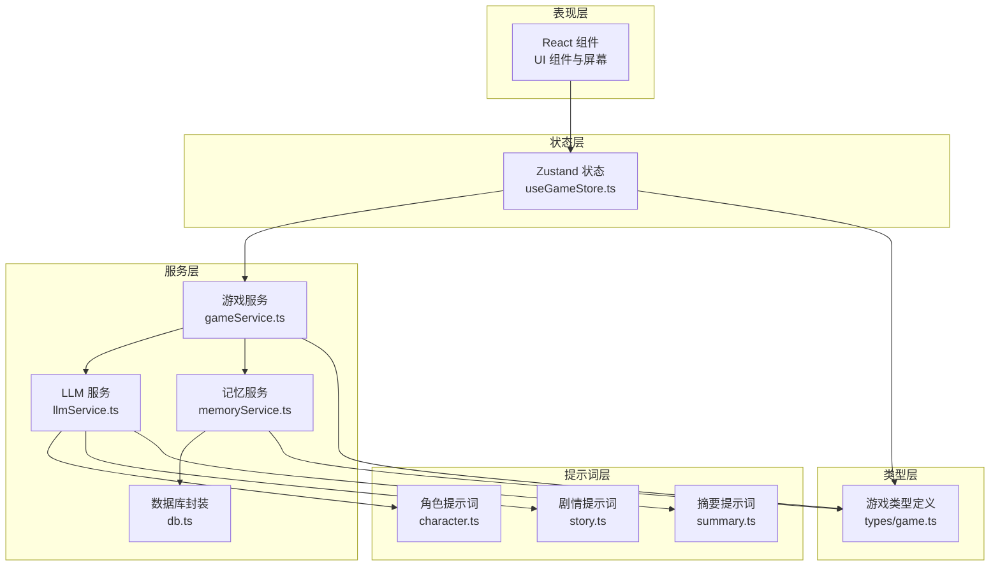
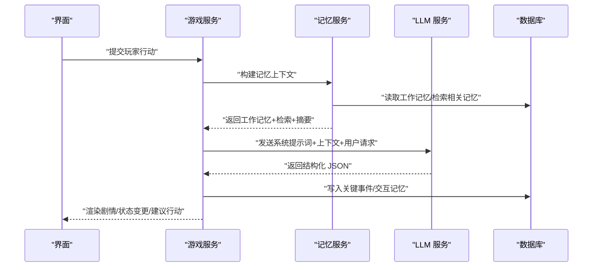
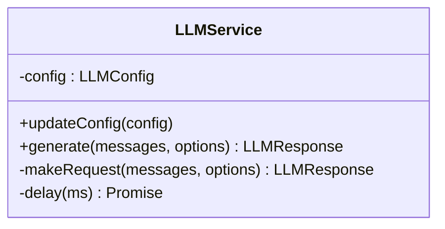
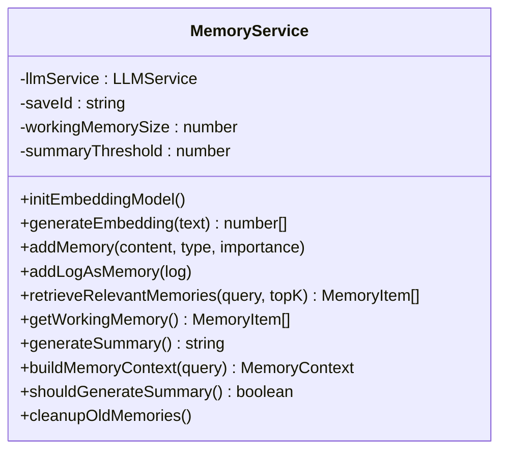
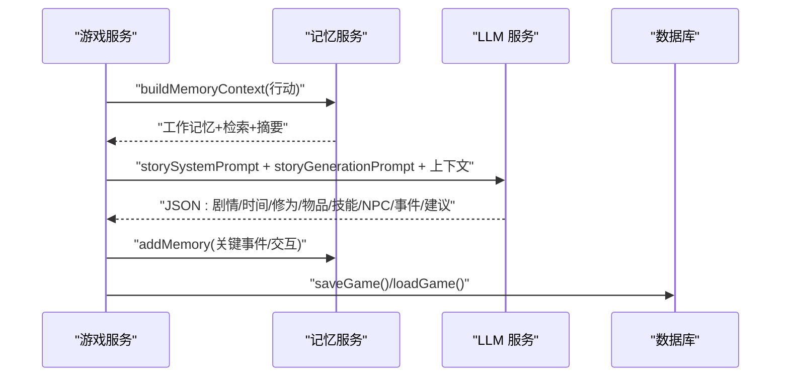
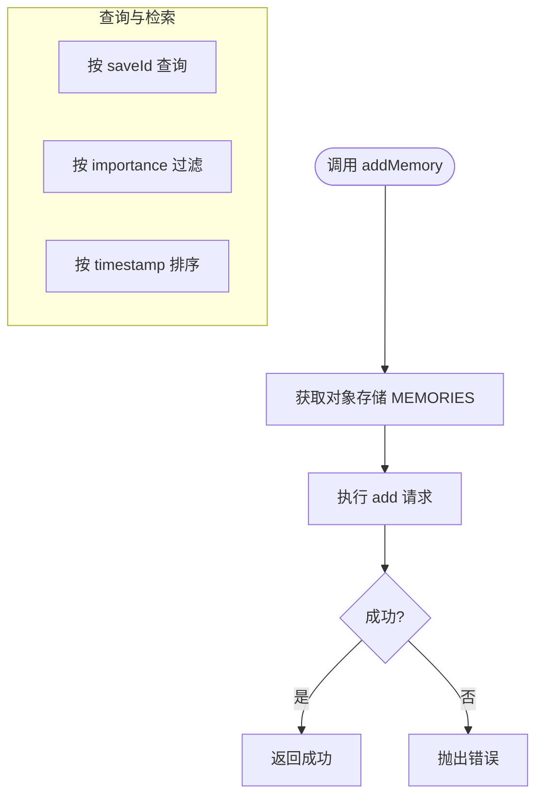
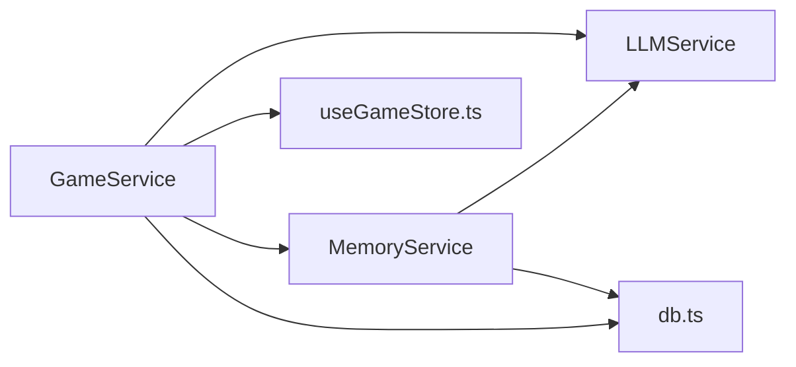

# AI 内容生成

<cite>
**本文引用的文件**
- [README.md](file://README.md)
- [AGENTS.md](file://AGENTS.md)
- [src/services/llmService.ts](file://src/services/llmService.ts)
- [src/services/memoryService.ts](file://src/services/memoryService.ts)
- [src/services/gameService.ts](file://src/services/gameService.ts)
- [src/services/db.ts](file://src/services/db.ts)
- [src/prompts/character.ts](file://src/prompts/character.ts)
- [src/prompts/story.ts](file://src/prompts/story.ts)
- [src/prompts/summary.ts](file://src/prompts/summary.ts)
- [src/types/game.ts](file://src/types/game.ts)
- [src/stores/useGameStore.ts](file://src/stores/useGameStore.ts)
</cite>

## 目录
1. [简介](#简介)
2. [项目结构](#项目结构)
3. [核心组件](#核心组件)
4. [架构总览](#架构总览)
5. [详细组件分析](#详细组件分析)
6. [依赖分析](#依赖分析)
7. [性能考虑](#性能考虑)
8. [故障排查指南](#故障排查指南)
9. [结论](#结论)
10. [附录](#附录)

## 简介
本项目是一个纯前端的修仙主题 Roguelike 游戏，完全由大语言模型（LLM）实时驱动内容生成。AI 内容生成贯穿角色创建、剧情推进、NPC 对话、世界描述、物品与功法生成等核心玩法，配合三层记忆系统（工作记忆、摘要记忆、RAG 检索）实现上下文连贯与一致性维护。本文档系统化阐述 AI 生成的技术架构、质量控制机制、不同场景策略差异、性能优化策略，并给出实际游戏场景示例，帮助开发者与运营人员全面理解并高效迭代 AI 驱动的修仙世界。

## 项目结构
项目采用“提示词 + 服务层 + 类型 + 状态 + 数据库”的清晰分层组织：
- 提示词层：按功能拆分，分别覆盖角色、剧情、摘要等
- 服务层：LLM 服务、游戏服务、记忆服务、数据库封装
- 类型层：统一定义修仙世界的数据模型与枚举
- 状态层：Zustand 管理游戏全局状态与持久化
- 数据层：IndexedDB 存档与记忆片段，localStorage 存储设置

图表来源
- [src/stores/useGameStore.ts](file://src/stores/useGameStore.ts#L84-L225)
- [src/services/gameService.ts](file://src/services/gameService.ts#L50-L541)
- [src/services/llmService.ts](file://src/services/llmService.ts#L18-L101)
- [src/services/memoryService.ts](file://src/services/memoryService.ts#L16-L224)
- [src/services/db.ts](file://src/services/db.ts#L36-L236)
- [src/prompts/character.ts](file://src/prompts/character.ts#L1-L97)
- [src/prompts/story.ts](file://src/prompts/story.ts#L1-L147)
- [src/prompts/summary.ts](file://src/prompts/summary.ts#L1-L26)
- [src/types/game.ts](file://src/types/game.ts#L1-L319)

章节来源
- [README.md](file://README.md#L77-L97)
- [AGENTS.md](file://AGENTS.md#L225-L283)

## 核心组件
- LLM 服务：封装统一的 LLM 调用、重试与响应解析，支持温度、最大令牌、JSON 输出格式等参数
- 游戏服务：面向业务的 AI 生成编排器，负责角色创建、剧情推演、NPC 交互、区域 NPC 生成、存档与加载
- 记忆服务：三层记忆架构（工作记忆、摘要记忆、RAG 检索），支持嵌入向量、余弦相似度、重要性评分
- 数据库封装：IndexedDB 封装，提供存档、记忆增删查与索引查询
- 提示词：角色生成、剧情推演、记忆摘要三类提示词，均要求返回 JSON 结构
- 类型定义：统一的修仙世界数据模型，包括角色、NPC、物品、技能、记忆、时间等
- 状态管理：Zustand 管理玩家、世界、日志、事件、记忆、回合数、加载状态等

章节来源
- [src/services/llmService.ts](file://src/services/llmService.ts#L18-L101)
- [src/services/gameService.ts](file://src/services/gameService.ts#L50-L541)
- [src/services/memoryService.ts](file://src/services/memoryService.ts#L16-L224)
- [src/services/db.ts](file://src/services/db.ts#L36-L236)
- [src/prompts/character.ts](file://src/prompts/character.ts#L1-L97)
- [src/prompts/story.ts](file://src/prompts/story.ts#L1-L147)
- [src/prompts/summary.ts](file://src/prompts/summary.ts#L1-L26)
- [src/types/game.ts](file://src/types/game.ts#L1-L319)
- [src/stores/useGameStore.ts](file://src/stores/useGameStore.ts#L13-L251)

## 架构总览
AI 内容生成的总体流程如下：
- 输入：玩家行动、当前角色状态、世界状态、近期日志
- 上下文：工作记忆（最近若干条）、摘要记忆（旧日志摘要）、RAG 检索（语义相关记忆）
- 处理：LLM 依据系统提示词与上下文生成结构化 JSON
- 输出：剧情描述、时间流逝、修为/灵气增长、突破结果、属性变化、物品与功法、NPC 交互、事件与建议行动
- 记忆：将关键事件与交互写入记忆库，周期性生成摘要，定期清理旧记忆

图表来源
- [src/services/gameService.ts](file://src/services/gameService.ts#L283-L391)
- [src/services/memoryService.ts](file://src/services/memoryService.ts#L175-L188)
- [src/services/db.ts](file://src/services/db.ts#L161-L189)
- [src/services/llmService.ts](file://src/services/llmService.ts#L29-L55)

## 详细组件分析

### LLM 服务（LLMService）
- 职责：统一发起 LLM 请求，支持重试、指数退避、响应解析与用量记录
- 关键点：
  - 统一的 chat/completions 接口封装
  - 默认温度与最大令牌配置
  - JSON 输出格式强制校验
  - 失败自动重试（最多 3 次）

图表来源
- [src/services/llmService.ts](file://src/services/llmService.ts#L18-L101)

章节来源
- [src/services/llmService.ts](file://src/services/llmService.ts#L18-L101)

### 记忆服务（MemoryService）
- 职责：三层记忆管理与检索，支持嵌入向量、余弦相似度、重要性评分、摘要生成
- 关键点：
  - 工作记忆：最近 N 条（默认 10）
  - 摘要记忆：超过阈值（默认 50）后生成 JSON 摘要
  - RAG 检索：基于语义相似度召回相关记忆
  - 嵌入模型：浏览器端特征提取，失败时回退简单哈希向量
  - 重要性评分：根据关键词与行为强度打分，保留重要记忆

图表来源
- [src/services/memoryService.ts](file://src/services/memoryService.ts#L16-L224)

章节来源
- [src/services/memoryService.ts](file://src/services/memoryService.ts#L16-L224)

### 游戏服务（GameService）
- 职责：AI 生成编排中心，协调 LLM 与记忆服务，产出角色、剧情、NPC 交互、区域 NPC 等
- 关键点：
  - 角色创建：系统提示词 + JSON 输出，补全默认属性
  - 剧情推演：拼接玩家状态、世界状态、近期日志、记忆上下文，输出结构化结果
  - NPC 交互：生成对话、可选交互、关系变化、时间流逝、故事更新
  - 区域 NPC 生成：基于位置与玩家境界生成符合场景的 NPC
  - 存档/加载：通过数据库封装持久化 GameState

图表来源
- [src/services/gameService.ts](file://src/services/gameService.ts#L283-L391)
- [src/services/memoryService.ts](file://src/services/memoryService.ts#L175-L188)
- [src/services/db.ts](file://src/services/db.ts#L134-L150)

章节来源
- [src/services/gameService.ts](file://src/services/gameService.ts#L50-L541)

### 数据库封装（db.ts）
- 职责：IndexedDB 封装，提供存档、记忆的增删查与索引查询
- 关键点：
  - 三类对象存储：SAVES、SAVE_DATA、MEMORIES
  - 记忆索引：saveId、timestamp、importance
  - 支持批量插入、按重要性筛选、按存档 ID 删除

图表来源
- [src/services/db.ts](file://src/services/db.ts#L161-L207)

章节来源
- [src/services/db.ts](file://src/services/db.ts#L36-L236)

### 提示词（Prompts）
- 角色生成：定义修仙世界设定、境界体系、角色属性范围与 JSON 结构
- 剧情推演：定义九霄界地理、势力、核心机制与叙事风格，要求返回 JSON 结构
- 摘要生成：将历史压缩为摘要，包含关键事件、人物关系、目标动机、未完成线索

章节来源
- [src/prompts/character.ts](file://src/prompts/character.ts#L1-L97)
- [src/prompts/story.ts](file://src/prompts/story.ts#L1-L147)
- [src/prompts/summary.ts](file://src/prompts/summary.ts#L1-L26)

### 类型定义（types/game.ts）
- 职责：统一修仙世界的数据模型，包括角色、NPC、物品、技能、关系、记忆、时间、事件、状态等
- 关键点：枚举化境界与小境界、物品类型与品质、技能类别与品质、关系等级与好感度级别

章节来源
- [src/types/game.ts](file://src/types/game.ts#L1-L319)

### 状态管理（useGameStore.ts）
- 职责：Zustand 管理玩家、世界、日志、事件、记忆、回合数、加载状态、NPC 交互状态等
- 关键点：持久化策略仅保存必要字段，减少存储压力；提供便捷的更新与查询方法

章节来源
- [src/stores/useGameStore.ts](file://src/stores/useGameStore.ts#L13-L251)

## 依赖分析
- 组件耦合与协作：
  - GameService 依赖 LLMService 与 MemoryService，负责业务编排
  - MemoryService 依赖 LLMService 与 db.ts，负责上下文组装与持久化
  - LLMService 与 db.ts 独立性强，便于替换与扩展
  - useGameStore.ts 与 GameService 协作，驱动 UI 更新
- 外部依赖：
  - @xenova/transformers：浏览器端嵌入模型，用于语义相似度计算
  - IndexedDB：本地大容量数据存储
  - localStorage：设置与存档元数据

图表来源
- [src/services/gameService.ts](file://src/services/gameService.ts#L50-L62)
- [src/services/memoryService.ts](file://src/services/memoryService.ts#L16-L25)
- [src/services/db.ts](file://src/services/db.ts#L36-L72)
- [src/stores/useGameStore.ts](file://src/stores/useGameStore.ts#L84-L206)

章节来源
- [src/services/gameService.ts](file://src/services/gameService.ts#L50-L62)
- [src/services/memoryService.ts](file://src/services/memoryService.ts#L16-L25)
- [src/services/db.ts](file://src/services/db.ts#L36-L72)
- [src/stores/useGameStore.ts](file://src/stores/useGameStore.ts#L84-L206)

## 性能考虑
- 嵌入模型加载与回退：
  - 首次使用时动态加载嵌入模型，失败时回退简单哈希向量，保证可用性
- 记忆检索优化：
  - 仅对相关存档 ID 查询，按时间倒序返回，限制返回数量
  - 重要性过滤与去重，降低无效检索成本
- 并发与批处理：
  - 记忆上下文构建使用 Promise.all 并发获取工作记忆、检索记忆、摘要
  - 批量插入记忆时使用 Promise.all 提升吞吐
- 资源限制：
  - 控制工作记忆长度与摘要阈值，避免无限增长
  - 定期清理旧记忆（保留高重要性与最近记忆），释放存储空间
- LLM 调用优化：
  - 统一温度与最大令牌，减少不必要的大模型输出
  - JSON 模式强制解析，避免二次解析与格式错误带来的重试

章节来源
- [src/services/memoryService.ts](file://src/services/memoryService.ts#L28-L37)
- [src/services/memoryService.ts](file://src/services/memoryService.ts#L175-L188)
- [src/services/memoryService.ts](file://src/services/memoryService.ts#L170-L173)
- [src/services/memoryService.ts](file://src/services/memoryService.ts#L196-L215)
- [src/services/llmService.ts](file://src/services/llmService.ts#L29-L55)

## 故障排查指南
- LLM 调用失败：
  - 现象：网络异常、API 返回非 2xx、解析 JSON 失败
  - 处理：查看错误日志与重试次数，确认 baseURL、apiKey、model 配置正确
- 嵌入模型加载失败：
  - 现象：@xenova/transformers 无法加载
  - 处理：检查网络与 CSP 策略，确认回退方案可用
- 记忆检索为空：
  - 现象：RAG 检索不到相关记忆
  - 处理：确认 saveId 正确、记忆已写入、重要性评分合理
- 剧情输出不符合预期：
  - 现象：返回字段缺失或格式不符
  - 处理：检查提示词是否要求 JSON 输出，确认解析逻辑与默认值填充

章节来源
- [src/services/llmService.ts](file://src/services/llmService.ts#L37-L55)
- [src/services/memoryService.ts](file://src/services/memoryService.ts#L28-L37)
- [src/services/memoryService.ts](file://src/services/memoryService.ts#L121-L137)
- [src/services/gameService.ts](file://src/services/gameService.ts#L336-L342)

## 结论
本项目通过“提示词 + 三层记忆 + LLM 编排”的架构，实现了高度沉浸式的 AI 驱动修仙世界。记忆服务在上下文管理、知识检索与一致性维护方面发挥关键作用；质量控制通过 JSON 强制输出与默认值填充保障稳定性；不同生成场景（角色、剧情、NPC、世界描述）采用差异化提示词与参数策略；性能优化覆盖嵌入模型、检索、并发与资源限制。整体方案具备良好的扩展性与可维护性，适合持续迭代与规模化应用。

## 附录

### 不同生成场景的策略差异
- 角色创建：强调多样性与背景故事，使用 JSON 结构约束与默认值填充
- 剧情推进：强调逻辑连贯与叙事风格，结合工作记忆、摘要与检索增强一致性
- NPC 对话：强调情境贴合与关系变化，使用系统提示词与上下文限定
- 世界描述：强调地理与势力分布，结合区域描述与玩家境界生成

章节来源
- [src/prompts/character.ts](file://src/prompts/character.ts#L1-L97)
- [src/prompts/story.ts](file://src/prompts/story.ts#L1-L147)
- [src/services/gameService.ts](file://src/services/gameService.ts#L415-L469)
- [src/services/gameService.ts](file://src/services/gameService.ts#L471-L537)

### 实际游戏场景示例
- 场景一：角色创建
  - 输入：系统提示词 + 角色生成提示词
  - 输出：3 个风格迥异的角色，包含姓名、性别、外观、背景、天赋、基础属性、修为状态、寿元
  - 关键点：JSON 输出 + 默认值补全 + 唯一 ID 生成
- 场景二：剧情推进
  - 输入：玩家状态、世界状态、近期日志、记忆上下文、玩家行动
  - 输出：剧情描述、时间流逝、修为/灵气增长、突破结果、属性变化、物品与功法、NPC 交互、事件与建议行动
  - 关键点：上下文拼接 + JSON 输出 + 记忆写入
- 场景三：NPC 交互
  - 输入：NPC、玩家、当前地点、玩家行动
  - 输出：对话、可选交互、关系变化、时间流逝、故事更新
  - 关键点：系统提示词 + JSON 输出 + 记忆写入
- 场景四：区域 NPC 生成
  - 输入：区域名称、区域描述、玩家境界、数量
  - 输出：符合区域特色的 NPC 列表
  - 关键点：系统提示词 + JSON 输出 + 默认值补全

章节来源
- [src/services/gameService.ts](file://src/services/gameService.ts#L74-L119)
- [src/services/gameService.ts](file://src/services/gameService.ts#L283-L391)
- [src/services/gameService.ts](file://src/services/gameService.ts#L415-L469)
- [src/services/gameService.ts](file://src/services/gameService.ts#L471-L537)