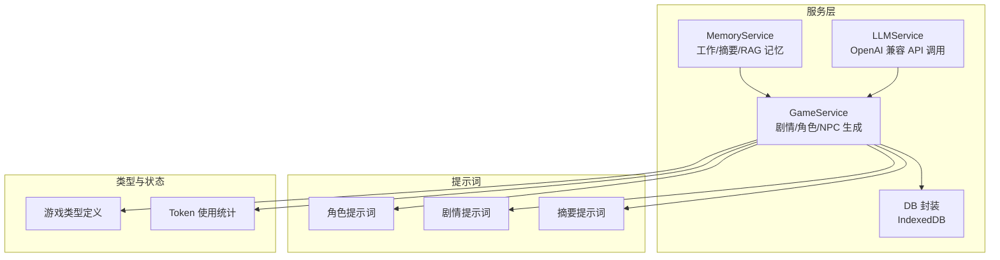
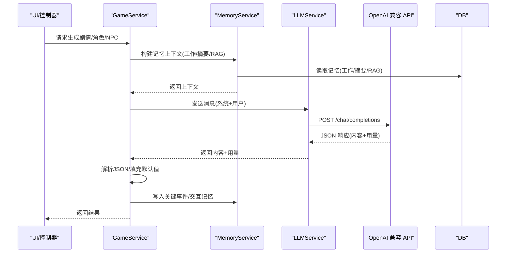
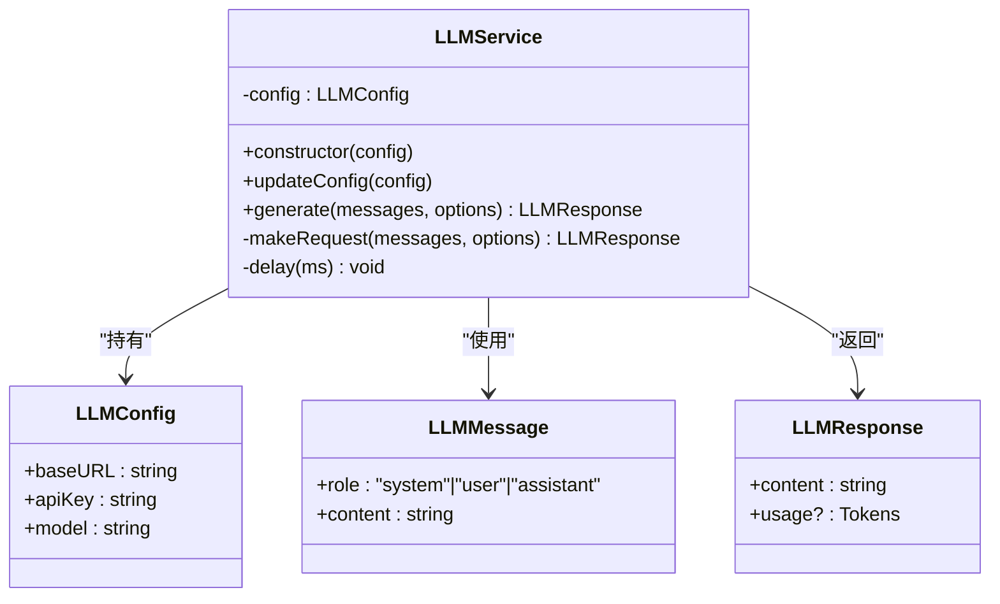
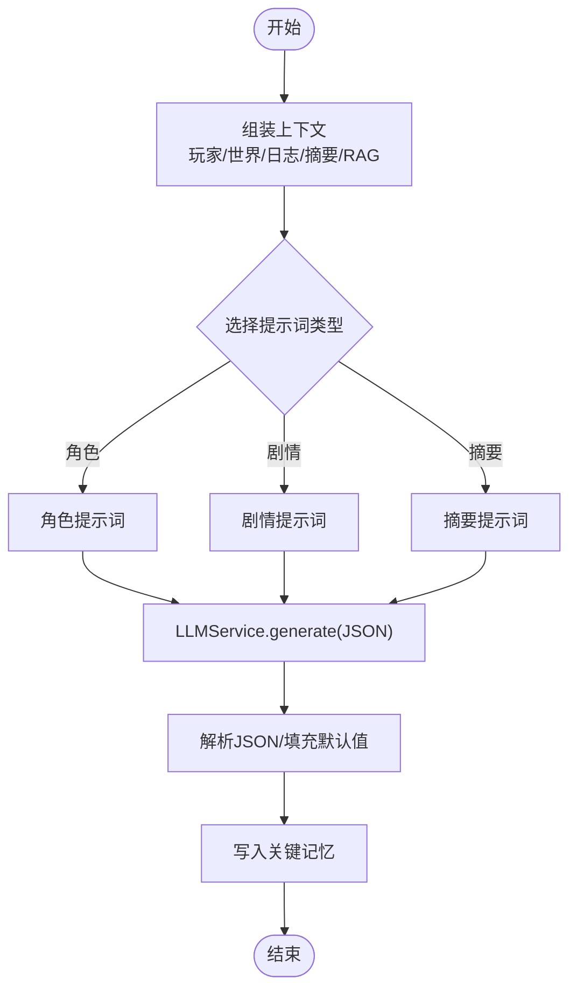
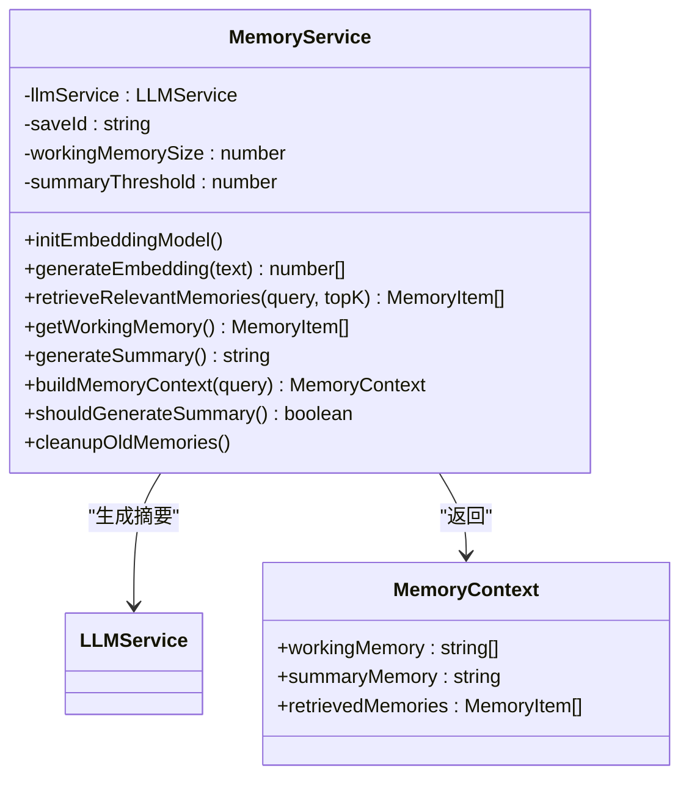
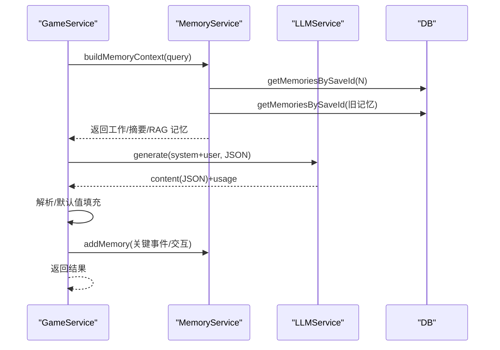
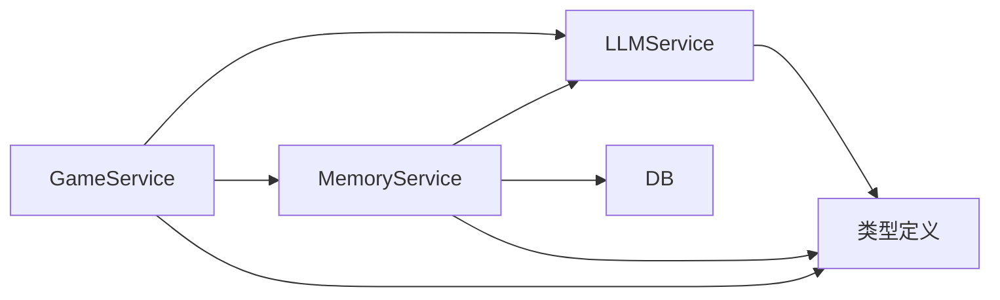

# AI 集成

<cite>
**本文引用的文件**
- [llmService.ts](file://src/services/llmService.ts)
- [memoryService.ts](file://src/services/memoryService.ts)
- [gameService.ts](file://src/services/gameService.ts)
- [db.ts](file://src/services/db.ts)
- [character.ts](file://src/prompts/character.ts)
- [story.ts](file://src/prompts/story.ts)
- [summary.ts](file://src/prompts/summary.ts)
- [game.ts](file://src/types/game.ts)
- [useTokenStore.ts](file://src/stores/useTokenStore.ts)
- [README.md](file://README.md)
- [AGENTS.md](file://AGENTS.md)
</cite>

## 目录
1. [简介](#简介)
2. [项目结构](#项目结构)
3. [核心组件](#核心组件)
4. [架构总览](#架构总览)
5. [组件详解](#组件详解)
6. [依赖关系分析](#依赖关系分析)
7. [性能与成本控制](#性能与成本控制)
8. [故障排查指南](#故障排查指南)
9. [结论](#结论)
10. [附录](#附录)

## 简介
本文件面向 AI 开发者，系统化阐述“修仙 Roguelike”项目的 AI 集成方案，重点覆盖：
- LLMService 的实现架构与 OpenAI 兼容 API 集成
- 模型配置管理、请求/响应处理与重试机制
- 提示词系统设计：角色生成、剧情推演、记忆摘要的结构与优化策略
- 内容质量控制、上下文管理与一致性保障
- 多 LLM 供应商适配、API 密钥管理与成本控制
- 最佳实践、性能优化与调试方法

## 项目结构
项目采用纯前端架构，AI 驱动游戏内容生成，核心目录与职责如下：
- src/services：LLM 服务、记忆服务、数据库封装、游戏业务服务
- src/prompts：三类提示词（角色、剧情、摘要）
- src/types：游戏类型定义（含 LLM 配置）
- src/stores：Zustand 状态管理（含 token 使用统计）
- README 与 AGENTS：部署、供应商支持与开发规范

图表来源
- [llmService.ts](file://src/services/llmService.ts#L18-L101)
- [memoryService.ts](file://src/services/memoryService.ts#L16-L224)
- [gameService.ts](file://src/services/gameService.ts#L50-L541)
- [db.ts](file://src/services/db.ts#L36-L236)
- [character.ts](file://src/prompts/character.ts#L1-L97)
- [story.ts](file://src/prompts/story.ts#L1-L147)
- [summary.ts](file://src/prompts/summary.ts#L1-L26)
- [game.ts](file://src/types/game.ts#L253-L257)
- [useTokenStore.ts](file://src/stores/useTokenStore.ts#L1-L73)

章节来源
- [README.md](file://README.md#L1-L106)
- [AGENTS.md](file://AGENTS.md#L225-L283)

## 核心组件
- LLMService：封装 OpenAI 兼容 API 调用，支持温度、最大令牌、响应格式（JSON/文本）与指数退避重试
- MemoryService：三层记忆（工作记忆、摘要记忆、RAG 检索），嵌入向量生成与相似度匹配
- GameService：角色生成、剧情推演、NPC 交互、区域 NPC 生成；记录 token 使用；写入记忆
- DB：IndexedDB 封装，存档与记忆持久化
- 提示词：角色生成、剧情推演、记忆摘要三类，均要求 JSON 输出
- 类型：LLMConfig、GameState、Player、NPC、Memory 等
- TokenStore：累计/会话/单次调用的 token 统计

章节来源
- [llmService.ts](file://src/services/llmService.ts#L18-L101)
- [memoryService.ts](file://src/services/memoryService.ts#L16-L224)
- [gameService.ts](file://src/services/gameService.ts#L50-L541)
- [db.ts](file://src/services/db.ts#L36-L236)
- [character.ts](file://src/prompts/character.ts#L1-L97)
- [story.ts](file://src/prompts/story.ts#L1-L147)
- [summary.ts](file://src/prompts/summary.ts#L1-L26)
- [game.ts](file://src/types/game.ts#L253-L257)
- [useTokenStore.ts](file://src/stores/useTokenStore.ts#L1-L73)

## 架构总览
AI 驱动的生成流程分为三层：提示词构造、LLM 调用、结果解析与上下文注入。

图表来源
- [gameService.ts](file://src/services/gameService.ts#L283-L391)
- [memoryService.ts](file://src/services/memoryService.ts#L175-L188)
- [llmService.ts](file://src/services/llmService.ts#L29-L97)
- [db.ts](file://src/services/db.ts#L175-L207)

## 组件详解

### LLMService：OpenAI 兼容 API 集成与请求处理
- 职责
  - 维护 LLMConfig（baseURL、apiKey、model）
  - 统一封装 /chat/completions 请求
  - 支持温度、最大令牌、响应格式（JSON/文本）
  - 指数退避重试（默认最多 3 次）
- 关键点
  - 请求头包含 Authorization: Bearer {apiKey}
  - 响应非 OK 时抛出带状态码与错误文本的异常
  - 返回内容与用量（prompt/completion/total tokens）
  - 重试间隔按 1s、2s、3s 指数递增
- 适配性
  - 通过 baseURL 可对接 OpenAI、DeepSeek、Qwen、Grok、OpenRouter 等兼容服务
  - 通过 updateConfig 动态切换模型与密钥

图表来源
- [llmService.ts](file://src/services/llmService.ts#L18-L101)
- [game.ts](file://src/types/game.ts#L253-L257)

章节来源
- [llmService.ts](file://src/services/llmService.ts#L18-L101)
- [README.md](file://README.md#L47-L62)

### 提示词系统：结构与优化策略
- 角色生成提示词（character.ts）
  - 系统提示词定义九霄界世界观、境界体系、角色属性范围与寿元参考
  - 用户提示词要求返回 3 个角色，JSON 结构扁平化（避免嵌套 attributes）
  - 优化策略：约束属性总和、强调多样性（出身/性格/天赋），减少歧义
- 剧情推演提示词（story.ts）
  - 系统提示词定义地理、势力、奇遇、突破、战斗、NPC 交互、时间流逝等机制
  - 用户提示词接收玩家状态、世界状态、近期日志、本次行动，要求返回 JSON
  - 优化策略：限定返回字段与示例，要求建议行动数量与风格多样化
- 记忆摘要提示词（summary.ts）
  - 系统提示词要求提取关键事件、关系变化、目标动机、未完成线索
  - 用户提示词接收历史记录数组，要求返回 JSON
- 质量控制
  - 所有提示词明确要求 JSON 输出
  - 提供示例结构与字段说明，降低解析歧义
  - 在 GameService 中进行默认值填充与字段校验

图表来源
- [gameService.ts](file://src/services/gameService.ts#L283-L391)
- [memoryService.ts](file://src/services/memoryService.ts#L175-L188)
- [character.ts](file://src/prompts/character.ts#L1-L97)
- [story.ts](file://src/prompts/story.ts#L1-L147)
- [summary.ts](file://src/prompts/summary.ts#L1-L26)

章节来源
- [character.ts](file://src/prompts/character.ts#L1-L97)
- [story.ts](file://src/prompts/story.ts#L1-L147)
- [summary.ts](file://src/prompts/summary.ts#L1-L26)
- [gameService.ts](file://src/services/gameService.ts#L74-L119)

### 记忆系统：上下文管理与一致性保障
- 三层记忆
  - 工作记忆：最近 N 条（默认 10），完整保留
  - 摘要记忆：超过阈值（默认 50）后生成摘要，降低上下文长度
  - RAG 检索：基于嵌入向量的语义相似度检索相关记忆
- 嵌入与检索
  - 使用 @xenova/transformers 的特征提取模型（Xenova/all-MiniLM-L6-v2）
  - 失败时降级为简单哈希向量（归一化）
  - 余弦相似度排序取 TopK
- 重要性评分
  - 高重要性关键词：突破、死亡、奇遇、传承、天劫、飞升、获得、结识
  - 中重要性关键词：修炼、战斗、探索、学习、炼制、结识
- 一致性保障
  - 记忆写入时附带重要性，便于后续筛选
  - 生成摘要时仅对旧记忆进行压缩，避免重复摘要
  - 检索与摘要并行执行，保证上下文新鲜度

图表来源
- [memoryService.ts](file://src/services/memoryService.ts#L16-L224)
- [db.ts](file://src/services/db.ts#L26-L34)

章节来源
- [memoryService.ts](file://src/services/memoryService.ts#L16-L224)
- [db.ts](file://src/services/db.ts#L175-L207)

### GameService：剧情/角色/NPC 生成与上下文注入
- 角色生成
  - 使用角色提示词，温度较高，JSON 输出
  - 对缺失字段进行默认值填充，确保 Player 结构完整
- 剧情推演
  - 组装玩家/世界/日志/摘要/RAG 上下文
  - 使用剧情提示词，温度中等，JSON 输出
  - 解析后填充默认值，记录关键事件与 NPC 交互记忆
- NPC 交互与区域 NPC
  - 交互提示词与区域 NPC 提示词，JSON 输出
  - 记录交互记忆，更新关系与状态
- Token 统计
  - 每次 LLM 调用后记录 prompt/completion/total tokens

图表来源
- [gameService.ts](file://src/services/gameService.ts#L283-L391)
- [memoryService.ts](file://src/services/memoryService.ts#L175-L188)
- [llmService.ts](file://src/services/llmService.ts#L29-L97)
- [db.ts](file://src/services/db.ts#L175-L207)

章节来源
- [gameService.ts](file://src/services/gameService.ts#L50-L541)
- [useTokenStore.ts](file://src/stores/useTokenStore.ts#L31-L72)

## 依赖关系分析
- 组件耦合
  - GameService 依赖 LLMService 与 MemoryService，形成“业务-推理-记忆”的清晰分层
  - MemoryService 依赖 LLMService（摘要生成）与 DB（持久化）
  - LLMService 依赖类型定义（LLMConfig、LLMMessage、LLMResponse）
- 外部依赖
  - OpenAI 兼容 API（fetch）
  - @xenova/transformers（浏览器端嵌入）
  - IndexedDB（本地持久化）

图表来源
- [gameService.ts](file://src/services/gameService.ts#L50-L541)
- [memoryService.ts](file://src/services/memoryService.ts#L16-L224)
- [llmService.ts](file://src/services/llmService.ts#L18-L101)
- [db.ts](file://src/services/db.ts#L36-L236)
- [game.ts](file://src/types/game.ts#L253-L257)

章节来源
- [gameService.ts](file://src/services/gameService.ts#L50-L541)
- [memoryService.ts](file://src/services/memoryService.ts#L16-L224)
- [llmService.ts](file://src/services/llmService.ts#L18-L101)
- [db.ts](file://src/services/db.ts#L36-L236)
- [game.ts](file://src/types/game.ts#L253-L257)

## 性能与成本控制
- 模型与参数
  - 默认温度 0.7（剧情/交互），0.8（角色），0.9（个性化选项）
  - max_tokens 控制输出长度，避免过度消耗
  - response_format 固定为 JSON，减少解析失败与重试
- 上下文裁剪
  - 工作记忆限制为最近 N 条
  - 超阈值生成摘要，显著降低上下文长度
  - RAG 仅检索 TopK 相关记忆
- 嵌入与检索
  - 首选 @xenova/transformers，失败时使用简单哈希向量
  - 余弦相似度排序，TopK 限制检索规模
- 重试与退避
  - 指数退避（1s、2s、3s），避免频繁重试导致成本上升
- Token 统计
  - 使用 TokenStore 记录累计/会话/单次用量，便于成本监控与优化
- 供应商与密钥
  - 通过 LLMConfig.baseURL 切换供应商（OpenAI、DeepSeek、Qwen、Grok、OpenRouter 等）
  - 建议为不同供应商配置独立密钥，按模型成本排序选择

章节来源
- [llmService.ts](file://src/services/llmService.ts#L37-L55)
- [memoryService.ts](file://src/services/memoryService.ts#L19-L24)
- [useTokenStore.ts](file://src/stores/useTokenStore.ts#L31-L72)
- [README.md](file://README.md#L47-L62)

## 故障排查指南
- API 错误
  - 现象：HTTP 非 OK，抛出包含状态码与错误文本的异常
  - 处理：检查 baseURL、apiKey、网络连通性；查看供应商配额与速率限制
- JSON 解析失败
  - 现象：返回内容非有效 JSON
  - 处理：确认 response_format 为 JSON；检查提示词约束与字段示例；在 GameService 中进行默认值填充
- 嵌入模型加载失败
  - 现象：@xenova/transformers 加载失败，使用简单哈希向量
  - 处理：确认网络与 CSP；考虑离线打包或 CDN
- 记忆检索为空
  - 现象：RAG 返回空，摘要为空
  - 处理：检查 saveId、记忆写入是否成功；调整阈值与 TopK
- 重试过多
  - 现象：多次重试后仍失败
  - 处理：增大重试次数上限或调整参数；切换供应商/模型

章节来源
- [llmService.ts](file://src/services/llmService.ts#L82-L85)
- [memoryService.ts](file://src/services/memoryService.ts#L28-L37)
- [gameService.ts](file://src/services/gameService.ts#L344-L372)

## 结论
本项目以 LLMService 为核心，结合 MemoryService 的三层记忆架构与 GameService 的业务编排，实现了高质量、可扩展的 AI 驱动内容生成。通过严格的提示词约束、上下文裁剪与重试机制，兼顾了稳定性与成本控制。建议在实际部署中：
- 明确供应商与模型选择，建立密钥与配额监控
- 持续优化提示词结构与字段示例，减少解析失败
- 根据场景动态调整温度与 max_tokens，平衡创意与成本
- 定期清理旧记忆，维持上下文新鲜度与性能

## 附录
- 供应商与推荐模型
  - 支持 OpenAI、DeepSeek、Qwen、Grok、OpenRouter 等 OpenAI 兼容 API
  - 推荐模型：deepseek-chat、qwen-turbo、gpt-4-turbo-preview、gpt-3.5-turbo
- 开发与部署
  - 纯前端应用，可部署至 Vercel、GitHub Pages、Netlify、Cloudflare Pages、AWS S3 等
- 类型与状态
  - LLMConfig、GameState、Player、NPC、Memory 等类型定义集中于 types/game.ts
  - Token 使用统计通过 Zustand 持久化存储

章节来源
- [README.md](file://README.md#L47-L76)
- [AGENTS.md](file://AGENTS.md#L371-L411)
- [game.ts](file://src/types/game.ts#L253-L257)
- [useTokenStore.ts](file://src/stores/useTokenStore.ts#L64-L72)