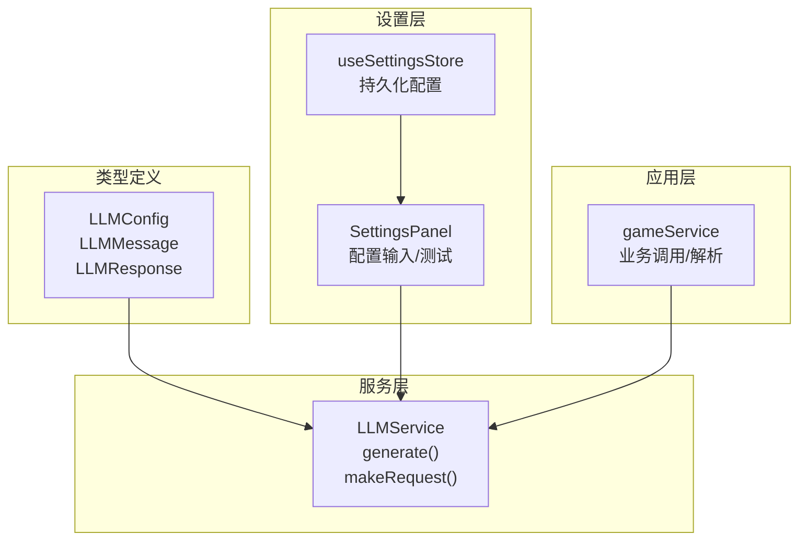
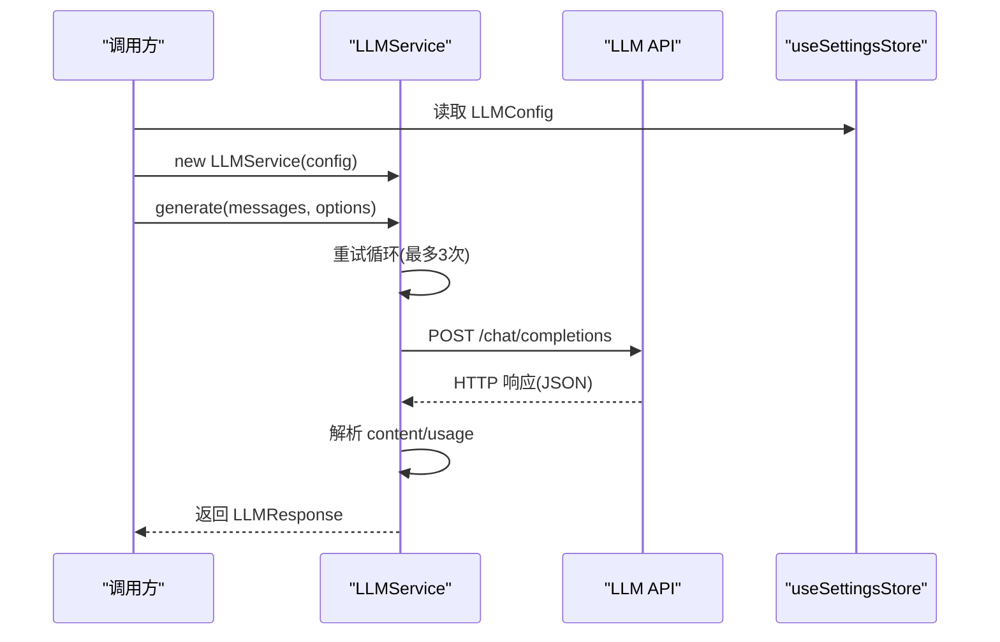
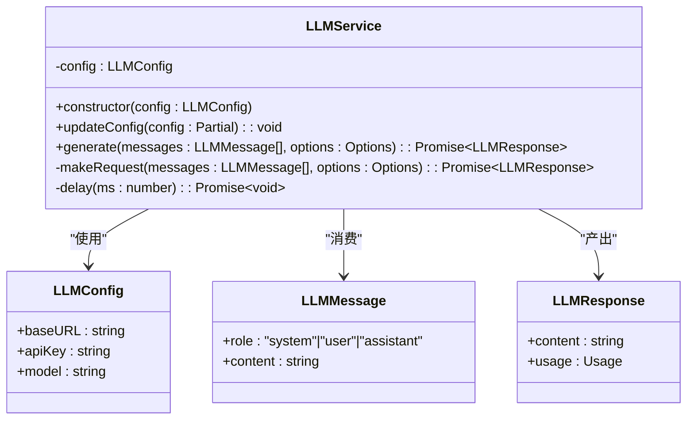
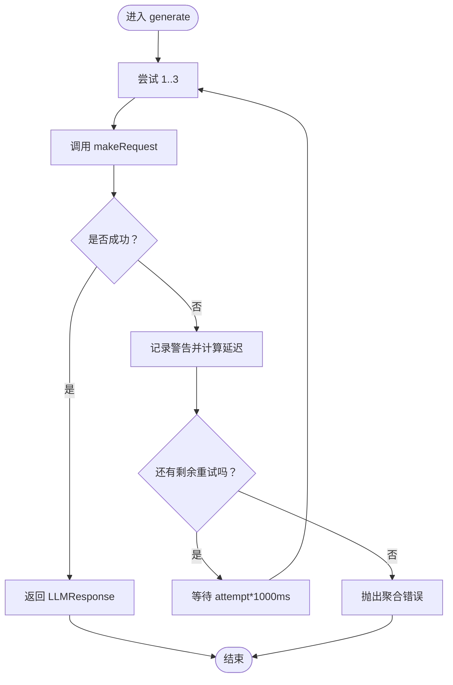
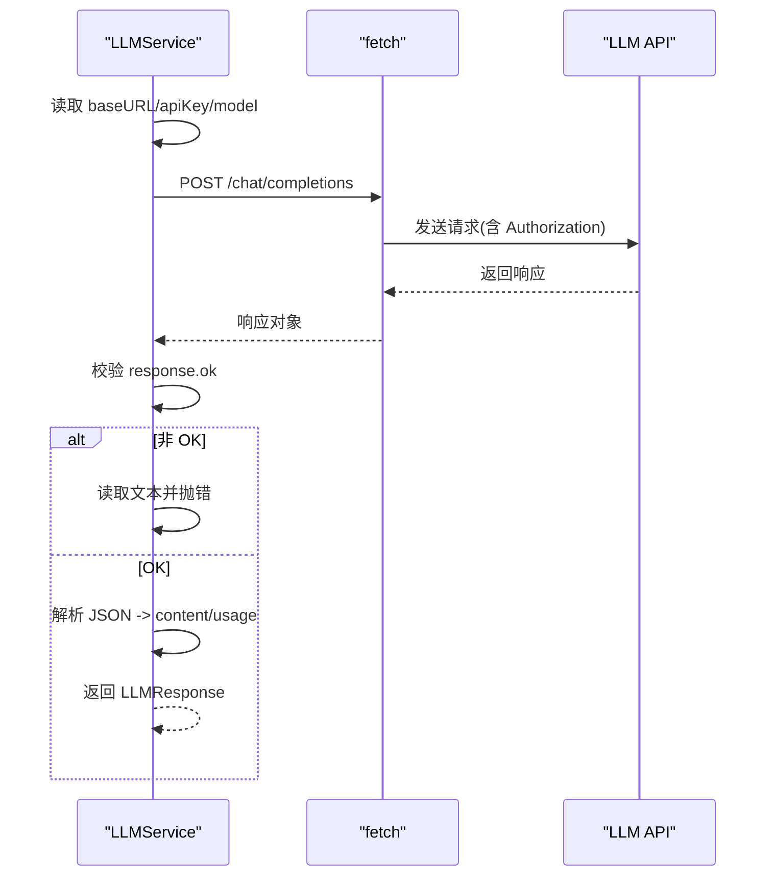
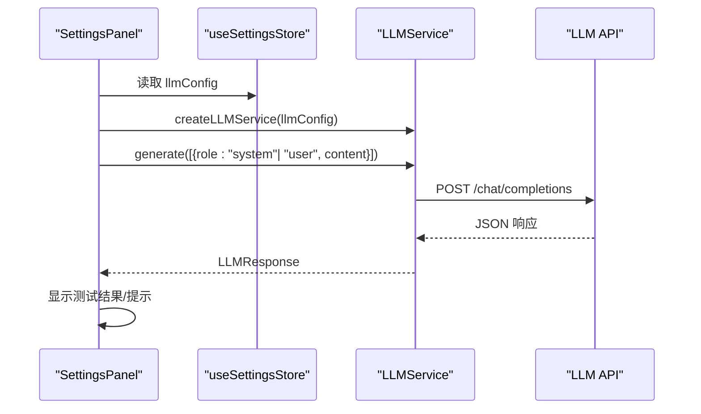
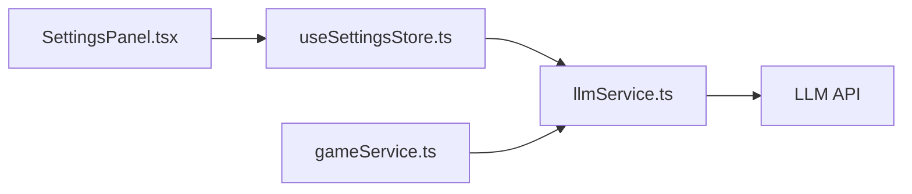

# LLM 服务

<cite>
**本文引用的文件**
- [llmService.ts](file://src/services/llmService.ts)
- [game.ts](file://src/types/game.ts)
- [SettingsPanel.tsx](file://src/components/SettingsPanel.tsx)
- [useSettingsStore.ts](file://src/stores/useSettingsStore.ts)
- [story.ts](file://src/prompts/story.ts)
- [character.ts](file://src/prompts/character.ts)
- [gameService.ts](file://src/services/gameService.ts)
- [README.md](file://README.md)
</cite>

## 目录
1. [简介](#简介)
2. [项目结构](#项目结构)
3. [核心组件](#核心组件)
4. [架构总览](#架构总览)
5. [详细组件分析](#详细组件分析)
6. [依赖关系分析](#依赖关系分析)
7. [性能考虑](#性能考虑)
8. [故障排查指南](#故障排查指南)
9. [结论](#结论)
10. [附录](#附录)

## 简介
本文件面向开发者，系统性解析 LLMService 的类架构设计与实现细节，覆盖构造函数配置、消息格式、响应处理、generate 方法的重试与延迟策略、makeRequest 的 HTTP 请求流程与认证机制、以及 LLMConfig、LLMMessage、LLMResponse 的数据结构。同时提供与 OpenAI 兼容 API 的集成最佳实践、错误重试策略与性能优化建议，并给出实际使用模式与代码示例路径，帮助快速理解与扩展 LLM 集成功能。

## 项目结构
LLMService 位于服务层，配合类型定义、设置面板与状态存储共同构成 LLM 集成闭环：
- 服务层：LLMService 负责与外部 LLM API 通信
- 类型层：LLMConfig、LLMMessage、LLMResponse 等接口定义
- 设置层：SettingsPanel 与 useSettingsStore 提供配置输入与持久化
- 应用层：gameService 在业务场景中调用 LLMService 并解析响应

图表来源
- [llmService.ts](file://src/services/llmService.ts#L18-L98)
- [game.ts](file://src/types/game.ts#L4-L16)
- [useSettingsStore.ts](file://src/stores/useSettingsStore.ts#L12-L22)
- [SettingsPanel.tsx](file://src/components/SettingsPanel.tsx#L16-L55)
- [gameService.ts](file://src/services/gameService.ts#L416-L459)

章节来源
- [llmService.ts](file://src/services/llmService.ts#L1-L101)
- [game.ts](file://src/types/game.ts#L253-L257)
- [useSettingsStore.ts](file://src/stores/useSettingsStore.ts#L1-L46)
- [SettingsPanel.tsx](file://src/components/SettingsPanel.tsx#L1-L124)
- [README.md](file://README.md#L47-L54)

## 核心组件
- LLMService：封装 LLM 调用，提供 generate 与 makeRequest，内置重试与延迟策略
- LLMConfig：LLM 服务配置接口（baseURL、apiKey、model）
- LLMMessage：消息结构（role、content），支持 system/user/assistant
- LLMResponse：响应结构（content、usage）

章节来源
- [llmService.ts](file://src/services/llmService.ts#L4-L16)
- [game.ts](file://src/types/game.ts#L253-L257)

## 架构总览
LLMService 通过 HTTP POST 调用外部 LLM API 的 chat/completions 端点，使用 Bearer Token 认证，发送 messages、temperature、max_tokens、response_format 等参数；收到响应后提取 content 与 usage 并返回。

图表来源
- [llmService.ts](file://src/services/llmService.ts#L29-L55)
- [llmService.ts](file://src/services/llmService.ts#L57-L93)
- [useSettingsStore.ts](file://src/stores/useSettingsStore.ts#L12-L22)

## 详细组件分析

### LLMService 类与接口
- 类职责
  - 维护 LLMConfig
  - 对外暴露 generate 与 updateConfig
  - 内部实现 makeRequest 发起 HTTP 请求
- 关键方法
  - generate：带指数退避重试，捕获异常并延迟后重试
  - makeRequest：构建请求头与请求体，校验响应状态，解析 JSON
  - delay：内部延时工具

图表来源
- [llmService.ts](file://src/services/llmService.ts#L18-L98)
- [game.ts](file://src/types/game.ts#L4-L16)
- [game.ts](file://src/types/game.ts#L253-L257)

章节来源
- [llmService.ts](file://src/services/llmService.ts#L18-L98)
- [game.ts](file://src/types/game.ts#L4-L16)
- [game.ts](file://src/types/game.ts#L253-L257)

### generate 方法：重试机制与错误处理
- 重试策略
  - 最多重试 3 次
  - 每次尝试后按 attempt × 1000ms 延迟（指数退避）
  - 捕获异常并记录警告日志
- 错误处理
  - 若所有尝试均失败，抛出聚合错误
- 使用建议
  - 对于网络波动或上游限流，该策略可显著提升成功率

图表来源
- [llmService.ts](file://src/services/llmService.ts#L29-L55)

章节来源
- [llmService.ts](file://src/services/llmService.ts#L29-L55)

### makeRequest 方法：HTTP 请求流程与认证
- 请求目标
  - URL：baseURL + "/chat/completions"
- 请求头
  - Content-Type: application/json
  - Authorization: Bearer {apiKey}
- 请求体
  - model、messages、temperature、max_tokens、response_format
- 响应处理
  - 非 OK 状态：读取响应文本并抛出错误
  - OK 状态：解析 JSON，提取 choices[0].message.content 与 usage
- 注意事项
  - 未显式设置超时，建议在上层或代理层增加超时控制
  - response_format 仅在兼容 OpenAI 协议的 API 上生效

图表来源
- [llmService.ts](file://src/services/llmService.ts#L57-L93)

章节来源
- [llmService.ts](file://src/services/llmService.ts#L57-L93)

### 数据结构定义
- LLMConfig
  - 字段：baseURL、apiKey、model
  - 用途：初始化 LLMService，决定 API 地址、鉴权与模型名
- LLMMessage
  - 字段：role（system/user/assistant）、content（字符串）
  - 用途：作为 messages 数组传入 API
- LLMResponse
  - 字段：content（字符串）、usage（可选）
  - 用途：承载模型输出与 token 使用统计

章节来源
- [game.ts](file://src/types/game.ts#L4-L16)
- [game.ts](file://src/types/game.ts#L253-L257)

### 配置与使用模式
- 默认配置来源
  - useSettingsStore 提供默认 LLMConfig，优先从环境变量注入
- 设置面板
  - SettingsPanel 支持用户输入 baseURL、apiKey、model，并提供“连接测试”
  - 测试流程：创建 LLMService 实例，调用 generate 发送简短 system+user 消息，断言 content 存在
- 应用层集成
  - gameService 在 NPC 交互等场景调用 LLMService.generate，并解析 JSON 结果
  - 可选开启 response_format: { type: 'json_object' } 以强制 JSON 输出

图表来源
- [SettingsPanel.tsx](file://src/components/SettingsPanel.tsx#L16-L55)
- [useSettingsStore.ts](file://src/stores/useSettingsStore.ts#L12-L22)
- [llmService.ts](file://src/services/llmService.ts#L100-L101)

章节来源
- [useSettingsStore.ts](file://src/stores/useSettingsStore.ts#L12-L22)
- [SettingsPanel.tsx](file://src/components/SettingsPanel.tsx#L16-L55)
- [llmService.ts](file://src/services/llmService.ts#L100-L101)

### 与 OpenAI 兼容 API 的集成最佳实践
- 兼容性
  - README 明确支持 OpenAI 及多种兼容格式的 API
- 建议
  - 使用 response_format: { type: 'json_object' } 强制 JSON 输出，便于解析
  - 在上层增加超时控制与更细粒度的错误分类（如 429/5xx 分类处理）
  - 将 baseURL 与 model 作为用户可配置项，结合 SettingsPanel 提供直观输入
  - 对高频调用场景，建议在网关层做缓存与限流

章节来源
- [README.md](file://README.md#L47-L54)
- [llmService.ts](file://src/services/llmService.ts#L57-L93)

### 实际使用示例与代码片段路径
- 设置面板测试
  - 示例路径：[SettingsPanel.tsx](file://src/components/SettingsPanel.tsx#L32-L55)
- NPC 交互调用
  - 示例路径：[gameService.ts](file://src/services/gameService.ts#L436-L439)
- 角色生成提示词（JSON 输出）
  - 示例路径：[character.ts](file://src/prompts/character.ts#L67-L96)
- 剧情推演提示词（JSON 输出）
  - 示例路径：[story.ts](file://src/prompts/story.ts#L69-L140)

章节来源
- [SettingsPanel.tsx](file://src/components/SettingsPanel.tsx#L32-L55)
- [gameService.ts](file://src/services/gameService.ts#L436-L439)
- [character.ts](file://src/prompts/character.ts#L67-L96)
- [story.ts](file://src/prompts/story.ts#L69-L140)

## 依赖关系分析
- 组件耦合
  - LLMService 依赖 LLMConfig 接口，低耦合
  - generate 与 makeRequest 为内聚的调用链
- 外部依赖
  - fetch：浏览器原生 HTTP 客户端
  - 环境变量：VITE_LLM_BASE_URL、VITE_LLM_API_KEY、VITE_LLM_MODEL
- 潜在风险
  - 缺少超时与连接池控制
  - 未处理 CORS 与跨域问题（需在部署层解决）

图表来源
- [SettingsPanel.tsx](file://src/components/SettingsPanel.tsx#L16-L55)
- [useSettingsStore.ts](file://src/stores/useSettingsStore.ts#L12-L22)
- [llmService.ts](file://src/services/llmService.ts#L18-L98)
- [gameService.ts](file://src/services/gameService.ts#L416-L459)

章节来源
- [SettingsPanel.tsx](file://src/components/SettingsPanel.tsx#L16-L55)
- [useSettingsStore.ts](file://src/stores/useSettingsStore.ts#L12-L22)
- [llmService.ts](file://src/services/llmService.ts#L18-L98)
- [gameService.ts](file://src/services/gameService.ts#L416-L459)

## 性能考虑
- 重试与延迟
  - generate 的指数退避可降低瞬时并发压力，但会增加端到端延迟
- 响应格式
  - 使用 response_format: { type: 'json_object' } 可减少解析歧义，提高稳定性
- 超时与并发
  - 建议在 fetch 层或代理层增加超时控制，避免长时间阻塞
- 缓存与预热
  - 对于高频提示词与固定模板，可在应用层做轻量缓存
- 模型选择
  - 根据需求选择合适模型与 max_tokens，平衡质量与成本

[本节为通用建议，无需特定文件引用]

## 故障排查指南
- 常见错误
  - 401/403：检查 apiKey 是否正确、权限是否允许
  - 404：确认 baseURL 与 /chat/completions 路径
  - 429：触发限流，建议增加延迟或降频
  - 5xx：上游服务异常，等待重试或切换备用节点
- 日志与诊断
  - generate 会在每次重试前打印警告日志，便于定位问题
  - makeRequest 在非 OK 状态会读取响应文本并抛错
- 设置验证
  - SettingsPanel 提供“连接测试”，可快速验证配置有效性

章节来源
- [llmService.ts](file://src/services/llmService.ts#L44-L46)
- [llmService.ts](file://src/services/llmService.ts#L82-L85)
- [SettingsPanel.tsx](file://src/components/SettingsPanel.tsx#L25-L55)

## 结论
LLMService 以简洁的接口与稳健的重试机制，实现了与 OpenAI 兼容 API 的无缝对接。通过 LLMConfig、LLMMessage、LLMResponse 的清晰定义，以及 SettingsPanel 与 useSettingsStore 的配置闭环，开发者可以快速完成 LLM 集成与扩展。建议在生产环境中补充超时控制、错误分类与缓存策略，以进一步提升稳定性与性能。

[本节为总结性内容，无需特定文件引用]

## 附录
- 相关提示词模板（JSON 输出）
  - 角色生成：[character.ts](file://src/prompts/character.ts#L67-L96)
  - 剧情推演：[story.ts](file://src/prompts/story.ts#L69-L140)
- README 中的兼容供应商列表
  - [README.md](file://README.md#L47-L54)

章节来源
- [character.ts](file://src/prompts/character.ts#L67-L96)
- [story.ts](file://src/prompts/story.ts#L69-L140)
- [README.md](file://README.md#L47-L54)