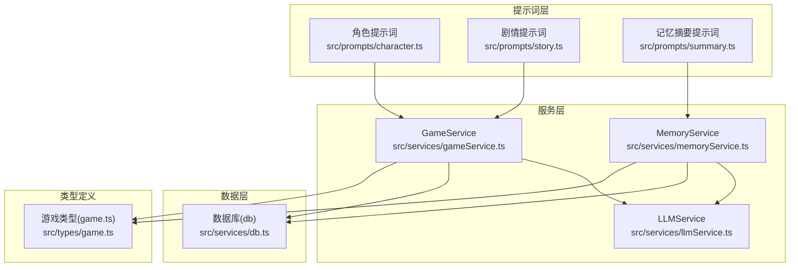
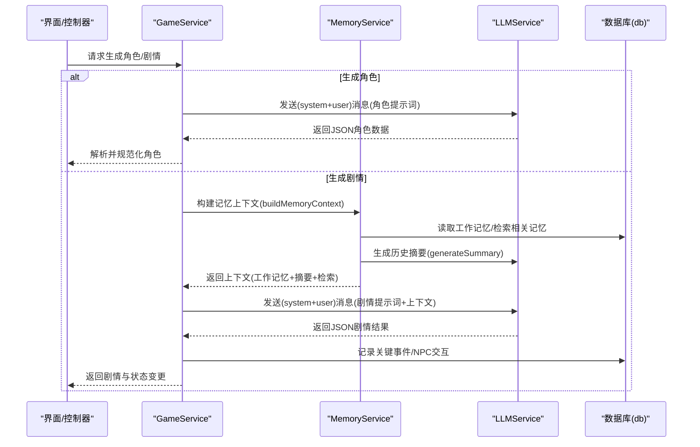
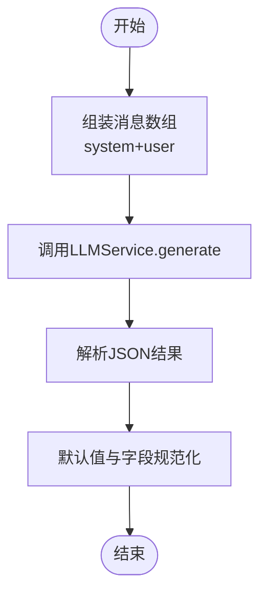
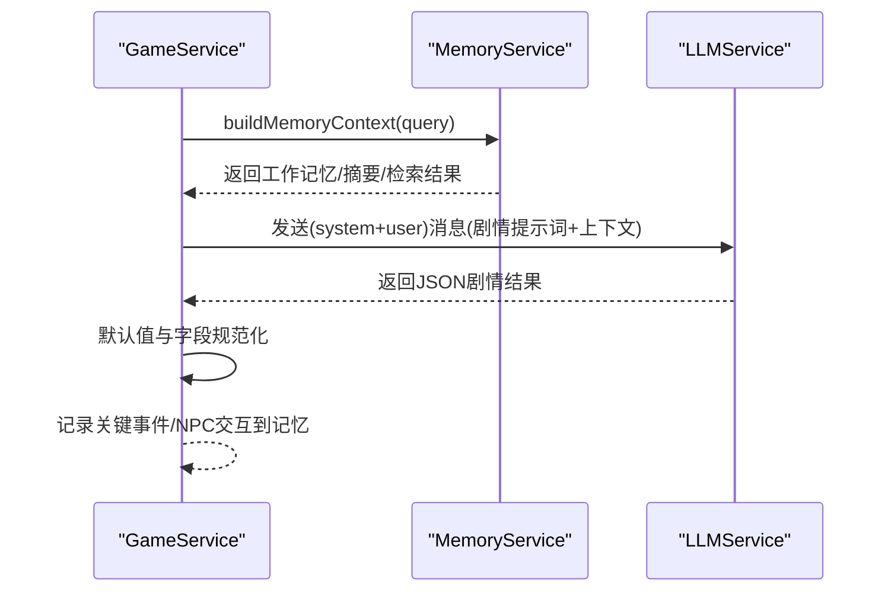
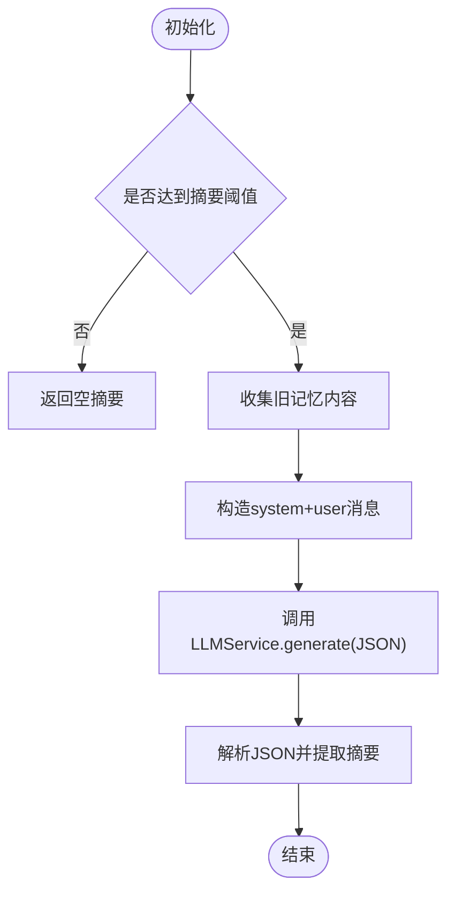
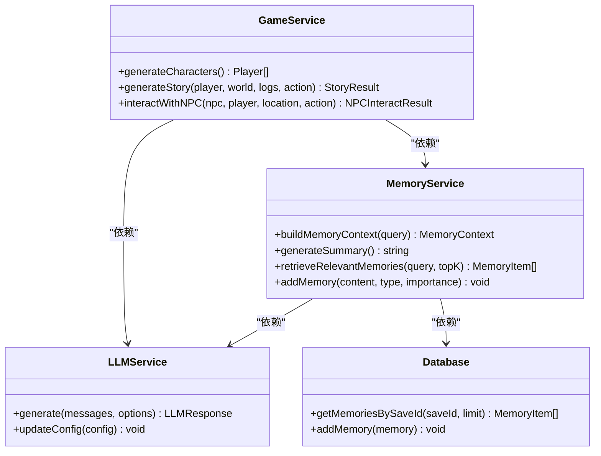

# 提示词系统

<cite>
**本文引用的文件**
- [src/prompts/character.ts](file://src/prompts/character.ts)
- [src/prompts/story.ts](file://src/prompts/story.ts)
- [src/prompts/summary.ts](file://src/prompts/summary.ts)
- [src/services/gameService.ts](file://src/services/gameService.ts)
- [src/services/memoryService.ts](file://src/services/memoryService.ts)
- [src/services/db.ts](file://src/services/db.ts)
- [src/services/llmService.ts](file://src/services/llmService.ts)
- [src/types/game.ts](file://src/types/game.ts)
</cite>

## 目录
1. [简介](#简介)
2. [项目结构](#项目结构)
3. [核心组件](#核心组件)
4. [架构总览](#架构总览)
5. [详细组件分析](#详细组件分析)
6. [依赖分析](#依赖分析)
7. [性能考量](#性能考量)
8. [故障排查指南](#故障排查指南)
9. [结论](#结论)
10. [附录](#附录)

## 简介
本文件系统性梳理并文档化了修仙Roguelike游戏中的“提示词系统”。该系统围绕三大核心模块展开：
- 角色生成提示词：用于创建修仙世界的NPC与玩家角色，确保角色背景、天赋、属性与境界体系一致。
- 剧情推演提示词：驱动故事发展与事件生成，结合玩家状态、世界状态、近期日志与记忆上下文，输出结构化剧情结果。
- 记忆摘要提示词：负责内容压缩与知识提取，将长期记忆整合为可复用的历史摘要，降低上下文成本。

文档将深入解析每个提示词模板的结构、变量占位符与上下文注入机制，给出优化策略与调优最佳实践，并提供实际使用示例与调试技巧，帮助开发者按需定制与优化提示词。

## 项目结构
提示词系统主要由以下层次构成：
- 提示词层：位于 src/prompts，包含角色、剧情、记忆摘要三类提示词模板。
- 服务层：位于 src/services，包含 LLMService（统一LLM调用）、MemoryService（记忆与检索）、GameService（业务编排与上下文组装）。
- 数据层：位于 src/services/db.ts，提供 IndexedDB 存储的记忆项、存档与存档数据。
- 类型定义：位于 src/types/game.ts，定义角色、NPC、物品、技能、记忆、时间等核心数据结构。

图表来源
- [src/prompts/character.ts](file://src/prompts/character.ts#L1-L97)
- [src/prompts/story.ts](file://src/prompts/story.ts#L1-L147)
- [src/prompts/summary.ts](file://src/prompts/summary.ts#L1-L26)
- [src/services/gameService.ts](file://src/services/gameService.ts#L1-L541)
- [src/services/memoryService.ts](file://src/services/memoryService.ts#L1-L224)
- [src/services/db.ts](file://src/services/db.ts#L1-L236)
- [src/types/game.ts](file://src/types/game.ts#L1-L319)

章节来源
- [src/prompts/character.ts](file://src/prompts/character.ts#L1-L97)
- [src/prompts/story.ts](file://src/prompts/story.ts#L1-L147)
- [src/prompts/summary.ts](file://src/prompts/summary.ts#L1-L26)
- [src/services/gameService.ts](file://src/services/gameService.ts#L1-L541)
- [src/services/memoryService.ts](file://src/services/memoryService.ts#L1-L224)
- [src/services/db.ts](file://src/services/db.ts#L1-L236)
- [src/types/game.ts](file://src/types/game.ts#L1-L319)

## 核心组件
本节聚焦三大提示词模块的设计理念与实现方式，以及它们在服务层中的集成路径。

- 角色生成提示词（角色与玩家）
  - 设计理念：以“天道意志”身份，构建符合修仙世界设定的角色，强调背景多样性、天赋独特性与属性平衡。
  - 结构要点：系统提示词定义世界观、境界体系与生成要求；用户提示词提供JSON结构约束与示例，确保输出稳定。
  - 上下文注入：GameService 在生成角色时，直接将系统提示词与用户提示词拼接为消息数组，调用 LLMService 发送请求。
  - 输出格式：固定JSON结构，包含角色数组与关键字段，便于后续处理与校验。

- 剧情推演提示词（故事与事件）
  - 设计理念：以“天道推演者”身份，根据玩家状态、世界状态、近期日志与记忆上下文，推演出符合逻辑且富有趣味性的剧情。
  - 结构要点：系统提示词定义九霄界地理、势力、核心机制与叙事风格；用户提示词通过上下文参数注入玩家、世界、日志与行动，同时限定返回JSON结构与字段清单。
  - 上下文注入：GameService 在生成剧情时，组装玩家信息、世界信息、近期日志、历史摘要与检索到的相关记忆，形成完整的上下文，再调用 LLMService。
  - 输出格式：严格JSON结构，包含剧情描述、时间流逝、修为/灵气增长、突破结果、属性变化、物品增减、技能获得/提升、NPC交互、关系变更、事件列表与建议行动等。

- 记忆摘要提示词（内容压缩与知识提取）
  - 设计理念：将大量历史记录压缩为简洁但信息完整的摘要，便于后续剧情推演使用，降低上下文长度与计算成本。
  - 结构要点：系统提示词定义摘要要素（关键事件、人物关系变化、当前目标与动机、未完成线索）；用户提示词接收历史记录数组，返回JSON结构。
  - 上下文注入：MemoryService 在满足阈值后，收集旧记忆内容，构造消息数组，调用 LLMService 生成摘要。
  - 输出格式：JSON结构，包含摘要正文、关键事件列表、关系映射与未完成任务列表。

章节来源
- [src/prompts/character.ts](file://src/prompts/character.ts#L1-L97)
- [src/prompts/story.ts](file://src/prompts/story.ts#L1-L147)
- [src/prompts/summary.ts](file://src/prompts/summary.ts#L1-L26)
- [src/services/gameService.ts](file://src/services/gameService.ts#L74-L119)
- [src/services/gameService.ts](file://src/services/gameService.ts#L283-L391)
- [src/services/memoryService.ts](file://src/services/memoryService.ts#L144-L173)

## 架构总览
提示词系统在运行时的调用链如下：

图表来源
- [src/services/gameService.ts](file://src/services/gameService.ts#L74-L119)
- [src/services/gameService.ts](file://src/services/gameService.ts#L283-L391)
- [src/services/memoryService.ts](file://src/services/memoryService.ts#L175-L188)
- [src/services/db.ts](file://src/services/db.ts#L175-L207)

## 详细组件分析

### 角色生成提示词模块
- 模块职责
  - 生成风格迥异的修仙角色，覆盖出身、性格、天赋与基础属性，确保多样性与合理性。
- 模板结构
  - 系统提示词：定义九霄界世界观、境界体系与生成要求。
  - 用户提示词：提供JSON结构约束与示例，确保输出稳定。
- 上下文注入
  - GameService 直接将系统提示词与用户提示词拼接为消息数组，调用 LLMService。
- 输出与校验
  - 固定JSON结构，GameService 对缺失字段进行默认值填充与规范化，保证后续流程可用。

图表来源
- [src/services/gameService.ts](file://src/services/gameService.ts#L74-L119)
- [src/prompts/character.ts](file://src/prompts/character.ts#L1-L97)

章节来源
- [src/prompts/character.ts](file://src/prompts/character.ts#L1-L97)
- [src/services/gameService.ts](file://src/services/gameService.ts#L74-L119)

### 剧情推演提示词模块
- 模块职责
  - 根据玩家状态、世界状态、近期日志与记忆上下文，推演出符合逻辑的剧情发展，包含时间流逝、修为/灵气增长、突破、属性变化、物品与技能变动、NPC交互与关系变化、事件列表与建议行动。
- 模板结构
  - 系统提示词：定义九霄界地理、势力、核心机制与叙事风格。
  - 用户提示词：通过上下文参数注入玩家、世界、近期日志、行动，并限定返回JSON结构与字段清单。
- 上下文注入
  - GameService 组装玩家信息、世界信息、近期日志、历史摘要与检索到的相关记忆，形成完整上下文。
- 输出与校验
  - 严格JSON结构，GameService 对缺失字段进行默认值处理，确保后续流程稳定。

图表来源
- [src/services/gameService.ts](file://src/services/gameService.ts#L283-L391)
- [src/services/memoryService.ts](file://src/services/memoryService.ts#L175-L188)

章节来源
- [src/prompts/story.ts](file://src/prompts/story.ts#L1-L147)
- [src/services/gameService.ts](file://src/services/gameService.ts#L283-L391)

### 记忆摘要提示词模块
- 模块职责
  - 将大量历史记录压缩为摘要，提取关键事件、人物关系变化、当前目标与动机、未完成线索，降低后续上下文成本。
- 模板结构
  - 系统提示词：定义摘要要素。
  - 用户提示词：接收历史记录数组，返回JSON结构。
- 上下文注入
  - MemoryService 在满足阈值后，收集旧记忆内容，构造消息数组，调用 LLMService。
- 输出与校验
  - JSON结构，包含摘要正文、关键事件列表、关系映射与未完成任务列表。

图表来源
- [src/services/memoryService.ts](file://src/services/memoryService.ts#L144-L173)
- [src/prompts/summary.ts](file://src/prompts/summary.ts#L1-L26)

章节来源
- [src/prompts/summary.ts](file://src/prompts/summary.ts#L1-L26)
- [src/services/memoryService.ts](file://src/services/memoryService.ts#L144-L173)

## 依赖分析
- 组件耦合与内聚
  - GameService 依赖 LLMService 与 MemoryService，负责业务编排与上下文组装；MemoryService 依赖 LLMService 与数据库，负责记忆管理与检索；LLMService 为通用接口，封装外部API调用。
- 直接与间接依赖
  - GameService 直接依赖提示词模板与类型定义；间接依赖数据库存储。
  - MemoryService 直接依赖数据库与LLMService；间接依赖类型定义。
- 外部依赖与集成点
  - LLMService 通过HTTP调用外部LLM API，支持响应格式约束与重试机制。
- 接口契约与实现细节
  - LLMService 的 generate 方法支持温度、最大token与响应格式约束；MemoryService 的摘要生成与检索均受此约束影响。

图表来源
- [src/services/llmService.ts](file://src/services/llmService.ts#L1-L101)
- [src/services/memoryService.ts](file://src/services/memoryService.ts#L1-L224)
- [src/services/gameService.ts](file://src/services/gameService.ts#L1-L541)
- [src/services/db.ts](file://src/services/db.ts#L1-L236)

章节来源
- [src/services/llmService.ts](file://src/services/llmService.ts#L1-L101)
- [src/services/memoryService.ts](file://src/services/memoryService.ts#L1-L224)
- [src/services/gameService.ts](file://src/services/gameService.ts#L1-L541)
- [src/services/db.ts](file://src/services/db.ts#L1-L236)

## 性能考量
- 上下文长度管理
  - 工作记忆大小与摘要阈值直接影响上下文长度。建议根据模型上下文窗口调整工作记忆大小与摘要阈值，避免频繁截断。
- 响应格式约束
  - 使用JSON响应格式可减少后处理开销，但需确保提示词明确约束字段与结构，避免LLM产生冗余解释。
- 温度参数设置
  - 角色生成：适度提高温度以增加多样性；剧情推演：适中温度以平衡创意与一致性；记忆摘要：较低温度以提升稳定性。
- RAG检索与摘要生成
  - 检索Top-K与摘要阈值应结合游戏节奏与玩家体验权衡，避免过多无关上下文干扰剧情推演。
- Token使用统计
  - GameService 记录prompt/completion/total token用量，可用于成本控制与提示词优化。

章节来源
- [src/services/memoryService.ts](file://src/services/memoryService.ts#L19-L25)
- [src/services/memoryService.ts](file://src/services/memoryService.ts#L190-L194)
- [src/services/gameService.ts](file://src/services/gameService.ts#L81-L83)
- [src/services/gameService.ts](file://src/services/gameService.ts#L336-L339)
- [src/services/memoryService.ts](file://src/services/memoryService.ts#L162-L165)

## 故障排查指南
- LLM调用失败
  - 现象：API错误或网络异常导致调用失败。
  - 处理：LLMService 内置重试机制与延迟退避；检查baseURL、apiKey与model配置；确认响应格式约束与最大token设置。
- JSON解析失败
  - 现象：提示词返回非JSON或结构不匹配。
  - 处理：强化提示词中的JSON结构约束与示例；在服务层对缺失字段进行默认值处理；开启日志记录以定位问题。
- 记忆检索不相关
  - 现象：检索到的记忆与当前查询无关。
  - 处理：调整检索Top-K、重要性阈值与嵌入模型；优化记忆内容与标签；必要时启用备用哈希嵌入。
- 摘要为空
  - 现象：记忆数量未达阈值，摘要为空。
  - 处理：降低摘要阈值或增加关键事件的重要性权重；确保重要事件被正确标记。

章节来源
- [src/services/llmService.ts](file://src/services/llmService.ts#L37-L55)
- [src/services/memoryService.ts](file://src/services/memoryService.ts#L121-L137)
- [src/services/memoryService.ts](file://src/services/memoryService.ts#L190-L194)

## 结论
提示词系统通过明确的模板结构、严格的上下文注入与稳健的后处理机制，实现了角色生成、剧情推演与记忆摘要的闭环。通过合理设置温度、响应格式与上下文长度，结合RAG检索与摘要生成，可在保证稳定性的同时提升创意与沉浸感。建议在实际开发中持续监控Token用量与提示词效果，迭代优化提示词与参数配置，以适配不同游戏节奏与玩家偏好。

## 附录
- 实际使用示例（路径指引）
  - 角色生成：调用路径参见 [src/services/gameService.ts](file://src/services/gameService.ts#L74-L119)，其中使用角色提示词模板。
  - 剧情推演：调用路径参见 [src/services/gameService.ts](file://src/services/gameService.ts#L283-L391)，其中使用剧情提示词模板并组装记忆上下文。
  - 记忆摘要：调用路径参见 [src/services/memoryService.ts](file://src/services/memoryService.ts#L144-L173)，其中使用记忆摘要提示词模板。
- 调优最佳实践
  - 温度参数：角色生成0.8、剧情推演0.7、记忆摘要0.5。
  - 上下文长度：工作记忆大小与摘要阈值需结合模型上下文窗口与游戏节奏调整。
  - 多轮对话协调：在提示词中显式约束角色与世界状态，减少重复注入；在服务层对缺失字段进行默认值处理。
  - 质量控制：使用JSON响应格式约束；在服务层进行字段校验与默认值填充；记录Token用量以评估成本。