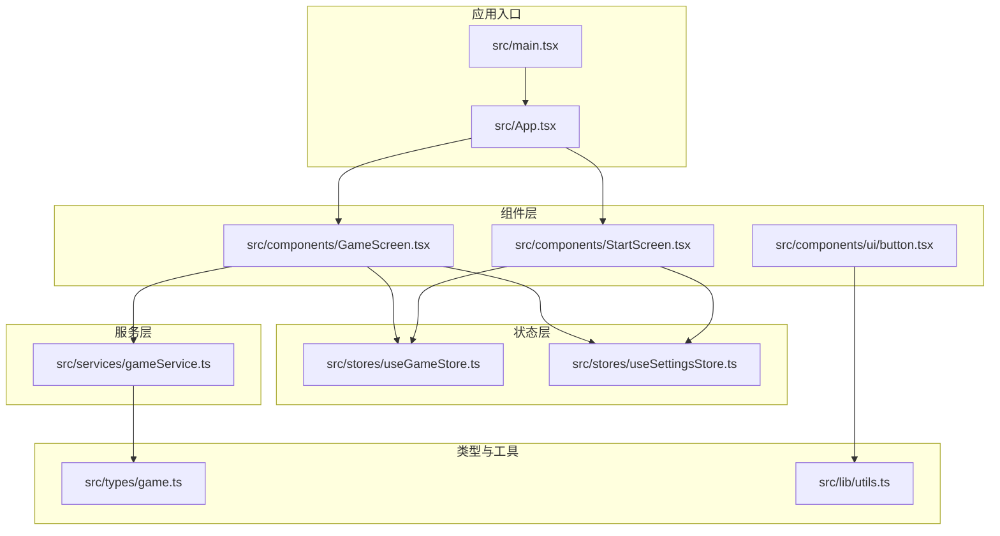
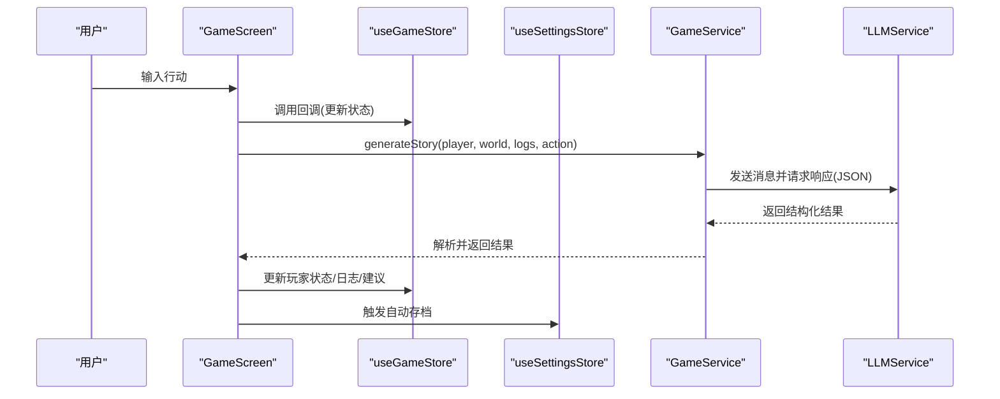
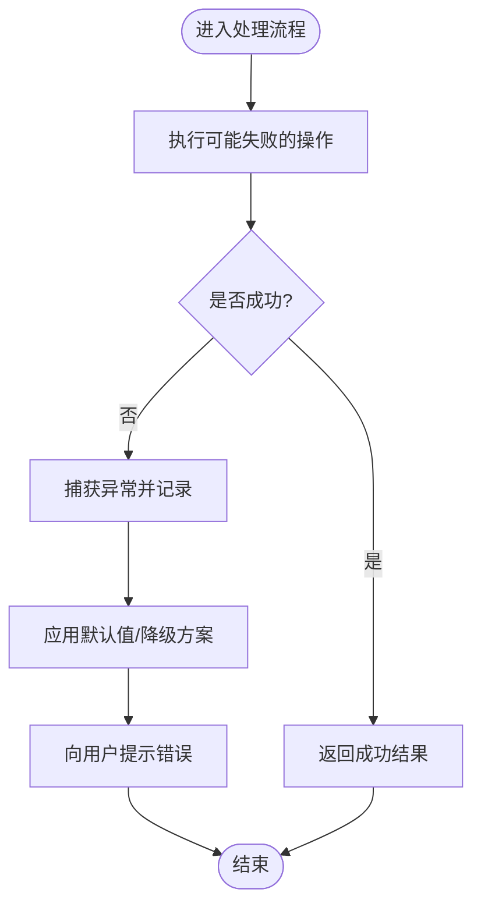
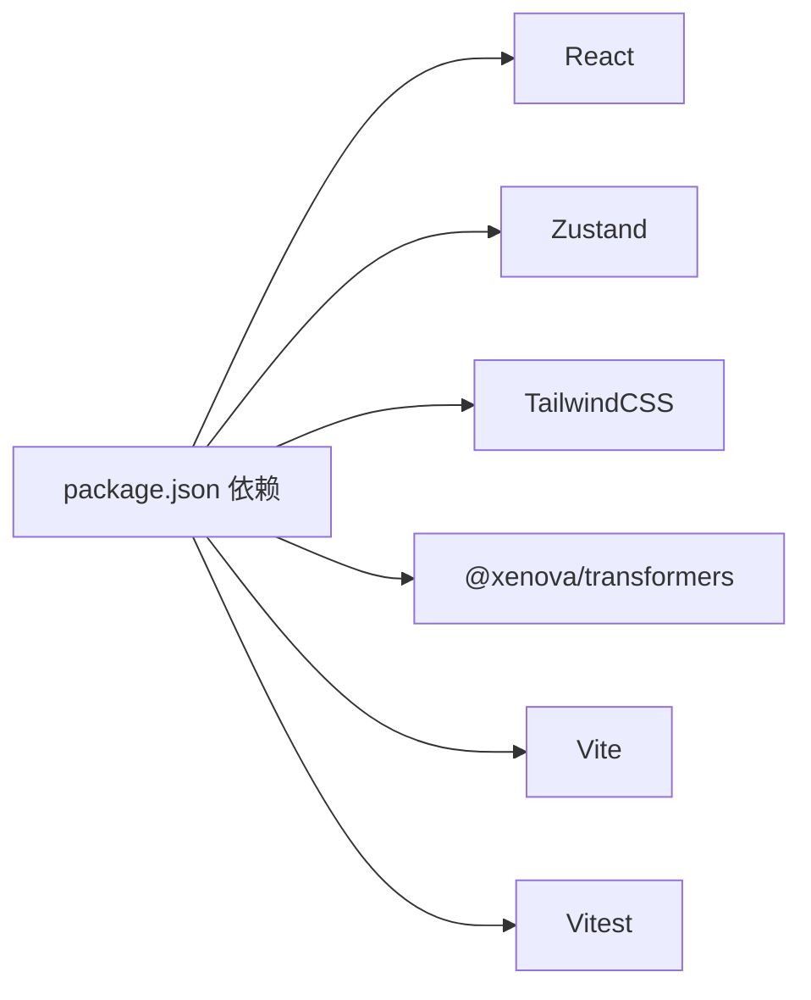

# 代码风格规范

<cite>
**本文引用的文件**
- [.eslintrc.cjs](file://.eslintrc.cjs)
- [package.json](file://package.json)
- [tsconfig.json](file://tsconfig.json)
- [src/main.tsx](file://src/main.tsx)
- [src/App.tsx](file://src/App.tsx)
- [src/lib/utils.ts](file://src/lib/utils.ts)
- [src/types/game.ts](file://src/types/game.ts)
- [src/stores/useGameStore.ts](file://src/stores/useGameStore.ts)
- [src/stores/useSettingsStore.ts](file://src/stores/useSettingsStore.ts)
- [src/services/gameService.ts](file://src/services/gameService.ts)
- [src/components/StartScreen.tsx](file://src/components/StartScreen.tsx)
- [src/components/GameScreen.tsx](file://src/components/GameScreen.tsx)
- [src/components/ui/button.tsx](file://src/components/ui/button.tsx)
- [src/prompts/character.ts](file://src/prompts/character.ts)
- [README.md](file://README.md)
</cite>

## 目录
1. [简介](#简介)
2. [项目结构](#项目结构)
3. [核心组件](#核心组件)
4. [架构总览](#架构总览)
5. [详细组件分析](#详细组件分析)
6. [依赖分析](#依赖分析)
7. [性能考虑](#性能考虑)
8. [故障排查指南](#故障排查指南)
9. [结论](#结论)
10. [附录](#附录)

## 简介
本规范面向“修仙 Roguelike”项目，旨在统一 TypeScript/TSX 编码风格、ESLint 规则、导入顺序、命名约定、格式化规则、注释标准、错误处理模式，并给出组件与 Hook 使用规范、类型定义最佳实践。本文档基于仓库现有实现进行提炼与扩展，帮助团队在保持一致性的同时提升可读性与可维护性。

## 项目结构
项目采用按职责分层的组织方式：
- src/components：UI 组件与页面组件
- src/stores：Zustand 状态管理
- src/services：业务服务与 LLM 封装
- src/types：全局类型定义
- src/lib：工具函数
- src/prompts：提示词模板
- 根目录：构建与 lint 配置

图表来源
- [src/main.tsx](file://src/main.tsx#L1-L11)
- [src/App.tsx](file://src/App.tsx#L1-L588)
- [src/components/StartScreen.tsx](file://src/components/StartScreen.tsx#L1-L319)
- [src/components/GameScreen.tsx](file://src/components/GameScreen.tsx#L1-L172)
- [src/components/ui/button.tsx](file://src/components/ui/button.tsx#L1-L57)
- [src/stores/useGameStore.ts](file://src/stores/useGameStore.ts#L1-L226)
- [src/stores/useSettingsStore.ts](file://src/stores/useSettingsStore.ts#L1-L46)
- [src/services/gameService.ts](file://src/services/gameService.ts#L1-L541)
- [src/types/game.ts](file://src/types/game.ts#L1-L319)
- [src/lib/utils.ts](file://src/lib/utils.ts#L1-L7)

章节来源
- [README.md](file://README.md#L77-L97)

## 核心组件
- 应用入口与根组件：负责初始化、主题同步、服务创建、自动存档与路由切换
- 页面组件：StartScreen、GameScreen，承载业务交互与 UI 呈现
- UI 组件：button.tsx 等，遵循设计系统与变体规范
- 状态管理：useGameStore、useSettingsStore，集中管理游戏状态与设置
- 业务服务：gameService，封装 LLM 调用、记忆与存档逻辑
- 类型定义：game.ts，统一领域模型与接口
- 工具函数：utils.ts，样式合并工具

章节来源
- [src/main.tsx](file://src/main.tsx#L1-L11)
- [src/App.tsx](file://src/App.tsx#L1-L588)
- [src/components/StartScreen.tsx](file://src/components/StartScreen.tsx#L1-L319)
- [src/components/GameScreen.tsx](file://src/components/GameScreen.tsx#L1-L172)
- [src/components/ui/button.tsx](file://src/components/ui/button.tsx#L1-L57)
- [src/stores/useGameStore.ts](file://src/stores/useGameStore.ts#L1-L226)
- [src/stores/useSettingsStore.ts](file://src/stores/useSettingsStore.ts#L1-L46)
- [src/services/gameService.ts](file://src/services/gameService.ts#L1-L541)
- [src/types/game.ts](file://src/types/game.ts#L1-L319)
- [src/lib/utils.ts](file://src/lib/utils.ts#L1-L7)

## 架构总览
应用采用“组件 + 状态 + 服务”的分层架构，组件通过 Hook 访问状态，服务封装外部依赖（LLM、数据库），类型定义贯穿全链路。

图表来源
- [src/components/GameScreen.tsx](file://src/components/GameScreen.tsx#L1-L172)
- [src/stores/useGameStore.ts](file://src/stores/useGameStore.ts#L1-L226)
- [src/stores/useSettingsStore.ts](file://src/stores/useSettingsStore.ts#L1-L46)
- [src/services/gameService.ts](file://src/services/gameService.ts#L283-L391)

## 详细组件分析

### TypeScript 编码规范
- 类型优先：优先使用类型别名与接口，避免 any；当无法避免时，需显式注释原因
- 可选链与空值合并：广泛使用安全访问与默认值，降低运行时异常
- 结构化返回：服务层统一返回结构化对象，便于消费端解析与容错
- 泛型约束：在需要时使用泛型约束，提升类型安全性

章节来源
- [src/services/gameService.ts](file://src/services/gameService.ts#L15-L48)
- [src/components/StartScreen.tsx](file://src/components/StartScreen.tsx#L23-L28)
- [src/components/GameScreen.tsx](file://src/components/GameScreen.tsx#L49-L52)

### ESLint 规则配置
- 基础规则：推荐规则集启用，结合 TypeScript 与 React Hooks 插件
- 禁用规则：关闭显式 any 的报错，允许在特定场景下使用
- 刷新策略：启用 react-refresh 仅导出组件警告，允许常量导出
- 建议：新增规则应保持与现有风格一致，避免破坏既有约定

章节来源
- [.eslintrc.cjs](file://.eslintrc.cjs#L1-L20)
- [package.json](file://package.json#L9-L9)

### 导入顺序规范
- 外部依赖：第三方库（react、radix、tailwind 等）
- 内部相对路径：同级或上级目录组件与工具
- 路径别名：@/* 形式的绝对路径
- 顺序原则：稳定、可预测，避免循环依赖

章节来源
- [src/App.tsx](file://src/App.tsx#L1-L15)
- [src/components/ui/button.tsx](file://src/components/ui/button.tsx#L1-L6)
- [src/lib/utils.ts](file://src/lib/utils.ts#L1-L7)

### 命名约定
- PascalCase：组件与类名（如 GameService、StartScreen）
- camelCase：变量、函数、Hook、属性（如 gameState、handleActionSubmit）
- UPPER_SNAKE_CASE：常量（如 DEFAULT_THEME、MAX_RETRIES）

章节来源
- [src/services/gameService.ts](file://src/services/gameService.ts#L50-L57)
- [src/components/StartScreen.tsx](file://src/components/StartScreen.tsx#L16-L18)
- [src/stores/useSettingsStore.ts](file://src/stores/useSettingsStore.ts#L12-L22)

### 代码格式化规则
- 缩进：2 空格
- 引号：单引号
- 尾随逗号：保留尾随逗号
- 行宽：遵循项目默认（建议不超过 100 列）
- JSX：属性换行与对齐保持一致

章节来源
- [tsconfig.json](file://tsconfig.json#L1-L32)
- [.eslintrc.cjs](file://.eslintrc.cjs#L1-L20)

### 注释标准
- 文件头部：简要说明模块职责
- 复杂函数：解释输入、输出、边界条件与副作用
- 业务逻辑：在关键分支处添加注释，说明决策依据
- TODO/NOTE：使用明确标记，注明责任人与截止日期

章节来源
- [src/services/gameService.ts](file://src/services/gameService.ts#L283-L391)
- [src/prompts/character.ts](file://src/prompts/character.ts#L1-L97)

### 错误处理模式
- 明确抛错：服务初始化未完成时抛出错误
- try/catch：网络或 LLM 调用失败时捕获并记录
- 容错降级：UI 层使用空值合并与默认值，避免崩溃
- 日志与提示：统一使用控制台日志与 toast 提示

图表来源
- [src/App.tsx](file://src/App.tsx#L135-L161)
- [src/App.tsx](file://src/App.tsx#L455-L466)

章节来源
- [src/App.tsx](file://src/App.tsx#L78-L105)
- [src/App.tsx](file://src/App.tsx#L135-L161)
- [src/App.tsx](file://src/App.tsx#L455-L466)

### 组件开发规范
- 函数式组件：优先使用函数式组件与 Hooks
- Props 接口：为组件定义清晰的 Props 接口，避免 any
- 事件回调：使用 useCallback 包裹回调，减少重渲染
- 数据容错：对可选属性使用空值合并与默认值
- 样式工具：使用 cn 合并样式，避免内联样式的重复

章节来源
- [src/components/GameScreen.tsx](file://src/components/GameScreen.tsx#L15-L30)
- [src/components/StartScreen.tsx](file://src/components/StartScreen.tsx#L11-L14)
- [src/lib/utils.ts](file://src/lib/utils.ts#L4-L6)

### Hook 使用规范
- 状态管理：通过 useGameStore/useSettingsStore 访问全局状态
- 回调优化：使用 useCallback 包裹事件处理器
- 依赖声明：useMemo/useCallback 的依赖数组保持最小化且准确
- 副作用：useEffect 中处理副作用，注意清理与依赖

章节来源
- [src/App.tsx](file://src/App.tsx#L16-L51)
- [src/App.tsx](file://src/App.tsx#L68-L72)
- [src/App.tsx](file://src/App.tsx#L125-L128)

### 类型定义最佳实践
- 类型拆分：将枚举、接口、工具函数拆分为独立文件
- 只读与可选：合理使用只读与可选修饰，避免意外修改
- 联合类型：使用联合类型表达有限取值，增强可读性
- 工具函数：导出计算与映射函数（如好感度级别、颜色、图标）

章节来源
- [src/types/game.ts](file://src/types/game.ts#L1-L48)
- [src/types/game.ts](file://src/types/game.ts#L287-L319)

## 依赖分析
- 构建与脚本：Vite + React + TypeScript
- 状态管理：Zustand + persist
- UI：TailwindCSS + shadcn/ui + Radix UI
- LLM：transformers 或兼容 OpenAI API
- 测试：Vitest

图表来源
- [package.json](file://package.json#L15-L52)

章节来源
- [package.json](file://package.json#L1-L55)

## 性能考虑
- 渲染优化：合理使用 useCallback/useMemo，避免不必要的重渲染
- 状态粒度：将大对象拆分为细粒度状态，减少无关更新
- 异步处理：将耗时任务放入 Worker 或后台线程，避免阻塞 UI
- 图片与资源：懒加载与压缩，减少首屏压力
- 存储策略：本地持久化仅保存必要字段，定期清理冗余数据

## 故障排查指南
- Lint 失败：根据 ESLint 报错逐项修正，必要时在局部禁用规则并添加注释
- 类型错误：补充缺失字段或调整类型定义，避免 any
- 运行时异常：检查空值与边界条件，增加容错处理
- 性能问题：使用 React DevTools 分析重渲染，优化回调与状态

章节来源
- [.eslintrc.cjs](file://.eslintrc.cjs#L12-L18)
- [tsconfig.json](file://tsconfig.json#L18-L21)

## 结论
本规范总结了项目现有的编码风格与最佳实践，并在此基础上提出统一的命名、格式化、注释与错误处理标准。建议在团队内推广使用，持续通过 Lint 与类型检查保障质量，逐步完善测试覆盖与文档。

## 附录
- 术语表
  - LLM：大型语言模型
  - UI 组件：可复用的界面元素
  - 服务：封装业务逻辑与外部依赖的模块
  - 状态：应用运行时的数据集合
- 参考实现路径
  - [src/App.tsx](file://src/App.tsx#L1-L588)
  - [src/services/gameService.ts](file://src/services/gameService.ts#L1-L541)
  - [src/stores/useGameStore.ts](file://src/stores/useGameStore.ts#L1-L226)
  - [src/stores/useSettingsStore.ts](file://src/stores/useSettingsStore.ts#L1-L46)
  - [src/types/game.ts](file://src/types/game.ts#L1-L319)
  - [src/components/ui/button.tsx](file://src/components/ui/button.tsx#L1-L57)
  - [src/lib/utils.ts](file://src/lib/utils.ts#L1-L7)