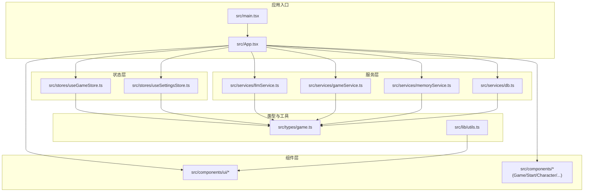
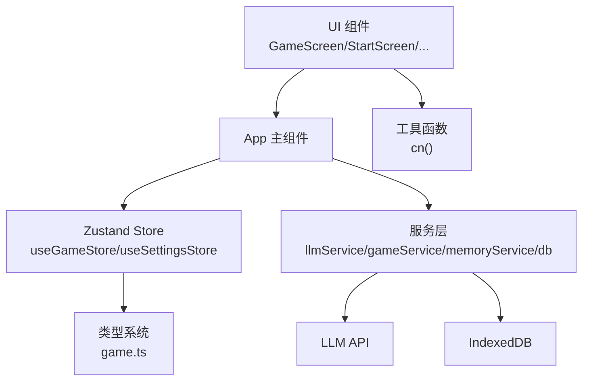
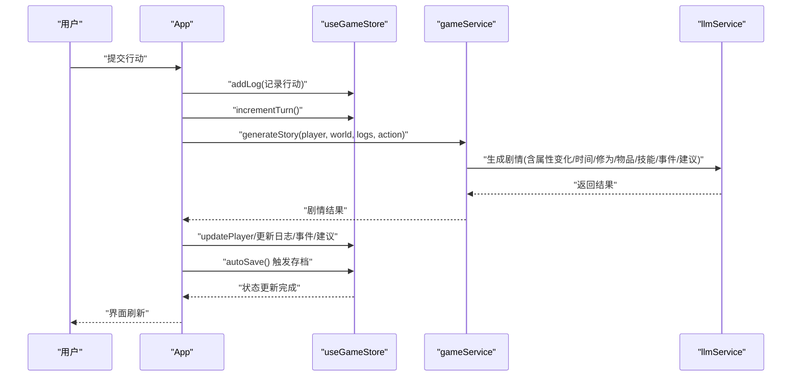
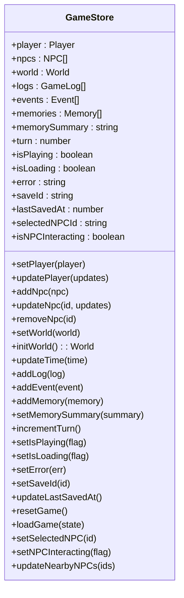
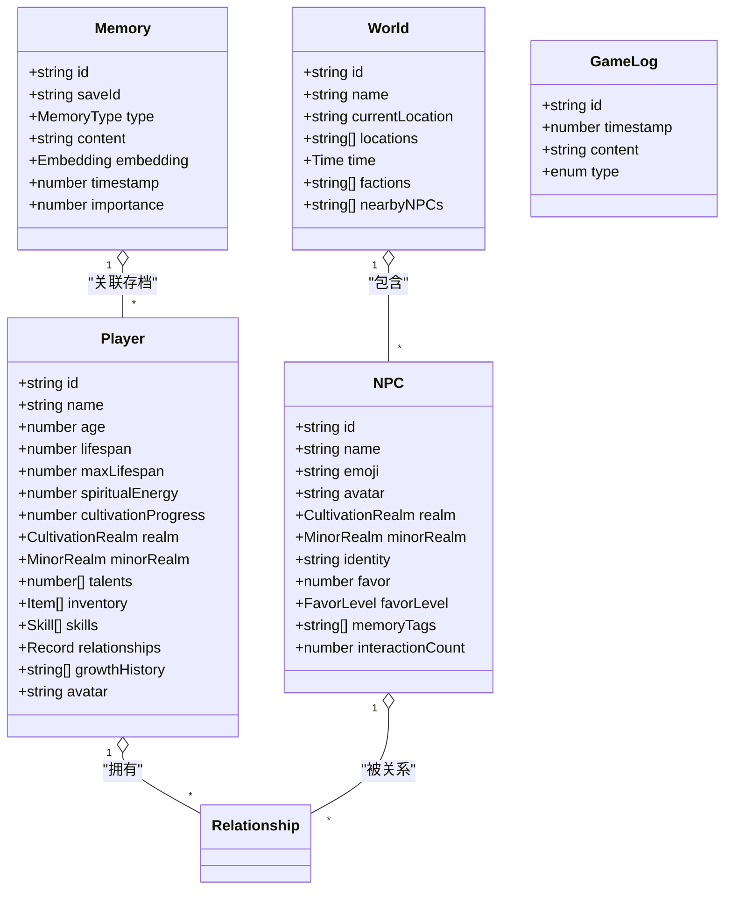
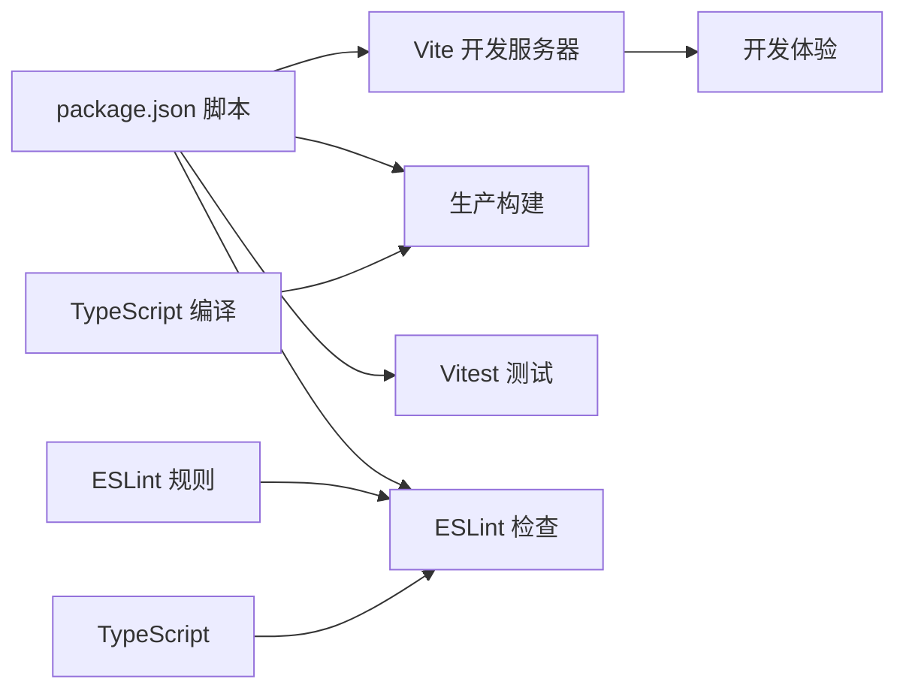

# 开发工作流程

<cite>
**本文引用的文件**
- [package.json](file://package.json)
- [README.md](file://README.md)
- [AGENTS.md](file://AGENTS.md)
- [vite.config.ts](file://vite.config.ts)
- [tsconfig.json](file://tsconfig.json)
- [.eslintrc.cjs](file://.eslintrc.cjs)
- [tailwind.config.js](file://tailwind.config.js)
- [.gitignore](file://.gitignore)
- [src/main.tsx](file://src/main.tsx)
- [src/App.tsx](file://src/App.tsx)
- [src/types/game.ts](file://src/types/game.ts)
- [src/lib/utils.ts](file://src/lib/utils.ts)
- [src/stores/useGameStore.ts](file://src/stores/useGameStore.ts)
</cite>

## 目录
1. [简介](#简介)
2. [项目结构](#项目结构)
3. [核心组件](#核心组件)
4. [架构总览](#架构总览)
5. [详细组件分析](#详细组件分析)
6. [依赖分析](#依赖分析)
7. [性能考虑](#性能考虑)
8. [故障排查指南](#故障排查指南)
9. [结论](#结论)
10. [附录](#附录)

## 简介
本文件面向“修仙 Roguelike”项目的开发者，提供从环境搭建、开发服务器启动、构建与预览，到 Git 提交规范、分支与代码审查策略、开发检查清单、测试与调试技巧、功能开发与 bug 修复及性能优化的全流程指导。项目采用 Vite + React 18 + TypeScript 技术栈，结合 Zustand 状态管理、TailwindCSS + shadcn/ui、Vitest 测试框架，并以 LLM 实时驱动游戏内容生成。

## 项目结构
项目采用按功能域划分的目录组织方式，核心模块包括：
- 组件层：UI 组件与业务组件
- 服务层：LLM 服务、游戏逻辑服务、数据库封装
- 状态层：Zustand Store（游戏状态、设置）
- 类型层：游戏相关类型定义
- 工具层：通用工具函数
- 配置层：Vite、TypeScript、ESLint、TailwindCSS、Git 忽略规则

图表来源
- [src/main.tsx](file://src/main.tsx#L1-L11)
- [src/App.tsx](file://src/App.tsx#L1-L588)
- [src/stores/useGameStore.ts](file://src/stores/useGameStore.ts#L1-L226)
- [src/types/game.ts](file://src/types/game.ts#L1-L319)
- [src/lib/utils.ts](file://src/lib/utils.ts#L1-L7)

章节来源
- [README.md](file://README.md#L77-L97)
- [AGENTS.md](file://AGENTS.md#L225-L283)

## 核心组件
- 应用入口与渲染：负责挂载 React 应用，引入全局样式。
- 应用主组件：协调游戏阶段切换（主页/角色创建/游戏主界面），初始化 LLM 与游戏服务，处理自动存档与错误提示。
- 状态管理：Zustand Store 管理玩家、NPC、世界、日志、事件、记忆、回合数、加载状态、错误、存档 ID 与最近保存时间；部分状态持久化至 localStorage。
- 类型系统：集中定义修仙术语的领域类型（境界、小境界、物品、技能、关系、记忆、时间等），确保强类型约束。
- 工具函数：cn 合并类名，配合 TailwindCSS 与 shadcn/ui 使用。

章节来源
- [src/main.tsx](file://src/main.tsx#L1-L11)
- [src/App.tsx](file://src/App.tsx#L1-L588)
- [src/stores/useGameStore.ts](file://src/stores/useGameStore.ts#L1-L226)
- [src/types/game.ts](file://src/types/game.ts#L1-L319)
- [src/lib/utils.ts](file://src/lib/utils.ts#L1-L7)

## 架构总览
应用采用“组件 + 服务 + 状态 + 类型”的分层架构，UI 通过 Zustand Store 读写状态，服务层负责与 LLM 和 IndexedDB 交互，类型系统贯穿各层以保障一致性。

图表来源
- [src/App.tsx](file://src/App.tsx#L1-L588)
- [src/stores/useGameStore.ts](file://src/stores/useGameStore.ts#L1-L226)
- [src/types/game.ts](file://src/types/game.ts#L1-L319)
- [src/lib/utils.ts](file://src/lib/utils.ts#L1-L7)

## 详细组件分析

### 应用主组件（App）
职责与流程要点：
- 游戏阶段管理：start → character_creation → game
- 主题同步：根据设置将 light/dark 类名同步到 html 根节点
- 服务初始化：基于 LLM 配置创建游戏服务（memoized 以避免重复实例化）
- 自动存档：每 30 秒一次，且每次行动后触发；存档内容包含玩家、NPC、世界、日志、事件、记忆、回合数、状态等
- 行动处理：记录玩家行动、生成剧情、更新属性与时间、处理突破、物品与技能变更、NPC 关系变化、添加日志与建议
- NPC 交互：选择 NPC、发起交互、更新双方状态、记录时间流逝与剧情更新

图表来源
- [src/App.tsx](file://src/App.tsx#L240-L468)
- [src/stores/useGameStore.ts](file://src/stores/useGameStore.ts#L1-L226)

章节来源
- [src/App.tsx](file://src/App.tsx#L16-L588)

### 状态管理（Zustand Store）
- 初始状态：玩家、NPC、世界、日志、事件、记忆、回合、播放状态、加载状态、错误、存档信息、NPC 交互状态
- 持久化策略：仅持久化必要字段（玩家、世界、日志、事件、记忆、回合、存档信息等）
- 方法族：设置/更新玩家、增删改 NPC、初始化世界、更新时间、添加日志/事件/记忆、增量更新、回合计数、加载/错误状态、重置、加载、NPC 交互控制、附近 NPC 列表维护

图表来源
- [src/stores/useGameStore.ts](file://src/stores/useGameStore.ts#L13-L55)

章节来源
- [src/stores/useGameStore.ts](file://src/stores/useGameStore.ts#L84-L226)

### 类型系统（game.ts）
- 领域类型：境界、小境界、物品类型、品质、技能类型与品质、关系等级、记忆类型、时间、嵌入向量、记忆、物品、技能、关系、玩家、NPC、世界、事件、日志、LLM 配置、游戏设置、NPC 交互结果
- 工具函数：根据好感度映射等级与颜色、图标

图表来源
- [src/types/game.ts](file://src/types/game.ts#L110-L217)

章节来源
- [src/types/game.ts](file://src/types/game.ts#L1-L319)

### 工具函数（utils.ts）
- cn：合并类名，确保 TailwindCSS 样式正确覆盖

章节来源
- [src/lib/utils.ts](file://src/lib/utils.ts#L1-L7)

## 依赖分析
- 构建与开发：Vite、React、TypeScript、React DOM
- 样式与组件：TailwindCSS、shadcn/ui、lucide-react、framer-motion
- 状态管理：Zustand、zustand-persist
- LLM 与嵌入：@xenova/transformers
- 测试：Vitest
- 代码质量：ESLint、TypeScript ESlint 插件、React Hooks/React Refresh 规则

图表来源
- [package.json](file://package.json#L6-L14)
- [.eslintrc.cjs](file://.eslintrc.cjs#L1-L20)
- [tsconfig.json](file://tsconfig.json#L1-L32)

章节来源
- [package.json](file://package.json#L1-L55)
- [.eslintrc.cjs](file://.eslintrc.cjs#L1-L20)
- [tsconfig.json](file://tsconfig.json#L1-L32)

## 性能考虑
- 构建与打包：Vite 提供快速冷启动与热更新；生产构建开启 Tree-shaking 与最小化
- 类型检查：严格模式与未使用变量/参数检查，减少运行时开销
- 状态更新：使用 Zustand 的局部更新与不可变更新模式，避免不必要的重渲染
- LLM 调用：使用 memoized 的服务实例，减少重复初始化；合理设置温度与 JSON 输出格式，提高稳定性
- UI 渲染：TailwindCSS 动态类名合并，避免过度嵌套与重复样式
- 存档策略：自动存档间隔与触发点平衡，避免频繁 I/O；仅持久化必要字段

## 故障排查指南
- 开发服务器无法启动
  - 检查 Node.js 与 npm 版本兼容性
  - 清理缓存并重新安装依赖
  - 查看端口占用情况
- 构建失败
  - 运行 TypeScript 与 ESLint 检查，修复类型与规则问题
  - 确认路径别名与模块解析配置
- LLM 调用异常
  - 校验 API Key、Base URL 与模型名称
  - 检查网络连通性与跨域策略
  - 实现指数退避重试与错误提示
- 存档/读档问题
  - 确认 IndexedDB 初始化与权限
  - 检查持久化字段与序列化/反序列化逻辑
- UI 样式异常
  - 检查 Tailwind 配置与类名拼接
  - 确认主题切换逻辑与 html 根节点类名

章节来源
- [AGENTS.md](file://AGENTS.md#L371-L411)
- [AGENTS.md](file://AGENTS.md#L485-L511)
- [src/App.tsx](file://src/App.tsx#L62-L66)
- [src/App.tsx](file://src/App.tsx#L74-L122)

## 结论
本项目以清晰的分层架构与强类型体系为基础，结合 Zustand 状态管理与 LLM 驱动的动态内容生成，提供了完整的开发工作流指导。遵循本文档的开发流程、检查清单与最佳实践，可高效推进功能迭代、稳定发布与持续优化。

## 附录

### 开发环境搭建与常用命令
- 安装依赖
- 启动开发服务器
- 构建生产版本
- 预览构建结果
- 运行测试与覆盖率
- 代码检查

章节来源
- [README.md](file://README.md#L21-L46)
- [AGENTS.md](file://AGENTS.md#L27-L51)
- [package.json](file://package.json#L6-L14)

### Git 提交规范与分支策略
- 提交信息格式：<type>(<scope>): <subject>
- Type 类型：feat、fix、docs、style、refactor、test、chore
- 分支策略：主分支保护、功能分支、热修复分支、版本标签
- 代码审查：PR 模plate、至少一名 reviewer、检查清单、测试与构建通过

章节来源
- [AGENTS.md](file://AGENTS.md#L485-L511)

### 开发检查清单
- TypeScript 类型定义完整
- 构建成功
- ESLint 检查通过
- 移动端适配正常
- 错误处理完善（try-catch + toast 提示）
- 新增文件符合项目结构规范

章节来源
- [AGENTS.md](file://AGENTS.md#L514-L525)

### 测试流程与调试技巧
- 单次运行测试
- Watch 模式
- 生成覆盖率报告
- 调试技巧：断点、日志、状态快照、LLM 请求/响应观察

章节来源
- [AGENTS.md](file://AGENTS.md#L45-L50)

### 功能开发、Bug 修复与性能优化流程
- 功能开发：需求拆解 → 类型定义 → 组件与服务实现 → 状态更新 → 测试与构建 → 代码审查 → 合并
- Bug 修复：复现步骤 → 定位问题 → 修复方案 → 单元/集成测试 → 回归测试 → 发布
- 性能优化：瓶颈定位 → 状态优化 → 渲染优化 → I/O 优化 → LLM 调优

章节来源
- [AGENTS.md](file://AGENTS.md#L120-L223)

### 配置文件要点
- Vite：插件与路径别名
- TypeScript：严格模式、路径映射、模块解析
- ESLint：推荐规则、React Hooks 规则、禁用 react-refresh 警告
- TailwindCSS：content 范围、主题扩展、动画插件
- Git 忽略：日志、依赖、编辑器目录、环境变量、覆盖率输出

章节来源
- [vite.config.ts](file://vite.config.ts#L1-L12)
- [tsconfig.json](file://tsconfig.json#L1-L32)
- [.eslintrc.cjs](file://.eslintrc.cjs#L1-L20)
- [tailwind.config.js](file://tailwind.config.js#L1-L53)
- [.gitignore](file://.gitignore#L1-L34)