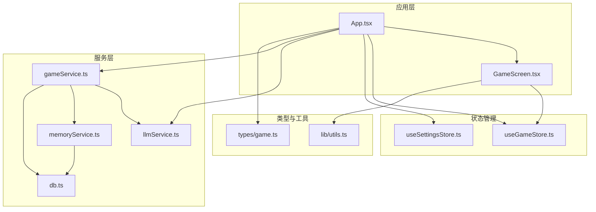
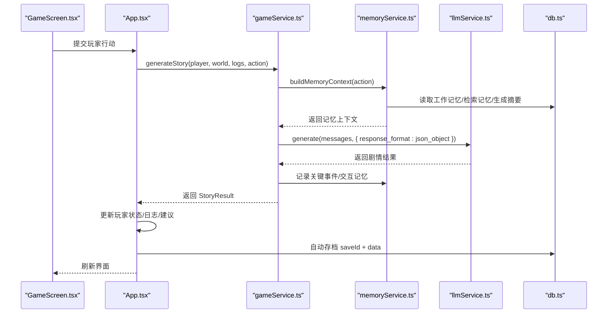
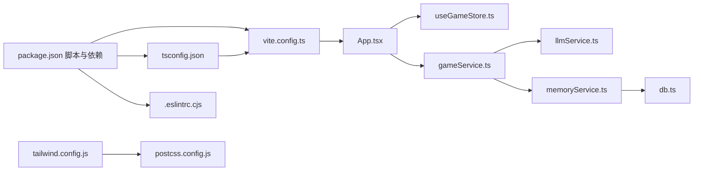

# 开发指南

<cite>
**本文引用的文件**
- [package.json](file://package.json)
- [tsconfig.json](file://tsconfig.json)
- [.eslintrc.cjs](file://.eslintrc.cjs)
- [vite.config.ts](file://vite.config.ts)
- [tailwind.config.js](file://tailwind.config.js)
- [postcss.config.js](file://postcss.config.js)
- [README.md](file://README.md)
- [AGENTS.md](file://AGENTS.md)
- [src\App.tsx](file://src\App.tsx)
- [src\stores\useGameStore.ts](file://src\stores\useGameStore.ts)
- [src\stores\useSettingsStore.ts](file://src\stores\useSettingsStore.ts)
- [src\types\game.ts](file://src\types\game.ts)
- [src\lib\utils.ts](file://src\lib\utils.ts)
- [src\services\gameService.ts](file://src\services\gameService.ts)
- [src\services\llmService.ts](file://src\services\llmService.ts)
- [src\services\memoryService.ts](file://src\services\memoryService.ts)
- [src\services\db.ts](file://src\services\db.ts)
- [src\components\GameScreen.tsx](file://src\components\GameScreen.tsx)
</cite>

## 目录
1. [简介](#简介)
2. [项目结构](#项目结构)
3. [核心组件](#核心组件)
4. [架构总览](#架构总览)
5. [详细组件分析](#详细组件分析)
6. [依赖分析](#依赖分析)
7. [性能考虑](#性能考虑)
8. [故障排查指南](#故障排查指南)
9. [结论](#结论)
10. [附录](#附录)

## 简介
本指南面向参与“修仙 Roguelike”项目的开发者，提供从环境搭建、代码风格、TypeScript 配置、ESLint 规则、组件开发最佳实践，到状态管理、API 调用模式、测试策略、性能优化与错误处理的完整开发规范。项目采用 Vite + React 18 + TypeScript，结合 Zustand 状态管理、TailwindCSS + shadcn/ui、Zustand 持久化、@xenova/transformers 浏览器嵌入模型与 IndexedDB，实现纯前端的 AI 驱动修仙世界。

## 项目结构
项目遵循约定式文件组织，按功能域划分目录，便于扩展与维护：
- src/components：React 组件（含 UI 组件与业务组件）
- src/stores：Zustand 状态管理（游戏状态、设置、Token 统计）
- src/services：服务层（LLM、游戏逻辑、记忆、数据库）
- src/types：TypeScript 类型定义
- src/lib：通用工具函数
- src/prompts：LLM 提示词（角色、剧情、摘要）
- 根目录配置：Vite、TailwindCSS、PostCSS、TypeScript、ESLint

图表来源
- [src\App.tsx](file://src\App.tsx#L1-L588)
- [src\components\GameScreen.tsx](file://src\components\GameScreen.tsx#L1-L172)
- [src\stores\useGameStore.ts](file://src\stores\useGameStore.ts#L1-L226)
- [src\stores\useSettingsStore.ts](file://src\stores\useSettingsStore.ts#L1-L46)
- [src\services\llmService.ts](file://src\services\llmService.ts#L1-L101)
- [src\services\gameService.ts](file://src\services\gameService.ts#L1-L541)
- [src\services\memoryService.ts](file://src\services\memoryService.ts#L1-L224)
- [src\services\db.ts](file://src\services\db.ts#L1-L236)
- [src\types\game.ts](file://src\types\game.ts#L1-L319)
- [src\lib\utils.ts](file://src\lib\utils.ts#L1-L7)

章节来源
- [README.md](file://README.md#L77-L97)
- [AGENTS.md](file://AGENTS.md#L225-L283)

## 核心组件
- 应用入口与路由控制：App.tsx 管理游戏阶段（主页/角色创建/游戏主界面）、主题同步、LLM 服务初始化、自动存档与错误提示。
- 游戏主界面：GameScreen.tsx 负责布局（左侧状态、中间剧情与行动、右侧地图与 NPC）、沉浸式加载、Token 统计与 NPC 交互模态。
- 状态管理：useGameStore.ts 提供玩家、NPC、世界、日志、事件、记忆、回合数、加载状态、存档 ID、最近保存时间等；useSettingsStore.ts 管理 LLM 配置、自动保存开关、主题。
- 服务层：llmService.ts 提供 LLM 调用与重试；gameService.ts 负责角色生成、剧情推演、NPC 交互、区域 NPC 生成、记忆记录；memoryService.ts 实现三层记忆（工作记忆/摘要/检索）；db.ts 封装 IndexedDB 存取。
- 类型系统：types/game.ts 定义修仙体系的核心类型（境界、属性、物品、技能、关系、记忆、时间等）。
- 工具函数：lib/utils.ts 提供类名合并工具 cn()。

章节来源
- [src\App.tsx](file://src\App.tsx#L1-L588)
- [src\components\GameScreen.tsx](file://src\components\GameScreen.tsx#L1-L172)
- [src\stores\useGameStore.ts](file://src\stores\useGameStore.ts#L1-L226)
- [src\stores\useSettingsStore.ts](file://src\stores\useSettingsStore.ts#L1-L46)
- [src\services\llmService.ts](file://src\services\llmService.ts#L1-L101)
- [src\services\gameService.ts](file://src\services\gameService.ts#L1-L541)
- [src\services\memoryService.ts](file://src\services\memoryService.ts#L1-L224)
- [src\services\db.ts](file://src\services\db.ts#L1-L236)
- [src\types\game.ts](file://src\types\game.ts#L1-L319)
- [src\lib\utils.ts](file://src\lib\utils.ts#L1-L7)

## 架构总览
系统采用“UI 组件 + Zustand 状态 + 服务层 + 数据持久化”的分层架构。App.tsx 作为顶层协调者，负责：
- 初始化 LLM 与游戏服务
- 管理游戏阶段与路由
- 触发自动存档与错误提示
- 将玩家行动传递给 gameService 生成剧情并更新状态

图表来源
- [src\App.tsx](file://src\App.tsx#L240-L468)
- [src\services\gameService.ts](file://src\services\gameService.ts#L283-L391)
- [src\services\memoryService.ts](file://src\services\memoryService.ts#L175-L188)
- [src\services\llmService.ts](file://src\services\llmService.ts#L29-L55)
- [src\services\db.ts](file://src\services\db.ts#L134-L150)

## 详细组件分析

### 状态管理规范（Zustand）
- Store 设计原则
  - 明确 State 与 Actions 分离，使用 create 创建 store，使用 persist 中间件进行持久化。
  - 仅暴露必要方法，避免跨 store 的直接耦合。
- 持久化策略
  - localStorage：设置（API 配置、主题、自动保存）。
  - IndexedDB：游戏存档与记忆片段（大容量）。
- 代码示例路径
  - [useGameStore 定义与持久化](file://src\stores\useGameStore.ts#L84-L225)
  - [useSettingsStore 默认配置与持久化](file://src\stores\useSettingsStore.ts#L24-L45)

章节来源
- [src\stores\useGameStore.ts](file://src\stores\useGameStore.ts#L1-L226)
- [src\stores\useSettingsStore.ts](file://src\stores\useSettingsStore.ts#L1-L46)
- [AGENTS.md](file://AGENTS.md#L287-L367)

### LLM 服务与提示词规范
- API 调用规范
  - 统一使用 JSON 响应格式，严格解析与校验返回数据。
  - 实现指数退避重试（最多 3 次），失败时抛出可读错误。
- 提示词组织
  - 按功能拆分：角色、剧情、摘要，要求返回 JSON 结构与示例。
- 代码示例路径
  - [llmService.generate 与重试](file://src\services\llmService.ts#L29-L55)
  - [gameService.generateStory 使用记忆上下文](file://src\services\gameService.ts#L283-L391)
  - [memoryService.buildMemoryContext](file://src\services\memoryService.ts#L175-L188)

章节来源
- [src\services\llmService.ts](file://src\services\llmService.ts#L1-L101)
- [src\services\gameService.ts](file://src\services\gameService.ts#L1-L541)
- [src\services\memoryService.ts](file://src\services\memoryService.ts#L1-L224)
- [AGENTS.md](file://AGENTS.md#L371-L411)

### 记忆系统（三层架构）
- 工作记忆：最近 N 条（默认 10）完整对话。
- 摘要记忆：超过阈值后生成摘要，降低上下文长度。
- RAG 检索：基于语义相似度检索相关记忆。
- 重要性评分：区分高/中/低重要事件，指导摘要与清理。
- 代码示例路径
  - [memoryService.addMemory/calculateImportance](file://src\services\memoryService.ts#L84-L119)
  - [memoryService.retrieveRelevantMemories](file://src\services\memoryService.ts#L122-L137)
  - [memoryService.generateSummary](file://src\services\memoryService.ts#L145-L173)

章节来源
- [src\services\memoryService.ts](file://src\services\memoryService.ts#L1-L224)
- [AGENTS.md](file://AGENTS.md#L413-L438)

### 数据库与存档（IndexedDB）
- 存储结构
  - saves：存档元数据（名称、时间戳、境界等）
  - saveData：完整游戏状态
  - memories：记忆片段（含嵌入向量、重要性、时间戳）
- 事务与索引
  - 通过索引（saveId、timestamp、importance）提升查询效率。
- 代码示例路径
  - [db.init/upgrade 与对象存储](file://src\services\db.ts#L39-L71)
  - [db.saveSaveData/getSaveData](file://src\services\db.ts#L134-L150)
  - [db.addMemory/getMemoriesBySaveId](file://src\services\db.ts#L161-L189)

章节来源
- [src\services\db.ts](file://src\services\db.ts#L1-L236)
- [AGENTS.md](file://AGENTS.md#L349-L367)

### 组件开发流程与最佳实践
- 组件命名与结构
  - 文件名与组件名一致，优先函数组件，使用 TypeScript Props 类型。
  - 使用 cn() 合并类名，保持样式一致性。
- 布局与交互
  - 桌面端三栏布局（状态/剧情/地图+NPC），移动端垂直堆叠。
  - 沉浸式加载与 Toast 提示增强体验。
- 代码示例路径
  - [GameScreen 布局与交互](file://src\components\GameScreen.tsx#L1-L172)
  - [utils.cn 合并类名](file://src\lib\utils.ts#L1-L7)

章节来源
- [src\components\GameScreen.tsx](file://src\components\GameScreen.tsx#L1-L172)
- [src\lib\utils.ts](file://src\lib\utils.ts#L1-L7)
- [AGENTS.md](file://AGENTS.md#L440-L483)

### 状态管理规范与 API 调用模式
- 状态更新
  - 使用局部更新（Partial）避免不必要的重渲染。
  - 通过派生函数（如 getNearbyNPCs）减少重复计算。
- API 调用
  - 在 App.tsx 中通过 useMemo 缓存 LLM 配置不变时的服务实例。
  - 在 gameService 中封装 LLM 调用与记忆记录，避免 UI 组件直接依赖服务。
- 代码示例路径
  - [useMemo 缓存 gameServiceWithMemory](file://src\App.tsx#L68-L72)
  - [useGameStore.updatePlayer 局部更新](file://src\stores\useGameStore.ts#L91-L94)
  - [gameService.generateStory 组装上下文](file://src\services\gameService.ts#L283-L391)

章节来源
- [src\App.tsx](file://src\App.tsx#L68-L72)
- [src\stores\useGameStore.ts](file://src\stores\useGameStore.ts#L91-L94)
- [src\services\gameService.ts](file://src\services\gameService.ts#L283-L391)

## 依赖分析
- 构建与开发
  - Vite + React + TypeScript，路径别名 @/ 指向 src。
  - PostCSS + TailwindCSS，主题色基于 CSS 变量。
- 状态管理
  - Zustand + zustand-persist，分别处理内存状态与持久化。
- AI 与嵌入
  - @xenova/transformers 浏览器端嵌入模型，用于语义检索。
- UI 组件
  - shadcn/ui + lucide-react，配合 TailwindCSS 实现暗黑修仙风格。
- 测试
  - Vitest，支持 watch 与覆盖率。

图表来源
- [package.json](file://package.json#L1-L55)
- [vite.config.ts](file://vite.config.ts#L1-L12)
- [tsconfig.json](file://tsconfig.json#L1-L32)
- [.eslintrc.cjs](file://.eslintrc.cjs#L1-L20)
- [tailwind.config.js](file://tailwind.config.js#L1-L53)
- [postcss.config.js](file://postcss.config.js#L1-L7)

章节来源
- [package.json](file://package.json#L1-L55)
- [vite.config.ts](file://vite.config.ts#L1-L12)
- [tsconfig.json](file://tsconfig.json#L1-L32)
- [.eslintrc.cjs](file://.eslintrc.cjs#L1-L20)
- [tailwind.config.js](file://tailwind.config.js#L1-L53)
- [postcss.config.js](file://postcss.config.js#L1-L7)

## 性能考虑
- 渲染性能
  - 使用 React.memo 与 useMemo 缓存昂贵计算（如记忆上下文、派生 NPC 列表）。
  - 控制日志与记忆数量，避免一次性渲染过多节点。
- 状态与存储
  - Zustand 按需更新，避免大对象深拷贝。
  - IndexedDB 查询使用索引（saveId、timestamp、importance）。
- LLM 调用
  - 使用 JSON 响应格式与重试机制，减少解析失败与网络抖动影响。
  - 记忆摘要与检索降低上下文长度，提高响应速度。
- UI 动画
  - Framer Motion 的入场动画按延迟顺序执行，避免同时大量动画造成掉帧。

章节来源
- [src\App.tsx](file://src\App.tsx#L74-L122)
- [src\stores\useGameStore.ts](file://src\stores\useGameStore.ts#L80-L82)
- [src\services\memoryService.ts](file://src\services\memoryService.ts#L175-L188)
- [src\components\GameScreen.tsx](file://src\components\GameScreen.tsx#L54-L171)

## 故障排查指南
- LLM 调用失败
  - 现象：生成剧情/角色/交互时报错。
  - 排查：检查 baseURL、apiKey、model 配置；查看重试日志；确认 response_format 为 json_object。
  - 参考路径：[llmService.generate](file://src\services\llmService.ts#L29-L55)
- IndexedDB 初始化失败
  - 现象：无法保存/加载存档。
  - 排查：确认浏览器支持 IndexedDB；查看 onupgradeneeded 是否创建对象存储与索引。
  - 参考路径：[db.init](file://src\services\db.ts#L39-L71)
- 记忆检索为空
  - 现象：剧情缺乏上下文或重复。
  - 排查：确认嵌入模型加载成功；检查 calculateImportance 与 retrieveRelevantMemories。
  - 参考路径：[memoryService.initEmbeddingModel](file://src\services\memoryService.ts#L28-L37)
- 状态未持久化
  - 现象：刷新后设置丢失。
  - 排查：确认 persist 配置与 storage 使用 localStorage。
  - 参考路径：[useSettingsStore.persist](file://src\stores\useSettingsStore.ts#L24-L45)

章节来源
- [src\services\llmService.ts](file://src\services\llmService.ts#L29-L55)
- [src\services\db.ts](file://src\services\db.ts#L39-L71)
- [src\services\memoryService.ts](file://src\services\memoryService.ts#L28-L37)
- [src\stores\useSettingsStore.ts](file://src\stores\useSettingsStore.ts#L24-L45)

## 结论
本指南提供了从环境配置、代码风格、TypeScript 与 ESLint 规范，到组件开发、状态管理、LLM 与记忆系统、数据库存档、测试策略与性能优化的完整开发规范。建议在新增功能时遵循 AGENTS.md 的命名与结构约定，并在提交前确保构建、类型检查、测试与移动端适配均通过。

## 附录
- 开发命令与脚本
  - dev/build/test/lint/preview，详见 [package.json scripts](file://package.json#L6-L13)
- TypeScript 配置要点
  - 模块解析 bundler、路径别名 @/、严格模式、noUnusedLocals/Parameters、switch 无遗漏。
  - 参考 [tsconfig.json](file://tsconfig.json#L1-L32)
- ESLint 规则
  - 推荐规则集 + TypeScript ESLint + React Hooks + react-refresh，忽略 dist 与 .eslintrc.cjs。
  - 参考 [.eslintrc.cjs](file://.eslintrc.cjs#L1-L20)
- TailwindCSS 与 PostCSS
  - content 覆盖 src/**/*.{js,ts,jsx,tsx}，插件 tailwindcss-animate。
  - 参考 [tailwind.config.js](file://tailwind.config.js#L1-L53)、[postcss.config.js](file://postcss.config.js#L1-L7)
- 类型系统与命名规范
  - 修仙术语使用中文枚举；常量使用 UPPER_SNAKE_CASE；Hook 使用 use 前缀。
  - 参考 [types/game.ts](file://src\types\game.ts#L1-L319)、[AGENTS.md](file://AGENTS.md#L120-L223)