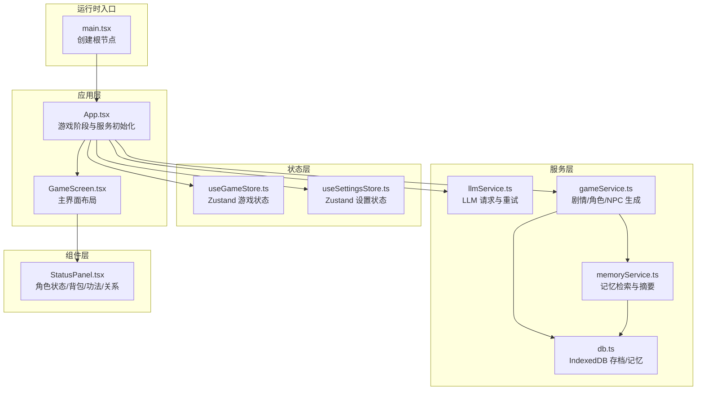
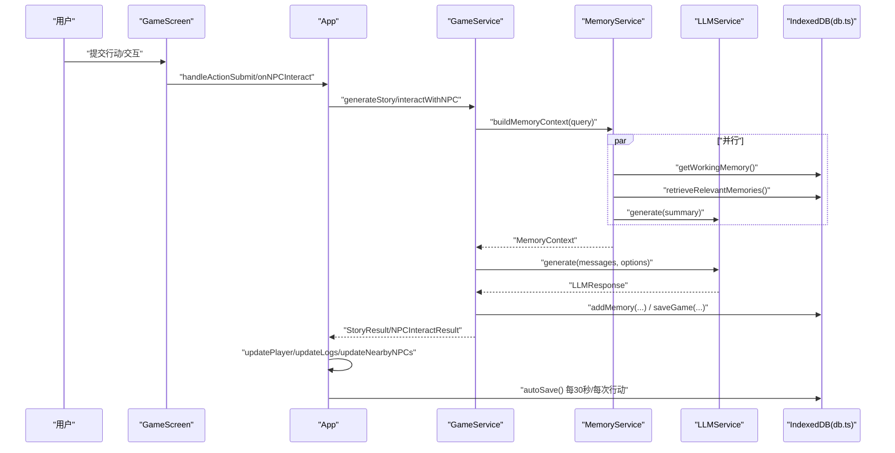
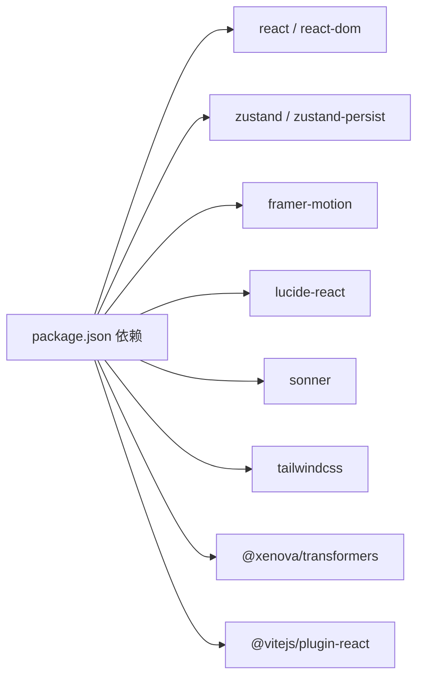

# 性能优化

<cite>
**本文引用的文件**
- [README.md](file://README.md)
- [package.json](file://package.json)
- [vite.config.ts](file://vite.config.ts)
- [src/App.tsx](file://src/App.tsx)
- [src/main.tsx](file://src/main.tsx)
- [src/stores/useGameStore.ts](file://src/stores/useGameStore.ts)
- [src/stores/useSettingsStore.ts](file://src/stores/useSettingsStore.ts)
- [src/services/gameService.ts](file://src/services/gameService.ts)
- [src/services/llmService.ts](file://src/services/llmService.ts)
- [src/services/memoryService.ts](file://src/services/memoryService.ts)
- [src/services/db.ts](file://src/services/db.ts)
- [src/components/GameScreen.tsx](file://src/components/GameScreen.tsx)
- [src/components/StatusPanel.tsx](file://src/components/StatusPanel.tsx)
- [src/types/game.ts](file://src/types/game.ts)
- [src/prompts/story.ts](file://src/prompts/story.ts)
</cite>

## 目录
1. [简介](#简介)
2. [项目结构](#项目结构)
3. [核心组件](#核心组件)
4. [架构总览](#架构总览)
5. [详细组件分析](#详细组件分析)
6. [依赖分析](#依赖分析)
7. [性能考量](#性能考量)
8. [故障排查指南](#故障排查指南)
9. [结论](#结论)
10. [附录](#附录)

## 简介
本指南面向“修仙 Roguelike”项目，聚焦前端性能优化策略，覆盖 React 渲染优化、Zustand 状态管理优化、内存管理最佳实践、组件懒加载策略、AI 服务调用优化、缓存与网络请求优化、性能监控与瓶颈定位、以及可落地的优化案例与测试方法。目标是在保持高质量叙事体验的同时，显著降低首屏与交互延迟、减少不必要的重渲染、控制 LLM 请求成本与响应时间，并稳定 IndexedDB 存取性能。

## 项目结构
项目采用 Vite + React 18 + TypeScript 架构，使用 Zustand 管理全局状态，通过 LLMService 与 AI 服务交互，MemoryService 实现 RAG 式记忆检索，db.ts 封装 IndexedDB 存档与记忆持久化。组件层以 GameScreen 为核心，分左右中三栏布局，配合状态面板、故事日志、NPC 交互等模块。

图表来源
- [src/main.tsx](file://src/main.tsx#L1-L11)
- [src/App.tsx](file://src/App.tsx#L1-L588)
- [src/components/GameScreen.tsx](file://src/components/GameScreen.tsx#L1-L172)
- [src/components/StatusPanel.tsx](file://src/components/StatusPanel.tsx#L1-L503)
- [src/stores/useGameStore.ts](file://src/stores/useGameStore.ts#L1-L226)
- [src/stores/useSettingsStore.ts](file://src/stores/useSettingsStore.ts#L1-L46)
- [src/services/llmService.ts](file://src/services/llmService.ts#L1-L101)
- [src/services/gameService.ts](file://src/services/gameService.ts#L1-L541)
- [src/services/memoryService.ts](file://src/services/memoryService.ts#L1-L224)
- [src/services/db.ts](file://src/services/db.ts#L1-L236)

章节来源
- [README.md](file://README.md#L1-L106)
- [package.json](file://package.json#L1-L55)
- [vite.config.ts](file://vite.config.ts#L1-L12)

## 核心组件
- App.tsx：统一管理游戏阶段、LLM 服务实例、自动存档、全局加载状态与错误提示；通过 useMemo 缓存服务实例，避免重复创建。
- useGameStore.ts：集中管理玩家、NPC、世界、日志、记忆、回合数、加载状态与交互状态；使用 persist 中间件持久化关键字段至 localStorage。
- useSettingsStore.ts：管理 LLM 配置、自动存档开关、主题切换；同样使用持久化中间件。
- gameService.ts：封装角色生成、剧情生成、NPC 交互、区域 NPC 生成、记忆上下文构建与摘要生成；记录 token 使用量。
- llmService.ts：统一的 LLM 请求封装，内置指数回退与最大重试次数，支持 JSON/文本响应格式。
- memoryService.ts：工作记忆、检索记忆、摘要记忆、嵌入向量生成（@xenova/transformers 备用哈希向量）、RAG 检索。
- db.ts：IndexedDB 封装，提供存档、记忆的增删查与索引查询。
- GameScreen.tsx：主界面三栏布局，承载状态面板、故事日志、行动输入、地图与 NPC 面板、沉浸式加载与 NPC 交互模态框。
- StatusPanel.tsx：桌面端完整面板 + 移动端弹窗面板，含标签页切换与动画过渡。

章节来源
- [src/App.tsx](file://src/App.tsx#L1-L588)
- [src/stores/useGameStore.ts](file://src/stores/useGameStore.ts#L1-L226)
- [src/stores/useSettingsStore.ts](file://src/stores/useSettingsStore.ts#L1-L46)
- [src/services/gameService.ts](file://src/services/gameService.ts#L1-L541)
- [src/services/llmService.ts](file://src/services/llmService.ts#L1-L101)
- [src/services/memoryService.ts](file://src/services/memoryService.ts#L1-L224)
- [src/services/db.ts](file://src/services/db.ts#L1-L236)
- [src/components/GameScreen.tsx](file://src/components/GameScreen.tsx#L1-L172)
- [src/components/StatusPanel.tsx](file://src/components/StatusPanel.tsx#L1-L503)

## 架构总览
下图展示从用户交互到 LLM 生成再到状态更新与持久化的完整链路，突出关键性能关注点：服务实例缓存、记忆检索并发、LLM 重试与 token 统计、IndexedDB 并发写入与索引查询。

图表来源
- [src/App.tsx](file://src/App.tsx#L240-L468)
- [src/services/gameService.ts](file://src/services/gameService.ts#L283-L391)
- [src/services/memoryService.ts](file://src/services/memoryService.ts#L175-L188)
- [src/services/llmService.ts](file://src/services/llmService.ts#L29-L98)
- [src/services/db.ts](file://src/services/db.ts#L134-L150)

## 详细组件分析

### React 渲染优化与懒加载策略
- 避免重复创建服务实例：App 中使用 useMemo 缓存 createGameService(createLLMService(llmConfig))，确保 llmConfig 不变时不重建实例，降低闭包与依赖变更带来的重渲染风险。
- 严格依赖数组：useEffect/useMemo/useCallback 的依赖数组需最小化且准确，避免无意触发重渲染。
- 组件拆分与条件渲染：GameScreen 对不同区域与 NPC 交互采用条件渲染与独立的模态框，减少无关区域的重绘。
- 动画与过渡：StatusPanel 使用 Framer Motion 的初始动画与 AnimatePresence，仅在必要时触发动画，避免全局重排。
- 懒加载建议：对大型组件（如 NPC 交互详情、背包详情）可按需加载，结合 React.lazy 与 Suspense，减少首屏 JS 体积。

章节来源
- [src/App.tsx](file://src/App.tsx#L67-L72)
- [src/components/GameScreen.tsx](file://src/components/GameScreen.tsx#L1-L172)
- [src/components/StatusPanel.tsx](file://src/components/StatusPanel.tsx#L1-L503)

### Zustand 状态管理优化
- 分离关注点：将玩家、NPC、世界、日志、记忆、回合数、加载状态、交互状态分别建模，避免单一大对象导致的全量重渲染。
- 使用局部更新：updatePlayer 等函数采用浅拷贝合并，避免深层对象变更引发的不必要订阅者重渲染。
- 持久化策略：仅持久化必要字段（如 player、npcs、world、logs、events、memories、memorySummary、turn、isPlaying、saveId、lastSavedAt），减少序列化/反序列化开销。
- 选择器与派生数据：getNearbyNPCs 作为独立函数，避免在组件内进行复杂计算，降低渲染成本。
- 交互状态隔离：selectedNPCId 与 isNPCInteracting 单独管理，避免在主状态中混合 UI 状态。

章节来源
- [src/stores/useGameStore.ts](file://src/stores/useGameStore.ts#L13-L55)
- [src/stores/useGameStore.ts](file://src/stores/useGameStore.ts#L80-L82)
- [src/stores/useGameStore.ts](file://src/stores/useGameStore.ts#L207-L224)

### 内存管理最佳实践
- 记忆工作窗口：MemoryService 维护工作记忆大小与摘要阈值，避免无限增长；通过 calculateImportance 与清理策略保留重要与近期记忆。
- 嵌入向量降本：优先使用 @xenova/transformers 的特征提取模型；失败时回退到简单哈希向量，兼顾性能与可用性。
- IndexedDB 索引：为 memories 建立 saveId、timestamp、importance 索引，加速检索与聚合查询。
- 清理与压缩：定期清理旧记忆（保留高重要性与近期记忆），避免存储膨胀影响读写性能。

章节来源
- [src/services/memoryService.ts](file://src/services/memoryService.ts#L1-L224)
- [src/services/db.ts](file://src/services/db.ts#L64-L69)
- [src/services/db.ts](file://src/services/db.ts#L175-L207)

### 组件渲染优化
- StatusPanel：桌面端完整面板 + 移动端弹窗，减少不必要的 DOM 结构；标签页切换时仅渲染当前页，避免一次性渲染大量数据。
- 列表渲染：InventoryTab/SkillsTab/RelationshipsTab 使用 AnimatePresence 与延迟动画，提升视觉体验同时控制动画开销。
- 数据容错：对缺失字段进行默认值兜底，避免 NaN 导致的渲染异常与计算错误。

章节来源
- [src/components/StatusPanel.tsx](file://src/components/StatusPanel.tsx#L1-L503)

### AI 服务调用优化
- 重试与退避：LLMService 内置最多 3 次重试，按指数退避等待，降低瞬时峰值请求失败率。
- 响应格式与温度：GameService 在不同场景设置合适 temperature 与 response_format，平衡创造性与稳定性。
- 记忆上下文并行：buildMemoryContext 并行获取工作记忆、检索记忆与摘要，缩短等待时间。
- Token 统计：recordTokenUsage 将 prompt/completion/total tokens 记录到 useTokenStore，便于成本控制与优化迭代。

章节来源
- [src/services/llmService.ts](file://src/services/llmService.ts#L37-L55)
- [src/services/gameService.ts](file://src/services/gameService.ts#L64-L72)
- [src/services/gameService.ts](file://src/services/gameService.ts#L283-L391)
- [src/services/memoryService.ts](file://src/services/memoryService.ts#L175-L188)

### 缓存策略与网络请求优化
- 服务实例缓存：App 中 useMemo 缓存 llmService 与 gameService，避免频繁重建导致的闭包与依赖变更。
- LLM 请求参数：固定 max_tokens、temperature、response_format，减少响应体积与解析成本。
- IndexedDB 并发：db.ts 的 Promise 化与事务封装，避免串行写入；批量写入使用 Promise.all 提升吞吐。
- 环境变量：VITE_LLM_BASE_URL/VITE_LLM_API_KEY/VITE_LLM_MODEL 通过环境变量注入，便于在不同部署环境调整。

章节来源
- [src/App.tsx](file://src/App.tsx#L67-L72)
- [src/services/llmService.ts](file://src/services/llmService.ts#L65-L80)
- [src/services/db.ts](file://src/services/db.ts#L134-L150)
- [src/stores/useSettingsStore.ts](file://src/stores/useSettingsStore.ts#L12-L16)

### 性能监控与瓶颈识别
- Token 使用统计：通过 useTokenStore 记录每次 LLM 调用的 token 使用情况，建立成本基线。
- 加载状态与 Toast：isLoading 控制沉浸式加载与 UI 提示，便于感知卡顿。
- IndexedDB 性能：对 getMemoriesBySaveId、retrieveRelevantMemories 等高频查询建立索引，避免全表扫描。
- 建议指标：
  - 首次渲染时间（FCP/LCP）
  - 交互到反馈时间（INP）
  - LLM 平均响应时间与失败率
  - IndexedDB 读写延迟
  - 内存占用与垃圾回收频率

章节来源
- [src/services/gameService.ts](file://src/services/gameService.ts#L64-L72)
- [src/services/db.ts](file://src/services/db.ts#L175-L207)

### 具体优化案例与测试方法
- 案例：将 App 中的 llmConfig 依赖项放入 useMemo 依赖数组，避免因配置对象浅比较导致的实例重建与重渲染。
  - 参考路径：[src/App.tsx](file://src/App.tsx#L67-L72)
- 案例：在 StatusPanel 中对列表项使用延迟动画，控制动画数量与触发时机，减少帧率抖动。
  - 参考路径：[src/components/StatusPanel.tsx](file://src/components/StatusPanel.tsx#L378-L401)
- 案例：在 gameService.ts 中对 buildMemoryContext 使用 Promise.all 并行获取工作记忆、检索记忆与摘要。
  - 参考路径：[src/services/memoryService.ts](file://src/services/memoryService.ts#L175-L188)
- 测试方法：
  - 使用浏览器性能面板录制交互流程，观察主线程占用与长任务。
  - 使用 Lighthouse 或 WebPageTest 进行端到端性能评估。
  - 通过 IndexedDB DevTools 检查索引命中与查询耗时。
  - 增加日志埋点记录 LLM 请求耗时与失败次数，定位热点问题。

章节来源
- [src/App.tsx](file://src/App.tsx#L67-L72)
- [src/components/StatusPanel.tsx](file://src/components/StatusPanel.tsx#L378-L401)
- [src/services/memoryService.ts](file://src/services/memoryService.ts#L175-L188)

## 依赖分析
- Vite 插件：@vitejs/plugin-react 提供 React 热更新与 JSX 转换。
- UI 与动画：framer-motion、lucide-react、sonner、tailwindcss 生态。
- 状态管理：zustand + zustand-persist。
- AI 与嵌入：@xenova/transformers（特征提取）。
- 工具：localforage（本地存储工具，项目中未直接使用，可按需引入）。

图表来源
- [package.json](file://package.json#L15-L36)
- [vite.config.ts](file://vite.config.ts#L1-L12)

章节来源
- [package.json](file://package.json#L1-L55)
- [vite.config.ts](file://vite.config.ts#L1-L12)

## 性能考量
- 首屏与交互延迟
  - 通过 useMemo 缓存服务实例、拆分组件、懒加载重型模块，降低首屏 JS 体积与渲染压力。
  - 使用 isLoading 与沉浸式加载提示，改善感知性能。
- 渲染与重排
  - 将复杂计算移出渲染函数，使用独立工具函数；对列表使用稳定 key 与节流/防抖。
  - 控制动画数量与时长，避免与重渲染叠加。
- 状态与内存
  - 分离 UI 状态与业务状态；持久化精简字段；定期清理低价值记忆。
- 网络与 AI
  - 统一请求封装与重试策略；限制响应体积；并行检索与摘要生成。
- 存储与索引
  - 为高频查询建立索引；批量写入；避免全表扫描。

[本节为通用指导，无需特定文件引用]

## 故障排查指南
- LLM 请求失败
  - 检查 llmService 的重试日志与最终错误信息；确认 baseURL、apiKey、model 配置正确。
  - 参考路径：[src/services/llmService.ts](file://src/services/llmService.ts#L37-L55)
- IndexedDB 初始化失败
  - 检查 db.init() 是否抛错；确认浏览器兼容性与权限。
  - 参考路径：[src/services/db.ts](file://src/services/db.ts#L39-L72)
- 记忆检索缓慢
  - 确认 memories 索引是否存在；检查检索阈值与 topK；考虑降低检索频率或增加缓存。
  - 参考路径：[src/services/db.ts](file://src/services/db.ts#L64-L69), [src/services/memoryService.ts](file://src/services/memoryService.ts#L121-L137)
- 状态不更新或闪烁
  - 检查 Zustand 的 set/update 函数是否正确合并；确认依赖数组与 useMemo/useCallback 使用是否合理。
  - 参考路径：[src/stores/useGameStore.ts](file://src/stores/useGameStore.ts#L84-L206)

章节来源
- [src/services/llmService.ts](file://src/services/llmService.ts#L37-L55)
- [src/services/db.ts](file://src/services/db.ts#L39-L72)
- [src/services/memoryService.ts](file://src/services/memoryService.ts#L121-L137)
- [src/stores/useGameStore.ts](file://src/stores/useGameStore.ts#L84-L206)

## 结论
通过服务实例缓存、Zustand 状态分层与持久化、记忆检索并行化、IndexedDB 索引优化与批量写入、以及组件渲染与动画的精细化控制，可在保持丰富叙事体验的前提下显著提升性能与稳定性。建议持续监控关键指标，结合埋点数据迭代优化策略。

[本节为总结，无需特定文件引用]

## 附录
- 环境变量与配置
  - VITE_LLM_BASE_URL、VITE_LLM_API_KEY、VITE_LLM_MODEL 用于注入 LLM 服务配置。
  - 参考路径：[src/stores/useSettingsStore.ts](file://src/stores/useSettingsStore.ts#L12-L16)
- 提示词与系统提示
  - storySystemPrompt 与 storyGenerationPrompt 用于约束 LLM 输出格式与风格，有助于稳定响应体积与解析成本。
  - 参考路径：[src/prompts/story.ts](file://src/prompts/story.ts#L1-L147)

章节来源
- [src/stores/useSettingsStore.ts](file://src/stores/useSettingsStore.ts#L12-L16)
- [src/prompts/story.ts](file://src/prompts/story.ts#L1-L147)