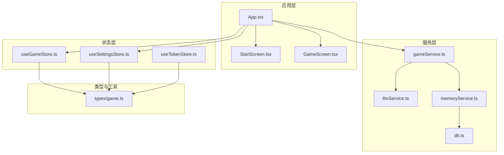
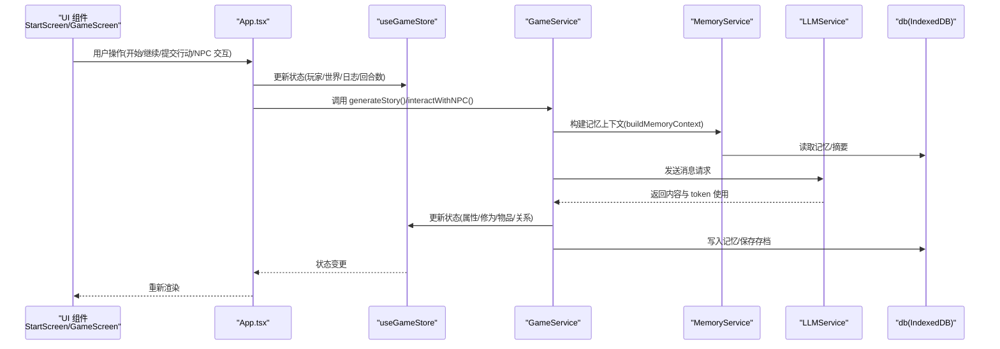
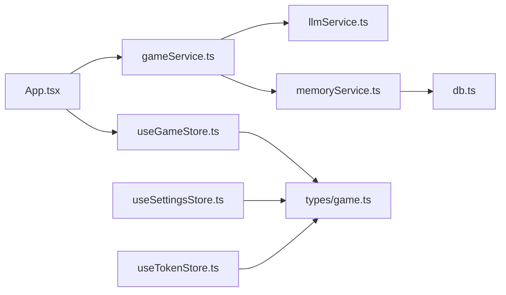

# 测试策略

<cite>
**本文引用的文件**
- [package.json](file://package.json)
- [vite.config.ts](file://vite.config.ts)
- [src/App.tsx](file://src/App.tsx)
- [src/services/gameService.ts](file://src/services/gameService.ts)
- [src/services/llmService.ts](file://src/services/llmService.ts)
- [src/services/memoryService.ts](file://src/services/memoryService.ts)
- [src/services/db.ts](file://src/services/db.ts)
- [src/stores/useGameStore.ts](file://src/stores/useGameStore.ts)
- [src/stores/useSettingsStore.ts](file://src/stores/useSettingsStore.ts)
- [src/stores/useTokenStore.ts](file://src/stores/useTokenStore.ts)
- [src/types/game.ts](file://src/types/game.ts)
- [src/components/StartScreen.tsx](file://src/components/StartScreen.tsx)
- [src/components/GameScreen.tsx](file://src/components/GameScreen.tsx)
</cite>

## 目录
1. [简介](#简介)
2. [项目结构](#项目结构)
3. [核心组件](#核心组件)
4. [架构总览](#架构总览)
5. [详细组件分析](#详细组件分析)
6. [依赖分析](#依赖分析)
7. [性能考虑](#性能考虑)
8. [故障排查指南](#故障排查指南)
9. [结论](#结论)
10. [附录](#附录)

## 简介
本测试策略文档面向“修仙 Roguelike”项目，目标是建立一套覆盖单元测试、集成测试与端到端测试的完整测试体系。重点覆盖以下方面：
- Vitest 配置与测试脚本
- 测试文件组织与命名规范
- Mock 策略与外部依赖隔离
- 游戏逻辑、AI 驱动、异步操作、错误处理、状态管理、UI 组件的测试方法
- 测试覆盖率要求与持续集成配置建议
- 测试示例路径与最佳实践

## 项目结构
项目采用 React + TypeScript + Vite + Zustand + IndexedDB 的技术栈，核心模块包括：
- 服务层：LLMService、GameService、MemoryService、db（IndexedDB）
- 状态层：useGameStore、useSettingsStore、useTokenStore
- 类型定义：types/game.ts
- UI 层：StartScreen、GameScreen 等组件
- 应用入口：App.tsx

图表来源
- [src/App.tsx](file://src/App.tsx#L1-L588)
- [src/components/StartScreen.tsx](file://src/components/StartScreen.tsx#L1-L319)
- [src/components/GameScreen.tsx](file://src/components/GameScreen.tsx#L1-L172)
- [src/services/gameService.ts](file://src/services/gameService.ts#L1-L541)
- [src/services/llmService.ts](file://src/services/llmService.ts#L1-L101)
- [src/services/memoryService.ts](file://src/services/memoryService.ts#L1-L224)
- [src/services/db.ts](file://src/services/db.ts#L1-L236)
- [src/stores/useGameStore.ts](file://src/stores/useGameStore.ts#L1-L226)
- [src/stores/useSettingsStore.ts](file://src/stores/useSettingsStore.ts#L1-L46)
- [src/stores/useTokenStore.ts](file://src/stores/useTokenStore.ts#L1-L73)
- [src/types/game.ts](file://src/types/game.ts#L1-L319)

章节来源
- [src/App.tsx](file://src/App.tsx#L1-L588)
- [src/services/gameService.ts](file://src/services/gameService.ts#L1-L541)
- [src/services/llmService.ts](file://src/services/llmService.ts#L1-L101)
- [src/services/memoryService.ts](file://src/services/memoryService.ts#L1-L224)
- [src/services/db.ts](file://src/services/db.ts#L1-L236)
- [src/stores/useGameStore.ts](file://src/stores/useGameStore.ts#L1-L226)
- [src/stores/useSettingsStore.ts](file://src/stores/useSettingsStore.ts#L1-L46)
- [src/stores/useTokenStore.ts](file://src/stores/useTokenStore.ts#L1-L73)
- [src/types/game.ts](file://src/types/game.ts#L1-L319)

## 核心组件
- 游戏服务 GameService：负责角色生成、剧情生成、NPC 交互、存档/读档、记忆上下文构建与摘要生成。
- LLM 服务 LLMService：封装 LLM 请求、重试机制、错误处理与响应解析。
- 记忆服务 MemoryService：基于 IndexedDB 的记忆存储、嵌入向量检索、摘要生成与工作记忆管理。
- 数据库 db：IndexedDB 封装，提供存档、记忆的增删查改。
- 状态管理：useGameStore（游戏全局状态）、useSettingsStore（设置）、useTokenStore（Token 使用统计）。
- UI 组件：StartScreen、GameScreen 等，承载用户交互与展示。

章节来源
- [src/services/gameService.ts](file://src/services/gameService.ts#L50-L541)
- [src/services/llmService.ts](file://src/services/llmService.ts#L18-L101)
- [src/services/memoryService.ts](file://src/services/memoryService.ts#L16-L224)
- [src/services/db.ts](file://src/services/db.ts#L36-L236)
- [src/stores/useGameStore.ts](file://src/stores/useGameStore.ts#L13-L226)
- [src/stores/useSettingsStore.ts](file://src/stores/useSettingsStore.ts#L5-L46)
- [src/stores/useTokenStore.ts](file://src/stores/useTokenStore.ts#L10-L73)
- [src/components/StartScreen.tsx](file://src/components/StartScreen.tsx#L16-L319)
- [src/components/GameScreen.tsx](file://src/components/GameScreen.tsx#L32-L172)

## 架构总览
下图展示了从 UI 到服务层再到外部 LLM 的调用链路，以及状态与数据持久化的交互。

图表来源
- [src/App.tsx](file://src/App.tsx#L16-L588)
- [src/services/gameService.ts](file://src/services/gameService.ts#L283-L391)
- [src/services/memoryService.ts](file://src/services/memoryService.ts#L175-L188)
- [src/services/llmService.ts](file://src/services/llmService.ts#L29-L98)
- [src/services/db.ts](file://src/services/db.ts#L134-L150)
- [src/stores/useGameStore.ts](file://src/stores/useGameStore.ts#L84-L225)

## 详细组件分析

### 游戏服务 GameService 测试策略
- 单元测试
  - 角色生成：验证生成角色的字段完整性与默认值填充。
  - 剧情生成：模拟 LLM 返回 JSON，断言 StoryResult 字段与默认值合并。
  - NPC 交互：断言交互结果的字段与默认值，以及记忆写入。
  - 存档/读档：断言 saveGame/loadGame 的调用与参数。
- 集成测试
  - 与 MemoryService 的组合：验证 buildMemoryContext 的并发调用与结果拼接。
  - 与 LLMService 的组合：验证重试、错误传播与 token 使用记录。
- 异步与错误处理
  - 模拟 LLM 请求失败与网络异常，验证重试与最终抛错。
  - 断言 GameService 未初始化时的错误抛出。
- Mock 策略
  - 使用 jest.fn 或 vitest.spyOn 替换 LLMService.generate、MemoryService 的检索与摘要方法。
  - 使用内存存储替代 IndexedDB，或使用 fake-indexeddb。

章节来源
- [src/services/gameService.ts](file://src/services/gameService.ts#L50-L541)
- [src/services/llmService.ts](file://src/services/llmService.ts#L18-L101)
- [src/services/memoryService.ts](file://src/services/memoryService.ts#L16-L224)
- [src/services/db.ts](file://src/services/db.ts#L36-L236)

### LLM 服务 LLMService 测试策略
- 单元测试
  - 正常请求：断言请求参数、响应解析与 usage 返回。
  - 重试机制：断言最大重试次数、延迟策略与最终错误抛出。
  - 错误处理：断言非 2xx 响应时的错误文本提取与抛错。
- Mock 策략
  - 使用 vitest.stubEnv 或 fetch 的 spy 模拟网络请求，返回不同状态码与内容。

章节来源
- [src/services/llmService.ts](file://src/services/llmService.ts#L18-L101)

### 记忆服务 MemoryService 测试策略
- 单元测试
  - 嵌入向量生成：验证备用哈希向量生成与相似度计算。
  - 记忆检索：断言检索结果按相似度排序与数量限制。
  - 摘要生成：断言摘要阈值判断与 LLM 调用。
  - 工作记忆与清理：断言最近记忆条数与重要记忆保留。
- 集成测试
  - 与 db 的组合：断言 addMemory/getMemoriesBySaveId 的一致性。
- Mock 策略
  - 模拟 @xenova/transformers 的 pipeline，或直接 stub 生成嵌入的方法。
  - 使用内存存储替代 IndexedDB。

章节来源
- [src/services/memoryService.ts](file://src/services/memoryService.ts#L16-L224)
- [src/services/db.ts](file://src/services/db.ts#L161-L207)

### 数据库 db 测试策略
- 单元测试
  - 存档 CRUD：断言 addSave/updateSave/getSave/deleteSave 的行为。
  - 存档数据 CRUD：断言 saveSaveData/getSaveData/deleteSaveData。
  - 记忆 CRUD：断言 addMemory/addMemories/getMemoriesBySaveId/getMemoriesByImportance/deleteMemoriesBySaveId。
- 集成测试
  - 事务一致性：断言跨表操作的原子性（通过组合场景）。
- Mock 策略
  - 使用 fake-indexeddb 或 vitest 的 IndexedDB 模拟。

章节来源
- [src/services/db.ts](file://src/services/db.ts#L36-L236)

### 状态管理测试策略
- useGameStore
  - 状态更新：断言 setPlayer/updatePlayer/addNpc/updateNpc/removeNpc/setWorld/initWorld/updateTime/addLog/addEvent/addMemory/setMemorySummary/incrementTurn/setIsPlaying/setIsLoading/setError/setSaveId/updateLastSavedAt/resetGame/loadGame 的行为。
  - NPC 交互状态：断言 setSelectedNPC/setNPCInteracting/updateNearbyNPCs。
  - 持久化：断言 persist 的存储键与恢复。
- useSettingsStore
  - 默认配置与环境变量注入：断言 llmConfig 的默认值与更新。
  - 主题切换：断言 setTheme 的行为。
- useTokenStore
  - Token 统计：断言 addUsage/clearLastUsage/resetSession/resetAll 的累加与重置。

章节来源
- [src/stores/useGameStore.ts](file://src/stores/useGameStore.ts#L13-L226)
- [src/stores/useSettingsStore.ts](file://src/stores/useSettingsStore.ts#L5-L46)
- [src/stores/useTokenStore.ts](file://src/stores/useTokenStore.ts#L10-L73)

### UI 组件测试策略
- StartScreen
  - 行为测试：点击“继续”、“重新转世”、“设置”，断言回调触发与 toast 提示。
  - 容错：当 player 为空时，断言 UI 显示与按钮状态。
  - 模型配置检查：断言未配置模型时的弹窗提示。
- GameScreen
  - 行为测试：ActionInput 提交、NPC 选择与交互、返回按钮。
  - 数据展示：断言状态面板、故事日志、地图面板、NPC 面板的数据绑定。
  - 加载态：断言沉浸式加载组件在 isLoading 下的行为。
- Mock 策略
  - 使用 React Testing Library 或 @testing-library/react，结合 vitest 的全局定时器与 fetch 模拟。

章节来源
- [src/components/StartScreen.tsx](file://src/components/StartScreen.tsx#L16-L319)
- [src/components/GameScreen.tsx](file://src/components/GameScreen.tsx#L32-L172)
- [src/App.tsx](file://src/App.tsx#L16-L588)

### AI 驱动功能测试
- 测试要点
  - Prompt 构建：断言系统提示与用户提示的拼接正确性。
  - JSON 解析与默认值：断言 parse 结果的字段默认值与 NaN 安全处理。
  - 记忆上下文：断言 workingMemory、retrievedMemories、summaryMemory 的组装。
- Mock 策略
  - 使用 vitest.spyOn LLMService.generate，返回固定 JSON 文本与 usage。

章节来源
- [src/services/gameService.ts](file://src/services/gameService.ts#L283-L391)
- [src/services/memoryService.ts](file://src/services/memoryService.ts#L175-L188)
- [src/services/llmService.ts](file://src/services/llmService.ts#L29-L98)

### 异步操作与错误处理测试
- 异步流程
  - 自动存档：断言每 30 秒定时保存与手动保存触发。
  - 剧情生成：断言 incrementTurn、状态更新、日志添加、建议更新与自动存档。
  - NPC 交互：断言关系更新、属性变化、时间消耗与故事更新。
- 错误处理
  - LLM 请求失败：断言重试次数与最终错误抛出。
  - GameService 未初始化：断言错误抛出与 UI 提示。
  - IndexedDB 异常：断言错误捕获与降级提示。

章节来源
- [src/App.tsx](file://src/App.tsx#L74-L122)
- [src/App.tsx](file://src/App.tsx#L239-L468)
- [src/services/llmService.ts](file://src/services/llmService.ts#L37-L55)
- [src/services/gameService.ts](file://src/services/gameService.ts#L290-L292)

## 依赖分析
- 组件耦合
  - App.tsx 作为协调者，依赖多个 store 与 service，承担业务编排职责。
  - GameService 依赖 LLMService 与 MemoryService，形成服务层依赖链。
  - MemoryService 依赖 db 与 LLMService，形成数据与 AI 的双重依赖。
- 外部依赖
  - LLM API：通过 LLMService 抽象，便于测试替换。
  - IndexedDB：通过 db 抽象，便于测试替换。
- 循环依赖
  - 未发现循环依赖迹象，依赖方向清晰。

图表来源
- [src/App.tsx](file://src/App.tsx#L16-L588)
- [src/services/gameService.ts](file://src/services/gameService.ts#L50-L541)
- [src/services/llmService.ts](file://src/services/llmService.ts#L18-L101)
- [src/services/memoryService.ts](file://src/services/memoryService.ts#L16-L224)
- [src/services/db.ts](file://src/services/db.ts#L36-L236)
- [src/stores/useGameStore.ts](file://src/stores/useGameStore.ts#L13-L226)
- [src/stores/useSettingsStore.ts](file://src/stores/useSettingsStore.ts#L5-L46)
- [src/stores/useTokenStore.ts](file://src/stores/useTokenStore.ts#L10-L73)
- [src/types/game.ts](file://src/types/game.ts#L1-L319)

## 性能考虑
- 测试执行性能
  - 使用 Vitest 的并发运行与快速启动能力，减少测试等待时间。
  - 对外部 API 调用进行 Mock，避免真实网络请求影响性能。
- 内存与 IO
  - IndexedDB 测试使用内存存储或最小化数据量，避免磁盘 IO。
  - 控制嵌入向量生成的复杂度，必要时使用简化向量生成策略。
- 覆盖率与回归
  - 优先保证核心业务分支（剧情生成、NPC 交互、存档/读档）的覆盖率。
  - 对错误路径与边界条件进行充分测试，确保稳定性。

## 故障排查指南
- LLM 请求失败
  - 现象：generateStory/interactWithNPC 抛错。
  - 排查：检查 LLMService 的重试次数、错误信息与 fetch 状态码。
  - 处理：在测试中模拟不同响应，验证错误传播与 UI 提示。
- GameService 未初始化
  - 现象：调用 generateStory/interactWithNPC 抛出“未初始化”错误。
  - 排查：确认 initialize/saveId 的设置顺序。
  - 处理：在测试中显式调用 initialize，或断言错误抛出。
- IndexedDB 异常
  - 现象：存档/读档失败，控制台报错。
  - 排查：检查 db.init 的 onupgradeneeded 与事务模式。
  - 处理：在测试中使用 fake-indexeddb，或断言错误捕获。
- UI 交互异常
  - 现象：按钮点击无响应、状态未更新。
  - 排查：确认回调 props 传递、useGameStore 的状态更新与 rerender。
  - 处理：使用 React Testing Library 的 fireEvent 与 waitFor 断言。

章节来源
- [src/services/llmService.ts](file://src/services/llmService.ts#L37-L55)
- [src/services/gameService.ts](file://src/services/gameService.ts#L290-L292)
- [src/services/db.ts](file://src/services/db.ts#L39-L72)
- [src/App.tsx](file://src/App.tsx#L124-L170)

## 结论
本测试策略文档围绕“修仙 Roguelike”的核心模块，建立了从单元到集成再到端到端的测试金字塔。通过合理的 Mock 策略与外部依赖隔离，能够稳定地验证 AI 驱动的剧情生成、NPC 交互、状态管理与数据持久化等关键功能。建议在 CI 中启用覆盖率报告，并对核心业务路径设置最低覆盖率门槛，以保障长期演进的质量。

## 附录

### Vitest 配置与脚本
- 脚本
  - test：启动 Vitest 测试运行器
  - test:run：运行测试并退出
  - test:coverage：运行测试并生成覆盖率报告
- 配置
  - 别名 @ 指向 src，便于导入路径统一
  - 插件：@vitejs/plugin-react
- 建议
  - 在 CI 中使用 test:coverage 生成覆盖率报告
  - 配置覆盖率阈值（例如语句、分支、函数、行）

章节来源
- [package.json](file://package.json#L6-L14)
- [vite.config.ts](file://vite.config.ts#L1-L12)

### 测试文件组织与命名规范
- 目录结构建议
  - src/__tests__/unit/：单元测试
  - src/__tests__/integration/：集成测试
  - src/__tests__/e2e/：端到端测试
  - src/__tests__/fixtures/：测试数据与 Mock 数据
- 命名规范
  - 文件：xxx.test.ts
  - describe：模块名 + 功能点
  - it/test：场景 + 期望结果
  - Mock：mockXxx 或 createMockXxx

### Mock 策略清单
- LLMService
  - 替换 generate，返回固定 JSON 与 usage
  - 模拟网络错误与超时
- MemoryService
  - 替换 generateEmbedding，返回固定向量
  - 替换 db 的读写方法，返回内存数据
- db(IndexedDB)
  - 使用 fake-indexeddb 或 vitest 的 IndexedDB 模拟
- React 组件
  - 使用 React Testing Library，配合 vitest 的全局定时器与 fetch 模拟

### 测试覆盖率要求建议
- 语句覆盖率：≥ 80%
- 分支覆盖率：≥ 75%
- 函数覆盖率：≥ 85%
- 行覆盖率：≥ 80%
- 关键路径（剧情生成、NPC 交互、存档/读档）覆盖率：≥ 90%

### 持续集成配置建议
- 触发条件
  - push 到 main 分支
  - pull_request 打开/更新
- 步骤
  - 安装依赖
  - Lint 检查
  - 单元测试与覆盖率
  - 集成测试（可选）
  - E2E 测试（可选）
  - 上传覆盖率报告