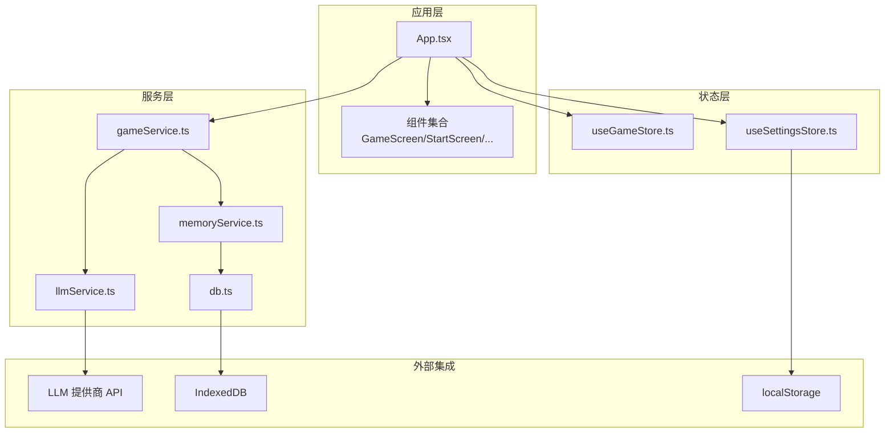
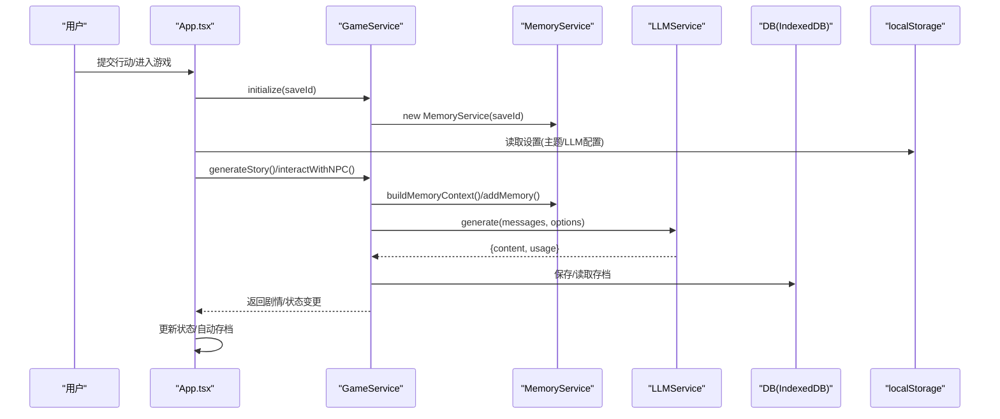
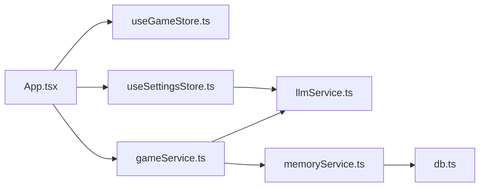
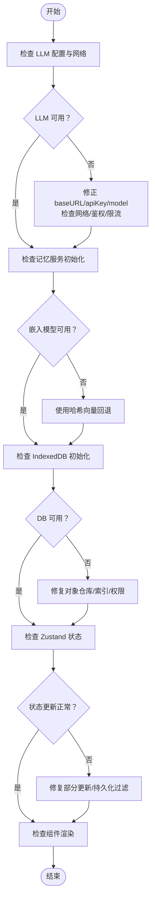

# 调试与故障排除

<cite>
**本文引用的文件**
- [README.md](file://README.md)
- [package.json](file://package.json)
- [AGENTS.md](file://AGENTS.md)
- [vite.config.ts](file://vite.config.ts)
- [src/App.tsx](file://src/App.tsx)
- [src/main.tsx](file://src/main.tsx)
- [src/services/llmService.ts](file://src/services/llmService.ts)
- [src/services/gameService.ts](file://src/services/gameService.ts)
- [src/services/db.ts](file://src/services/db.ts)
- [src/services/memoryService.ts](file://src/services/memoryService.ts)
- [src/stores/useGameStore.ts](file://src/stores/useGameStore.ts)
- [src/stores/useSettingsStore.ts](file://src/stores/useSettingsStore.ts)
- [src/types/game.ts](file://src/types/game.ts)
</cite>

## 目录
1. [简介](#简介)
2. [项目结构](#项目结构)
3. [核心组件](#核心组件)
4. [架构总览](#架构总览)
5. [详细组件分析](#详细组件分析)
6. [依赖关系分析](#依赖关系分析)
7. [性能考量](#性能考量)
8. [故障排除指南](#故障排除指南)
9. [结论](#结论)
10. [附录](#附录)

## 简介
本指南面向修仙 Roguelike 项目的开发者与维护者，聚焦于调试与故障排除。项目采用纯前端架构，通过 LLM 实时生成游戏内容，结合 Zustand 状态管理、IndexedDB 存档与本地存储、以及浏览器端嵌入模型实现记忆检索。本文将系统梳理常见问题的诊断方法、调试工具使用、错误日志分析，并覆盖 AI 服务调试、状态管理问题排查、内存泄漏检测、开发工具配置、浏览器调试技巧、网络请求监控、LLM 调用异常处理、数据持久化问题、组件渲染错误等主题。

## 项目结构
项目采用 Vite + React + TypeScript + TailwindCSS + shadcn/ui 的现代前端栈，核心目录组织如下：
- src/components：UI 组件与业务组件
- src/stores：Zustand 状态管理（游戏状态与设置）
- src/services：服务层（LLM、游戏逻辑、记忆、数据库）
- src/types：TypeScript 类型定义
- src/prompts：LLM 提示词
- src/lib：工具函数
- public：静态资源
- vite.config.ts：Vite 构建与别名配置
- package.json：依赖与脚本

图表来源
- [src/App.tsx](file://src/App.tsx#L1-L588)
- [src/services/llmService.ts](file://src/services/llmService.ts#L1-L101)
- [src/services/gameService.ts](file://src/services/gameService.ts#L1-L541)
- [src/services/memoryService.ts](file://src/services/memoryService.ts#L1-L224)
- [src/services/db.ts](file://src/services/db.ts#L1-L236)
- [src/stores/useGameStore.ts](file://src/stores/useGameStore.ts#L1-L226)
- [src/stores/useSettingsStore.ts](file://src/stores/useSettingsStore.ts#L1-L46)

章节来源
- [README.md](file://README.md#L1-L106)
- [AGENTS.md](file://AGENTS.md#L225-L283)
- [vite.config.ts](file://vite.config.ts#L1-L12)

## 核心组件
- 应用入口与生命周期控制：App.tsx 负责游戏阶段切换、LLM 服务与游戏服务初始化、自动存档、错误提示与日志记录。
- 状态管理：useGameStore.ts（Zustand + persist）管理玩家、NPC、世界、日志、事件、记忆、回合数、加载状态、错误、存档 ID、上次保存时间等；useSettingsStore.ts 管理 LLM 配置、自动保存开关、主题。
- 服务层：
  - LLMService：封装 LLM API 调用，具备重试与指数退避、错误透传、token 使用统计。
  - GameService：整合 LLM 与 MemoryService，负责角色生成、剧情推演、NPC 交互、区域 NPC 生成、存档读写。
  - MemoryService：工作记忆、摘要记忆、RAG 检索、嵌入向量生成（@xenova/transformers 或备用哈希向量）。
  - DB：IndexedDB 封装，提供存档元数据、存档数据、记忆片段的 CRUD 与索引查询。
- 类型系统：src/types/game.ts 定义了玩家、NPC、世界、事件、日志、记忆、时间、关系、技能、物品等完整类型体系。

章节来源
- [src/App.tsx](file://src/App.tsx#L1-L588)
- [src/stores/useGameStore.ts](file://src/stores/useGameStore.ts#L1-L226)
- [src/stores/useSettingsStore.ts](file://src/stores/useSettingsStore.ts#L1-L46)
- [src/services/llmService.ts](file://src/services/llmService.ts#L1-L101)
- [src/services/gameService.ts](file://src/services/gameService.ts#L1-L541)
- [src/services/memoryService.ts](file://src/services/memoryService.ts#L1-L224)
- [src/services/db.ts](file://src/services/db.ts#L1-L236)
- [src/types/game.ts](file://src/types/game.ts#L1-L319)

## 架构总览
系统采用“应用层-状态层-服务层-外部集成”的分层架构。应用层通过 Zustand 管理状态，服务层协调 LLM 与本地存储，外部集成包括 LLM 提供商 API 与浏览器 IndexedDB/localStorage。

图表来源
- [src/App.tsx](file://src/App.tsx#L67-L122)
- [src/services/gameService.ts](file://src/services/gameService.ts#L59-L62)
- [src/services/memoryService.ts](file://src/services/memoryService.ts#L175-L188)
- [src/services/llmService.ts](file://src/services/llmService.ts#L29-L55)
- [src/services/db.ts](file://src/services/db.ts#L134-L150)
- [src/stores/useSettingsStore.ts](file://src/stores/useSettingsStore.ts#L24-L45)

## 详细组件分析

### LLM 服务调试（LLMService）
- 重试机制：默认最多重试 3 次，指数退避延迟，失败时记录警告日志并抛出聚合错误。
- 请求封装：统一构造 chat/completions 请求，校验响应状态，解析 content 与 usage。
- 配置更新：支持动态更新 baseURL、apiKey、model，便于切换提供商与模型。
- 建议：
  - 在开发环境中开启更详细的日志输出，定位 API 错误码与响应体。
  - 针对不同提供商的响应差异，补充特定错误映射与降级策略。
  - 对 response_format 强制 JSON 模式，确保解析稳定性。

章节来源
- [src/services/llmService.ts](file://src/services/llmService.ts#L1-L101)

### 游戏服务调试（GameService）
- 初始化：绑定 saveId，创建 MemoryService。
- 剧情推演：构建记忆上下文（工作记忆+检索+摘要），拼接玩家/世界/日志信息，调用 LLM 生成 JSON 结果，记录 token 使用。
- NPC 交互：生成对话与交互选项，更新双方状态与时间。
- 存档读写：通过 DB 封装进行存档元数据与存档数据的持久化。
- 建议：
  - 对 JSON 解析失败场景增加更细粒度的字段校验与默认值填充。
  - 在 generateStory/interactWithNPC 前后打印关键上下文摘要，便于定位提示词问题。
  - 对 MemoryService 的 addMemory/retrieveRelevantMemories 增加性能指标埋点。

章节来源
- [src/services/gameService.ts](file://src/services/gameService.ts#L1-L541)

### 记忆服务调试（MemoryService）
- 嵌入模型：优先使用 @xenova/transformers 的特征提取模型，失败时回退到简单哈希向量。
- 相似度计算：余弦相似度，按重要性与时间排序返回 Top-K。
- 摘要生成：当记忆数量超过阈值时，调用 LLM 生成摘要，降低上下文长度。
- 建议：
  - 对 embeddingPipeline 的初始化失败进行更明确的错误提示与降级处理。
  - 对 retrieveRelevantMemories 的性能进行监控，必要时引入缓存或分页检索。
  - 对摘要生成失败进行幂等处理，避免阻塞主线流程。

章节来源
- [src/services/memoryService.ts](file://src/services/memoryService.ts#L1-L224)

### 数据库调试（DB：IndexedDB）
- 存储结构：SAVES、SAVE_DATA、MEMORIES 三类对象仓库，分别存储存档元数据、存档数据、记忆片段。
- 索引：为 saveId、timestamp、importance 建立索引，提升查询效率。
- 建议：
  - 在每次存档/读取前后记录事务耗时，定位慢查询。
  - 对删除存档时的级联清理（存档数据与记忆）增加幂等与回滚保护。
  - 对数据库升级失败场景增加兜底策略与用户提示。

章节来源
- [src/services/db.ts](file://src/services/db.ts#L1-L236)

### 状态管理调试（Zustand）
- useGameStore：管理游戏全局状态，支持部分更新、派生状态（附近 NPC）、持久化过滤（仅持久化关键字段）。
- useSettingsStore：管理 LLM 配置、自动保存开关、主题，使用 localStorage 持久化。
- 建议：
  - 对复杂状态更新（如批量 NPC 更新、日志追加）使用批量更新减少重渲染。
  - 对持久化数据进行版本迁移与兼容性检查，避免旧数据导致崩溃。
  - 对 selectedNPCId/isNPCInteracting 等交互状态增加边界检查。

章节来源
- [src/stores/useGameStore.ts](file://src/stores/useGameStore.ts#L1-L226)
- [src/stores/useSettingsStore.ts](file://src/stores/useSettingsStore.ts#L1-L46)

### 应用入口与生命周期（App.tsx）
- 游戏阶段：start -> character_creation -> game，阶段切换与路由式组件渲染。
- LLM 服务与游戏服务：基于 useSettingsStore 的 llmConfig 创建，使用 useMemo 避免重复实例化。
- 自动存档：每 30 秒定时保存，且每次行动后触发；保存失败时记录错误日志。
- 错误处理：统一捕获异常，记录日志并通过 toast 提示用户。
- 建议：
  - 对自动存档的并发冲突（多处同时写入）增加互斥或队列化。
  - 对 IndexedDB 初始化失败增加重试与降级（仅内存存档）。

章节来源
- [src/App.tsx](file://src/App.tsx#L1-L588)

## 依赖关系分析
- 组件耦合：App.tsx 作为中枢，依赖多个 stores 与 services；services 之间存在清晰职责划分，耦合度较低。
- 外部依赖：@xenova/transformers（浏览器嵌入）、localforage（可选）、sonner（通知）、zustand/zustand-persist（状态管理）。
- 潜在循环依赖：当前结构未发现直接循环依赖，但需关注 stores 与 services 的相互调用链路。

图表来源
- [src/App.tsx](file://src/App.tsx#L1-L588)
- [src/services/gameService.ts](file://src/services/gameService.ts#L1-L541)
- [src/services/memoryService.ts](file://src/services/memoryService.ts#L1-L224)
- [src/services/db.ts](file://src/services/db.ts#L1-L236)
- [src/stores/useGameStore.ts](file://src/stores/useGameStore.ts#L1-L226)
- [src/stores/useSettingsStore.ts](file://src/stores/useSettingsStore.ts#L1-L46)

章节来源
- [package.json](file://package.json#L1-L55)

## 性能考量
- LLM 调用成本：通过重试与指数退避降低失败率；记录 usage 便于成本控制。
- 记忆检索优化：工作记忆+摘要+RAG 的三层架构降低上下文长度；对嵌入向量生成失败提供回退方案。
- 存储优化：IndexedDB 索引与分页查询；localStorage 仅存储轻量设置。
- 渲染优化：useMemo 避免不必要的服务实例重建；批量状态更新减少重渲染。
- 建议：
  - 对高频 LLM 调用增加本地缓存（基于 action+context 的键）。
  - 对记忆检索增加超时与取消机制，避免长时间阻塞 UI。
  - 对嵌入模型初始化进行懒加载与预热，减少首帧延迟。

[本节为通用性能讨论，无需列出章节来源]

## 故障排除指南

### 一、AI 服务调试
- 症状：LLM 调用频繁失败或响应为空
  - 检查 LLM 配置（baseURL、apiKey、model）是否正确，是否匹配提供商要求。
  - 查看 LLMService 的重试日志与最终错误信息，定位网络/鉴权/模型参数问题。
  - 对 response_format 强制 JSON 模式，确保解析稳定。
- 症状：剧情生成结果不符合预期
  - 在 GameService 中打印记忆上下文摘要（工作记忆、检索记忆、摘要记忆）与 action 输入。
  - 调整提示词与温度参数，逐步缩小问题范围。
- 症状：嵌入模型加载失败
  - 检查 @xenova/transformers 的可用性与网络访问权限；确认回退到简单哈希向量的逻辑生效。

章节来源
- [src/services/llmService.ts](file://src/services/llmService.ts#L29-L55)
- [src/services/gameService.ts](file://src/services/gameService.ts#L283-L391)
- [src/services/memoryService.ts](file://src/services/memoryService.ts#L27-L37)

### 二、状态管理问题排查
- 症状：状态更新不生效或渲染异常
  - 检查 useGameStore 的部分更新是否正确合并；确认持久化过滤字段是否包含所需状态。
  - 对复杂更新（如批量 NPC 更新）使用 set 的函数式更新，避免闭包陷阱。
- 症状：主题切换无效
  - 确认 useSettingsStore 的 theme 更新与 App.tsx 的根节点 class 切换逻辑一致。

章节来源
- [src/stores/useGameStore.ts](file://src/stores/useGameStore.ts#L84-L225)
- [src/stores/useSettingsStore.ts](file://src/stores/useSettingsStore.ts#L24-L45)
- [src/App.tsx](file://src/App.tsx#L22-L28)

### 三、内存泄漏检测
- 症状：页面长时间使用后内存持续增长
  - 检查自动存档定时器是否正确清理；确认每次阶段切换时清理定时器。
  - 检查 LLM 调用与 MemoryService 的嵌入模型初始化是否重复创建。
  - 使用浏览器性能面板（Performance/Heap）观察对象增长趋势。
- 建议：
  - 对长生命周期对象（如定时器、事件监听）在组件卸载时统一清理。
  - 对嵌入模型初始化进行单例化管理，避免重复加载。

章节来源
- [src/App.tsx](file://src/App.tsx#L107-L122)
- [src/services/memoryService.ts](file://src/services/memoryService.ts#L27-L37)

### 四、开发工具配置
- Vite 别名：@ 指向 src，便于统一导入路径。
- ESLint：启用 TypeScript 检查与规则限制，保持代码质量。
- Vitest：提供单元测试与覆盖率报告，建议为关键服务编写测试用例。

章节来源
- [vite.config.ts](file://vite.config.ts#L1-L12)
- [package.json](file://package.json#L9-L13)

### 五、浏览器调试技巧
- 控制台：查看 LLM 调用错误、IndexedDB 操作异常、状态更新日志。
- 网络面板：监控 chat/completions 请求与响应，识别超时、鉴权失败、限流等问题。
- 应用面板：查看 IndexedDB 与 localStorage 的数据结构与大小。
- 性能面板：分析主线程阻塞、内存峰值、GC 行为。

[本节为通用调试技巧，无需列出章节来源]

### 六、网络请求监控
- 关注点：请求 URL、请求头 Authorization、响应状态码、响应体结构、usage 统计。
- 建议：对失败请求记录详细上下文（action、记忆上下文、时间戳），便于复现与定位。

章节来源
- [src/services/llmService.ts](file://src/services/llmService.ts#L65-L93)

### 七、LLM 调用异常处理
- 重试策略：指数退避，最多 3 次；失败后抛出聚合错误，包含最后一次错误信息。
- 错误映射：对不同状态码与响应体进行映射，提供用户可读的错误提示。
- 建议：在 UI 中展示“重试”按钮，允许用户手动重试；对关键操作增加“取消”机制。

章节来源
- [src/services/llmService.ts](file://src/services/llmService.ts#L37-L55)

### 八、数据持久化问题
- IndexedDB 初始化失败
  - 检查浏览器兼容性与权限；确认 onupgradeneeded 中的对象仓库与索引创建成功。
- 存档读取失败
  - 检查 saveId 是否正确；确认 IndexedDB 中对应记录存在；对 JSON 解析失败增加容错。
- localStorage 设置丢失
  - 检查持久化键名与序列化/反序列化过程；对旧版本数据进行迁移。

章节来源
- [src/services/db.ts](file://src/services/db.ts#L39-L72)
- [src/services/db.ts](file://src/services/db.ts#L134-L150)
- [src/stores/useSettingsStore.ts](file://src/stores/useSettingsStore.ts#L24-L45)

### 九、组件渲染错误
- 症状：渲染空白或报错
  - 检查 props 类型与默认值；确认状态初始化（player、world、logs）是否就绪。
  - 对异步初始化（LLM、DB）增加 loading 状态与骨架屏。
- 症状：NPC 交互状态异常
  - 检查 selectedNPCId 与 isNPCInteracting 的联动更新；确认 modal 打开/关闭逻辑。

章节来源
- [src/App.tsx](file://src/App.tsx#L564-L580)
- [src/stores/useGameStore.ts](file://src/stores/useGameStore.ts#L191-L205)

### 十、故障排除流程图

图表来源
- [src/services/llmService.ts](file://src/services/llmService.ts#L29-L55)
- [src/services/memoryService.ts](file://src/services/memoryService.ts#L27-L37)
- [src/services/db.ts](file://src/services/db.ts#L39-L72)
- [src/stores/useGameStore.ts](file://src/stores/useGameStore.ts#L84-L225)

## 结论
本指南围绕修仙 Roguelike 项目的调试与故障排除提供了系统性的方法论与实操建议。通过分层架构的清晰职责划分、完善的错误处理与日志记录、以及针对 LLM、状态管理、存储与渲染的关键优化点，能够有效提升系统的稳定性与可维护性。建议在开发过程中持续关注性能指标与用户体验，结合本文提供的流程与工具，快速定位并解决问题。

[本节为总结性内容，无需列出章节来源]

## 附录

### 常见问题与解决方案速查
- LLM 401/403：检查 apiKey 是否正确、是否具有相应权限。
- LLM 429/5xx：启用重试与指数退避，必要时切换模型或提供商。
- 嵌入模型加载失败：确认网络可达，回退到哈希向量。
- IndexedDB 升级失败：检查对象仓库与索引创建逻辑。
- 状态不更新：检查 set 的函数式更新与持久化过滤字段。
- 渲染异常：确认异步初始化完成与 props 默认值。

[本节为通用速查内容，无需列出章节来源]