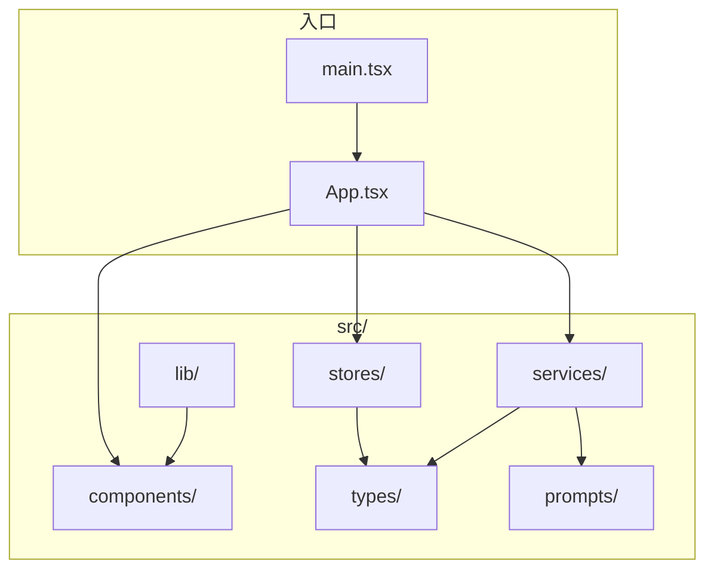
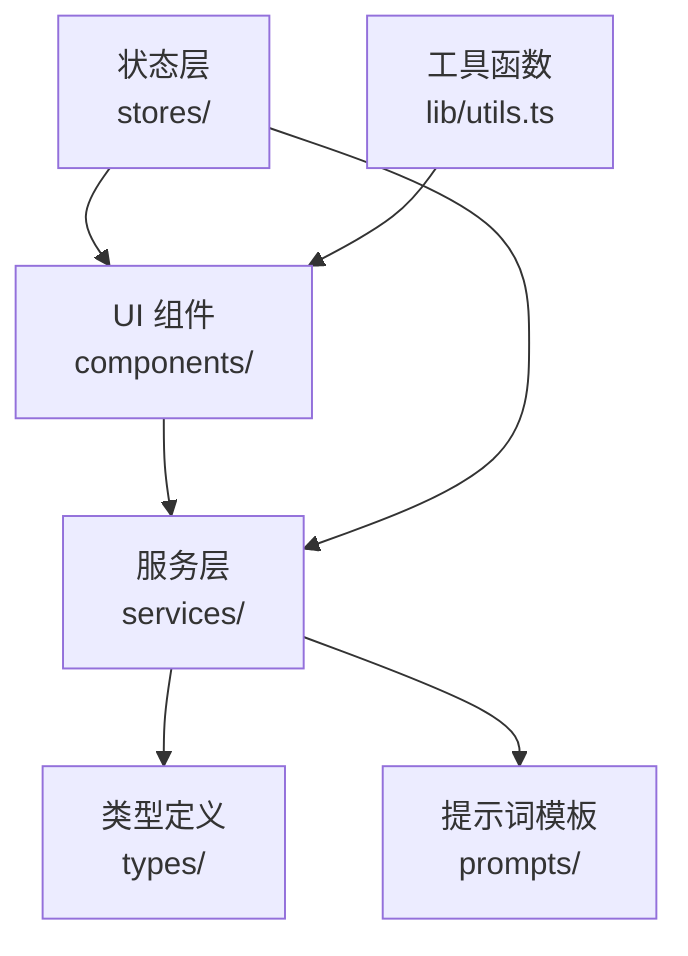
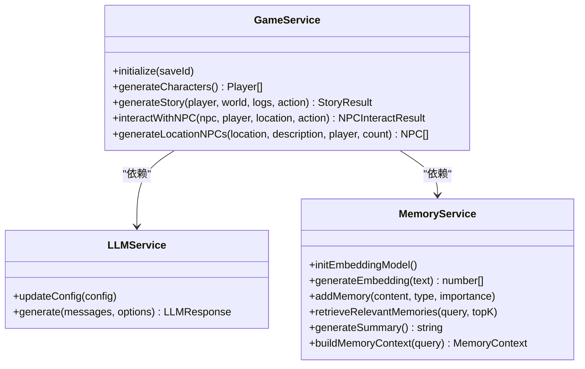
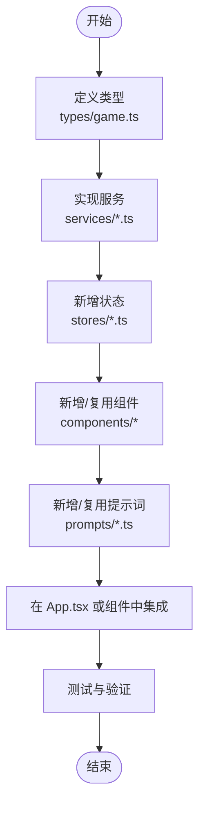
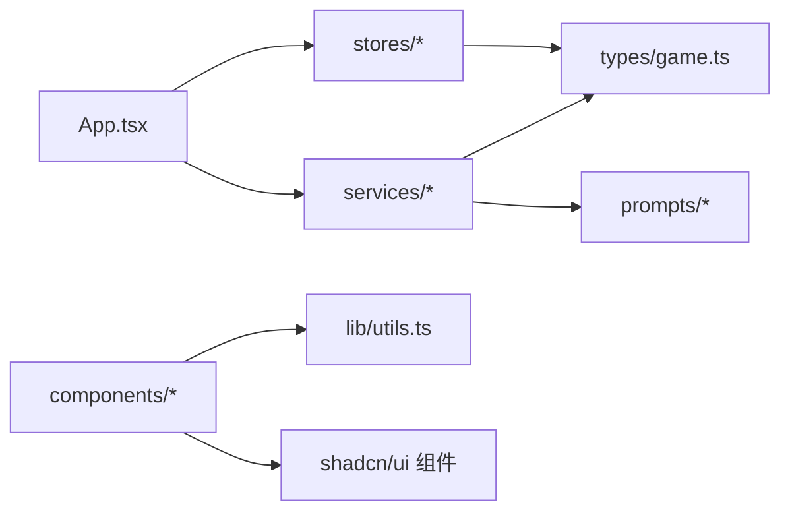
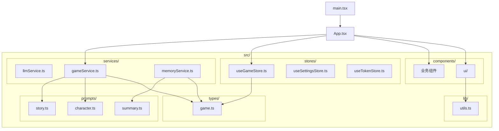

# 项目结构规范

<cite>
**本文引用的文件**
- [README.md](file://README.md)
- [package.json](file://package.json)
- [tsconfig.json](file://tsconfig.json)
- [src/main.tsx](file://src/main.tsx)
- [src/App.tsx](file://src/App.tsx)
- [src/types/game.ts](file://src/types/game.ts)
- [src/stores/useGameStore.ts](file://src/stores/useGameStore.ts)
- [src/stores/useSettingsStore.ts](file://src/stores/useSettingsStore.ts)
- [src/stores/useTokenStore.ts](file://src/stores/useTokenStore.ts)
- [src/services/gameService.ts](file://src/services/gameService.ts)
- [src/services/llmService.ts](file://src/services/llmService.ts)
- [src/services/memoryService.ts](file://src/services/memoryService.ts)
- [src/lib/utils.ts](file://src/lib/utils.ts)
- [src/components/ui/button.tsx](file://src/components/ui/button.tsx)
</cite>

## 目录
1. [简介](#简介)
2. [项目结构](#项目结构)
3. [核心组件](#核心组件)
4. [架构总览](#架构总览)
5. [详细组件分析](#详细组件分析)
6. [依赖关系分析](#依赖关系分析)
7. [性能考量](#性能考量)
8. [故障排查指南](#故障排查指南)
9. [结论](#结论)
10. [附录](#附录)

## 简介
本规范文档面向“修仙 Roguelike”项目，旨在建立统一、可维护且易于扩展的目录组织与文件命名约定，明确模块划分策略与职责边界，确保组件层、服务层、状态层、类型定义层协同一致。项目采用 Vite + React 18 + TypeScript 技术栈，结合 Zustand 状态管理、TailwindCSS + shadcn/ui 样式体系，并通过 LLM 实时驱动游戏内容生成。

## 项目结构
项目采用按职责分层的目录组织方式，核心目录如下：
- src/components：React 组件，分为通用 UI 组件与业务页面组件
- src/stores：Zustand 状态管理（游戏状态、设置、Token 使用统计）
- src/types：TypeScript 类型定义（角色、NPC、世界、日志、事件、记忆等）
- src/services：服务层（LLM 调用、游戏逻辑、记忆检索与摘要）
- src/prompts：LLM 提示词模板（角色、剧情、NPC 交互、摘要）
- src/lib：工具函数（样式合并等）

图表来源
- [src/main.tsx](file://src/main.tsx#L1-L11)
- [src/App.tsx](file://src/App.tsx#L1-L588)
- [src/types/game.ts](file://src/types/game.ts#L1-L319)
- [src/stores/useGameStore.ts](file://src/stores/useGameStore.ts#L1-L226)
- [src/services/gameService.ts](file://src/services/gameService.ts#L1-L541)
- [src/lib/utils.ts](file://src/lib/utils.ts#L1-L7)

章节来源
- [README.md](file://README.md#L77-L97)
- [tsconfig.json](file://tsconfig.json#L23-L27)

## 核心组件
- 入口与路由控制：main.tsx 负责挂载 React 根节点；App.tsx 控制游戏阶段（主页/角色创建/游戏主界面），协调服务与状态。
- 状态层：useGameStore 管理玩家、NPC、世界、日志、事件、记忆、回合数、存档标识等；useSettingsStore 管理 LLM 配置、自动存档开关、主题；useTokenStore 统计 Token 使用。
- 服务层：LLMService 封装 LLM 调用与重试；GameService 聚合角色生成、剧情生成、NPC 交互、区域 NPC 生成、记忆上下文构建；MemoryService 实现 RAG 式记忆检索与摘要。
- 类型层：集中定义 Player、NPC、World、GameLog、Event、Memory、Skill、Item、Relationship 等类型及辅助函数。
- UI 层：components/ui 提供可复用 UI 组件（按钮、卡片、对话框等），lib/utils 提供样式合并工具。

章节来源
- [src/main.tsx](file://src/main.tsx#L1-L11)
- [src/App.tsx](file://src/App.tsx#L16-L588)
- [src/stores/useGameStore.ts](file://src/stores/useGameStore.ts#L1-L226)
- [src/stores/useSettingsStore.ts](file://src/stores/useSettingsStore.ts#L1-L46)
- [src/stores/useTokenStore.ts](file://src/stores/useTokenStore.ts#L1-L73)
- [src/services/llmService.ts](file://src/services/llmService.ts#L1-L101)
- [src/services/gameService.ts](file://src/services/gameService.ts#L1-L541)
- [src/services/memoryService.ts](file://src/services/memoryService.ts#L1-L224)
- [src/types/game.ts](file://src/types/game.ts#L1-L319)
- [src/lib/utils.ts](file://src/lib/utils.ts#L1-L7)

## 架构总览
整体采用“UI 层 -> 服务层 -> 类型层”的分层设计，服务层内部再细分为 LLM 调用、游戏逻辑、记忆检索三大模块，通过 Zustand store 解耦状态与 UI。

图表来源
- [src/App.tsx](file://src/App.tsx#L1-L588)
- [src/services/gameService.ts](file://src/services/gameService.ts#L1-L541)
- [src/services/llmService.ts](file://src/services/llmService.ts#L1-L101)
- [src/services/memoryService.ts](file://src/services/memoryService.ts#L1-L224)
- [src/types/game.ts](file://src/types/game.ts#L1-L319)
- [src/stores/useGameStore.ts](file://src/stores/useGameStore.ts#L1-L226)
- [src/lib/utils.ts](file://src/lib/utils.ts#L1-L7)

## 详细组件分析

### 目录组织原则
- 按职责分层：components（UI）、stores（状态）、types（类型）、services（服务）、prompts（提示词）、lib（工具）
- 文件命名：组件文件名与组件导出名一致；服务类以大写开头并以 Service 结尾；store 以 use 前缀与 store 名组合；类型文件以领域语义命名；提示词文件按功能命名
- 路径别名：baseUrl 与 paths["@/*"] 配置确保相对路径简化，便于跨层引用

章节来源
- [tsconfig.json](file://tsconfig.json#L23-L27)
- [src/components/ui/button.tsx](file://src/components/ui/button.tsx#L1-L57)

### 文件命名约定
- 组件：例如 Button.tsx、Card.tsx、Dialog.tsx 等，文件名与组件导出名一致
- 服务：例如 llmService.ts、gameService.ts、memoryService.ts
- 状态：例如 useGameStore.ts、useSettingsStore.ts、useTokenStore.ts
- 类型：例如 game.ts
- 提示词：例如 character.ts、story.ts、summary.ts
- 工具：例如 utils.ts

章节来源
- [src/components/ui/button.tsx](file://src/components/ui/button.tsx#L1-L57)
- [src/services/llmService.ts](file://src/services/llmService.ts#L1-L101)
- [src/services/gameService.ts](file://src/services/gameService.ts#L1-L541)
- [src/services/memoryService.ts](file://src/services/memoryService.ts#L1-L224)
- [src/stores/useGameStore.ts](file://src/stores/useGameStore.ts#L1-L226)
- [src/stores/useSettingsStore.ts](file://src/stores/useSettingsStore.ts#L1-L46)
- [src/stores/useTokenStore.ts](file://src/stores/useTokenStore.ts#L1-L73)
- [src/types/game.ts](file://src/types/game.ts#L1-L319)

### 模块划分策略
- 组件层（components/）：仅承载 UI 与少量交互逻辑，不直接访问服务或状态
- 服务层（services/）：封装业务逻辑与外部依赖（LLM、数据库），保持幂等与可测试性
- 状态层（stores/）：集中管理应用状态，提供原子操作与派生计算
- 类型层（types/）：统一数据结构与接口契约，避免重复定义
- 提示词层（prompts/）：集中管理 LLM 输入模板，便于迭代与复用
- 工具层（lib/）：提供与框架相关的通用工具函数

章节来源
- [src/App.tsx](file://src/App.tsx#L1-L588)
- [src/services/gameService.ts](file://src/services/gameService.ts#L1-L541)
- [src/stores/useGameStore.ts](file://src/stores/useGameStore.ts#L1-L226)

### 组件文件命名与组件名一致
- 示例：Button.tsx 导出名为 Button 的组件，便于 IDE 识别与自动导入
- UI 组件位于 components/ui 下，遵循 shadcn/ui 设计系统

章节来源
- [src/components/ui/button.tsx](file://src/components/ui/button.tsx#L1-L57)

### 服务层分离原则
- LLMService：封装 LLM 调用、重试与配置更新
- GameService：聚合角色生成、剧情生成、NPC 交互、区域 NPC 生成、记忆上下文构建
- MemoryService：实现记忆的嵌入、检索、摘要与清理

图表来源
- [src/services/llmService.ts](file://src/services/llmService.ts#L1-L101)
- [src/services/gameService.ts](file://src/services/gameService.ts#L1-L541)
- [src/services/memoryService.ts](file://src/services/memoryService.ts#L1-L224)

### 类型定义统一管理
- types/game.ts 统一定义 Player、NPC、World、GameLog、Event、Memory、Skill、Item、Relationship 等核心类型
- 辅助函数（如好感度级别映射）也集中在此文件，便于全局复用

章节来源
- [src/types/game.ts](file://src/types/game.ts#L1-L319)

### 新功能添加流程
- 明确职责归属：UI 逻辑放入 components；业务逻辑放入 services；状态放入 stores；类型放入 types；提示词放入 prompts；工具放入 lib
- 编写类型：先在 types 中定义接口与枚举
- 实现服务：在 services 中新增对应服务类或函数，保持单一职责
- 状态管理：在 stores 中新增状态与派生计算
- UI 组件：在 components 中新增或复用现有组件
- 提示词：在 prompts 中新增或复用模板
- 引用与集成：在 App.tsx 或具体组件中注入与调用

### 文件组织最佳实践
- 组件文件与导出名一致，便于 IDE 识别与自动导入
- 服务类以大写开头并以 Service 结尾，清晰表达职责
- store 以 use 前缀命名，体现 Zustand 的命名习惯
- 类型文件按领域命名，避免交叉污染
- 提示词文件按功能命名，便于查找与复用
- 工具函数尽量无副作用，保持纯函数特性

章节来源
- [src/components/ui/button.tsx](file://src/components/ui/button.tsx#L1-L57)
- [src/services/llmService.ts](file://src/services/llmService.ts#L1-L101)
- [src/services/gameService.ts](file://src/services/gameService.ts#L1-L541)
- [src/services/memoryService.ts](file://src/services/memoryService.ts#L1-L224)
- [src/stores/useGameStore.ts](file://src/stores/useGameStore.ts#L1-L226)
- [src/stores/useSettingsStore.ts](file://src/stores/useSettingsStore.ts#L1-L46)
- [src/stores/useTokenStore.ts](file://src/stores/useTokenStore.ts#L1-L73)
- [src/types/game.ts](file://src/types/game.ts#L1-L319)
- [src/lib/utils.ts](file://src/lib/utils.ts#L1-L7)

### 模块间依赖关系管理
- App.tsx 依赖 stores 与 services，协调游戏阶段与业务流程
- stores 依赖 types 定义状态结构
- services 依赖 types 与 prompts，内部协作完成业务闭环
- components 依赖 lib/utils 与 shadcn/ui 组件

图表来源
- [src/App.tsx](file://src/App.tsx#L1-L588)
- [src/stores/useGameStore.ts](file://src/stores/useGameStore.ts#L1-L226)
- [src/services/gameService.ts](file://src/services/gameService.ts#L1-L541)
- [src/services/llmService.ts](file://src/services/llmService.ts#L1-L101)
- [src/services/memoryService.ts](file://src/services/memoryService.ts#L1-L224)
- [src/types/game.ts](file://src/types/game.ts#L1-L319)
- [src/lib/utils.ts](file://src/lib/utils.ts#L1-L7)

## 依赖关系分析
- 依赖声明集中在 package.json，包含 React、Zustand、TailwindCSS、shadcn/ui、lucide-react、@xenova/transformers 等
- tsconfig.json 配置了 baseUrl 与路径别名，确保 "@/*" 指向 src 目录，简化导入路径
- 项目为纯前端应用，无需后端依赖

章节来源
- [package.json](file://package.json#L1-L55)
- [tsconfig.json](file://tsconfig.json#L23-L27)

## 性能考量
- LLM 调用具备重试机制，降低网络波动带来的失败率
- 记忆检索采用嵌入向量与余弦相似度，支持 RAG 式上下文召回
- 状态持久化使用 localStorage，减少重复计算与 IO
- UI 组件使用 TailwindCSS 与 shadcn/ui，保证样式一致性与可维护性

## 故障排查指南
- LLM 调用失败：检查 LLM 配置（baseURL、apiKey、model），确认网络连通性与响应格式
- 存档异常：检查 IndexedDB 初始化与存档数据结构，确认 saveId 与状态同步
- 记忆检索异常：确认嵌入模型加载与向量生成，必要时启用备用哈希向量方案
- 主题切换无效：检查 useSettingsStore 中 theme 的持久化与根元素 class 更新逻辑

章节来源
- [src/services/llmService.ts](file://src/services/llmService.ts#L1-L101)
- [src/App.tsx](file://src/App.tsx#L63-L65)
- [src/services/memoryService.ts](file://src/services/memoryService.ts#L28-L37)
- [src/stores/useSettingsStore.ts](file://src/stores/useSettingsStore.ts#L24-L45)

## 结论
本规范明确了“修仙 Roguelike”项目的目录组织原则、文件命名约定与模块划分策略，强调服务层分离、类型定义统一管理与状态层解耦。通过严格的分层与职责边界，项目具备良好的可维护性与扩展性，适合持续迭代与团队协作。

## 附录
- 项目结构图（概念示意）
