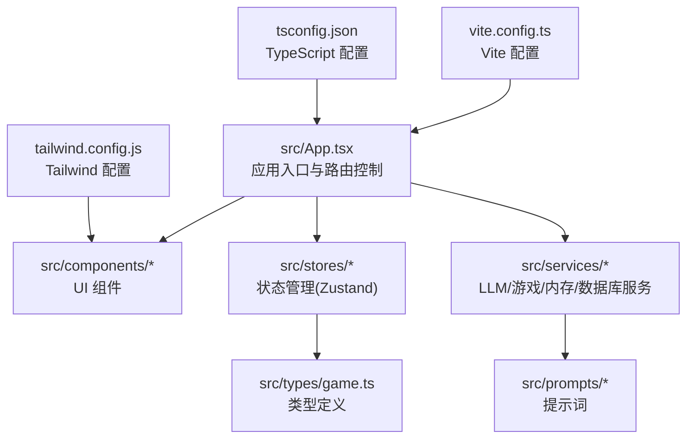
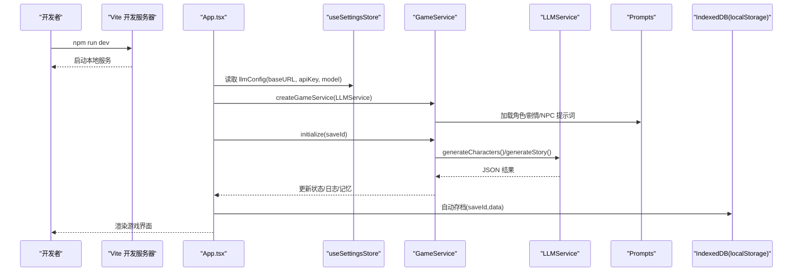
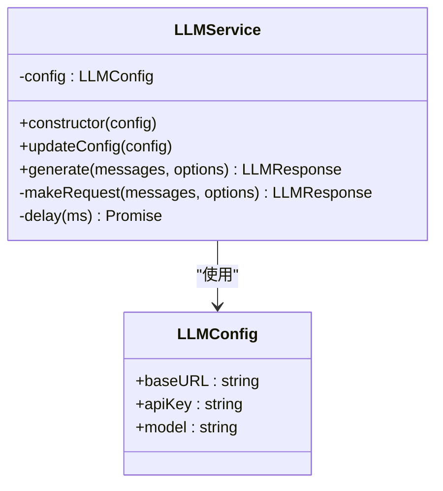
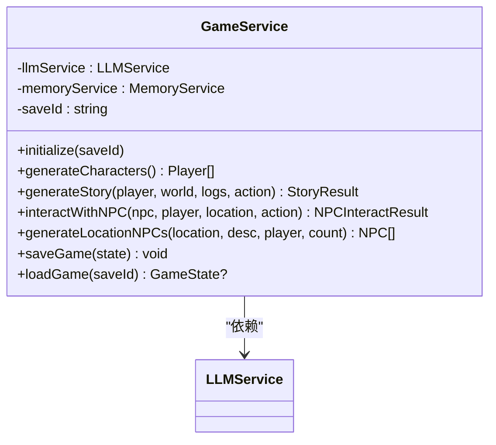
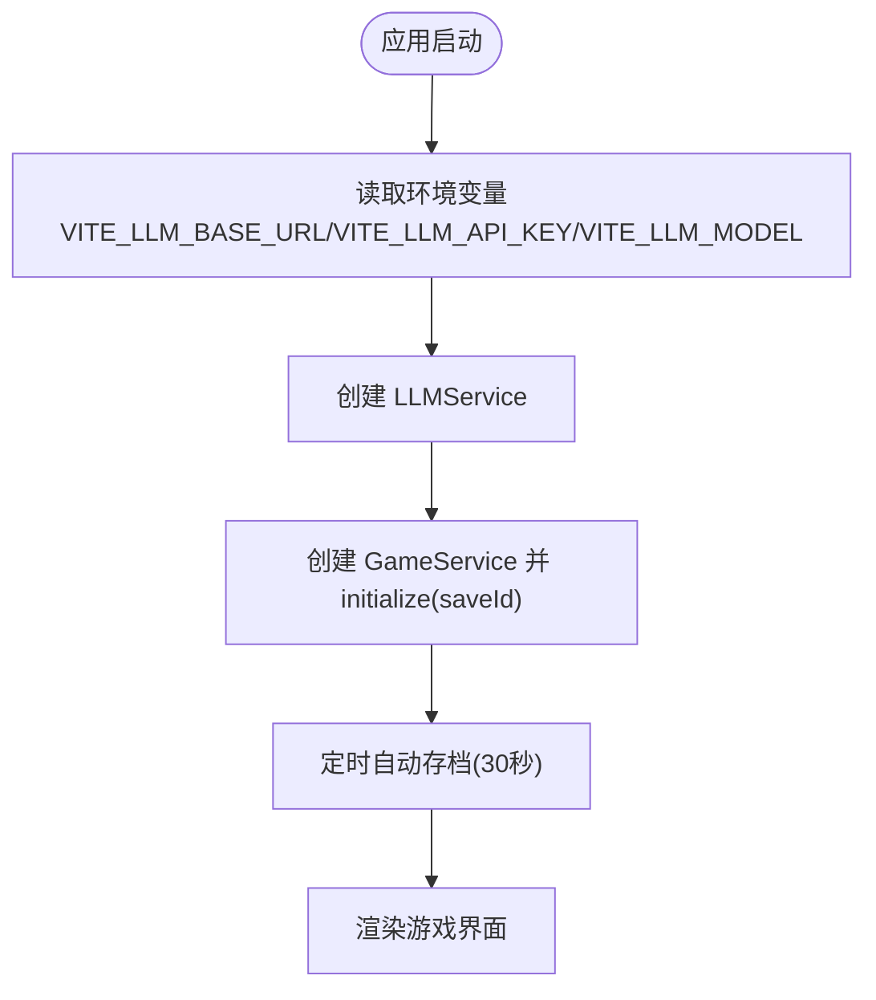
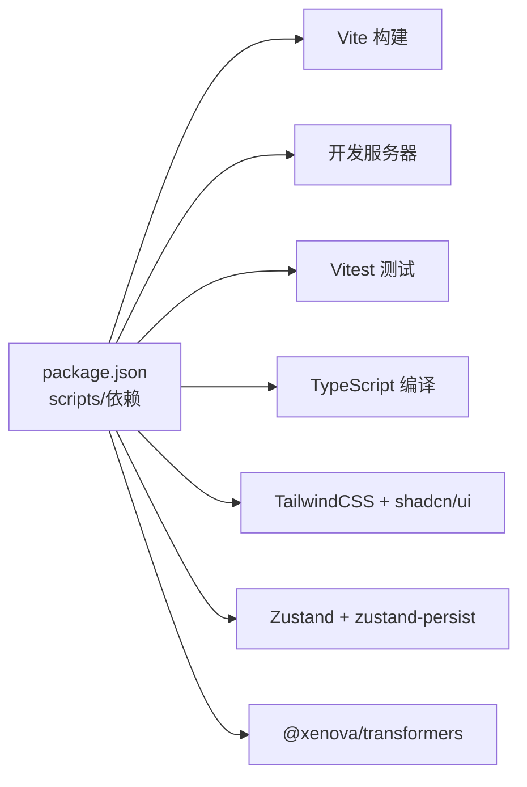

# 快速开始

<cite>
**本文引用的文件**
- [package.json](file://package.json)
- [README.md](file://README.md)
- [vite.config.ts](file://vite.config.ts)
- [tsconfig.json](file://tsconfig.json)
- [tailwind.config.js](file://tailwind.config.js)
- [src/App.tsx](file://src/App.tsx)
- [src/services/llmService.ts](file://src/services/llmService.ts)
- [src/stores/useSettingsStore.ts](file://src/stores/useSettingsStore.ts)
- [src/stores/useGameStore.ts](file://src/stores/useGameStore.ts)
- [src/services/gameService.ts](file://src/services/gameService.ts)
- [src/prompts/story.ts](file://src/prompts/story.ts)
- [src/components/StartScreen.tsx](file://src/components/StartScreen.tsx)
- [AGENTS.md](file://AGENTS.md)
</cite>

## 目录
1. [简介](#简介)
2. [项目结构](#项目结构)
3. [核心组件](#核心组件)
4. [架构总览](#架构总览)
5. [详细组件分析](#详细组件分析)
6. [依赖分析](#依赖分析)
7. [性能考虑](#性能考虑)
8. [故障排除指南](#故障排除指南)
9. [结论](#结论)
10. [附录](#附录)

## 简介
本指南面向希望在 15 分钟内快速搭建并运行“修仙 Roguelike”项目的开发者。项目采用纯前端技术栈（Vite + React 18 + TypeScript），通过 LLM 实时驱动游戏内容生成，支持本地存档与导出/导入。你将学会：
- 环境要求与安装
- 依赖安装与开发服务器启动
- 生产构建与预览
- LLM API Key 配置（OpenAI、DeepSeek、Qwen、Grok、OpenRouter 等）
- 推荐模型配置
- 常见问题与故障排除

## 项目结构
项目采用按功能分层的组织方式，核心目录如下：
- src/components：React UI 组件
- src/stores：Zustand 状态管理（本地持久化）
- src/services：LLM 服务、游戏逻辑服务、内存服务、数据库封装
- src/prompts：LLM 提示词（角色、剧情、NPC 交互）
- src/types：TypeScript 类型定义
- public：静态资源
- 根目录：构建与配置文件（package.json、vite.config.ts、tsconfig.json、tailwind.config.js）

图表来源
- [src/App.tsx](file://src/App.tsx#L1-L588)
- [vite.config.ts](file://vite.config.ts#L1-L12)
- [tsconfig.json](file://tsconfig.json#L1-L32)
- [tailwind.config.js](file://tailwind.config.js#L1-L53)

章节来源
- [README.md](file://README.md#L77-L97)
- [AGENTS.md](file://AGENTS.md#L225-L283)

## 核心组件
- LLMService：封装 LLM API 调用，支持重试与 JSON 响应解析
- GameService：整合提示词、记忆系统与 LLM，生成角色、剧情、NPC 交互
- Zustand Stores：useSettingsStore（设置与 LLM 配置）、useGameStore（游戏状态与本地持久化）
- 提示词模块：角色生成、剧情推演、NPC 交互
- UI 屏幕：StartScreen（主页/继续/设置）、CharacterCreationScreen、GameScreen

章节来源
- [src/services/llmService.ts](file://src/services/llmService.ts#L1-L101)
- [src/services/gameService.ts](file://src/services/gameService.ts#L50-L541)
- [src/stores/useSettingsStore.ts](file://src/stores/useSettingsStore.ts#L1-L46)
- [src/stores/useGameStore.ts](file://src/stores/useGameStore.ts#L84-L226)
- [src/prompts/story.ts](file://src/prompts/story.ts#L1-L147)
- [src/components/StartScreen.tsx](file://src/components/StartScreen.tsx#L1-L319)

## 架构总览
应用启动流程概览：
- 启动开发服务器或构建生产包
- 读取 LLM 配置（baseURL、apiKey、model）
- 初始化游戏服务（包含记忆系统）
- 生成初始世界与 NPC，进入游戏主循环
- 每次玩家行动触发 LLM 推演，更新状态并自动存档

图表来源
- [src/App.tsx](file://src/App.tsx#L67-L72)
- [src/services/gameService.ts](file://src/services/gameService.ts#L59-L62)
- [src/services/llmService.ts](file://src/services/llmService.ts#L29-L55)
- [src/prompts/story.ts](file://src/prompts/story.ts#L51-L147)
- [src/stores/useSettingsStore.ts](file://src/stores/useSettingsStore.ts#L12-L22)

## 详细组件分析

### LLMService 组件
- 职责：封装 LLM 请求，统一处理响应格式与错误重试
- 关键点：
  - 使用 fetch 调用 /chat/completions
  - 默认温度 0.7、最大 tokens 2000
  - 支持 JSON 响应格式
  - 3 次重试与指数退避

图表来源
- [src/services/llmService.ts](file://src/services/llmService.ts#L18-L101)

章节来源
- [src/services/llmService.ts](file://src/services/llmService.ts#L29-L93)

### GameService 组件
- 职责：整合提示词、调用 LLM 生成角色、剧情、NPC 交互；管理记忆与存档
- 关键点：
  - 初始化记忆服务（MemoryService）
  - 生成角色、剧情、NPC 交互均要求 JSON 输出
  - 记录 token 使用量到 useTokenStore
  - 保存/加载游戏状态到 IndexedDB

图表来源
- [src/services/gameService.ts](file://src/services/gameService.ts#L50-L541)

章节来源
- [src/services/gameService.ts](file://src/services/gameService.ts#L74-L119)
- [src/services/gameService.ts](file://src/services/gameService.ts#L283-L391)
- [src/services/gameService.ts](file://src/services/gameService.ts#L415-L469)

### Zustand Store（设置与游戏状态）
- useSettingsStore：默认 LLM 配置来自环境变量（VITE_LLM_*），支持主题切换与自动存档开关
- useGameStore：管理玩家、NPC、世界、日志、事件、记忆、回合数、存档 ID 等，支持部分序列化持久化

图表来源
- [src/stores/useSettingsStore.ts](file://src/stores/useSettingsStore.ts#L12-L22)
- [src/stores/useGameStore.ts](file://src/stores/useGameStore.ts#L84-L226)
- [src/App.tsx](file://src/App.tsx#L74-L122)

章节来源
- [src/stores/useSettingsStore.ts](file://src/stores/useSettingsStore.ts#L12-L46)
- [src/stores/useGameStore.ts](file://src/stores/useGameStore.ts#L84-L226)

### 提示词与剧情生成
- 提示词模块包含角色生成、剧情推演、NPC 交互三类提示词，均要求返回 JSON 格式
- 剧情生成提示词包含玩家状态、世界状态、近期日志、记忆摘要与检索记忆

章节来源
- [src/prompts/story.ts](file://src/prompts/story.ts#L1-L147)
- [src/services/gameService.ts](file://src/services/gameService.ts#L283-L391)

### UI 屏幕与交互
- StartScreen：提供“继续修行/重新转世/前往设置”，并在未配置模型时弹窗提醒
- App.tsx：根据游戏阶段渲染不同屏幕，处理玩家行动、NPC 交互、自动存档与错误提示

章节来源
- [src/components/StartScreen.tsx](file://src/components/StartScreen.tsx#L30-L44)
- [src/App.tsx](file://src/App.tsx#L16-L588)

## 依赖分析
- 构建与开发：Vite + TypeScript + React + TailwindCSS
- 状态管理：Zustand + zustand-persist（localStorage）
- LLM：@xenova/transformers（浏览器端嵌入模型，用于记忆检索）
- UI 组件：shadcn/ui（Radix 组件生态）
- 测试：Vitest

图表来源
- [package.json](file://package.json#L6-L53)
- [vite.config.ts](file://vite.config.ts#L1-L12)
- [tsconfig.json](file://tsconfig.json#L1-L32)
- [tailwind.config.js](file://tailwind.config.js#L1-L53)

章节来源
- [package.json](file://package.json#L15-L53)
- [AGENTS.md](file://AGENTS.md#L17-L24)

## 性能考虑
- LLM 调用重试与指数退避，降低网络波动影响
- 使用 useMemo 保持 LLM 配置不变时不重建实例，减少不必要的服务创建
- 自动存档间隔 30 秒，避免频繁写入
- TailwindCSS 按需扫描，减少打包体积

章节来源
- [src/services/llmService.ts](file://src/services/llmService.ts#L37-L55)
- [src/App.tsx](file://src/App.tsx#L67-L72)
- [src/App.tsx](file://src/App.tsx#L113-L122)
- [tailwind.config.js](file://tailwind.config.js#L3-L6)

## 故障排除指南
- 无法启动开发服务器
  - 确认 Node.js 版本满足项目要求（参见环境要求）
  - 清理缓存后重装依赖：删除 node_modules 与 package-lock.json，重新执行安装
  - 查看端口占用，修改 Vite 端口配置
- LLM 调用失败
  - 检查 VITE_LLM_BASE_URL、VITE_LLM_API_KEY、VITE_LLM_MODEL 是否正确设置
  - 确认供应商支持 OpenAI 兼容的 /chat/completions 接口
  - 查看网络请求与响应状态码，关注重试日志
- 剧情生成异常
  - 确保提示词要求返回 JSON，且字段完整
  - 检查最近日志与记忆摘要是否为空导致上下文缺失
- 存档/读档失败
  - 确认 IndexedDB 可用（部分隐私模式限制）
  - 检查 localStorage 权限与空间
- 主题切换无效
  - 确认 Tailwind 配置与暗/亮主题类名生效

章节来源
- [src/stores/useSettingsStore.ts](file://src/stores/useSettingsStore.ts#L12-L22)
- [src/services/llmService.ts](file://src/services/llmService.ts#L65-L93)
- [src/services/gameService.ts](file://src/services/gameService.ts#L326-L342)
- [src/App.tsx](file://src/App.tsx#L113-L122)
- [tailwind.config.js](file://tailwind.config.js#L2-L6)

## 结论
本项目以纯前端技术栈实现了“AI 驱动”的修仙 Roguelike 游戏，具备完善的 LLM 集成、记忆系统与本地存档能力。按照本指南的步骤，你可以在 15 分钟内完成环境准备、LLM 配置与首次运行。建议在开发过程中关注 LLM 重试与错误提示，合理配置提示词与模型参数，以获得更稳定的体验。

## 附录

### 环境要求与安装
- Node.js：建议使用 LTS 版本（18 或 20）
- 浏览器：现代浏览器（Chrome/Firefox/Safari/Edge）
- 包管理器：npm（推荐）

安装与启动命令
- 安装依赖
  - npm install
- 启动开发服务器
  - npm run dev
- 构建生产包
  - npm run build
- 预览构建结果
  - npm run preview
- 运行测试
  - npm run test

章节来源
- [README.md](file://README.md#L21-L46)
- [package.json](file://package.json#L6-L14)

### LLM API Key 配置
- 支持供应商
  - OpenAI、DeepSeek、Qwen（通义千问）、Grok、OpenRouter
  - 其他 OpenAI 兼容格式的 API
- 推荐模型
  - deepseek-chat、qwen-turbo、gpt-4-turbo-preview、gpt-3.5-turbo
- 配置方式
  - 在设置面板中填写 LLM Base URL、API Key、Model
  - 或通过环境变量注入（VITE_LLM_BASE_URL、VITE_LLM_API_KEY、VITE_LLM_MODEL）
- 注意事项
  - 确保 baseURL 以 /v1 结尾（例如 https://api.openai.com/v1）
  - 模型名称需与供应商一致
  - 若使用代理或自建网关，请确保 /chat/completions 路径可用

章节来源
- [README.md](file://README.md#L47-L62)
- [src/stores/useSettingsStore.ts](file://src/stores/useSettingsStore.ts#L12-L22)
- [src/services/llmService.ts](file://src/services/llmService.ts#L65-L80)
- [src/components/StartScreen.tsx](file://src/components/StartScreen.tsx#L30-L44)

### 开发与构建流程
- 开发命令
  - npm run dev：启动 Vite 开发服务器
  - npm run lint：ESLint 代码检查
  - npm run test：Vitest 测试（watch 模式）
- 生产构建
  - npm run build：TypeScript 编译 + Vite 构建
  - npm run preview：本地预览构建产物
- 部署
  - 项目为纯前端应用，可部署至任意静态托管平台（Vercel、GitHub Pages、Netlify、Cloudflare Pages、AWS S3 等）

章节来源
- [README.md](file://README.md#L63-L76)
- [AGENTS.md](file://AGENTS.md#L27-L51)
- [package.json](file://package.json#L6-L14)

### 常见问题与预期输出
- 无法看到 LLM 输出或剧情停滞
  - 检查网络请求与响应状态码
  - 查看控制台是否有“LLM 调用失败”警告
- 设置面板无法保存配置
  - 确认 localStorage 可用
  - 清除浏览器缓存后重试
- 自动存档未触发
  - 确认游戏阶段为“game”
  - 检查定时器是否被清理

章节来源
- [src/services/llmService.ts](file://src/services/llmService.ts#L40-L55)
- [src/App.tsx](file://src/App.tsx#L113-L122)
- [src/stores/useSettingsStore.ts](file://src/stores/useSettingsStore.ts#L24-L45)