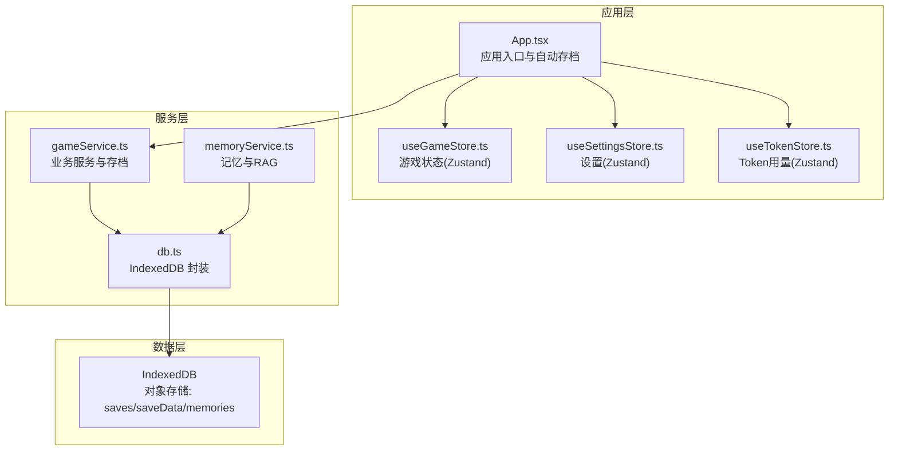
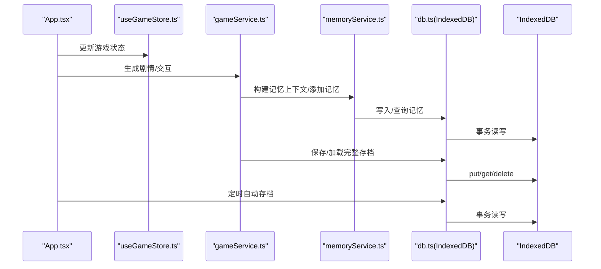
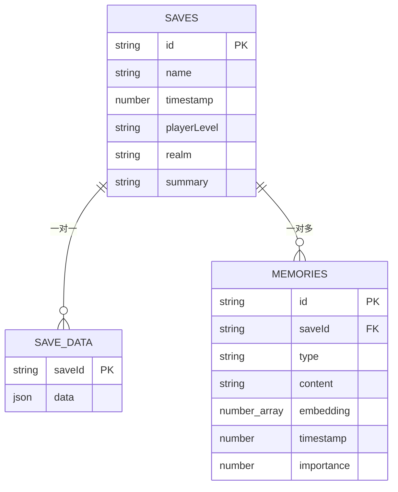
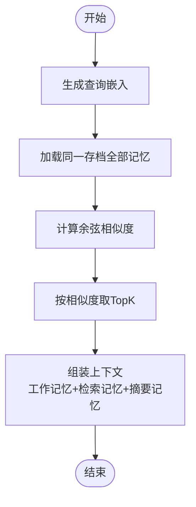
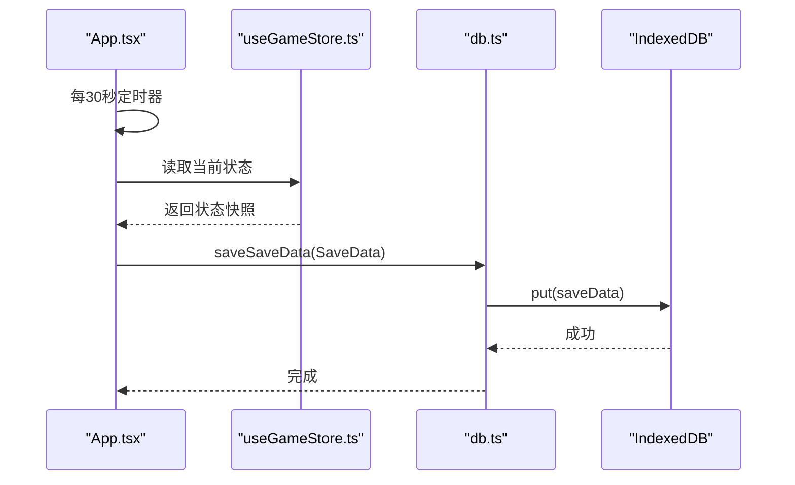
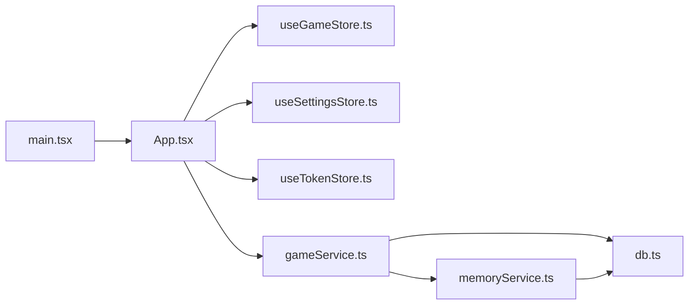

# 持久化存储

<cite>
**本文引用的文件**
- [src/services/db.ts](file://src/services/db.ts)
- [src/types/game.ts](file://src/types/game.ts)
- [src/stores/useGameStore.ts](file://src/stores/useGameStore.ts)
- [src/stores/useSettingsStore.ts](file://src/stores/useSettingsStore.ts)
- [src/stores/useTokenStore.ts](file://src/stores/useTokenStore.ts)
- [src/services/memoryService.ts](file://src/services/memoryService.ts)
- [src/services/gameService.ts](file://src/services/gameService.ts)
- [src/App.tsx](file://src/App.tsx)
- [src/main.tsx](file://src/main.tsx)
- [package.json](file://package.json)
</cite>

## 目录
1. [简介](#简介)
2. [项目结构](#项目结构)
3. [核心组件](#核心组件)
4. [架构总览](#架构总览)
5. [详细组件分析](#详细组件分析)
6. [依赖分析](#依赖分析)
7. [性能考虑](#性能考虑)
8. [故障排除指南](#故障排除指南)
9. [结论](#结论)
10. [附录](#附录)

## 简介
本文件面向“修仙 Roguelike”项目的持久化存储系统，围绕 IndexedDB 数据库设计与实现进行系统化梳理。重点覆盖：
- 数据库结构与表关系、索引策略
- 数据模型定义与存储过程
- 查询优化与 RAG 记忆检索
- 数据同步、冲突解决与备份恢复
- 数据迁移、版本管理与向后兼容
- 存储性能优化、内存管理与错误处理
- 最佳实践与故障排除

## 项目结构
项目采用前端单页应用架构，持久化相关模块主要分布在以下位置：
- 数据库与存储：src/services/db.ts
- 游戏状态与本地存储：src/stores/useGameStore.ts、src/stores/useSettingsStore.ts、src/stores/useTokenStore.ts
- 记忆与检索：src/services/memoryService.ts
- 业务服务与存档：src/services/gameService.ts
- 应用入口与自动存档：src/App.tsx
- 依赖声明：package.json

图表来源
- [src/App.tsx](file://src/App.tsx#L62-L122)
- [src/services/db.ts](file://src/services/db.ts#L36-L72)
- [src/services/memoryService.ts](file://src/services/memoryService.ts#L16-L25)
- [src/services/gameService.ts](file://src/services/gameService.ts#L50-L62)

章节来源
- [src/App.tsx](file://src/App.tsx#L16-L122)
- [src/services/db.ts](file://src/services/db.ts#L1-L72)
- [src/stores/useGameStore.ts](file://src/stores/useGameStore.ts#L1-L83)
- [src/stores/useSettingsStore.ts](file://src/stores/useSettingsStore.ts#L1-L46)
- [src/stores/useTokenStore.ts](file://src/stores/useTokenStore.ts#L1-L73)

## 核心组件
- IndexedDB 数据库封装：提供存档元数据、存档数据、记忆三类对象存储与索引，支持增删改查与批量操作。
- 游戏状态本地存储：使用 Zustand + localStorage 持久化关键游戏状态，减少 IndexedDB 读写压力。
- 记忆服务：基于嵌入向量的相似度检索与摘要生成，支撑 LLM 的上下文记忆。
- 业务服务：协调 LLM 生成与数据库存取，统一保存/加载流程。

章节来源
- [src/services/db.ts](file://src/services/db.ts#L36-L235)
- [src/stores/useGameStore.ts](file://src/stores/useGameStore.ts#L84-L225)
- [src/services/memoryService.ts](file://src/services/memoryService.ts#L16-L224)
- [src/services/gameService.ts](file://src/services/gameService.ts#L50-L409)

## 架构总览
下图展示持久化相关模块之间的交互关系与数据流向：

图表来源
- [src/App.tsx](file://src/App.tsx#L74-L122)
- [src/services/gameService.ts](file://src/services/gameService.ts#L393-L409)
- [src/services/memoryService.ts](file://src/services/memoryService.ts#L175-L188)
- [src/services/db.ts](file://src/services/db.ts#L134-L159)

## 详细组件分析

### 数据库设计与对象存储
- 数据库名称与版本：固定名称与版本号，便于后续升级策略。
- 对象存储：
  - saves：存档元数据，主键为 id，按时间戳建立索引，支持按时间排序。
  - saveData：存档数据，主键为 saveId，存放完整 GameState。
  - memories：记忆片段，主键为 id，按 saveId、timestamp、importance 建立索引，支持高效检索与过滤。
- 事务与并发：通过事务模式控制读写，避免并发冲突；删除存档时联动清理对应记忆与存档数据。

图表来源
- [src/services/db.ts](file://src/services/db.ts#L6-L34)
- [src/types/game.ts](file://src/types/game.ts#L235-L251)

章节来源
- [src/services/db.ts](file://src/services/db.ts#L39-L72)
- [src/services/db.ts](file://src/services/db.ts#L85-L159)
- [src/services/db.ts](file://src/services/db.ts#L175-L225)

### 数据模型定义
- GameState：包含玩家、NPC、世界、日志、事件、记忆、回合数、播放状态等。
- Memory/MemoryItem：记忆条目，含类型、内容、嵌入向量、时间戳、重要性。
- Player/NPC/Item/Skill 等：支撑剧情与交互的数据结构。
- 重要约束：存档数据以 JSON 字符串形式存储，需保证序列化/反序列化一致性。

章节来源
- [src/types/game.ts](file://src/types/game.ts#L235-L251)
- [src/types/game.ts](file://src/types/game.ts#L63-L71)
- [src/services/db.ts](file://src/services/db.ts#L21-L34)

### 存储过程与查询优化
- 存档元数据：addSave/updateSave/getSave/getAllSaves/deleteSave
- 存档数据：saveSaveData/getSaveData/deleteSaveData
- 记忆：addMemory/addMemories/getMemoriesBySaveId/getMemoriesByImportance/deleteMemoriesBySaveId
- 查询优化要点：
  - 使用索引：memories 表的 saveId、timestamp、importance 索引，支持快速过滤与排序。
  - 分页与限制：提供 limit 参数，避免一次性返回大量数据。
  - 批量写入：addMemories 使用 Promise.all 并行插入，降低延迟。

章节来源
- [src/services/db.ts](file://src/services/db.ts#L85-L159)
- [src/services/db.ts](file://src/services/db.ts#L175-L207)

### 记忆检索与 RAG
- 嵌入生成：优先使用 transformers 的特征提取模型，失败时回退到简单哈希向量。
- 相似度计算：余弦相似度，结合重要性阈值与时间排序。
- 上下文组装：工作记忆（最近若干条）、检索记忆（按相似度 TopK）、摘要记忆（超过阈值时生成）。
- 摘要生成：基于提示词与 LLM，输出结构化摘要供后续剧情推演使用。

图表来源
- [src/services/memoryService.ts](file://src/services/memoryService.ts#L122-L137)
- [src/services/memoryService.ts](file://src/services/memoryService.ts#L175-L188)

章节来源
- [src/services/memoryService.ts](file://src/services/memoryService.ts#L27-L81)
- [src/services/memoryService.ts](file://src/services/memoryService.ts#L121-L188)

### 自动存档与同步策略
- 触发时机：页面进入游戏阶段后，每 30 秒自动保存一次；每次玩家行动后也触发保存。
- 保存内容：从 Zustand store 中抽取关键字段，封装为 SaveData 并写入 IndexedDB。
- 同步策略：以 saveId 为键，覆盖式写入；读取时按 saveId 获取最新数据。
- 冲突解决：当前实现为幂等覆盖，未引入版本号或时间戳冲突检测；建议后续引入版本字段或时间戳以支持合并策略。

图表来源
- [src/App.tsx](file://src/App.tsx#L74-L122)
- [src/services/db.ts](file://src/services/db.ts#L134-L141)

章节来源
- [src/App.tsx](file://src/App.tsx#L74-L122)
- [src/services/db.ts](file://src/services/db.ts#L134-L141)

### 备份与恢复
- 备份：可直接导出现有存档数据（saveData）并保存为外部文件，便于跨设备迁移。
- 恢复：加载外部备份文件后，写入 IndexedDB 对应对象存储；随后通过 saveId 读取恢复。
- 注意：当前未提供内置备份 UI，建议在设置面板中增加导出/导入按钮。

章节来源
- [src/services/db.ts](file://src/services/db.ts#L143-L159)
- [src/App.tsx](file://src/App.tsx#L130-L161)

### 数据迁移、版本管理与兼容
- 当前版本：DB_VERSION=1，对象存储包含 saves、saveData、memories。
- 迁移策略建议：
  - 升级时在 onupgradeneeded 中检测旧对象存储并迁移数据。
  - 引入版本号字段，按版本执行增量迁移。
  - 保持向后兼容：新增字段默认值、可选字段不影响旧数据读取。
- 依赖与生态：项目使用 @xenova/transformers 进行嵌入生成，需注意网络与离线能力差异。

章节来源
- [src/services/db.ts](file://src/services/db.ts#L3-L72)
- [package.json](file://package.json#L23)

## 依赖分析
- 应用入口：main.tsx 加载 App，App 管理游戏阶段与服务初始化。
- 存储依赖：db.ts 依赖 IndexedDB；Zustand store 依赖 localStorage。
- 记忆依赖：memoryService.ts 依赖 db.ts 与 LLMService；使用 @xenova/transformers 进行嵌入生成。
- 业务依赖：gameService.ts 依赖 LLMService、memoryService 与 db.ts。

图表来源
- [src/main.tsx](file://src/main.tsx#L1-L11)
- [src/App.tsx](file://src/App.tsx#L1-L16)
- [src/services/gameService.ts](file://src/services/gameService.ts#L1-L10)
- [src/services/memoryService.ts](file://src/services/memoryService.ts#L1-L6)
- [src/services/db.ts](file://src/services/db.ts#L1)

章节来源
- [src/main.tsx](file://src/main.tsx#L1-L11)
- [src/App.tsx](file://src/App.tsx#L1-L16)
- [src/services/gameService.ts](file://src/services/gameService.ts#L1-L10)
- [src/services/memoryService.ts](file://src/services/memoryService.ts#L1-L6)
- [src/services/db.ts](file://src/services/db.ts#L1)

## 性能考虑
- IndexedDB 事务批处理：批量插入记忆使用 Promise.all，减少往返次数。
- 索引利用：memories 表的 saveId、timestamp、importance 索引，避免全表扫描。
- 嵌入生成降级：当 transformers 加载失败时回退到简单哈希向量，保障可用性。
- 自动存档频率：每 30 秒一次，兼顾可靠性与性能；可在设置中调整。
- 内存管理：Zustand store 仅持久化必要字段，避免将大型 GameState 长期驻留内存。

章节来源
- [src/services/db.ts](file://src/services/db.ts#L170-L173)
- [src/services/memoryService.ts](file://src/services/memoryService.ts#L28-L37)
- [src/stores/useGameStore.ts](file://src/stores/useGameStore.ts#L207-L224)

## 故障排除指南
- IndexedDB 打开失败：检查浏览器兼容性与权限；确认 onupgradeneeded 中对象存储创建逻辑。
- 查询无结果：确认索引是否存在；检查查询参数（如 saveId、limit、minImportance）。
- 嵌入生成异常：@xenova/transformers 加载失败时会回退到简单哈希向量；检查网络与包依赖。
- 自动存档失败：检查 saveId 是否存在；确认 store 状态是否正确；查看控制台错误堆栈。
- 记忆检索为空：确认记忆是否已写入；检查重要性阈值与时间排序逻辑。

章节来源
- [src/services/db.ts](file://src/services/db.ts#L43-L50)
- [src/services/memoryService.ts](file://src/services/memoryService.ts#L34-L36)
- [src/App.tsx](file://src/App.tsx#L102-L104)

## 结论
本持久化存储系统以 IndexedDB 为核心，结合 Zustand 本地存储与记忆检索，实现了修仙 Roguelike 的可靠存档与上下文记忆。通过索引与批处理优化，满足了高频读写的场景需求。建议后续引入版本管理与冲突合并策略，进一步增强数据迁移与多端同步能力。

## 附录
- 最佳实践
  - 为存档数据增加版本号字段，便于未来迁移。
  - 在 onupgradeneeded 中进行结构迁移与数据修复。
  - 对大规模记忆检索增加分页与缓存策略。
  - 在设置中提供备份/恢复 UI，提升用户体验。
- 错误处理
  - 对 IndexedDB 操作统一捕获异常并记录日志。
  - 对 LLM 嵌入生成失败进行降级处理，保证功能可用。
  - 对自动存档失败进行重试与提示，避免数据丢失。