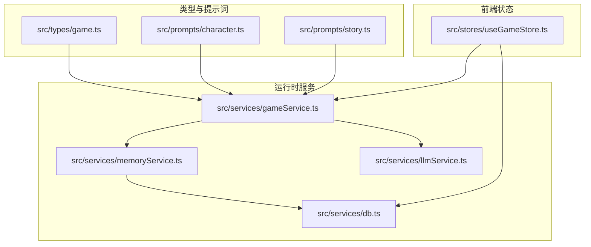
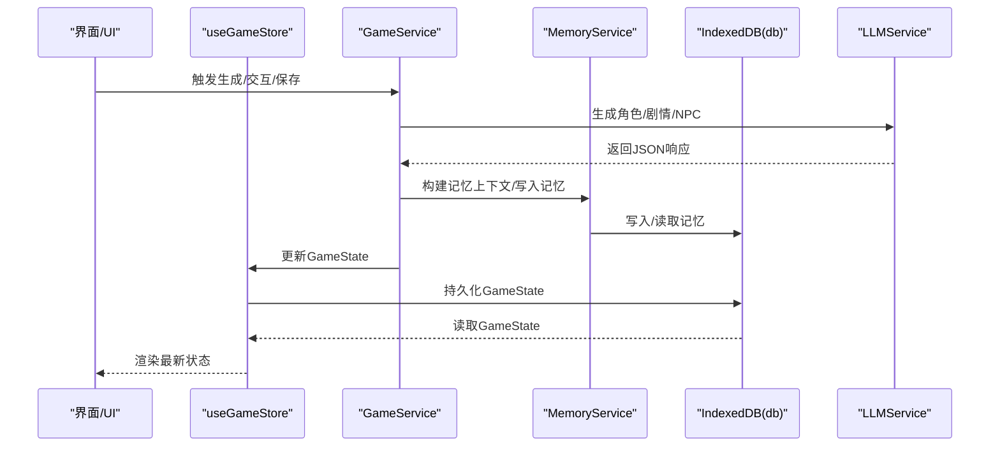
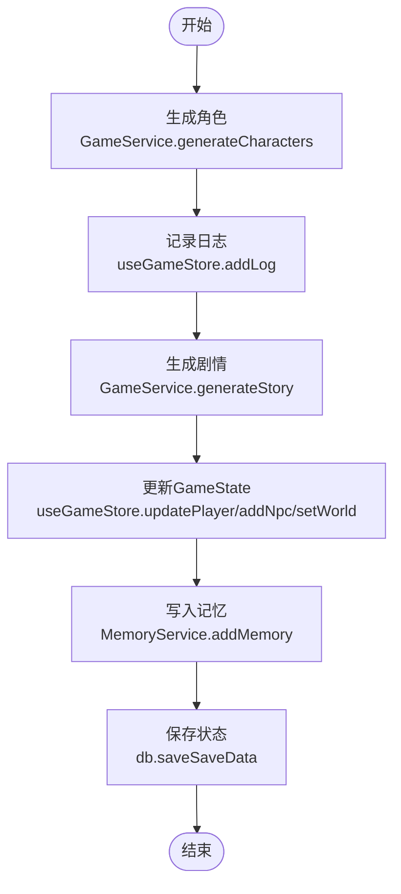

# 数据模型

<cite>
**本文引用的文件**
- [src/types/game.ts](file://src/types/game.ts)
- [src/services/db.ts](file://src/services/db.ts)
- [src/services/memoryService.ts](file://src/services/memoryService.ts)
- [src/stores/useGameStore.ts](file://src/stores/useGameStore.ts)
- [src/services/gameService.ts](file://src/services/gameService.ts)
- [src/services/llmService.ts](file://src/services/llmService.ts)
- [src/prompts/character.ts](file://src/prompts/character.ts)
- [src/prompts/story.ts](file://src/prompts/story.ts)
- [tsconfig.json](file://tsconfig.json)
</cite>

## 目录
1. [简介](#简介)
2. [项目结构](#项目结构)
3. [核心组件](#核心组件)
4. [架构总览](#架构总览)
5. [详细组件分析](#详细组件分析)
6. [依赖关系分析](#依赖关系分析)
7. [性能考量](#性能考量)
8. [故障排查指南](#故障排查指南)
9. [结论](#结论)
10. [附录](#附录)

## 简介
本文件系统化梳理“修仙 Roguelike”项目的底层数据模型，覆盖玩家(Player)、NPC、世界(World)、游戏日志(GameLog)、事件(Event)、记忆(Memory)、时间(Time)等核心类型，阐明字段语义、数据类型、约束与默认值，解析实体关系与组合关系，总结数据验证规则、类型安全保证、序列化策略与使用示例，并给出设计原则与扩展指南。文档同时结合实际代码实现，提供可视化图示与来源标注，帮助开发者快速理解与正确使用数据模型。

## 项目结构
围绕数据模型的关键文件组织如下：
- 类型定义：src/types/game.ts
- 存储与索引：src/services/db.ts
- 记忆与检索：src/services/memoryService.ts
- 前端状态管理：src/stores/useGameStore.ts
- 游戏服务编排：src/services/gameService.ts
- 大模型服务：src/services/llmService.ts
- 提示词与生成规范：src/prompts/character.ts、src/prompts/story.ts
- 编译配置与类型安全：tsconfig.json



图表来源
- [src/types/game.ts](file://src/types/game.ts#L1-L319)
- [src/services/gameService.ts](file://src/services/gameService.ts#L1-L541)
- [src/services/memoryService.ts](file://src/services/memoryService.ts#L1-L224)
- [src/services/db.ts](file://src/services/db.ts#L1-L236)
- [src/services/llmService.ts](file://src/services/llmService.ts#L1-L101)
- [src/stores/useGameStore.ts](file://src/stores/useGameStore.ts#L1-L226)
- [src/prompts/character.ts](file://src/prompts/character.ts#L1-L97)
- [src/prompts/story.ts](file://src/prompts/story.ts#L1-L147)

章节来源
- [src/types/game.ts](file://src/types/game.ts#L1-L319)
- [src/services/db.ts](file://src/services/db.ts#L1-L236)
- [src/services/memoryService.ts](file://src/services/memoryService.ts#L1-L224)
- [src/stores/useGameStore.ts](file://src/stores/useGameStore.ts#L1-L226)
- [src/services/gameService.ts](file://src/services/gameService.ts#L1-L541)
- [src/services/llmService.ts](file://src/services/llmService.ts#L1-L101)
- [src/prompts/character.ts](file://src/prompts/character.ts#L1-L97)
- [src/prompts/story.ts](file://src/prompts/story.ts#L1-L147)
- [tsconfig.json](file://tsconfig.json#L1-L31)

## 核心组件
本节概述数据模型的核心类型及其职责边界：
- Player：玩家角色，包含基础属性、修为、寿命、天赋、物品、技能、关系等。
- NPC：非玩家角色，包含身份、境界、好感度、互动历史、可选属性等。
- World：世界状态，包含位置、时间、势力、附近NPC等。
- GameLog：游戏日志条目，记录动作、事件、对话、系统信息。
- Event：事件，记录类型、描述、时间戳、选择与后果。
- Memory：记忆片段，支持嵌入向量、重要性评分、按存档检索。
- Time：时间结构，包含年、月、日、时辰。
- GameState：应用全局状态，聚合 Player/NPC/World/Logs/Events/Memories 等。
- LLMConfig：大模型配置，用于统一管理模型访问参数。
- GameSettings：游戏设置，含 LLM 配置、自动保存、主题等。
- NPCInteractResult：NPC 交互结果，封装对话、可用交互、状态变更等。

章节来源
- [src/types/game.ts](file://src/types/game.ts#L110-L251)

## 架构总览
数据模型在系统中的流转路径：
- 类型定义位于 src/types/game.ts，为所有模块提供统一的类型契约。
- 前端状态管理通过 Zustand 将 GameState 持久化到本地存储，便于跨页面/刷新保持状态。
- 游戏服务 GameService 负责调用 LLM 生成角色、剧情、NPC，同时将结果写入记忆与日志。
- 记忆服务 MemoryService 负责记忆的嵌入、检索、摘要与上下文组装。
- IndexedDB 数据库服务 db.ts 提供存档元数据、存档数据与记忆的持久化与查询。



图表来源
- [src/stores/useGameStore.ts](file://src/stores/useGameStore.ts#L84-L225)
- [src/services/gameService.ts](file://src/services/gameService.ts#L50-L541)
- [src/services/memoryService.ts](file://src/services/memoryService.ts#L16-L224)
- [src/services/db.ts](file://src/services/db.ts#L36-L236)
- [src/services/llmService.ts](file://src/services/llmService.ts#L18-L101)

## 详细组件分析

### Player（玩家）
- 字段与类型
  - id: string
  - name: string
  - gender: string
  - background: string
  - realm: CultivationRealm
  - minorRealm: MinorRealm
  - cultivationProgress: number
  - spiritualEnergy: number
  - lifespan/maxLifespan: number
  - age: number
  - spiritualPower/maxSpiritualPower/health/maxHealth/attack/defense/speed/luck/rootBone/comprehension/karma: number
  - talents: string[]
  - inventory: Item[]
  - skills: Skill[]
  - relationships: Record<string, Relationship>
  - growthHistory: string[]
  - avatar: string
- 约束与默认值
  - 基础属性默认值在生成流程中由服务层补全，确保不会出现 NaN 或缺失字段。
  - 境界与小境界枚举受 CultivationRealm/MinorRealm 约束。
  - 关系映射 relationships 以 NPC id 为键，值为 Relationship 对象。
- 数据验证与类型安全
  - TypeScript 严格模式下，字段类型与默认值补全保障了运行时类型安全。
  - 生成角色时对缺失字段进行兜底赋值，避免空值传播。
- 使用示例
  - 在角色生成后，通过 updatePlayer 部分更新属性。
  - 在剧情推进后，合并 statChanges、itemsGained、skillsGained 等结果。
- 序列化策略
  - 通过 Zustand 的持久化中间件将 GameState 序列化到 localStorage。
  - 保存时将 GameState 写入 IndexedDB 的 saveData 表。

章节来源
- [src/types/game.ts](file://src/types/game.ts#L110-L139)
- [src/services/gameService.ts](file://src/services/gameService.ts#L92-L118)
- [src/stores/useGameStore.ts](file://src/stores/useGameStore.ts#L91-L94)

### NPC（非玩家角色）
- 字段与类型
  - id/name/emoji/avatar: string
  - realm/minorRealm: CultivationRealm/MinorRealm
  - identity: string
  - favor: number（-100~100）
  - favorLevel: FavorLevel
  - description/history/talents/personality: string[]
  - relationships: Record<string, Relationship>
  - attributes?: NPCAttributes（探查后可见）
  - revealedAttributes: boolean
  - items/skills/memoryTags: string[]
  - relationshipDesc?: string
  - lastInteractionAt?: number
  - interactionCount: number
- 约束与默认值
  - favor 默认值在生成流程中设置为 0（陌生）。
  - favorLevel 通过工具函数映射 favor 数值区间。
  - attributes 仅在 revealedAttributes=true 时可见。
- 数据验证与类型安全
  - favor/favorLevel 通过 getFavorLevel/getFavorColor/getFavorIcon 三函数保证一致性。
  - interactionCount 默认 0，避免未初始化导致的错误。
- 使用示例
  - 交互后根据 NPCInteractResult 更新 favor、memoryTags、revealedAttributes、relationshipDesc。
  - 生成区域 NPC 时，按区域特点与玩家境界生成合理 NPC 集合。
- 序列化策略
  - 通过 GameState.npcs 持久化，随 GameState 一起保存。

章节来源
- [src/types/game.ts](file://src/types/game.ts#L173-L203)
- [src/types/game.ts](file://src/types/game.ts#L287-L318)
- [src/services/gameService.ts](file://src/services/gameService.ts#L527-L536)

### World（世界）
- 字段与类型
  - id/name/description: string
  - currentLocation: string
  - locations: string[]
  - time: Time
  - factions: string[]
  - nearbyNPCs: string[]
  - locationDescription?: string
- 约束与默认值
  - nearbyNPCs 为空数组为初始状态。
  - time 由 Time 结构提供年/月/日/时辰。
- 数据验证与类型安全
  - 世界初始化时设置默认值，避免空引用。
- 使用示例
  - 更新当前地点与附近 NPC 列表，驱动交互与事件生成。
- 序列化策略
  - 通过 GameState.world 持久化。

章节来源
- [src/types/game.ts](file://src/types/game.ts#L205-L217)
- [src/stores/useGameStore.ts](file://src/stores/useGameStore.ts#L112-L131)

### GameLog（游戏日志）
- 字段与类型
  - id: string
  - timestamp: number
  - content: string
  - type: 'action' | 'event' | 'dialog' | 'system'
- 约束与默认值
  - id 自动生成，timestamp 由添加时填充。
- 数据验证与类型安全
  - type 为联合字面量，防止非法类型。
- 使用示例
  - 添加日志时自动填充 id 与时间戳。
  - 日志内容用于记忆检索与剧情生成。
- 序列化策略
  - 通过 GameState.logs 持久化。

章节来源
- [src/types/game.ts](file://src/types/game.ts#L228-L233)
- [src/stores/useGameStore.ts](file://src/stores/useGameStore.ts#L144-L154)

### Event（事件）
- 字段与类型
  - id: string
  - type: string
  - description: string
  - timestamp: Time
  - choices?: string[]
  - consequences?: string[]
- 约束与默认值
  - id 自动生成。
- 数据验证与类型安全
  - type 为字符串，允许自定义事件类型。
- 使用示例
  - 事件驱动剧情分支与选择。
- 序列化策略
  - 通过 GameState.events 持久化。

章节来源
- [src/types/game.ts](file://src/types/game.ts#L219-L226)
- [src/stores/useGameStore.ts](file://src/stores/useGameStore.ts#L156-L159)

### Memory（记忆）
- 字段与类型
  - id/saveId/type/content/embedding?: Embedding/timestamp/importance: number
- 嵌入结构 Embedding
  - id: string
  - vector: number[]
  - timestamp: number
- 约束与默认值
  - embedding 为可选，支持向量相似度检索。
  - importance 用于筛选高价值记忆。
- 数据验证与类型安全
  - embedding/vector 为数组，长度与归一化策略由嵌入模型决定。
- 使用示例
  - 从 GameLog 自动提取重要性并写入记忆。
  - RAG 检索相关记忆，组装上下文。
- 序列化策略
  - 通过 IndexedDB 的 memories store 持久化，按 saveId 索引。

章节来源
- [src/types/game.ts](file://src/types/game.ts#L57-L71)
- [src/services/memoryService.ts](file://src/services/memoryService.ts#L84-L98)
- [src/services/db.ts](file://src/services/db.ts#L26-L34)

### Time（时间）
- 字段与类型
  - year/month/day/shichen: number
- 约束与默认值
  - 由 World.time 统一管理，用于剧情推进与寿命计算。
- 数据验证与类型安全
  - 通过 Partial<Time> 在更新时部分替换。
- 使用示例
  - 更新时间推进剧情与寿命消耗。
- 序列化策略
  - 作为 GameState 的一部分持久化。

章节来源
- [src/types/game.ts](file://src/types/game.ts#L50-L55)
- [src/stores/useGameStore.ts](file://src/stores/useGameStore.ts#L133-L142)

### GameState（全局状态）
- 字段与类型
  - player: Player | null
  - npcs: NPC[]
  - world: World | null
  - logs: GameLog[]
  - events: Event[]
  - memories: Memory[]
  - memorySummary: string
  - turn: number
  - isPlaying/isLoading: boolean
  - error: string | null
  - selectedNPCId: string | null
  - isNPCInteracting: boolean
- 约束与默认值
  - 初始状态在 Zustand store 中定义，保证最小可用状态。
- 数据验证与类型安全
  - 严格模式下，字段类型与默认值确保运行时安全。
- 使用示例
  - 通过 setPlayer/updatePlayer/addNpc 等方法更新状态。
  - 保存/加载时将整个 GameState 写入/读取。
- 序列化策略
  - 通过 persist 中间件将指定字段序列化到 localStorage。
  - 保存到 IndexedDB 的 saveData 表。

章节来源
- [src/types/game.ts](file://src/types/game.ts#L235-L251)
- [src/stores/useGameStore.ts](file://src/stores/useGameStore.ts#L61-L77)
- [src/stores/useGameStore.ts](file://src/stores/useGameStore.ts#L394-L409)

### LLMConfig 与 GameSettings
- LLMConfig
  - baseURL: string
  - apiKey: string
  - model: string
- GameSettings
  - llmConfig: LLMConfig
  - autoSave: boolean
  - theme: 'light' | 'dark'
- 使用示例
  - 初始化 LLMService 与 GameService 时注入配置。
  - 通过 GameSettings 控制自动保存与主题切换。

章节来源
- [src/types/game.ts](file://src/types/game.ts#L253-L263)
- [src/services/llmService.ts](file://src/services/llmService.ts#L18-L27)
- [src/services/gameService.ts](file://src/services/gameService.ts#L55-L57)

### NPCInteractResult（NPC 交互结果）
- 字段与类型
  - dialogue: string
  - possibleInteractions: NPCInteraction[]
  - npcStateDelta: { favor?, memoryTags?, revealedAttributes?, relationshipDesc? }
  - playerStateDelta: { health?, spiritualPower?, itemsGained?, itemsLost? }
  - newNPCs?: NPC[]
  - locationChange?: string
  - timePassed?: Time
  - storyUpdate?: string
- 使用示例
  - 交互后根据结果更新双方状态与世界状态。

章节来源
- [src/types/game.ts](file://src/types/game.ts#L266-L285)

## 依赖关系分析

### 类型与接口关系图
```mermaid
classDiagram
class Player {
+string id
+string name
+string gender
+string background
+CultivationRealm realm
+MinorRealm minorRealm
+number cultivationProgress
+number spiritualEnergy
+number lifespan
+number maxLifespan
+number age
+number spiritualPower
+number maxSpiritualPower
+number health
+number maxHealth
+number attack
+number defense
+number speed
+number luck
+number rootBone
+number comprehension
+number karma
+string[] talents
+Item[] inventory
+Skill[] skills
+Record<string, Relationship> relationships
+string[] growthHistory
+string avatar
}
class NPC {
+string id
+string name
+string emoji
+string avatar
+CultivationRealm realm
+MinorRealm minorRealm
+string identity
+number favor
+FavorLevel favorLevel
+string description
+string[] history
+string[] talents
+string personality
+Record<string, Relationship> relationships
+NPCAttributes attributes?
+boolean revealedAttributes
+string[] items?
+string[] skills?
+string[] memoryTags
+string relationshipDesc?
+number lastInteractionAt?
+number interactionCount
}
class World {
+string id
+string name
+string description
+string currentLocation
+string[] locations
+Time time
+string[] factions
+string[] nearbyNPCs
+string locationDescription?
}
class GameLog {
+string id
+number timestamp
+string content
+("action"|"event"|"dialog"|"system") type
}
class Event {
+string id
+string type
+string description
+Time timestamp
+string[] choices?
+string[] consequences?
}
class Memory {
+string id
+string saveId
+string type
+string content
+Embedding embedding?
+number timestamp
+number importance
}
class Embedding {
+string id
+number[] vector
+number timestamp
}
class Time {
+number year
+number month
+number day
+number shichen
}
class Relationship {
+string npcId
+string npcName
+string npcEmoji
+string npcIdentity
+RelationshipLevel level
+number favorability
+string description?
+number firstMetAt?
+number lastInteractionAt?
+number interactionCount?
+string[] tags?
+string notes?
+string[] history
}
class Item {
+string id
+string name
+ItemType type
+ItemQuality quality
+string effect
+number quantity
}
class Skill {
+string id
+string name
+SkillType type
+SkillCategory category
+SkillQuality quality
+string description
+CultivationRealm realmRequirement
+number level
+number maxLevel
}
class GameState {
+Player player
+NPC[] npcs
+World world
+GameLog[] logs
+Event[] events
+Memory[] memories
+string memorySummary
+number turn
+boolean isPlaying
+boolean isLoading
+string error
+string selectedNPCId
+boolean isNPCInteracting
}
Player --> Item : "拥有"
Player --> Skill : "掌握"
Player --> Relationship : "维护"
NPC --> Relationship : "维护"
GameState --> Player : "包含"
GameState --> NPC[] : "包含"
GameState --> World : "包含"
GameState --> GameLog[] : "包含"
GameState --> Event[] : "包含"
GameState --> Memory[] : "包含"
Memory --> Embedding : "可选"
World --> Time : "包含"
```

图表来源
- [src/types/game.ts](file://src/types/game.ts#L110-L251)

### 数据流与处理链路


图表来源
- [src/services/gameService.ts](file://src/services/gameService.ts#L75-L119)
- [src/stores/useGameStore.ts](file://src/stores/useGameStore.ts#L144-L171)
- [src/services/memoryService.ts](file://src/services/memoryService.ts#L84-L98)
- [src/services/db.ts](file://src/services/db.ts#L134-L141)

## 性能考量
- 记忆检索与相似度计算
  - 使用余弦相似度计算向量相似度，topK 限制降低检索成本。
  - 工作记忆与摘要记忆配合，减少大规模向量扫描。
- IndexedDB 查询优化
  - 为 memories 建立 saveId、timestamp、importance 索引，支持高效过滤与排序。
- 嵌入模型降级
  - 若加载失败，采用简单哈希向量作为备选，保证功能可用性。
- 状态持久化
  - Zustand 的持久化中间件仅序列化必要字段，减少存储压力。
- LLM 请求重试
  - 多次重试与延迟退避，提高稳定性与用户体验。

章节来源
- [src/services/memoryService.ts](file://src/services/memoryService.ts#L70-L81)
- [src/services/db.ts](file://src/services/db.ts#L55-L69)
- [src/services/llmService.ts](file://src/services/llmService.ts#L37-L55)

## 故障排查指南
- 记忆检索为空
  - 检查 saveId 是否正确传递，确认 IndexedDB 中是否存在对应记录。
  - 确认 embedding 是否成功生成，否则使用简单哈希向量。
- 好感度映射异常
  - 检查 favor 数值范围与映射函数，确保在 -100~100 区间内。
- 状态未持久化
  - 确认 Zustand 的持久化配置与字段白名单。
  - 检查 localStorage 是否被清理或受限。
- LLM 调用失败
  - 查看重试日志与错误信息，检查 baseURL/apiKey/model 配置。
- 时间更新无效
  - 确认 World 存在后再更新 time，避免空引用。

章节来源
- [src/services/memoryService.ts](file://src/services/memoryService.ts#L122-L137)
- [src/types/game.ts](file://src/types/game.ts#L287-L318)
- [src/stores/useGameStore.ts](file://src/stores/useGameStore.ts#L133-L142)
- [src/services/llmService.ts](file://src/services/llmService.ts#L40-L55)

## 结论
本数据模型以 TypeScript 类型系统为基础，结合 Zustand 状态管理、IndexedDB 持久化与 LLM 生成能力，构建了完整的修仙 Roguelike 数据闭环。Player/NPC/World/GameLog/Event/Memory/Time 等核心类型清晰定义了领域模型，配合严格的默认值与类型安全策略，确保了运行时的稳定性与可扩展性。通过记忆检索与摘要机制，系统实现了长期记忆与上下文增强，为复杂剧情与 NPC 交互提供了坚实的数据支撑。

## 附录

### 设计原则
- 单一职责：每个类型聚焦于特定领域概念，避免过度耦合。
- 类型安全：严格使用 TypeScript，结合默认值与校验函数，减少运行时错误。
- 可扩展性：通过接口与可选字段预留扩展点，如 Memory.embedding、NPC.attributes。
- 可观测性：日志、时间、记忆与摘要共同构成可观测的数据流。

### 扩展指南
- 新增实体
  - 在 src/types/game.ts 中定义接口与类型别名。
  - 在 GameState 中增加字段，并在 Zustand store 中提供更新方法。
  - 如需持久化，扩展 IndexedDB 的 object store 与索引。
- 新增字段
  - 优先使用可选字段，避免破坏现有数据。
  - 在生成流程中提供默认值，确保向后兼容。
- 新增交互
  - 定义新的 NPCInteractionType 与 NPCInteraction。
  - 在 GameService 中扩展交互逻辑与记忆记录。
- 新增提示词
  - 在 src/prompts 下新增提示词文件，遵循现有格式与约束。
  - 在 GameService 中引用并传入 LLMService。

### 序列化与反序列化要点
- Zustand 持久化
  - 仅持久化必要字段，避免存储冗余。
  - 使用 createJSONStorage 包装 localStorage。
- IndexedDB
  - 以 saveId 为主键关联存档数据与记忆。
  - 为高频查询建立索引，提升检索效率。
- LLM 输出
  - 严格解析 JSON，提供兜底默认值，避免 NaN 与空值传播。

章节来源
- [src/stores/useGameStore.ts](file://src/stores/useGameStore.ts#L207-L224)
- [src/services/db.ts](file://src/services/db.ts#L55-L69)
- [src/services/gameService.ts](file://src/services/gameService.ts#L346-L372)