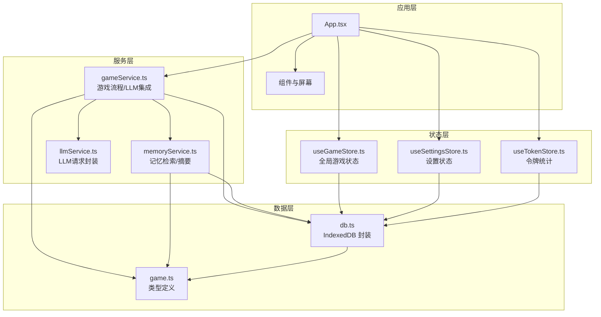
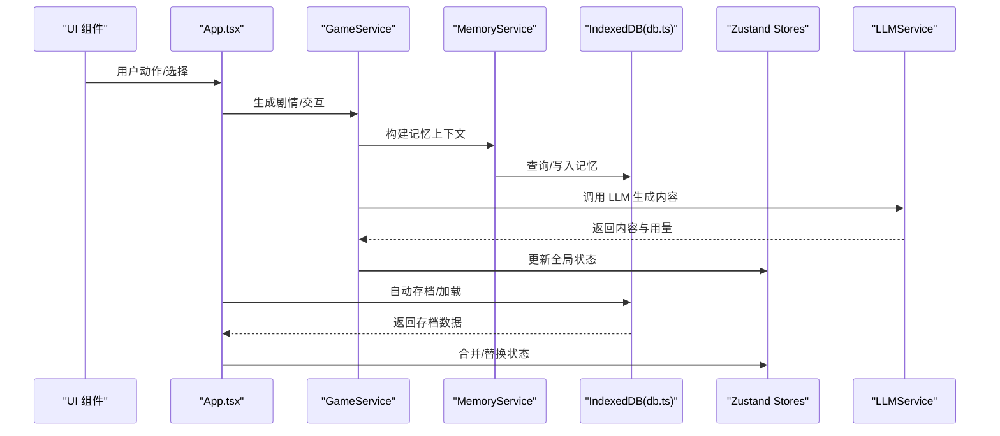
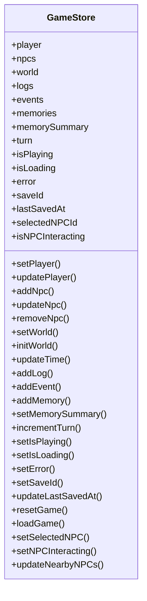
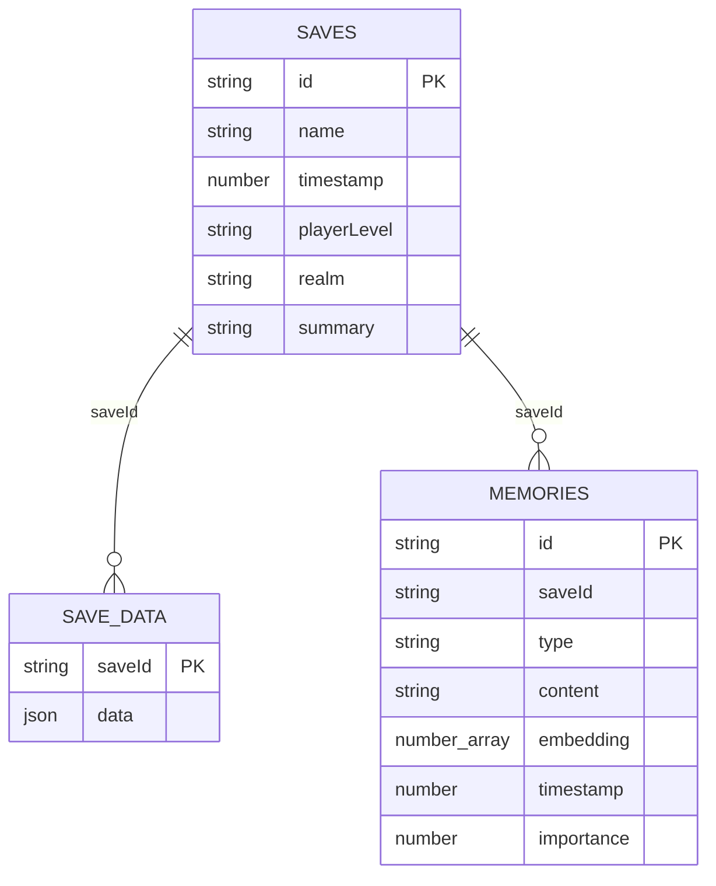
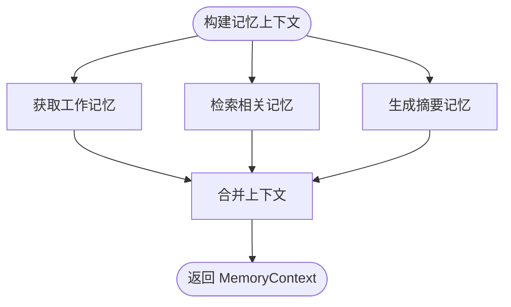
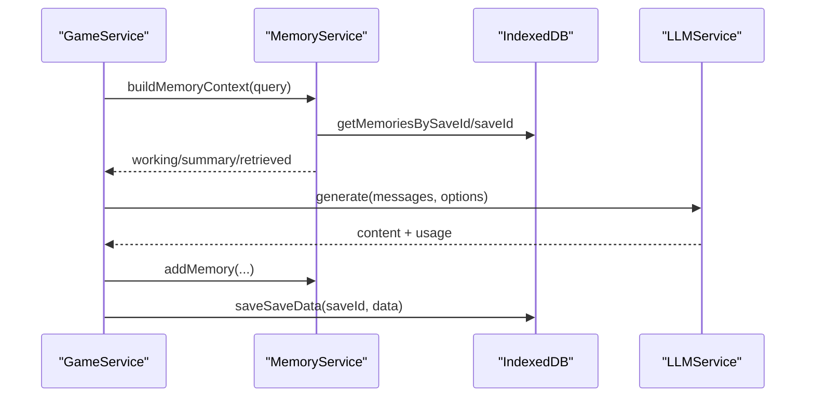
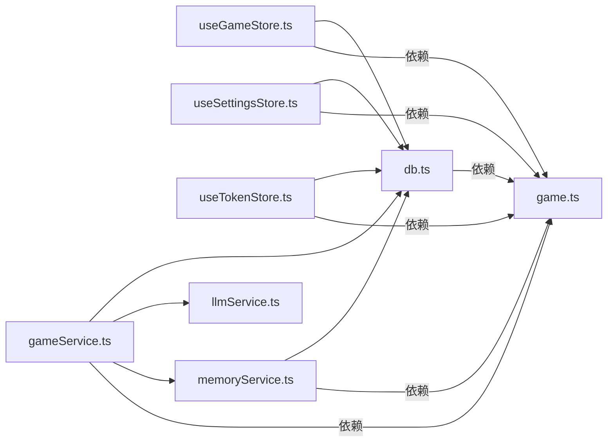

# 数据管理

<cite>
**本文引用的文件**
- [useGameStore.ts](file://src/stores/useGameStore.ts)
- [useSettingsStore.ts](file://src/stores/useSettingsStore.ts)
- [useTokenStore.ts](file://src/stores/useTokenStore.ts)
- [db.ts](file://src/services/db.ts)
- [gameService.ts](file://src/services/gameService.ts)
- [memoryService.ts](file://src/services/memoryService.ts)
- [llmService.ts](file://src/services/llmService.ts)
- [game.ts](file://src/types/game.ts)
- [App.tsx](file://src/App.tsx)
- [main.tsx](file://src/main.tsx)
- [package.json](file://package.json)
</cite>

## 目录
1. [简介](#简介)
2. [项目结构](#项目结构)
3. [核心组件](#核心组件)
4. [架构总览](#架构总览)
5. [详细组件分析](#详细组件分析)
6. [依赖分析](#依赖分析)
7. [性能考虑](#性能考虑)
8. [故障排除指南](#故障排除指南)
9. [结论](#结论)
10. [附录](#附录)

## 简介
本文件面向数据工程师，系统化梳理“修仙 Roguelike”项目的“数据管理”体系，围绕以下目标展开：
- 基于 Zustand 的状态管理架构：全局游戏状态、设置状态、令牌状态的管理策略与持久化。
- IndexedDB 持久化设计：数据模型、存储结构、查询优化、数据迁移机制。
- 数据同步策略、冲突解决、备份恢复功能。
- 类型安全的数据处理、状态订阅机制、性能优化方案。
- 数据访问模式、缓存策略、内存管理。
- 最佳实践与故障排除指南。

## 项目结构
项目采用前端单页应用架构，核心数据层由 Zustand 状态库与 IndexedDB 数据库组成，服务层封装 LLM、记忆检索与游戏流程控制。

图表来源
- [App.tsx](file://src/App.tsx#L1-L588)
- [useGameStore.ts](file://src/stores/useGameStore.ts#L1-L226)
- [useSettingsStore.ts](file://src/stores/useSettingsStore.ts#L1-L46)
- [useTokenStore.ts](file://src/stores/useTokenStore.ts#L1-L73)
- [gameService.ts](file://src/services/gameService.ts#L1-L541)
- [memoryService.ts](file://src/services/memoryService.ts#L1-L224)
- [llmService.ts](file://src/services/llmService.ts#L1-L101)
- [db.ts](file://src/services/db.ts#L1-L236)
- [game.ts](file://src/types/game.ts#L1-L319)

章节来源
- [main.tsx](file://src/main.tsx#L1-L11)
- [package.json](file://package.json#L1-L55)

## 核心组件
- Zustand 状态仓库
  - 全局游戏状态：玩家、NPC、世界、日志、事件、记忆、回合数、播放状态、加载状态、错误、存档标识与最后保存时间等。
  - 设置状态：LLM 配置、自动保存开关、主题。
  - 令牌状态：单次调用、累计与会话级统计。
- IndexedDB 数据库
  - 存档元数据、存档数据、记忆片段三类对象仓库存储。
  - 提供增删改查、索引与批量写入能力。
- 服务层
  - GameService：整合 LLM、记忆服务与存档，驱动剧情生成与 NPC 交互。
  - MemoryService：记忆向量化、相似度检索、摘要生成、工作记忆与清理策略。
  - LLMService：统一的 LLM 请求封装与重试机制。

章节来源
- [useGameStore.ts](file://src/stores/useGameStore.ts#L13-L55)
- [useSettingsStore.ts](file://src/stores/useSettingsStore.ts#L5-L10)
- [useTokenStore.ts](file://src/stores/useTokenStore.ts#L10-L23)
- [db.ts](file://src/services/db.ts#L6-L34)
- [gameService.ts](file://src/services/gameService.ts#L50-L58)
- [memoryService.ts](file://src/services/memoryService.ts#L16-L25)
- [llmService.ts](file://src/services/llmService.ts#L18-L27)

## 架构总览
下图展示从 UI 到状态、再到 IndexedDB 的端到端数据流，以及 LLM 服务的集成点。

图表来源
- [App.tsx](file://src/App.tsx#L74-L122)
- [gameService.ts](file://src/services/gameService.ts#L283-L391)
- [memoryService.ts](file://src/services/memoryService.ts#L175-L188)
- [db.ts](file://src/services/db.ts#L134-L150)
- [llmService.ts](file://src/services/llmService.ts#L29-L55)

## 详细组件分析

### Zustand 全局游戏状态（useGameStore）
- 状态结构
  - 玩家、NPC 列表、世界、日志、事件、记忆、记忆摘要、回合数、播放/加载/错误标志、存档标识与最后保存时间、NPC 交互状态。
- 主要方法
  - 玩家与 NPC 的增删改查、世界初始化与时间推进、日志/事件/记忆追加、回合递增、播放/加载/错误状态切换、重置/加载状态、NPC 交互状态管理。
- 持久化策略
  - 使用 persist 中间件，存储到 localStorage，键名固定，仅持久化部分字段（partialize）。
  - 适合快速本地体验，但不替代 IndexedDB 的存档数据。

图表来源
- [useGameStore.ts](file://src/stores/useGameStore.ts#L13-L55)

章节来源
- [useGameStore.ts](file://src/stores/useGameStore.ts#L84-L225)

### 设置状态（useSettingsStore）
- 状态结构
  - LLM 配置（baseURL、apiKey、model）、自动保存开关、主题。
- 主要方法
  - 更新 LLM 配置、切换自动保存、切换主题、重置默认设置。
- 持久化策略
  - 使用 persist 中间件，存储到 localStorage，键名固定。

章节来源
- [useSettingsStore.ts](file://src/stores/useSettingsStore.ts#L24-L45)

### 令牌状态（useTokenStore）
- 状态结构
  - lastUsage（单次）、totalUsage（累计）、sessionUsage（会话）。
- 主要方法
  - addUsage、clearLastUsage、resetSession、resetAll。
- 持久化策略
  - 仅持久化 totalUsage，避免会话态污染。

章节来源
- [useTokenStore.ts](file://src/stores/useTokenStore.ts#L31-L72)

### IndexedDB 数据库（db.ts）
- 数据模型
  - 存档元数据（id、name、timestamp、playerLevel、realm、summary）
  - 存档数据（saveId、data: GameState）
  - 记忆片段（id、saveId、type、content、embedding、timestamp、importance）
- 存储结构与索引
  - SAVES：按 timestamp 排序
  - SAVE_DATA：按 saveId 主键
  - MEMORIES：按 saveId、timestamp、importance 排序
- 查询与写入
  - 增删改查、批量写入、按 saveId 获取、按重要度过滤、游标删除等。
- 数据迁移
  - onupgradeneeded 中创建对象仓库存储与索引，版本号为 1。

图表来源
- [db.ts](file://src/services/db.ts#L12-L34)

章节来源
- [db.ts](file://src/services/db.ts#L39-L72)
- [db.ts](file://src/services/db.ts#L85-L159)
- [db.ts](file://src/services/db.ts#L161-L225)

### 记忆服务（memoryService.ts）
- 功能要点
  - 嵌入向量生成（@xenova/transformers 或备用哈希向量）
  - 余弦相似度计算
  - 工作记忆（最近 N 条）、摘要记忆（超过阈值时生成）
  - RAG 相关记忆检索、重要性标记、清理策略
- 记忆上下文组装
  - 并行获取工作记忆、检索记忆、摘要记忆，形成统一上下文。

图表来源
- [memoryService.ts](file://src/services/memoryService.ts#L175-L188)

章节来源
- [memoryService.ts](file://src/services/memoryService.ts#L27-L81)
- [memoryService.ts](file://src/services/memoryService.ts#L121-L137)
- [memoryService.ts](file://src/services/memoryService.ts#L144-L173)
- [memoryService.ts](file://src/services/memoryService.ts#L190-L215)

### 游戏服务（gameService.ts）
- 职责
  - 角色生成、剧情生成、NPC 交互、存档读写、LLM 调用量统计。
  - 初始化 MemoryService，与 LLMService 协作。
- 数据流
  - 通过 MemoryService.buildMemoryContext 为剧情生成提供上下文。
  - 将生成结果写入记忆（关键事件/NPC 交互）。
  - 保存 GameState 到 IndexedDB。

图表来源
- [gameService.ts](file://src/services/gameService.ts#L283-L391)
- [memoryService.ts](file://src/services/memoryService.ts#L175-L188)
- [db.ts](file://src/services/db.ts#L134-L150)
- [llmService.ts](file://src/services/llmService.ts#L29-L55)

章节来源
- [gameService.ts](file://src/services/gameService.ts#L59-L62)
- [gameService.ts](file://src/services/gameService.ts#L393-L409)
- [gameService.ts](file://src/services/gameService.ts#L415-L469)

### LLM 服务（llmService.ts）
- 功能
  - 统一请求封装、重试机制、错误处理、用量返回。
- 集成
  - GameService 与 MemoryService 在生成内容后记录用量到 useTokenStore。

章节来源
- [llmService.ts](file://src/services/llmService.ts#L29-L98)
- [gameService.ts](file://src/services/gameService.ts#L64-L72)
- [memoryService.ts](file://src/services/memoryService.ts#L145-L173)

### 类型系统（game.ts）
- 定义了修仙世界的核心类型：Player、NPC、World、Event、GameLog、Memory、Time、关系与等级映射等。
- 提供工具函数：好感度级别与颜色、图标映射。

章节来源
- [game.ts](file://src/types/game.ts#L1-L319)

## 依赖分析
- 状态管理
  - Zustand：全局状态、设置、令牌统计。
  - persist 中间件：localStorage 持久化。
- 数据持久化
  - IndexedDB：存档与记忆。
- 外部依赖
  - @xenova/transformers：嵌入向量生成。
  - zustand/zustand-persist：状态持久化。
  - react、react-dom：UI 框架。
- 服务依赖
  - GameService 依赖 MemoryService 与 LLMService。
  - App.tsx 依赖 db.ts 与 stores。

图表来源
- [useGameStore.ts](file://src/stores/useGameStore.ts#L1-L11)
- [useSettingsStore.ts](file://src/stores/useSettingsStore.ts#L1-L3)
- [useTokenStore.ts](file://src/stores/useTokenStore.ts#L1-L2)
- [gameService.ts](file://src/services/gameService.ts#L1-L9)
- [memoryService.ts](file://src/services/memoryService.ts#L1-L5)
- [db.ts](file://src/services/db.ts#L1-L1)
- [llmService.ts](file://src/services/llmService.ts#L1-L7)
- [game.ts](file://src/types/game.ts#L1-L319)

章节来源
- [package.json](file://package.json#L15-L36)

## 性能考虑
- 状态粒度与订阅
  - 使用独立的 store（游戏、设置、令牌）降低订阅范围，减少不必要的渲染。
  - App.tsx 中通过 useMemo 缓存 LLMService 实例，避免重复创建导致的性能损耗。
- IndexedDB 查询优化
  - 对 MEMORIES 建立 saveId、timestamp、importance 索引，支持高效检索与排序。
  - getMemoriesBySaveId 支持 limit，避免一次性加载过多数据。
- 记忆检索与摘要
  - MemoryService 并行获取工作记忆、检索记忆、摘要记忆，提升响应速度。
  - 重要性阈值与清理策略，控制记忆规模，避免膨胀。
- LLM 调用
  - LLMService 具备指数退避重试，降低网络波动影响。
  - 用量统计与会话隔离，便于成本控制与审计。
- 内存管理
  - 记忆片段按重要度与时间排序，定期清理非关键片段。
  - 令牌统计仅持久化累计值，避免会话态污染。

[本节为通用性能讨论，无需特定文件来源]

## 故障排除指南
- IndexedDB 初始化失败
  - 现象：打开数据库报错。
  - 排查：确认浏览器支持、未被禁用、跨域限制、权限问题。
  - 参考：[db.ts](file://src/services/db.ts#L40-L50)
- 存档读写异常
  - 现象：保存/加载失败。
  - 排查：检查 saveId 是否为空、事务模式是否正确、索引是否存在。
  - 参考：[db.ts](file://src/services/db.ts#L134-L150)
- 记忆检索为空
  - 现象：检索不到相关记忆。
  - 排查：确认 embedding 是否生成、索引是否建立、查询条件是否正确。
  - 参考：[memoryService.ts](file://src/services/memoryService.ts#L121-L137)
- LLM 调用失败
  - 现象：API 错误或超时。
  - 排查：检查 baseURL、apiKey、model、网络连通性、配额限制。
  - 参考：[llmService.ts](file://src/services/llmService.ts#L65-L92)
- 自动存档未触发
  - 现象：未按预期保存。
  - 排查：确认 gamePhase 为 game、saveId 是否存在、定时器是否启动。
  - 参考：[App.tsx](file://src/App.tsx#L107-L122)
- 状态未持久化
  - 现象：刷新后丢失。
  - 排查：确认 persist 配置、localStorage 可用性、键名一致性。
  - 参考：[useGameStore.ts](file://src/stores/useGameStore.ts#L207-L224)

章节来源
- [db.ts](file://src/services/db.ts#L40-L50)
- [db.ts](file://src/services/db.ts#L134-L150)
- [memoryService.ts](file://src/services/memoryService.ts#L121-L137)
- [llmService.ts](file://src/services/llmService.ts#L65-L92)
- [App.tsx](file://src/App.tsx#L107-L122)
- [useGameStore.ts](file://src/stores/useGameStore.ts#L207-L224)

## 结论
本项目采用 Zustand + IndexedDB 的混合持久化策略：Zustand 负责即时状态与用户体验，IndexedDB 负责长期存档与记忆。通过服务层统一封装 LLM 与数据访问，实现了类型安全、可维护且具备良好性能的数据管理架构。建议后续在以下方面持续优化：
- 引入 IndexedDB 迁移版本管理，支持 schema 演进。
- 补充单条记忆删除接口，完善清理策略。
- 增强冲突检测与合并策略（如多设备/多标签页场景）。
- 提供手动备份/恢复 UI 与导出导入能力。

[本节为总结性内容，无需特定文件来源]

## 附录

### 数据同步与冲突解决
- 当前实现
  - 本地自动存档：每 30 秒一次，以及每次行动后触发。
  - IndexedDB 作为最终一致的数据源，覆盖存档数据与记忆。
- 冲突解决建议
  - 引入版本号/时间戳字段，写入时进行比较与合并。
  - 对于记忆片段，按 timestamp 与 importance 组合排序，保留关键片段。
  - 对于设置与令牌，采用 last-writer-wins 或合并策略（如主题、自动保存开关）。

章节来源
- [App.tsx](file://src/App.tsx#L74-L122)
- [db.ts](file://src/services/db.ts#L134-L150)

### 备份与恢复
- 备份
  - 通过 IndexedDB 导出所有存档数据与记忆片段，形成可移植的 JSON 文件。
- 恢复
  - 从备份文件重建对象仓库存储，恢复存档与记忆。
- 注意事项
  - 备份应包含存档元数据与完整 GameState。
  - 恢复时需确保对象仓库存储与索引一致。

章节来源
- [db.ts](file://src/services/db.ts#L112-L119)
- [db.ts](file://src/services/db.ts#L227-L232)

### 类型安全与状态订阅
- 类型系统
  - 通过 game.ts 定义统一的领域模型，确保 LLM 生成与状态更新的一致性。
- 订阅机制
  - 使用 Zustand 的 setState 与 selector，最小化订阅范围，避免全量重渲染。
  - App.tsx 中对 LLM 配置变更进行 memo 化，避免服务实例频繁重建。

章节来源
- [game.ts](file://src/types/game.ts#L235-L251)
- [App.tsx](file://src/App.tsx#L67-L72)

### 数据访问模式与缓存策略
- 访问模式
  - 游戏流程：App -> GameService -> MemoryService/LLMService -> IndexedDB。
  - 记忆检索：并行获取工作记忆、检索记忆、摘要记忆，组合为上下文。
- 缓存策略
  - Zustand store：短期缓存 UI 状态与临时数据。
  - IndexedDB：长期缓存存档与记忆，配合索引与 limit 查询。
  - LLM：外部缓存（由 LLM 供应商提供），应用内仅记录用量。

章节来源
- [memoryService.ts](file://src/services/memoryService.ts#L175-L188)
- [db.ts](file://src/services/db.ts#L175-L189)