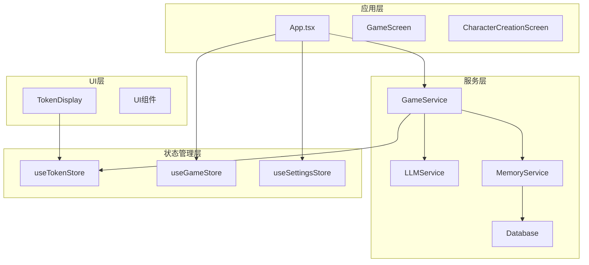
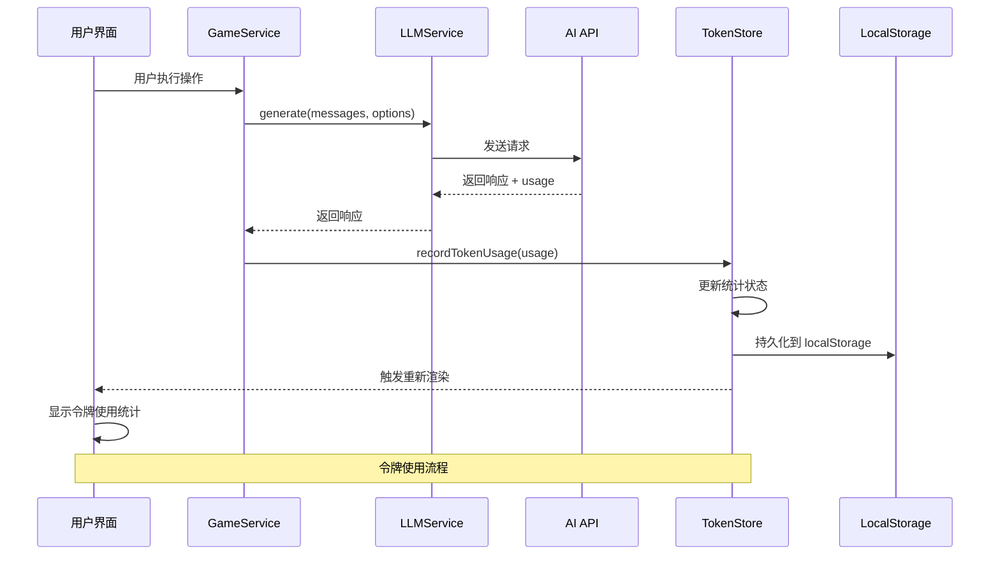
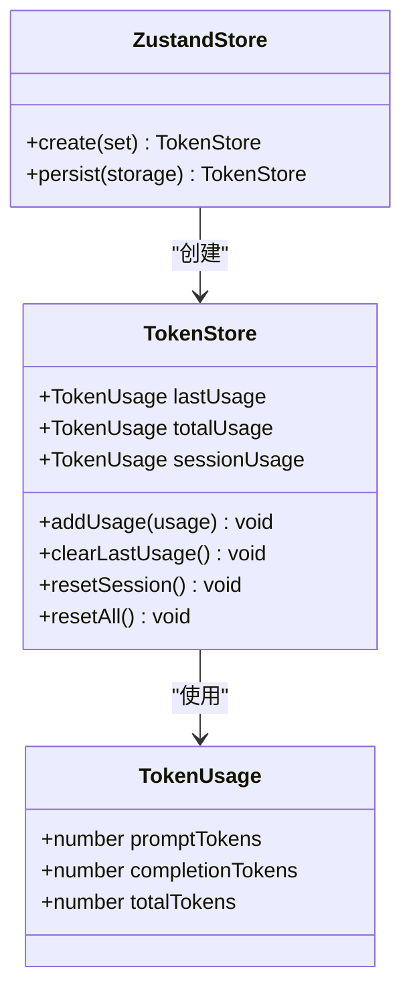
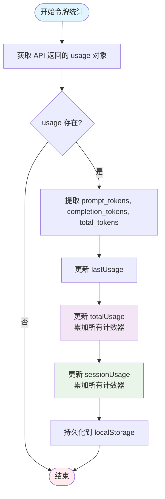
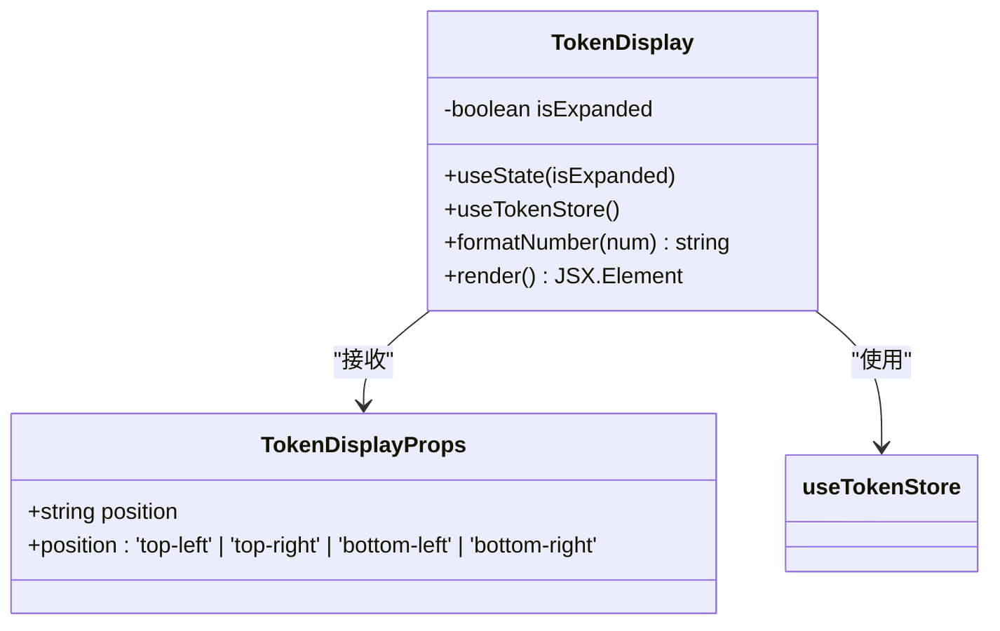
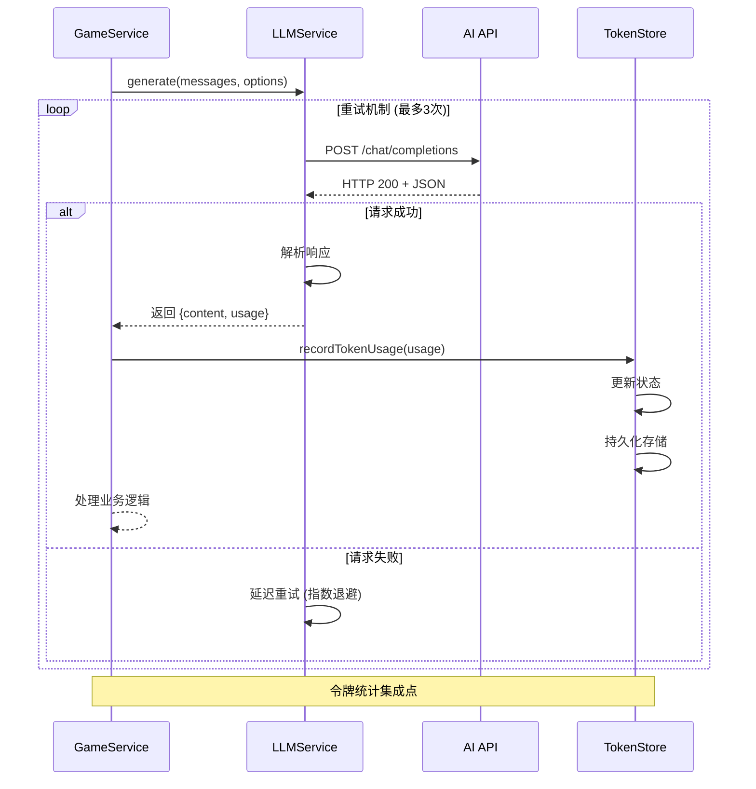
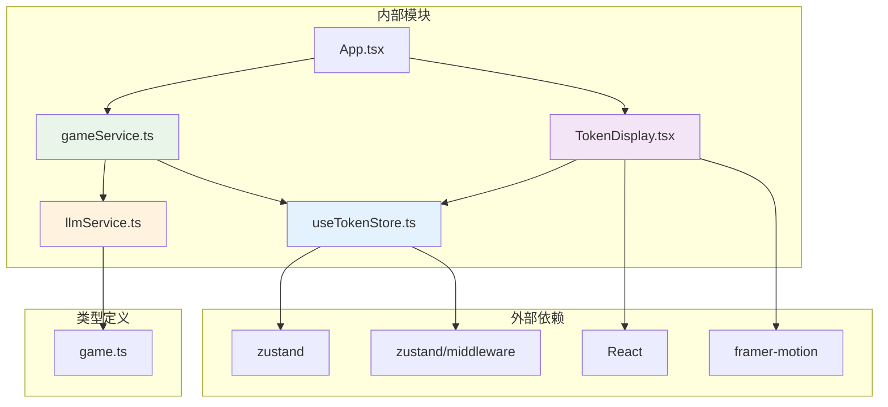
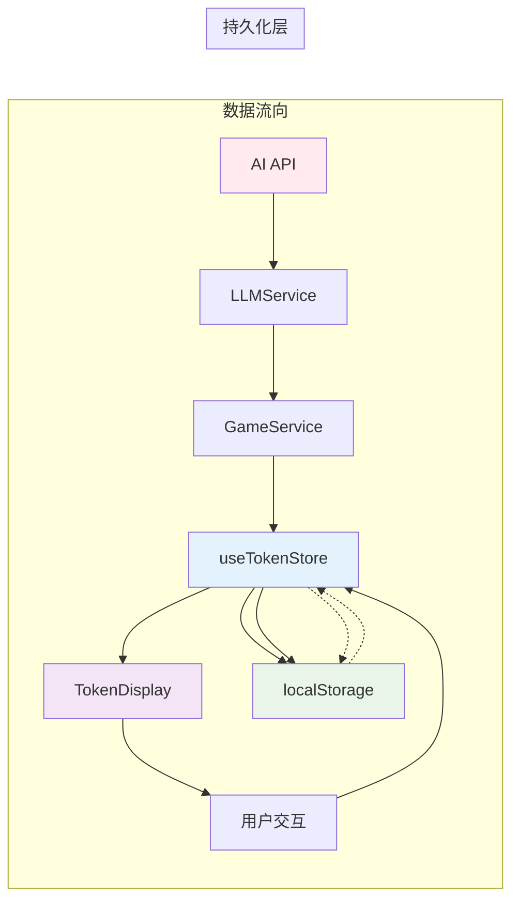

# 令牌状态管理

<cite>
**本文档引用的文件**
- [useTokenStore.ts](file://src/stores/useTokenStore.ts)
- [TokenDisplay.tsx](file://src/components/TokenDisplay.tsx)
- [llmService.ts](file://src/services/llmService.ts)
- [gameService.ts](file://src/services/gameService.ts)
- [App.tsx](file://src/App.tsx)
- [db.ts](file://src/services/db.ts)
- [game.ts](file://src/types/game.ts)
</cite>

## 目录
1. [简介](#简介)
2. [项目结构](#项目结构)
3. [核心组件](#核心组件)
4. [架构概览](#架构概览)
5. [详细组件分析](#详细组件分析)
6. [依赖关系分析](#依赖关系分析)
7. [性能考虑](#性能考虑)
8. [故障排除指南](#故障排除指南)
9. [结论](#结论)
10. [附录](#附录)

## 简介

令牌状态管理器 `useTokenStore` 是 xiuxian-roguelike 项目中用于跟踪和管理 AI 模型调用令牌使用情况的核心组件。该项目是一个基于 React 的修仙题材 roguelike 游戏，通过大型语言模型（LLM）生成游戏内容、角色和剧情。

本系统实现了完整的令牌配额管理，包括当前令牌数、最大配额、使用统计、重置机制等功能。令牌使用情况通过本地存储持久化，支持跨会话统计和可视化展示。

## 项目结构

项目采用模块化架构，主要分为以下几个层次：



**图表来源**
- [App.tsx](file://src/App.tsx#L1-L588)
- [gameService.ts](file://src/services/gameService.ts#L1-L541)
- [useTokenStore.ts](file://src/stores/useTokenStore.ts#L1-L73)

**章节来源**
- [App.tsx](file://src/App.tsx#L1-L588)
- [gameService.ts](file://src/services/gameService.ts#L1-L541)

## 核心组件

### useTokenStore - 令牌状态管理器

`useTokenStore` 是基于 Zustand 的状态管理器，专门用于跟踪 AI 模型的令牌使用情况。它提供了完整的令牌统计功能，包括：

- **单次调用统计** (`lastUsage`): 记录最近一次 API 调用的令牌使用情况
- **累计统计** (`totalUsage`): 记录从应用启动以来的总令牌使用量
- **会话统计** (`sessionUsage`): 记录当前会话期间的令牌使用量

### TokenDisplay - 令牌可视化组件

`TokenDisplay` 是一个交互式的 UI 组件，提供令牌使用情况的实时可视化展示，支持展开/折叠模式，包含以下功能：

- 实时显示当前会话令牌使用量
- 展示最近一次调用的详细统计
- 提供令牌使用的格式化显示（支持 K/M 缩写）
- 支持重置会话统计和全部统计的功能

**章节来源**
- [useTokenStore.ts](file://src/stores/useTokenStore.ts#L1-L73)
- [TokenDisplay.tsx](file://src/components/TokenDisplay.tsx#L1-L172)

## 架构概览

令牌管理系统在整个应用架构中的位置如下：



**图表来源**
- [gameService.ts](file://src/services/gameService.ts#L64-L72)
- [llmService.ts](file://src/services/llmService.ts#L29-L98)
- [useTokenStore.ts](file://src/stores/useTokenStore.ts#L38-L51)

## 详细组件分析

### useTokenStore 实现分析

#### 数据结构设计



**图表来源**
- [useTokenStore.ts](file://src/stores/useTokenStore.ts#L4-L23)

#### 状态管理机制

`useTokenStore` 使用 Zustand 的 `persist` 中间件实现状态持久化：

- **存储位置**: 浏览器 localStorage
- **存储键名**: `xiuxian-token-storage`
- **部分序列化**: 仅保存 `totalUsage` 字段，避免存储不必要的状态
- **初始化值**: 所有计数器初始为 0

#### 令牌统计逻辑



**图表来源**
- [useTokenStore.ts](file://src/stores/useTokenStore.ts#L38-L51)
- [gameService.ts](file://src/services/gameService.ts#L64-L72)

**章节来源**
- [useTokenStore.ts](file://src/stores/useTokenStore.ts#L1-L73)

### TokenDisplay 组件分析

#### UI 组件架构



**图表来源**
- [TokenDisplay.tsx](file://src/components/TokenDisplay.tsx#L6-L12)

#### 交互模式

组件支持两种显示模式：

1. **折叠模式**: 仅显示当前会话的总令牌数
2. **展开模式**: 显示详细的三层次统计信息

#### 数字格式化

组件实现了智能的数字格式化功能：
- 大于等于 1,000,000: 显示为 M（百万）
- 大于等于 1,000: 显示为 K（千）
- 小于 1,000: 使用本地化格式

**章节来源**
- [TokenDisplay.tsx](file://src/components/TokenDisplay.tsx#L1-L172)

### LLMService 集成分析

#### API 调用流程



**图表来源**
- [llmService.ts](file://src/services/llmService.ts#L29-L98)
- [gameService.ts](file://src/services/gameService.ts#L64-L72)

#### 错误处理机制

LLMService 实现了完善的错误处理：
- **重试机制**: 最多重试 3 次，使用指数退避策略
- **延迟重试**: 每次重试间隔递增（1s, 2s, 3s）
- **错误传播**: 所有重试失败后抛出最终错误
- **状态恢复**: 在重试过程中保持应用状态稳定

**章节来源**
- [llmService.ts](file://src/services/llmService.ts#L1-L101)
- [gameService.ts](file://src/services/gameService.ts#L64-L72)

## 依赖关系分析

### 组件依赖图



**图表来源**
- [useTokenStore.ts](file://src/stores/useTokenStore.ts#L1-L2)
- [TokenDisplay.tsx](file://src/components/TokenDisplay.tsx#L1-L4)
- [gameService.ts](file://src/services/gameService.ts#L1-L9)
- [llmService.ts](file://src/services/llmService.ts#L1-L7)

### 状态流分析



**图表来源**
- [useTokenStore.ts](file://src/stores/useTokenStore.ts#L64-L70)
- [TokenDisplay.tsx](file://src/components/TokenDisplay.tsx#L10-L12)

**章节来源**
- [useTokenStore.ts](file://src/stores/useTokenStore.ts#L1-L73)
- [TokenDisplay.tsx](file://src/components/TokenDisplay.tsx#L1-L172)
- [gameService.ts](file://src/services/gameService.ts#L1-L541)

## 性能考虑

### 存储优化

1. **部分序列化策略**: 仅保存 `totalUsage` 字段，减少存储空间占用
2. **增量更新**: 使用函数式更新避免不必要的状态重建
3. **本地存储限制**: localStorage 限制约为 5-10MB，适合存储令牌统计

### 渲染优化

1. **条件渲染**: 当没有令牌使用时隐藏组件，减少 DOM 元素
2. **动画优化**: 使用 Framer Motion 的预渲染优化
3. **格式化缓存**: 数字格式化函数使用纯函数，避免重复计算

### 内存管理

1. **状态清理**: 重置功能清除不需要的状态数据
2. **引用优化**: 使用对象展开避免直接修改现有状态
3. **垃圾回收**: 定期清理不再使用的状态引用

## 故障排除指南

### 常见问题及解决方案

#### 令牌统计不显示

**症状**: TokenDisplay 组件不显示任何内容

**可能原因**:
1. 尚未进行任何 AI API 调用
2. 浏览器禁用了 localStorage
3. 状态初始化失败

**解决步骤**:
1. 确认已进行至少一次 API 调用
2. 检查浏览器控制台是否有 localStorage 错误
3. 刷新页面重新初始化状态

#### 令牌统计异常

**症状**: 令牌使用量显示异常或不更新

**可能原因**:
1. API 调用失败导致 usage 对象为空
2. 状态更新函数调用顺序问题
3. 浏览器兼容性问题

**解决步骤**:
1. 检查网络请求是否成功
2. 查看控制台错误日志
3. 清除浏览器缓存和 localStorage

#### 重置功能失效

**症状**: 点击重置按钮后统计未清空

**可能原因**:
1. 状态绑定错误
2. 组件未正确订阅状态变化
3. localStorage 权限问题

**解决步骤**:
1. 检查组件的 props 绑定
2. 确认组件正确使用了 useTokenStore
3. 验证 localStorage 权限设置

**章节来源**
- [TokenDisplay.tsx](file://src/components/TokenDisplay.tsx#L29-L32)
- [useTokenStore.ts](file://src/stores/useTokenStore.ts#L53-L62)

## 结论

`useTokenStore` 作为令牌状态管理的核心组件，在 xiuxian-roguelike 项目中发挥了重要作用。它通过简洁而强大的设计，实现了以下目标：

1. **完整的令牌统计**: 支持单次、会话和累计三种级别的统计
2. **持久化存储**: 通过 localStorage 实现跨会话的数据持久化
3. **用户友好**: 提供直观的可视化界面和交互体验
4. **性能优化**: 采用增量更新和条件渲染等优化策略
5. **错误处理**: 实现了健壮的错误处理和重试机制

该组件的设计充分体现了现代前端开发的最佳实践，为项目的 AI 功能提供了可靠的基础设施支持。

## 附录

### 使用示例

#### 基本使用模式

```typescript
// 在组件中使用令牌显示
import { TokenDisplay } from '@/components/TokenDisplay'

function MyComponent() {
  return (
    <div>
      <TokenDisplay position="bottom-right" />
    </div>
  )
}
```

#### 集成到游戏服务

```typescript
// 在 GameService 中记录令牌使用
private recordTokenUsage(usage: Usage | undefined) {
  if (!usage) return
  useTokenStore.getState().addUsage({
    promptTokens: usage.prompt_tokens,
    completionTokens: usage.completion_tokens,
    totalTokens: usage.total_tokens,
  })
}
```

### 监控指标

建议关注以下关键指标：
- **令牌使用量趋势**: 监控每日/每周令牌消耗
- **API 调用成功率**: 统计重试次数和成功率
- **存储使用情况**: 监控 localStorage 使用量
- **组件渲染性能**: 监控 TokenDisplay 的渲染频率

### 性能优化建议

1. **批量更新**: 对于频繁的令牌更新，考虑合并更新操作
2. **缓存策略**: 对于复杂的格式化操作，考虑添加缓存机制
3. **懒加载**: 对于大型游戏场景，考虑按需加载令牌显示组件
4. **内存监控**: 定期检查状态存储的内存使用情况