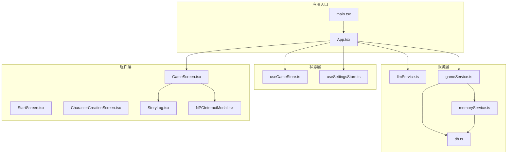
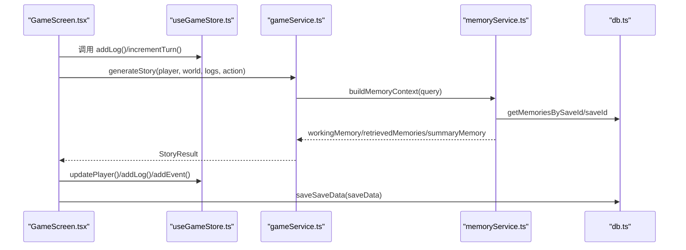
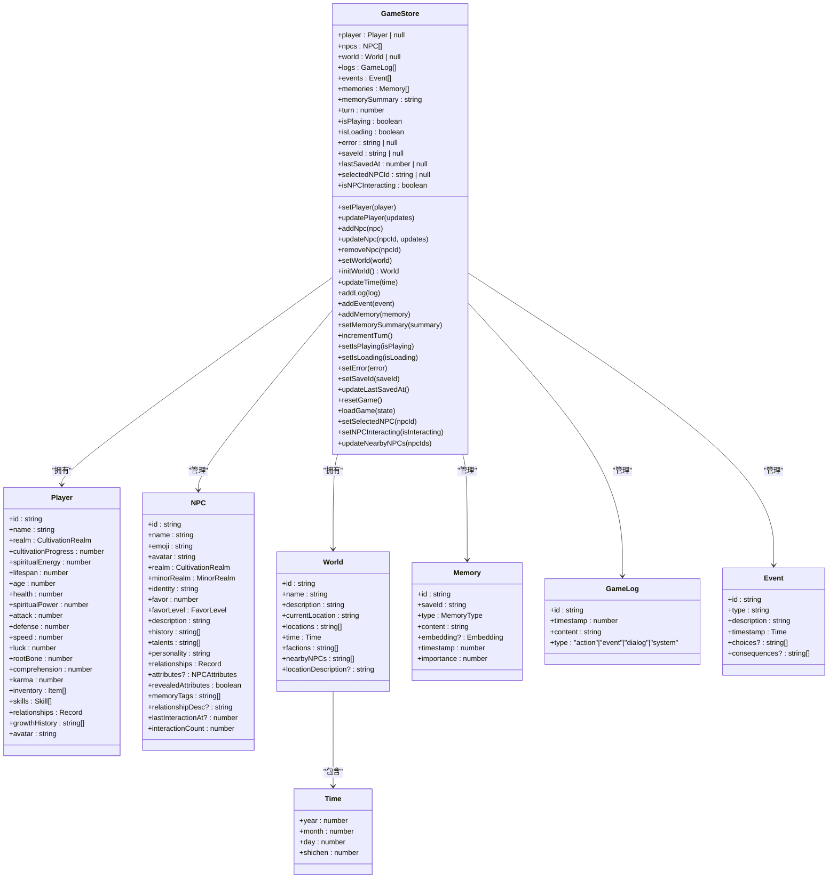
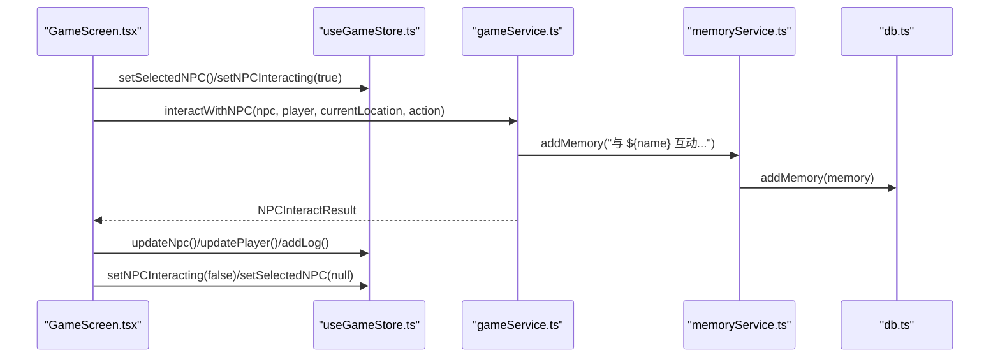
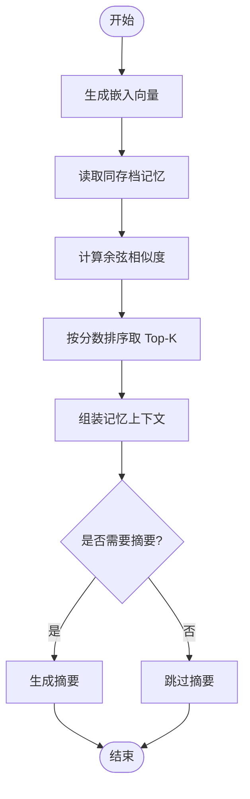
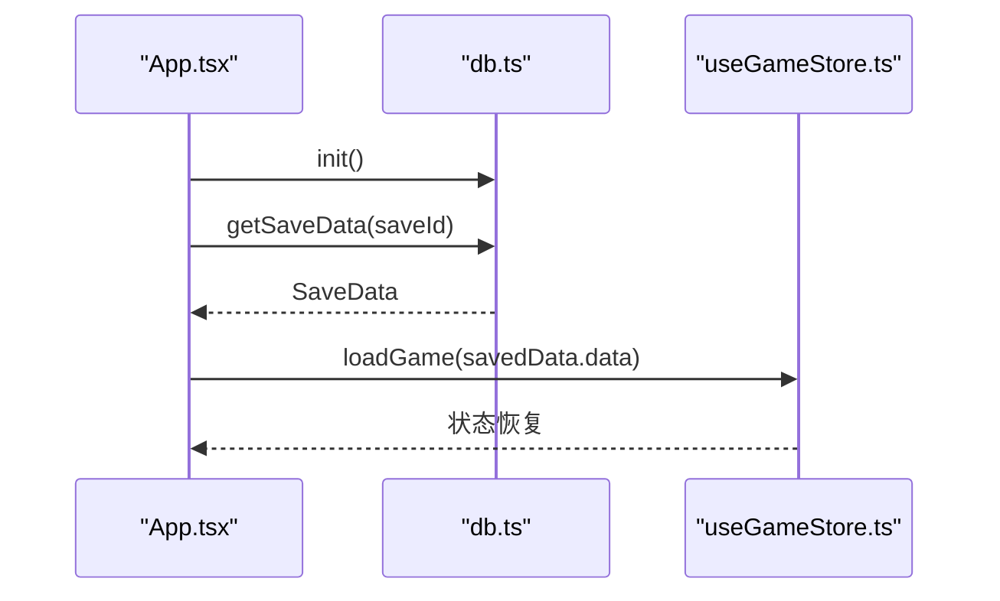
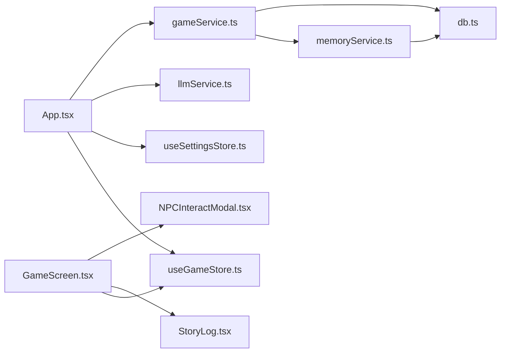

# 游戏状态管理

<cite>
**本文引用的文件**
- [useGameStore.ts](file://src/stores/useGameStore.ts)
- [game.ts](file://src/types/game.ts)
- [memoryService.ts](file://src/services/memoryService.ts)
- [db.ts](file://src/services/db.ts)
- [gameService.ts](file://src/services/gameService.ts)
- [App.tsx](file://src/App.tsx)
- [GameScreen.tsx](file://src/components/GameScreen.tsx)
- [NPCInteractModal.tsx](file://src/components/NPCInteractModal.tsx)
- [StoryLog.tsx](file://src/components/StoryLog.tsx)
- [useSettingsStore.ts](file://src/stores/useSettingsStore.ts)
- [llmService.ts](file://src/services/llmService.ts)
- [main.tsx](file://src/main.tsx)
- [package.json](file://package.json)
</cite>

## 目录
1. [简介](#简介)
2. [项目结构](#项目结构)
3. [核心组件](#核心组件)
4. [架构总览](#架构总览)
5. [详细组件分析](#详细组件分析)
6. [依赖分析](#依赖分析)
7. [性能考虑](#性能考虑)
8. [故障排查指南](#故障排查指南)
9. [结论](#结论)
10. [附录](#附录)

## 简介
本文件系统性阐述基于 Zustand 的游戏状态管理实现，围绕 useGameStore 设计与实现进行深入解析。内容覆盖玩家状态、NPC 管理、世界状态、日志事件、记忆系统、时间管理、状态持久化、状态订阅与性能优化、状态重置与加载、NPC 交互流程与最佳实践等。文档同时提供可视化架构图与流程图，帮助开发者快速理解与高效使用。

## 项目结构
本项目采用按功能模块划分的目录组织方式，核心状态管理位于 stores 目录，业务服务位于 services 目录，UI 组件位于 components 目录，类型定义集中在 types 目录。应用入口在 main.tsx，根组件 App.tsx 负责协调状态、服务与 UI。

图表来源
- [main.tsx](file://src/main.tsx#L1-L11)
- [App.tsx](file://src/App.tsx#L1-L588)
- [useGameStore.ts](file://src/stores/useGameStore.ts#L1-L226)
- [useSettingsStore.ts](file://src/stores/useSettingsStore.ts#L1-L46)
- [llmService.ts](file://src/services/llmService.ts#L1-L101)
- [gameService.ts](file://src/services/gameService.ts#L1-L541)
- [memoryService.ts](file://src/services/memoryService.ts#L1-L224)
- [db.ts](file://src/services/db.ts#L1-L236)
- [GameScreen.tsx](file://src/components/GameScreen.tsx#L1-L172)
- [StoryLog.tsx](file://src/components/StoryLog.tsx#L1-L172)
- [NPCInteractModal.tsx](file://src/components/NPCInteractModal.tsx#L1-L223)

章节来源
- [main.tsx](file://src/main.tsx#L1-L11)
- [App.tsx](file://src/App.tsx#L1-L588)

## 核心组件
本节聚焦 useGameStore 的设计与实现要点，包括状态结构、初始化、更新方法、持久化配置、NPC 交互状态管理、时间管理与订阅机制。

- 状态结构与职责
  - 玩家状态：player，包含基础属性、修为、寿命、背包、技能、关系等。
  - NPC 管理：npcs 数组，支持增删改查与附近 NPC 列表维护。
  - 世界状态：world，包含位置、时间、阵营、附近 NPC ID 列表等。
  - 日志事件：logs、events，分别记录剧情日志与系统事件。
  - 记忆系统：memories、memorySummary，支持嵌入检索与摘要生成。
  - 时间管理：turn、isPlaying、isLoading、error、saveId、lastSavedAt。
  - NPC 交互状态：selectedNPCId、isNPCInteracting。

- 状态初始化
  - initialState 定义了所有字段的初始值，确保首次渲染与重置时的一致性。
  - initWorld 方法生成默认世界，包含名称、描述、位置、时间、阵营与附近 NPC 列表。

- 状态更新方法
  - setPlayer/updatePlayer：设置或增量更新玩家状态。
  - addNpc/updateNpc/removeNpc：管理 NPC 列表。
  - setWorld/initWorld/updateTime：管理世界与时间。
  - addLog/addEvent/addMemory/setMemorySummary：管理日志、事件与记忆。
  - incrementTurn/setIsPlaying/setIsLoading/setError：管理游戏循环与状态标志。
  - setSaveId/updateLastSavedAt/resetGame/loadGame：管理存档与加载。
  - setSelectedNPC/setNPCInteracting/updateNearbyNPCs：管理 NPC 交互状态。

- 状态持久化配置
  - 使用 persist 中间件，存储键名为 xiuxian-game-storage，使用 localStorage。
  - partialize 仅持久化必要字段，减少存储体积与复杂度。

- NPC 交互状态管理
  - selectedNPCId 与 isNPCInteracting 控制交互模态框的打开与关闭。
  - updateNearbyNPCs 维护当前区域的 NPC ID 列表，配合 getNearbyNPCs 过滤附近 NPC。

- 订阅机制与性能优化
  - Zustand 的 set 与 selector 订阅，组件通过 useGameStore(selector) 订阅所需字段，避免全局重渲染。
  - useMemo 用于稳定 LLM 配置，避免重复创建 LLMService 实例导致的性能浪费。
  - 自动存档定时器与手动触发结合，降低频繁写入带来的性能压力。

章节来源
- [useGameStore.ts](file://src/stores/useGameStore.ts#L1-L226)
- [game.ts](file://src/types/game.ts#L1-L319)
- [App.tsx](file://src/App.tsx#L67-L122)

## 架构总览
useGameStore 作为 Zustand 存储，向上为 UI 组件提供状态与动作，向下与服务层协作完成剧情生成、NPC 交互、记忆检索与存档管理。服务层通过 GameService 与 MemoryService 协作，底层依赖 IndexedDB 实现持久化。

图表来源
- [GameScreen.tsx](file://src/components/GameScreen.tsx#L1-L172)
- [useGameStore.ts](file://src/stores/useGameStore.ts#L1-L226)
- [gameService.ts](file://src/services/gameService.ts#L283-L391)
- [memoryService.ts](file://src/services/memoryService.ts#L175-L188)
- [db.ts](file://src/services/db.ts#L134-L141)

## 详细组件分析

### useGameStore 状态模型与类图
useGameStore 通过 create 与 persist 中间件构建，内部包含状态字段与动作方法。其核心类图如下所示：

图表来源
- [useGameStore.ts](file://src/stores/useGameStore.ts#L13-L55)
- [game.ts](file://src/types/game.ts#L110-L251)

章节来源
- [useGameStore.ts](file://src/stores/useGameStore.ts#L1-L226)
- [game.ts](file://src/types/game.ts#L1-L319)

### NPC 交互流程与序列图
NPC 交互由 GameScreen 触发，调用 GameService.interactWithNPC，返回 NPCInteractResult，随后更新 NPC 与玩家状态，并记录日志与记忆。

图表来源
- [GameScreen.tsx](file://src/components/GameScreen.tsx#L162-L169)
- [NPCInteractModal.tsx](file://src/components/NPCInteractModal.tsx#L37-L54)
- [gameService.ts](file://src/services/gameService.ts#L415-L469)
- [memoryService.ts](file://src/services/memoryService.ts#L440-L467)
- [db.ts](file://src/services/db.ts#L161-L168)

章节来源
- [App.tsx](file://src/App.tsx#L470-L548)
- [NPCInteractModal.tsx](file://src/components/NPCInteractModal.tsx#L1-L223)

### 记忆系统算法流程图
记忆系统包含嵌入生成、相似度计算、检索与摘要生成等步骤，形成 RAG 流程。

图表来源
- [memoryService.ts](file://src/services/memoryService.ts#L100-L188)
- [db.ts](file://src/services/db.ts#L175-L189)

章节来源
- [memoryService.ts](file://src/services/memoryService.ts#L1-L224)
- [db.ts](file://src/services/db.ts#L1-L236)

### 状态持久化与加载流程
应用启动时初始化 IndexedDB，游戏状态通过 persist 中间件持久化到 localStorage；继续游戏时从 IndexedDB 加载完整状态，再通过 loadGame 合并到 Zustand。

图表来源
- [App.tsx](file://src/App.tsx#L62-L65)
- [App.tsx](file://src/App.tsx#L131-L161)
- [db.ts](file://src/services/db.ts#L143-L150)
- [useGameStore.ts](file://src/stores/useGameStore.ts#L189-L189)

章节来源
- [App.tsx](file://src/App.tsx#L62-L161)
- [db.ts](file://src/services/db.ts#L1-L236)
- [useGameStore.ts](file://src/stores/useGameStore.ts#L207-L224)

## 依赖分析
- 外部依赖
  - Zustand：状态管理核心，提供 create 与 persist 中间件。
  - @xenova/transformers：用于生成嵌入向量的轻量级模型。
  - IndexedDB：本地持久化存储，替代传统 localStorage 的复杂对象存储。
  - TailwindCSS、Framer Motion、Lucide 等 UI 与动画库。

- 内部依赖关系
  - App.tsx 依赖 useGameStore、useSettingsStore、gameService、llmService、db。
  - GameScreen.tsx 依赖 useGameStore 与 StoryLog.tsx、NPCInteractModal.tsx。
  - gameService.ts 依赖 llmService、memoryService、db。
  - memoryService.ts 依赖 db、llmService、@xenova/transformers。

图表来源
- [App.tsx](file://src/App.tsx#L1-L588)
- [useGameStore.ts](file://src/stores/useGameStore.ts#L1-L226)
- [useSettingsStore.ts](file://src/stores/useSettingsStore.ts#L1-L46)
- [llmService.ts](file://src/services/llmService.ts#L1-L101)
- [gameService.ts](file://src/services/gameService.ts#L1-L541)
- [memoryService.ts](file://src/services/memoryService.ts#L1-L224)
- [db.ts](file://src/services/db.ts#L1-L236)
- [GameScreen.tsx](file://src/components/GameScreen.tsx#L1-L172)
- [StoryLog.tsx](file://src/components/StoryLog.tsx#L1-L172)
- [NPCInteractModal.tsx](file://src/components/NPCInteractModal.tsx#L1-L223)

章节来源
- [package.json](file://package.json#L15-L36)
- [App.tsx](file://src/App.tsx#L1-L588)

## 性能考虑
- 状态订阅最小化
  - 使用 selector 订阅特定字段，避免不必要的组件重渲染。
  - 将大型数组（如 npcs、memories）拆分为多个 store 或使用分页策略。

- 记忆系统优化
  - 嵌入模型懒加载，失败时降级为简单哈希向量。
  - 采用工作记忆与摘要机制，限制检索规模，提升响应速度。

- 自动存档策略
  - 每 30 秒自动保存一次，同时在每次行动后触发保存，平衡实时性与性能。
  - 仅持久化必要字段，减少存储体积。

- LLM 调用稳定性
  - LLMService 带重试与延迟退避，避免瞬时错误影响体验。
  - 使用 useMemo 缓存 LLMService 实例，避免频繁重建。

- UI 动画与滚动
  - StoryLog 使用 requestAnimationFrame 控制滚动，避免阻塞主线程。
  - Framer Motion 的初始动画参数经过调优，保证流畅体验。

[本节为通用性能指导，无需特定文件来源]

## 故障排查指南
- LLM 调用失败
  - 现象：生成剧情或 NPC 交互时报错。
  - 排查：检查 LLM 配置（baseURL、apiKey、model），确认网络连通性与权限。
  - 解决：在设置中更新配置，或在网络可用时重试。

- IndexedDB 初始化失败
  - 现象：继续游戏时报错或无法加载存档。
  - 排查：检查浏览器隐私模式或禁用 IndexedDB 的情况。
  - 解决：更换浏览器或启用 IndexedDB，清理旧存档后重试。

- 记忆检索异常
  - 现象：检索不到相关记忆或摘要生成失败。
  - 排查：确认嵌入模型加载状态与备用方案是否生效。
  - 解决：等待模型加载或检查网络；必要时清理旧记忆。

- NPC 交互无效
  - 现象：点击交互按钮无响应或状态未更新。
  - 排查：确认 selectedNPCId 与 isNPCInteracting 状态正确设置。
  - 解决：重新选择 NPC，或检查 handleNPCInteract 的调用链。

章节来源
- [llmService.ts](file://src/services/llmService.ts#L37-L55)
- [db.ts](file://src/services/db.ts#L39-L72)
- [memoryService.ts](file://src/services/memoryService.ts#L27-L37)
- [App.tsx](file://src/App.tsx#L470-L548)

## 结论
useGameStore 以 Zustand 为核心，结合 persist 中间件与 IndexedDB，实现了高性能、可扩展的游戏状态管理。通过清晰的状态模型、完善的动作方法、智能的记忆检索与摘要生成、稳定的 LLM 集成以及精细的 UI 协作，系统在保持良好用户体验的同时，具备良好的可维护性与扩展性。建议在后续迭代中引入更细粒度的状态拆分、缓存策略与监控埋点，进一步提升性能与可观测性。

[本节为总结性内容，无需特定文件来源]

## 附录

### 实际使用示例（路径指引）
- 初始化世界与 NPC
  - 在角色创建完成后，调用 initWorld 与 generateLocationNPCs，并通过 updateNearbyNPCs 维护附近 NPC 列表。
  - 参考路径：[App.tsx](file://src/App.tsx#L177-L207)

- 处理玩家行动
  - 在 GameScreen 中提交 action，调用 generateStory，应用返回的 statChanges、timePassed、breakthrough 等，更新玩家状态并记录日志。
  - 参考路径：[App.tsx](file://src/App.tsx#L239-L468)

- NPC 交互
  - 打开 NPCInteractModal，调用 interactWithNPC，根据返回结果更新 NPC 与玩家状态。
  - 参考路径：[App.tsx](file://src/App.tsx#L470-L548)

- 记忆检索与摘要
  - 在生成剧情前调用 buildMemoryContext，根据检索结果与摘要增强上下文。
  - 参考路径：[gameService.ts](file://src/services/gameService.ts#L283-L391)

### 最佳实践
- 使用 selector 订阅最小化状态，避免全量重渲染。
- 将大型数组拆分为多个 store 或分页加载，降低渲染压力。
- 对 LLM 调用进行重试与降级策略，保证稳定性。
- 定期清理旧记忆，维持检索性能与存储空间。
- 在关键节点（如突破、重大事件）记录日志与记忆，便于回溯与分析。

[本节为通用最佳实践，无需特定文件来源]