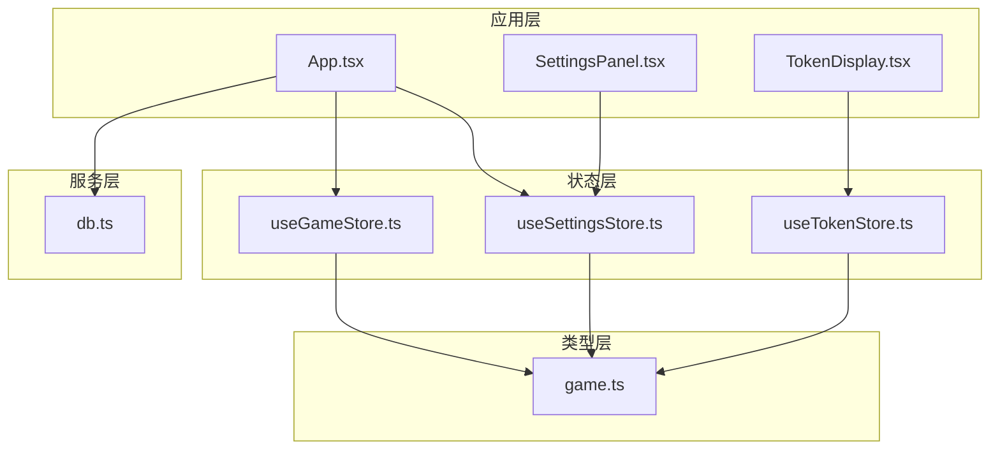
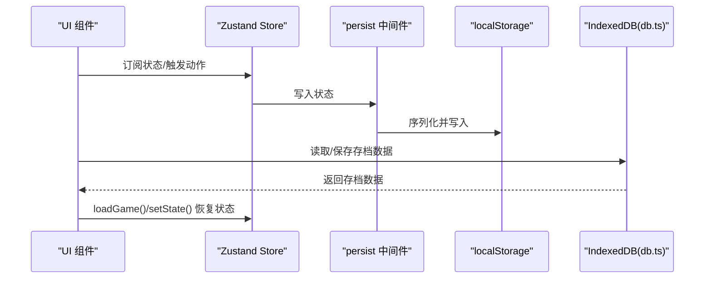
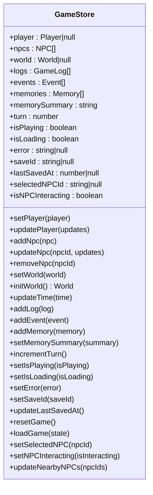
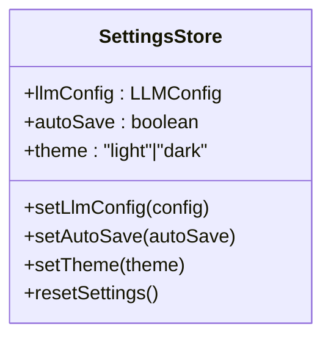
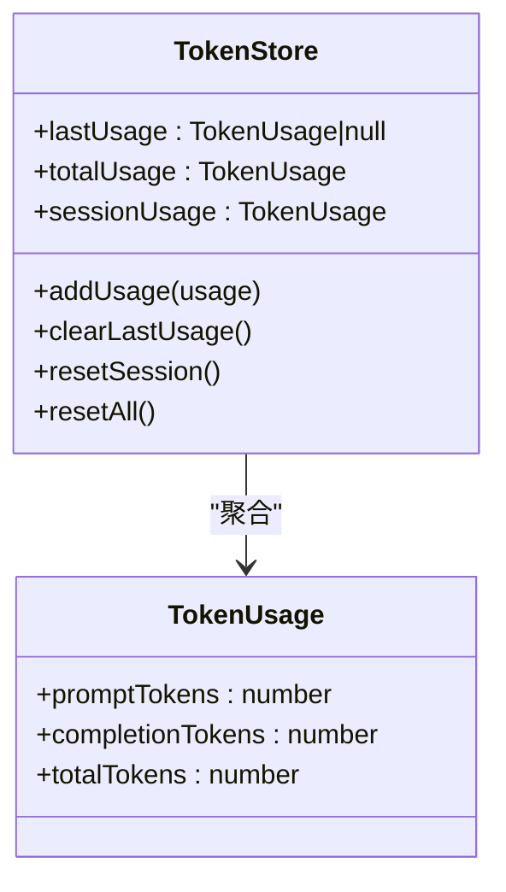
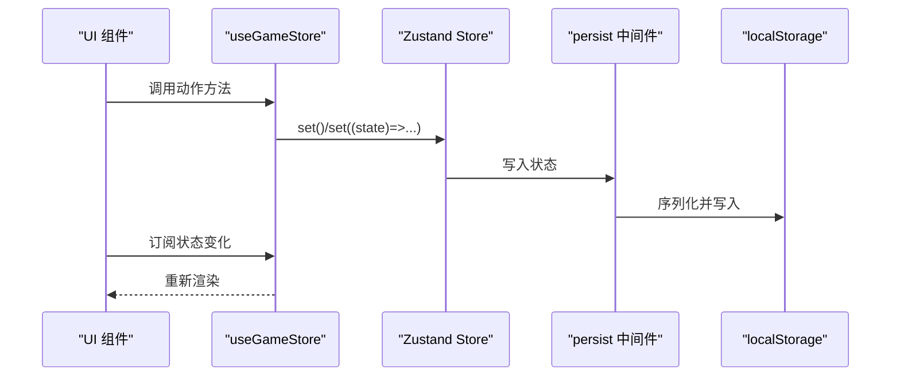
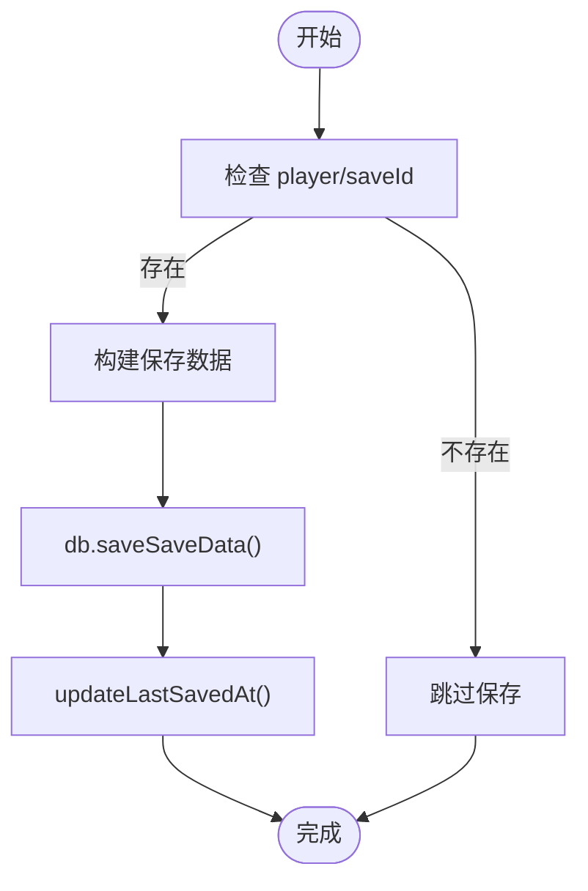
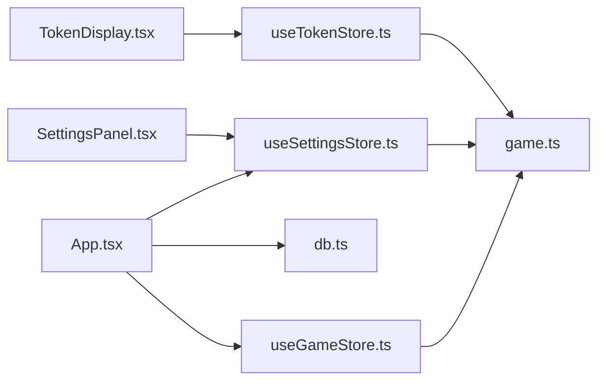

# 状态管理

<cite>
**本文引用的文件**
- [useGameStore.ts](file://src/stores/useGameStore.ts)
- [useSettingsStore.ts](file://src/stores/useSettingsStore.ts)
- [useTokenStore.ts](file://src/stores/useTokenStore.ts)
- [game.ts](file://src/types/game.ts)
- [App.tsx](file://src/App.tsx)
- [SettingsPanel.tsx](file://src/components/SettingsPanel.tsx)
- [TokenDisplay.tsx](file://src/components/TokenDisplay.tsx)
- [db.ts](file://src/services/db.ts)
- [main.tsx](file://src/main.tsx)
</cite>

## 目录
1. [简介](#简介)
2. [项目结构](#项目结构)
3. [核心组件](#核心组件)
4. [架构总览](#架构总览)
5. [详细组件分析](#详细组件分析)
6. [依赖分析](#依赖分析)
7. [性能考虑](#性能考虑)
8. [故障排查指南](#故障排查指南)
9. [结论](#结论)
10. [附录](#附录)

## 简介
本文件系统性阐述基于 Zustand 的状态管理方案，覆盖三大 Store：useGameStore（全局游戏状态）、useSettingsStore（设置状态）、useTokenStore（令牌用量统计）。文档重点说明：
- 设计模式与实现细节
- 全局游戏状态管理、设置状态管理、令牌状态管理的具体职责与边界
- 状态订阅机制、状态更新策略、副作用处理
- 状态持久化配置、存储策略、数据序列化
- 最佳实践、性能优化技巧、常见问题解决方案
- 使用示例与集成指南

## 项目结构
状态管理相关代码集中在 src/stores 目录，配合 src/types 定义类型，src/services 提供 IndexedDB 存档能力，UI 组件通过 hooks 订阅状态。

图表来源
- [useGameStore.ts](file://src/stores/useGameStore.ts#L1-L226)
- [useSettingsStore.ts](file://src/stores/useSettingsStore.ts#L1-L46)
- [useTokenStore.ts](file://src/stores/useTokenStore.ts#L1-L73)
- [game.ts](file://src/types/game.ts#L1-L319)
- [db.ts](file://src/services/db.ts#L1-L236)
- [App.tsx](file://src/App.tsx#L1-L588)
- [SettingsPanel.tsx](file://src/components/SettingsPanel.tsx#L1-L160)
- [TokenDisplay.tsx](file://src/components/TokenDisplay.tsx#L1-L172)

章节来源
- [useGameStore.ts](file://src/stores/useGameStore.ts#L1-L226)
- [useSettingsStore.ts](file://src/stores/useSettingsStore.ts#L1-L46)
- [useTokenStore.ts](file://src/stores/useTokenStore.ts#L1-L73)
- [game.ts](file://src/types/game.ts#L1-L319)
- [db.ts](file://src/services/db.ts#L1-L236)
- [App.tsx](file://src/App.tsx#L1-L588)
- [SettingsPanel.tsx](file://src/components/SettingsPanel.tsx#L1-L160)
- [TokenDisplay.tsx](file://src/components/TokenDisplay.tsx#L1-L172)

## 核心组件
- useGameStore：集中管理玩家、NPC、世界、日志、事件、记忆、回合数、加载/播放状态、错误、存档元数据等，提供 NPC 交互状态与工具函数。
- useSettingsStore：管理 LLM 配置、自动存档开关、主题等设置，并持久化到 localStorage。
- useTokenStore：记录单次调用、会话累计、累计 Token 使用量，支持清空会话与重置全部统计。

章节来源
- [useGameStore.ts](file://src/stores/useGameStore.ts#L13-L55)
- [useSettingsStore.ts](file://src/stores/useSettingsStore.ts#L5-L10)
- [useTokenStore.ts](file://src/stores/useTokenStore.ts#L10-L23)

## 架构总览
Zustand Store 通过 persist 中间件实现本地持久化；App.tsx 作为顶层容器协调 Store 与服务层（LLM、IndexedDB），UI 组件通过 hooks 订阅状态并触发动作。

图表来源
- [useGameStore.ts](file://src/stores/useGameStore.ts#L207-L224)
- [useSettingsStore.ts](file://src/stores/useSettingsStore.ts#L24-L44)
- [useTokenStore.ts](file://src/stores/useTokenStore.ts#L31-L71)
- [db.ts](file://src/services/db.ts#L134-L150)
- [App.tsx](file://src/App.tsx#L75-L122)

## 详细组件分析

### useGameStore：全局游戏状态管理
- 职责边界
  - 管理玩家、NPC、世界、日志、事件、记忆、记忆摘要、回合数、播放/加载状态、错误、存档元数据。
  - 提供 NPC 交互状态（选中 NPC、是否交互中）与工具函数 getNearbyNPCs。
- 状态结构与复杂度
  - 状态字段丰富，涉及对象与数组，典型操作如更新玩家属性为 O(n)（浅拷贝合并），添加/移除 NPC 为 O(n)。
  - 时间推进、日志追加、记忆追加均为 O(n)。
- 更新策略
  - 使用 set 与 set((state)=>…) 形式进行不可变更新，确保 React 订阅正确触发。
  - initWorld 生成固定结构的世界对象；updateTime 安全合并时间字段。
- 副作用处理
  - App.tsx 中通过定时器与手动触发实现自动存档；loadGame 用于恢复完整存档。
- 持久化配置
  - 使用 persist + localStorage，自定义 partialize 仅持久化必要字段，避免冗余。
- 数据序列化
  - 通过 createJSONStorage 进行 JSON 序列化/反序列化，键名为“xiuxian-game-storage”。

图表来源
- [useGameStore.ts](file://src/stores/useGameStore.ts#L13-L55)

章节来源
- [useGameStore.ts](file://src/stores/useGameStore.ts#L61-L77)
- [useGameStore.ts](file://src/stores/useGameStore.ts#L84-L206)
- [useGameStore.ts](file://src/stores/useGameStore.ts#L207-L224)
- [App.tsx](file://src/App.tsx#L75-L122)

### useSettingsStore：设置状态管理
- 职责边界
  - 管理 LLM 配置（baseURL、apiKey、model）、自动存档开关、主题。
- 更新策略
  - 通过 setLlmConfig 对 LLM 配置进行部分合并更新。
- 持久化配置
  - 使用 persist + localStorage，键名为“xiuxian-settings”。

图表来源
- [useSettingsStore.ts](file://src/stores/useSettingsStore.ts#L5-L10)

章节来源
- [useSettingsStore.ts](file://src/stores/useSettingsStore.ts#L12-L22)
- [useSettingsStore.ts](file://src/stores/useSettingsStore.ts#L24-L44)
- [SettingsPanel.tsx](file://src/components/SettingsPanel.tsx#L16-L55)

### useTokenStore：令牌状态管理
- 职责边界
  - 记录单次调用（lastUsage）、会话累计（sessionUsage）、累计（totalUsage）三类 Token 统计。
- 更新策略
  - addUsage 将新增用量累加到三处统计；clearLastUsage 清空最近一次；resetSession 重置会话；resetAll 清空全部。
- 持久化配置
  - 使用 persist + localStorage，partialize 仅持久化 totalUsage，避免重复统计被重置。

图表来源
- [useTokenStore.ts](file://src/stores/useTokenStore.ts#L10-L23)

章节来源
- [useTokenStore.ts](file://src/stores/useTokenStore.ts#L25-L29)
- [useTokenStore.ts](file://src/stores/useTokenStore.ts#L31-L71)
- [TokenDisplay.tsx](file://src/components/TokenDisplay.tsx#L10-L32)

### 状态订阅机制与更新流程
- 订阅机制
  - UI 组件通过 hooks 订阅 Store，当状态变更时触发重渲染。
- 更新流程
  - UI 动作调用 Store 方法，Store 通过 set/set((state)=>…) 更新状态，React 订阅者收到通知。
- 副作用处理
  - App.tsx 中通过定时器与手动触发实现自动存档；loadGame 用于恢复完整存档。

图表来源
- [useGameStore.ts](file://src/stores/useGameStore.ts#L84-L206)
- [useSettingsStore.ts](file://src/stores/useSettingsStore.ts#L24-L44)
- [useTokenStore.ts](file://src/stores/useTokenStore.ts#L31-L71)

章节来源
- [App.tsx](file://src/App.tsx#L30-L51)
- [App.tsx](file://src/App.tsx#L75-L122)

### 状态持久化与存储策略
- localStorage
  - useGameStore：持久化必要字段，避免冗余；键名“xiuxian-game-storage”。
  - useSettingsStore：持久化全部设置；键名“xiuxian-settings”。
  - useTokenStore：仅持久化 totalUsage；键名“xiuxian-token-storage”。
- IndexedDB
  - db.ts 提供存档元数据与存档数据的增删改查，支持按 saveId 查询与清理。
  - App.tsx 在自动存档与继续游戏时使用 db 保存/读取完整 GameState。

图表来源
- [App.tsx](file://src/App.tsx#L75-L105)
- [db.ts](file://src/services/db.ts#L134-L141)

章节来源
- [useGameStore.ts](file://src/stores/useGameStore.ts#L207-L224)
- [useSettingsStore.ts](file://src/stores/useSettingsStore.ts#L40-L43)
- [useTokenStore.ts](file://src/stores/useTokenStore.ts#L64-L70)
- [db.ts](file://src/services/db.ts#L1-L236)
- [App.tsx](file://src/App.tsx#L75-L122)

### 数据结构与类型约束
- 游戏状态类型定义集中在 game.ts，涵盖 Player、NPC、World、GameLog、Event、Memory、Time、LLMConfig、GameSettings 等。
- Store 与类型强耦合，确保状态结构与业务模型一致。

章节来源
- [game.ts](file://src/types/game.ts#L1-L319)

## 依赖分析
- 组件依赖
  - App.tsx 依赖 useGameStore、useSettingsStore，负责自动存档与恢复。
  - SettingsPanel.tsx 依赖 useSettingsStore，提供 LLM 配置与主题设置。
  - TokenDisplay.tsx 依赖 useTokenStore，展示 Token 统计。
- 服务依赖
  - db.ts 为存档提供 IndexedDB 能力，App.tsx 在自动存档与继续游戏时使用。
- 类型依赖
  - game.ts 为 Store 与服务提供统一的数据契约。

图表来源
- [App.tsx](file://src/App.tsx#L1-L588)
- [SettingsPanel.tsx](file://src/components/SettingsPanel.tsx#L1-L160)
- [TokenDisplay.tsx](file://src/components/TokenDisplay.tsx#L1-L172)
- [useGameStore.ts](file://src/stores/useGameStore.ts#L1-L226)
- [useSettingsStore.ts](file://src/stores/useSettingsStore.ts#L1-L46)
- [useTokenStore.ts](file://src/stores/useTokenStore.ts#L1-L73)
- [game.ts](file://src/types/game.ts#L1-L319)
- [db.ts](file://src/services/db.ts#L1-L236)

章节来源
- [App.tsx](file://src/App.tsx#L1-L588)
- [SettingsPanel.tsx](file://src/components/SettingsPanel.tsx#L1-L160)
- [TokenDisplay.tsx](file://src/components/TokenDisplay.tsx#L1-L172)
- [useGameStore.ts](file://src/stores/useGameStore.ts#L1-L226)
- [useSettingsStore.ts](file://src/stores/useSettingsStore.ts#L1-L46)
- [useTokenStore.ts](file://src/stores/useTokenStore.ts#L1-L73)
- [game.ts](file://src/types/game.ts#L1-L319)
- [db.ts](file://src/services/db.ts#L1-L236)

## 性能考虑
- 状态粒度与订阅范围
  - 将大型数组（如 npcs、logs、memories）拆分到不同 Store 或按需裁剪订阅，减少不必要的重渲染。
- 更新策略
  - 优先使用 set((state)=>...) 进行不可变更新，避免浅拷贝遗漏导致的渲染问题。
- 持久化策略
  - useGameStore 的 partialize 仅持久化必要字段，降低 localStorage 写入体积。
  - useTokenStore 仅持久化 totalUsage，避免会话统计被重置。
- 异步副作用
  - 自动存档使用定时器，注意清理；在高频动作场景下可合并存档请求。
- UI 优化
  - 使用 React.memo、useMemo、useCallback 缓解高频渲染压力（已在 App.tsx 中体现）。

[本节为通用指导，不直接分析具体文件]

## 故障排查指南
- 持久化异常
  - 现象：设置/存档未生效或丢失。
  - 排查：确认 localStorage 键名与持久化配置一致；检查 persist 的 storage 与 partialize。
  - 参考
    - [useGameStore.ts](file://src/stores/useGameStore.ts#L207-L224)
    - [useSettingsStore.ts](file://src/stores/useSettingsStore.ts#L40-L43)
    - [useTokenStore.ts](file://src/stores/useTokenStore.ts#L64-L70)
- 自动存档失败
  - 现象：定时存档报错或无效果。
  - 排查：检查 player/saveId 是否存在；确认 db.saveSaveData 调用链路；查看 updateLastSavedAt 是否执行。
  - 参考
    - [App.tsx](file://src/App.tsx#L75-L105)
    - [db.ts](file://src/services/db.ts#L134-L141)
- 继续游戏加载失败
  - 现象：继续游戏时报错或状态未恢复。
  - 排查：确认 saveId 对应的存档数据存在；检查 useGameStore.getState().loadGame 的调用。
  - 参考
    - [App.tsx](file://src/App.tsx#L131-L161)
- Token 统计异常
  - 现象：会话统计被重置或累计不正确。
  - 排查：确认 useTokenStore 的 partialize 仅持久化 totalUsage；检查 addUsage 累加逻辑。
  - 参考
    - [useTokenStore.ts](file://src/stores/useTokenStore.ts#L38-L51)
    - [useTokenStore.ts](file://src/stores/useTokenStore.ts#L64-L70)

章节来源
- [useGameStore.ts](file://src/stores/useGameStore.ts#L207-L224)
- [useSettingsStore.ts](file://src/stores/useSettingsStore.ts#L40-L43)
- [useTokenStore.ts](file://src/stores/useTokenStore.ts#L64-L70)
- [App.tsx](file://src/App.tsx#L75-L161)
- [db.ts](file://src/services/db.ts#L134-L141)

## 结论
本项目采用 Zustand + persist 的轻量状态管理方案，清晰划分了全局游戏状态、设置状态与令牌统计三个 Store，结合 App.tsx 的自动存档与 UI 组件的订阅机制，实现了稳定的修仙 Roguelike 状态流转。通过合理的持久化策略与类型约束，保证了状态一致性与可维护性。建议在后续迭代中进一步细化状态粒度与订阅范围，以提升大规模场景下的性能表现。

[本节为总结性内容，不直接分析具体文件]

## 附录

### 使用示例与集成指南
- 在组件中订阅状态
  - 示例路径：[App.tsx](file://src/App.tsx#L30-L51)
- 修改设置
  - 示例路径：[SettingsPanel.tsx](file://src/components/SettingsPanel.tsx#L16-L55)
- 查看 Token 统计
  - 示例路径：[TokenDisplay.tsx](file://src/components/TokenDisplay.tsx#L10-L32)
- 自动存档集成
  - 示例路径：[App.tsx](file://src/App.tsx#L75-L122)
- 恢复存档
  - 示例路径：[App.tsx](file://src/App.tsx#L131-L161)

### 最佳实践清单
- 使用 set((state)=>...) 进行不可变更新，避免浅拷贝遗漏。
- 对大型数组状态进行订阅裁剪，减少重渲染。
- 仅持久化必要字段，控制 localStorage 体积。
- 在高频动作场景下合并副作用请求，避免频繁 IO。
- 为 Store 方法命名语义化，保持职责单一。

[本节为通用指导，不直接分析具体文件]