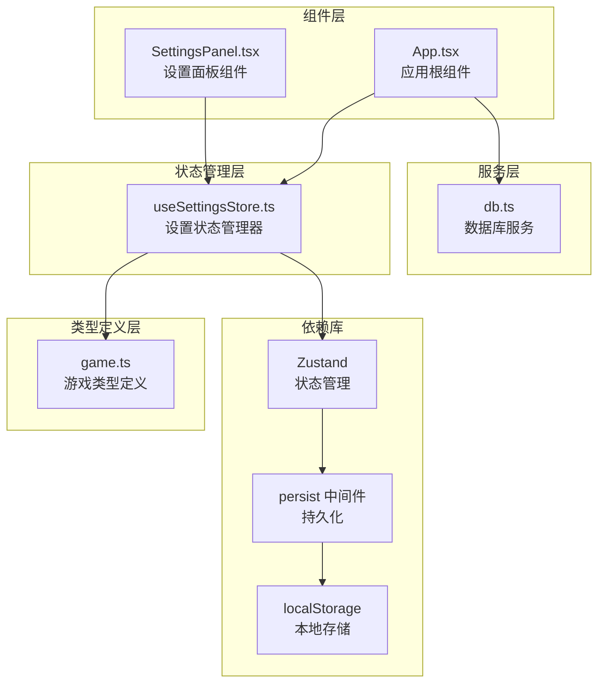
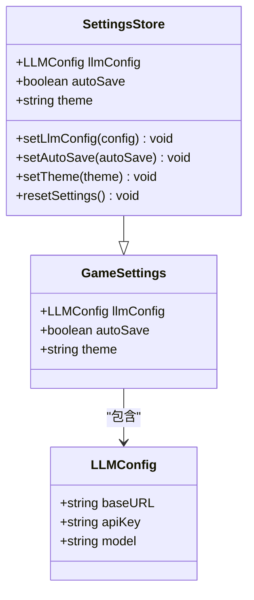
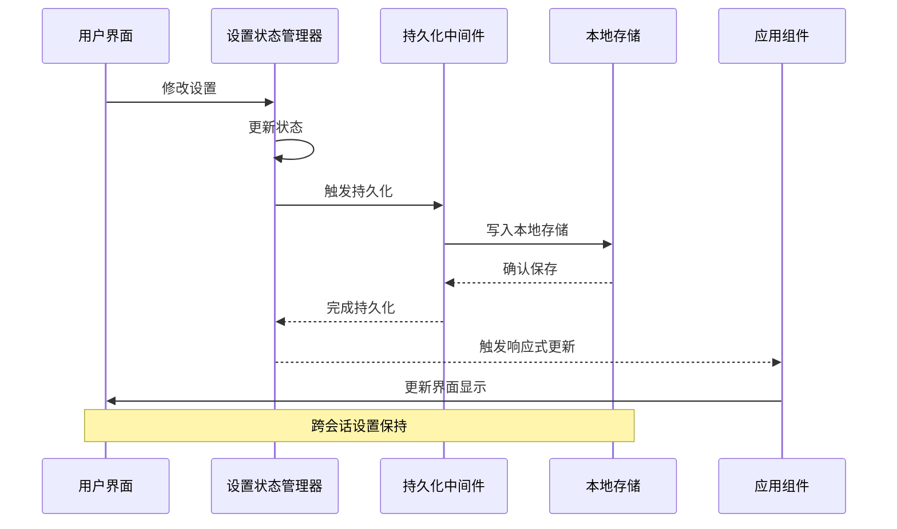
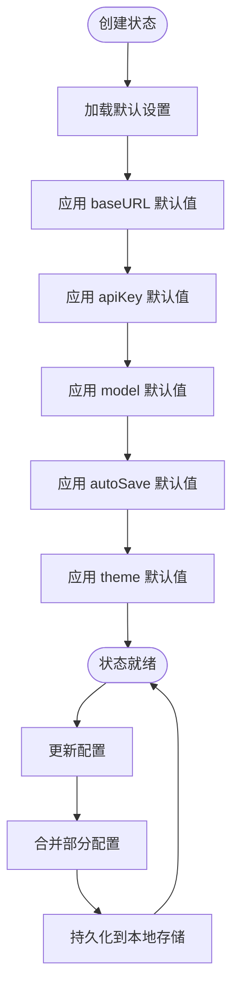
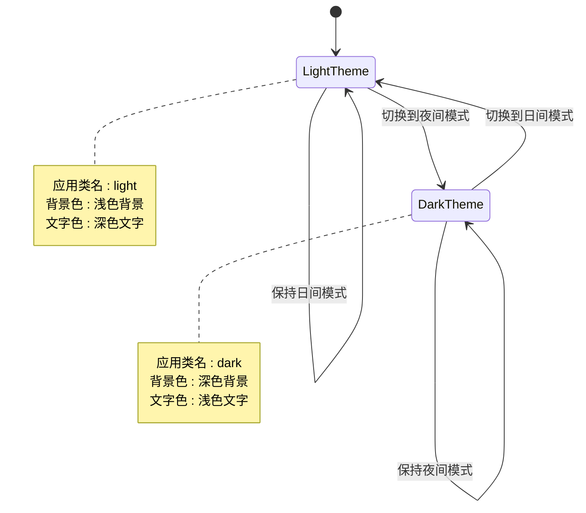
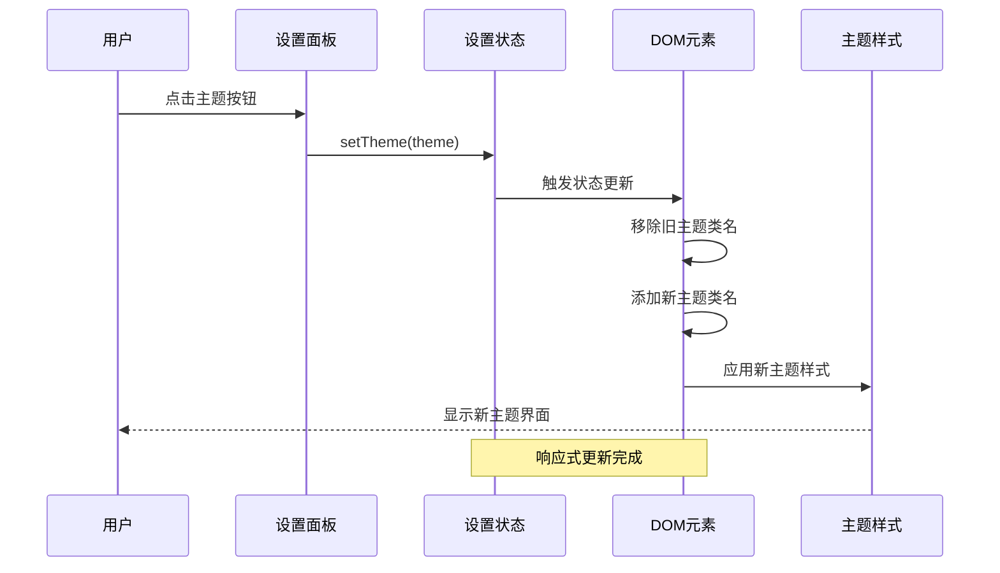
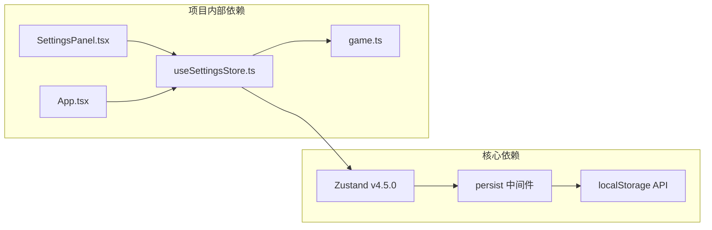

# 设置状态管理

<cite>
**本文引用的文件**
- [useSettingsStore.ts](file://src/stores/useSettingsStore.ts)
- [SettingsPanel.tsx](file://src/components/SettingsPanel.tsx)
- [App.tsx](file://src/App.tsx)
- [game.ts](file://src/types/game.ts)
- [db.ts](file://src/services/db.ts)
- [package.json](file://package.json)
</cite>

## 目录
1. [简介](#简介)
2. [项目结构](#项目结构)
3. [核心组件](#核心组件)
4. [架构概览](#架构概览)
5. [详细组件分析](#详细组件分析)
6. [依赖分析](#依赖分析)
7. [性能考虑](#性能考虑)
8. [故障排除指南](#故障排除指南)
9. [结论](#结论)
10. [附录](#附录)

## 简介

设置状态管理器 `useSettingsStore` 是本项目中负责管理游戏用户偏好的核心状态管理系统。该系统实现了完整的设置状态持久化、响应式更新和跨会话保持机制，支持音效开关、音乐播放、语言设置、主题配置等用户偏好设置。

本系统基于 Zustand 状态管理库构建，采用中间件模式实现本地存储持久化，确保用户设置在浏览器关闭后仍能保持不变。系统还集成了自动存档功能，为游戏进度提供可靠的持久化保障。

## 项目结构

项目采用模块化的组织方式，设置状态管理位于专门的 stores 目录下，与组件、服务和类型定义形成清晰的分层结构：

**图表来源**
- [useSettingsStore.ts](file://src/stores/useSettingsStore.ts#L1-L46)
- [SettingsPanel.tsx](file://src/components/SettingsPanel.tsx#L1-L160)
- [App.tsx](file://src/App.tsx#L1-L588)

**章节来源**
- [useSettingsStore.ts](file://src/stores/useSettingsStore.ts#L1-L46)
- [package.json](file://package.json#L15-L36)

## 核心组件

### 设置状态接口定义

设置状态管理器的核心接口定义了完整的设置项结构和操作方法：

**图表来源**
- [game.ts](file://src/types/game.ts#L253-L263)
- [useSettingsStore.ts](file://src/stores/useSettingsStore.ts#L5-L10)

### 默认设置配置

系统提供了完善的默认设置配置，确保首次使用时的良好体验：

| 设置项 | 默认值 | 说明 |
|--------|--------|------|
| LLMConfig.baseURL | https://api.openai.com/v1 | LLM API 基础 URL |
| LLMConfig.apiKey | 空字符串 | LLM API 密钥 |
| LLMConfig.model | gpt-4 | LLM 模型名称 |
| autoSave | true | 自动存档开关 |
| theme | 'light' | 界面主题 |

**章节来源**
- [useSettingsStore.ts](file://src/stores/useSettingsStore.ts#L12-L22)
- [game.ts](file://src/types/game.ts#L253-L263)

## 架构概览

设置状态管理器采用现代前端架构设计，结合了状态管理、持久化存储和响应式更新的完整解决方案：

**图表来源**
- [useSettingsStore.ts](file://src/stores/useSettingsStore.ts#L24-L45)
- [SettingsPanel.tsx](file://src/components/SettingsPanel.tsx#L16-L23)

## 详细组件分析

### 设置状态管理器实现

设置状态管理器是整个系统的核心，负责管理所有用户偏好设置的状态：

#### 状态初始化机制

系统在创建状态时自动应用默认配置，确保每个设置项都有明确的初始值：

**图表来源**
- [useSettingsStore.ts](file://src/stores/useSettingsStore.ts#L24-L39)

#### 设置更新机制

系统提供了多种设置更新方式，支持部分更新和完全替换：

| 更新方式 | 方法名 | 功能描述 | 参数类型 |
|----------|--------|----------|----------|
| LLM配置更新 | setLlmConfig | 更新部分LLM配置 | Partial<LLMConfig> |
| 自动存档开关 | setAutoSave | 切换自动存档功能 | boolean |
| 主题切换 | setTheme | 切换界面主题 | 'light' \| 'dark' |
| 设置重置 | resetSettings | 恢复默认设置 | void |

**章节来源**
- [useSettingsStore.ts](file://src/stores/useSettingsStore.ts#L29-L38)

### 设置面板组件集成

设置面板组件作为用户界面层，提供了直观的设置管理界面：

#### 主题切换功能

系统支持动态主题切换，通过监听设置状态变化实时更新界面主题：

**图表来源**
- [SettingsPanel.tsx](file://src/components/SettingsPanel.tsx#L63-L90)
- [App.tsx](file://src/App.tsx#L22-L28)

#### LLM配置管理

设置面板提供了完整的LLM配置管理界面，支持基础URL、API密钥和模型名称的配置：

| 配置项 | 输入类型 | 验证规则 | 默认值 |
|--------|----------|----------|--------|
| baseURL | 文本输入 | 必填且有效URL | https://api.openai.com/v1 |
| apiKey | 密码输入 | 必填且非空 | 空字符串 |
| model | 文本输入 | 必填且非空 | gpt-4 |

**章节来源**
- [SettingsPanel.tsx](file://src/components/SettingsPanel.tsx#L92-L114)
- [game.ts](file://src/types/game.ts#L253-L257)

### 响应式更新机制

系统实现了完整的响应式更新机制，确保设置变化能够实时反映在用户界面中：

#### 主题同步流程

**图表来源**
- [App.tsx](file://src/App.tsx#L22-L28)
- [SettingsPanel.tsx](file://src/components/SettingsPanel.tsx#L67-L88)

**章节来源**
- [App.tsx](file://src/App.tsx#L22-L28)

## 依赖分析

### 外部依赖关系

设置状态管理器依赖于多个外部库来实现其核心功能：

**图表来源**
- [package.json](file://package.json#L34-L35)
- [useSettingsStore.ts](file://src/stores/useSettingsStore.ts#L1-L3)

### 内部组件依赖

系统内部各组件之间的依赖关系清晰明确，遵循单一职责原则：

| 组件 | 依赖组件 | 用途 |
|------|----------|------|
| useSettingsStore | game.ts | 类型定义 |
| SettingsPanel | useSettingsStore | 状态读取和更新 |
| App | useSettingsStore | 主题同步 |
| db.ts | 无直接依赖 | 数据持久化 |

**章节来源**
- [package.json](file://package.json#L15-L36)

## 性能考虑

### 状态更新优化

系统采用了多种优化策略来确保设置状态管理的高性能表现：

1. **选择性更新**: 使用部分更新函数避免不必要的状态重建
2. **响应式渲染**: 仅在相关状态变化时触发组件重新渲染
3. **内存优化**: 合理的垃圾回收和状态清理机制

### 存储性能

持久化存储采用了高效的本地存储策略：

- **增量更新**: 仅更新发生变化的设置项
- **批量操作**: 支持一次性更新多个设置项
- **异步处理**: 避免阻塞主线程

## 故障排除指南

### 常见问题及解决方案

#### 设置无法保存

**问题症状**: 用户修改设置后刷新页面发现设置恢复默认值

**可能原因**:
1. 浏览器禁用了本地存储
2. 浏览器隐私模式限制
3. 存储空间不足

**解决步骤**:
1. 检查浏览器设置中的本地存储权限
2. 尝试在非隐私模式下使用
3. 清理浏览器缓存和存储空间

#### 主题切换失效

**问题症状**: 切换主题后界面没有变化

**可能原因**:
1. DOM元素类名更新失败
2. CSS样式冲突
3. JavaScript执行错误

**解决步骤**:
1. 检查控制台是否有JavaScript错误
2. 验证CSS类名是否正确应用
3. 刷新页面重新加载样式

#### LLM配置测试失败

**问题症状**: 连接测试按钮显示失败状态

**可能原因**:
1. 网络连接问题
2. API密钥无效
3. 模型名称错误

**解决步骤**:
1. 检查网络连接状态
2. 验证API密钥格式和有效性
3. 确认模型名称正确无误

**章节来源**
- [SettingsPanel.tsx](file://src/components/SettingsPanel.tsx#L25-L55)

## 结论

设置状态管理器 `useSettingsStore` 为本项目提供了完整、可靠、易用的用户偏好设置管理解决方案。通过采用现代前端架构和最佳实践，系统实现了以下关键特性：

1. **完整的设置管理**: 支持LLM配置、自动存档、主题切换等核心设置
2. **持久化存储**: 基于localStorage的跨会话设置保持
3. **响应式更新**: 实时的状态变化通知和界面更新
4. **类型安全**: 完整的TypeScript类型定义确保开发安全性
5. **易于扩展**: 模块化设计便于添加新的设置项

该系统不仅满足了当前的功能需求，还为未来的功能扩展奠定了坚实的基础。通过合理的架构设计和完善的错误处理机制，确保了系统的稳定性和用户体验。

## 附录

### 设置项添加指南

要向系统添加新的设置项，需要按照以下步骤进行：

1. **更新类型定义**: 在 `GameSettings` 接口中添加新的设置项
2. **更新默认配置**: 在 `defaultSettings` 对象中添加默认值
3. **添加更新方法**: 在 `SettingsStore` 接口和状态创建函数中添加相应的更新方法
4. **更新组件集成**: 在设置面板组件中添加对应的UI控件
5. **测试验证**: 确保新设置项能够正确保存和加载

### 配置迁移策略

当需要对现有设置进行迁移时，可以采用以下策略：

1. **版本化存储**: 在存储键名中包含版本号
2. **渐进式迁移**: 逐步将旧格式转换为新格式
3. **回退机制**: 保留旧格式的兼容性支持
4. **数据验证**: 确保迁移过程中的数据完整性

### 最佳实践建议

1. **设置项命名**: 使用语义化的命名约定，避免使用缩写
2. **默认值设计**: 为每个设置项提供合理且安全的默认值
3. **错误处理**: 实现完善的错误处理和用户反馈机制
4. **性能监控**: 定期监控设置状态管理的性能表现
5. **文档维护**: 及时更新相关技术文档和使用说明