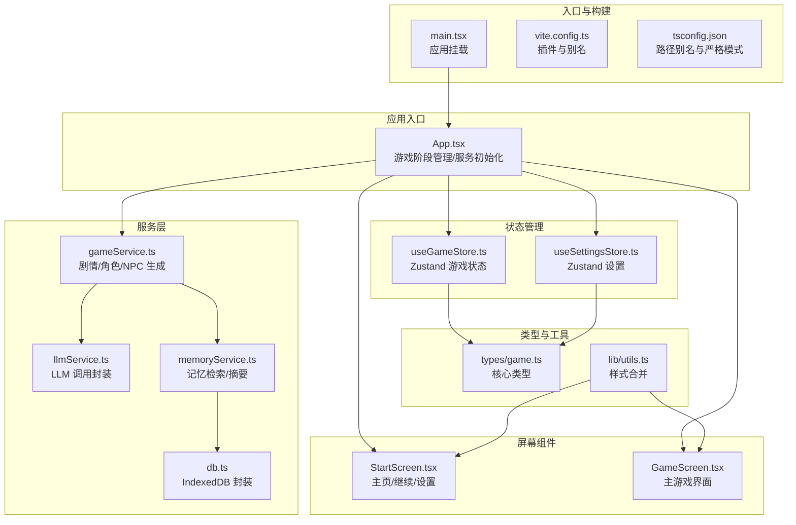
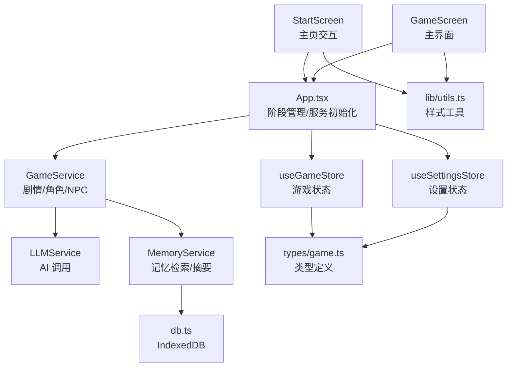
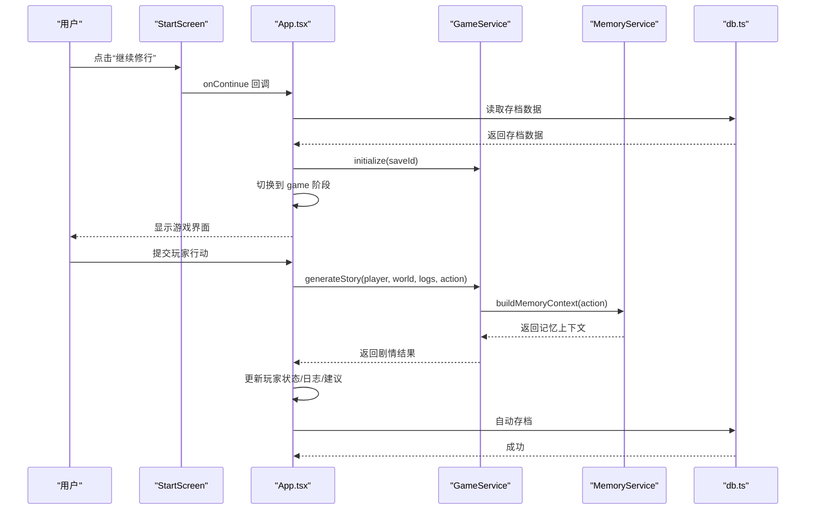
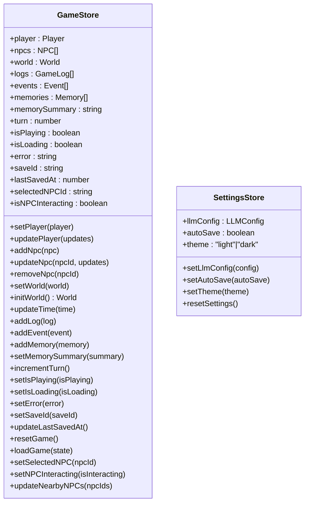
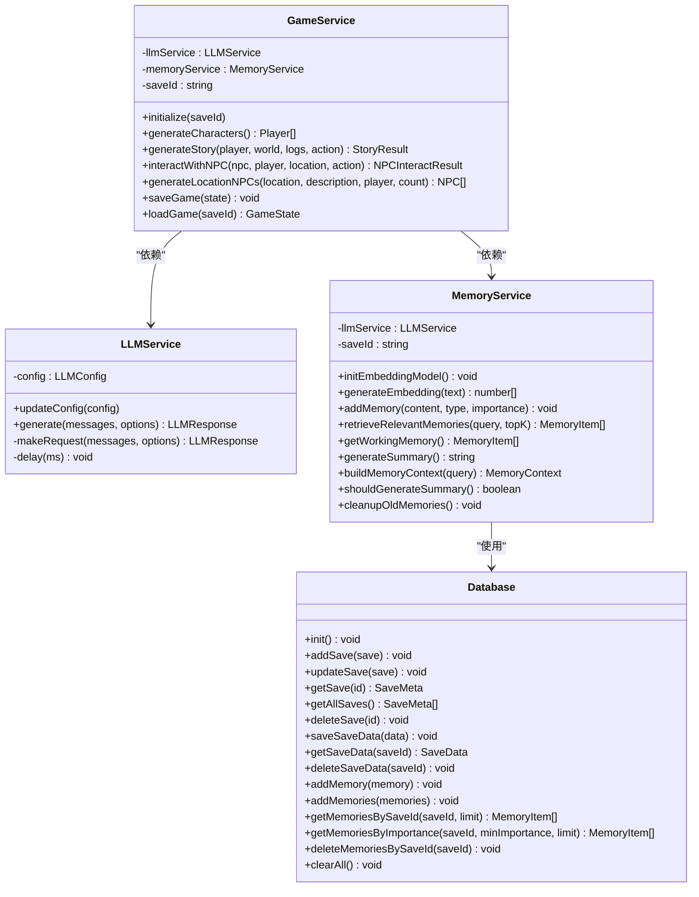
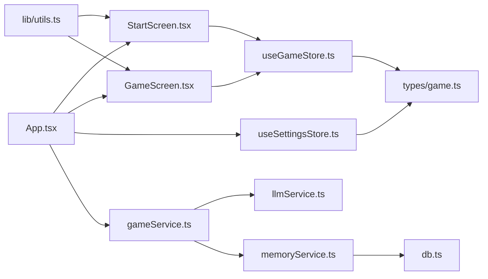

# 前端架构模式

<cite>
**本文引用的文件**
- [src/App.tsx](file://src/App.tsx)
- [src/main.tsx](file://src/main.tsx)
- [src/components/StartScreen.tsx](file://src/components/StartScreen.tsx)
- [src/components/GameScreen.tsx](file://src/components/GameScreen.tsx)
- [src/stores/useGameStore.ts](file://src/stores/useGameStore.ts)
- [src/stores/useSettingsStore.ts](file://src/stores/useSettingsStore.ts)
- [src/services/gameService.ts](file://src/services/gameService.ts)
- [src/services/llmService.ts](file://src/services/llmService.ts)
- [src/services/memoryService.ts](file://src/services/memoryService.ts)
- [src/services/db.ts](file://src/services/db.ts)
- [src/types/game.ts](file://src/types/game.ts)
- [src/lib/utils.ts](file://src/lib/utils.ts)
- [vite.config.ts](file://vite.config.ts)
- [tsconfig.json](file://tsconfig.json)
- [package.json](file://package.json)
</cite>

## 目录
1. [简介](#简介)
2. [项目结构](#项目结构)
3. [核心组件](#核心组件)
4. [架构总览](#架构总览)
5. [详细组件分析](#详细组件分析)
6. [依赖关系分析](#依赖关系分析)
7. [性能考量](#性能考量)
8. [故障排查指南](#故障排查指南)
9. [结论](#结论)
10. [附录](#附录)

## 简介
本项目是一个基于 React 18 + TypeScript + Vite 的现代前端架构，采用模块化组件设计与集中式状态管理，结合 AI 驱动的剧情生成与记忆检索，构建了一个沉浸式的修仙 Roguelike 游戏体验。应用通过 App.tsx 作为统一入口点，负责游戏阶段管理（主页/角色创建/游戏主界面）、全局状态协调、服务初始化与生命周期控制，并通过组件间清晰的 Props 传递与回调事件实现松耦合的数据流。

## 项目结构
项目采用按功能分层的目录组织方式：
- src/components：UI 组件与业务组件（StartScreen、GameScreen、各类面板与对话框）
- src/stores：状态管理（Zustand）：useGameStore（游戏状态）、useSettingsStore（设置）
- src/services：服务层（LLMService、GameService、MemoryService、IndexedDB 封装 db）
- src/types：TypeScript 类型定义（Player、NPC、World、GameState 等）
- src/lib：通用工具函数（样式合并 cn）
- 根目录：Vite 配置、TypeScript 配置、包管理与构建脚本

**图表来源**
- [src/main.tsx](file://src/main.tsx#L1-L11)
- [vite.config.ts](file://vite.config.ts#L1-L12)
- [tsconfig.json](file://tsconfig.json#L1-L32)
- [src/App.tsx](file://src/App.tsx#L1-L588)
- [src/components/StartScreen.tsx](file://src/components/StartScreen.tsx#L1-L319)
- [src/components/GameScreen.tsx](file://src/components/GameScreen.tsx#L1-L172)
- [src/stores/useGameStore.ts](file://src/stores/useGameStore.ts#L1-L226)
- [src/stores/useSettingsStore.ts](file://src/stores/useSettingsStore.ts#L1-L46)
- [src/services/gameService.ts](file://src/services/gameService.ts#L1-L541)
- [src/services/llmService.ts](file://src/services/llmService.ts#L1-L101)
- [src/services/memoryService.ts](file://src/services/memoryService.ts#L1-L224)
- [src/services/db.ts](file://src/services/db.ts#L1-L236)
- [src/types/game.ts](file://src/types/game.ts#L1-L319)
- [src/lib/utils.ts](file://src/lib/utils.ts#L1-L7)

**章节来源**
- [src/main.tsx](file://src/main.tsx#L1-L11)
- [vite.config.ts](file://vite.config.ts#L1-L12)
- [tsconfig.json](file://tsconfig.json#L1-L32)

## 核心组件
- App.tsx：应用入口点，负责游戏阶段切换、全局状态读取与写入、服务实例创建与初始化、自动存档与错误处理、NPC 交互流程编排。
- StartScreen.tsx：主页入口，提供“继续修行”、“重新转世”、“天道设置”等入口，集成主题切换与存档信息展示。
- GameScreen.tsx：主游戏界面，包含角色状态、剧情日志、行动输入、地图与 NPC 面板，以及 NPC 互动模态框与沉浸式加载提示。
- useGameStore.ts：集中式游戏状态管理，包含玩家、NPC、世界、日志、事件、记忆、回合数、保存 ID 等，支持持久化与局部序列化。
- useSettingsStore.ts：应用设置状态，包含 LLM 配置、自动存档开关、主题等，持久化存储。
- gameService.ts：AI 驱动的核心服务，负责角色生成、剧情生成、NPC 交互、区域 NPC 生成、记忆上下文构建与保存/加载。
- llmService.ts：LLM 调用封装，具备重试机制与请求参数配置。
- memoryService.ts：记忆检索与摘要生成，支持嵌入向量计算与 RAG 上下文组装。
- db.ts：IndexedDB 封装，提供存档、存档数据与记忆的增删查改。
- types/game.ts：核心类型定义，覆盖玩家、NPC、世界、日志、事件、记忆、关系、领域枚举等。
- lib/utils.ts：工具函数，提供样式类名合并。

**章节来源**
- [src/App.tsx](file://src/App.tsx#L1-L588)
- [src/components/StartScreen.tsx](file://src/components/StartScreen.tsx#L1-L319)
- [src/components/GameScreen.tsx](file://src/components/GameScreen.tsx#L1-L172)
- [src/stores/useGameStore.ts](file://src/stores/useGameStore.ts#L1-L226)
- [src/stores/useSettingsStore.ts](file://src/stores/useSettingsStore.ts#L1-L46)
- [src/services/gameService.ts](file://src/services/gameService.ts#L1-L541)
- [src/services/llmService.ts](file://src/services/llmService.ts#L1-L101)
- [src/services/memoryService.ts](file://src/services/memoryService.ts#L1-L224)
- [src/services/db.ts](file://src/services/db.ts#L1-L236)
- [src/types/game.ts](file://src/types/game.ts#L1-L319)
- [src/lib/utils.ts](file://src/lib/utils.ts#L1-L7)

## 架构总览
应用采用“屏幕组件 + 状态管理 + 服务层”的分层架构：
- 屏幕组件负责 UI 呈现与用户交互，通过 Props 接收状态与回调。
- 状态管理（Zustand）提供跨组件共享的状态与持久化能力。
- 服务层封装外部依赖（LLM、IndexedDB、记忆检索），向上提供稳定的接口。
- 类型系统贯穿全栈，确保数据结构一致性与开发体验。

**图表来源**
- [src/App.tsx](file://src/App.tsx#L1-L588)
- [src/components/StartScreen.tsx](file://src/components/StartScreen.tsx#L1-L319)
- [src/components/GameScreen.tsx](file://src/components/GameScreen.tsx#L1-L172)
- [src/stores/useGameStore.ts](file://src/stores/useGameStore.ts#L1-L226)
- [src/stores/useSettingsStore.ts](file://src/stores/useSettingsStore.ts#L1-L46)
- [src/services/gameService.ts](file://src/services/gameService.ts#L1-L541)
- [src/services/llmService.ts](file://src/services/llmService.ts#L1-L101)
- [src/services/memoryService.ts](file://src/services/memoryService.ts#L1-L224)
- [src/services/db.ts](file://src/services/db.ts#L1-L236)
- [src/types/game.ts](file://src/types/game.ts#L1-L319)
- [src/lib/utils.ts](file://src/lib/utils.ts#L1-L7)

## 详细组件分析

### App.tsx：应用入口点与生命周期管理
职责划分：
- 游戏阶段管理：start → character_creation → game，通过状态切换与条件渲染实现。
- 全局状态协调：读取 useGameStore 与 useSettingsStore，同步主题到 HTML class，派发日志与状态变更。
- 服务初始化：基于 LLM 配置创建 LLMService 与 GameService，使用 useMemo 避免重复实例化。
- 生命周期控制：IndexedDB 初始化、自动存档定时器、加载状态管理、错误提示。
- NPC 交互编排：选择 NPC、打开模态、调用交互服务、更新状态与日志。
- 剧情推进：处理玩家行动、更新时间与属性、突破判定、物品/技能变更、关系更新、自动存档。

**图表来源**
- [src/App.tsx](file://src/App.tsx#L124-L161)
- [src/services/gameService.ts](file://src/services/gameService.ts#L283-L391)
- [src/services/memoryService.ts](file://src/services/memoryService.ts#L175-L188)
- [src/services/db.ts](file://src/services/db.ts#L134-L150)

**章节来源**
- [src/App.tsx](file://src/App.tsx#L1-L588)

### StartScreen.tsx：主页与设置入口
- 功能：继续修行、重新转世、天道设置、主题切换、存档信息展示。
- 安全容错：对缺失的玩家数据进行默认值保护，避免渲染异常。
- 交互：通过回调函数与 App.tsx 协作，完成阶段切换与设置更新。

**章节来源**
- [src/components/StartScreen.tsx](file://src/components/StartScreen.tsx#L1-L319)

### GameScreen.tsx：主游戏界面
- 布局：三栏布局（左侧角色状态、中间剧情日志与行动输入、右侧地图与 NPC 面板）。
- 交互：返回主页、主题切换、沉浸式加载提示、NPC 互动模态框。
- 数据容错：对缺失数据进行默认值保护，提升健壮性。

**章节来源**
- [src/components/GameScreen.tsx](file://src/components/GameScreen.tsx#L1-L172)

### 状态管理：useGameStore 与 useSettingsStore
- useGameStore：集中管理玩家、NPC、世界、日志、事件、记忆、回合数、保存 ID、NPC 交互状态等，支持持久化与局部序列化，提供丰富的更新方法。
- useSettingsStore：管理 LLM 配置、自动存档开关、主题等，支持默认值与重置。

**图表来源**
- [src/stores/useGameStore.ts](file://src/stores/useGameStore.ts#L13-L55)
- [src/stores/useSettingsStore.ts](file://src/stores/useSettingsStore.ts#L5-L10)

**章节来源**
- [src/stores/useGameStore.ts](file://src/stores/useGameStore.ts#L1-L226)
- [src/stores/useSettingsStore.ts](file://src/stores/useSettingsStore.ts#L1-L46)

### 服务层：LLMService、GameService、MemoryService、db
- LLMService：封装 fetch 请求、重试机制、响应解析与 token 使用统计。
- GameService：角色生成、剧情生成、NPC 交互、区域 NPC 生成、记忆上下文构建、保存/加载。
- MemoryService：嵌入向量生成（@xenova/transformers 或备用）、相似度检索、摘要生成、工作记忆与重要记忆管理。
- db：IndexedDB 封装，提供存档、存档数据与记忆的 CRUD。

**图表来源**
- [src/services/llmService.ts](file://src/services/llmService.ts#L18-L101)
- [src/services/gameService.ts](file://src/services/gameService.ts#L50-L541)
- [src/services/memoryService.ts](file://src/services/memoryService.ts#L16-L224)
- [src/services/db.ts](file://src/services/db.ts#L36-L236)

**章节来源**
- [src/services/llmService.ts](file://src/services/llmService.ts#L1-L101)
- [src/services/gameService.ts](file://src/services/gameService.ts#L1-L541)
- [src/services/memoryService.ts](file://src/services/memoryService.ts#L1-L224)
- [src/services/db.ts](file://src/services/db.ts#L1-L236)

### 类型系统与工具函数
- 类型系统：通过 types/game.ts 定义了 Player、NPC、World、GameState、Memory、Skill、Item 等核心类型，配合工具函数与组件 Props，确保数据结构一致。
- 工具函数：lib/utils.ts 提供 cn(...) 用于样式类名合并，简化 TailwindCSS 类拼接。

**章节来源**
- [src/types/game.ts](file://src/types/game.ts#L1-L319)
- [src/lib/utils.ts](file://src/lib/utils.ts#L1-L7)

### 组件间通信与 Props 传递策略
- App.tsx 作为中枢，向下传递状态与回调给 StartScreen 与 GameScreen。
- GameScreen 将玩家状态、世界信息、日志、建议、加载状态与交互回调传递给子组件（StatusPanel、StoryLog、ActionInput、MapPanel、NPCPanel）。
- NPCInteractModal 通过 isOpen、onClose、onInteract 与 App.tsx 编排交互流程。
- 事件处理机制：通过 useCallback 包裹回调，减少子组件重渲染；通过 useMemo 优化依赖不变的服务实例。

**章节来源**
- [src/App.tsx](file://src/App.tsx#L550-L584)
- [src/components/GameScreen.tsx](file://src/components/GameScreen.tsx#L15-L30)

### 代码分割与懒加载策略
- 项目采用 Vite + React 插件，支持按需打包与运行时动态导入。
- 建议对重型组件（如 NPCInteractModal、StoryLog）进一步拆分，结合 React.lazy 与 Suspense 实现懒加载，降低首屏体积。
- 对 AI 模块（@xenova/transformers）可在首次使用时动态导入，减少初始加载压力。

**章节来源**
- [vite.config.ts](file://vite.config.ts#L1-L12)
- [package.json](file://package.json#L1-L55)

## 依赖关系分析
- 组件依赖：StartScreen 与 GameScreen 依赖 Zustand 状态与 UI 组件库；App.tsx 依赖所有服务与状态。
- 状态依赖：useGameStore 与 useSettingsStore 分别依赖 types/game.ts 的类型定义。
- 服务依赖：GameService 依赖 LLMService 与 MemoryService；MemoryService 依赖 db.ts；db.ts 依赖 IndexedDB。
- 构建依赖：Vite 配置启用 React 插件与路径别名，TypeScript 配置启用严格模式与 bundler 解析。

**图表来源**
- [src/App.tsx](file://src/App.tsx#L1-L588)
- [src/components/StartScreen.tsx](file://src/components/StartScreen.tsx#L1-L319)
- [src/components/GameScreen.tsx](file://src/components/GameScreen.tsx#L1-L172)
- [src/stores/useGameStore.ts](file://src/stores/useGameStore.ts#L1-L226)
- [src/stores/useSettingsStore.ts](file://src/stores/useSettingsStore.ts#L1-L46)
- [src/services/gameService.ts](file://src/services/gameService.ts#L1-L541)
- [src/services/llmService.ts](file://src/services/llmService.ts#L1-L101)
- [src/services/memoryService.ts](file://src/services/memoryService.ts#L1-L224)
- [src/services/db.ts](file://src/services/db.ts#L1-L236)
- [src/types/game.ts](file://src/types/game.ts#L1-L319)
- [src/lib/utils.ts](file://src/lib/utils.ts#L1-L7)

**章节来源**
- [vite.config.ts](file://vite.config.ts#L1-L12)
- [tsconfig.json](file://tsconfig.json#L1-L32)
- [package.json](file://package.json#L1-L55)

## 性能考量
- 状态粒度：Zustand 提供细粒度状态更新，避免不必要的重渲染；建议将高频更新的子状态拆分到独立 store。
- 服务实例缓存：通过 useMemo 缓存 LLMService 与 GameService 实例，避免重复创建导致的内存与计算浪费。
- IndexedDB 异步：所有存档与记忆操作均为异步，避免阻塞主线程；建议在批量操作时使用事务或并发优化。
- 图形与动画：Framer Motion 在复杂场景下可能带来性能压力，建议在移动端谨慎使用复杂动画。
- 类型检查：TypeScript 严格模式有助于提前发现潜在问题，减少运行时错误带来的性能损耗。

## 故障排查指南
- LLM 调用失败：检查 LLM 配置（baseURL、apiKey、model），查看重试日志与错误提示；确认网络连通性与 API 限额。
- 自动存档失败：检查 IndexedDB 初始化状态与权限；确认存档数据结构与键路径正确。
- 剧情生成异常：检查 MemoryService 的嵌入模型加载与检索逻辑；确认记忆上下文组装是否成功。
- 主题切换无效：检查 useSettingsStore 的持久化与 HTML class 同步逻辑。
- NPC 交互异常：确认 selectedNPCId 与 isNPCInteracting 状态同步，检查 GameService.interactWithNPC 的返回结构。

**章节来源**
- [src/services/llmService.ts](file://src/services/llmService.ts#L37-L55)
- [src/services/db.ts](file://src/services/db.ts#L39-L72)
- [src/services/memoryService.ts](file://src/services/memoryService.ts#L27-L37)
- [src/App.tsx](file://src/App.tsx#L22-L28)

## 结论
本项目以 React 18 + TypeScript + Vite 为基础，结合 Zustand 状态管理与服务层封装，构建了清晰的分层架构。App.tsx 作为统一入口点，承担了游戏阶段管理、服务初始化与全局状态协调的职责；组件间通过 Props 与回调实现松耦合；类型系统贯穿全栈，提升了开发效率与稳定性。未来可在代码分割、懒加载与性能监控方面进一步优化，以提升用户体验与可维护性。

## 附录
- 构建与开发：使用 Vite 快速启动与热更新，TypeScript 严格模式保障类型安全，ESLint 规范代码风格。
- 路由系统：当前项目未使用路由库，通过游戏阶段状态切换实现页面级导航；如需多页面或多视图，可引入 React Router 并保持现有状态管理模式。

**章节来源**
- [package.json](file://package.json#L1-L55)
- [vite.config.ts](file://vite.config.ts#L1-L12)
- [tsconfig.json](file://tsconfig.json#L1-L32)