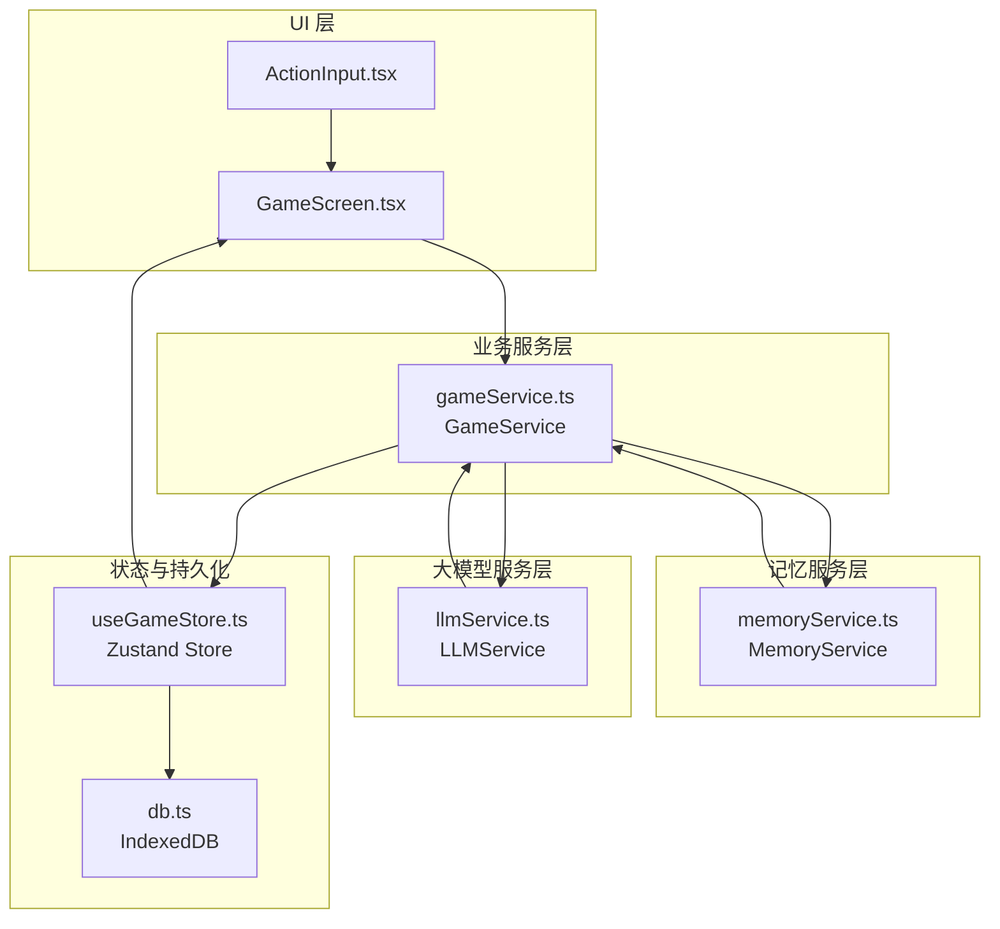
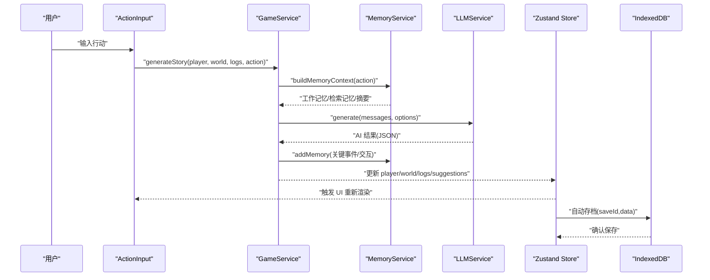
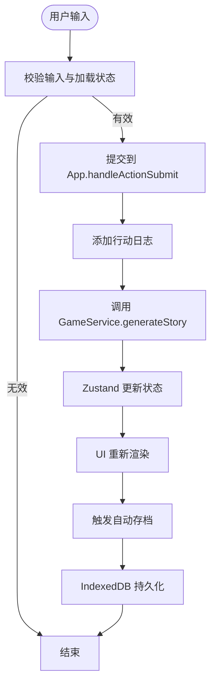
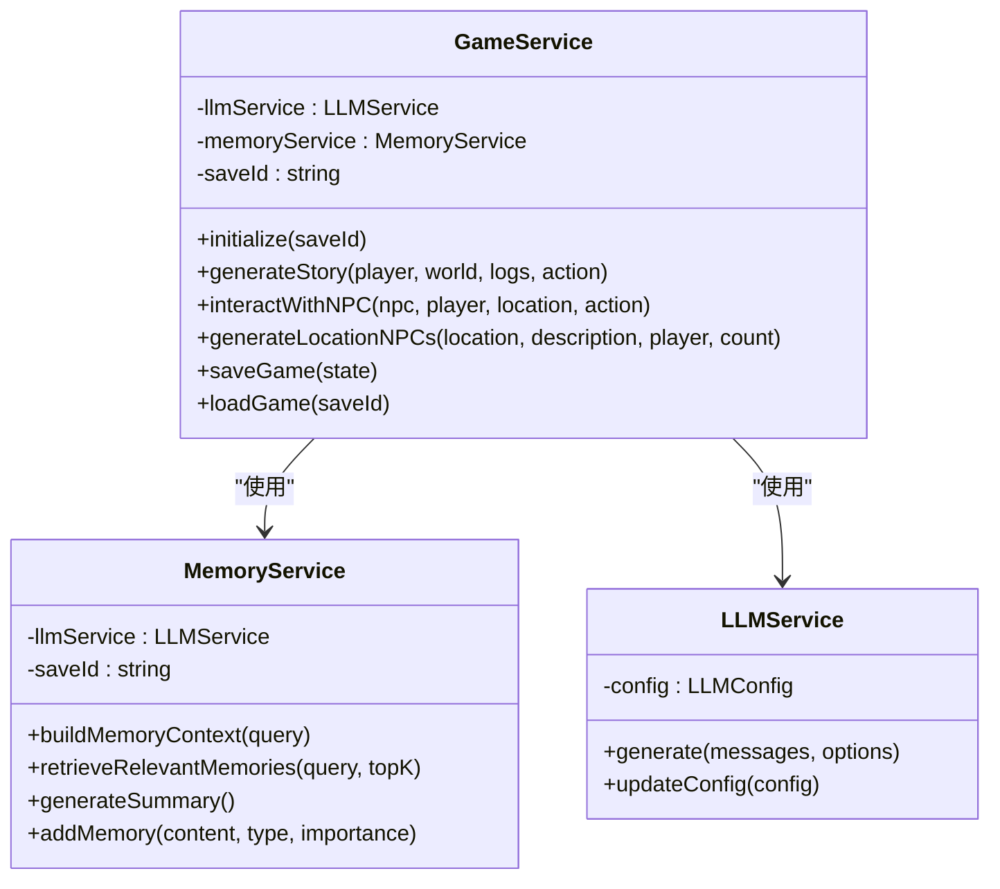
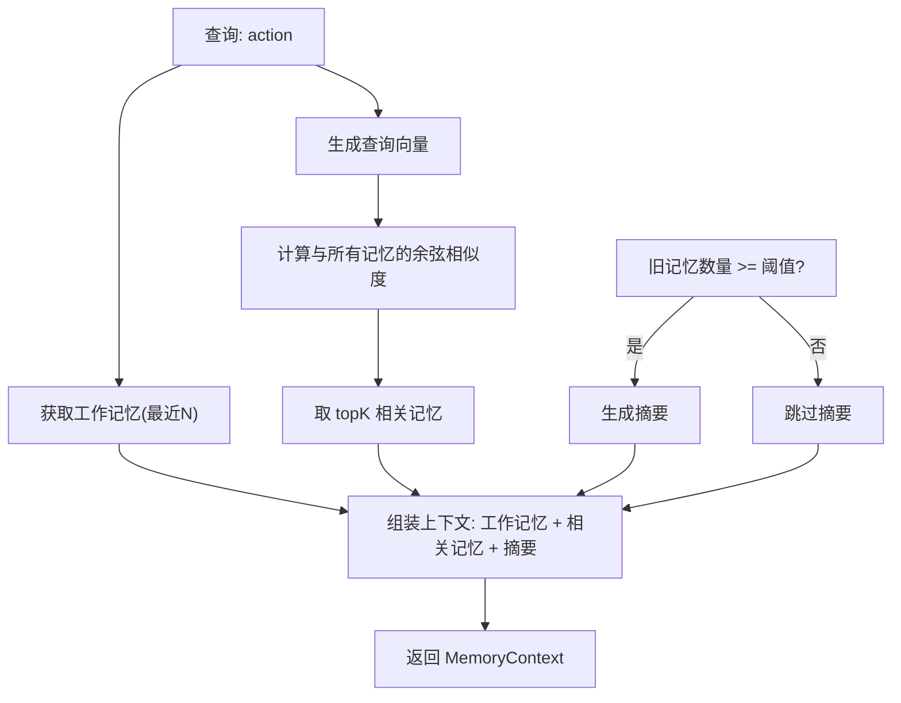
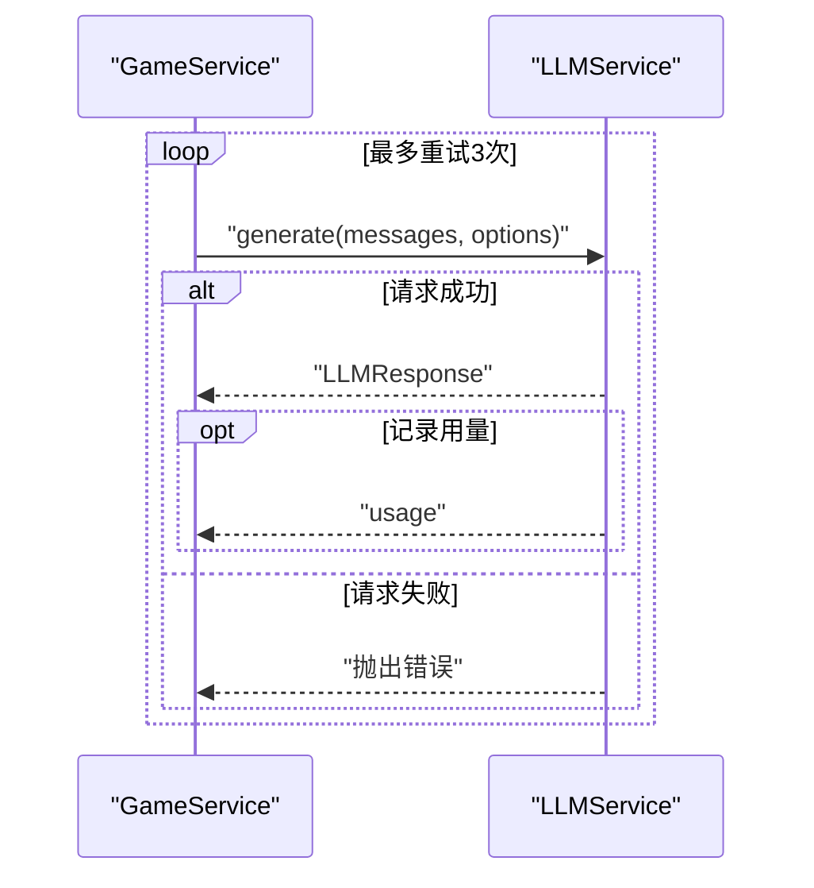
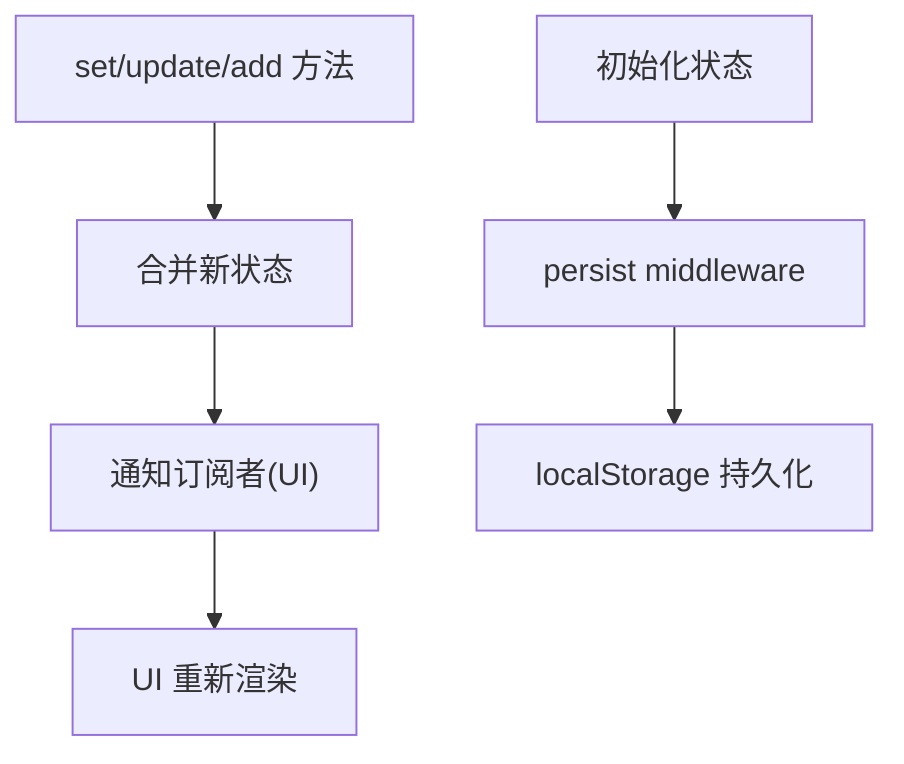
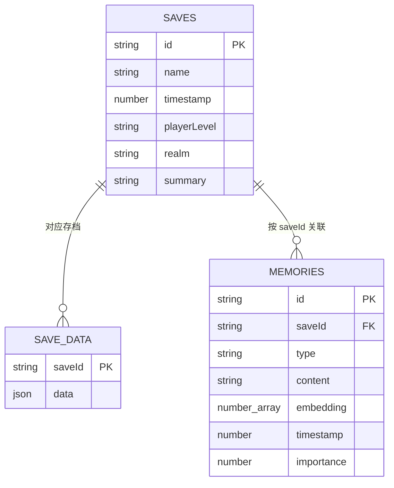
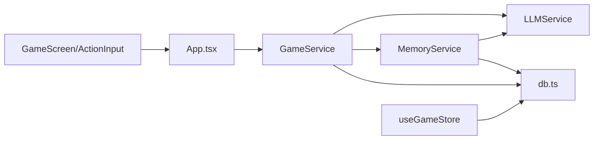

# 数据流设计

<cite>
**本文引用的文件**
- [src/App.tsx](file://src/App.tsx)
- [src/main.tsx](file://src/main.tsx)
- [src/components/GameScreen.tsx](file://src/components/GameScreen.tsx)
- [src/components/ActionInput.tsx](file://src/components/ActionInput.tsx)
- [src/services/gameService.ts](file://src/services/gameService.ts)
- [src/services/memoryService.ts](file://src/services/memoryService.ts)
- [src/services/llmService.ts](file://src/services/llmService.ts)
- [src/services/db.ts](file://src/services/db.ts)
- [src/stores/useGameStore.ts](file://src/stores/useGameStore.ts)
- [src/types/game.ts](file://src/types/game.ts)
- [src/prompts/story.ts](file://src/prompts/story.ts)
- [src/prompts/character.ts](file://src/prompts/character.ts)
- [src/prompts/summary.ts](file://src/prompts/summary.ts)
- [package.json](file://package.json)
</cite>

## 目录
1. [简介](#简介)
2. [项目结构](#项目结构)
3. [核心组件](#核心组件)
4. [架构总览](#架构总览)
5. [详细组件分析](#详细组件分析)
6. [依赖分析](#依赖分析)
7. [性能考虑](#性能考虑)
8. [故障排查指南](#故障排查指南)
9. [结论](#结论)
10. [附录](#附录)

## 简介
本文件面向“修仙 Roguelike”项目的前端数据流设计，围绕“用户输入 → ActionInput → GameService → MemoryService → LLMService → AI 生成结果 → Zustand Store → UI 更新 → IndexedDB 持久化”的完整链路进行系统化梳理。文档重点阐述：
- 数据在各层之间的流转与转换
- 异步处理、错误传播与回滚机制
- 数据一致性保障、并发控制与缓存策略
- 监控、性能分析与调试工具使用建议

## 项目结构
项目采用按职责分层的组织方式：
- UI 层：GameScreen、ActionInput 等组件负责用户交互与展示
- 业务服务层：GameService 协调 LLM 与记忆模块
- 记忆服务层：MemoryService 实现 RAG 与记忆摘要
- 大模型服务层：LLMService 封装外部模型调用
- 状态与持久化：Zustand Store + IndexedDB

图表来源
- [src/components/GameScreen.tsx](file://src/components/GameScreen.tsx#L1-L172)
- [src/components/ActionInput.tsx](file://src/components/ActionInput.tsx#L1-L146)
- [src/services/gameService.ts](file://src/services/gameService.ts#L50-L541)
- [src/services/memoryService.ts](file://src/services/memoryService.ts#L16-L224)
- [src/services/llmService.ts](file://src/services/llmService.ts#L18-L101)
- [src/stores/useGameStore.ts](file://src/stores/useGameStore.ts#L84-L226)
- [src/services/db.ts](file://src/services/db.ts#L36-L236)

章节来源
- [src/main.tsx](file://src/main.tsx#L1-L11)
- [src/App.tsx](file://src/App.tsx#L1-L588)

## 核心组件
- 用户输入与建议：ActionInput 提供输入框与“天道推演建议”，GameScreen 负责渲染与交互
- 业务编排：GameService 负责构建提示词、调用 LLM、写入记忆、汇总结果
- 记忆系统：MemoryService 实现工作记忆、检索相关记忆、生成摘要
- 大模型服务：LLMService 封装模型请求、重试与用量统计
- 状态与持久化：Zustand Store 管理全局状态并持久化至 IndexedDB

章节来源
- [src/components/ActionInput.tsx](file://src/components/ActionInput.tsx#L1-L146)
- [src/components/GameScreen.tsx](file://src/components/GameScreen.tsx#L1-L172)
- [src/services/gameService.ts](file://src/services/gameService.ts#L50-L541)
- [src/services/memoryService.ts](file://src/services/memoryService.ts#L16-L224)
- [src/services/llmService.ts](file://src/services/llmService.ts#L18-L101)
- [src/stores/useGameStore.ts](file://src/stores/useGameStore.ts#L84-L226)
- [src/services/db.ts](file://src/services/db.ts#L36-L236)

## 架构总览
下图展示了从用户输入到持久化的完整数据流：

图表来源
- [src/components/ActionInput.tsx](file://src/components/ActionInput.tsx#L14-L28)
- [src/services/gameService.ts](file://src/services/gameService.ts#L283-L391)
- [src/services/memoryService.ts](file://src/services/memoryService.ts#L175-L188)
- [src/services/llmService.ts](file://src/services/llmService.ts#L29-L97)
- [src/stores/useGameStore.ts](file://src/stores/useGameStore.ts#L84-L226)
- [src/services/db.ts](file://src/services/db.ts#L134-L159)

## 详细组件分析

### 用户输入与 UI 更新
- ActionInput 负责收集用户输入、提供建议按钮、禁用状态与加载指示
- GameScreen 将 Zustand 状态映射为 UI，渲染故事日志、状态面板、NPC 面板与互动模态框
- UI 通过 Zustand 的订阅机制自动响应状态变更

图表来源
- [src/components/ActionInput.tsx](file://src/components/ActionInput.tsx#L14-L28)
- [src/components/GameScreen.tsx](file://src/components/GameScreen.tsx#L125-L131)
- [src/App.tsx](file://src/App.tsx#L240-L468)
- [src/stores/useGameStore.ts](file://src/stores/useGameStore.ts#L144-L154)
- [src/services/db.ts](file://src/services/db.ts#L134-L159)

章节来源
- [src/components/ActionInput.tsx](file://src/components/ActionInput.tsx#L1-L146)
- [src/components/GameScreen.tsx](file://src/components/GameScreen.tsx#L1-L172)
- [src/App.tsx](file://src/App.tsx#L240-L468)

### GameService：业务编排与结果聚合
- 初始化：接收 LLMService，创建 MemoryService
- 生成剧情：构建系统与用户提示词，调用 LLM，解析 JSON，补充默认值，记录关键事件到记忆
- NPC 交互：封装交互提示词，返回对话、状态变化与时间推进
- 存档/读档：通过 db.ts 保存/加载 GameState

图表来源
- [src/services/gameService.ts](file://src/services/gameService.ts#L50-L541)
- [src/services/memoryService.ts](file://src/services/memoryService.ts#L16-L224)
- [src/services/llmService.ts](file://src/services/llmService.ts#L18-L101)

章节来源
- [src/services/gameService.ts](file://src/services/gameService.ts#L50-L541)

### MemoryService：RAG 与记忆摘要
- 工作记忆：最近若干条记忆
- 相关检索：基于嵌入向量余弦相似度检索 topK
- 摘要生成：超过阈值后对旧记忆生成摘要，降低上下文长度
- 嵌入生成：优先使用 transformers 的特征提取模型，失败时回退简单哈希向量

图表来源
- [src/services/memoryService.ts](file://src/services/memoryService.ts#L175-L188)
- [src/services/memoryService.ts](file://src/services/memoryService.ts#L121-L137)
- [src/services/memoryService.ts](file://src/services/memoryService.ts#L144-L173)

章节来源
- [src/services/memoryService.ts](file://src/services/memoryService.ts#L16-L224)

### LLMService：异步调用与重试
- 支持温度、最大 token、响应格式等参数
- 失败自动重试（最多 3 次，指数退避）
- 统计 token 使用量并上报到全局 token store

图表来源
- [src/services/llmService.ts](file://src/services/llmService.ts#L29-L97)

章节来源
- [src/services/llmService.ts](file://src/services/llmService.ts#L18-L101)

### Zustand Store：状态管理与本地持久化
- 管理 player、npcs、world、logs、events、memories、memorySummary、turn、isPlaying、isLoading、error、saveId、lastSavedAt、selectedNPCId、isNPCInteracting
- 使用 persist middleware 仅持久化必要字段到 localStorage
- 提供 set/update/add 系列方法，保证不可变更新

图表来源
- [src/stores/useGameStore.ts](file://src/stores/useGameStore.ts#L84-L226)

章节来源
- [src/stores/useGameStore.ts](file://src/stores/useGameStore.ts#L1-L226)

### IndexedDB：存档与记忆存储
- 对象库：SAVES、SAVE_DATA、MEMORIES
- 支持按 saveId 查询记忆、按重要性过滤、批量添加记忆
- 存档：put/saveSaveData/getSaveData/deleteSaveData

图表来源
- [src/services/db.ts](file://src/services/db.ts#L6-L34)
- [src/services/db.ts](file://src/services/db.ts#L134-L159)
- [src/services/db.ts](file://src/services/db.ts#L175-L207)

章节来源
- [src/services/db.ts](file://src/services/db.ts#L36-L236)

## 依赖分析
- 组件耦合
  - GameScreen 依赖 Zustand Store 与 ActionInput
  - GameService 依赖 LLMService 与 MemoryService
  - MemoryService 依赖 LLMService 与 db.ts
  - LLMService 依赖外部模型接口
  - App.tsx 作为入口，协调服务实例与自动存档
- 外部依赖
  - @xenova/transformers：用于嵌入特征提取
  - zustand/zustand-persist：状态管理与持久化
  - sonner：消息提示
  - react-markdown：渲染富文本

图表来源
- [src/App.tsx](file://src/App.tsx#L67-L72)
- [src/services/gameService.ts](file://src/services/gameService.ts#L50-L62)
- [src/services/memoryService.ts](file://src/services/memoryService.ts#L22-L25)
- [src/services/llmService.ts](file://src/services/llmService.ts#L18-L23)
- [src/stores/useGameStore.ts](file://src/stores/useGameStore.ts#L84-L226)
- [src/services/db.ts](file://src/services/db.ts#L36-L72)
- [package.json](file://package.json#L23-L35)

章节来源
- [package.json](file://package.json#L15-L55)

## 性能考虑
- 异步与并发
  - LLMService 采用指数退避重试，避免瞬时风暴
  - MemoryService 的检索与摘要生成使用 Promise.all 并行
- 缓存策略
  - MemoryService 的工作记忆限制大小，减少上下文长度
  - 摘要阈值控制，避免频繁生成摘要
  - 嵌入模型加载失败时回退简单哈希向量
- UI 渲染
  - Zustand 的不可变更新与局部订阅减少重绘
  - GameScreen 使用动画库优化过渡体验
- 存储
  - IndexedDB 分离存档与记忆，按索引查询提升效率
  - persist middleware 仅持久化必要字段，降低体积

[本节为通用指导，无需特定文件引用]

## 故障排查指南
- LLM 调用失败
  - 现象：generate 抛出错误，控制台输出重试日志
  - 排查：检查 baseURL/apiKey/model 配置；查看网络与权限
  - 参考路径：[src/services/llmService.ts](file://src/services/llmService.ts#L37-L55)
- 记忆检索异常
  - 现象：检索为空或相似度异常
  - 排查：确认嵌入模型加载状态；检查向量维度与归一化
  - 参考路径：[src/services/memoryService.ts](file://src/services/memoryService.ts#L27-L37), [src/services/memoryService.ts](file://src/services/memoryService.ts#L40-L68)
- 自动存档失败
  - 现象：控制台报错，最后保存时间未更新
  - 排查：检查 db.init 是否成功；确认 saveId 是否存在；查看 IndexedDB 状态
  - 参考路径：[src/App.tsx](file://src/App.tsx#L75-L122), [src/services/db.ts](file://src/services/db.ts#L39-L72)
- UI 不更新
  - 现象：状态已更新但页面无变化
  - 排查：确认 Zustand 订阅是否生效；检查 set/update 方法是否正确使用
  - 参考路径：[src/stores/useGameStore.ts](file://src/stores/useGameStore.ts#L84-L226)

章节来源
- [src/services/llmService.ts](file://src/services/llmService.ts#L37-L55)
- [src/services/memoryService.ts](file://src/services/memoryService.ts#L27-L68)
- [src/App.tsx](file://src/App.tsx#L75-L122)
- [src/services/db.ts](file://src/services/db.ts#L39-L72)
- [src/stores/useGameStore.ts](file://src/stores/useGameStore.ts#L84-L226)

## 结论
本数据流设计以 GameService 为核心，串联 MemoryService 与 LLMService，借助 Zustand Store 完成状态统一与 UI 响应，并通过 IndexedDB 实现持久化。整体具备良好的异步处理能力、错误重试与回退机制、内存与存储层面的性能优化，以及清晰的监控与调试入口。建议在生产环境中进一步完善：
- 增加埋点与指标采集（如 LLM 响应时延、token 使用趋势）
- 对关键路径增加超时与取消机制
- 优化 UI 渲染粒度，减少不必要的重绘

[本节为总结性内容，无需特定文件引用]

## 附录
- 提示词与系统指令
  - 剧情生成：[src/prompts/story.ts](file://src/prompts/story.ts#L1-L147)
  - 角色生成：[src/prompts/character.ts](file://src/prompts/character.ts#L1-L97)
  - 记忆摘要：[src/prompts/summary.ts](file://src/prompts/summary.ts#L1-L26)
- 类型定义
  - 游戏状态与实体：[src/types/game.ts](file://src/types/game.ts#L110-L285)

章节来源
- [src/prompts/story.ts](file://src/prompts/story.ts#L1-L147)
- [src/prompts/character.ts](file://src/prompts/character.ts#L1-L97)
- [src/prompts/summary.ts](file://src/prompts/summary.ts#L1-L26)
- [src/types/game.ts](file://src/types/game.ts#L110-L285)