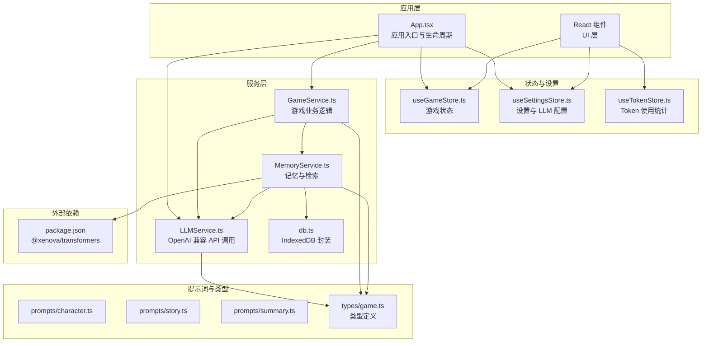
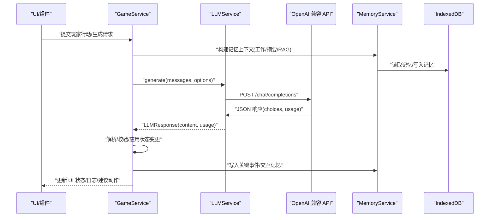
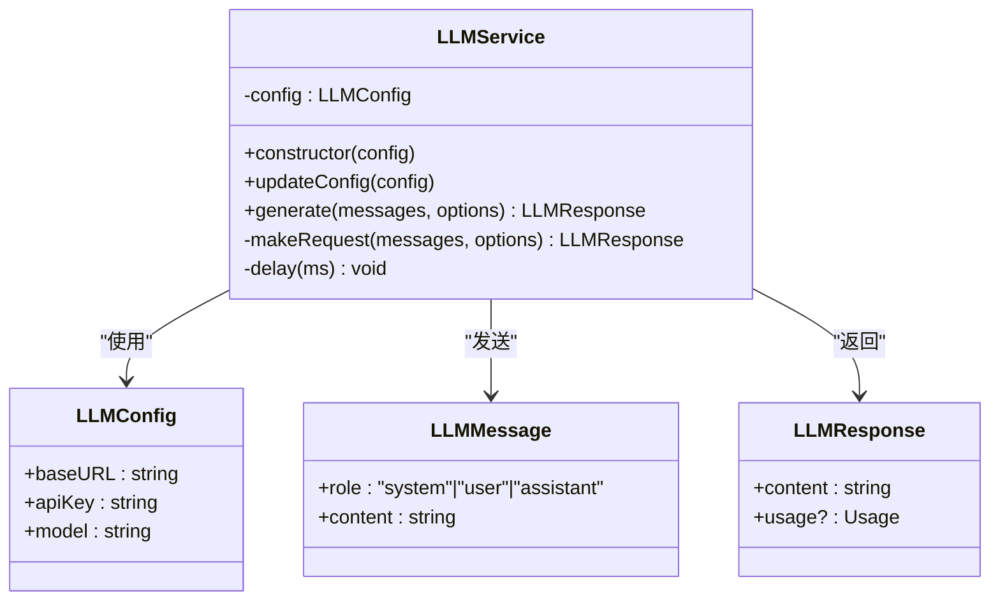
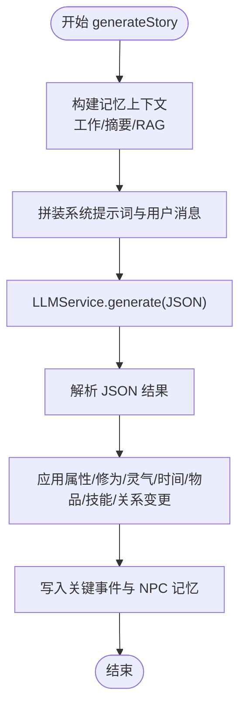
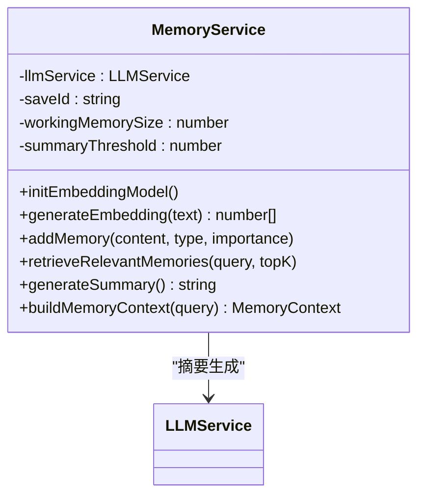
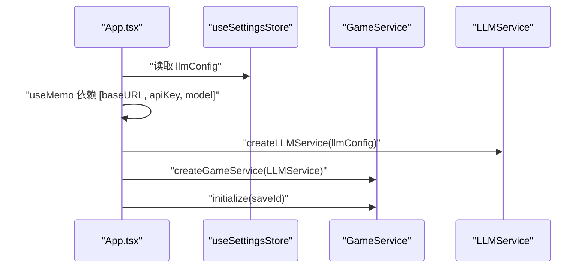
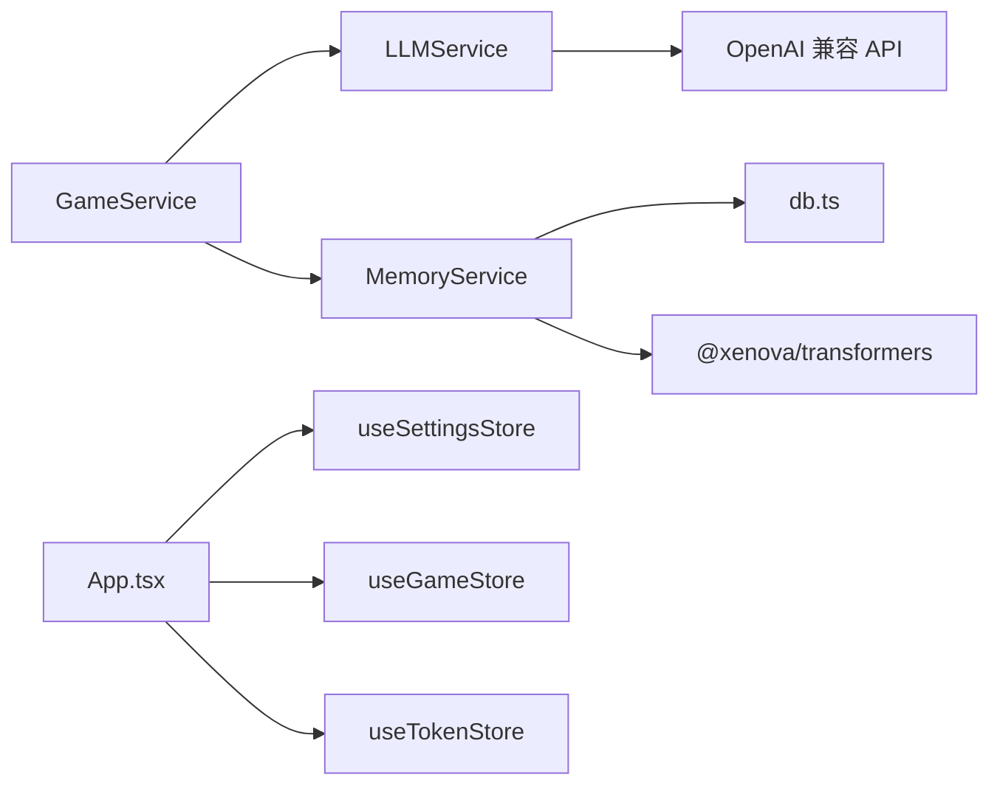

# AI 集成服务

<cite>
**本文引用的文件**
- [src/services/llmService.ts](file://src/services/llmService.ts)
- [src/services/gameService.ts](file://src/services/gameService.ts)
- [src/services/memoryService.ts](file://src/services/memoryService.ts)
- [src/services/db.ts](file://src/services/db.ts)
- [src/stores/useGameStore.ts](file://src/stores/useGameStore.ts)
- [src/stores/useSettingsStore.ts](file://src/stores/useSettingsStore.ts)
- [src/stores/useTokenStore.ts](file://src/stores/useTokenStore.ts)
- [src/App.tsx](file://src/App.tsx)
- [src/types/game.ts](file://src/types/game.ts)
- [src/prompts/character.ts](file://src/prompts/character.ts)
- [src/prompts/story.ts](file://src/prompts/story.ts)
- [src/prompts/summary.ts](file://src/prompts/summary.ts)
- [package.json](file://package.json)
- [README.md](file://README.md)
- [AGENTS.md](file://AGENTS.md)
</cite>

## 目录
1. [简介](#简介)
2. [项目结构](#项目结构)
3. [核心组件](#核心组件)
4. [架构总览](#架构总览)
5. [详细组件分析](#详细组件分析)
6. [依赖分析](#依赖分析)
7. [性能考虑](#性能考虑)
8. [故障排除指南](#故障排除指南)
9. [结论](#结论)
10. [附录](#附录)

## 简介
本文件面向“AI 集成服务”的实现与运维，聚焦 LLMService 的架构与技术细节，包括：
- OpenAI 兼容 API 集成方案
- 模型配置管理
- 请求/响应处理流程
- 初始化过程与密钥安全管理
- 模型参数调优策略
- 请求队列与并发控制、错误重试与超时处理
- 与 Transformers.js 的结合方式、本地模型推理支持与模型切换机制
- 性能监控指标与成本控制策略
- API 限制应对方案
- 配置示例与故障排除指南

## 项目结构
该项目采用纯前端架构，AI 驱动的游戏内容生成通过 LLMService 与提示词系统协作完成，配合本地存储与状态管理实现完整的用户体验。

图表来源
- [src/App.tsx](file://src/App.tsx#L67-L72)
- [src/services/llmService.ts](file://src/services/llmService.ts#L18-L98)
- [src/services/gameService.ts](file://src/services/gameService.ts#L50-L58)
- [src/services/memoryService.ts](file://src/services/memoryService.ts#L16-L25)
- [src/services/db.ts](file://src/services/db.ts#L36-L72)
- [src/stores/useSettingsStore.ts](file://src/stores/useSettingsStore.ts#L24-L45)
- [src/stores/useGameStore.ts](file://src/stores/useGameStore.ts#L84-L225)
- [src/stores/useTokenStore.ts](file://src/stores/useTokenStore.ts#L31-L72)
- [src/prompts/character.ts](file://src/prompts/character.ts#L1-L97)
- [src/prompts/story.ts](file://src/prompts/story.ts#L1-L147)
- [src/prompts/summary.ts](file://src/prompts/summary.ts#L1-L26)
- [src/types/game.ts](file://src/types/game.ts#L253-L257)
- [package.json](file://package.json#L23-L35)

章节来源
- [README.md](file://README.md#L77-L97)
- [AGENTS.md](file://AGENTS.md#L225-L283)

## 核心组件
- LLMService：封装 OpenAI 兼容 API 的调用，支持重试、超时、温度与最大 token 参数、JSON 响应格式化。
- GameService：协调角色生成、剧情推演、NPC 交互、记忆写入与状态更新。
- MemoryService：工作记忆、摘要记忆与 RAG 检索，结合 @xenova/transformers 在浏览器端生成嵌入向量。
- db.ts：IndexedDB 封装，提供存档、存档数据与记忆的 CRUD。
- useSettingsStore：集中管理 LLM 配置（baseURL、apiKey、model）与主题、自动存档等设置。
- useGameStore/useTokenStore：游戏状态与 Token 使用统计持久化。

章节来源
- [src/services/llmService.ts](file://src/services/llmService.ts#L18-L98)
- [src/services/gameService.ts](file://src/services/gameService.ts#L50-L58)
- [src/services/memoryService.ts](file://src/services/memoryService.ts#L16-L25)
- [src/services/db.ts](file://src/services/db.ts#L36-L72)
- [src/stores/useSettingsStore.ts](file://src/stores/useSettingsStore.ts#L24-L45)
- [src/stores/useGameStore.ts](file://src/stores/useGameStore.ts#L84-L225)
- [src/stores/useTokenStore.ts](file://src/stores/useTokenStore.ts#L31-L72)

## 架构总览
AI 驱动的请求流从 UI 层发起，经由 GameService 组织提示词与上下文，再通过 LLMService 发送到 OpenAI 兼容 API，解析响应后更新状态与记忆。

图表来源
- [src/services/gameService.ts](file://src/services/gameService.ts#L283-L391)
- [src/services/memoryService.ts](file://src/services/memoryService.ts#L175-L188)
- [src/services/llmService.ts](file://src/services/llmService.ts#L29-L93)
- [src/services/db.ts](file://src/services/db.ts#L161-L189)

## 详细组件分析

### LLMService：OpenAI 兼容 API 集成与请求处理
- OpenAI 兼容 API 集成
  - 通过 fetch 调用 baseURL/chat/completions，携带 Authorization: Bearer apiKey。
  - 请求体包含 model、messages、temperature、max_tokens、response_format。
- 模型配置管理
  - 配置项：baseURL、apiKey、model，通过构造函数注入，支持 updateConfig 动态更新。
- 请求/响应处理
  - generate(options)：默认重试 3 次，指数退避延迟，解析 choices[0].message.content 与 usage。
  - makeRequest：校验 response.ok，非 2xx 抛出错误；成功则解析 JSON。
- 参数调优策略
  - temperature 默认 0.7；max_tokens 默认 2000；response_format 默认 text，部分场景使用 json_object。
- 错误重试与超时
  - 重试 3 次，间隔按 1000*attempt 毫秒递增；异常时记录警告并抛出最终错误。
- 安全与密钥管理
  - apiKey 通过 LLMConfig 注入，建议通过环境变量注入（VITE_LLM_API_KEY）。
  - 注意：当前实现未内置速率限制或并发队列，需在上层进行并发控制。

图表来源
- [src/services/llmService.ts](file://src/services/llmService.ts#L18-L98)
- [src/types/game.ts](file://src/types/game.ts#L253-L257)

章节来源
- [src/services/llmService.ts](file://src/services/llmService.ts#L18-L98)
- [src/types/game.ts](file://src/types/game.ts#L253-L257)

### GameService：游戏业务编排与状态更新
- 初始化与记忆服务
  - initialize(saveId)：创建 MemoryService 实例，建立存档上下文。
- 角色生成
  - generateCharacters：使用 characterSystemPrompt 与 characterGenerationPrompt，JSON 解析并补全默认属性。
- 剧情推演
  - generateStory：构建 player/world/logs/memory 上下文，调用 LLM 生成 JSON 结果，应用 statChanges、timePassed、cultivation/spiritualEnergy、突破、物品/技能变更、NPC 关系等。
- NPC 交互
  - interactWithNPC：生成对话与交互选项，更新双方状态与记忆。
- 记忆写入
  - 生成关键事件与 NPC 交互后写入 MemoryService。
- Token 使用统计
  - recordTokenUsage：将 usage 写入 useTokenStore。

图表来源
- [src/services/gameService.ts](file://src/services/gameService.ts#L283-L391)
- [src/services/memoryService.ts](file://src/services/memoryService.ts#L175-L188)

章节来源
- [src/services/gameService.ts](file://src/services/gameService.ts#L50-L58)
- [src/services/gameService.ts](file://src/services/gameService.ts#L74-L119)
- [src/services/gameService.ts](file://src/services/gameService.ts#L283-L391)
- [src/services/gameService.ts](file://src/services/gameService.ts#L415-L469)

### MemoryService：三层记忆与 RAG 检索
- 三层记忆
  - 工作记忆：最近 N 条（默认 10），用于当前回合上下文。
  - 摘要记忆：超过阈值（默认 50）时，使用 LLM 生成摘要。
  - RAG 检索：基于嵌入向量的余弦相似度检索相关记忆。
- 嵌入模型与本地推理
  - initEmbeddingModel：通过 @xenova/transformers 加载 feature-extraction 模型（all-MiniLM-L6-v2）。
  - generateEmbedding：优先使用 transformers；失败则回退到简单哈希向量。
- 记忆重要性评分
  - 根据关键词匹配（突破/死亡/奇遇/传承/天劫/飞升/获得）赋予 9-10 分，提升检索权重。
- 上下文组装
  - buildMemoryContext：并行获取工作记忆、检索记忆、摘要记忆，形成最终上下文。

图表来源
- [src/services/memoryService.ts](file://src/services/memoryService.ts#L16-L25)
- [src/services/memoryService.ts](file://src/services/memoryService.ts#L27-L37)
- [src/services/memoryService.ts](file://src/services/memoryService.ts#L175-L188)

章节来源
- [src/services/memoryService.ts](file://src/services/memoryService.ts#L16-L25)
- [src/services/memoryService.ts](file://src/services/memoryService.ts#L27-L37)
- [src/services/memoryService.ts](file://src/services/memoryService.ts#L106-L119)
- [src/services/memoryService.ts](file://src/services/memoryService.ts#L175-L188)

### 数据持久化：IndexedDB 封装
- 存储结构
  - SAVES：存档元数据（名称、时间戳、摘要等）
  - SAVE_DATA：完整游戏状态
  - MEMORIES：记忆片段（content、embedding、importance、timestamp）
- 关键能力
  - addSave/updateSave/getSave/getAllSaves/deleteSave
  - saveSaveData/getSaveData/deleteSaveData
  - addMemory/getMemoriesBySaveId/getMemoriesByImportance/deleteMemoriesBySaveId
- 与 MemoryService 的协作
  - addMemory/retrieveRelevantMemories/generateSummary/shouldGenerateSummary/cleanupOldMemories

章节来源
- [src/services/db.ts](file://src/services/db.ts#L36-L72)
- [src/services/db.ts](file://src/services/db.ts#L161-L225)

### 设置与初始化：配置注入与服务创建
- useSettingsStore
  - 默认 LLMConfig：从 import.meta.env.VITE_LLM_* 注入，支持 setLlmConfig 动态更新。
- App.tsx 初始化
  - useMemo 依据 llmConfig 变化创建 LLMService 与 GameService 实例，避免重复创建。
  - 自动存档：每 30 秒一次，且每次行动后触发；支持继续游戏时从 IndexedDB 恢复。

图表来源
- [src/App.tsx](file://src/App.tsx#L67-L72)
- [src/stores/useSettingsStore.ts](file://src/stores/useSettingsStore.ts#L24-L45)

章节来源
- [src/stores/useSettingsStore.ts](file://src/stores/useSettingsStore.ts#L24-L45)
- [src/App.tsx](file://src/App.tsx#L67-L72)

### 提示词系统与模型切换
- 提示词组织
  - 角色生成：characterSystemPrompt、characterGenerationPrompt
  - 剧情推演：storySystemPrompt、storyGenerationPrompt
  - 记忆摘要：summarySystemPrompt、summaryGenerationPrompt
- 模型切换机制
  - 通过 useSettingsStore.setLlmConfig 动态修改 model/baseURL/apiKey，App.tsx 的 useMemo 保证实例重建。
  - 支持多种 OpenAI 兼容供应商（OpenAI、DeepSeek、Qwen、Grok、OpenRouter 等）。

章节来源
- [src/prompts/character.ts](file://src/prompts/character.ts#L1-L97)
- [src/prompts/story.ts](file://src/prompts/story.ts#L1-L147)
- [src/prompts/summary.ts](file://src/prompts/summary.ts#L1-L26)
- [src/stores/useSettingsStore.ts](file://src/stores/useSettingsStore.ts#L29-L32)
- [README.md](file://README.md#L47-L62)

## 依赖分析
- 外部依赖
  - @xenova/transformers：浏览器端嵌入模型，用于 MemoryService 的特征提取与 RAG。
  - Zustand/zustand-persist：状态管理与持久化。
  - react/react-dom、TailwindCSS、shadcn/ui：UI 基础。
- 内部耦合
  - GameService 依赖 LLMService 与 MemoryService；MemoryService 依赖 db.ts 与 LLMService。
  - App.tsx 作为入口，协调设置、服务创建与自动存档。

图表来源
- [package.json](file://package.json#L23-L35)
- [src/services/llmService.ts](file://src/services/llmService.ts#L67-L80)
- [src/services/gameService.ts](file://src/services/gameService.ts#L50-L58)
- [src/services/memoryService.ts](file://src/services/memoryService.ts#L27-L37)
- [src/services/db.ts](file://src/services/db.ts#L36-L72)
- [src/App.tsx](file://src/App.tsx#L67-L72)

章节来源
- [package.json](file://package.json#L15-L35)
- [src/services/llmService.ts](file://src/services/llmService.ts#L67-L80)
- [src/services/gameService.ts](file://src/services/gameService.ts#L50-L58)
- [src/services/memoryService.ts](file://src/services/memoryService.ts#L27-L37)
- [src/services/db.ts](file://src/services/db.ts#L36-L72)
- [src/App.tsx](file://src/App.tsx#L67-L72)

## 性能考虑
- 嵌入生成与 RAG
  - @xenova/transformers 首次加载较慢，MemoryService.initEmbeddingModel 会在首次使用时初始化；失败时回退到简单哈希向量，保证可用性。
  - 建议：在空闲时预热嵌入模型，或在 App.tsx 生命周期中提前触发初始化。
- 请求重试与并发
  - LLMService 默认重试 3 次，指数退避；未内置并发队列与速率限制，建议在上层（如 GameService）进行节流与串行化关键请求。
- Token 使用与成本控制
  - recordTokenUsage 将 usage 写入 useTokenStore；建议在 UI 中展示累计/会话统计，结合 max_tokens 与 temperature 调优降低用量。
- 存储与检索
  - IndexedDB 查询使用索引（saveId、timestamp、importance），建议定期清理低重要性记忆以控制规模。

章节来源
- [src/services/memoryService.ts](file://src/services/memoryService.ts#L27-L37)
- [src/services/memoryService.ts](file://src/services/memoryService.ts#L58-L68)
- [src/services/gameService.ts](file://src/services/gameService.ts#L64-L72)
- [src/stores/useTokenStore.ts](file://src/stores/useTokenStore.ts#L31-L72)
- [src/services/db.ts](file://src/services/db.ts#L175-L207)

## 故障排除指南
- API 调用失败
  - 现象：抛出“API 错误 (状态码)”或重试后仍失败。
  - 排查：检查 baseURL、apiKey、model 是否正确；确认网络连通与供应商配额；查看响应体文本定位问题。
  - 参考：[src/services/llmService.ts](file://src/services/llmService.ts#L82-L85)
- JSON 解析失败
  - 现象：response_format 为 json_object 时解析异常。
  - 排查：确认提示词要求返回 JSON；检查模型是否支持 JSON 模式；适当提高 temperature 以增强稳定性。
  - 参考：[src/services/gameService.ts](file://src/services/gameService.ts#L81-L84)
- 嵌入模型加载失败
  - 现象：initEmbeddingModel 失败，回退到简单哈希向量。
  - 排查：检查网络与 CDN；确认浏览器支持 WebAssembly；可手动触发预热。
  - 参考：[src/services/memoryService.ts](file://src/services/memoryService.ts#L27-L37)
- 记忆检索为空
  - 现象：RAG 检索结果为空或质量不高。
  - 排查：检查 embedding 生成是否成功；调整 topK 与阈值；优化提示词以提升记忆质量。
  - 参考：[src/services/memoryService.ts](file://src/services/memoryService.ts#L121-L137)
- 自动存档失败
  - 现象：IndexedDB 打开失败或保存失败。
  - 排查：确认浏览器支持 IndexedDB；检查存储配额；查看控制台错误。
  - 参考：[src/services/db.ts](file://src/services/db.ts#L39-L50)
- 设置未生效
  - 现象：修改 LLM 配置后未触发服务重建。
  - 排查：确认 useMemo 依赖包含 [baseURL, apiKey, model]；检查 useSettingsStore.setLlmConfig 调用。
  - 参考：[src/App.tsx](file://src/App.tsx#L67-L72), [src/stores/useSettingsStore.ts](file://src/stores/useSettingsStore.ts#L29-L32)

章节来源
- [src/services/llmService.ts](file://src/services/llmService.ts#L37-L55)
- [src/services/llmService.ts](file://src/services/llmService.ts#L82-L85)
- [src/services/memoryService.ts](file://src/services/memoryService.ts#L27-L37)
- [src/services/memoryService.ts](file://src/services/memoryService.ts#L121-L137)
- [src/services/db.ts](file://src/services/db.ts#L39-L50)
- [src/App.tsx](file://src/App.tsx#L67-L72)
- [src/stores/useSettingsStore.ts](file://src/stores/useSettingsStore.ts#L29-L32)

## 结论
本项目以 LLMService 为核心，结合 GameService、MemoryService 与本地存储，实现了纯前端的 AI 驱动游戏体验。通过 OpenAI 兼容 API、提示词工程与三层记忆系统，系统具备良好的扩展性与可维护性。建议在生产环境中进一步完善并发控制、速率限制、埋点监控与成本可视化，以提升稳定性与用户体验。

## 附录

### 配置示例
- 环境变量（推荐）
  - VITE_LLM_BASE_URL：如 https://api.openai.com/v1
  - VITE_LLM_API_KEY：你的 API Key
  - VITE_LLM_MODEL：如 gpt-4 或 deepseek-chat
- 设置页面
  - 通过 useSettingsStore.setLlmConfig 动态更新 baseURL/model/apiKey。
- 模型推荐
  - deepseek-chat、qwen-turbo、gpt-4-turbo-preview、gpt-3.5-turbo 等。

章节来源
- [src/stores/useSettingsStore.ts](file://src/stores/useSettingsStore.ts#L12-L16)
- [README.md](file://README.md#L47-L62)