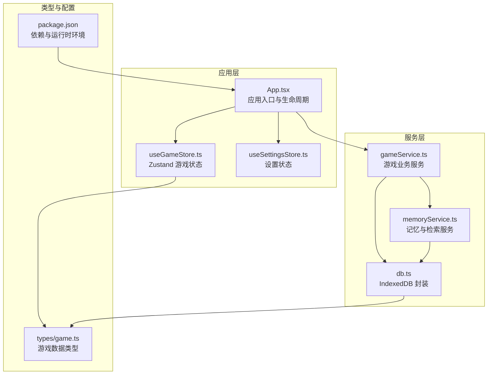
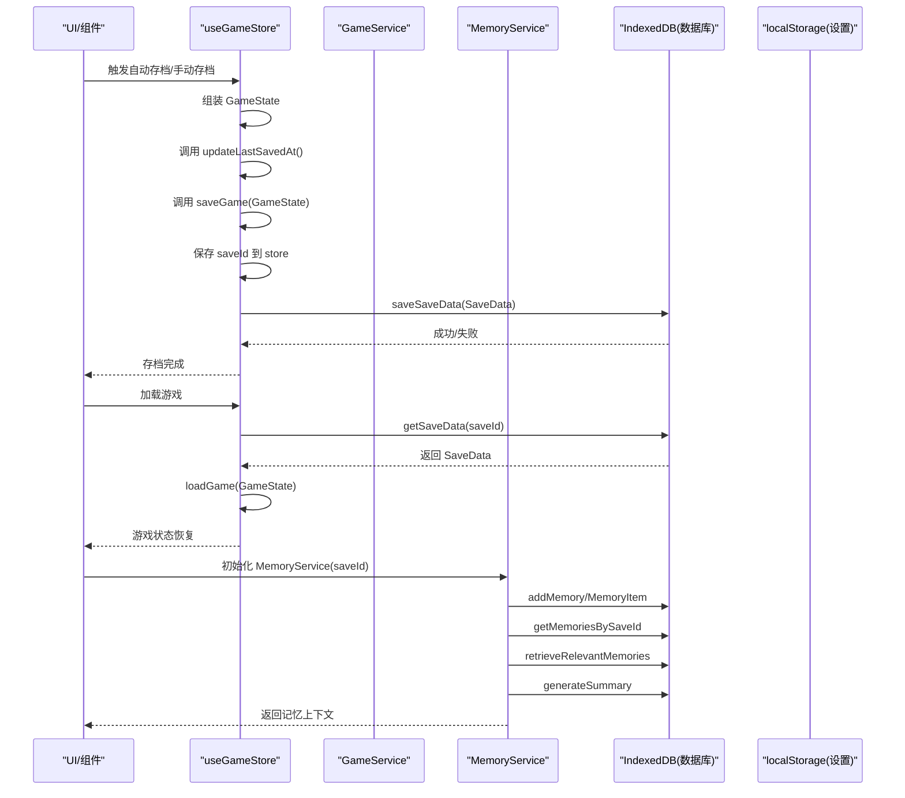
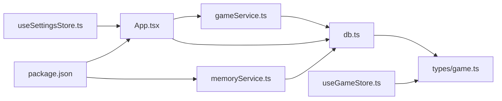

# 数据持久化服务

<cite>
**本文引用的文件**
- [src/services/db.ts](file://src/services/db.ts)
- [src/services/gameService.ts](file://src/services/gameService.ts)
- [src/services/memoryService.ts](file://src/services/memoryService.ts)
- [src/stores/useGameStore.ts](file://src/stores/useGameStore.ts)
- [src/stores/useSettingsStore.ts](file://src/stores/useSettingsStore.ts)
- [src/App.tsx](file://src/App.tsx)
- [src/types/game.ts](file://src/types/game.ts)
- [package.json](file://package.json)
</cite>

## 目录
1. [简介](#简介)
2. [项目结构](#项目结构)
3. [核心组件](#核心组件)
4. [架构总览](#架构总览)
5. [详细组件分析](#详细组件分析)
6. [依赖分析](#依赖分析)
7. [性能考虑](#性能考虑)
8. [故障排查指南](#故障排查指南)
9. [结论](#结论)
10. [附录](#附录)

## 简介
本文件面向“数据持久化服务”的设计与实现，聚焦于 IndexedDB 存储架构、游戏存档机制、数据序列化与反序列化、版本迁移策略、数据完整性与并发控制、存储空间管理、自动与手动存档、恢复校验、性能优化、存储限制与备份恢复、故障恢复等主题。文档同时给出 API 使用示例与最佳实践，帮助开发者快速理解并扩展该持久化体系。

## 项目结构
本项目采用前端纯客户端架构，使用 Zustand 管理运行时状态，使用 IndexedDB 作为本地持久化存储，并通过独立的服务层封装数据库操作与业务逻辑。

图表来源
- [src/App.tsx](file://src/App.tsx#L62-L65)
- [src/services/db.ts](file://src/services/db.ts#L36-L72)
- [src/services/gameService.ts](file://src/services/gameService.ts#L50-L62)
- [src/services/memoryService.ts](file://src/services/memoryService.ts#L16-L25)
- [src/stores/useGameStore.ts](file://src/stores/useGameStore.ts#L84-L224)
- [src/stores/useSettingsStore.ts](file://src/stores/useSettingsStore.ts#L24-L45)
- [src/types/game.ts](file://src/types/game.ts#L235-L251)
- [package.json](file://package.json#L15-L36)

章节来源
- [src/App.tsx](file://src/App.tsx#L16-L122)
- [src/services/db.ts](file://src/services/db.ts#L36-L72)
- [src/services/gameService.ts](file://src/services/gameService.ts#L50-L62)
- [src/services/memoryService.ts](file://src/services/memoryService.ts#L16-L25)
- [src/stores/useGameStore.ts](file://src/stores/useGameStore.ts#L84-L224)
- [src/stores/useSettingsStore.ts](file://src/stores/useSettingsStore.ts#L24-L45)
- [src/types/game.ts](file://src/types/game.ts#L235-L251)
- [package.json](file://package.json#L15-L36)

## 核心组件
- IndexedDB 数据库封装：统一的数据库初始化、对象存储与索引、事务读写、批量操作与清理。
- 游戏存档服务：负责将 GameState 序列化为 SaveData 并持久化，支持加载与删除。
- 记忆服务：基于嵌入向量的记忆检索与摘要生成，支撑 RAG 上下文构建。
- 应用层集成：自动存档、手动存档、恢复校验、主题同步、LLM 配置持久化。

章节来源
- [src/services/db.ts](file://src/services/db.ts#L36-L235)
- [src/services/gameService.ts](file://src/services/gameService.ts#L394-L409)
- [src/services/memoryService.ts](file://src/services/memoryService.ts#L16-L220)
- [src/App.tsx](file://src/App.tsx#L74-L122)

## 架构总览
数据持久化服务围绕 IndexedDB 展开，结合游戏状态与记忆模块，形成“状态-存档-记忆”三层结构。

图表来源
- [src/App.tsx](file://src/App.tsx#L74-L122)
- [src/services/gameService.ts](file://src/services/gameService.ts#L394-L409)
- [src/services/memoryService.ts](file://src/services/memoryService.ts#L83-L188)
- [src/services/db.ts](file://src/services/db.ts#L134-L159)

## 详细组件分析

### IndexedDB 存储架构与数据库模式设计
- 数据库名称与版本
  - 数据库名称固定，版本号用于升级路径。
- 对象存储（表）与键路径
  - saves：键路径为 id，索引 timestamp。
  - saveData：键路径为 saveId，用于按存档 ID 存取完整 GameState。
  - memories：键路径为 id，索引 saveId、timestamp、importance。
- 设计理念
  - 分离“存档元数据”和“存档数据”，便于管理与扩展。
  - 记忆表建立多维索引，支持高效检索与重要性过滤。
- 版本迁移策略
  - 当对象存储不存在时，在 onupgradeneeded 中创建并建立索引，保持幂等。
- 并发与事务
  - 通过 getStore(mode) 明确读写模式，避免跨事务竞争。
  - 批量操作使用 Promise.all 并发提交，减少往返延迟。
- 数据完整性
  - 通过索引约束与唯一性设计，确保查询稳定性。
  - 删除存档时联动清理对应 saveData 与 memories，避免悬挂数据。

章节来源
- [src/services/db.ts](file://src/services/db.ts#L3-L10)
- [src/services/db.ts](file://src/services/db.ts#L39-L72)
- [src/services/db.ts](file://src/services/db.ts#L74-L83)
- [src/services/db.ts](file://src/services/db.ts#L121-L129)
- [src/services/db.ts](file://src/services/db.ts#L170-L173)

### 表结构定义与索引策略
- saves
  - 主键：id
  - 索引：timestamp（降序排序，便于最新存档展示）
- saveData
  - 主键：saveId
  - 用途：整存整取 GameState
- memories
  - 主键：id
  - 索引：saveId（按存档筛选）、timestamp（时间倒序）、importance（重要性排序）

章节来源
- [src/services/db.ts](file://src/services/db.ts#L55-L69)
- [src/types/game.ts](file://src/types/game.ts#L12-L34)
- [src/types/game.ts](file://src/types/game.ts#L63-L71)

### 游戏存档机制：序列化与反序列化
- 序列化
  - 将 GameState 序列化为 SaveData，包含 saveId 与 data 字段。
- 反序列化
  - 从 IndexedDB 读取 SaveData，提取 data 字段还原 GameState。
- 存档元数据
  - SaveMeta 用于列表展示与管理，包含名称、时间戳、境界、摘要等。

章节来源
- [src/services/gameService.ts](file://src/services/gameService.ts#L394-L409)
- [src/services/db.ts](file://src/services/db.ts#L134-L150)
- [src/types/game.ts](file://src/types/game.ts#L235-L251)
- [src/types/game.ts](file://src/types/game.ts#L12-L19)

### 自动存档与手动存档
- 自动存档
  - 每 30 秒触发一次，且每次玩家行动后也会触发。
  - 通过 App.tsx 的回调函数实现，调用 GameService.saveGame。
- 手动存档
  - 在 UI 中提供手动触发入口，流程与自动一致。
- 恢复校验
  - 加载时先从 IndexedDB 读取，再调用 store.loadGame 进行状态合并。
  - 若无存档数据则视为新游戏。

章节来源
- [src/App.tsx](file://src/App.tsx#L74-L122)
- [src/services/gameService.ts](file://src/services/gameService.ts#L394-L409)
- [src/services/db.ts](file://src/services/db.ts#L134-L150)

### 记忆系统与检索（RAG）
- 记忆项结构
  - 包含 content、embedding、timestamp、importance、saveId 等。
- 嵌入生成
  - 使用 @xenova/transformers 的特征提取模型生成向量，失败时回退到简单哈希向量。
- 相似度计算
  - 余弦相似度，支持按查询检索 TopK 相关记忆。
- 摘要生成
  - 当记忆数量超过阈值时，对旧记忆进行摘要生成，降低检索成本。
- 工作记忆
  - 最近若干条记忆优先用于上下文，提升响应速度。

章节来源
- [src/services/memoryService.ts](file://src/services/memoryService.ts#L16-L220)
- [src/services/db.ts](file://src/services/db.ts#L161-L225)
- [package.json](file://package.json#L23)

### 数据完整性保证机制
- 键路径与索引
  - 通过 keyPath 与索引确保查询稳定性与性能。
- 删除联动
  - 删除存档时，自动清理对应 saveData 与 memories，避免悬挂数据。
- 默认值与健壮性
  - 在业务层对数值字段进行安全转换，防止 NaN 或异常值进入存储。

章节来源
- [src/services/db.ts](file://src/services/db.ts#L55-L69)
- [src/services/db.ts](file://src/services/db.ts#L121-L129)
- [src/services/gameService.ts](file://src/services/gameService.ts#L346-L372)

### 并发访问控制
- 事务模式
  - 读写分离：只读使用 readonly，写入使用 readwrite。
- 批量写入
  - addMemories 使用 Promise.all 并发提交，减少 I/O 往返。
- 读取排序
  - 通过索引与排序组合，避免全表扫描。

章节来源
- [src/services/db.ts](file://src/services/db.ts#L74-L83)
- [src/services/db.ts](file://src/services/db.ts#L170-L173)
- [src/services/db.ts](file://src/services/db.ts#L175-L189)

### 存储空间管理策略
- 记忆清理
  - 保留高重要性记忆与近期记忆，其余定期清理（当前实现为占位，可扩展）。
- 摘要机制
  - 当记忆数量超过阈值时生成摘要，降低存储与检索成本。
- 嵌入回退
  - 无模型时使用简单哈希向量，避免功能中断。

章节来源
- [src/services/memoryService.ts](file://src/services/memoryService.ts#L196-L215)
- [src/services/memoryService.ts](file://src/services/memoryService.ts#L144-L173)
- [src/services/memoryService.ts](file://src/services/memoryService.ts#L58-L68)

### 版本迁移策略
- 升级路径
  - 在 onupgradeneeded 中检测对象存储是否存在，不存在则创建并建立索引。
- 兼容性
  - 通过版本号与条件判断，确保新增索引与表结构的幂等创建。

章节来源
- [src/services/db.ts](file://src/services/db.ts#L52-L70)

### API 使用示例与最佳实践
- 初始化数据库
  - 在应用启动时调用 db.init()，确保 IndexedDB 可用。
- 保存存档
  - 使用 GameService.saveGame(GameState) 将当前状态持久化。
- 加载存档
  - 使用 GameService.loadGame(saveId) 读取并恢复 GameState。
- 手动触发存档
  - 在 UI 中绑定按钮，调用相同流程。
- 记忆检索
  - 使用 MemoryService.buildMemoryContext(query) 获取工作记忆、相关记忆与摘要。
- 最佳实践
  - 仅在必要时进行存档，避免频繁写入。
  - 使用批量写入 addMemories 替代多次 addMemory。
  - 对数值字段进行安全转换，防止 NaN。
  - 在删除存档时，确保联动清理 saveData 与 memories。

章节来源
- [src/App.tsx](file://src/App.tsx#L62-L65)
- [src/services/gameService.ts](file://src/services/gameService.ts#L394-L409)
- [src/services/memoryService.ts](file://src/services/memoryService.ts#L175-L188)
- [src/services/db.ts](file://src/services/db.ts#L170-L173)

## 依赖分析
- IndexedDB 与浏览器能力
  - 本项目直接使用浏览器内置 IndexedDB，无需额外依赖。
- 记忆嵌入
  - 使用 @xenova/transformers 进行特征提取，失败时回退到简单哈希向量。
- 状态持久化
  - 游戏状态使用 Zustand 的 persist 中间件，设置状态使用 localStorage。

图表来源
- [src/services/db.ts](file://src/services/db.ts#L1-L2)
- [src/services/gameService.ts](file://src/services/gameService.ts#L4)
- [src/services/memoryService.ts](file://src/services/memoryService.ts#L2-L3)
- [src/App.tsx](file://src/App.tsx#L9)
- [src/stores/useGameStore.ts](file://src/stores/useGameStore.ts#L1-L11)
- [src/stores/useSettingsStore.ts](file://src/stores/useSettingsStore.ts#L1-L3)
- [package.json](file://package.json#L23)

章节来源
- [src/services/db.ts](file://src/services/db.ts#L1-L2)
- [src/services/gameService.ts](file://src/services/gameService.ts#L4)
- [src/services/memoryService.ts](file://src/services/memoryService.ts#L2-L3)
- [src/App.tsx](file://src/App.tsx#L9)
- [src/stores/useGameStore.ts](file://src/stores/useGameStore.ts#L1-L11)
- [src/stores/useSettingsStore.ts](file://src/stores/useSettingsStore.ts#L1-L3)
- [package.json](file://package.json#L23)

## 性能考虑
- 批量操作
  - addMemories 使用 Promise.all 并发写入，显著降低延迟。
- 事务处理
  - 通过明确的 readwrite/readonly 模式，避免锁冲突。
- 查询优化
  - 利用索引（timestamp、saveId、importance）进行高效筛选与排序。
- 摘要与工作记忆
  - 通过摘要与工作记忆减少检索范围，提高响应速度。
- 嵌入回退
  - 无模型时使用简单哈希向量，保证功能可用性。

章节来源
- [src/services/db.ts](file://src/services/db.ts#L170-L173)
- [src/services/db.ts](file://src/services/db.ts#L175-L189)
- [src/services/memoryService.ts](file://src/services/memoryService.ts#L144-L173)
- [src/services/memoryService.ts](file://src/services/memoryService.ts#L58-L68)

## 故障排查指南
- IndexedDB 初始化失败
  - 检查浏览器兼容性与权限，确认 db.init() 调用位置正确。
- 存档写入失败
  - 查看 onerror 回调与 reject 错误信息，确认事务模式与键路径。
- 记忆检索为空
  - 确认嵌入模型加载成功，或检查回退逻辑是否生效。
- 自动存档未触发
  - 检查 interval 是否创建，以及 saveId 与 player 是否存在。
- 恢复状态异常
  - 确认 SaveData 结构与 GameState 字段匹配，避免缺失字段导致解析错误。

章节来源
- [src/services/db.ts](file://src/services/db.ts#L43-L50)
- [src/services/db.ts](file://src/services/db.ts#L87-L91)
- [src/services/memoryService.ts](file://src/services/memoryService.ts#L28-L37)
- [src/App.tsx](file://src/App.tsx#L113-L122)
- [src/services/gameService.ts](file://src/services/gameService.ts#L394-L409)

## 结论
本数据持久化服务以 IndexedDB 为核心，结合 GameState 的整存整取与记忆系统的 RAG 检索，实现了高效、可扩展的本地存档方案。通过明确的事务模式、批量写入、索引优化与摘要机制，兼顾了性能与可靠性。未来可在记忆清理策略、版本迁移扩展与存储限额告警等方面进一步增强。

## 附录
- API 一览
  - db.init()
  - db.addSave/save/update/get/delete
  - db.saveSaveData/getSaveData/deleteSaveData
  - db.addMemory/addMemories/getMemoriesBySaveId/getMemoriesByImportance/deleteMemoriesBySaveId
  - gameService.saveGame/loadGame
  - memoryService.buildMemoryContext/retrieveRelevantMemories/generateSummary/cleanupOldMemories
- 最佳实践清单
  - 使用 Promise.all 执行批量写入
  - 明确 readwrite/readonly 事务模式
  - 对数值字段进行安全转换
  - 定期清理旧记忆，保留高重要性与近期记忆
  - 在删除存档时联动清理 saveData 与 memories