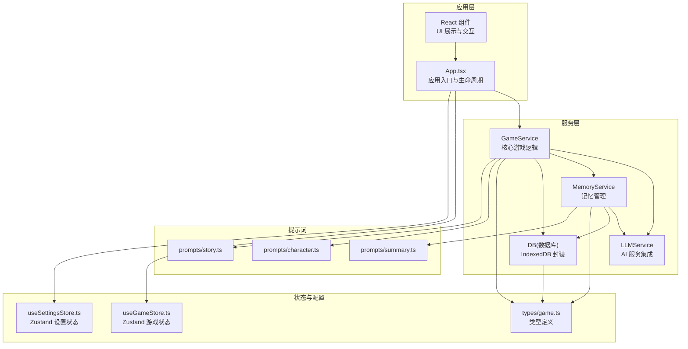
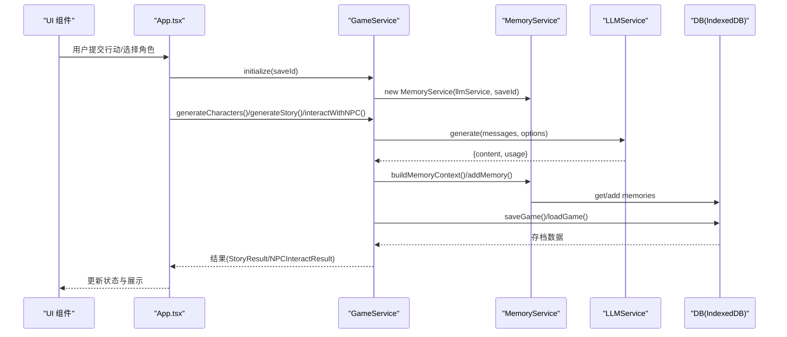
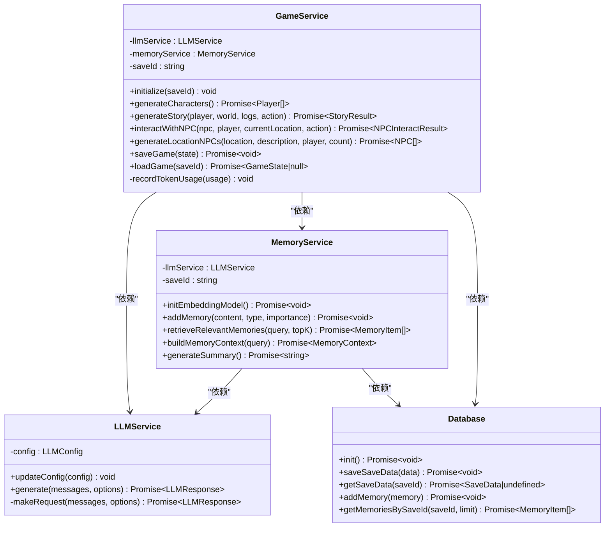
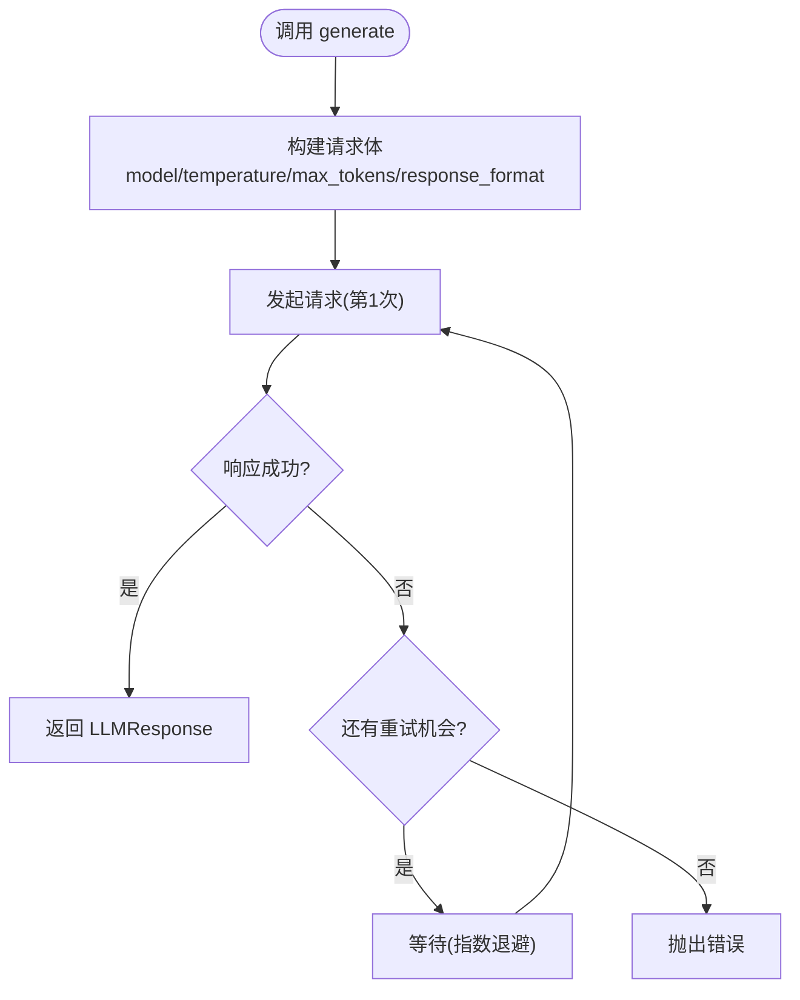
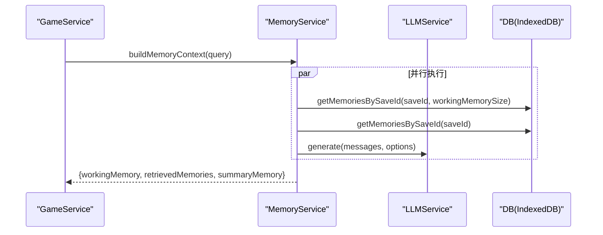
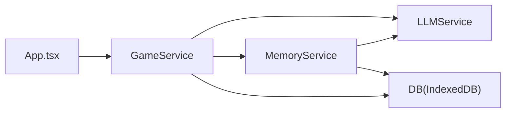

# 服务层架构

<cite>
**本文引用的文件**
- [gameService.ts](file://src/services/gameService.ts)
- [llmService.ts](file://src/services/llmService.ts)
- [memoryService.ts](file://src/services/memoryService.ts)
- [db.ts](file://src/services/db.ts)
- [App.tsx](file://src/App.tsx)
- [useGameStore.ts](file://src/stores/useGameStore.ts)
- [useSettingsStore.ts](file://src/stores/useSettingsStore.ts)
- [game.ts](file://src/types/game.ts)
- [character.ts](file://src/prompts/character.ts)
- [story.ts](file://src/prompts/story.ts)
- [summary.ts](file://src/prompts/summary.ts)
- [package.json](file://package.json)
</cite>

## 目录
1. [简介](#简介)
2. [项目结构](#项目结构)
3. [核心组件](#核心组件)
4. [架构总览](#架构总览)
5. [详细组件分析](#详细组件分析)
6. [依赖关系分析](#依赖关系分析)
7. [性能考虑](#性能考虑)
8. [故障排除指南](#故障排除指南)
9. [结论](#结论)
10. [附录](#附录)

## 简介
本文件面向“修仙 Roguelike”项目的前端服务层，系统化梳理四层服务架构：GameService 核心游戏逻辑服务、LLMService AI 服务集成、MemoryService 记忆管理系统、DB 数据持久化服务。文档重点阐述：
- 各服务的职责边界与接口设计
- 依赖注入模式与初始化流程
- 服务间协作关系与数据流
- 错误处理策略与异步操作管理
- 可测试性设计、Mock 策略与服务替换机制
- 配置管理、性能监控与故障恢复机制

## 项目结构
项目采用按职责分层的服务组织方式，核心服务位于 src/services，类型定义位于 src/types，全局状态管理位于 src/stores，提示词位于 src/prompts，应用入口位于 src/App.tsx。

图表来源
- [App.tsx](file://src/App.tsx#L16-L122)
- [gameService.ts](file://src/services/gameService.ts#L50-L62)
- [llmService.ts](file://src/services/llmService.ts#L18-L27)
- [memoryService.ts](file://src/services/memoryService.ts#L16-L25)
- [db.ts](file://src/services/db.ts#L36-L72)
- [useGameStore.ts](file://src/stores/useGameStore.ts#L84-L225)
- [useSettingsStore.ts](file://src/stores/useSettingsStore.ts#L24-L45)
- [game.ts](file://src/types/game.ts#L1-L319)
- [character.ts](file://src/prompts/character.ts#L1-L97)
- [story.ts](file://src/prompts/story.ts#L1-L147)
- [summary.ts](file://src/prompts/summary.ts#L1-L26)

章节来源
- [App.tsx](file://src/App.tsx#L16-L122)
- [gameService.ts](file://src/services/gameService.ts#L50-L62)
- [memoryService.ts](file://src/services/memoryService.ts#L16-L25)
- [db.ts](file://src/services/db.ts#L36-L72)
- [useGameStore.ts](file://src/stores/useGameStore.ts#L84-L225)
- [useSettingsStore.ts](file://src/stores/useSettingsStore.ts#L24-L45)
- [game.ts](file://src/types/game.ts#L1-L319)

## 核心组件
- GameService：核心游戏逻辑编排，协调 LLMService 与 MemoryService，负责角色生成、剧情推演、NPC 交互、存档加载与保存。
- LLMService：LLM 请求封装，统一温度、最大令牌、响应格式等参数，内置指数退避重试与错误传播。
- MemoryService：记忆管理与检索，支持工作记忆、RAG 相似度检索、摘要生成与嵌入向量计算。
- DB：IndexedDB 封装，提供存档、存档数据、记忆的增删查改与索引查询。

章节来源
- [gameService.ts](file://src/services/gameService.ts#L50-L541)
- [llmService.ts](file://src/services/llmService.ts#L18-L101)
- [memoryService.ts](file://src/services/memoryService.ts#L16-L224)
- [db.ts](file://src/services/db.ts#L36-L236)

## 架构总览
四层服务通过依赖注入与工厂函数组合，形成清晰的职责边界与调用链。应用入口负责初始化与生命周期管理，服务层负责业务编排与数据持久化。

图表来源
- [App.tsx](file://src/App.tsx#L124-L237)
- [gameService.ts](file://src/services/gameService.ts#L59-L62)
- [gameService.ts](file://src/services/gameService.ts#L75-L119)
- [gameService.ts](file://src/services/gameService.ts#L284-L391)
- [gameService.ts](file://src/services/gameService.ts#L416-L469)
- [memoryService.ts](file://src/services/memoryService.ts#L176-L188)
- [llmService.ts](file://src/services/llmService.ts#L29-L55)
- [db.ts](file://src/services/db.ts#L134-L150)

## 详细组件分析

### GameService 分析
- 职责边界
  - 角色生成：调用 LLM 生成角色 JSON，补全默认属性并返回 Player 数组。
  - 剧情推演：构建记忆上下文，调用 LLM 生成 StoryResult，记录关键事件与 NPC 结识的记忆。
  - NPC 交互：根据系统提示词与上下文生成对话与交互结果，更新双方状态与记忆。
  - 存档管理：保存完整 GameState 至 IndexedDB，加载存档并恢复状态。
  - 工具方法：生成随机名字、统计面板、唯一 ID。
- 接口设计
  - initialize(saveId)：初始化并创建 MemoryService。
  - generateCharacters()：返回 Player[]。
  - generateStory(player, world, logs, action)：返回 StoryResult。
  - interactWithNPC(npc, player, currentLocation, action)：返回 NPCInteractResult。
  - generateLocationNPCs(location, description, player, count)：返回 NPC[]。
  - saveGame(state)/loadGame(saveId)：异步存档与加载。
- 依赖注入
  - 通过构造函数注入 LLMService，内部惰性创建 MemoryService。
- 错误处理
  - 未初始化时抛错；LLM 调用失败时重试并最终抛错；StoryResult 默认值兜底。
- 异步与并发
  - 多处异步调用，Promise.all 并行检索与摘要生成。
- 可测试性
  - 提供 createGameService 工厂函数；可注入 Mock LLMService 与 MemoryService。
  - 单元测试可通过替换 llmService 实现进行隔离测试。

图表来源
- [gameService.ts](file://src/services/gameService.ts#L50-L541)
- [llmService.ts](file://src/services/llmService.ts#L18-L101)
- [memoryService.ts](file://src/services/memoryService.ts#L16-L224)
- [db.ts](file://src/services/db.ts#L36-L236)

章节来源
- [gameService.ts](file://src/services/gameService.ts#L50-L541)
- [character.ts](file://src/prompts/character.ts#L1-L97)
- [story.ts](file://src/prompts/story.ts#L1-L147)

### LLMService 分析
- 职责边界
  - 统一封装 LLM 请求，支持温度、最大令牌、响应格式等参数。
  - 内置指数退避重试（最多 3 次），失败时抛出错误。
- 接口设计
  - generate(messages, options)：返回 LLMResponse，包含 content 与 usage。
  - updateConfig(config)：动态更新配置。
- 错误处理
  - 非 2xx 响应抛出错误；重试后仍失败抛出聚合错误。
- 异步与并发
  - 单次请求为串行重试，不涉及并发。
- 可测试性
  - 提供 createLLMService 工厂；可注入 Mock fetch 实现。

图表来源
- [llmService.ts](file://src/services/llmService.ts#L29-L55)

章节来源
- [llmService.ts](file://src/services/llmService.ts#L18-L101)

### MemoryService 分析
- 职责边界
  - 记忆增删查：addMemory、getMemoriesBySaveId、deleteMemoriesBySaveId。
  - RAG 相似度检索：generateEmbedding + 余弦相似度评分。
  - 摘要生成：当记忆数量超过阈值时，调用 LLM 生成摘要。
  - 工作记忆：限制最近 N 条记忆参与上下文。
- 接口设计
  - initEmbeddingModel()/generateEmbedding(text)：嵌入向量生成。
  - retrieveRelevantMemories(query, topK)：返回 TopK 相关记忆。
  - buildMemoryContext(query)：组装工作记忆、检索记忆与摘要。
  - generateSummary()：生成摘要。
- 错误处理
  - 嵌入模型加载失败时降级为简单哈希向量；摘要生成异常时返回空字符串。
- 异步与并发
  - 并行执行工作记忆、检索记忆与摘要生成。
- 可测试性
  - 提供 createMemoryService 工厂；可注入 Mock LLMService 与 DB。

图表来源
- [memoryService.ts](file://src/services/memoryService.ts#L176-L188)
- [memoryService.ts](file://src/services/memoryService.ts#L145-L173)
- [memoryService.ts](file://src/services/memoryService.ts#L140-L142)

章节来源
- [memoryService.ts](file://src/services/memoryService.ts#L16-L224)
- [summary.ts](file://src/prompts/summary.ts#L1-L26)

### DB(IndexedDB) 分析
- 职责边界
  - 提供存档元数据、存档数据、记忆三类对象存储。
  - 支持增删查改与索引查询（saveId、timestamp、importance）。
- 接口设计
  - init()：打开数据库并创建对象存储。
  - addSave/updateSave/getSave/getAllSaves/deleteSave：存档元数据 CRUD。
  - saveSaveData/getSaveData/deleteSaveData：存档数据 CRUD。
  - addMemory/getMemoriesBySaveId/getMemoriesByImportance/deleteMemoriesBySaveId：记忆 CRUD。
- 错误处理
  - 所有操作均通过 Promise 包裹并在失败时抛出错误。
- 异步与并发
  - 单条操作为 Promise；批量操作使用 Promise.all。
- 可测试性
  - 通过工厂导出单例实例；可在测试中替换为内存实现。

章节来源
- [db.ts](file://src/services/db.ts#L36-L236)

## 依赖关系分析
- 依赖注入模式
  - App.tsx 通过工厂函数创建 LLMService 与 GameService，避免全局单例耦合。
  - GameService 在 initialize 时注入 MemoryService，MemoryService 注入 LLMService 与 DB。
- 直接与间接依赖
  - GameService 直接依赖 LLMService 与 MemoryService；间接依赖 DB。
  - MemoryService 直接依赖 LLMService 与 DB。
- 循环依赖
  - 未发现循环依赖；服务间为单向依赖。
- 外部依赖与集成点
  - @xenova/transformers：用于嵌入向量生成（可降级）。
  - IndexedDB：本地持久化。
  - fetch：LLM API 调用。

图表来源
- [App.tsx](file://src/App.tsx#L67-L72)
- [gameService.ts](file://src/services/gameService.ts#L50-L62)
- [memoryService.ts](file://src/services/memoryService.ts#L16-L25)
- [db.ts](file://src/services/db.ts#L36-L72)

章节来源
- [App.tsx](file://src/App.tsx#L67-L72)
- [package.json](file://package.json#L23-L35)

## 性能考虑
- 嵌入向量生成
  - 首次加载 @xenova/transformers，失败时降级为简单哈希向量，避免阻塞。
  - 生成向量与相似度计算为 O(N) 评分，TopK 选择降低后续处理成本。
- 并行化
  - MemoryService 的工作记忆、检索记忆与摘要生成使用 Promise.all 并行执行。
- 重试与退避
  - LLMService 指数退避重试，减少瞬时错误对用户体验的影响。
- 存储优化
  - IndexedDB 索引（saveId、timestamp、importance）支持高效查询。
  - 记忆清理策略：保留高重要性与最近记忆，避免无限增长。
- 主题与 UI
  - 主题切换通过设置状态同步到 html class，避免重复渲染。

章节来源
- [memoryService.ts](file://src/services/memoryService.ts#L27-L37)
- [memoryService.ts](file://src/services/memoryService.ts#L176-L188)
- [llmService.ts](file://src/services/llmService.ts#L37-L55)
- [db.ts](file://src/services/db.ts#L64-L69)
- [App.tsx](file://src/App.tsx#L22-L28)

## 故障排除指南
- LLM 调用失败
  - 现象：generate 抛错，控制台输出警告。
  - 处理：检查 baseURL、apiKey、model；确认网络连通；查看重试日志。
- 记忆检索为空
  - 现象：buildMemoryContext 返回空检索结果。
  - 处理：确认 saveId 正确；检查记忆是否已写入；验证嵌入向量生成是否成功。
- 剧情推演异常
  - 现象：generateStory 返回默认值或报错。
  - 处理：检查提示词格式；确认 LLM 返回有效 JSON；验证 MemoryService 初始化。
- 存档读写失败
  - 现象：saveGame/loadGame 抛错。
  - 处理：确认 IndexedDB 初始化成功；检查对象存储是否存在；查看事务错误。
- 自动存档未触发
  - 现象：未按预期保存。
  - 处理：确认 gamePhase 为 game；检查 autoSaveInitialized 标记；验证定时器是否启动。

章节来源
- [llmService.ts](file://src/services/llmService.ts#L40-L55)
- [memoryService.ts](file://src/services/memoryService.ts#L122-L137)
- [gameService.ts](file://src/services/gameService.ts#L284-L391)
- [db.ts](file://src/services/db.ts#L134-L150)
- [App.tsx](file://src/App.tsx#L74-L122)

## 结论
本服务层架构以 GameService 为核心，通过 LLMService 与 MemoryService 实现“剧情推演 + 记忆检索”的闭环，DB 提供可靠的数据持久化。整体设计遵循单一职责与依赖注入原则，具备良好的可测试性与可替换性。建议后续增强：
- 为 LLMService 增加速率限制与队列控制。
- MemoryService 增加记忆删除接口以支持清理策略。
- 增加服务层单元测试覆盖率，特别是 LLMService 与 MemoryService 的 Mock 场景。

## 附录

### 服务初始化流程
- 应用启动：初始化 IndexedDB。
- 创建服务：根据设置状态创建 LLMService，再创建 GameService。
- 初始化游戏：调用 GameService.initialize(saveId)，创建 MemoryService。
- 开始游戏：生成初始 NPC 与剧情，进入主循环。

章节来源
- [App.tsx](file://src/App.tsx#L63-L72)
- [App.tsx](file://src/App.tsx#L124-L161)
- [App.tsx](file://src/App.tsx#L172-L237)
- [gameService.ts](file://src/services/gameService.ts#L59-L62)

### 配置管理
- LLM 配置：通过 useSettingsStore 管理 baseURL、apiKey、model。
- 主题配置：通过 useSettingsStore 管理 light/dark 主题。
- 环境变量：优先使用 import.meta.env.VITE_*，否则使用默认值。

章节来源
- [useSettingsStore.ts](file://src/stores/useSettingsStore.ts#L12-L16)
- [useSettingsStore.ts](file://src/stores/useSettingsStore.ts#L24-L45)
- [App.tsx](file://src/App.tsx#L57-L58)

### 错误处理策略
- LLMService：指数退避重试，最终抛错。
- MemoryService：嵌入模型加载失败降级；摘要生成异常返回空字符串。
- GameService：未初始化抛错；StoryResult 默认值兜底。
- DB：所有操作失败抛错，便于上层捕获。

章节来源
- [llmService.ts](file://src/services/llmService.ts#L37-L55)
- [memoryService.ts](file://src/services/memoryService.ts#L27-L37)
- [memoryService.ts](file://src/services/memoryService.ts#L162-L173)
- [gameService.ts](file://src/services/gameService.ts#L290-L292)
- [db.ts](file://src/services/db.ts#L86-L91)

### 异步操作管理
- 并行执行：MemoryService 的工作记忆、检索与摘要生成。
- 定时任务：自动存档每 30 秒一次，以及每次行动后触发。
- 状态更新：使用 Zustand store 管理全局状态，避免重复渲染。

章节来源
- [memoryService.ts](file://src/services/memoryService.ts#L176-L188)
- [App.tsx](file://src/App.tsx#L107-L122)
- [useGameStore.ts](file://src/stores/useGameStore.ts#L84-L225)

### 可测试性设计与 Mock 策略
- 工厂函数：createGameService、createLLMService、createMemoryService。
- Mock 策略：
  - LLMService：Mock fetch 返回固定响应与 usage。
  - MemoryService：Mock generateEmbedding 返回固定向量；Mock DB 方法。
  - GameService：注入 Mock MemoryService 与 DB，验证剧情推演与存档流程。
- 服务替换机制：通过工厂函数与依赖注入，可在测试环境中替换任意服务实现。

章节来源
- [gameService.ts](file://src/services/gameService.ts#L540-L541)
- [llmService.ts](file://src/services/llmService.ts#L100-L101)
- [memoryService.ts](file://src/services/memoryService.ts#L222-L223)