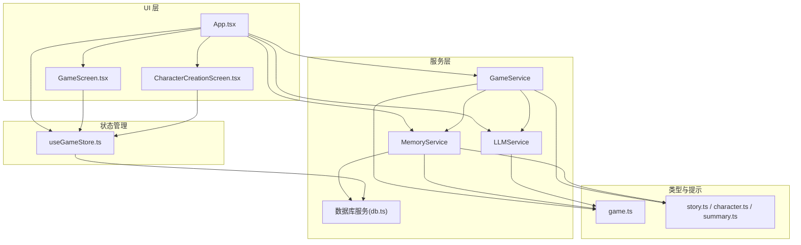
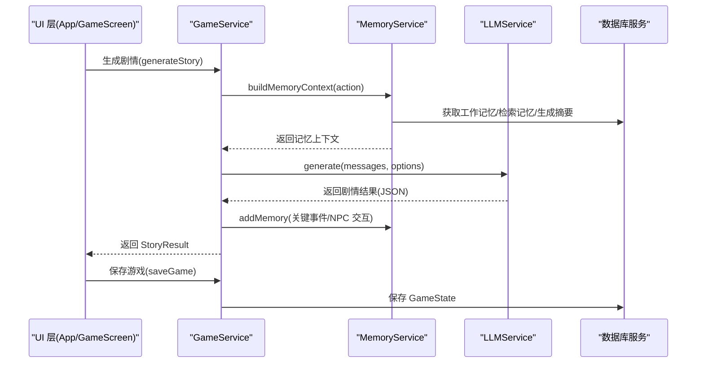
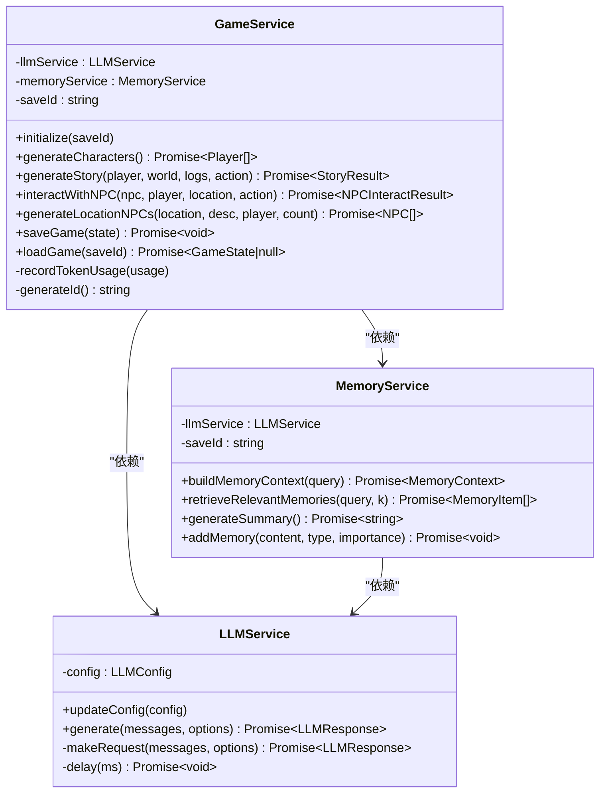
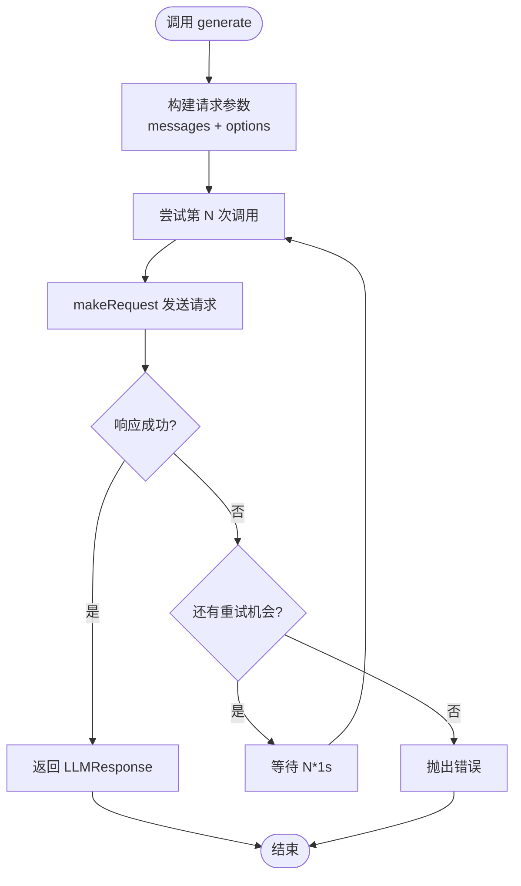
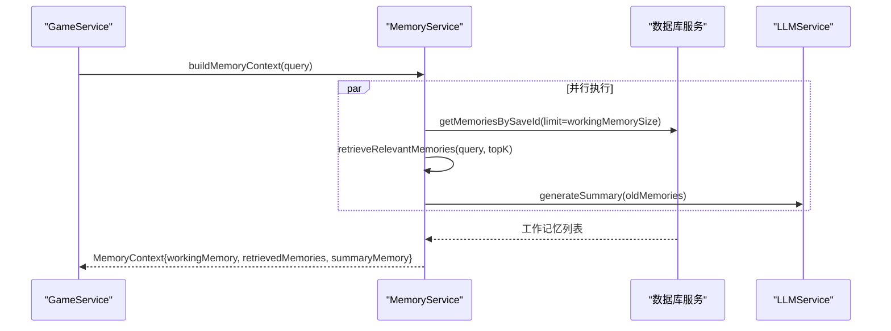
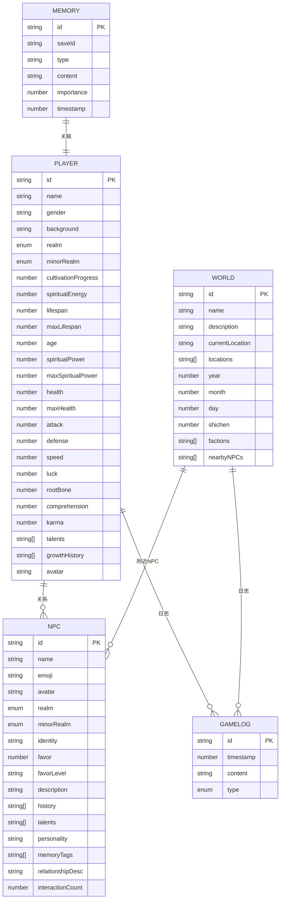
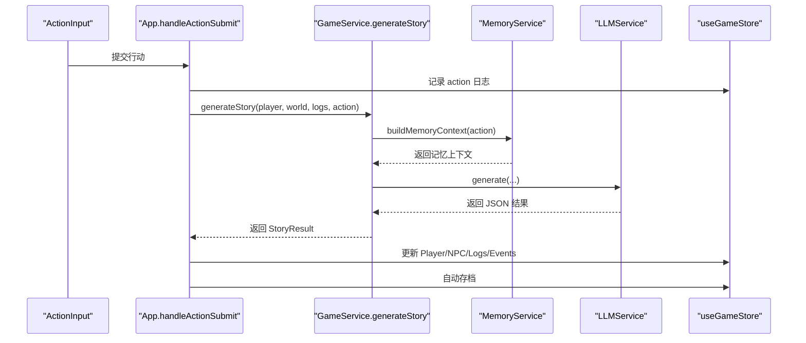
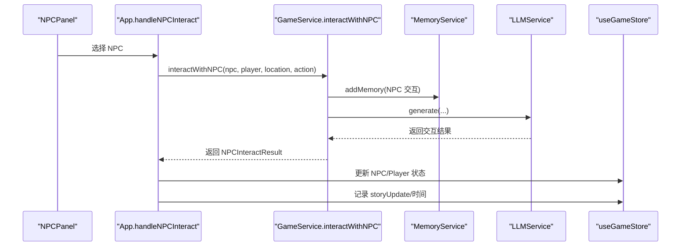
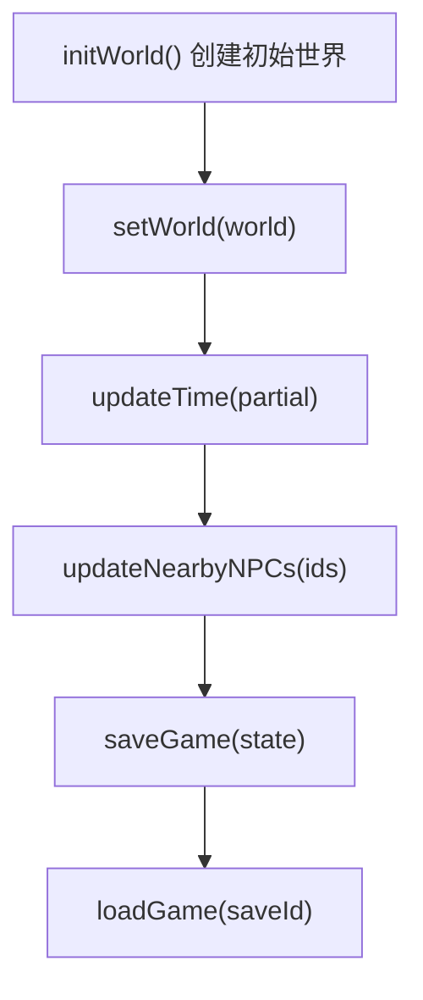
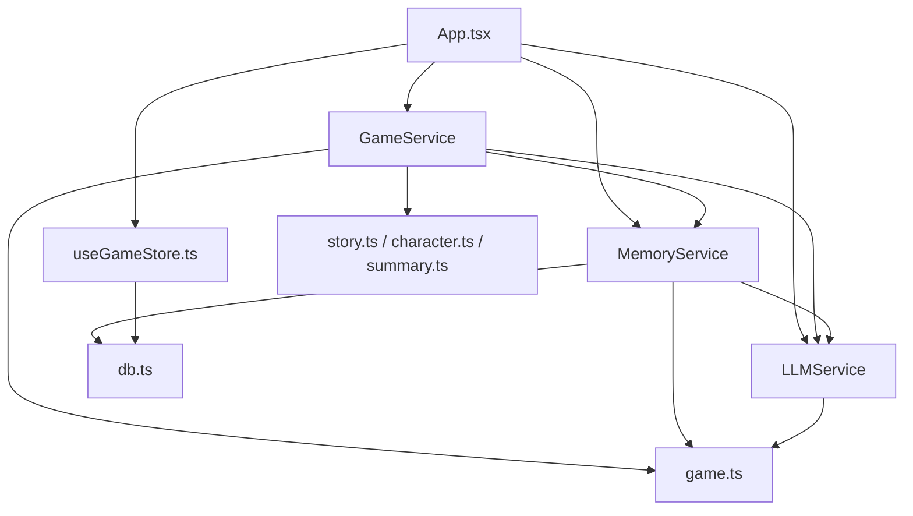

# 游戏核心服务

<cite>
**本文引用的文件**
- [gameService.ts](file://src/services/gameService.ts)
- [llmService.ts](file://src/services/llmService.ts)
- [memoryService.ts](file://src/services/memoryService.ts)
- [db.ts](file://src/services/db.ts)
- [game.ts](file://src/types/game.ts)
- [useGameStore.ts](file://src/stores/useGameStore.ts)
- [App.tsx](file://src/App.tsx)
- [GameScreen.tsx](file://src/components/GameScreen.tsx)
- [CharacterCreationScreen.tsx](file://src/components/CharacterCreationScreen.tsx)
- [story.ts](file://src/prompts/story.ts)
- [character.ts](file://src/prompts/character.ts)
- [summary.ts](file://src/prompts/summary.ts)
</cite>

## 目录
1. [简介](#简介)
2. [项目结构](#项目结构)
3. [核心组件](#核心组件)
4. [架构概览](#架构概览)
5. [详细组件分析](#详细组件分析)
6. [依赖关系分析](#依赖关系分析)
7. [性能考虑](#性能考虑)
8. [故障排除指南](#故障排除指南)
9. [结论](#结论)
10. [附录](#附录)

## 简介
本文件为游戏核心服务的详细技术文档，重点阐述 GameService 的核心职责与实现细节，包括：
- AI 驱动的剧情生成算法
- NPC 交互处理机制
- 世界状态管理逻辑
- 游戏循环执行流程
- 行动解析器工作原理
- 状态转换规则实现
- 与 LLMService 和 MemoryService 的协作模式
- 数据传递、接口调用与错误处理策略
- 游戏事件处理机制与异步操作管理
- 性能优化技巧与调试方法

## 项目结构
该项目采用模块化架构，主要分为以下层次：
- 服务层：LLMService、GameService、MemoryService、数据库服务
- 类型定义：统一的数据结构与枚举类型
- 状态管理：Zustand store 管理游戏全局状态
- UI 层：React 组件负责用户交互与展示
- 提示词层：预定义的系统提示与生成提示

**图表来源**
- [App.tsx](file://src/App.tsx#L67-L72)
- [gameService.ts](file://src/services/gameService.ts#L50-L62)
- [memoryService.ts](file://src/services/memoryService.ts#L16-L25)
- [db.ts](file://src/services/db.ts#L36-L72)
- [game.ts](file://src/types/game.ts#L110-L251)
- [story.ts](file://src/prompts/story.ts#L1-L49)
- [character.ts](file://src/prompts/character.ts#L1-L58)
- [summary.ts](file://src/prompts/summary.ts#L1-L26)

**章节来源**
- [App.tsx](file://src/App.tsx#L67-L72)
- [gameService.ts](file://src/services/gameService.ts#L50-L62)
- [memoryService.ts](file://src/services/memoryService.ts#L16-L25)
- [db.ts](file://src/services/db.ts#L36-L72)
- [game.ts](file://src/types/game.ts#L110-L251)

## 核心组件
本节概述三大核心服务及其职责：
- GameService：负责角色生成、剧情生成、NPC 交互、世界状态管理与持久化
- LLMService：封装 LLM API 调用，提供重试机制与配置管理
- MemoryService：实现记忆的嵌入向量生成、检索、摘要与持久化

关键接口与职责：
- 角色生成：generateCharacters、generatePersonalityOptions、generateTalentOptions
- 剧情生成：generateStory（构建记忆上下文、调用 LLM、应用结果到状态）
- NPC 交互：interactWithNPC、generateLocationNPCs
- 世界状态管理：saveGame、loadGame、updateTime
- 记忆管理：buildMemoryContext、retrieveRelevantMemories、generateSummary

**章节来源**
- [gameService.ts](file://src/services/gameService.ts#L75-L119)
- [gameService.ts](file://src/services/gameService.ts#L283-L391)
- [gameService.ts](file://src/services/gameService.ts#L415-L469)
- [gameService.ts](file://src/services/gameService.ts#L471-L537)
- [llmService.ts](file://src/services/llmService.ts#L29-L55)
- [memoryService.ts](file://src/services/memoryService.ts#L175-L188)

## 架构概览
游戏核心服务的整体架构如下：

**图表来源**
- [gameService.ts](file://src/services/gameService.ts#L283-L391)
- [memoryService.ts](file://src/services/memoryService.ts#L175-L188)
- [llmService.ts](file://src/services/llmService.ts#L29-L55)
- [db.ts](file://src/services/db.ts#L134-L150)

## 详细组件分析

### GameService 组件分析
GameService 是整个游戏的核心协调者，负责：
- 角色生成：通过 LLM 生成角色 JSON，填充默认值并确保字段完整性
- 剧情生成：构建记忆上下文，调用 LLM 生成剧情，应用结果到玩家状态与世界状态
- NPC 交互：根据玩家与 NPC 的互动生成对话与状态变更
- 世界状态管理：保存/加载游戏状态，更新时间与回合数
- 记忆记录：将关键事件与 NPC 交互写入 MemoryService

关键实现要点：
- 记忆上下文构建：通过 MemoryService 的 buildMemoryContext 并行获取工作记忆、检索记忆与摘要
- 结果解析与默认值：对 LLM 返回的 JSON 进行健壮性处理，确保数值与布尔值的安全转换
- 状态应用：将剧情结果映射到 Player、NPC、World、Logs 等状态结构
- 异常处理：捕获 LLM 调用异常并记录错误日志

**图表来源**
- [gameService.ts](file://src/services/gameService.ts#L50-L62)
- [llmService.ts](file://src/services/llmService.ts#L18-L27)
- [memoryService.ts](file://src/services/memoryService.ts#L16-L25)

**章节来源**
- [gameService.ts](file://src/services/gameService.ts#L50-L62)
- [gameService.ts](file://src/services/gameService.ts#L75-L119)
- [gameService.ts](file://src/services/gameService.ts#L283-L391)
- [gameService.ts](file://src/services/gameService.ts#L415-L469)
- [gameService.ts](file://src/services/gameService.ts#L471-L537)

### LLMService 组件分析
LLMService 封装了 LLM API 调用，提供：
- 请求重试：最大重试次数为 3，指数退避延迟
- 配置管理：动态更新 LLM 配置（baseURL、apiKey、model）
- 错误处理：对非 2xx 响应抛出错误，包含状态码与响应文本
- 响应格式：支持 JSON 对象与纯文本两种响应格式

**图表来源**
- [llmService.ts](file://src/services/llmService.ts#L29-L55)
- [llmService.ts](file://src/services/llmService.ts#L57-L97)

**章节来源**
- [llmService.ts](file://src/services/llmService.ts#L18-L27)
- [llmService.ts](file://src/services/llmService.ts#L29-L55)
- [llmService.ts](file://src/services/llmService.ts#L57-L97)

### MemoryService 组件分析
MemoryService 实现了基于嵌入向量的记忆检索与摘要生成：
- 嵌入模型：优先使用 @xenova/transformers 的特征提取模型，失败时回退到简单哈希向量
- 相似度计算：余弦相似度用于检索相关记忆
- 记忆重要性：根据关键词自动评估重要性（高/中/低）
- 摘要生成：当记忆数量超过阈值时，使用 LLM 生成摘要
- 上下文组装：并行获取工作记忆、检索记忆与摘要，形成完整的记忆上下文

**图表来源**
- [memoryService.ts](file://src/services/memoryService.ts#L175-L188)
- [memoryService.ts](file://src/services/memoryService.ts#L121-L137)
- [memoryService.ts](file://src/services/memoryService.ts#L144-L173)

**章节来源**
- [memoryService.ts](file://src/services/memoryService.ts#L16-L25)
- [memoryService.ts](file://src/services/memoryService.ts#L175-L188)
- [memoryService.ts](file://src/services/memoryService.ts#L121-L137)
- [memoryService.ts](file://src/services/memoryService.ts#L144-L173)

### 数据模型与状态管理
游戏状态由 Zustand store 管理，包含：
- 玩家状态：Player（属性、修为、关系、物品、技能等）
- NPC 状态：NPC（关系、属性、交互历史等）
- 世界状态：World（位置、时间、区域描述、附近 NPC）
- 日志与事件：GameLog、Event
- 记忆与摘要：Memory、memorySummary
- 游戏循环：turn、isPlaying、isLoading、error、selectedNPCId、isNPCInteracting

**图表来源**
- [game.ts](file://src/types/game.ts#L110-L251)

**章节来源**
- [useGameStore.ts](file://src/stores/useGameStore.ts#L13-L55)
- [useGameStore.ts](file://src/stores/useGameStore.ts#L61-L77)
- [game.ts](file://src/types/game.ts#L110-L251)

### 游戏循环与行动解析器
游戏循环由 UI 层驱动，核心流程如下：
- 用户提交行动（ActionInput）
- App.handleActionSubmit 将行动记录到日志并调用 GameService.generateStory
- GameService 生成剧情结果后，App 将结果应用到 Player、NPC、World 等状态
- 自动存档触发，保存 GameState 到 IndexedDB

**图表来源**
- [App.tsx](file://src/App.tsx#L240-L468)
- [gameService.ts](file://src/services/gameService.ts#L283-L391)
- [memoryService.ts](file://src/services/memoryService.ts#L175-L188)
- [llmService.ts](file://src/services/llmService.ts#L29-L55)

**章节来源**
- [App.tsx](file://src/App.tsx#L240-L468)
- [GameScreen.tsx](file://src/components/GameScreen.tsx#L126-L130)

### NPC 交互处理机制
NPC 交互流程：
- 用户选择 NPC，进入交互模式
- App.handleNPCInteract 调用 GameService.interactWithNPC
- GameService 生成对话与状态变更，App 更新 NPC 与 Player 状态
- 记录交互记忆，更新时间与事件日志

**图表来源**
- [App.tsx](file://src/App.tsx#L481-L548)
- [gameService.ts](file://src/services/gameService.ts#L415-L469)
- [memoryService.ts](file://src/services/memoryService.ts#L83-L98)
- [llmService.ts](file://src/services/llmService.ts#L29-L55)

**章节来源**
- [App.tsx](file://src/App.tsx#L470-L548)
- [gameService.ts](file://src/services/gameService.ts#L415-L469)

### 世界状态管理逻辑
世界状态管理涉及：
- 初始化世界：initWorld 创建初始 World 结构
- 时间推进：updateTime 更新年月日与时辰
- 附近 NPC：updateNearbyNPCs 更新当前区域的 NPC 列表
- 存档与加载：saveGame/loadGame 通过 IndexedDB 持久化 GameState

**图表来源**
- [useGameStore.ts](file://src/stores/useGameStore.ts#L112-L131)
- [useGameStore.ts](file://src/stores/useGameStore.ts#L133-L142)
- [useGameStore.ts](file://src/stores/useGameStore.ts#L196-L205)
- [db.ts](file://src/services/db.ts#L134-L150)

**章节来源**
- [useGameStore.ts](file://src/stores/useGameStore.ts#L112-L131)
- [useGameStore.ts](file://src/stores/useGameStore.ts#L133-L142)
- [useGameStore.ts](file://src/stores/useGameStore.ts#L196-L205)
- [db.ts](file://src/services/db.ts#L134-L150)

## 依赖关系分析
组件间的依赖关系如下：

**图表来源**
- [App.tsx](file://src/App.tsx#L67-L72)
- [gameService.ts](file://src/services/gameService.ts#L50-L62)
- [memoryService.ts](file://src/services/memoryService.ts#L16-L25)
- [db.ts](file://src/services/db.ts#L36-L72)
- [game.ts](file://src/types/game.ts#L110-L251)

**章节来源**
- [App.tsx](file://src/App.tsx#L67-L72)
- [gameService.ts](file://src/services/gameService.ts#L50-L62)
- [memoryService.ts](file://src/services/memoryService.ts#L16-L25)
- [db.ts](file://src/services/db.ts#L36-L72)
- [game.ts](file://src/types/game.ts#L110-L251)

## 性能考虑
- 异步并行：MemoryService 在构建记忆上下文时并行获取工作记忆、检索记忆与摘要，减少等待时间
- 嵌入向量回退：当 @xenova/transformers 加载失败时，使用简单哈希向量作为备选方案，保证功能可用性
- 重试机制：LLMService 对 API 调用进行最多 3 次重试，指数退避延迟，提高稳定性
- 存储优化：IndexedDB 使用索引（saveId、timestamp、importance）加速查询
- 自动存档：每 30 秒自动保存一次，降低数据丢失风险

[本节提供一般性指导，无需特定文件分析]

## 故障排除指南
常见问题与解决方案：
- LLM 调用失败：检查 LLM 配置（baseURL、apiKey、model），查看重试日志与错误信息
- 记忆检索异常：确认 IndexedDB 初始化成功，检查嵌入向量生成是否正常
- 剧情生成 JSON 解析失败：验证 LLM 返回格式，确保 response_format 为 JSON 对象
- 自动存档失败：检查 IndexedDB 权限与存储空间，确认 saveId 有效性

调试方法：
- 在 App.tsx 中启用详细日志输出，观察每个步骤的执行情况
- 使用浏览器开发者工具监控网络请求与 IndexedDB 操作
- 在 GameService 中添加断点，检查记忆上下文与剧情结果的结构

**章节来源**
- [llmService.ts](file://src/services/llmService.ts#L37-L54)
- [memoryService.ts](file://src/services/memoryService.ts#L27-L37)
- [db.ts](file://src/services/db.ts#L39-L72)
- [App.tsx](file://src/App.tsx#L455-L462)

## 结论
本项目通过清晰的服务分层与健壮的错误处理机制，实现了 AI 驱动的修仙世界体验。GameService 作为核心协调者，结合 LLMService 的智能推理与 MemoryService 的记忆检索，为玩家提供了沉浸式的剧情体验。通过 IndexedDB 的持久化与 Zustand 的状态管理，系统在性能与可靠性之间取得了良好平衡。建议在未来扩展中进一步完善记忆清理策略与更多 NPC 交互选项，以增强游戏的可玩性与深度。

[本节为总结性内容，无需特定文件分析]

## 附录

### 提示词系统
- 角色生成提示：characterSystemPrompt、characterGenerationPrompt
- 剧情生成提示：storySystemPrompt、storyGenerationPrompt
- NPC 交互提示：npcInteractSystemPrompt、npcInteractGenerationPrompt
- 记忆摘要提示：summarySystemPrompt、summaryGenerationPrompt

**章节来源**
- [character.ts](file://src/prompts/character.ts#L1-L97)
- [story.ts](file://src/prompts/story.ts#L1-L147)
- [summary.ts](file://src/prompts/summary.ts#L1-L26)

### 数据持久化接口
- IndexedDB 存储：saves、saveData、memories 三个对象存储
- 索引设计：按 saveId、timestamp、importance 建立索引
- 操作接口：增删改查、批量插入、范围查询

**章节来源**
- [db.ts](file://src/services/db.ts#L6-L71)
- [db.ts](file://src/services/db.ts#L175-L207)

### UI 与服务交互示例
- 角色创建流程：CharacterCreationScreen -> GameService -> Zustand Store
- 游戏主界面：GameScreen -> App.handleActionSubmit -> GameService.generateStory
- NPC 交互：GameScreen -> App.handleNPCInteract -> GameService.interactWithNPC

**章节来源**
- [CharacterCreationScreen.tsx](file://src/components/CharacterCreationScreen.tsx#L74-L142)
- [GameScreen.tsx](file://src/components/GameScreen.tsx#L126-L130)
- [App.tsx](file://src/App.tsx#L240-L468)
- [App.tsx](file://src/App.tsx#L481-L548)