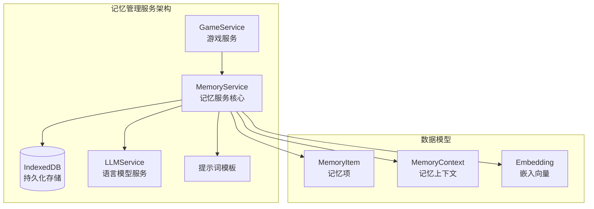
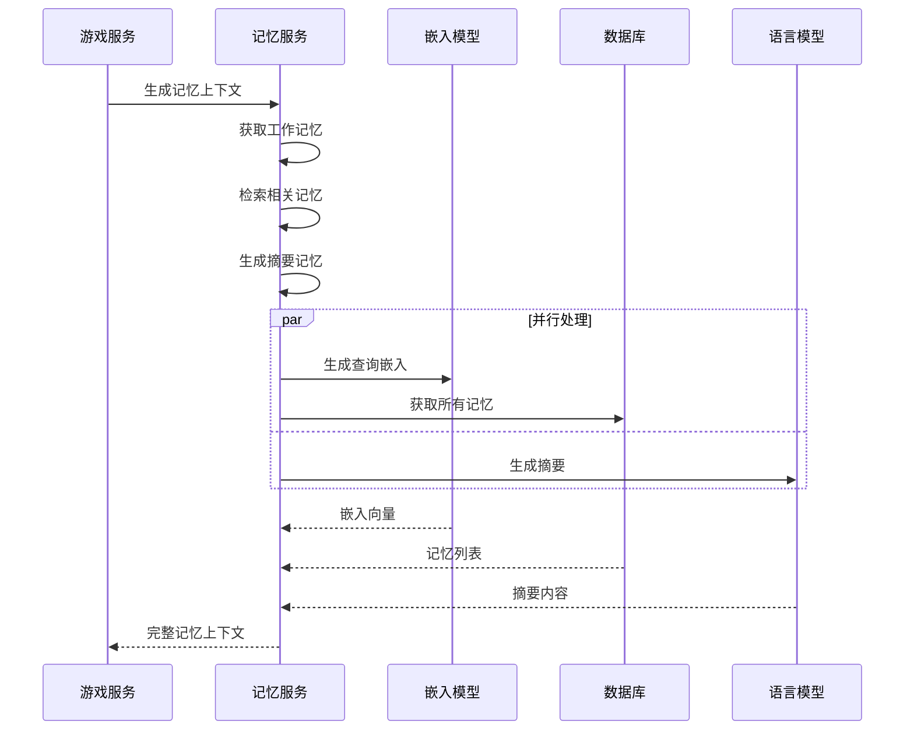
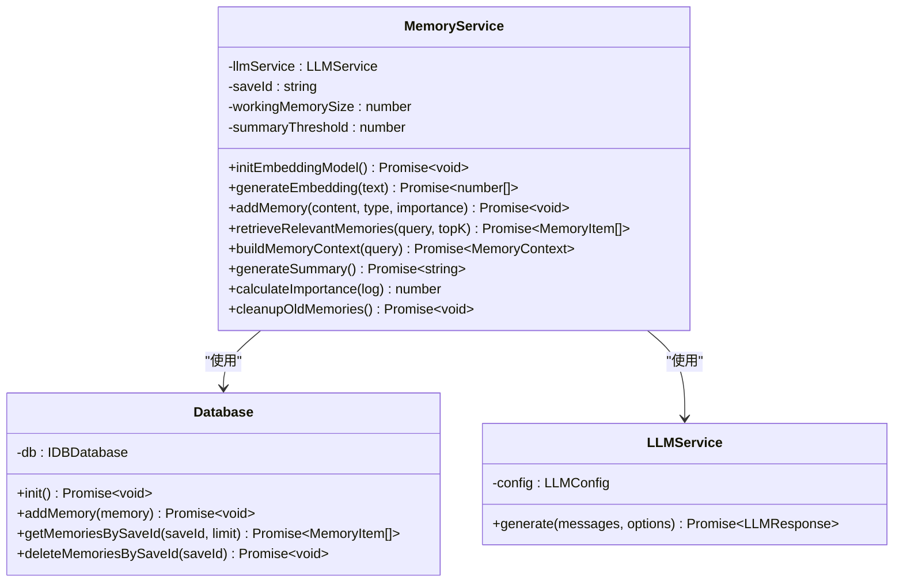
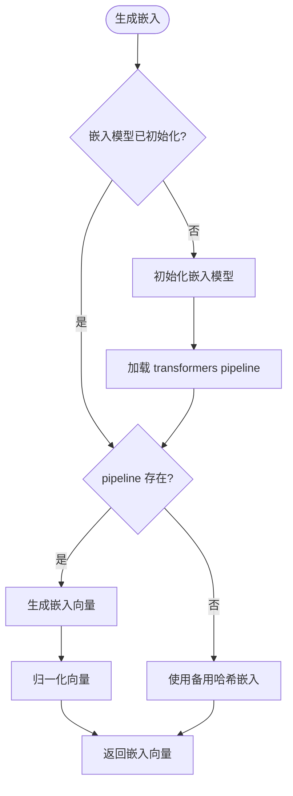
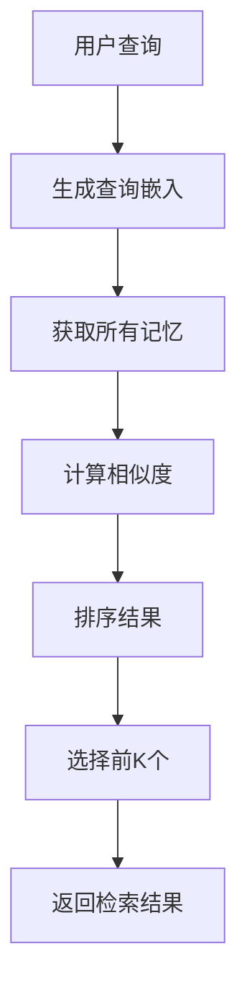
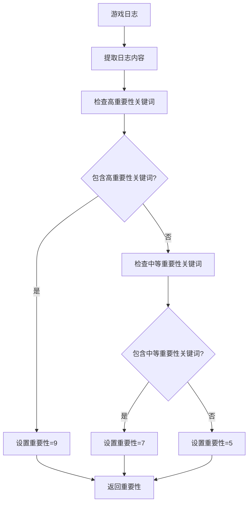
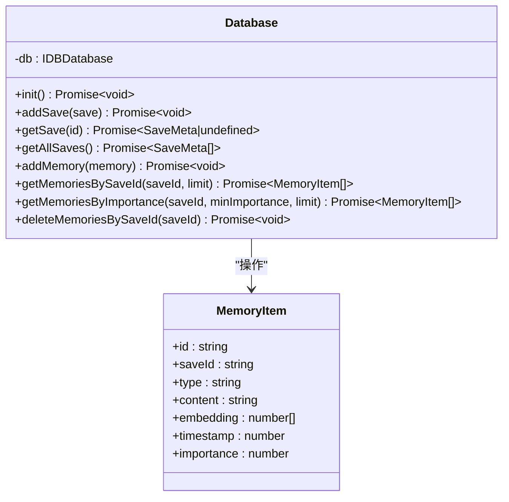
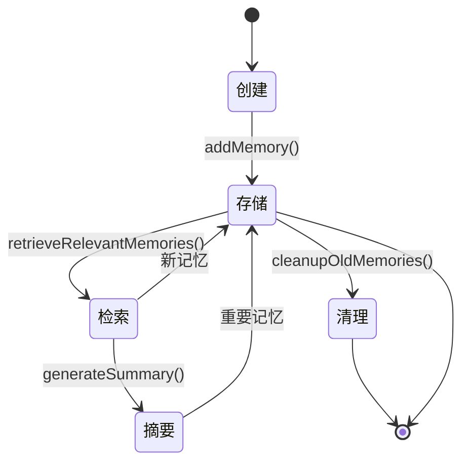
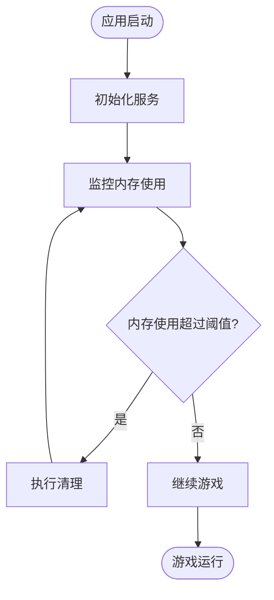

# 记忆管理服务

<cite>
**本文档引用的文件**
- [memoryService.ts](file://src/services/memoryService.ts)
- [db.ts](file://src/services/db.ts)
- [gameService.ts](file://src/services/gameService.ts)
- [llmService.ts](file://src/services/llmService.ts)
- [useGameStore.ts](file://src/stores/useGameStore.ts)
- [App.tsx](file://src/App.tsx)
- [game.ts](file://src/types/game.ts)
- [summary.ts](file://src/prompts/summary.ts)
</cite>

## 目录
1. [简介](#简介)
2. [项目结构](#项目结构)
3. [核心组件](#核心组件)
4. [架构概览](#架构概览)
5. [详细组件分析](#详细组件分析)
6. [依赖关系分析](#依赖关系分析)
7. [性能考量](#性能考量)
8. [故障排除指南](#故障排除指南)
9. [结论](#结论)

## 简介

记忆管理服务是修仙 Roguelike 游戏的核心智能组件，负责管理玩家在游戏过程中的所有记忆片段。该服务实现了多层次的记忆架构：短期记忆的临时存储、长期记忆的持久化、向量嵌入的高效检索，以及基于 RAG（检索增强生成）的智能检索机制。

该服务通过机器学习模型为游戏提供智能记忆能力，包括记忆重要性评估、上下文关联匹配、记忆摘要生成等功能，为玩家提供更加沉浸和连贯的游戏体验。

## 项目结构

记忆管理服务位于 `src/services/` 目录下，采用模块化设计，与其他核心服务紧密集成：



**图表来源**
- [memoryService.ts](file://src/services/memoryService.ts#L16-L224)
- [db.ts](file://src/services/db.ts#L26-L34)
- [gameService.ts](file://src/services/gameService.ts#L50-L62)

**章节来源**
- [memoryService.ts](file://src/services/memoryService.ts#L1-L224)
- [db.ts](file://src/services/db.ts#L1-L236)

## 核心组件

记忆管理服务包含以下核心组件：

### MemoryService 类
- **职责**：管理所有记忆相关的操作，包括添加、检索、摘要生成和生命周期管理
- **特性**：支持向量嵌入、RAG 检索、记忆重要性评估、并发处理

### Database 类
- **职责**：提供 IndexedDB 数据持久化服务
- **特性**：事务处理、索引优化、批量操作支持

### MemoryContext 接口
- **职责**：封装记忆检索结果的上下文信息
- **组成**：工作记忆、摘要记忆、检索到的记忆

**章节来源**
- [memoryService.ts](file://src/services/memoryService.ts#L10-L25)
- [db.ts](file://src/services/db.ts#L36-L83)

## 架构概览

记忆管理服务采用分层架构设计，实现了从数据存储到智能检索的完整流程：



**图表来源**
- [memoryService.ts](file://src/services/memoryService.ts#L175-L188)
- [gameService.ts](file://src/services/gameService.ts#L284-L391)

## 详细组件分析

### MemoryService 类分析

MemoryService 是记忆管理的核心类，实现了完整的记忆生命周期管理：



**图表来源**
- [memoryService.ts](file://src/services/memoryService.ts#L16-L224)
- [db.ts](file://src/services/db.ts#L36-L236)
- [llmService.ts](file://src/services/llmService.ts#L18-L101)

#### 嵌入模型实现

MemoryService 支持两种嵌入模型生成策略：

1. **主嵌入模型**：使用轻量级 transformers 库的 all-MiniLM-L6-v2 模型
2. **备用嵌入模型**：基于简单哈希算法的向量生成



**图表来源**
- [memoryService.ts](file://src/services/memoryService.ts#L28-L68)

#### RAG 检索机制

记忆检索采用检索增强生成（RAG）模式：

1. **查询嵌入**：将用户查询转换为向量表示
2. **相似度计算**：使用余弦相似度比较查询与记忆的相似度
3. **排序筛选**：按相似度降序排列并返回前 K 个结果



**图表来源**
- [memoryService.ts](file://src/services/memoryService.ts#L122-L137)

#### 记忆重要性评估

记忆重要性通过关键词匹配算法确定：



**图表来源**
- [memoryService.ts](file://src/services/memoryService.ts#L107-L119)

#### 记忆摘要生成

摘要生成采用两阶段处理：

1. **内容准备**：提取旧记忆的文本内容
2. **LLM 生成**：使用专门的摘要提示词生成结构化摘要

**章节来源**
- [memoryService.ts](file://src/services/memoryService.ts#L83-L173)
- [summary.ts](file://src/prompts/summary.ts#L1-L26)

### Database 类分析

Database 类提供了完整的 IndexedDB 操作接口：



**图表来源**
- [db.ts](file://src/services/db.ts#L36-L236)

#### 数据库索引优化

数据库为记忆表建立了多个索引以优化查询性能：

- `saveId` 索引：按存档 ID 分组记忆
- `timestamp` 索引：按时间戳排序记忆
- `importance` 索引：按重要性过滤记忆

**章节来源**
- [db.ts](file://src/services/db.ts#L64-L69)
- [db.ts](file://src/services/db.ts#L175-L207)

### 记忆生命周期管理

记忆生命周期包括以下阶段：



**图表来源**
- [memoryService.ts](file://src/services/memoryService.ts#L83-L215)

## 依赖关系分析

记忆管理服务的依赖关系图：

```mermaid
graph TB
subgraph "外部依赖"
TRANSFORMERS[@xenova/transformers<br/>嵌入模型]
INDEXEDDB[浏览器 IndexedDB<br/>持久化存储]
FETCH[浏览器 Fetch API<br/>LLM 请求]
end
subgraph "内部模块"
MEMORY_SERVICE[MemoryService]
DATABASE[Database]
LLM_SERVICE[LLMService]
GAME_SERVICE[GameService]
PROMPTS[提示词模板]
end
MEMORY_SERVICE --> TRANSFORMERS
MEMORY_SERVICE --> DATABASE
MEMORY_SERVICE --> LLM_SERVICE
GAME_SERVICE --> MEMORY_SERVICE
MEMORY_SERVICE --> PROMPTS
LLM_SERVICE --> FETCH
DATABASE --> INDEXEDDB
```

**图表来源**
- [memoryService.ts](file://src/services/memoryService.ts#L2-L5)
- [llmService.ts](file://src/services/llmService.ts#L67-L80)
- [db.ts](file://src/services/db.ts#L41-L71)

**章节来源**
- [memoryService.ts](file://src/services/memoryService.ts#L1-L10)
- [llmService.ts](file://src/services/llmService.ts#L1-L101)
- [db.ts](file://src/services/db.ts#L1-L236)

## 性能考量

### 存储优化策略

1. **索引优化**：为常用查询字段建立索引
2. **批量操作**：支持批量添加记忆以减少数据库往返
3. **内存管理**：限制工作记忆大小，避免内存泄漏

### 检索性能优化

1. **向量化检索**：使用余弦相似度快速计算相似度
2. **并发处理**：并行获取不同类型的记忆
3. **缓存机制**：嵌入模型的懒加载和缓存

### 内存使用监控



**图表来源**
- [memoryService.ts](file://src/services/memoryService.ts#L196-L215)

**章节来源**
- [memoryService.ts](file://src/services/memoryService.ts#L19-L25)
- [db.ts](file://src/services/db.ts#L170-L173)

## 故障排除指南

### 常见问题及解决方案

#### 嵌入模型加载失败
- **症状**：控制台出现加载失败警告
- **原因**：网络问题或浏览器不支持 WebAssembly
- **解决方案**：检查网络连接，确保浏览器支持 WebAssembly

#### LLM API 调用失败
- **症状**：生成摘要或记忆时抛出异常
- **原因**：API 密钥错误、网络问题或服务不可用
- **解决方案**：验证 API 配置，检查网络连接

#### IndexedDB 操作失败
- **症状**：添加或获取记忆时抛出异常
- **原因**：浏览器隐私模式或存储空间不足
- **解决方案**：检查浏览器设置，清理存储空间

**章节来源**
- [memoryService.ts](file://src/services/memoryService.ts#L31-L37)
- [llmService.ts](file://src/services/llmService.ts#L40-L55)
- [db.ts](file://src/services/db.ts#L43-L45)

## 结论

记忆管理服务为修仙 Roguelike 游戏提供了强大的智能记忆能力。通过多层记忆架构设计，实现了从短期记忆到长期记忆的完整管理，结合向量嵌入的高效检索和 RAG 检索机制，为玩家提供了更加沉浸和连贯的游戏体验。

该服务的主要优势包括：
- **模块化设计**：清晰的职责分离和依赖管理
- **性能优化**：索引优化、并发处理和内存管理
- **可靠性**：错误处理、重试机制和降级策略
- **可扩展性**：插件化的嵌入模型和存储后端

未来可以进一步优化的方向包括：实现更复杂的记忆分类、增加记忆压缩算法、支持分布式存储等。