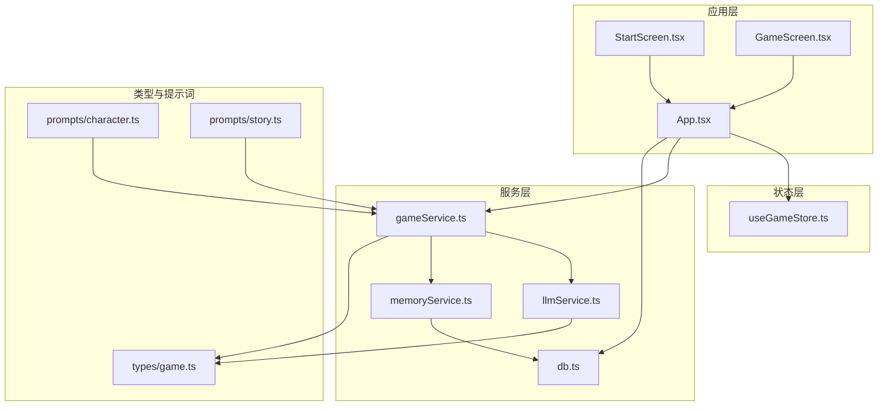
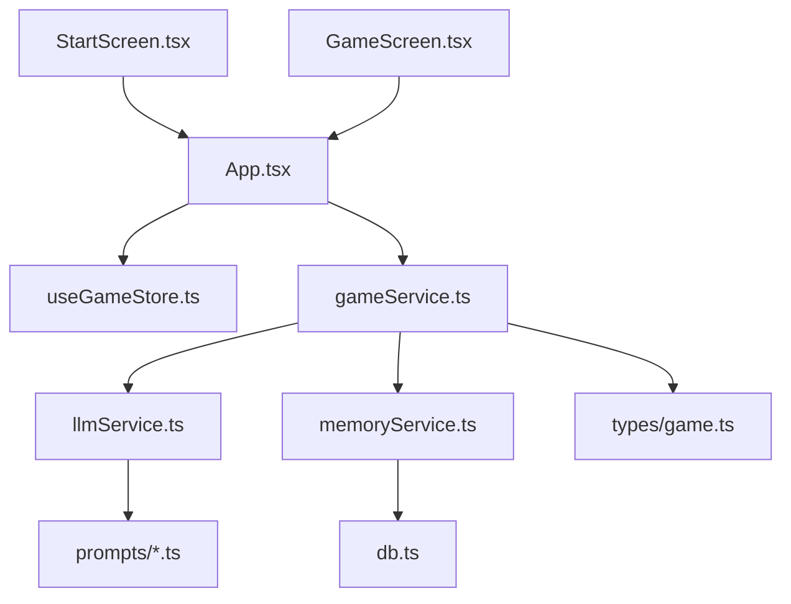
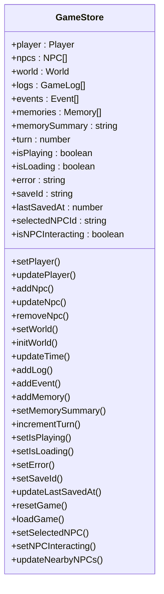
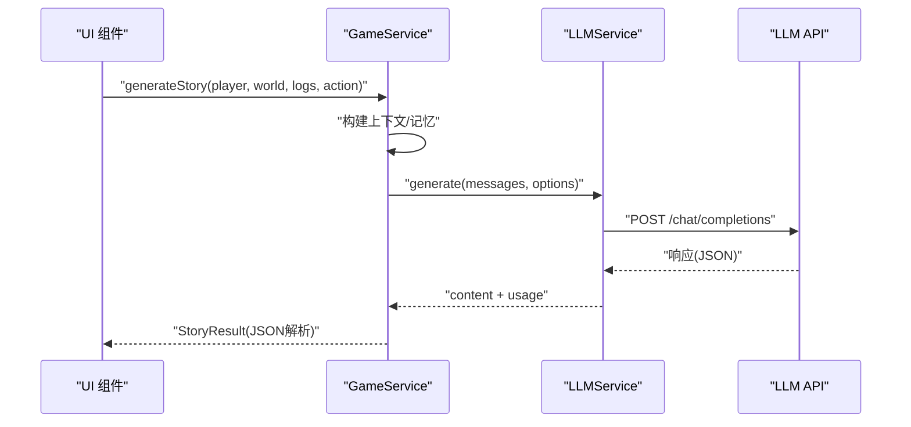
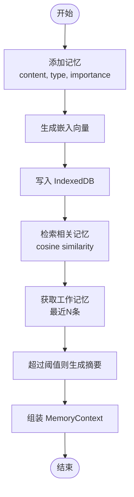
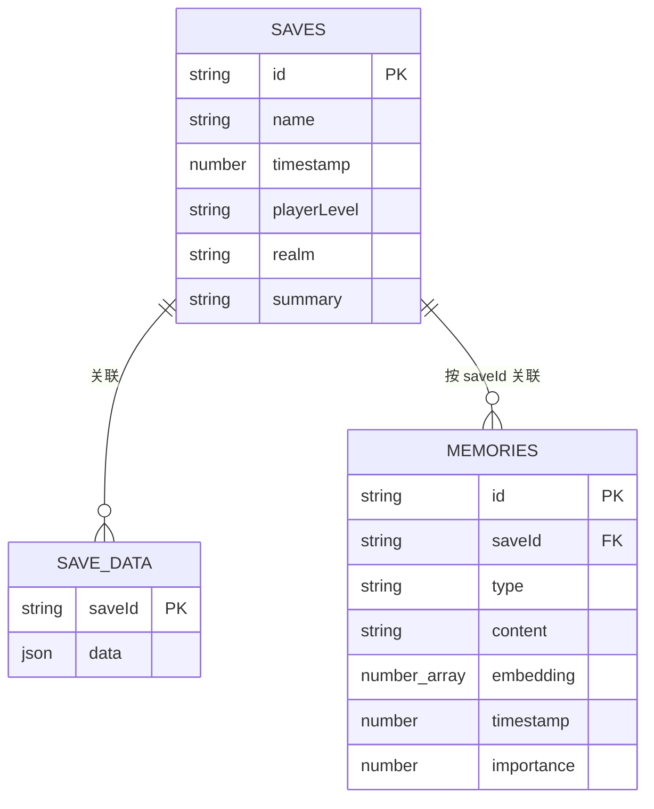
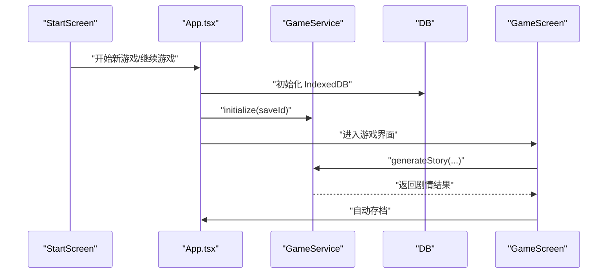
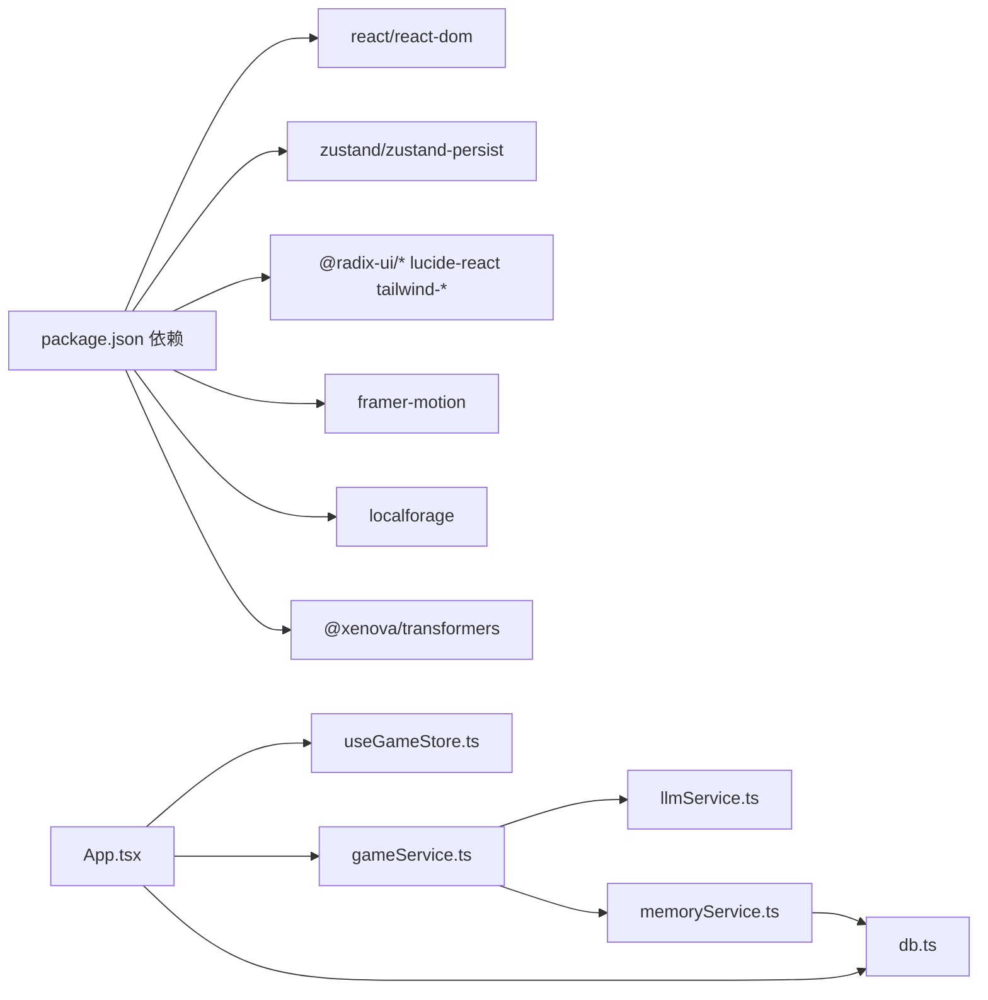

# 架构设计

<cite>
**本文引用的文件**
- [README.md](file://README.md)
- [package.json](file://package.json)
- [vite.config.ts](file://vite.config.ts)
- [src/main.tsx](file://src/main.tsx)
- [src/App.tsx](file://src/App.tsx)
- [src/types/game.ts](file://src/types/game.ts)
- [src/stores/useGameStore.ts](file://src/stores/useGameStore.ts)
- [src/services/llmService.ts](file://src/services/llmService.ts)
- [src/services/gameService.ts](file://src/services/gameService.ts)
- [src/services/memoryService.ts](file://src/services/memoryService.ts)
- [src/services/db.ts](file://src/services/db.ts)
- [src/prompts/character.ts](file://src/prompts/character.ts)
- [src/prompts/story.ts](file://src/prompts/story.ts)
- [src/components/StartScreen.tsx](file://src/components/StartScreen.tsx)
- [src/components/GameScreen.tsx](file://src/components/GameScreen.tsx)
</cite>

## 目录
1. [简介](#简介)
2. [项目结构](#项目结构)
3. [核心组件](#核心组件)
4. [架构总览](#架构总览)
5. [详细组件分析](#详细组件分析)
6. [依赖关系分析](#依赖关系分析)
7. [性能考量](#性能考量)
8. [故障排查指南](#故障排查指南)
9. [结论](#结论)
10. [附录](#附录)

## 简介
本项目是一个“纯前端”的修仙主题 Roguelike 游戏，采用 React 18 + TypeScript + Vite 构建，结合 Zustand 状态管理与 AI 驱动的内容生成系统，通过 LLM 实时生成角色、世界、事件与剧情，实现高度可定制与可扩展的修仙体验。系统强调跨平台兼容、本地持久化与可移植性，支持多种 OpenAI 兼容的 LLM 供应商，同时提供移动端适配与主题切换。

## 项目结构
项目采用按职责分层的组织方式：
- 应用入口与路由：src/main.tsx、src/App.tsx
- 类型定义：src/types/game.ts
- 状态管理：src/stores/useGameStore.ts（Zustand + localStorage 持久化）
- 服务层：src/services/*（LLM、游戏逻辑、记忆、数据库）
- 提示词：src/prompts/*
- UI 组件：src/components/*
- 构建配置：vite.config.ts、package.json

**图表来源**
- [src/App.tsx](file://src/App.tsx#L1-L588)
- [src/stores/useGameStore.ts](file://src/stores/useGameStore.ts#L1-L226)
- [src/services/gameService.ts](file://src/services/gameService.ts#L1-L541)
- [src/services/llmService.ts](file://src/services/llmService.ts#L1-L101)
- [src/services/memoryService.ts](file://src/services/memoryService.ts#L1-L224)
- [src/services/db.ts](file://src/services/db.ts#L1-L236)
- [src/types/game.ts](file://src/types/game.ts#L1-L319)
- [src/prompts/character.ts](file://src/prompts/character.ts#L1-L97)
- [src/prompts/story.ts](file://src/prompts/story.ts#L1-L147)
- [src/components/StartScreen.tsx](file://src/components/StartScreen.tsx#L1-L319)
- [src/components/GameScreen.tsx](file://src/components/GameScreen.tsx#L1-L172)

**章节来源**
- [README.md](file://README.md#L1-L106)
- [package.json](file://package.json#L1-L55)
- [vite.config.ts](file://vite.config.ts#L1-L12)

## 核心组件
- 应用入口与生命周期控制：src/main.tsx、src/App.tsx
- 状态管理：Zustand store（useGameStore.ts），支持 localStorage 持久化与局部状态分区
- 服务层：
  - LLMService：统一的 LLM 调用封装，支持重试与响应格式控制
  - GameService：游戏业务编排，负责角色生成、剧情生成、NPC 交互、存档读写
  - MemoryService：RAG 式记忆系统，支持嵌入检索、摘要生成与工作记忆
  - DB：IndexedDB 封装，提供存档、存档数据与记忆的 CRUD
- 类型系统：src/types/game.ts 定义了角色、NPC、世界、事件、记忆、状态等核心类型
- 提示词：character.ts、story.ts 提供角色生成与剧情生成的系统提示
- UI 组件：StartScreen.tsx、GameScreen.tsx 等承载页面与交互

**章节来源**
- [src/main.tsx](file://src/main.tsx#L1-L11)
- [src/App.tsx](file://src/App.tsx#L1-L588)
- [src/stores/useGameStore.ts](file://src/stores/useGameStore.ts#L1-L226)
- [src/services/llmService.ts](file://src/services/llmService.ts#L1-L101)
- [src/services/gameService.ts](file://src/services/gameService.ts#L1-L541)
- [src/services/memoryService.ts](file://src/services/memoryService.ts#L1-L224)
- [src/services/db.ts](file://src/services/db.ts#L1-L236)
- [src/types/game.ts](file://src/types/game.ts#L1-L319)
- [src/prompts/character.ts](file://src/prompts/character.ts#L1-L97)
- [src/prompts/story.ts](file://src/prompts/story.ts#L1-L147)
- [src/components/StartScreen.tsx](file://src/components/StartScreen.tsx#L1-L319)
- [src/components/GameScreen.tsx](file://src/components/GameScreen.tsx#L1-L172)

## 架构总览
系统采用“纯前端 + LLM + 本地持久化”的架构模式：
- 前端框架：React 18 + TypeScript + Vite，构建快速、热更新友好
- 状态管理：Zustand 简化状态逻辑，配合 localStorage 持久化，实现跨刷新恢复
- AI 驱动：LLMService 统一封装调用，GameService 编排角色、剧情、NPC 交互；MemoryService 通过嵌入检索与摘要生成增强上下文连贯性
- 持久化：IndexedDB 保存存档与记忆；localStorage 保存轻量状态；支持导出/导入
- UI：组件化拆分，StartScreen 与 GameScreen 分别承担入口与主界面职责

**图表来源**
- [src/components/StartScreen.tsx](file://src/components/StartScreen.tsx#L1-L319)
- [src/components/GameScreen.tsx](file://src/components/GameScreen.tsx#L1-L172)
- [src/App.tsx](file://src/App.tsx#L1-L588)
- [src/stores/useGameStore.ts](file://src/stores/useGameStore.ts#L1-L226)
- [src/services/gameService.ts](file://src/services/gameService.ts#L1-L541)
- [src/services/llmService.ts](file://src/services/llmService.ts#L1-L101)
- [src/services/memoryService.ts](file://src/services/memoryService.ts#L1-L224)
- [src/services/db.ts](file://src/services/db.ts#L1-L236)
- [src/types/game.ts](file://src/types/game.ts#L1-L319)
- [src/prompts/character.ts](file://src/prompts/character.ts#L1-L97)
- [src/prompts/story.ts](file://src/prompts/story.ts#L1-L147)

## 详细组件分析

### 状态管理与持久化（Zustand）
- 设计要点
  - 使用 persist 中间件将关键状态写入 localStorage，减少刷新丢失
  - 分离 UI 状态（如 isPlaying、isLoading）与游戏状态（player、world、logs 等）
  - 提供 loadGame/resetGame 等工具方法，便于导入/重置
- 数据结构与复杂度
  - 状态对象扁平化，增删改查均为 O(1)/O(n)（如 logs 追加）
  - 通过 partialize 控制持久化字段，降低体积与序列化成本
- 优化与健壮性
  - 使用 useMemo 缓存 LLM 配置相关的实例，避免重复创建
  - 自动存档与手动存档结合，保障进度安全

**图表来源**
- [src/stores/useGameStore.ts](file://src/stores/useGameStore.ts#L13-L225)

**章节来源**
- [src/stores/useGameStore.ts](file://src/stores/useGameStore.ts#L1-L226)

### LLM 服务与调用策略
- 设计要点
  - LLMService 统一封装请求，支持重试、超时与响应格式（JSON/Text）
  - GameService 通过提示词与上下文拼装，调用 LLM 生成角色、剧情、NPC 交互结果
  - 支持多种 OpenAI 兼容供应商，用户可自行配置 baseURL、apiKey、model
- 数据流
  - 输入：messages（含 system/user）、options（temperature/max_tokens/response_format）
  - 输出：content + usage（prompt/completion/total tokens）
- 错误处理
  - 多次重试与错误透传，失败时抛出带重试次数信息的异常

**图表来源**
- [src/services/gameService.ts](file://src/services/gameService.ts#L283-L391)
- [src/services/llmService.ts](file://src/services/llmService.ts#L29-L98)

**章节来源**
- [src/services/llmService.ts](file://src/services/llmService.ts#L1-L101)
- [src/services/gameService.ts](file://src/services/gameService.ts#L1-L541)
- [src/prompts/character.ts](file://src/prompts/character.ts#L1-L97)
- [src/prompts/story.ts](file://src/prompts/story.ts#L1-L147)

### 记忆系统与 RAG（MemoryService）
- 设计要点
  - 使用 @xenova/transformers 的特征提取模型生成嵌入向量，支持余弦相似度检索
  - 工作记忆（最近 N 条）+ 相关检索（Top-K）+ 摘要记忆（超过阈值时生成）
  - 记忆重要性评分与清理策略，平衡上下文质量与性能
- 数据结构
  - MemoryItem：id/saveId/type/content/embedding/timestamp/importance
  - MemoryContext：workingMemory/summaryMemory/retrievedMemories
- 性能与可用性
  - 嵌入模型加载失败时降级为简单哈希向量
  - 摘要生成使用较低 temperature，保证稳定性

**图表来源**
- [src/services/memoryService.ts](file://src/services/memoryService.ts#L83-L188)
- [src/services/db.ts](file://src/services/db.ts#L161-L207)

**章节来源**
- [src/services/memoryService.ts](file://src/services/memoryService.ts#L1-L224)
- [src/services/db.ts](file://src/services/db.ts#L1-L236)

### 数据持久化（IndexedDB）
- 设计要点
  - 三层对象存储：SAVES（存档元数据）、SAVE_DATA（存档数据）、MEMORIES（记忆）
  - 提供存档 CRUD、记忆检索与删除等接口
  - 与 GameService/DB 协作，实现自动/手动存档
- 数据模型

**图表来源**
- [src/services/db.ts](file://src/services/db.ts#L12-L34)

**章节来源**
- [src/services/db.ts](file://src/services/db.ts#L1-L236)

### 应用生命周期与页面流程（App.tsx）
- 设计要点
  - 游戏阶段：start（主页）→ character_creation（角色创建）→ game（主界面）
  - 自动存档：每 30 秒一次，以及每次行动后触发
  - LLM 配置变更时，通过 useMemo 避免重复创建服务实例
  - NPC 交互：选择 NPC → 打开交互模态 → 生成对话与状态变更
- 行为流程

**图表来源**
- [src/App.tsx](file://src/App.tsx#L62-L161)
- [src/components/StartScreen.tsx](file://src/components/StartScreen.tsx#L1-L319)
- [src/components/GameScreen.tsx](file://src/components/GameScreen.tsx#L1-L172)
- [src/services/db.ts](file://src/services/db.ts#L39-L72)
- [src/services/gameService.ts](file://src/services/gameService.ts#L59-L62)

**章节来源**
- [src/App.tsx](file://src/App.tsx#L1-L588)
- [src/components/StartScreen.tsx](file://src/components/StartScreen.tsx#L1-L319)
- [src/components/GameScreen.tsx](file://src/components/GameScreen.tsx#L1-L172)

## 依赖关系分析
- 外部依赖
  - @xenova/transformers：用于嵌入特征提取（可降级）
  - localforage：本地存储（与 localStorage 配合）
  - radix-ui/*、lucide-react、tailwindcss 生态：UI 组件与样式
  - framer-motion：动画与过渡
- 内部耦合
  - App.tsx 依赖 Zustand、LLM/DB/Memory/Game 服务
  - GameService 依赖 LLMService、MemoryService、DB、类型与提示词
  - MemoryService 依赖 DB 与 LLMService（摘要生成）

**图表来源**
- [package.json](file://package.json#L15-L36)
- [src/App.tsx](file://src/App.tsx#L1-L588)
- [src/services/gameService.ts](file://src/services/gameService.ts#L1-L541)
- [src/services/memoryService.ts](file://src/services/memoryService.ts#L1-L224)
- [src/services/db.ts](file://src/services/db.ts#L1-L236)
- [src/services/llmService.ts](file://src/services/llmService.ts#L1-L101)

**章节来源**
- [package.json](file://package.json#L1-L55)

## 性能考量
- 前端性能
  - Vite 快速启动与热更新，React 18 并发特性提升渲染性能
  - Zustand 无样板代码，减少不必要的重渲染
- LLM 调用
  - 重试机制与指数退避，降低网络抖动影响
  - 响应格式固定为 JSON，便于稳定解析
- 记忆检索
  - 嵌入向量计算与相似度排序为 O(N) 检索，建议限制 Top-K 与内存上限
  - 嵌入模型加载失败时的哈希降级，保证可用性
- 存储与持久化
  - IndexedDB 分层存储，避免单表过大
  - localStorage 持久化关键状态，减少 IndexedDB 压力

[本节为通用性能建议，无需特定文件引用]

## 故障排查指南
- LLM 调用失败
  - 现象：抛出“已重试 X 次”错误
  - 排查：检查 baseURL、apiKey、model 配置；查看网络与速率限制
  - 参考
    - [src/services/llmService.ts](file://src/services/llmService.ts#L37-L55)
- IndexedDB 初始化失败
  - 现象：打开失败错误
  - 排查：清除浏览器存储或更换浏览器；检查权限
  - 参考
    - [src/services/db.ts](file://src/services/db.ts#L40-L50)
- 嵌入模型加载失败
  - 现象：控制台警告，使用哈希向量替代
  - 排查：检查网络与 CDN；可离线运行或预加载模型
  - 参考
    - [src/services/memoryService.ts](file://src/services/memoryService.ts#L28-L37)
- 自动存档未触发
  - 现象：未出现定时存档
  - 排查：确认游戏阶段为 game；检查 saveId 是否存在
  - 参考
    - [src/App.tsx](file://src/App.tsx#L107-L122)

**章节来源**
- [src/services/llmService.ts](file://src/services/llmService.ts#L1-L101)
- [src/services/db.ts](file://src/services/db.ts#L1-L236)
- [src/services/memoryService.ts](file://src/services/memoryService.ts#L1-L224)
- [src/App.tsx](file://src/App.tsx#L1-L588)

## 结论
本项目以“纯前端 + LLM + 本地持久化”为核心，通过清晰的分层与模块化设计，实现了可扩展、可移植、跨平台的修仙 Roguelike。Zustand 简化状态管理，LLM 驱动的内容生成带来高自由度体验，IndexedDB 与 localStorage 的组合兼顾性能与可靠性。建议在后续迭代中进一步优化记忆检索性能、扩展提示词体系与 UI 组件库，并完善跨设备的交互一致性。

[本节为总结性内容，无需特定文件引用]

## 附录
- 技术选型说明
  - React 18 + TypeScript + Vite：现代前端生态，开发体验与性能兼顾
  - Zustand：轻量状态管理，适合中小型应用
  - LLM 与提示词：角色生成与剧情生成的系统化提示工程
  - IndexedDB：浏览器内持久化，满足存档与记忆需求
- 部署与兼容
  - 支持静态托管（Vercel、GitHub Pages、Netlify 等）
  - 移动端适配良好，主题切换与动画优化体验

**章节来源**
- [README.md](file://README.md#L1-L106)
- [vite.config.ts](file://vite.config.ts#L1-L12)