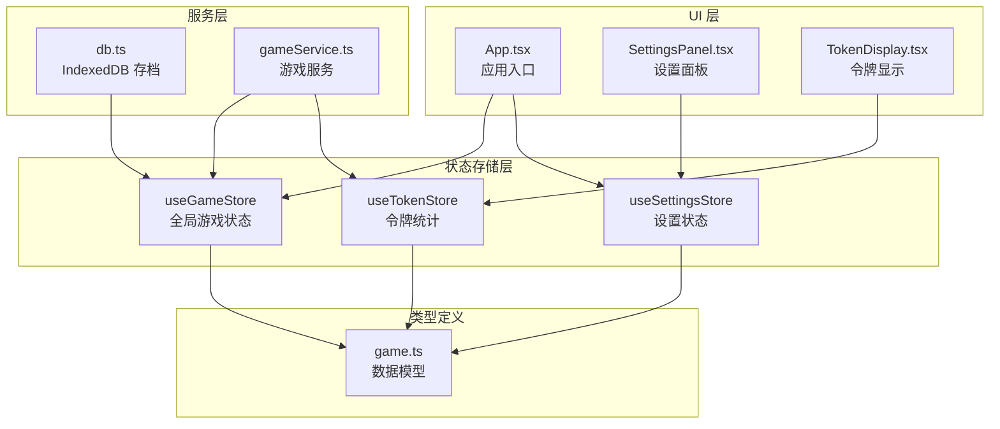
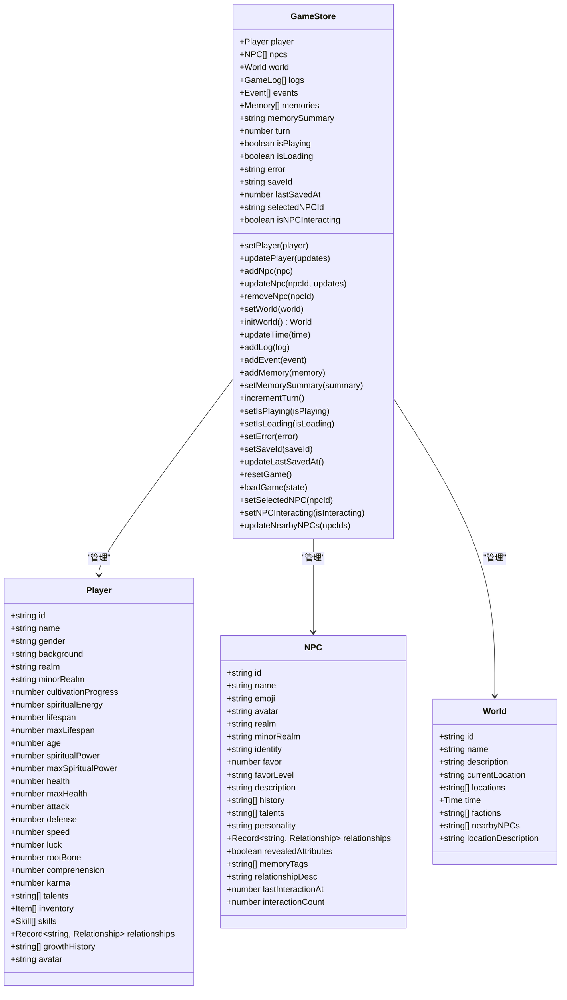
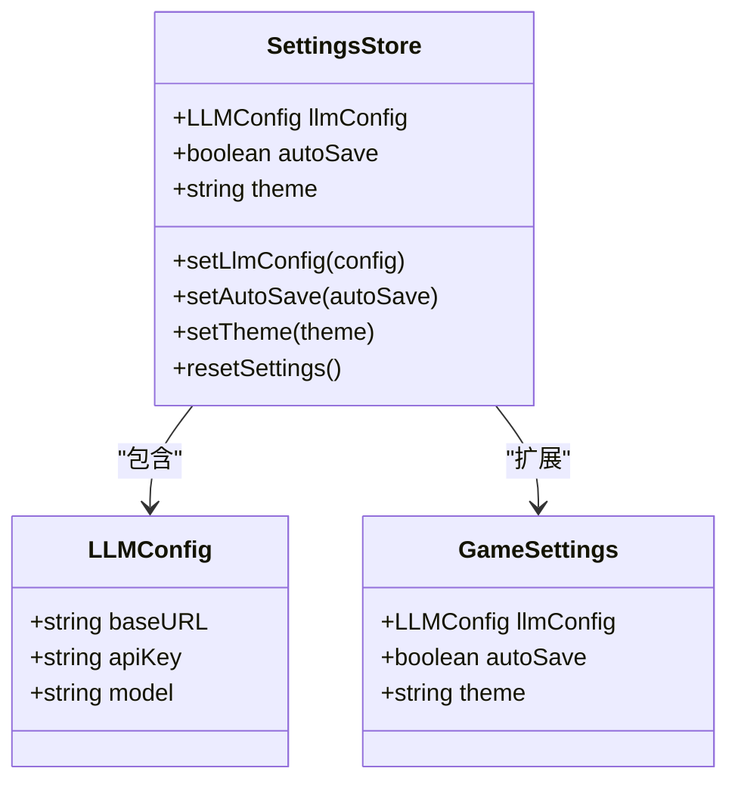
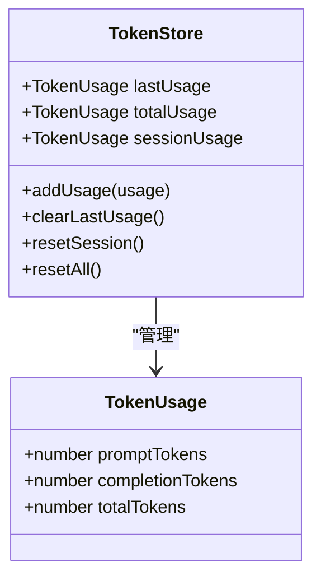
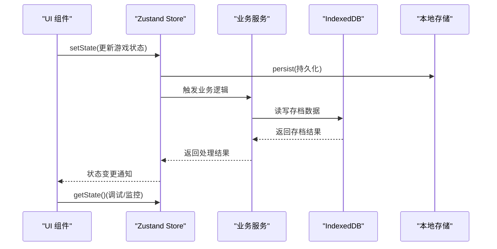
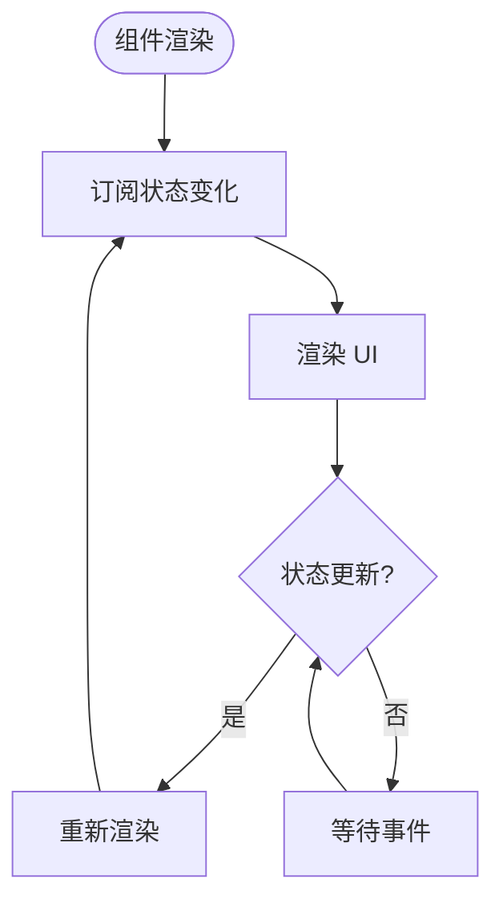
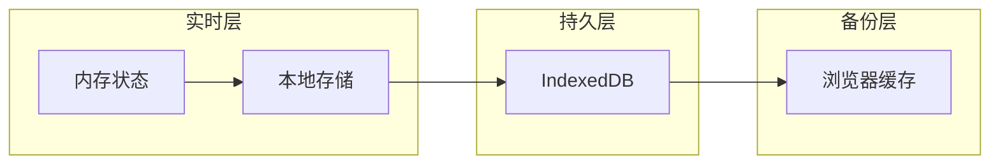
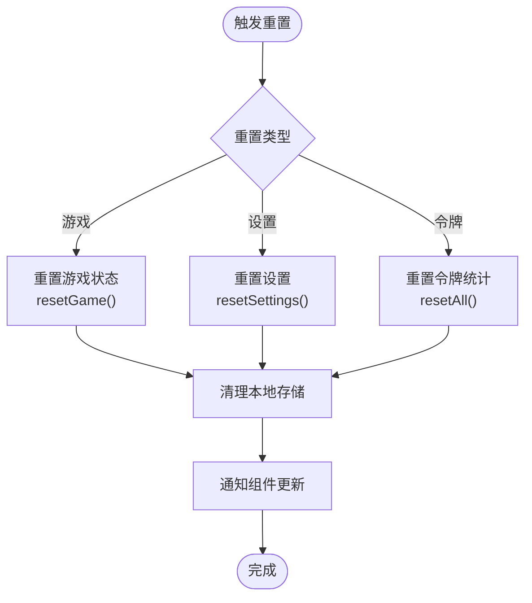
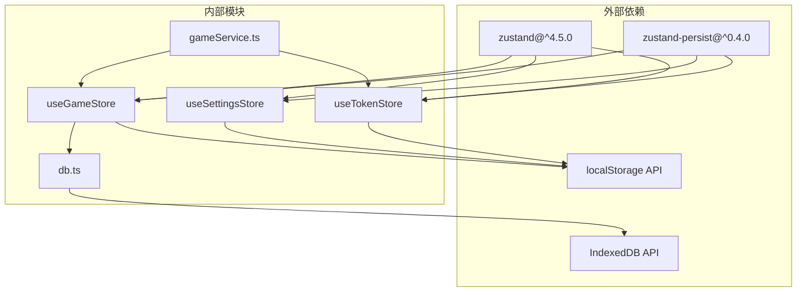

# 状态管理系统

<cite>
**本文档引用的文件**
- [useGameStore.ts](file://src/stores/useGameStore.ts)
- [useSettingsStore.ts](file://src/stores/useSettingsStore.ts)
- [useTokenStore.ts](file://src/stores/useTokenStore.ts)
- [game.ts](file://src/types/game.ts)
- [db.ts](file://src/services/db.ts)
- [App.tsx](file://src/App.tsx)
- [SettingsPanel.tsx](file://src/components/SettingsPanel.tsx)
- [TokenDisplay.tsx](file://src/components/TokenDisplay.tsx)
- [gameService.ts](file://src/services/gameService.ts)
- [package.json](file://package.json)
</cite>

## 目录
1. [简介](#简介)
2. [项目结构](#项目结构)
3. [核心组件](#核心组件)
4. [架构总览](#架构总览)
5. [详细组件分析](#详细组件分析)
6. [依赖关系分析](#依赖关系分析)
7. [性能考虑](#性能考虑)
8. [故障排除指南](#故障排除指南)
9. [结论](#结论)

## 简介
本项目采用 Zustand 构建轻量级状态管理方案，围绕三大核心状态存储模块：
- useGameStore：全局游戏状态管理，包含玩家、NPC、世界、日志、事件、记忆等
- useSettingsStore：设置状态管理，涵盖 LLM 配置、自动存档、主题等
- useTokenStore：令牌使用统计，记录单次调用、会话累计和总累计

系统通过持久化中间件将关键状态同步至浏览器本地存储，结合 IndexedDB 实现存档数据的可靠持久化，确保玩家进度不会因页面刷新丢失。

## 项目结构
状态管理相关文件组织清晰，遵循按功能模块划分的原则：
- stores 目录存放所有状态存储定义
- types 定义了完整的数据模型和类型约束
- services 提供与状态交互的服务层
- components 展示状态使用的 UI 组件

**图表来源**
- [useGameStore.ts](file://src/stores/useGameStore.ts#L1-L226)
- [useSettingsStore.ts](file://src/stores/useSettingsStore.ts#L1-L46)
- [useTokenStore.ts](file://src/stores/useTokenStore.ts#L1-L73)
- [game.ts](file://src/types/game.ts#L1-L319)
- [db.ts](file://src/services/db.ts#L1-L236)
- [App.tsx](file://src/App.tsx#L1-L588)
- [SettingsPanel.tsx](file://src/components/SettingsPanel.tsx#L1-L160)
- [TokenDisplay.tsx](file://src/components/TokenDisplay.tsx#L1-L172)
- [gameService.ts](file://src/services/gameService.ts#L1-L200)

**章节来源**
- [useGameStore.ts](file://src/stores/useGameStore.ts#L1-L226)
- [useSettingsStore.ts](file://src/stores/useSettingsStore.ts#L1-L46)
- [useTokenStore.ts](file://src/stores/useTokenStore.ts#L1-L73)
- [game.ts](file://src/types/game.ts#L1-L319)

## 核心组件
本节深入分析三个核心状态存储模块的设计理念、状态结构和更新模式。

### useGameStore 全局状态管理
useGameStore 是整个游戏的核心状态中心，负责维护完整的修仙世界状态。

#### 状态结构设计

**图表来源**
- [useGameStore.ts](file://src/stores/useGameStore.ts#L13-L55)
- [game.ts](file://src/types/game.ts#L110-L203)
- [game.ts](file://src/types/game.ts#L205-L217)

#### 状态更新模式
useGameStore 采用函数式更新模式，支持两种主要更新方式：
1. **直接赋值更新**：适用于简单状态字段的替换
2. **状态派生更新**：通过传入函数接收当前状态并返回新状态，确保原子性

关键更新方法包括：
- `updatePlayer`：部分更新玩家属性，保持现有属性不变
- `updateNpc`：根据 ID 更新特定 NPC 的属性
- `updateTime`：更新世界时间，支持部分字段更新
- `addLog/addEvent/addMemory`：向相应数组追加新条目，自动生成唯一 ID 和时间戳

#### 持久化策略
使用 Zustand 的 persist 中间件实现本地持久化：
- 存储键名：'xiuxian-game-storage'
- 存储介质：localStorage
- 部分化策略：仅保存必要状态，避免存储临时计算结果

**章节来源**
- [useGameStore.ts](file://src/stores/useGameStore.ts#L1-L226)
- [game.ts](file://src/types/game.ts#L110-L217)

### useSettingsStore 设置状态管理
useSettingsStore 负责管理用户偏好设置和 LLM 配置。

#### 状态结构设计

**图表来源**
- [useSettingsStore.ts](file://src/stores/useSettingsStore.ts#L5-L10)
- [game.ts](file://src/types/game.ts#L253-L263)

#### 更新模式
设置状态采用直接更新模式，支持：
- `setLlmConfig`：部分更新 LLM 配置，允许只更新必要的字段
- `setAutoSave/setTheme`：简单布尔值和枚举值的切换
- `resetSettings`：恢复到默认配置状态

**章节来源**
- [useSettingsStore.ts](file://src/stores/useSettingsStore.ts#L1-L46)
- [game.ts](file://src/types/game.ts#L253-L263)

### useTokenStore 令牌状态管理
useTokenStore 专门用于跟踪 LLM 调用的令牌使用情况。

#### 状态结构设计

**图表来源**
- [useTokenStore.ts](file://src/stores/useTokenStore.ts#L4-L23)

#### 统计维度
系统提供三层统计维度：
1. **lastUsage**：单次调用的详细统计
2. **sessionUsage**：当前会话期间的累计统计
3. **totalUsage**：应用生命周期内的总累计统计

**章节来源**
- [useTokenStore.ts](file://src/stores/useTokenStore.ts#L1-L73)

## 架构总览
系统采用分层架构，各层职责明确，通过状态存储实现松耦合的数据共享。

**图表来源**
- [App.tsx](file://src/App.tsx#L75-L122)
- [db.ts](file://src/services/db.ts#L134-L150)
- [useGameStore.ts](file://src/stores/useGameStore.ts#L84-L225)

## 详细组件分析

### 状态订阅机制
系统通过 React 的状态订阅机制实现组件与状态的自动同步：

**图表来源**
- [App.tsx](file://src/App.tsx#L30-L51)

### 状态同步策略
系统采用多层同步策略确保数据一致性：

1. **本地同步**：Zustand store 内部状态即时同步
2. **持久化同步**：通过 persist 中间件定期同步到 localStorage
3. **存档同步**：通过 IndexedDB 实现跨会话持久化

**图表来源**
- [useGameStore.ts](file://src/stores/useGameStore.ts#L207-L224)
- [db.ts](file://src/services/db.ts#L134-L150)

### 性能优化技巧
系统实现了多项性能优化措施：

1. **状态拆分**：将不同类型的业务状态分离到独立的 store 中
2. **选择性订阅**：组件只订阅需要的状态片段
3. **批量更新**：通过状态派生函数减少不必要的重渲染
4. **懒加载**：仅在需要时初始化大型数据结构

**章节来源**
- [App.tsx](file://src/App.tsx#L68-L72)
- [useGameStore.ts](file://src/stores/useGameStore.ts#L91-L94)

### 状态重置机制
系统提供了完善的重置机制：

**图表来源**
- [useGameStore.ts](file://src/stores/useGameStore.ts#L187-L188)
- [useSettingsStore.ts](file://src/stores/useSettingsStore.ts#L38-L39)
- [useTokenStore.ts](file://src/stores/useTokenStore.ts#L57-L62)

**章节来源**
- [useGameStore.ts](file://src/stores/useGameStore.ts#L187-L188)
- [useSettingsStore.ts](file://src/stores/useSettingsStore.ts#L38-L39)
- [useTokenStore.ts](file://src/stores/useTokenStore.ts#L57-L62)

## 依赖关系分析
系统依赖关系清晰，各模块职责明确：

**图表来源**
- [package.json](file://package.json#L15-L36)
- [useGameStore.ts](file://src/stores/useGameStore.ts#L1-L2)
- [useSettingsStore.ts](file://src/stores/useSettingsStore.ts#L1-L2)
- [useTokenStore.ts](file://src/stores/useTokenStore.ts#L1-L2)

**章节来源**
- [package.json](file://package.json#L15-L36)

## 性能考虑
基于项目现状，提出以下性能优化建议：

### 状态更新优化
1. **批量更新**：对于频繁的状态更新，考虑合并多个小更新为一次批量操作
2. **防抖处理**：对高频状态更新（如滚动、拖拽）添加防抖机制
3. **选择性订阅**：组件只订阅必要的状态片段，避免不必要的重渲染

### 存储优化
1. **增量持久化**：仅持久化发生变化的状态片段
2. **压缩存储**：对大型数据结构进行序列化压缩
3. **异步存储**：将非关键状态的持久化改为异步操作

### 内存管理
1. **状态清理**：定期清理过期的日志和事件数据
2. **懒加载**：延迟加载大型数据集，按需加载
3. **缓存策略**：实现智能缓存，避免重复计算

## 故障排除指南

### 常见问题及解决方案

#### 状态不同步问题
**症状**：组件无法正确响应状态变化
**排查步骤**：
1. 检查组件是否正确订阅了状态
2. 确认状态更新函数的调用时机
3. 验证状态派生函数的返回值

**解决方案**：
- 确保使用正确的状态订阅方式
- 检查状态更新函数的参数传递
- 验证状态派生函数的逻辑正确性

#### 持久化失败问题
**症状**：游戏进度无法保存或加载
**排查步骤**：
1. 检查浏览器的 localStorage 权限
2. 验证 IndexedDB 的初始化状态
3. 确认存储键名的唯一性

**解决方案**：
- 清理浏览器缓存和存储数据
- 检查存储空间是否充足
- 降级到其他存储方案

#### 性能问题
**症状**：应用运行缓慢或内存占用过高
**排查步骤**：
1. 分析状态更新频率和复杂度
2. 检查是否存在不必要的状态订阅
3. 评估组件重渲染次数

**解决方案**：
- 实施状态拆分和选择性订阅
- 优化状态更新逻辑
- 添加性能监控和告警

**章节来源**
- [App.tsx](file://src/App.tsx#L125-L161)
- [db.ts](file://src/services/db.ts#L39-L72)

## 结论
本项目的状态管理系统展现了良好的架构设计和工程实践：

### 设计优势
1. **模块化设计**：三大状态存储模块职责清晰，便于维护和扩展
2. **类型安全**：完整的 TypeScript 类型定义确保编译时类型检查
3. **持久化策略**：多层次的持久化方案确保数据可靠性
4. **性能优化**：合理的状态拆分和订阅机制提升运行效率

### 最佳实践总结
1. **状态拆分原则**：按业务领域拆分状态，避免状态过度耦合
2. **副作用处理**：将副作用封装在服务层，保持状态纯函数特性
3. **状态重置机制**：提供完善的重置功能，支持开发和调试场景
4. **性能监控**：建立状态使用监控，及时发现性能瓶颈

### 发展建议
1. **状态调试工具**：集成 Zustand DevTools 进行状态可视化调试
2. **状态迁移**：为未来版本的状态结构变更提供迁移工具
3. **并发控制**：实现状态更新的并发控制，避免竞态条件
4. **测试覆盖**：增加状态管理的单元测试和集成测试

该状态管理系统为修仙 Roguelike 项目提供了坚实的数据基础，通过合理的架构设计和最佳实践，能够支撑复杂的修仙世界模拟和丰富的交互体验。