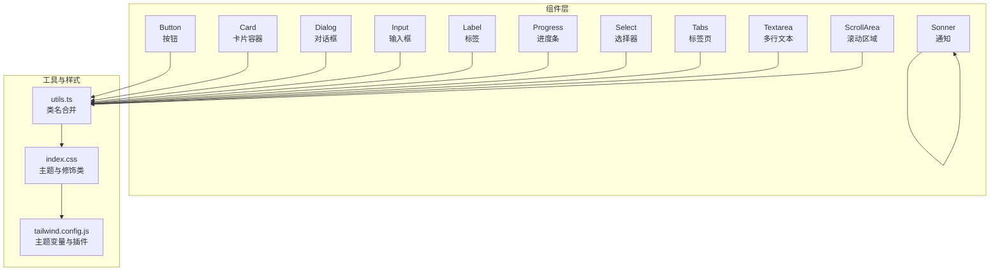
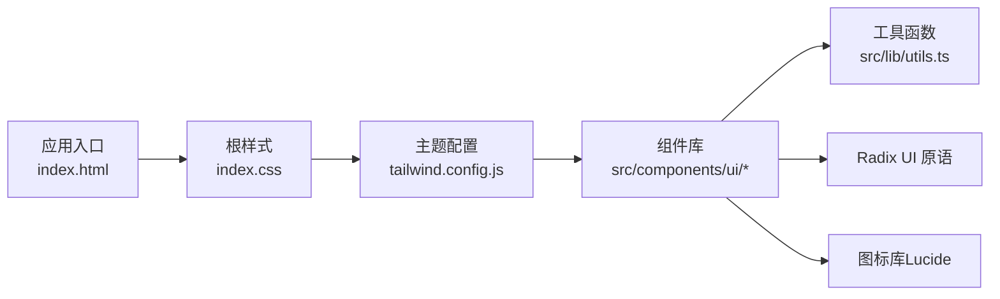
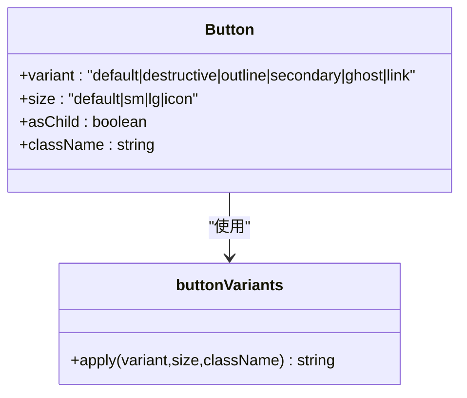
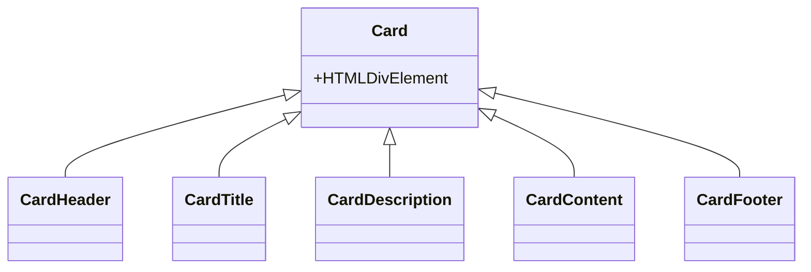
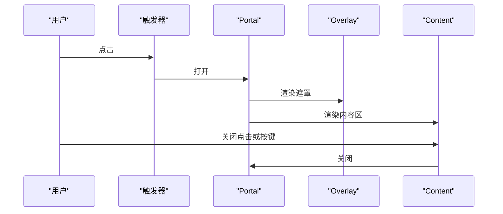
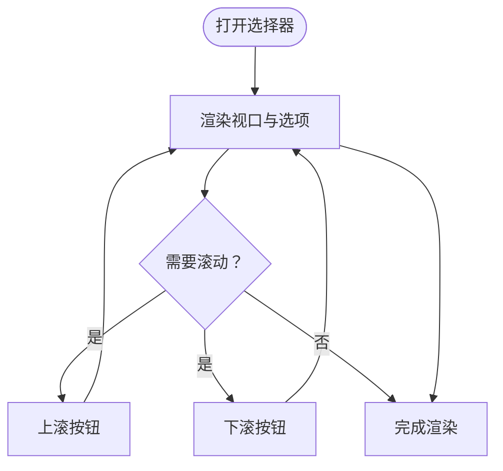
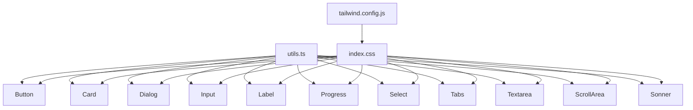

# UI 组件库

<cite>
**本文引用的文件**
- [button.tsx](file://src/components/ui/button.tsx)
- [card.tsx](file://src/components/ui/card.tsx)
- [dialog.tsx](file://src/components/ui/dialog.tsx)
- [input.tsx](file://src/components/ui/input.tsx)
- [label.tsx](file://src/components/ui/label.tsx)
- [progress.tsx](file://src/components/ui/progress.tsx)
- [select.tsx](file://src/components/ui/select.tsx)
- [tabs.tsx](file://src/components/ui/tabs.tsx)
- [textarea.tsx](file://src/components/ui/textarea.tsx)
- [scroll-area.tsx](file://src/components/ui/scroll-area.tsx)
- [sonner.tsx](file://src/components/ui/sonner.tsx)
- [utils.ts](file://src/lib/utils.ts)
- [tailwind.config.js](file://tailwind.config.js)
- [index.css](file://src/index.css)
- [index.html](file://index.html)
</cite>

## 目录
1. [简介](#简介)
2. [项目结构](#项目结构)
3. [核心组件](#核心组件)
4. [架构总览](#架构总览)
5. [组件详解](#组件详解)
6. [依赖关系分析](#依赖关系分析)
7. [性能与可用性](#性能与可用性)
8. [故障排查指南](#故障排查指南)
9. [结论](#结论)
10. [附录](#附录)

## 简介
本文件系统化梳理基于 shadcn/ui 设计体系的 UI 组件库，覆盖 Button、Card、Dialog、Input、Label、Progress、Select、Tabs、Textarea、ScrollArea、Sonner 等基础组件。文档聚焦于组件属性接口、样式定制、主题支持、可访问性、响应式布局与动画效果，并提供在“修仙”主题下的样式定制策略（如翡翠色系、传统字体、边框装饰等）与动画实现建议。同时给出组合使用模式、样式覆盖策略、自定义扩展方法、使用示例与最佳实践。

## 项目结构
组件库采用按功能模块化的组织方式，核心 UI 组件集中于 src/components/ui 目录，通用工具函数位于 src/lib/utils.ts，主题与样式定制集中在 src/index.css 与 tailwind.config.js 中。

**图表来源**
- [button.tsx](file://src/components/ui/button.tsx#L1-L57)
- [card.tsx](file://src/components/ui/card.tsx#L1-L80)
- [dialog.tsx](file://src/components/ui/dialog.tsx#L1-L121)
- [input.tsx](file://src/components/ui/input.tsx#L1-L23)
- [label.tsx](file://src/components/ui/label.tsx#L1-L25)
- [progress.tsx](file://src/components/ui/progress.tsx#L1-L29)
- [select.tsx](file://src/components/ui/select.tsx#L1-L161)
- [tabs.tsx](file://src/components/ui/tabs.tsx#L1-L54)
- [textarea.tsx](file://src/components/ui/textarea.tsx#L1-L23)
- [scroll-area.tsx](file://src/components/ui/scroll-area.tsx#L1-L47)
- [sonner.tsx](file://src/components/ui/sonner.tsx#L1-L27)
- [utils.ts](file://src/lib/utils.ts#L1-L7)
- [index.css](file://src/index.css#L1-L217)
- [tailwind.config.js](file://tailwind.config.js#L1-L53)

**章节来源**
- [index.html](file://index.html#L1-L14)
- [tailwind.config.js](file://tailwind.config.js#L1-L53)
- [index.css](file://src/index.css#L1-L217)

## 核心组件
本节概览各组件的职责与关键特性，便于快速定位与组合使用。

- Button：提供多种外观与尺寸变体，支持作为容器元素渲染，具备无障碍与焦点可见性支持。
- Card：卡片容器及其子组件（头部、标题、描述、内容、底部），统一视觉与间距。
- Dialog：模态对话框，含遮罩、内容区、关闭按钮、标题与描述，内置开合动画。
- Input/Textarea：输入与多行文本输入，统一圆角、边框、占位符与焦点状态。
- Label：表单标签，配合输入控件提升可访问性。
- Progress：进度指示器，支持数值驱动的进度变化与过渡动画。
- Select：下拉选择，含触发器、内容区、滚动按钮、选项项与分隔线。
- Tabs：标签页切换，含列表、触发器与内容区。
- ScrollArea：滚动区域与滚动条，支持水平/垂直方向与自适应尺寸。
- Sonner：全局通知系统，暗色主题与自定义样式类名映射。

**章节来源**
- [button.tsx](file://src/components/ui/button.tsx#L1-L57)
- [card.tsx](file://src/components/ui/card.tsx#L1-L80)
- [dialog.tsx](file://src/components/ui/dialog.tsx#L1-L121)
- [input.tsx](file://src/components/ui/input.tsx#L1-L23)
- [label.tsx](file://src/components/ui/label.tsx#L1-L25)
- [progress.tsx](file://src/components/ui/progress.tsx#L1-L29)
- [select.tsx](file://src/components/ui/select.tsx#L1-L161)
- [tabs.tsx](file://src/components/ui/tabs.tsx#L1-L54)
- [textarea.tsx](file://src/components/ui/textarea.tsx#L1-L23)
- [scroll-area.tsx](file://src/components/ui/scroll-area.tsx#L1-L47)
- [sonner.tsx](file://src/components/ui/sonner.tsx#L1-L27)

## 架构总览
组件库遵循以下设计原则：
- 基于 Radix UI 的语义化与可访问性原语，确保键盘导航与屏幕阅读器友好。
- 使用 class-variance-authority（CVA）与 cn 工具进行变体与类名合并，保证一致的样式策略。
- Tailwind CSS 提供原子化样式与主题变量，index.css 扩展了“修仙”主题的专用修饰类。
- 动画通过 Tailwind animate 插件与数据属性状态驱动，实现开合与过渡效果。

**图表来源**
- [index.html](file://index.html#L1-L14)
- [index.css](file://src/index.css#L1-L217)
- [tailwind.config.js](file://tailwind.config.js#L1-L53)
- [utils.ts](file://src/lib/utils.ts#L1-L7)
- [button.tsx](file://src/components/ui/button.tsx#L1-L57)
- [dialog.tsx](file://src/components/ui/dialog.tsx#L1-L121)
- [select.tsx](file://src/components/ui/select.tsx#L1-L161)

## 组件详解

### Button（按钮）
- 属性接口
  - 继承原生 button 属性
  - 变体（variant）：default、destructive、outline、secondary、ghost、link
  - 尺寸（size）：default、sm、lg、icon
  - asChild：是否以子节点容器渲染
- 样式与主题
  - 使用 CVA 定义变体与尺寸组合，结合主题色变量
  - 支持禁用态、焦点可见性与图标对齐
- 可访问性
  - 内置焦点环与可见性控制
- 组合与扩展
  - 可通过传入 className 覆盖默认样式
  - 与 Icon 组合时注意尺寸与间距

**图表来源**
- [button.tsx](file://src/components/ui/button.tsx#L7-L34)

**章节来源**
- [button.tsx](file://src/components/ui/button.tsx#L1-L57)
- [utils.ts](file://src/lib/utils.ts#L1-L7)

### Card（卡片）
- 子组件
  - CardHeader、CardTitle、CardDescription、CardContent、CardFooter
- 样式与主题
  - 统一圆角、边框与阴影，适配主题色变量
- 组合使用
  - 标题与描述用于信息层级划分；内容区与底部用于布局与操作区

**图表来源**
- [card.tsx](file://src/components/ui/card.tsx#L5-L79)

**章节来源**
- [card.tsx](file://src/components/ui/card.tsx#L1-L80)

### Dialog（对话框）
- 结构
  - Root、Trigger、Portal、Overlay、Content、Close、Header、Footer、Title、Description
- 动画与交互
  - 基于数据状态（open/closed）的淡入淡出、缩放与滑动动画
  - 关闭按钮具备无障碍标签
- 可访问性
  - 焦点管理与键盘关闭

**图表来源**
- [dialog.tsx](file://src/components/ui/dialog.tsx#L7-L51)

**章节来源**
- [dialog.tsx](file://src/components/ui/dialog.tsx#L1-L121)

### Input（输入框）
- 特性
  - 统一圆角、边框、占位符颜色与焦点环
  - 支持类型与受控属性
- 主题适配
  - 使用主题变量与表面色变量，适配浅/深色模式

**章节来源**
- [input.tsx](file://src/components/ui/input.tsx#L1-L23)

### Label（标签）
- 特性
  - 与表单控件绑定，提升可访问性
  - 支持变体与自定义类名

**章节来源**
- [label.tsx](file://src/components/ui/label.tsx#L1-L25)

### Progress（进度条）
- 特性
  - 数值驱动的进度指示器，支持过渡动画
- 主题适配
  - 使用主题主色与阴影增强视觉反馈

**章节来源**
- [progress.tsx](file://src/components/ui/progress.tsx#L1-L29)

### Select（选择器）
- 结构
  - Trigger、Content（含滚动按钮与视口）、Item、Label、Separator
- 动画与交互
  - 基于位置与侧向的数据属性动画
- 可访问性
  - 键盘导航、焦点与选中状态

**图表来源**
- [select.tsx](file://src/components/ui/select.tsx#L70-L99)

**章节来源**
- [select.tsx](file://src/components/ui/select.tsx#L1-L161)

### Tabs（标签页）
- 结构
  - List、Trigger、Content
- 行为
  - 激活态切换与焦点可见性

**章节来源**
- [tabs.tsx](file://src/components/ui/tabs.tsx#L1-L54)

### Textarea（多行文本）
- 特性
  - 最小高度、圆角、边框与焦点环
  - 支持受控属性

**章节来源**
- [textarea.tsx](file://src/components/ui/textarea.tsx#L1-L23)

### ScrollArea（滚动区域）
- 结构
  - Root、Viewport、ScrollBar、Thumb、Corner
- 行为
  - 水平/垂直滚动与自适应尺寸
  - 滚动条样式与触感

**章节来源**
- [scroll-area.tsx](file://src/components/ui/scroll-area.tsx#L1-L47)

### Sonner（通知）
- 特性
  - 暗色主题，自定义 toast 类名映射
  - 统一风格的通知样式

**章节来源**
- [sonner.tsx](file://src/components/ui/sonner.tsx#L1-L27)

## 依赖关系分析
组件库内部依赖关系清晰，所有组件均通过 utils.ts 的 cn 合并类名，样式由 Tailwind 与主题变量驱动，Radix UI 提供可访问性与状态控制。

**图表来源**
- [utils.ts](file://src/lib/utils.ts#L1-L7)
- [tailwind.config.js](file://tailwind.config.js#L1-L53)
- [index.css](file://src/index.css#L1-L217)
- [button.tsx](file://src/components/ui/button.tsx#L1-L57)
- [card.tsx](file://src/components/ui/card.tsx#L1-L80)
- [dialog.tsx](file://src/components/ui/dialog.tsx#L1-L121)
- [input.tsx](file://src/components/ui/input.tsx#L1-L23)
- [label.tsx](file://src/components/ui/label.tsx#L1-L25)
- [progress.tsx](file://src/components/ui/progress.tsx#L1-L29)
- [select.tsx](file://src/components/ui/select.tsx#L1-L161)
- [tabs.tsx](file://src/components/ui/tabs.tsx#L1-L54)
- [textarea.tsx](file://src/components/ui/textarea.tsx#L1-L23)
- [scroll-area.tsx](file://src/components/ui/scroll-area.tsx#L1-L47)
- [sonner.tsx](file://src/components/ui/sonner.tsx#L1-L27)

**章节来源**
- [utils.ts](file://src/lib/utils.ts#L1-L7)
- [tailwind.config.js](file://tailwind.config.js#L1-L53)
- [index.css](file://src/index.css#L1-L217)

## 性能与可用性
- 性能
  - 使用原子化样式与最小化类名合并，避免重复计算
  - 动画通过数据属性与 CSS 过渡实现，减少 JS 计算
- 可访问性
  - 所有交互组件均提供焦点可见性与键盘操作
  - 对话框与选择器提供关闭按钮与无障碍标签
- 响应式
  - 组件尺寸与间距基于主题变量与相对单位，适配不同屏幕尺寸

[本节为通用指导，无需特定文件来源]

## 故障排查指南
- 样式未生效
  - 检查主题变量是否正确加载与作用域（:root、.light、.dark）
  - 确认 Tailwind 插件已启用
- 动画异常
  - 检查数据属性（open/closed）是否正确传递至组件
  - 确认动画插件已引入
- 可访问性问题
  - 确保标签与输入控件关联
  - 检查焦点顺序与键盘操作

**章节来源**
- [index.css](file://src/index.css#L1-L217)
- [tailwind.config.js](file://tailwind.config.js#L1-L53)
- [dialog.tsx](file://src/components/ui/dialog.tsx#L1-L121)
- [select.tsx](file://src/components/ui/select.tsx#L1-L161)

## 结论
该 UI 组件库以 shadcn/ui 为基础，结合 Radix UI 的可访问性与 Tailwind 的原子化样式，形成了一套统一、可扩展且主题友好的组件体系。通过主题变量与自定义修饰类，可在不破坏组件契约的前提下实现“修仙”主题的风格化需求。建议在实际项目中遵循组件属性接口与样式覆盖策略，优先使用现有变体与主题能力，必要时通过 className 与自定义修饰类进行扩展。

[本节为总结，无需特定文件来源]

## 附录

### 修仙主题样式定制要点
- 色彩体系
  - 主色调：翡翠绿（基于主题变量 --primary）
  - 表面色：--surface 与 --surface-raised，用于输入与卡片背景
  - 边框与发光：--ink-border 与 .jade-border 实现边框装饰与内发光
- 字体与排版
  - 全局开启连笔与替代字形，提升传统书写感
- 装饰与动画
  - .jade-text、.jade-border、.ink-card、.progress-jade 等修饰类
  - 进度条与按钮的发光与阴影效果
- 背景与氛围
  - .xian-bg 提供柔和的背景光晕，增强沉浸感

**章节来源**
- [index.css](file://src/index.css#L1-L217)
- [tailwind.config.js](file://tailwind.config.js#L1-L53)

### 组件属性与接口速查
- Button
  - 变体：default、destructive、outline、secondary、ghost、link
  - 尺寸：default、sm、lg、icon
  - 扩展：asChild、className
- Card
  - 子组件：Header、Title、Description、Content、Footer
- Dialog
  - 结构：Root、Trigger、Portal、Overlay、Content、Close、Header、Footer、Title、Description
- Input/Textarea
  - 受控属性：value、onChange 等
- Label
  - 与表单控件绑定，提升可访问性
- Progress
  - value：数值驱动进度
- Select
  - Trigger、Content、Item、Label、Separator、ScrollUp/DownButton
- Tabs
  - List、Trigger、Content
- ScrollArea
  - Root、Viewport、ScrollBar、Corner
- Sonner
  - 主题：dark，自定义类名映射

**章节来源**
- [button.tsx](file://src/components/ui/button.tsx#L36-L40)
- [card.tsx](file://src/components/ui/card.tsx#L5-L79)
- [dialog.tsx](file://src/components/ui/dialog.tsx#L7-L120)
- [input.tsx](file://src/components/ui/input.tsx#L5-L18)
- [label.tsx](file://src/components/ui/label.tsx#L11-L21)
- [progress.tsx](file://src/components/ui/progress.tsx#L8-L25)
- [select.tsx](file://src/components/ui/select.tsx#L9-L160)
- [tabs.tsx](file://src/components/ui/tabs.tsx#L6-L51)
- [textarea.tsx](file://src/components/ui/textarea.tsx#L5-L19)
- [scroll-area.tsx](file://src/components/ui/scroll-area.tsx#L6-L44)
- [sonner.tsx](file://src/components/ui/sonner.tsx#L3-L24)