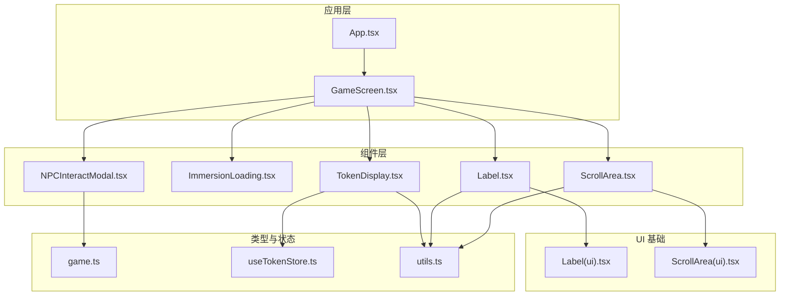
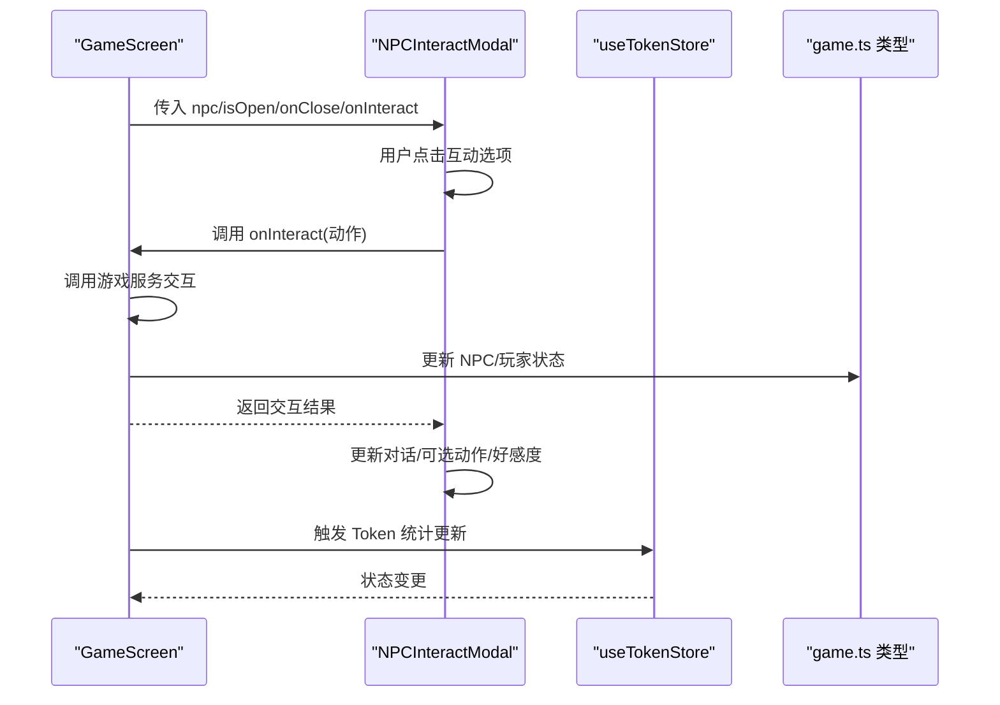
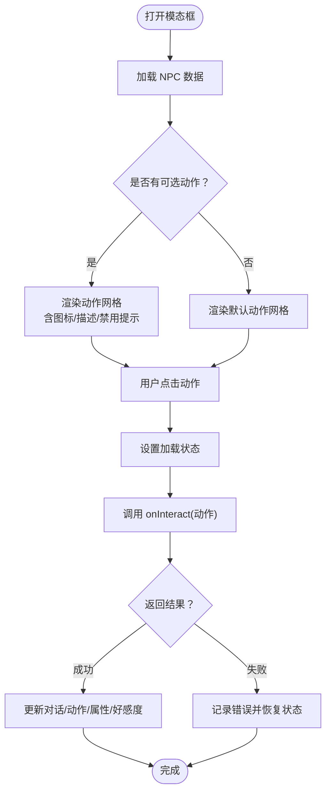
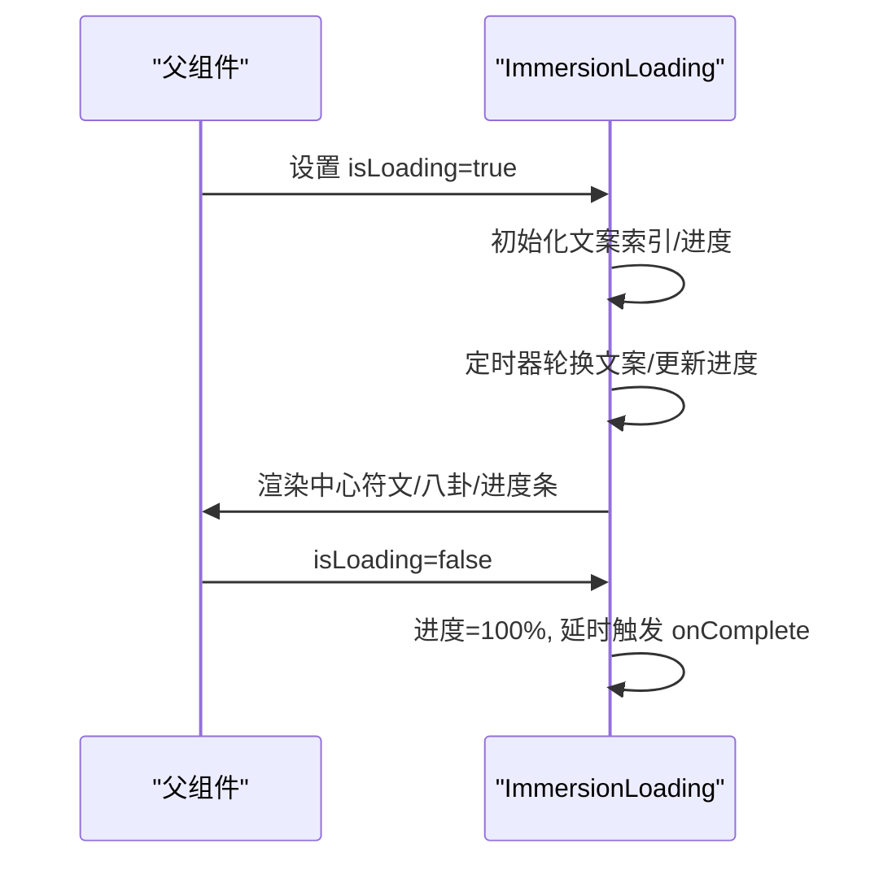
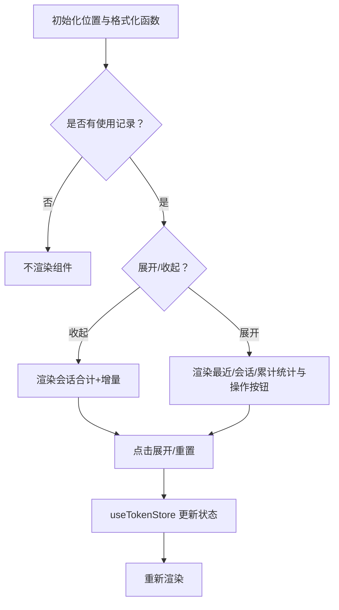
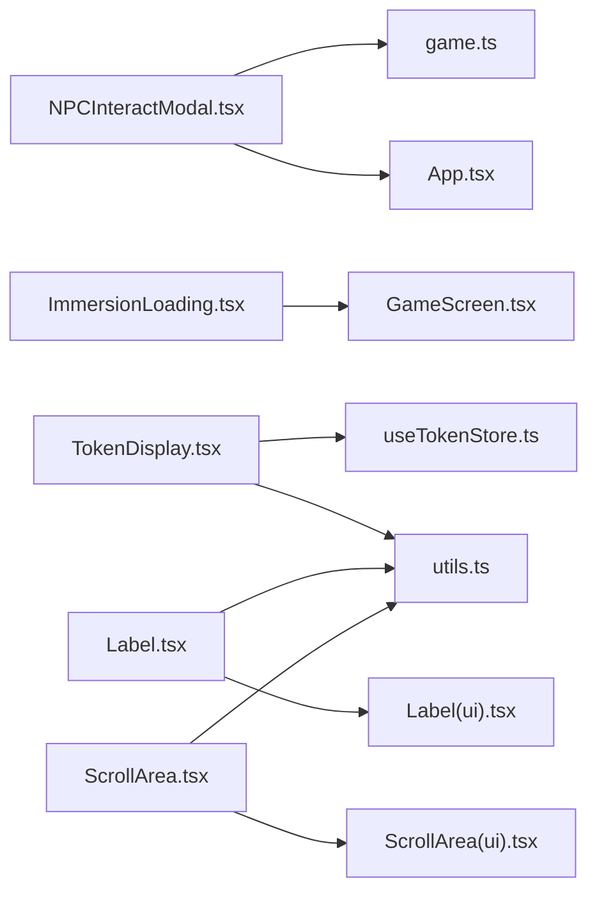

# 专用组件

<cite>
**本文引用的文件**
- [NPCInteractModal.tsx](file://src/components/NPCInteractModal.tsx)
- [ImmersionLoading.tsx](file://src/components/ImmersionLoading.tsx)
- [TokenDisplay.tsx](file://src/components/TokenDisplay.tsx)
- [Label.tsx](file://src/components/Label.tsx)
- [ScrollArea.tsx](file://src/components/ScrollArea.tsx)
- [Label(ui).tsx](file://src/components/ui/label.tsx)
- [ScrollArea(ui).tsx](file://src/components/ui/scroll-area.tsx)
- [game.ts](file://src/types/game.ts)
- [useTokenStore.ts](file://src/stores/useTokenStore.ts)
- [utils.ts](file://src/lib/utils.ts)
- [App.tsx](file://src/App.tsx)
- [GameScreen.tsx](file://src/components/GameScreen.tsx)
</cite>

## 目录
1. [引言](#引言)
2. [项目结构](#项目结构)
3. [核心组件](#核心组件)
4. [架构总览](#架构总览)
5. [组件详解](#组件详解)
6. [依赖关系分析](#依赖关系分析)
7. [性能考量](#性能考量)
8. [故障排查指南](#故障排查指南)
9. [结论](#结论)
10. [附录](#附录)

## 引言
本文件聚焦于本项目的专用组件：NPC 交互模态框、沉浸式加载、Token 统计显示、自定义标签、自定义滚动区域。我们将从设计目标、功能特性、交互模式、配置与样式、动画效果、与主应用的集成方式、状态管理策略、事件处理机制、性能优化、用户体验与可访问性等方面进行系统化说明，并结合修仙游戏场景给出具体的应用与设计考量。

## 项目结构
这些组件位于 src/components 下，围绕游戏主界面 GameScreen 进行组合使用；同时，类型定义与状态管理分别位于 src/types 与 src/stores，UI 基础组件位于 src/components/ui。

**图表来源**
- [GameScreen.tsx](file://src/components/GameScreen.tsx#L156-L168)
- [NPCInteractModal.tsx](file://src/components/NPCInteractModal.tsx#L1-L223)
- [ImmersionLoading.tsx](file://src/components/ImmersionLoading.tsx#L1-L329)
- [TokenDisplay.tsx](file://src/components/TokenDisplay.tsx#L1-L172)
- [Label.tsx](file://src/components/Label.tsx#L1-L28)
- [ScrollArea.tsx](file://src/components/ScrollArea.tsx#L1-L48)
- [Label(ui).tsx](file://src/components/ui/label.tsx#L1-L25)
- [ScrollArea(ui).tsx](file://src/components/ui/scroll-area.tsx#L1-L47)
- [game.ts](file://src/types/game.ts#L173-L203)
- [useTokenStore.ts](file://src/stores/useTokenStore.ts#L1-L73)
- [utils.ts](file://src/lib/utils.ts#L1-L7)
- [App.tsx](file://src/App.tsx#L564-L580)

**章节来源**
- [GameScreen.tsx](file://src/components/GameScreen.tsx#L156-L168)
- [App.tsx](file://src/App.tsx#L564-L580)

## 核心组件
- NPCInteractModal：NPC 交互模态框，提供多种互动选项、动态对话展示、好感度可视化、探查属性展示与加载反馈。
- ImmersionLoading：沉浸式加载，支持多主题文案与动画，提供进度条与粒子效果，适配剧情推演等长耗时操作。
- TokenDisplay：Token 使用统计显示，悬浮卡片形式，支持展开/收起、位置控制、会话与累计统计、重置功能。
- Label：基于 Radix UI 的自定义标签组件，统一样式变体，便于表单与输入控件的标签一致性。
- ScrollArea：基于 Radix UI 的自定义滚动区域，提供可定制滚动条与滚动行为，满足面板内容滚动需求。

**章节来源**
- [NPCInteractModal.tsx](file://src/components/NPCInteractModal.tsx#L1-L223)
- [ImmersionLoading.tsx](file://src/components/ImmersionLoading.tsx#L1-L329)
- [TokenDisplay.tsx](file://src/components/TokenDisplay.tsx#L1-L172)
- [Label.tsx](file://src/components/Label.tsx#L1-L28)
- [ScrollArea.tsx](file://src/components/ScrollArea.tsx#L1-L48)

## 架构总览
组件与应用的集成路径如下：
- GameScreen 将 NPCInteractModal、ImmersionLoading、TokenDisplay 作为子组件挂载，负责状态传递与事件回调。
- NPCInteractModal 通过 onInteract 回调与游戏服务交互，返回对话与可选动作，驱动 UI 更新。
- ImmersionLoading 由 GameScreen 的 isLoading 控制显示与隐藏，并在完成时触发回调。
- TokenDisplay 读取 useTokenStore 的状态，提供会话与累计统计，支持重置。

**图表来源**
- [GameScreen.tsx](file://src/components/GameScreen.tsx#L156-L168)
- [NPCInteractModal.tsx](file://src/components/NPCInteractModal.tsx#L37-L54)
- [useTokenStore.ts](file://src/stores/useTokenStore.ts#L31-L72)
- [game.ts](file://src/types/game.ts#L265-L285)

**章节来源**
- [GameScreen.tsx](file://src/components/GameScreen.tsx#L156-L168)
- [NPCInteractModal.tsx](file://src/components/NPCInteractModal.tsx#L37-L54)
- [useTokenStore.ts](file://src/stores/useTokenStore.ts#L31-L72)
- [game.ts](file://src/types/game.ts#L265-L285)

## 组件详解

### NPCInteractModal：NPC 交互模态框
- 功能与使用场景
  - 在玩家选择 NPC 后弹出，提供“打听消息”“赠送礼物”“切磋”“探查”“结为好友/道侣”“离开”等互动选项。
  - 支持动态对话展示、已探查属性网格展示、好感度条与等级/颜色映射。
  - 适用于修仙世界中的人际关系构建、任务触发、剧情推进与资源交换。
- 交互模式
  - 打开/关闭：由父组件传入 isOpen 与 onClose 控制；点击“离开”或“X”按钮关闭。
  - 互动：点击选项后进入加载状态，调用 onInteract 获取结果，更新对话与可选动作。
  - 禁用选项：当某选项不可用时，显示原因提示，按钮禁用。
- 配置选项
  - props：npc（当前 NPC）、isOpen（是否打开）、onClose（关闭回调）、onInteract（交互回调，Promise 返回结果）。
  - 内部状态：对话文本、可选动作列表、加载状态、是否已交互。
- 样式与动画
  - 背景遮罩与模态框入场/出场使用 Framer Motion；好感度条、对话气泡、属性网格均有独立动画。
  - 好感度颜色与等级通过工具函数映射，图标按动作类型匹配。
- 事件处理机制
  - onInteract 返回 NPCInteractResult，包含 dialogue、possibleInteractions、npcStateDelta、playerStateDelta、timePassed、storyUpdate 等。
  - 父组件根据返回值更新 NPC 状态、玩家状态、剧情日志与时间。
- 性能与体验
  - 使用 AnimatePresence 与延迟入场，避免不必要的渲染。
  - 对话与选项网格采用分步动画，提升阅读节奏。
- 可访问性
  - 按钮具备 title 提示与禁用态视觉反馈；焦点顺序由指针事件控制，建议在需要时补充键盘导航。
- 设计考量（修仙场景）
  - “道侣”“结为好友”等选项贴合修仙世界的人情世故；探查属性体现修仙者对战力的敏感。
  - 好感度系统与等级颜色增强情感反馈与策略深度。

**图表来源**
- [NPCInteractModal.tsx](file://src/components/NPCInteractModal.tsx#L37-L54)
- [game.ts](file://src/types/game.ts#L265-L285)

**章节来源**
- [NPCInteractModal.tsx](file://src/components/NPCInteractModal.tsx#L1-L223)
- [game.ts](file://src/types/game.ts#L173-L203)
- [game.ts](file://src/types/game.ts#L265-L285)
- [App.tsx](file://src/App.tsx#L481-L548)

### ImmersionLoading：沉浸式加载
- 功能与使用场景
  - 在角色创建、故事推演、突破、占卜等长耗时操作期间提供沉浸式反馈。
  - 支持多主题文案（character/story/breakthrough/divination），动态进度条与粒子特效。
- 交互模式
  - 由父组件传入 isLoading 控制显示；完成时自动过渡到 100% 进度并触发 onComplete。
- 配置选项
  - props：isLoading（是否显示）、type（主题类型）、message（自定义文案）、onComplete（完成回调）。
- 样式与动画
  - 中心符文与八卦符号循环出现，多层旋转光环与脉冲光效营造“灵气汇聚”的氛围。
  - 进度条带光带扫过效果，文本与符文使用 AnimatePresence 进行交叉淡入。
- 事件处理机制
  - 通过定时器更新提示语索引与进度值；完成时延时触发回调。
- 性能与体验
  - 文案与进度更新使用节流式定时器，避免高频重绘；动画使用 Framer Motion 的内置缓动。
- 可访问性
  - 加载期间保持页面可读性与可操作性；建议在无障碍场景下提供替代文本或语音提示。
- 设计考量（修仙场景）
  - 八卦、符文、灵气粒子等元素强化世界观沉浸感；主题文案与场景契合度高。

**图表来源**
- [ImmersionLoading.tsx](file://src/components/ImmersionLoading.tsx#L63-L111)
- [ImmersionLoading.tsx](file://src/components/ImmersionLoading.tsx#L114-L274)

**章节来源**
- [ImmersionLoading.tsx](file://src/components/ImmersionLoading.tsx#L1-L329)
- [GameScreen.tsx](file://src/components/GameScreen.tsx#L159-L160)

### TokenDisplay：Token 统计显示
- 功能与使用场景
  - 在游戏过程中悬浮显示 Token 使用统计，支持展开查看最近一次、本次会话与累计使用情况。
  - 提供清空会话统计与重置全部统计的操作，不破坏游戏存档。
- 交互模式
  - 收缩态：仅显示会话合计与最近一次增量；点击展开详情。
  - 展开态：显示三个层级统计与操作按钮；点击“X”收起。
- 配置选项
  - props：position（位置 top-left/top-right/bottom-left/bottom-right，默认 bottom-right）。
- 样式与动画
  - 使用 AnimatePresence 的 wait 模式保证展开/收起的流畅过渡；圆角卡片、模糊背景与渐变边框营造沉浸感。
- 状态管理策略
  - 通过 useTokenStore 管理 lastUsage、sessionUsage、totalUsage，并提供 addUsage、resetSession、resetAll 等方法。
  - 本地持久化仅保留 totalUsage，避免频繁写入。
- 事件处理机制
  - 点击按钮触发对应操作；格式化数字支持 K/M 显示。
- 性能与体验
  - 未使用过模型时不渲染，减少无意义 DOM；展开/收起动画短促，降低卡顿。
- 可访问性
  - 按钮具备 hover/active 状态反馈；建议为按钮添加 aria-label。
- 设计考量（修仙场景）
  - Token 统计与 LLM 调用成本相关，提供透明度有助于玩家控制资源消耗。

**图表来源**
- [TokenDisplay.tsx](file://src/components/TokenDisplay.tsx#L10-L32)
- [TokenDisplay.tsx](file://src/components/TokenDisplay.tsx#L147-L171)
- [useTokenStore.ts](file://src/stores/useTokenStore.ts#L31-L72)

**章节来源**
- [TokenDisplay.tsx](file://src/components/TokenDisplay.tsx#L1-L172)
- [useTokenStore.ts](file://src/stores/useTokenStore.ts#L1-L73)
- [utils.ts](file://src/lib/utils.ts#L1-L7)

### Label：自定义标签
- 功能与使用场景
  - 基于 Radix UI Label 的封装，提供统一的文本样式与变体能力，常用于表单控件的标签。
- 配置选项
  - 接受原生 Label 属性与变体参数，通过 class-variance-authority 实现样式组合。
- 样式与动画
  - 无额外动画，强调简洁一致的视觉语言。
- 设计考量（修仙场景）
  - 与 UI 主题一致，确保标签在不同表单与设置面板中保持统一风格。

**章节来源**
- [Label.tsx](file://src/components/Label.tsx#L1-L28)
- [Label(ui).tsx](file://src/components/ui/label.tsx#L1-L25)

### ScrollArea：自定义滚动区域
- 功能与使用场景
  - 基于 Radix UI 的滚动区域组件，提供可定制滚动条与滚动行为，适合面板、日志、列表等内容区域。
- 配置选项
  - 支持垂直/水平滚动方向，滚动条宽度、边框与拇指样式可定制。
- 样式与动画
  - 滚动条拇指使用圆角与半透明背景，与整体暗色主题协调。
- 设计考量（修仙场景）
  - 在 NPC 面板、故事日志等需要纵向滚动的区域提供顺滑体验。

**章节来源**
- [ScrollArea.tsx](file://src/components/ScrollArea.tsx#L1-L48)
- [ScrollArea(ui).tsx](file://src/components/ui/scroll-area.tsx#L1-L47)

## 依赖关系分析
- 组件耦合
  - NPCInteractModal 依赖 game.ts 的 NPC/NPCInteractResult 类型与工具函数；与 App/GameScreen 通过 props 通信。
  - ImmersionLoading 为纯展示组件，依赖 Framer Motion；与父组件通过 isLoading/onComplete 通信。
  - TokenDisplay 依赖 useTokenStore；与 utils 的 cn 组合类名。
  - Label/ScrollArea 依赖 Radix UI 与 utils 的 cn。
- 外部依赖
  - Framer Motion：用于入场/出场与复杂动画。
  - Radix UI：提供无障碍基础组件。
  - Tailwind CSS + class-variance-authority：提供样式变体与合并逻辑。
- 潜在循环依赖
  - 未发现直接循环导入；组件通过 props 与回调解耦。

**图表来源**
- [NPCInteractModal.tsx](file://src/components/NPCInteractModal.tsx#L1-L5)
- [game.ts](file://src/types/game.ts#L173-L203)
- [App.tsx](file://src/App.tsx#L564-L580)
- [GameScreen.tsx](file://src/components/GameScreen.tsx#L159-L168)
- [TokenDisplay.tsx](file://src/components/TokenDisplay.tsx#L1-L4)
- [useTokenStore.ts](file://src/stores/useTokenStore.ts#L1-L3)
- [utils.ts](file://src/lib/utils.ts#L1-L7)
- [Label.tsx](file://src/components/Label.tsx#L1-L8)
- [Label(ui).tsx](file://src/components/ui/label.tsx#L1-L5)
- [ScrollArea.tsx](file://src/components/ScrollArea.tsx#L1-L5)
- [ScrollArea(ui).tsx](file://src/components/ui/scroll-area.tsx#L1-L4)

**章节来源**
- [NPCInteractModal.tsx](file://src/components/NPCInteractModal.tsx#L1-L5)
- [game.ts](file://src/types/game.ts#L173-L203)
- [App.tsx](file://src/App.tsx#L564-L580)
- [GameScreen.tsx](file://src/components/GameScreen.tsx#L159-L168)
- [TokenDisplay.tsx](file://src/components/TokenDisplay.tsx#L1-L4)
- [useTokenStore.ts](file://src/stores/useTokenStore.ts#L1-L3)
- [utils.ts](file://src/lib/utils.ts#L1-L7)
- [Label.tsx](file://src/components/Label.tsx#L1-L8)
- [Label(ui).tsx](file://src/components/ui/label.tsx#L1-L5)
- [ScrollArea.tsx](file://src/components/ScrollArea.tsx#L1-L5)
- [ScrollArea(ui).tsx](file://src/components/ui/scroll-area.tsx#L1-L4)

## 性能考量
- 动画与渲染
  - 使用 AnimatePresence 与延迟入场，避免一次性渲染大量节点。
  - NPC 互动选项网格使用分步动画，降低首屏压力。
- 状态与存储
  - Token 统计仅持久化 totalUsage，减少存储体积与写入频率。
  - useTokenStore 使用局部状态更新，避免全局风暴。
- 交互反馈
  - 加载与禁用态通过状态切换而非强制重绘，保持流畅。
- 可访问性
  - 建议为按钮添加 aria-label 与键盘导航；对动画提供“减少运动”偏好设置。

[本节为通用指导，无需特定文件来源]

## 故障排查指南
- NPC 交互无响应
  - 检查 isOpen 与 onClose 是否正确传递；确认 onInteract 返回值结构符合 NPCInteractResult。
  - 查看控制台错误日志，确认游戏服务调用是否抛错。
- 好感度显示异常
  - 确认 favor 数值范围与 getFavorLevel/getFavorColor 的映射逻辑。
- 沉浸式加载不消失
  - 确认 isLoading 切换逻辑；检查 onComplete 是否被调用。
- Token 统计不更新
  - 确认 useTokenStore.addUsage 是否被调用；检查 localStorage 是否被清理。
- 滚动条样式异常
  - 检查 ScrollArea 的 orientation 与类名组合；确认 Tailwind 样式是否生效。

**章节来源**
- [NPCInteractModal.tsx](file://src/components/NPCInteractModal.tsx#L37-L54)
- [ImmersionLoading.tsx](file://src/components/ImmersionLoading.tsx#L102-L111)
- [useTokenStore.ts](file://src/stores/useTokenStore.ts#L38-L51)
- [ScrollArea.tsx](file://src/components/ScrollArea.tsx#L25-L44)

## 结论
上述专用组件围绕修仙游戏的核心交互与体验进行了专门设计：NPC 交互模态框承载了丰富的人际关系与剧情推进；沉浸式加载提升了长耗时操作的沉浸感；Token 统计显示增强了资源透明度；自定义标签与滚动区域则完善了 UI 一致性与可访问性。通过清晰的状态管理与事件处理机制，这些组件与主应用实现了松耦合集成，在保证性能的同时提供了良好的用户体验与可扩展性。

[本节为总结，无需特定文件来源]

## 附录
- 术语说明
  - NPC：非玩家角色，具有属性、关系与互动选项。
  - Token：大模型调用的计量单位，用于统计与成本控制。
  - 好感度：NPC 对玩家的情感倾向，影响互动结果与后续剧情。
- 相关类型与状态
  - NPC/NPCInteractResult：见 game.ts。
  - TokenUsage/TokenStore：见 useTokenStore.ts。

**章节来源**
- [game.ts](file://src/types/game.ts#L173-L203)
- [game.ts](file://src/types/game.ts#L265-L285)
- [useTokenStore.ts](file://src/stores/useTokenStore.ts#L4-L23)