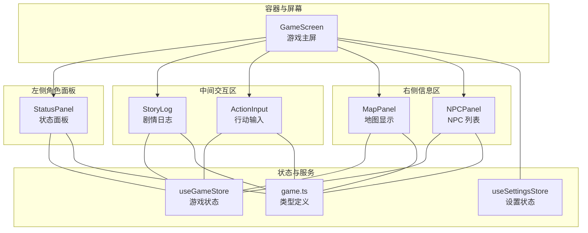
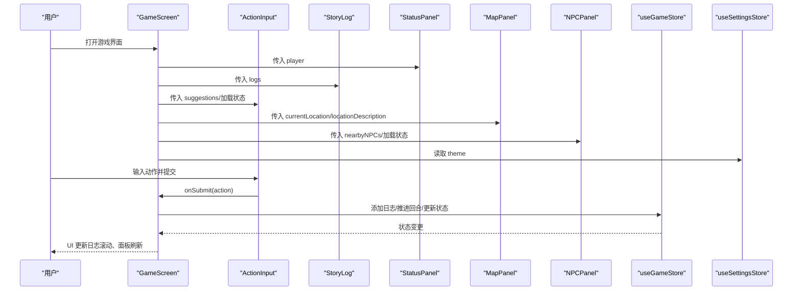
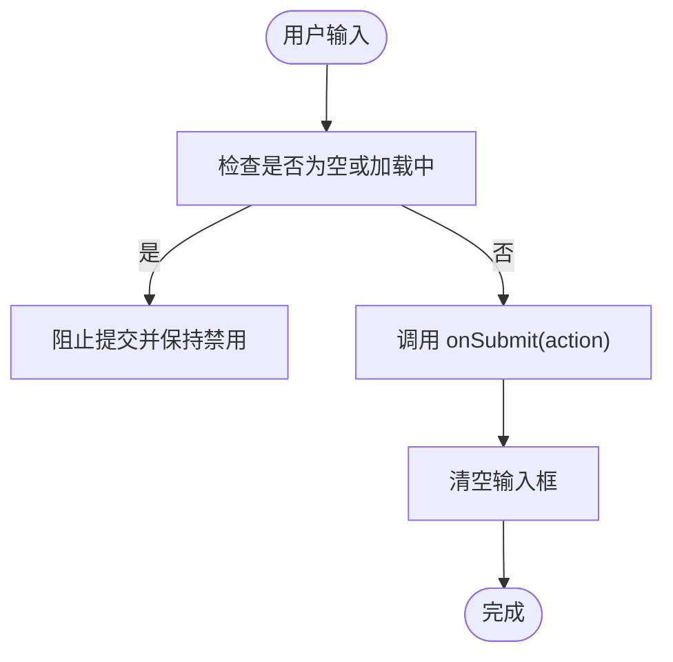
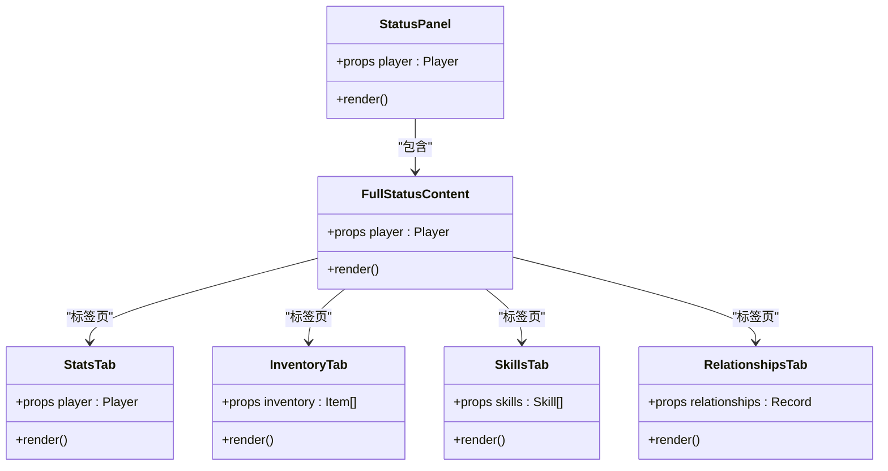
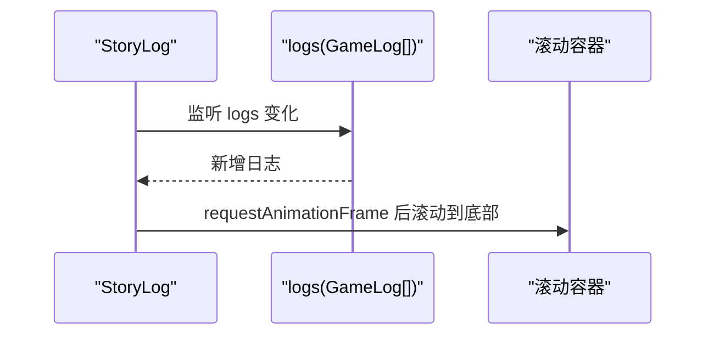
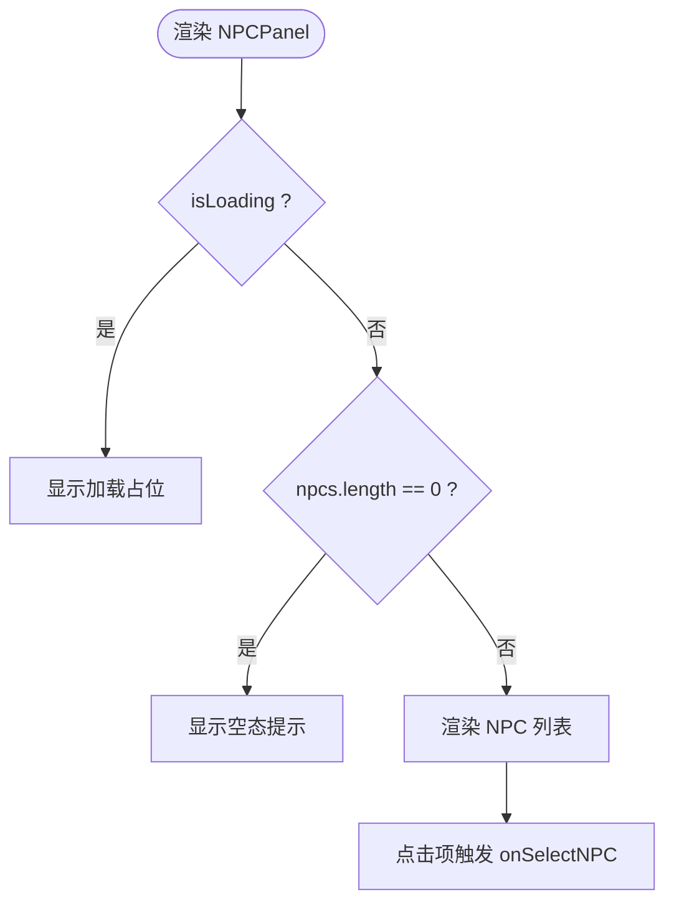
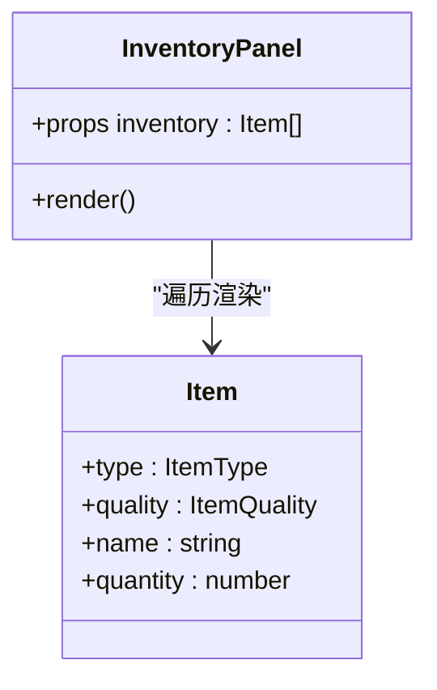
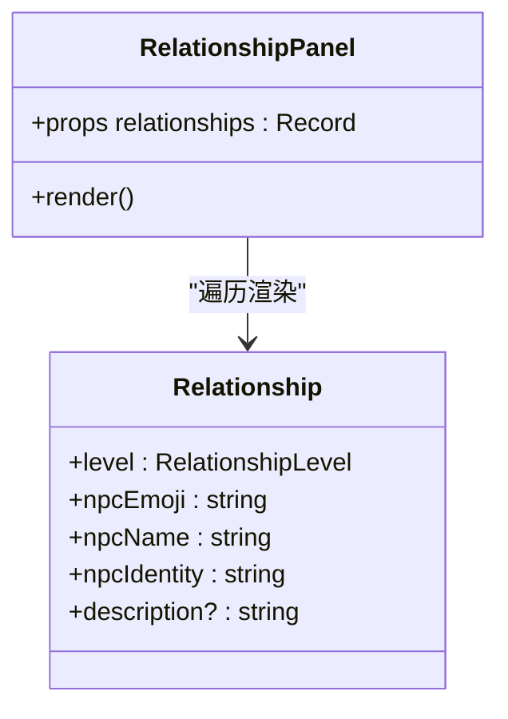
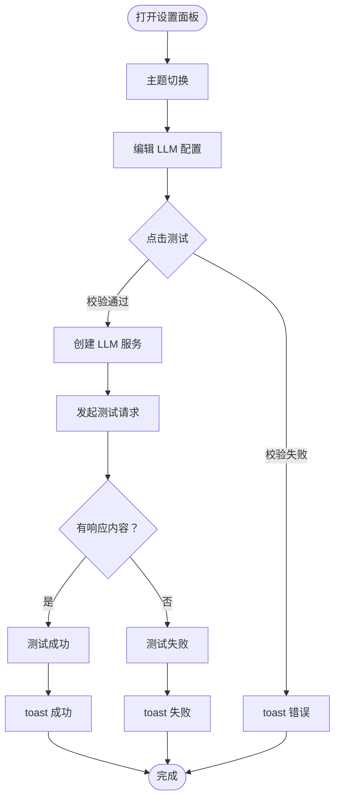
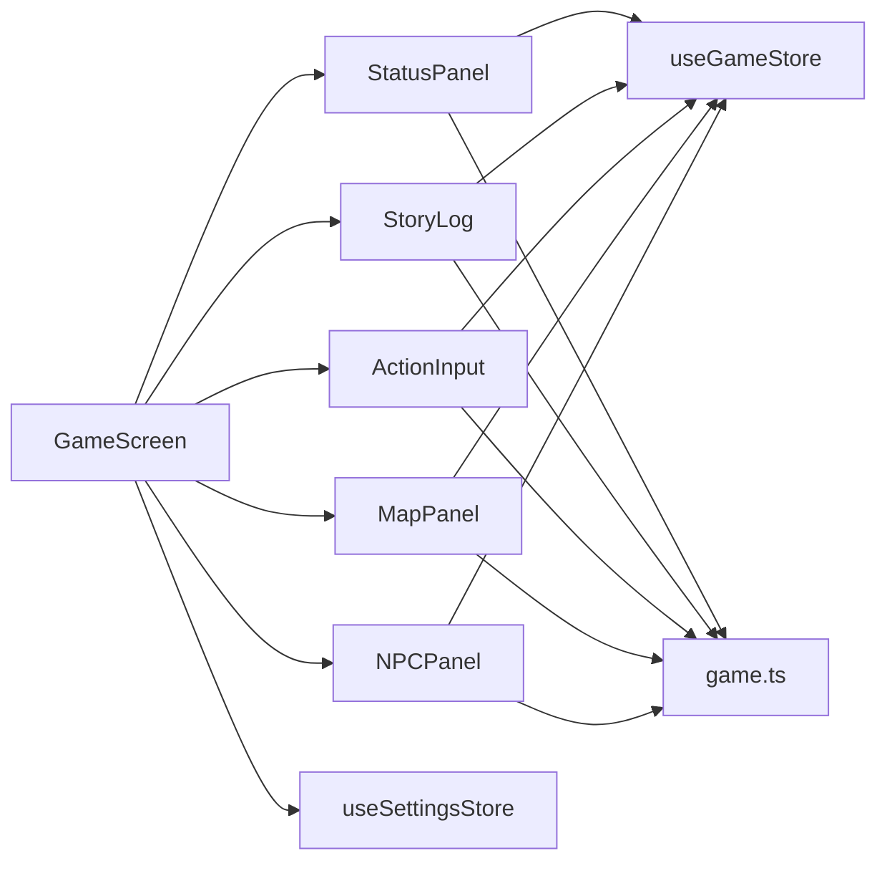

# 功能组件

<cite>
**本文引用的文件**
- [ActionInput.tsx](file://src/components/ActionInput.tsx)
- [StatusPanel.tsx](file://src/components/StatusPanel.tsx)
- [StoryLog.tsx](file://src/components/StoryLog.tsx)
- [NPCPanel.tsx](file://src/components/NPCPanel.tsx)
- [InventoryPanel.tsx](file://src/components/InventoryPanel.tsx)
- [RelationshipPanel.tsx](file://src/components/RelationshipPanel.tsx)
- [SettingsPanel.tsx](file://src/components/SettingsPanel.tsx)
- [MapPanel.tsx](file://src/components/MapPanel.tsx)
- [GameScreen.tsx](file://src/components/GameScreen.tsx)
- [game.ts](file://src/types/game.ts)
- [useGameStore.ts](file://src/stores/useGameStore.ts)
- [useSettingsStore.ts](file://src/stores/useSettingsStore.ts)
- [button.tsx](file://src/components/ui/button.tsx)
- [tabs.tsx](file://src/components/ui/tabs.tsx)
- [utils.ts](file://src/lib/utils.ts)
</cite>

## 目录
1. [引言](#引言)
2. [项目结构](#项目结构)
3. [核心组件](#核心组件)
4. [架构总览](#架构总览)
5. [详细组件分析](#详细组件分析)
6. [依赖分析](#依赖分析)
7. [性能考虑](#性能考虑)
8. [故障排查指南](#故障排查指南)
9. [结论](#结论)
10. [附录](#附录)

## 引言
本文件面向“功能组件”的设计与实现进行系统化文档化，覆盖以下核心组件：ActionInput 行动输入、StatusPanel 状态显示、StoryLog 剧情日志、NPCPanel NPC 列表、InventoryPanel 背包管理、RelationshipPanel 关系面板、SettingsPanel 设置面板、MapPanel 地图显示。文档从职责边界、数据绑定模式、用户交互处理、可复用性与配置、样式定制、组件间通信与状态共享、事件传播路径、性能优化与懒加载策略、错误处理机制，以及每个组件的 Props 接口、事件回调与状态管理方式等方面展开。

## 项目结构
该应用采用按功能分层的组件组织方式，核心游戏屏幕 GameScreen 作为容器，协调多个功能面板；状态通过 Zustand 存储集中管理；UI 基础组件来自自研 UI 库与 Radix UI 组合。

图表来源
- [GameScreen.tsx](file://src/components/GameScreen.tsx#L15-L30)
- [StatusPanel.tsx](file://src/components/StatusPanel.tsx#L8-L12)
- [StoryLog.tsx](file://src/components/StoryLog.tsx#L6-L8)
- [ActionInput.tsx](file://src/components/ActionInput.tsx#L8-L12)
- [MapPanel.tsx](file://src/components/MapPanel.tsx#L3-L6)
- [NPCPanel.tsx](file://src/components/NPCPanel.tsx#L5-L9)
- [useGameStore.ts](file://src/stores/useGameStore.ts#L13-L55)
- [useSettingsStore.ts](file://src/stores/useSettingsStore.ts#L5-L10)
- [game.ts](file://src/types/game.ts#L110-L251)

章节来源
- [GameScreen.tsx](file://src/components/GameScreen.tsx#L15-L30)
- [useGameStore.ts](file://src/stores/useGameStore.ts#L84-L225)
- [useSettingsStore.ts](file://src/stores/useSettingsStore.ts#L24-L45)
- [game.ts](file://src/types/game.ts#L110-L251)

## 核心组件
- ActionInput：提供玩家输入与建议触发、发送按钮禁用逻辑、键盘快捷键支持、加载态旋转指示。
- StatusPanel：角色状态的桌面/移动双形态展示，含标签页切换、属性/背包/功法/关系四类内容。
- StoryLog：剧情日志渲染，自动滚动至底部，按消息类型区分样式与 Markdown 渲染。
- NPCPanel：附近 NPC 列表，支持加载占位、空态提示、点击选择回调。
- InventoryPanel：背包列表卡片式展示，按品质与类型映射图标与颜色。
- RelationshipPanel：人际关系卡片式展示，按关系等级映射图标与边框/背景色。
- SettingsPanel：LLM 配置与主题切换，支持连接测试、保存、重置。
- MapPanel：当前区域信息展示，预留地图扩展占位。

章节来源
- [ActionInput.tsx](file://src/components/ActionInput.tsx#L8-L146)
- [StatusPanel.tsx](file://src/components/StatusPanel.tsx#L8-L503)
- [StoryLog.tsx](file://src/components/StoryLog.tsx#L6-L172)
- [NPCPanel.tsx](file://src/components/NPCPanel.tsx#L5-L99)
- [InventoryPanel.tsx](file://src/components/InventoryPanel.tsx#L7-L95)
- [RelationshipPanel.tsx](file://src/components/RelationshipPanel.tsx#L7-L104)
- [SettingsPanel.tsx](file://src/components/SettingsPanel.tsx#L11-L160)
- [MapPanel.tsx](file://src/components/MapPanel.tsx#L3-L45)

## 架构总览
组件间通过容器组件 GameScreen 进行编排，状态由 useGameStore 与 useSettingsStore 提供，类型定义集中在 game.ts。UI 基础组件来自自研 ui 与 Radix UI。

图表来源
- [GameScreen.tsx](file://src/components/GameScreen.tsx#L32-L46)
- [ActionInput.tsx](file://src/components/ActionInput.tsx#L14-L28)
- [StoryLog.tsx](file://src/components/StoryLog.tsx#L10-L20)
- [useGameStore.ts](file://src/stores/useGameStore.ts#L144-L154)
- [useSettingsStore.ts](file://src/stores/useSettingsStore.ts#L16-L18)

## 详细组件分析

### ActionInput 行动输入
- 职责与功能
  - 文本输入与多行编辑，支持 Enter 发送、Shift+Enter 换行。
  - 建议按钮组，移动端横向滚动，桌面端换行显示，点击即提交。
  - 加载态禁用输入与按钮，显示旋转指示。
  - 底部提示文案随加载状态动态变化。
- 数据绑定与交互
  - 受控输入：本地状态驱动输入框值。
  - 外部回调：onSubmit(action) 传递清理后的纯文本。
  - 建议数组：suggestions 默认空数组，AnimatePresence 控制显隐。
- Props 接口
  - onSubmit: (action: string) => void
  - isLoading?: boolean
  - suggestions?: string[]
- 事件与状态
  - 键盘事件：handleKeyDown 处理 Enter/Shift+Enter。
  - 点击事件：按钮禁用条件与加载态联动。
- 性能与体验
  - Framer Motion 动画仅在显隐时触发，避免常驻动画开销。
  - 移动端建议区使用横向滚动，减少垂直空间占用。
- 错误处理
  - 输入为空或加载中时阻止提交，避免重复请求。
- 可复用性与定制
  - 通过 suggestions 注入建议，支持不同场景的预设动作。
  - 样式基于通用 ink-card 与按钮变体，便于主题切换。

图表来源
- [ActionInput.tsx](file://src/components/ActionInput.tsx#L17-L21)
- [ActionInput.tsx](file://src/components/ActionInput.tsx#L23-L28)

章节来源
- [ActionInput.tsx](file://src/components/ActionInput.tsx#L8-L146)

### StatusPanel 状态显示
- 职责与功能
  - 桌面端：完整面板，含头像、境界、修为/寿元进度条、四标签页（属性/背包/功法/关系）。
  - 移动端：紧凑面板，弹窗展开完整内容。
  - 数据容错：对缺失字段提供默认值，避免 NaN。
- 数据绑定与交互
  - 传入 Player，内部计算修为百分比与寿元剩余百分比。
  - 标签页切换：Tabs 组件与受控状态 activeTab。
  - 移动端通过 Dialog 控制展开。
- Props 接口
  - player: Player
- 内部子组件
  - StatBar/CompactStatBar：进度条渲染，支持警告色。
  - MiniTag：移动端迷你标签。
  - StatsTab/InventoryTab/SkillsTab/RelationshipsTab：对应标签页内容。
- 性能与体验
  - 使用 Framer Motion 渐入动画，列表项逐项延迟进入。
  - 移动端弹窗使用对话框，避免全屏刷新。
- 错误处理
  - 容错对象 safePlayer 防止热更新后字段丢失。
- 可复用性与定制
  - 进度条与标签组件可独立复用到其他面板。
  - 样式通过 CSS 类名与主题变量组合，支持主题切换。

图表来源
- [StatusPanel.tsx](file://src/components/StatusPanel.tsx#L14-L206)
- [StatusPanel.tsx](file://src/components/StatusPanel.tsx#L278-L493)

章节来源
- [StatusPanel.tsx](file://src/components/StatusPanel.tsx#L8-L503)
- [tabs.tsx](file://src/components/ui/tabs.tsx#L6-L53)

### StoryLog 剧情日志
- 职责与功能
  - 自动滚动到底部，保证最新日志可见。
  - 消息类型区分：玩家行动（右对齐气泡）、AI 剧情（左对齐气泡 + Markdown）、对话（琥珀气泡）、系统消息（居中细字）。
  - 空态提示与时间戳格式化。
- 数据绑定与交互
  - 传入 GameLog[]，内部使用 AnimatePresence 控制新增项动画。
  - 滚动容器使用原生 div，通过 ref 控制 scrollTop。
- Props 接口
  - logs: GameLog[]
- 性能与体验
  - requestAnimationFrame 确保 DOM 更新后再滚动，避免闪烁。
  - 按消息类型使用不同动画曲线，增强阅读节奏。
- 错误处理
  - 空日志时显示友好提示。
- 可复用性与定制
  - LogMessage 子组件可独立复用，样式通过类名控制。

图表来源
- [StoryLog.tsx](file://src/components/StoryLog.tsx#L13-L20)
- [StoryLog.tsx](file://src/components/StoryLog.tsx#L41-L46)

章节来源
- [StoryLog.tsx](file://src/components/StoryLog.tsx#L6-L172)

### NPCPanel NPC 列表
- 职责与功能
  - 展示附近 NPC，支持加载态占位、空态提示。
  - 点击单个 NPC 触发 onSelectNPC 回调。
  - 好感度图标与颜色通过工具函数映射。
- 数据绑定与交互
  - 传入 npcs: NPC[]、onSelectNPC 回调、isLoading。
  - 列表项逐项动画进入，点击触发放大反馈。
- Props 接口
  - npcs: NPC[]
  - onSelectNPC: (npc: NPC) => void
  - isLoading?: boolean
- 性能与体验
  - 横向滚动适配移动端，避免纵向空间浪费。
  - 动画与交互过渡自然，提升可发现性。
- 错误处理
  - 加载态与空态分支清晰，避免异常渲染。
- 可复用性与定制
  - 通过回调解耦选择行为，适合多种上下文复用。

图表来源
- [NPCPanel.tsx](file://src/components/NPCPanel.tsx#L11-L98)
- [game.ts](file://src/types/game.ts#L287-L318)

章节来源
- [NPCPanel.tsx](file://src/components/NPCPanel.tsx#L5-L99)
- [game.ts](file://src/types/game.ts#L173-L203)

### InventoryPanel 背包管理
- 职责与功能
  - 展示玩家背包物品，按类型映射图标，按品质映射颜色。
  - 支持数量叠加显示与滚动区域。
- 数据绑定与交互
  - 传入 inventory: Item[]。
  - 图标与颜色映射函数封装，便于扩展。
- Props 接口
  - inventory: Item[]
- 性能与体验
  - 使用 ScrollArea 限制高度，避免长列表溢出。
  - 鼠标悬停高亮，点击反馈明确。
- 错误处理
  - 空背包友好提示。
- 可复用性与定制
  - 图标与颜色映射可注入，适配不同主题。

图表来源
- [InventoryPanel.tsx](file://src/components/InventoryPanel.tsx#L7-L95)
- [game.ts](file://src/types/game.ts#L73-L80)

章节来源
- [InventoryPanel.tsx](file://src/components/InventoryPanel.tsx#L7-L95)
- [game.ts](file://src/types/game.ts#L14-L25)

### RelationshipPanel 关系面板
- 职责与功能
  - 展示与 NPC 的关系，按关系等级映射图标与边框/背景色。
  - 显示 NPC 表情、姓名、身份与描述。
- 数据绑定与交互
  - 传入 relationships: Record<string, Relationship>。
  - 关系等级映射函数封装，便于扩展。
- Props 接口
  - relationships: Record<string, Relationship>
- 性能与体验
  - 使用 ScrollArea 限制高度，列表项逐项出现。
  - 边框与背景色区分关系亲疏，视觉直观。
- 错误处理
  - 空关系友好提示。
- 可复用性与定制
  - 颜色与图标映射可注入，适配不同主题。

图表来源
- [RelationshipPanel.tsx](file://src/components/RelationshipPanel.tsx#L7-L104)
- [game.ts](file://src/types/game.ts#L94-L108)

章节来源
- [RelationshipPanel.tsx](file://src/components/RelationshipPanel.tsx#L7-L104)
- [game.ts](file://src/types/game.ts#L43-L43)

### SettingsPanel 设置面板
- 职责与功能
  - LLM 模型配置：Base URL、API Key、模型名称。
  - 主题切换：日间/夜间。
  - 连接测试：创建服务实例并发起简短测试请求。
  - 保存与重置：调用状态存储方法。
- 数据绑定与交互
  - 通过 useSettingsStore 读写 llmConfig、theme。
  - 测试流程：校验必填项 -> 创建服务 -> 请求 -> 成功/失败提示 -> 状态恢复。
- Props 接口
  - onClose?: () => void
- 性能与体验
  - 测试状态机 idle/success/error，UI 反馈明确。
  - 动画与过渡提升交互质感。
- 错误处理
  - 缺失必填项时提示错误，捕获网络/解析异常并反馈。
- 可复用性与定制
  - 配置项可通过注入扩展，测试流程可抽象为通用 Hook。

图表来源
- [SettingsPanel.tsx](file://src/components/SettingsPanel.tsx#L15-L55)
- [useSettingsStore.ts](file://src/stores/useSettingsStore.ts#L24-L39)

章节来源
- [SettingsPanel.tsx](file://src/components/SettingsPanel.tsx#L11-L160)
- [useSettingsStore.ts](file://src/stores/useSettingsStore.ts#L24-L45)

### MapPanel 地图显示
- 职责与功能
  - 展示当前区域名称与描述，预留地图扩展占位。
- 数据绑定与交互
  - 传入 currentLocation 与 locationDescription。
- Props 接口
  - currentLocation: string
  - locationDescription?: string
- 性能与体验
  - 占位符提示未来扩展，避免空面板。
- 错误处理
  - 描述可选，避免渲染异常。
- 可复用性与定制
  - 结构简单，易于扩展为真实地图组件。

章节来源
- [MapPanel.tsx](file://src/components/MapPanel.tsx#L3-L45)

## 依赖分析
- 组件依赖
  - GameScreen 作为编排者，依赖所有功能组件与两个状态存储。
  - StatusPanel 依赖 UI Tabs 组件与类型定义。
  - StoryLog 依赖动画库与 Markdown 渲染库。
  - ActionInput 依赖 UI Button、Textarea 与动画库。
  - NPCPanel/InventoryPanel/RelationshipPanel/MapPanel 依赖类型定义与 UI 基础组件。
- 状态依赖
  - useGameStore 提供玩家、世界、日志、事件、记忆、回合数、加载与错误等全局状态。
  - useSettingsStore 提供 LLM 配置与主题状态。
- 类型依赖
  - game.ts 定义 Player、NPC、Item、Skill、Relationship、GameLog、World 等核心类型。

图表来源
- [GameScreen.tsx](file://src/components/GameScreen.tsx#L32-L46)
- [useGameStore.ts](file://src/stores/useGameStore.ts#L84-L225)
- [useSettingsStore.ts](file://src/stores/useSettingsStore.ts#L24-L45)
- [game.ts](file://src/types/game.ts#L110-L251)

章节来源
- [GameScreen.tsx](file://src/components/GameScreen.tsx#L32-L46)
- [useGameStore.ts](file://src/stores/useGameStore.ts#L84-L225)
- [useSettingsStore.ts](file://src/stores/useSettingsStore.ts#L24-L45)
- [game.ts](file://src/types/game.ts#L110-L251)

## 性能考虑
- 动画与渲染
  - 使用 Framer Motion 的 AnimatePresence 控制显隐，避免常驻动画。
  - 列表项使用延迟动画，避免一次性大量渲染。
- 滚动与布局
  - StoryLog 使用 requestAnimationFrame 后滚动，避免布局抖动。
  - ScrollArea 限定高度，避免长列表造成重排。
- 状态与存储
  - Zustand 持久化仅保存必要字段，减少存储体积。
  - 通过局部状态与 props 下发，降低全局订阅范围。
- 交互与反馈
  - 加载态统一禁用交互，避免并发请求。
  - Toast 与状态机反馈测试结果，减少无效重试。

[本节为通用指导，无需特定文件来源]

## 故障排查指南
- ActionInput 无法提交
  - 检查 isLoading 是否为 true 或输入为空。
  - 确认 onSubmit 回调正确传递 action。
- StoryLog 未自动滚动
  - 确认 logs 数组长度变化触发 useEffect。
  - 检查 ref 是否正确挂载。
- NPCPanel 一直显示加载
  - 确认 isLoading 与 npcs 切换逻辑。
  - 检查 onSelectNPC 回调是否被正确传入。
- SettingsPanel 测试失败
  - 检查必填项是否完整。
  - 查看网络请求与服务端响应。
- 状态不更新
  - 确认 useGameStore 的更新方法调用链路。
  - 检查持久化存储是否被意外清空。

章节来源
- [ActionInput.tsx](file://src/components/ActionInput.tsx#L17-L21)
- [StoryLog.tsx](file://src/components/StoryLog.tsx#L13-L20)
- [NPCPanel.tsx](file://src/components/NPCPanel.tsx#L12-L31)
- [SettingsPanel.tsx](file://src/components/SettingsPanel.tsx#L25-L55)
- [useGameStore.ts](file://src/stores/useGameStore.ts#L89-L94)

## 结论
上述功能组件围绕“容器编排 + 状态中心 + 类型约束 + UI 基础”构建，具备良好的可复用性与可扩展性。通过明确的 Props 接口、事件回调与状态管理方式，组件间通信清晰、职责边界明确。建议后续在以下方面持续优化：
- 将常用 UI 组件（如进度条、标签、卡片）进一步抽象为通用组件库。
- 在长列表场景引入虚拟滚动以提升性能。
- 将测试流程抽象为可复用 Hook，统一错误处理与提示。
- 逐步完善 MapPanel 与 NPC 互动模态框，增强沉浸式体验。

[本节为总结性内容，无需特定文件来源]

## 附录
- 样式与主题
  - 通用类名与工具函数：cn 来源于 utils.ts，结合 Tailwind 与主题变量。
  - 按钮变体：button.tsx 提供多种尺寸与风格，便于统一风格。
- 类型参考
  - 游戏核心类型集中在 game.ts，包括 Player、NPC、Item、Skill、Relationship、GameLog、World 等。

章节来源
- [utils.ts](file://src/lib/utils.ts#L4-L6)
- [button.tsx](file://src/components/ui/button.tsx#L7-L34)
- [game.ts](file://src/types/game.ts#L110-L251)