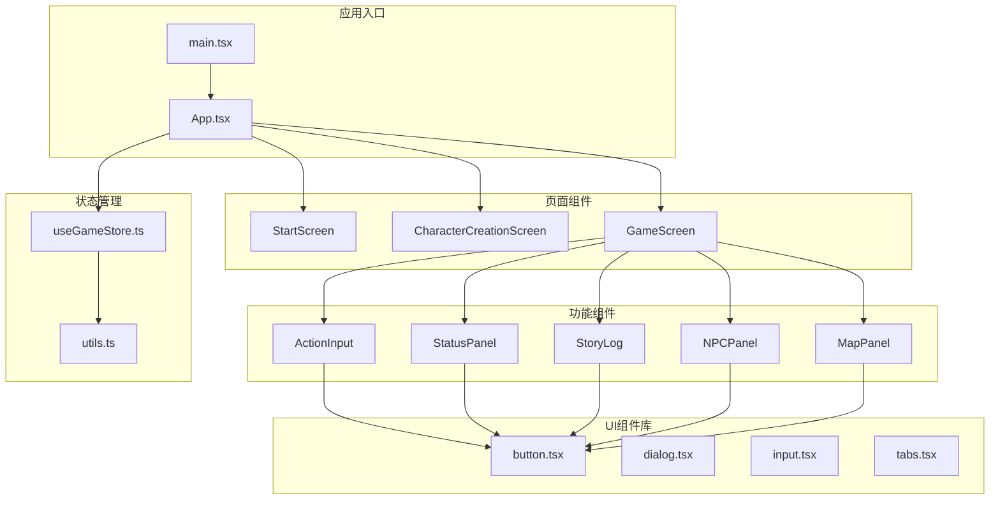
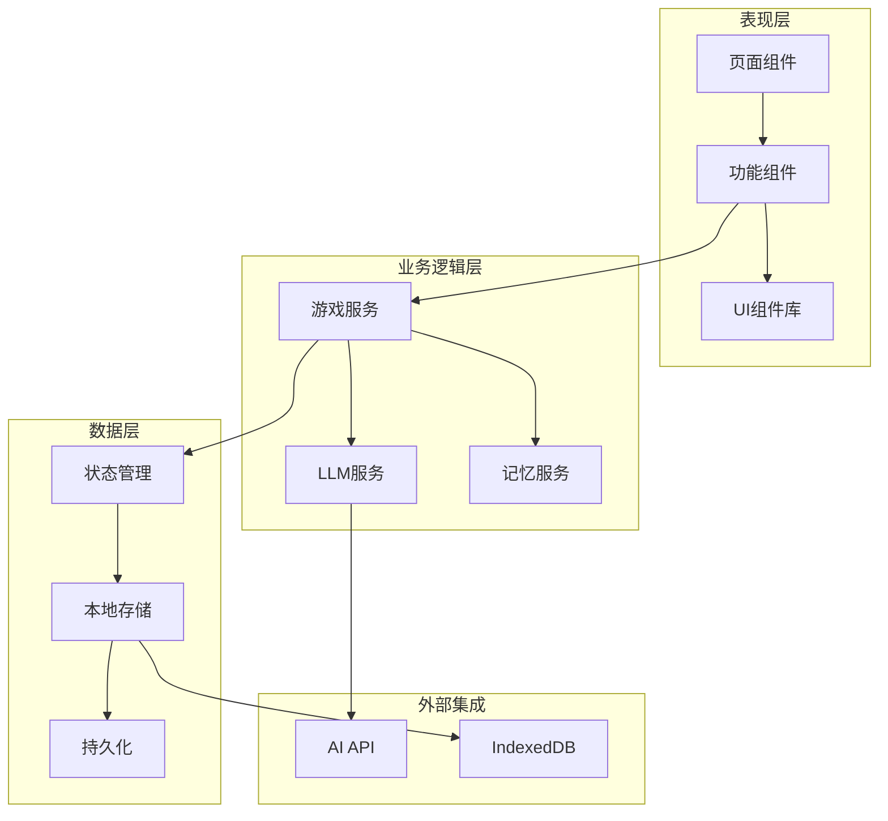
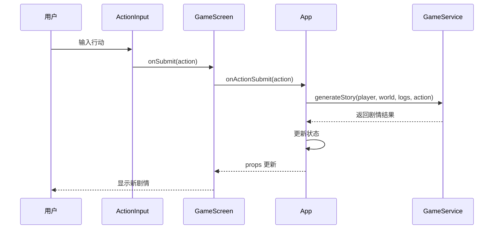
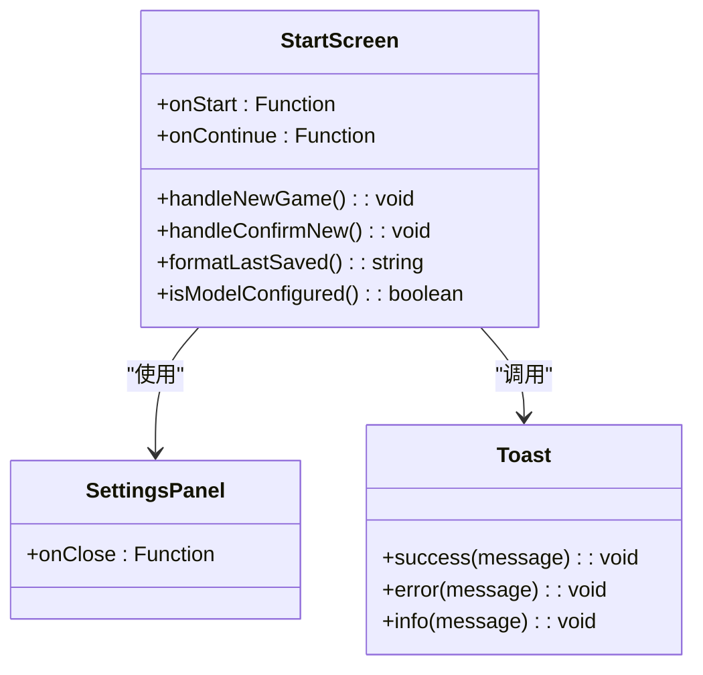
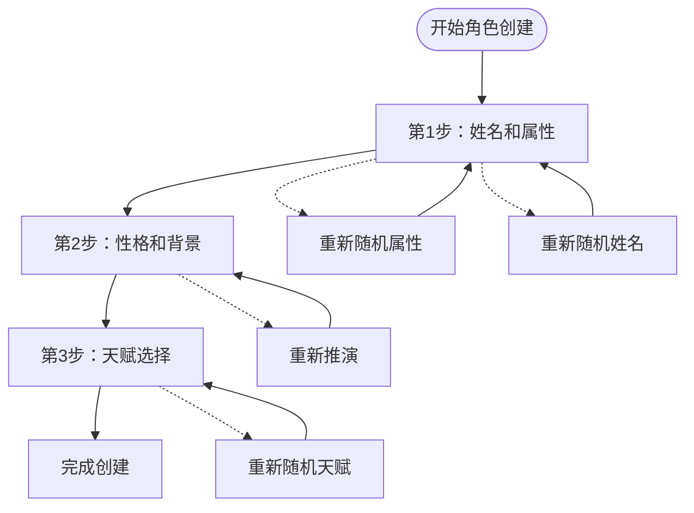
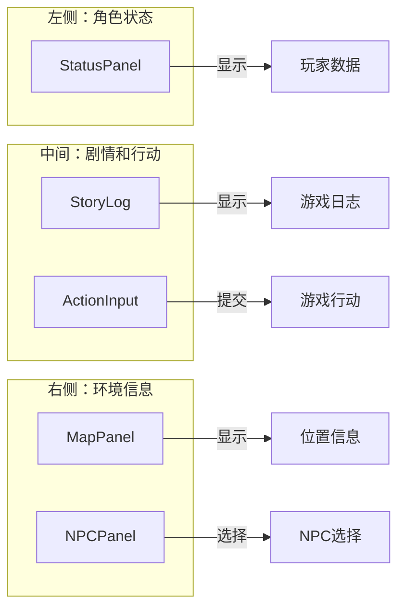
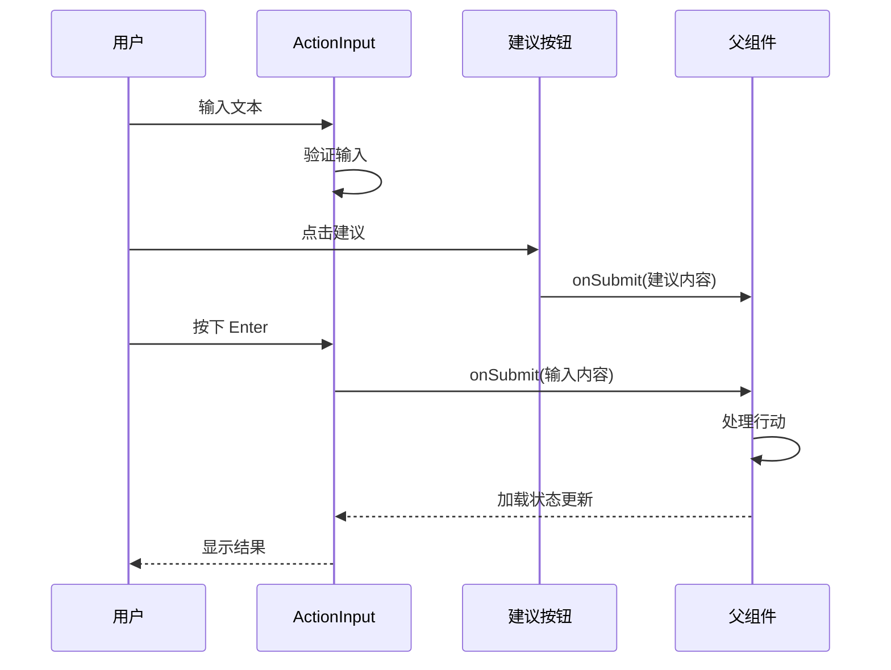
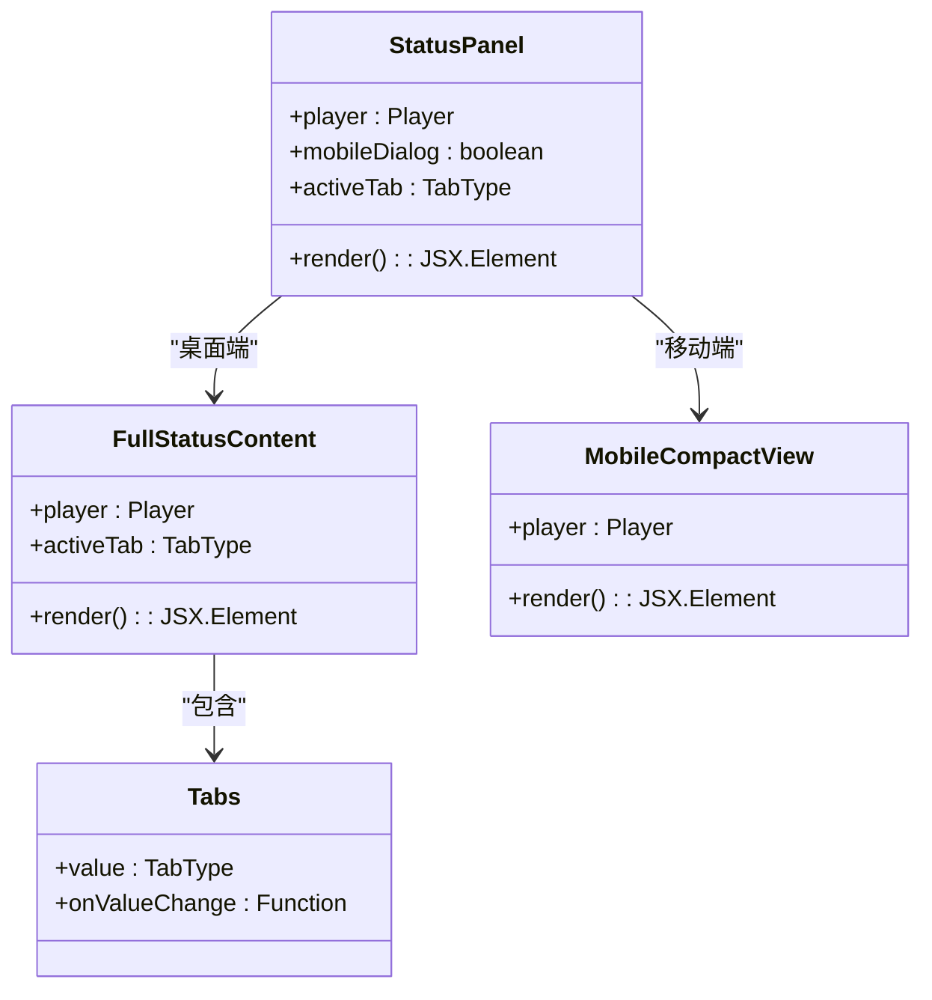
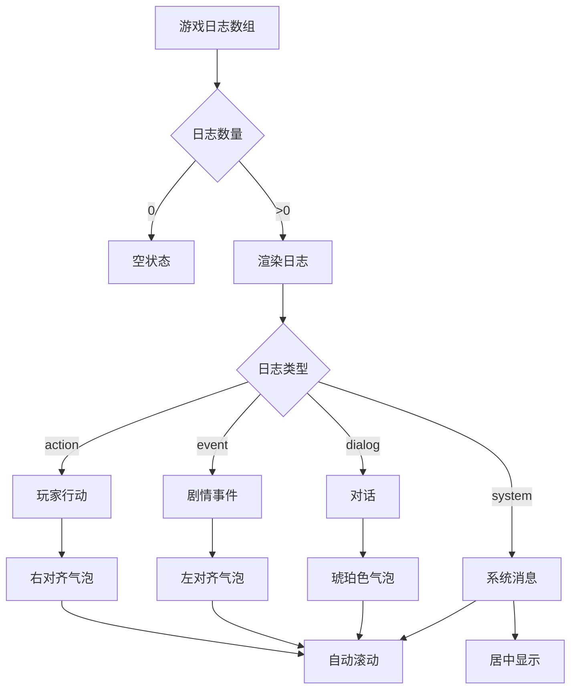
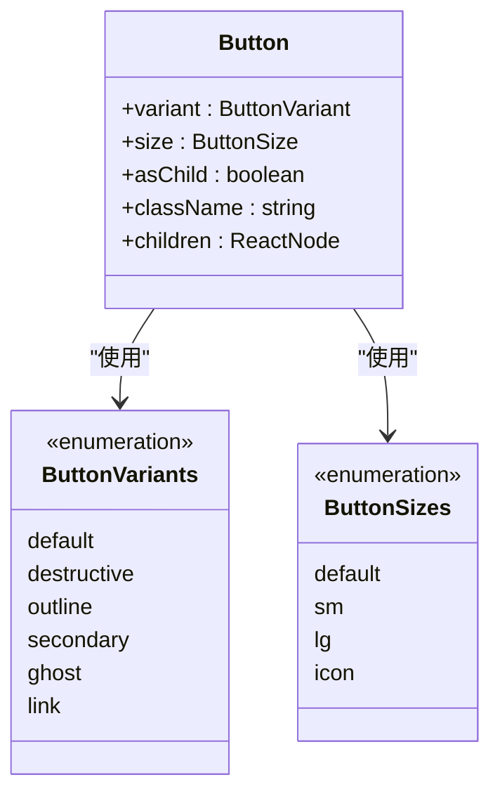

# 组件架构设计

<cite>
**本文档引用的文件**
- [App.tsx](file://src/App.tsx)
- [main.tsx](file://src/main.tsx)
- [StartScreen.tsx](file://src/components/StartScreen.tsx)
- [CharacterCreationScreen.tsx](file://src/components/CharacterCreationScreen.tsx)
- [GameScreen.tsx](file://src/components/GameScreen.tsx)
- [ActionInput.tsx](file://src/components/ActionInput.tsx)
- [StatusPanel.tsx](file://src/components/StatusPanel.tsx)
- [StoryLog.tsx](file://src/components/StoryLog.tsx)
- [NPCPanel.tsx](file://src/components/NPCPanel.tsx)
- [MapPanel.tsx](file://src/components/MapPanel.tsx)
- [button.tsx](file://src/components/ui/button.tsx)
- [useGameStore.ts](file://src/stores/useGameStore.ts)
- [utils.ts](file://src/lib/utils.ts)
- [package.json](file://package.json)
- [tailwind.config.js](file://tailwind.config.js)
</cite>

## 目录
1. [引言](#引言)
2. [项目结构](#项目结构)
3. [核心组件](#核心组件)
4. [架构概览](#架构概览)
5. [详细组件分析](#详细组件分析)
6. [依赖分析](#依赖分析)
7. [性能考虑](#性能考虑)
8. [故障排除指南](#故障排除指南)
9. [结论](#结论)

## 引言

这是一个基于 React 的修仙 Roguelike 项目，采用组件化架构设计。项目实现了完整的修仙游戏体验，包括角色创建、剧情推进、NPC 交互等功能。本文档详细分析了组件架构设计，包括页面级组件、功能组件、UI 组件库的设计模式，以及响应式设计和性能优化策略。

## 项目结构

项目采用模块化的文件组织方式，主要分为以下几个层次：



**图表来源**
- [main.tsx](file://src/main.tsx#L1-L11)
- [App.tsx](file://src/App.tsx#L1-L588)
- [useGameStore.ts](file://src/stores/useGameStore.ts#L1-L226)

**章节来源**
- [main.tsx](file://src/main.tsx#L1-L11)
- [App.tsx](file://src/App.tsx#L1-L50)

## 核心组件

### 页面级组件

项目包含三个主要的页面级组件，分别负责不同的游戏阶段：

1. **StartScreen** - 主菜单页面，提供游戏开始、继续、设置等功能
2. **CharacterCreationScreen** - 角色创建页面，包含多步骤的角色定制流程
3. **GameScreen** - 游戏主界面，整合所有游戏功能

### 功能组件

功能组件专注于特定的游戏功能：

1. **ActionInput** - 行动输入组件，处理玩家的剧情选择
2. **StatusPanel** - 状态面板，显示和管理角色属性
3. **StoryLog** - 剧情日志，展示游戏进程和对话
4. **NPCPanel** - NPC 信息面板，管理附近的非玩家角色
5. **MapPanel** - 地图面板，显示当前位置信息

### UI 组件库

基于 shadcn/ui 的组件库提供了基础的 UI 元素：

- **Button** - 按钮组件，支持多种变体和尺寸
- **Dialog** - 对话框组件，用于模态交互
- **Input** - 输入框组件
- **Textarea** - 多行文本输入
- **Tabs** - 标签页组件
- **Card** - 卡片组件

**章节来源**
- [StartScreen.tsx](file://src/components/StartScreen.tsx#L1-L319)
- [CharacterCreationScreen.tsx](file://src/components/CharacterCreationScreen.tsx#L1-L482)
- [GameScreen.tsx](file://src/components/GameScreen.tsx#L1-L172)
- [ActionInput.tsx](file://src/components/ActionInput.tsx#L1-L146)
- [StatusPanel.tsx](file://src/components/StatusPanel.tsx#L1-L503)
- [StoryLog.tsx](file://src/components/StoryLog.tsx#L1-L172)
- [NPCPanel.tsx](file://src/components/NPCPanel.tsx#L1-L99)
- [MapPanel.tsx](file://src/components/MapPanel.tsx#L1-L45)

## 架构概览

项目采用分层架构设计，清晰分离了关注点：



**图表来源**
- [App.tsx](file://src/App.tsx#L1-L588)
- [useGameStore.ts](file://src/stores/useGameStore.ts#L1-L226)

### 组件职责分离

每个组件都有明确的职责边界：

- **页面组件**：负责整个页面的布局和状态管理
- **功能组件**：专注于特定的功能实现
- **UI 组件**：提供可复用的基础 UI 元素
- **服务层**：处理业务逻辑和外部 API 调用
- **状态管理层**：集中管理应用状态

### Props 设计原则

组件的 Props 设计遵循以下原则：

1. **最小化**：只传递必要的数据
2. **明确性**：使用语义化的命名
3. **类型安全**：通过 TypeScript 确保类型正确
4. **可选性**：合理使用可选参数和默认值

### 事件处理机制

项目采用自上而下的事件处理模式：



**图表来源**
- [ActionInput.tsx](file://src/components/ActionInput.tsx#L14-L28)
- [GameScreen.tsx](file://src/components/GameScreen.tsx#L21-L29)
- [App.tsx](file://src/App.tsx#L240-L468)

**章节来源**
- [App.tsx](file://src/App.tsx#L16-L588)

## 详细组件分析

### StartScreen 组件分析

StartScreen 是游戏的入口页面，负责用户与游戏的初次交互：



**图表来源**
- [StartScreen.tsx](file://src/components/StartScreen.tsx#L11-L14)
- [StartScreen.tsx](file://src/components/StartScreen.tsx#L16-L319)

#### 组件特性

1. **响应式设计**：支持桌面端和移动端的不同布局
2. **动画效果**：使用 Framer Motion 实现流畅的过渡动画
3. **主题切换**：支持明暗主题的动态切换
4. **数据容错**：对缺失的数据提供安全的默认值

#### 状态管理

- 使用 Zustand 管理游戏状态
- 支持自动存档和恢复
- 提供数据重置功能

**章节来源**
- [StartScreen.tsx](file://src/components/StartScreen.tsx#L16-L319)
- [useGameStore.ts](file://src/stores/useGameStore.ts#L84-L226)

### CharacterCreationScreen 组件分析

角色创建屏幕采用多步骤向导模式：



**图表来源**
- [CharacterCreationScreen.tsx](file://src/components/CharacterCreationScreen.tsx#L13-L41)
- [CharacterCreationScreen.tsx](file://src/components/CharacterCreationScreen.tsx#L43-L482)

#### 组件设计模式

1. **步骤化流程**：将复杂的创建过程分解为简单步骤
2. **数据验证**：在每个步骤进行必要的数据验证
3. **错误处理**：提供友好的错误提示和重试机制
4. **沉浸式体验**：使用加载动画提升用户体验

#### Props 设计

- `gameService`: 游戏服务实例，用于生成随机数据
- `onSelectCharacter`: 角色选择回调函数
- `onReturnHome`: 返回主页回调函数

**章节来源**
- [CharacterCreationScreen.tsx](file://src/components/CharacterCreationScreen.tsx#L29-L33)
- [CharacterCreationScreen.tsx](file://src/components/CharacterCreationScreen.tsx#L43-L482)

### GameScreen 组件分析

GameScreen 是游戏的核心界面，采用三栏布局：



**图表来源**
- [GameScreen.tsx](file://src/components/GameScreen.tsx#L15-L30)
- [GameScreen.tsx](file://src/components/GameScreen.tsx#L32-L172)

#### 布局设计

1. **响应式网格**：使用 CSS Grid 实现自适应布局
2. **动画过渡**：每个面板都有独立的进入动画
3. **状态同步**：确保各面板间的状态一致性

#### 组件组合模式

- **垂直布局**：左侧状态面板，中间剧情区域，右侧环境信息
- **嵌套组件**：StoryLog 和 ActionInput 组合形成行动输入区
- **条件渲染**：根据加载状态显示不同的内容

**章节来源**
- [GameScreen.tsx](file://src/components/GameScreen.tsx#L32-L172)

### ActionInput 组件分析

ActionInput 是玩家与游戏交互的核心组件：



**图表来源**
- [ActionInput.tsx](file://src/components/ActionInput.tsx#L14-L28)
- [ActionInput.tsx](file://src/components/ActionInput.tsx#L33-L91)

#### 交互设计

1. **智能建议**：根据当前游戏状态提供行动建议
2. **键盘快捷键**：支持 Enter 发送，Shift+Enter 换行
3. **加载反馈**：在处理期间禁用输入并显示加载状态
4. **移动端适配**：建议按钮在移动设备上水平滚动显示

#### 性能优化

- 使用 `AnimatePresence` 实现建议列表的高效动画
- 条件渲染减少不必要的 DOM 更新
- 合理的事件处理避免重复计算

**章节来源**
- [ActionInput.tsx](file://src/components/ActionInput.tsx#L14-L146)

### StatusPanel 组件分析

StatusPanel 提供了完整的角色状态管理界面：



**图表来源**
- [StatusPanel.tsx](file://src/components/StatusPanel.tsx#L14-L119)
- [StatusPanel.tsx](file://src/components/StatusPanel.tsx#L122-L206)

#### 多端适配

1. **桌面端完整版**：显示所有角色信息和详细统计
2. **移动端精简版**：通过对话框展开显示完整信息
3. **响应式标签页**：根据屏幕大小调整显示内容

#### 数据可视化

- **进度条**：直观显示修为和寿元状态
- **标签系统**：快速查看关键属性
- **颜色编码**：使用不同颜色表示状态健康度

**章节来源**
- [StatusPanel.tsx](file://src/components/StatusPanel.tsx#L14-L503)

### StoryLog 组件分析

StoryLog 负责展示游戏的剧情发展：



**图表来源**
- [StoryLog.tsx](file://src/components/StoryLog.tsx#L10-L51)
- [StoryLog.tsx](file://src/components/StoryLog.tsx#L53-L164)

#### 内容类型

1. **玩家行动**：右对齐的蓝色气泡，标识用户输入
2. **剧情事件**：左对齐的绿色气泡，支持 Markdown 渲染
3. **NPC 对话**：左对齐的琥珀色气泡
4. **系统消息**：居中的灰色文本

#### 渲染优化

- 使用 `AnimatePresence` 实现高效的列表动画
- React Markdown 组件提供丰富的文本格式支持
- 自动滚动到最新消息

**章节来源**
- [StoryLog.tsx](file://src/components/StoryLog.tsx#L10-L172)

### UI 组件库分析

基于 shadcn/ui 的组件库提供了统一的 UI 基础：

#### Button 组件设计

Button 组件采用了设计系统化的模式：



**图表来源**
- [button.tsx](file://src/components/ui/button.tsx#L36-L57)

#### 设计系统特点

1. **变体系统**：通过 `cva` 函数实现统一的样式变体
2. **尺寸控制**：支持多种预定义尺寸
3. **语义化**：使用语义化的 HTML 结构
4. **可访问性**：内置焦点管理和键盘导航支持

**章节来源**
- [button.tsx](file://src/components/ui/button.tsx#L1-L57)
- [utils.ts](file://src/lib/utils.ts#L1-L7)

## 依赖分析

项目的技术栈和依赖关系如下：

```mermaid
graph TB
subgraph "核心框架"
REACT[React 18.2.0]
TYPESCRIPT[TypeScript 5.2.2]
VITE[Vite 5.0.8]
end
subgraph "状态管理"
ZUSTAND[Zustand 4.5.0]
PERSIST[zustand-persist 0.4.0]
end
subgraph "UI和动画"
FRAMER[Framer Motion 12.34.4]
TAILWIND[Tailwind CSS 3.4.0]
SHADCN[shadcn/ui]
end
subgraph "工具库"
RADIX[@radix-ui/react-*]
CLSX[clsx 2.1.0]
MERGE[tailwind-merge 2.2.1]
end
subgraph "AI和网络"
TRANSFORMERS[@xenova/transformers 2.17.2]
SONNER[sonner 2.0.7]
MARKDOWN[react-markdown 10.1.0]
end
subgraph "存储"
LOCALFORAGE[localforage 1.10.0]
INDEXEDDB[IndexedDB]
end
REACT --> ZUSTAND
REACT --> FRAMER
ZUSTAND --> PERSIST
TAILWIND --> CLSX
TAILWIND --> MERGE
SHADCN --> RADIX
REACT --> TRANSFORMERS
REACT --> SONNER
REACT --> MARKDOWN
ZUSTAND --> LOCALFORAGE
LOCALFORAGE --> INDEXEDDB
```

**图表来源**
- [package.json](file://package.json#L15-L36)
- [tailwind.config.js](file://tailwind.config.js#L1-L53)

### 外部依赖管理

项目使用了现代化的前端技术栈：

1. **构建工具**：Vite 提供快速的开发体验
2. **类型系统**：TypeScript 确保代码质量
3. **状态管理**：Zustand 简化了复杂的状态逻辑
4. **UI 设计**：shadcn/ui 提供一致的组件设计
5. **动画系统**：Framer Motion 实现流畅的动画效果

### 性能依赖

- **代码分割**：Vite 自动进行代码分割
- **懒加载**：路由级别的组件懒加载
- **缓存策略**：浏览器缓存和内存缓存结合

**章节来源**
- [package.json](file://package.json#L1-L55)

## 性能考虑

### 组件性能优化

1. **React.memo 优化**：对纯组件使用 memo 包装
2. **useMemo 缓存**：缓存昂贵的计算结果
3. **useCallback 优化**：稳定函数引用避免不必要重渲染
4. **虚拟滚动**：对长列表使用虚拟化技术

### 状态管理优化

1. **状态分片**：将大对象拆分为小的独立状态
2. **选择器模式**：使用 selector 函数精确订阅状态
3. **批量更新**：合并多个状态更新操作
4. **持久化策略**：智能的本地存储和恢复

### 渲染性能

1. **CSS 动画**：优先使用 GPU 加速的 CSS 动画
2. **请求动画帧**：使用 requestAnimationFrame 优化动画
3. **防抖节流**：对高频事件使用防抖节流
4. **懒执行**：延迟执行非关键任务

### 内存管理

1. **垃圾回收**：及时清理不再使用的引用
2. **循环引用**：避免组件间的循环引用
3. **事件监听器**：在组件卸载时清理监听器
4. **定时器管理**：确保所有定时器都被正确清除

## 故障排除指南

### 常见问题诊断

1. **组件不更新**：检查 Props 是否正确传递和更新
2. **状态不同步**：验证状态提升和单向数据流
3. **性能问题**：使用 React DevTools 分析渲染性能
4. **内存泄漏**：检查事件监听器和定时器的清理

### 调试技巧

1. **React DevTools**：使用 Profiler 分析组件渲染
2. **Zustand DevTools**：监控状态变化和性能指标
3. **浏览器开发者工具**：分析网络请求和内存使用
4. **日志系统**：添加适当的日志输出便于调试

### 错误处理策略

1. **边界情况**：处理空数据和异常输入
2. **降级方案**：在网络错误时提供基本功能
3. **用户反馈**：及时向用户提供错误信息
4. **自动恢复**：实现错误的自动恢复机制

**章节来源**
- [App.tsx](file://src/App.tsx#L75-L122)
- [useGameStore.ts](file://src/stores/useGameStore.ts#L84-L226)

## 结论

本项目展现了现代 React 应用的最佳实践，通过清晰的组件架构、合理的状态管理和优秀的用户体验设计，成功构建了一个复杂的修仙 Roguelike 游戏。主要特点包括：

1. **模块化设计**：清晰的组件职责分离和良好的封装
2. **响应式架构**：支持多端适配和流畅的用户体验
3. **性能优化**：采用多种技术手段确保应用性能
4. **可维护性**：规范的代码结构和完善的错误处理
5. **扩展性**：灵活的架构设计便于功能扩展

通过深入分析组件间的协作关系、状态管理模式和性能优化策略，为类似项目的开发提供了宝贵的参考经验。项目的架构设计充分体现了 React 生态系统的最佳实践，是一个值得学习的优秀案例。