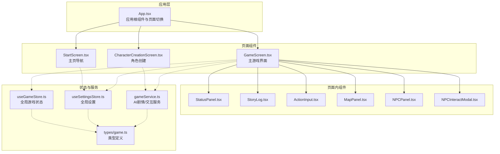
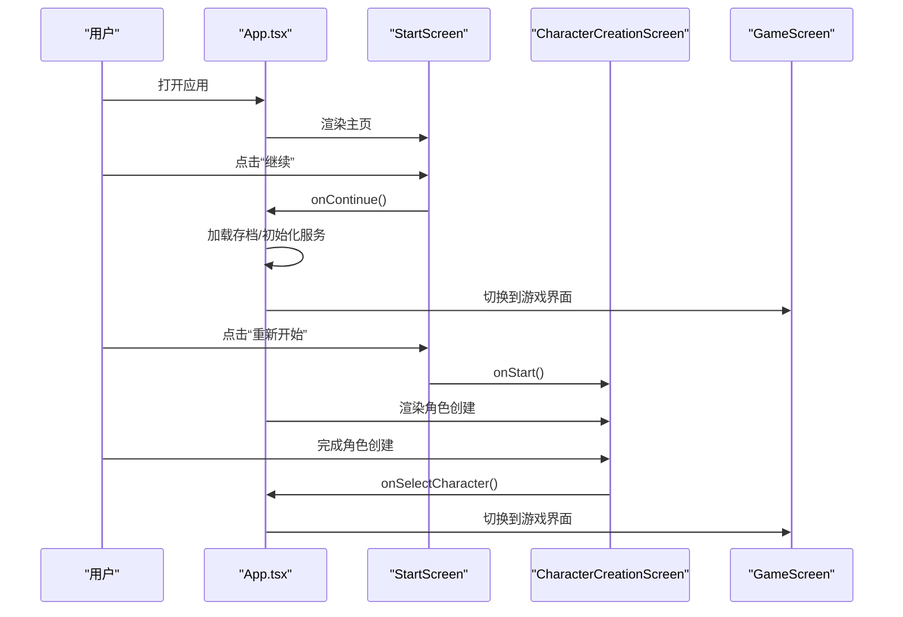
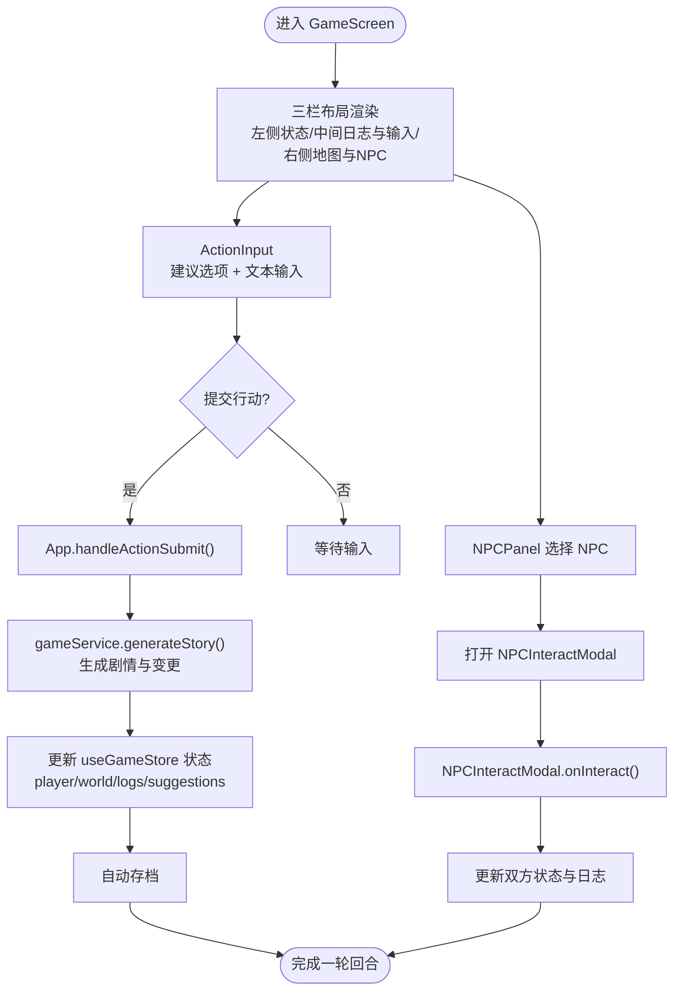
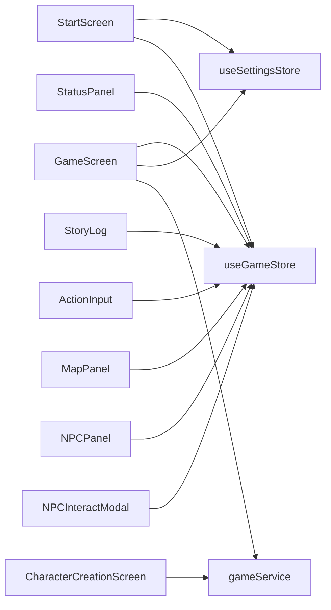

# 页面级组件

<cite>
**本文引用的文件**
- [src\App.tsx](file://src\App.tsx)
- [src\components\StartScreen.tsx](file://src\components\StartScreen.tsx)
- [src\components\CharacterCreationScreen.tsx](file://src\components\CharacterCreationScreen.tsx)
- [src\components\GameScreen.tsx](file://src\components\GameScreen.tsx)
- [src\components\StatusPanel.tsx](file://src\components\StatusPanel.tsx)
- [src\components\StoryLog.tsx](file://src\components\StoryLog.tsx)
- [src\components\ActionInput.tsx](file://src\components\ActionInput.tsx)
- [src\components\MapPanel.tsx](file://src\components\MapPanel.tsx)
- [src\components\NPCPanel.tsx](file://src\components\NPCPanel.tsx)
- [src\components\NPCInteractModal.tsx](file://src\components\NPCInteractModal.tsx)
- [src\types\game.ts](file://src\types\game.ts)
- [src\stores\useGameStore.ts](file://src\stores\useGameStore.ts)
- [src\stores\useSettingsStore.ts](file://src\stores\useSettingsStore.ts)
- [src\services\gameService.ts](file://src\services\gameService.ts)
</cite>

## 目录
1. [简介](#简介)
2. [项目结构](#项目结构)
3. [核心组件](#核心组件)
4. [架构总览](#架构总览)
5. [组件详解](#组件详解)
6. [依赖关系分析](#依赖关系分析)
7. [性能考量](#性能考量)
8. [故障排查指南](#故障排查指南)
9. [结论](#结论)
10. [附录](#附录)

## 简介
本文件聚焦“页面级组件”的设计与实现，围绕三大页面组件进行系统化文档化：
- StartScreen 主页导航：负责游戏入口、继续游戏、设置与新手引导。
- CharacterCreationScreen 角色创建：提供三步式角色生成流程（命格、性格/出身/背景、初始天赋）。
- GameScreen 主游戏界面：三栏布局承载角色状态、剧情日志与行动输入、区域与NPC信息。

文档将覆盖页面切换逻辑、路由状态管理、页面生命周期处理、Props 接口设计、事件回调机制、状态同步策略、页面级状态管理、数据获取模式、错误边界处理、性能优化、SEO 友好性与用户体验设计，并重点解析 GameScreen 的三栏布局与响应式适配策略。

## 项目结构
页面级组件位于 src/components 下，配合全局状态管理（Zustand）、设置管理（Zustand）、服务层（LLM/记忆/数据库）与类型定义（src/types）共同构成完整的页面体系。

图表来源
- [src\App.tsx](file://src\App.tsx#L16-L585)
- [src\components\StartScreen.tsx](file://src\components\StartScreen.tsx#L1-L319)
- [src\components\CharacterCreationScreen.tsx](file://src\components\CharacterCreationScreen.tsx#L1-L482)
- [src\components\GameScreen.tsx](file://src\components\GameScreen.tsx#L1-L172)
- [src\components\StatusPanel.tsx](file://src\components\StatusPanel.tsx#L1-L503)
- [src\components\StoryLog.tsx](file://src\components\StoryLog.tsx#L1-L172)
- [src\components\ActionInput.tsx](file://src\components\ActionInput.tsx#L1-L146)
- [src\components\MapPanel.tsx](file://src\components\MapPanel.tsx#L1-L45)
- [src\components\NPCPanel.tsx](file://src\components\NPCPanel.tsx#L1-L99)
- [src\components\NPCInteractModal.tsx](file://src\components\NPCInteractModal.tsx#L1-L223)
- [src\stores\useGameStore.ts](file://src\stores\useGameStore.ts#L1-L226)
- [src\stores\useSettingsStore.ts](file://src\stores\useSettingsStore.ts#L1-L46)
- [src\services\gameService.ts](file://src\services\gameService.ts#L1-L541)
- [src\types\game.ts](file://src\types\game.ts#L1-L319)

章节来源
- [src\App.tsx](file://src\App.tsx#L16-L585)

## 核心组件
- StartScreen：提供“继续”“重新开始”“设置”等入口能力，内置主题切换与模型配置校验。
- CharacterCreationScreen：三步式角色创建，支持随机重投、步骤间流转与最终提交。
- GameScreen：三栏布局（左侧状态、中间日志与输入、右侧地图与NPC），集成 NPC 交互模态框与沉浸式加载。

章节来源
- [src\components\StartScreen.tsx](file://src\components\StartScreen.tsx#L11-L319)
- [src\components\CharacterCreationScreen.tsx](file://src\components\CharacterCreationScreen.tsx#L29-L482)
- [src\components\GameScreen.tsx](file://src\components\GameScreen.tsx#L15-L172)

## 架构总览
页面级组件通过 App.tsx 的状态机驱动页面切换，结合 useGameStore 与 useSettingsStore 实现页面级状态管理与持久化，服务层 gameService.ts 通过 LLM 生成剧情、角色与 NPC 交互，类型系统确保数据一致性。

图表来源
- [src\App.tsx](file://src\App.tsx#L124-L170)
- [src\App.tsx](file://src\App.tsx#L172-L237)
- [src\components\StartScreen.tsx](file://src\components\StartScreen.tsx#L33-L44)
- [src\components\CharacterCreationScreen.tsx](file://src\components\CharacterCreationScreen.tsx#L140-L161)

## 组件详解

### StartScreen 主页导航
- 设计理念
  - 以视觉与交互营造“修仙世界”的沉浸感，提供继续、重新开始、设置入口。
  - 主题切换与模型配置校验前置，保障后续流程顺畅。
- Props 接口设计
  - onStart: () => void
  - onContinue: () => void
- 事件回调机制
  - handleNewGame → handleConfirmNew：二次确认与模型配置检查。
  - 打开设置面板与主题切换。
- 状态同步策略
  - 读取 useGameStore 的 player 与 lastSavedAt，使用安全默认值避免 NaN。
  - 读取 useSettingsStore 的 theme 并同步到 <html> class。
- 错误边界处理
  - 未配置模型时弹出提示对话框，引导前往设置。
- 页面生命周期
  - 进入时渲染粒子背景与渐入动画，退出时由父组件卸载。
- SEO 友好性
  - 标题与副标题采用语义化 h1/p，利于搜索引擎识别。
- 性能优化
  - Framer Motion 动画按需触发，背景装饰粒子使用固定数量与延迟序列，避免过度计算。

章节来源
- [src\components\StartScreen.tsx](file://src\components\StartScreen.tsx#L11-L319)
- [src\App.tsx](file://src\App.tsx#L22-L28)

### CharacterCreationScreen 角色创建
- 设计理念
  - 三步式流程：命格初定 → 性格/出身/背景 → 初始天赋，每步支持重投与下一步推进。
- Props 接口设计
  - gameService: GameService
  - onSelectCharacter: (character: Player) => void
  - onReturnHome?: () => void
- 事件回调机制
  - handleStep1Next：校验名称与基础属性，调用 LLM 生成性格/出身/背景选项。
  - handleStep2Next：基于所选项生成初始天赋选项。
  - handleFinish：组装 Player 并回调 onSelectCharacter。
- 状态同步策略
  - 使用 useState 管理当前步骤与临时状态，完成后一次性写入 App 层。
- 数据获取模式
  - 通过 gameService 的 generatePersonalityOptions/generateTalentOptions/generateStatPanels 等方法拉取 LLM 结果。
- 错误边界处理
  - 捕获 LLM 请求异常并提示“天机推演受阻，请重试”。
- 页面生命周期
  - 进入时初始化步骤与随机数据；离开时由父组件销毁。
- 性能优化
  - 使用 AnimatePresence 与 Motion 控制步骤切换动画，减少不必要的重渲染。

章节来源
- [src\components\CharacterCreationScreen.tsx](file://src\components\CharacterCreationScreen.tsx#L29-L482)
- [src\services\gameService.ts](file://src\services\gameService.ts#L204-L281)

### GameScreen 主游戏界面
- 设计理念
  - 三栏布局：左侧角色状态、中间剧情日志与行动输入、右侧地图与NPC信息；支持 NPC 交互模态框与沉浸式加载。
- Props 接口设计
  - player: Player
  - world: World | null
  - logs: GameLog[]
  - isLoading: boolean
  - suggestions: string[]
  - onActionSubmit: (action: string) => void
  - onReturnHome?: () => void
  - nearbyNPCs: NPC[]
  - selectedNPC: NPC | null
  - isNPCInteracting: boolean
  - onSelectNPC: (npc: NPC) => void
  - onCloseNPCModal: () => void
  - onNPCInteract: (action: string) => Promise<NPCInteractResult>
- 事件回调机制
  - ActionInput.onSubmit → App.handleActionSubmit：统一处理玩家行动、更新状态、添加日志、建议与自动存档。
  - NPCPanel.onSelectNPC → App.handleSelectNPC：打开 NPC 交互模态框。
  - NPCInteractModal.onInteract → App.handleNPCInteract：执行 NPC 交互并更新双方状态。
  - onReturnHome：自动保存并返回主页。
- 状态同步策略
  - 通过 useGameStore 读取/更新 player、world、logs、nearbyNPCs 等；通过 useSettingsStore 控制主题。
- 页面生命周期
  - 进入时渲染三栏布局与模态框；退出时由父组件卸载。
- 三栏布局与响应式适配
  - 使用 CSS Grid（lg: 12列）与 Flex 布局，左侧 3栏、中间 6栏、右侧 3栏；在小屏设备上自动堆叠。
  - 移动端对状态面板采用弹窗展示，节省空间。
- 性能优化
  - 使用 Motion 动画分层进入，降低首屏压力。
  - 日志列表使用 AnimatePresence 与 requestAnimationFrame 滚动到底部，避免闪烁。

图表来源
- [src\components\GameScreen.tsx](file://src\components\GameScreen.tsx#L32-L171)
- [src\components\ActionInput.tsx](file://src\components\ActionInput.tsx#L14-L146)
- [src\components\NPCPanel.tsx](file://src\components\NPCPanel.tsx#L11-L99)
- [src\components\NPCInteractModal.tsx](file://src\components\NPCInteractModal.tsx#L24-L223)
- [src\App.tsx](file://src\App.tsx#L239-L468)

章节来源
- [src\components\GameScreen.tsx](file://src\components\GameScreen.tsx#L15-L172)
- [src\components\StatusPanel.tsx](file://src\components\StatusPanel.tsx#L14-L206)
- [src\components\StoryLog.tsx](file://src\components\StoryLog.tsx#L10-L51)
- [src\components\ActionInput.tsx](file://src\components\ActionInput.tsx#L14-L146)
- [src\components\MapPanel.tsx](file://src\components\MapPanel.tsx#L8-L44)
- [src\components\NPCPanel.tsx](file://src\components\NPCPanel.tsx#L11-L99)
- [src\components\NPCInteractModal.tsx](file://src\components\NPCInteractModal.tsx#L24-L223)

### 页面切换逻辑与路由状态管理
- App.tsx 作为单一状态源，维护 gamePhase（start/character_creation/game）与 isLoading。
- 切换路径
  - StartScreen → CharacterCreationScreen：onStart → setGamePhase('character_creation')
  - CharacterCreationScreen → GameScreen：onSelectCharacter → setGamePhase('game')
  - GameScreen → StartScreen：onReturnHome → autoSave → setGamePhase('start')
- 状态持久化
  - useGameStore 与 useSettingsStore 使用 persist middleware，自动持久化关键状态。
- 生命周期处理
  - 进入页面时初始化服务与数据；离开页面时清理与保存。

章节来源
- [src\App.tsx](file://src\App.tsx#L16-L585)
- [src\stores\useGameStore.ts](file://src\stores\useGameStore.ts#L84-L225)
- [src\stores\useSettingsStore.ts](file://src\stores\useSettingsStore.ts#L24-L45)

### 页面级状态管理与数据流
- 页面级状态
  - StartScreen：读取 player、lastSavedAt、theme；写入 theme。
  - CharacterCreationScreen：内部步骤状态；最终写入 App 层。
  - GameScreen：读取 player、world、logs、suggestions、nearbyNPCs；写入 useGameStore。
- 数据获取模式
  - 通过 gameService 与 LLM 生成角色、剧情、NPC 交互结果。
- 错误边界处理
  - LLM 请求失败时添加系统日志并提示；模型未配置时阻止继续。
- 同步策略
  - App 层集中处理业务逻辑与状态更新，页面组件专注渲染与事件透传。

章节来源
- [src\components\StartScreen.tsx](file://src\components\StartScreen.tsx#L17-L31)
- [src\components\CharacterCreationScreen.tsx](file://src\components\CharacterCreationScreen.tsx#L48-L63)
- [src\components\GameScreen.tsx](file://src\components\GameScreen.tsx#L47-L48)
- [src\services\gameService.ts](file://src\services\gameService.ts#L283-L391)

### 用户体验设计考虑
- 动效与反馈
  - Framer Motion 渐入渐出与微交互，提升流畅度。
  - Loading 状态与沉浸式加载提示，明确系统忙碌。
- 无障碍与可访问性
  - 合理的对比度与可读性，标签与图标结合。
- 响应式与适配
  - 移动端简化面板与横向滚动，避免信息拥挤。
- 交互一致性
  - 统一的按钮样式、尺寸与禁用态，避免歧义。

## 依赖关系分析
- 组件耦合
  - GameScreen 依赖多个子组件（StatusPanel、StoryLog、ActionInput、MapPanel、NPCPanel、NPCInteractModal）。
  - StartScreen 依赖设置与游戏存档；CharacterCreationScreen 依赖 gameService。
- 外部依赖
  - LLMService：通过 gameService 调用，生成角色、剧情与交互。
  - IndexedDB：通过 db 服务（在 App.tsx 中初始化）持久化存档。
- 循环依赖
  - 未发现循环依赖；页面组件通过 props 与回调向下传递，避免直接相互引用。

图表来源
- [src\components\StartScreen.tsx](file://src\components\StartScreen.tsx#L17-L18)
- [src\components\CharacterCreationScreen.tsx](file://src\components\CharacterCreationScreen.tsx#L43-L47)
- [src\components\GameScreen.tsx](file://src\components\GameScreen.tsx#L47-L48)
- [src\stores\useGameStore.ts](file://src\stores\useGameStore.ts#L84-L225)
- [src\stores\useSettingsStore.ts](file://src\stores\useSettingsStore.ts#L24-L45)
- [src\services\gameService.ts](file://src\services\gameService.ts#L50-L62)

章节来源
- [src\App.tsx](file://src\App.tsx#L67-L72)
- [src\stores\useGameStore.ts](file://src\stores\useGameStore.ts#L84-L225)
- [src\stores\useSettingsStore.ts](file://src\stores\useSettingsStore.ts#L24-L45)
- [src\services\gameService.ts](file://src\services\gameService.ts#L50-L62)

## 性能考量
- 渲染优化
  - 使用 AnimatePresence 与 Motion 控制动画，避免不必要的重排。
  - 日志列表使用 requestAnimationFrame 滚动到底部，减少闪烁。
- 状态管理
  - 将页面内临时状态限制在组件内部，减少全局状态抖动。
  - 使用 useMemo 缓存 gameServiceWithMemory，避免重复创建实例。
- 数据获取
  - LLM 请求结果进行默认值兜底，避免 NaN 导致的渲染异常。
- 存储与持久化
  - 自动存档与定时任务在合适时机触发，避免频繁 IO。

## 故障排查指南
- 模型未配置
  - 现象：点击“重新开始”无响应或弹出提示。
  - 处理：在“天道设置”中完善 baseURL、apiKey、model 后再试。
- 加载失败
  - 现象：继续游戏时报错或无法进入游戏。
  - 处理：检查 IndexedDB 是否可用，删除异常存档后重试。
- NPC 交互异常
  - 现象：模态框无法关闭或交互无效。
  - 处理：确认 App 层 handleNPCInteract 的调用链与返回值，检查 gameService 的交互结果。
- 剧情生成失败
  - 现象：提交行动后无日志或报错。
  - 处理：查看系统日志中的“天道反噬”提示，稍后重试或调整输入。

章节来源
- [src\components\StartScreen.tsx](file://src\components\StartScreen.tsx#L35-L44)
- [src\App.tsx](file://src\App.tsx#L131-L161)
- [src\App.tsx](file://src\App.tsx#L481-L548)
- [src\services\gameService.ts](file://src\services\gameService.ts#L283-L391)

## 结论
三大页面组件围绕清晰的职责划分与稳定的 Props/回调契约构建，配合 App.tsx 的状态机与 Zustand 的页面级状态管理，实现了从主页导航、角色创建到主游戏界面的完整闭环。GameScreen 的三栏布局与响应式适配提升了移动端体验，结合 LLM 驱动的剧情生成与 NPC 交互，形成了高沉浸感的修仙体验。建议持续关注 LLM 成本与缓存策略、日志与内存增长控制，以及 UI 动画的性能表现。

## 附录
- 类型定义概览
  - Player/NPC/World/GameLog 等类型在 src\types\game.ts 中集中定义，确保跨组件一致的数据结构。
- 存储与设置
  - useGameStore 与 useSettingsStore 分别管理游戏状态与用户偏好，均具备持久化能力。

章节来源
- [src\types\game.ts](file://src\types\game.ts#L110-L251)
- [src\stores\useGameStore.ts](file://src\stores\useGameStore.ts#L13-L55)
- [src\stores\useSettingsStore.ts](file://src\stores\useSettingsStore.ts#L5-L10)