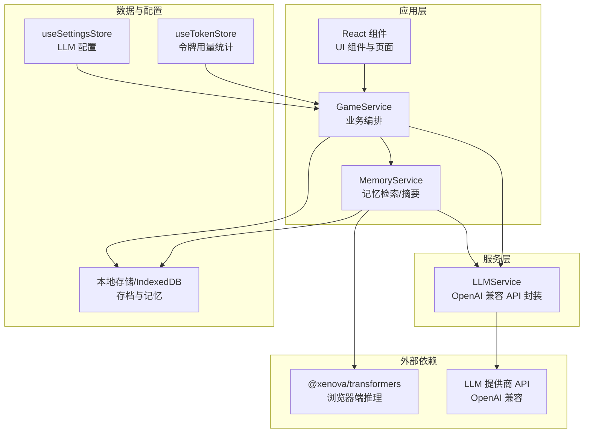
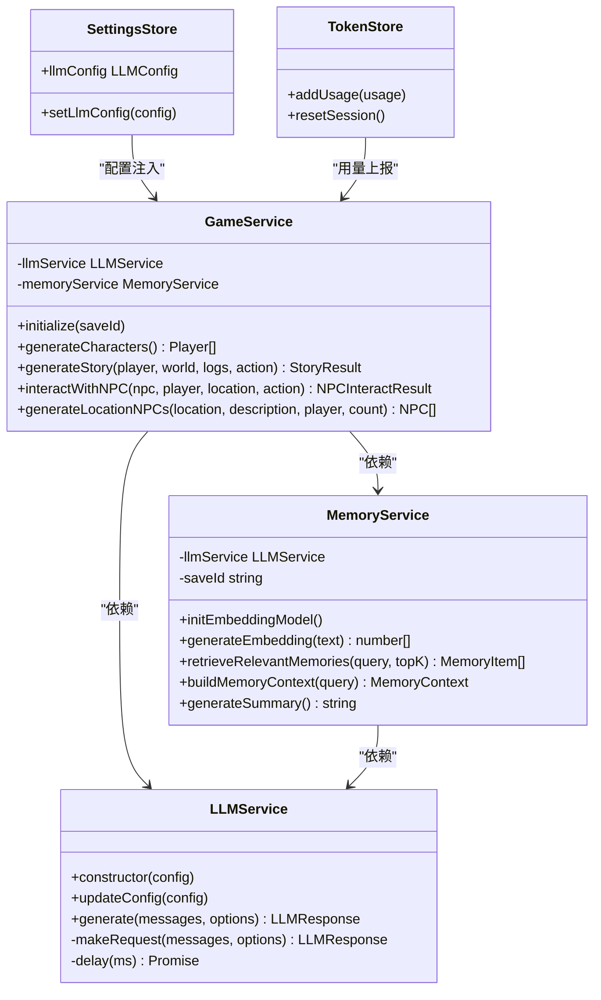
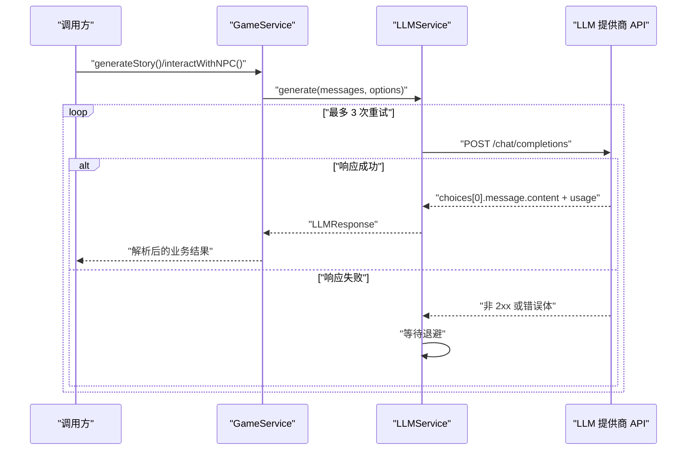
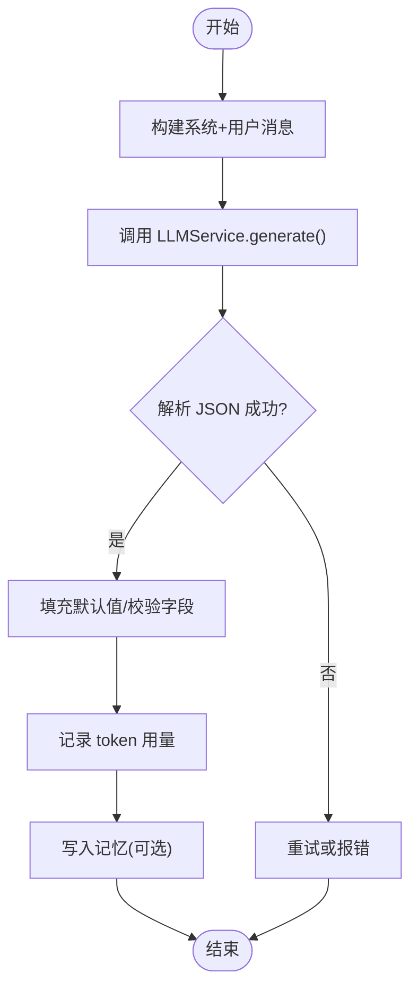
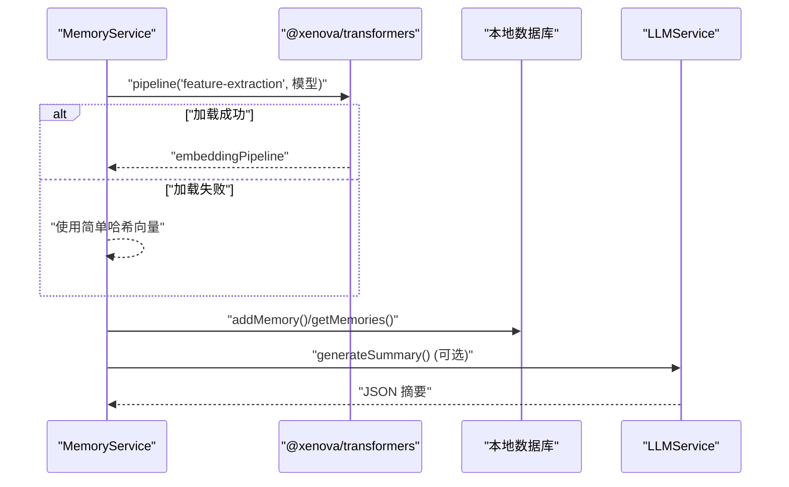
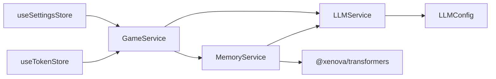

# AI 服务集成

<cite>
**本文引用的文件**
- [llmService.ts](file://src/services/llmService.ts)
- [gameService.ts](file://src/services/gameService.ts)
- [memoryService.ts](file://src/services/memoryService.ts)
- [useSettingsStore.ts](file://src/stores/useSettingsStore.ts)
- [useTokenStore.ts](file://src/stores/useTokenStore.ts)
- [useGameStore.ts](file://src/stores/useGameStore.ts)
- [game.ts](file://src/types/game.ts)
- [character.ts](file://src/prompts/character.ts)
- [story.ts](file://src/prompts/story.ts)
- [package.json](file://package.json)
- [README.md](file://README.md)
</cite>

## 目录
1. [简介](#简介)
2. [项目结构](#项目结构)
3. [核心组件](#核心组件)
4. [架构总览](#架构总览)
5. [组件详解](#组件详解)
6. [依赖关系分析](#依赖关系分析)
7. [性能考量](#性能考量)
8. [故障排查指南](#故障排查指南)
9. [结论](#结论)
10. [附录](#附录)

## 简介
本文件面向“LLMService AI 服务集成”的综合技术文档，围绕以下目标展开：
- 封装 OpenAI 兼容 API 的大语言模型服务，覆盖请求构建、重试机制、响应解析与错误处理。
- 文档化浏览器端 transformers.js 在线推理能力，包括模型加载、特征提取与降级策略。
- 说明温度参数、响应格式控制、令牌用量统计等关键配置与行为。
- 解释与 GameService 的协作模式，以及如何在现有架构下扩展流式响应与批量请求能力。

## 项目结构
本项目采用前端纯客户端架构，AI 服务通过 LLMService 对外提供统一接口，GameService 作为业务编排层调用 LLMService 生成角色、剧情与 NPC 交互内容；MemoryService 负责记忆检索与摘要生成；Zustand 状态管理负责设置、令牌用量与游戏状态持久化。

图表来源
- [llmService.ts](file://src/services/llmService.ts#L1-L101)
- [gameService.ts](file://src/services/gameService.ts#L1-L541)
- [memoryService.ts](file://src/services/memoryService.ts#L1-L224)
- [useSettingsStore.ts](file://src/stores/useSettingsStore.ts#L1-L46)
- [useTokenStore.ts](file://src/stores/useTokenStore.ts#L1-L73)
- [package.json](file://package.json#L23-L23)

章节来源
- [README.md](file://README.md#L77-L97)

## 核心组件
- LLMService：封装 OpenAI 兼容 API 的聊天补全请求，提供重试、默认参数与响应格式化。
- GameService：面向游戏业务的编排层，组织提示词、调用 LLMService 并处理 JSON 结果。
- MemoryService：基于 @xenova/transformers 的特征提取与 RAG 检索，支持摘要生成与工作记忆。
- useSettingsStore：集中管理 LLM 配置（baseURL、apiKey、model）与主题等设置。
- useTokenStore：记录每次调用的 prompt/completion/total tokens，支持会话与累计统计。
- 类型与提示词：定义 LLMConfig、GameState 等类型，以及角色、剧情、摘要等系统提示词。

章节来源
- [llmService.ts](file://src/services/llmService.ts#L18-L101)
- [gameService.ts](file://src/services/gameService.ts#L50-L541)
- [memoryService.ts](file://src/services/memoryService.ts#L16-L224)
- [useSettingsStore.ts](file://src/stores/useSettingsStore.ts#L12-L46)
- [useTokenStore.ts](file://src/stores/useTokenStore.ts#L10-L73)
- [game.ts](file://src/types/game.ts#L253-L263)

## 架构总览
LLMService 作为底层服务，向上提供稳定的 generate 接口；GameService 与 MemoryService 作为上层业务模块，分别负责剧情生成与记忆检索；Zustand stores 负责配置与用量统计；@xenova/transformers 用于浏览器端特征提取。

图表来源
- [llmService.ts](file://src/services/llmService.ts#L18-L101)
- [gameService.ts](file://src/services/gameService.ts#L50-L541)
- [memoryService.ts](file://src/services/memoryService.ts#L16-L224)
- [useSettingsStore.ts](file://src/stores/useSettingsStore.ts#L12-L46)
- [useTokenStore.ts](file://src/stores/useTokenStore.ts#L10-L73)

## 组件详解

### LLMService：OpenAI 兼容 API 封装
- 请求构建
  - 基于 baseURL 与 model 组装 chat/completions 请求。
  - 默认 Content-Type 为 application/json，Authorization 使用 Bearer apiKey。
  - 默认 temperature=0.7，max_tokens=2000，支持 response_format 控制为 json_object 或 text。
- 重试与错误处理
  - 最多重试 3 次，指数退避延迟（attempt × 1000ms）。
  - 非 2xx 响应抛出带状态码与响应体的错误。
- 响应解析
  - 返回 content 与 usage（prompt_tokens、completion_tokens、total_tokens）。
- 配置更新
  - 支持运行时 updateConfig 合并配置。

图表来源
- [llmService.ts](file://src/services/llmService.ts#L29-L97)
- [gameService.ts](file://src/services/gameService.ts#L283-L391)

章节来源
- [llmService.ts](file://src/services/llmService.ts#L18-L101)

### GameService：与 LLMService 的协作模式
- 角色生成：使用 characterSystemPrompt 与 characterGenerationPrompt，temperature=0.8，response_format=json_object。
- 剧情生成：构建 player/world/logs/memory 上下文，temperature≈0.7，response_format=json_object。
- NPC 交互：使用 npcInteractSystemPrompt 与 npcInteractGenerationPrompt，temperature≈0.7。
- 记忆记录：调用 recordTokenUsage 汇总 usage。
- 初始化：initialize(saveId) 创建 MemoryService 并绑定存档 ID。

图表来源
- [gameService.ts](file://src/services/gameService.ts#L74-L119)
- [gameService.ts](file://src/services/gameService.ts#L283-L391)
- [gameService.ts](file://src/services/gameService.ts#L415-L469)

章节来源
- [gameService.ts](file://src/services/gameService.ts#L50-L541)
- [character.ts](file://src/prompts/character.ts#L1-L97)
- [story.ts](file://src/prompts/story.ts#L1-L147)

### MemoryService：浏览器端特征提取与检索
- 模型加载：首次使用时通过 @xenova/transformers 的 pipeline 加载特征提取模型；失败则降级为简单哈希向量。
- 嵌入生成：mean pooling + normalize；备用方案按字符权重与归一化生成固定维度向量。
- 相似度计算：余弦相似度，按阈值检索 topK 相关记忆。
- 摘要生成：当记忆数量超过阈值时，使用摘要系统提示词与生成提示词调用 LLMService 生成摘要。
- 上下文组装：并发获取工作记忆、检索记忆与摘要，形成完整上下文。

图表来源
- [memoryService.ts](file://src/services/memoryService.ts#L27-L81)
- [memoryService.ts](file://src/services/memoryService.ts#L121-L188)

章节来源
- [memoryService.ts](file://src/services/memoryService.ts#L16-L224)
- [package.json](file://package.json#L23-L23)

### 配置与密钥管理
- LLM 配置来源：优先 useSettingsStore 中的 llmConfig，其次从环境变量读取默认值（VITE_LLM_BASE_URL、VITE_LLM_API_KEY、VITE_LLM_MODEL）。
- 主题与自动保存：useSettingsStore 同时管理 theme 与 autoSave。
- API 密钥安全：当前实现未内置加密存储，建议在生产环境中结合后端代理或安全存储方案。

章节来源
- [useSettingsStore.ts](file://src/stores/useSettingsStore.ts#L12-L46)
- [README.md](file://README.md#L47-L62)

### 令牌用量统计与展示
- 记录点：GameService 在每次 LLM 调用后调用 recordTokenUsage，汇总到 useTokenStore。
- 存储：useTokenStore 支持 lastUsage、sessionUsage、totalUsage 三类统计，并持久化部分状态。

章节来源
- [gameService.ts](file://src/services/gameService.ts#L64-L72)
- [useTokenStore.ts](file://src/stores/useTokenStore.ts#L10-L73)

## 依赖关系分析
- LLMService 依赖 fetch 发送 HTTP 请求，依赖 LLMConfig 提供 baseURL/model/apiKey。
- GameService 依赖 LLMService 与 MemoryService，依赖提示词模块与数据库存档。
- MemoryService 依赖 @xenova/transformers 进行特征提取，依赖本地数据库进行记忆持久化。
- Zustand stores 为全局状态中心，SettingsStore 注入配置，TokenStore 汇总用量。

图表来源
- [llmService.ts](file://src/services/llmService.ts#L18-L23)
- [gameService.ts](file://src/services/gameService.ts#L50-L62)
- [memoryService.ts](file://src/services/memoryService.ts#L27-L37)
- [useSettingsStore.ts](file://src/stores/useSettingsStore.ts#L24-L46)
- [useTokenStore.ts](file://src/stores/useTokenStore.ts#L31-L73)

章节来源
- [game.ts](file://src/types/game.ts#L253-L263)
- [package.json](file://package.json#L23-L23)

## 性能考量
- 浏览器端特征提取
  - 首次加载模型可能阻塞主线程，建议在空闲时段预热或懒加载。
  - 降级策略：若模型加载失败，使用简单哈希向量保证功能可用。
  - 向量维度与相似度计算复杂度：O(N×D)，其中 N 为候选记忆数，D 为向量维度。
- LLM 调用
  - 默认 max_tokens=2000，temperature=0.7，可根据场景调整以平衡质量与成本。
  - 重试策略：最大 3 次，退避 1s×attempt，避免对上游造成冲击。
- 记忆与摘要
  - 摘要阈值与工作记忆大小可调，减少检索规模。
  - 并发检索与摘要生成，缩短上下文准备时间。
- 前端渲染
  - 大段文本建议分块渲染或使用虚拟化列表，避免 UI 卡顿。

章节来源
- [memoryService.ts](file://src/services/memoryService.ts#L27-L81)
- [memoryService.ts](file://src/services/memoryService.ts#L144-L173)
- [llmService.ts](file://src/services/llmService.ts#L37-L55)

## 故障排查指南
- API 错误
  - 现象：非 2xx 响应，错误信息包含状态码与响应体。
  - 排查：检查 baseURL、apiKey、model 是否正确；确认提供商限额与配额。
- 模型加载失败
  - 现象：@xenova/transformers 加载异常，MemoryService 降级为哈希向量。
  - 排查：网络连通性、CDN 可用性；考虑离线模型或代理。
- JSON 解析失败
  - 现象：GameService 解析 response.content 为 JSON 失败。
  - 排查：确认 response_format 设置为 json_object；检查提示词约束与模型稳定性。
- 令牌用量异常
  - 现象：useTokenStore 统计与预期不符。
  - 排查：确认 recordTokenUsage 是否在每次调用后执行；检查响应中 usage 字段是否存在。

章节来源
- [llmService.ts](file://src/services/llmService.ts#L82-L85)
- [memoryService.ts](file://src/services/memoryService.ts#L31-L37)
- [gameService.ts](file://src/services/gameService.ts#L64-L72)

## 结论
本项目以 LLMService 为核心，结合 GameService 的业务编排与 MemoryService 的记忆检索，实现了纯前端的 LLM 驱动型游戏体验。通过 @xenova/transformers 在浏览器端完成特征提取与 RAG，配合重试与降级策略，兼顾了可用性与性能。建议在生产环境中进一步完善密钥安全、限流与缓存策略，并评估流式响应与批量请求的扩展方案。

## 附录

### API 密钥与配置项
- 环境变量
  - VITE_LLM_BASE_URL：LLM 提供商的基础 URL（默认 OpenAI 兼容）。
  - VITE_LLM_API_KEY：访问令牌。
  - VITE_LLM_MODEL：默认模型名称。
- 运行时配置
  - useSettingsStore.setLlmConfig：动态更新 baseURL、apiKey、model。
- 类型定义
  - LLMConfig：包含 baseURL、apiKey、model。

章节来源
- [useSettingsStore.ts](file://src/stores/useSettingsStore.ts#L12-L16)
- [game.ts](file://src/types/game.ts#L253-L257)

### 温度参数与响应格式控制
- 默认 temperature=0.7，max_tokens=2000。
- response_format 支持 json_object 与 text，GameService 在需要结构化输出时强制使用 json_object。
- 不同业务场景的温度选择：
  - 角色/剧情/交互：0.7~0.9，兼顾创造性和一致性。
  - 摘要：0.5 左右，提高事实性与简洁性。

章节来源
- [llmService.ts](file://src/services/llmService.ts#L67-L79)
- [gameService.ts](file://src/services/gameService.ts#L81-L84)
- [memoryService.ts](file://src/services/memoryService.ts#L162-L165)

### 与 GameService 的协作要点
- 初始化：GameService.initialize(saveId) 创建 MemoryService。
- 上下文构建：MemoryService.buildMemoryContext 并发获取工作记忆、检索记忆与摘要。
- 结果处理：GameService 对 JSON 字段进行默认值填充与类型校验，再写入记忆与状态。

章节来源
- [gameService.ts](file://src/services/gameService.ts#L59-L62)
- [memoryService.ts](file://src/services/memoryService.ts#L175-L188)

### 流式响应与批量请求（扩展建议）
- 流式响应
  - 若提供商支持 SSE，可在 LLMService 中改为流式读取，逐步推送内容至 UI。
  - 注意：当前实现为一次性 JSON 响应，需调整接口与 UI 渲染策略。
- 批量请求
  - 将多个独立调用合并为顺序或并发任务，统一处理重试与错误聚合。
  - 对于 MemoryService 的摘要生成，可考虑批量化旧记忆，减少重复调用。

章节来源
- [llmService.ts](file://src/services/llmService.ts#L29-L55)