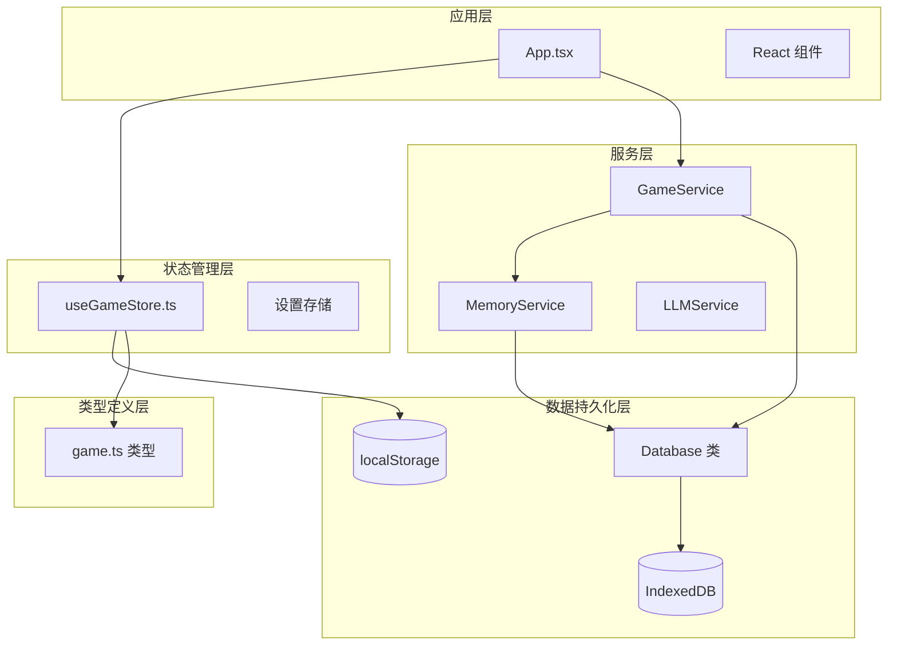
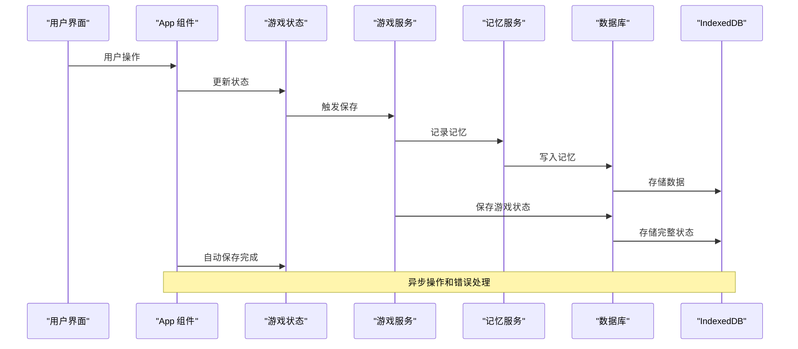
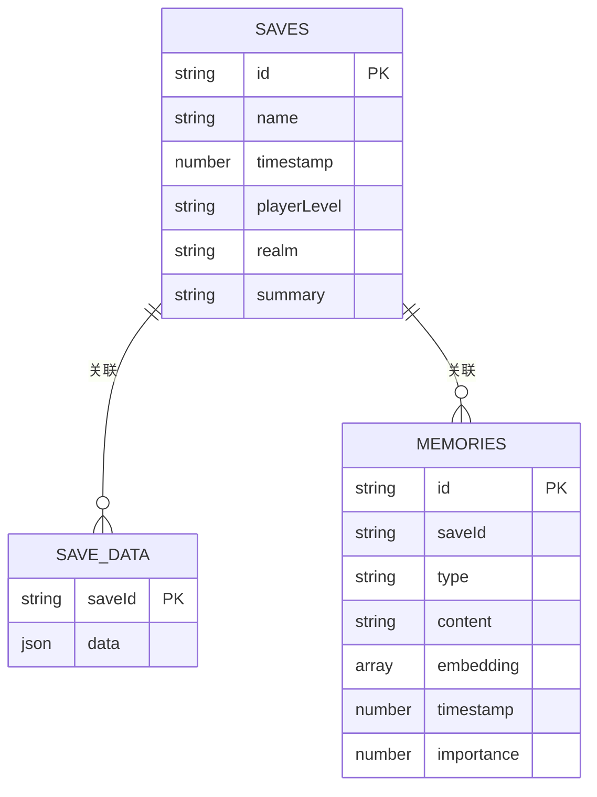
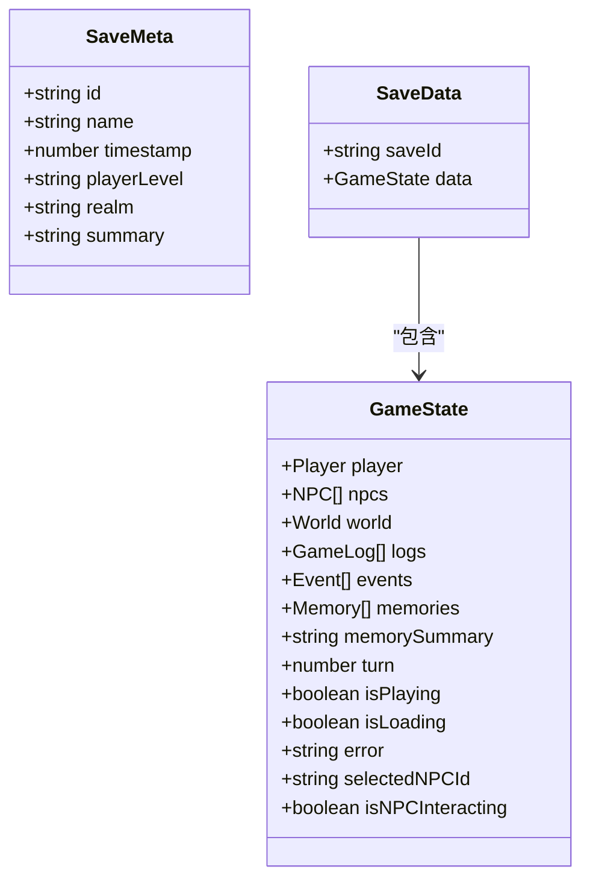
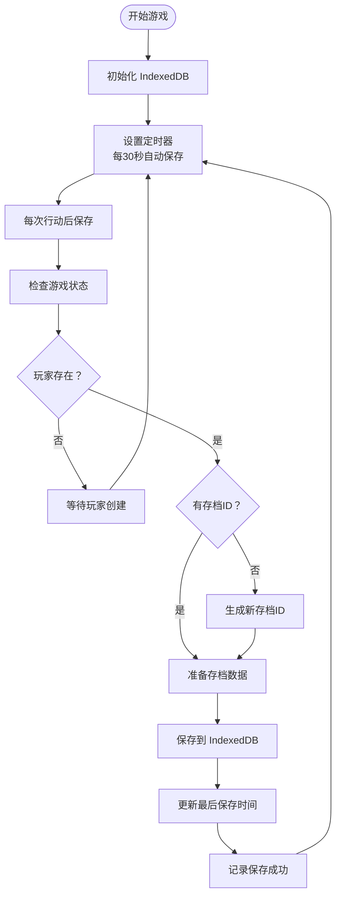
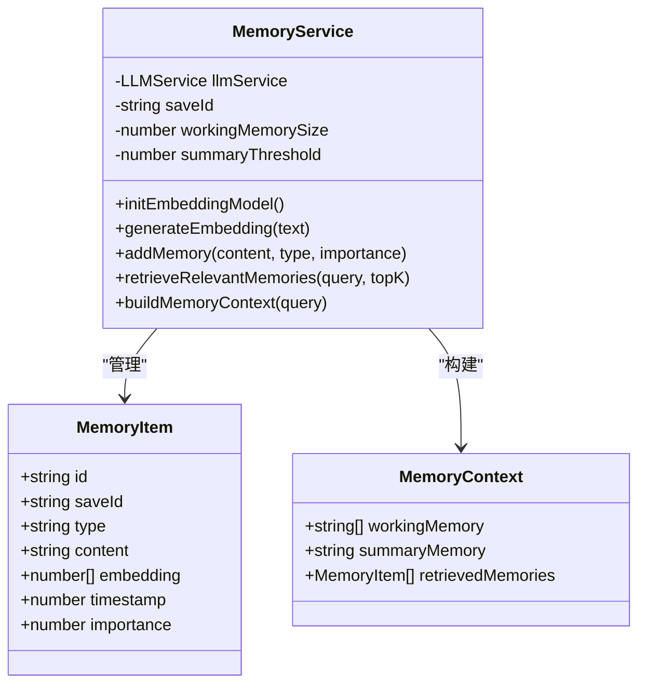
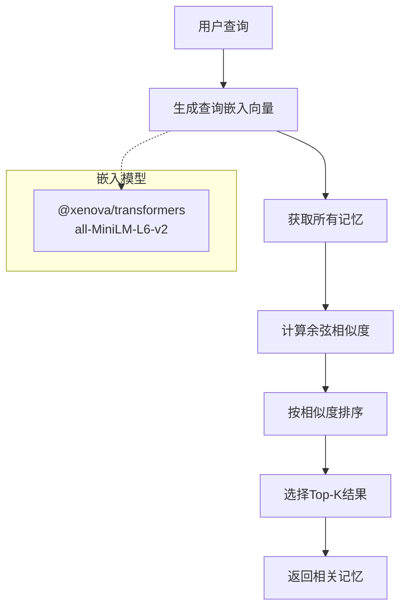
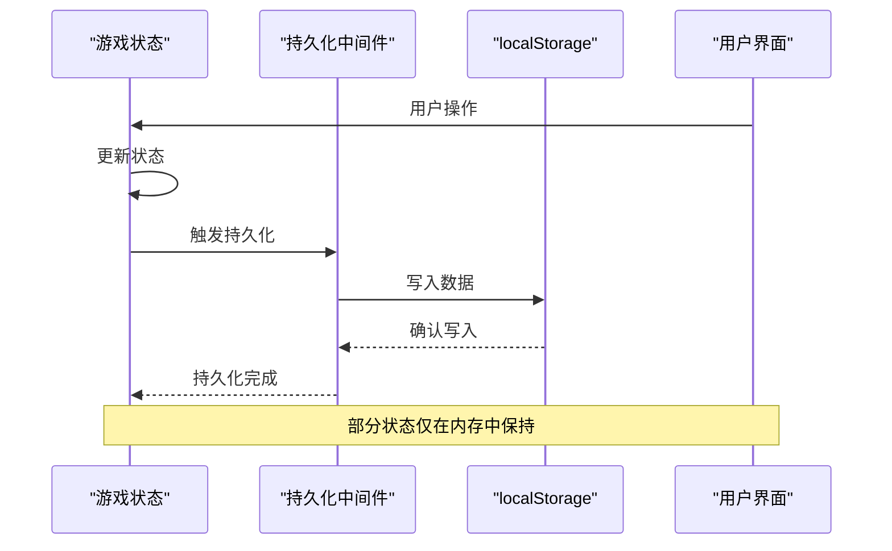
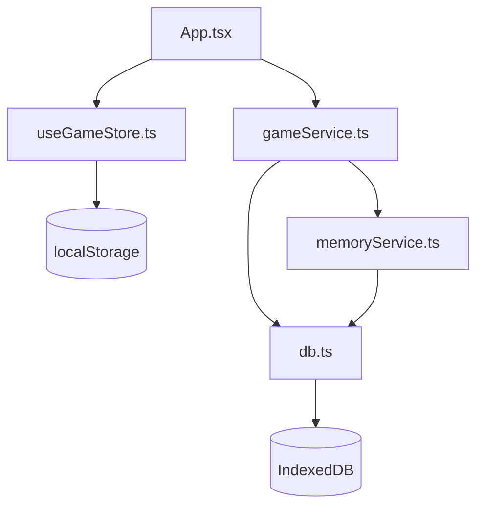
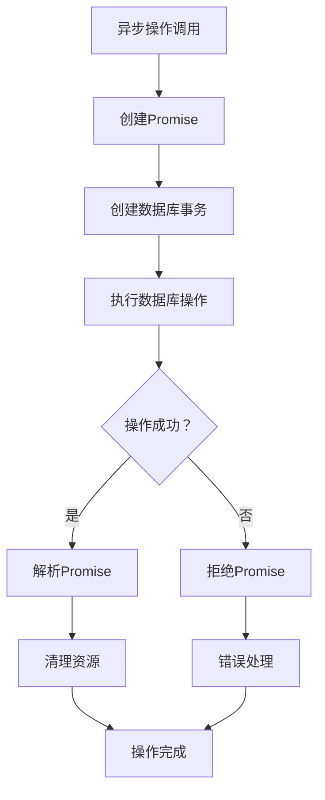

# 数据持久化系统

<cite>
**本文档引用的文件**
- [src/services/db.ts](file://src/services/db.ts)
- [src/services/gameService.ts](file://src/services/gameService.ts)
- [src/services/memoryService.ts](file://src/services/memoryService.ts)
- [src/stores/useGameStore.ts](file://src/stores/useGameStore.ts)
- [src/types/game.ts](file://src/types/game.ts)
- [src/App.tsx](file://src/App.tsx)
- [package.json](file://package.json)
</cite>

## 目录
1. [简介](#简介)
2. [项目结构](#项目结构)
3. [核心组件](#核心组件)
4. [架构概览](#架构概览)
5. [详细组件分析](#详细组件分析)
6. [依赖关系分析](#依赖关系分析)
7. [性能考虑](#性能考虑)
8. [故障排除指南](#故障排除指南)
9. [结论](#结论)

## 简介

本项目采用混合存储架构，结合了 IndexedDB 和 localStorage 来实现完整的数据持久化系统。系统支持游戏存档、记忆管理、自动保存等功能，为修仙主题的 Roguelike 游戏提供了可靠的数据持久化解决方案。

## 项目结构

项目采用模块化设计，主要分为以下几个层次：



**图表来源**
- [src/App.tsx](file://src/App.tsx#L1-L200)
- [src/services/db.ts](file://src/services/db.ts#L1-L236)
- [src/stores/useGameStore.ts](file://src/stores/useGameStore.ts#L1-L226)

**章节来源**
- [src/App.tsx](file://src/App.tsx#L1-L200)
- [src/services/db.ts](file://src/services/db.ts#L1-L236)
- [src/stores/useGameStore.ts](file://src/stores/useGameStore.ts#L1-L226)

## 核心组件

### 数据库服务 (Database)

数据库服务是整个持久化系统的核心，基于 IndexedDB 实现，提供完整的 CRUD 操作和事务管理。

**章节来源**
- [src/services/db.ts](file://src/services/db.ts#L36-L235)

### 游戏服务 (GameService)

游戏服务负责协调游戏逻辑和数据持久化，提供存档、读档、NPC 交互等功能。

**章节来源**
- [src/services/gameService.ts](file://src/services/gameService.ts#L50-L541)

### 记忆服务 (MemoryService)

记忆服务实现基于嵌入向量的记忆检索和管理，支持 RAG（检索增强生成）功能。

**章节来源**
- [src/services/memoryService.ts](file://src/services/memoryService.ts#L16-L224)

### 游戏状态存储 (useGameStore)

使用 Zustand 实现的状态管理，结合 localStorage 提供本地持久化。

**章节来源**
- [src/stores/useGameStore.ts](file://src/stores/useGameStore.ts#L13-L225)

## 架构概览

系统采用分层架构设计，实现了清晰的关注点分离：



**图表来源**
- [src/App.tsx](file://src/App.tsx#L75-L122)
- [src/services/gameService.ts](file://src/services/gameService.ts#L394-L409)
- [src/services/memoryService.ts](file://src/services/memoryService.ts#L84-L98)

## 详细组件分析

### 数据库架构设计

#### 数据库模式

系统使用 IndexedDB 的对象存储（Object Stores）来组织数据：



**图表来源**
- [src/services/db.ts](file://src/services/db.ts#L6-L34)

#### 索引策略

系统为关键查询场景建立了优化索引：

| 对象存储 | 索引名称 | 字段 | 唯一性 | 查询用途 |
|---------|---------|------|-------|----------|
| SAVES | timestamp | timestamp | 否 | 按时间排序获取存档列表 |
| MEMORIES | saveId | saveId | 否 | 按存档ID获取记忆 |
| MEMORIES | timestamp | timestamp | 否 | 按时间排序记忆 |
| MEMORIES | importance | importance | 否 | 按重要性过滤记忆 |

**章节来源**
- [src/services/db.ts](file://src/services/db.ts#L55-L69)

### 存档机制

#### 存档格式

游戏状态采用 JSON 格式进行序列化存储，包含完整的游戏状态信息：



**图表来源**
- [src/services/db.ts](file://src/services/db.ts#L12-L24)
- [src/types/game.ts](file://src/types/game.ts#L235-L251)

#### 自动保存流程

系统实现了智能的自动保存机制：



**图表来源**
- [src/App.tsx](file://src/App.tsx#L75-L122)
- [src/services/db.ts](file://src/services/db.ts#L134-L141)

**章节来源**
- [src/App.tsx](file://src/App.tsx#L75-L122)
- [src/services/db.ts](file://src/services/db.ts#L134-L141)

### 记忆管理系统

#### 记忆数据结构

记忆系统支持多种类型的记忆，并具备嵌入向量检索能力：



**图表来源**
- [src/services/db.ts](file://src/services/db.ts#L26-L34)
- [src/services/memoryService.ts](file://src/services/memoryService.ts#L10-L25)

#### 嵌入向量检索

系统实现了基于句子嵌入的语义检索：



**图表来源**
- [src/services/memoryService.ts](file://src/services/memoryService.ts#L122-L137)
- [src/services/memoryService.ts](file://src/services/memoryService.ts#L40-L56)

**章节来源**
- [src/services/memoryService.ts](file://src/services/memoryService.ts#L16-L224)

### 状态同步机制

#### 游戏状态存储

使用 Zustand 的持久化中间件实现状态的本地存储：



**图表来源**
- [src/stores/useGameStore.ts](file://src/stores/useGameStore.ts#L84-L225)

#### 存档与状态同步

系统通过以下机制确保数据一致性：

1. **优先级管理**：游戏状态优先存储在 IndexedDB 中，localStorage 作为补充
2. **版本兼容**：通过接口定义确保数据结构的向前兼容
3. **错误恢复**：提供完整的错误处理和数据恢复机制

**章节来源**
- [src/stores/useGameStore.ts](file://src/stores/useGameStore.ts#L84-L225)
- [src/App.tsx](file://src/App.tsx#L131-L161)

## 依赖关系分析

### 外部依赖

系统依赖以下关键库：

```mermaid
graph TB
subgraph "核心依赖"
Zustand[zustand]
Persist[zustand-persist]
Transformers[@xenova/transformers]
end
subgraph "UI框架"
React[react]
RadixUI[@radix-ui/react-*]
TailwindCSS[tailwindcss]
end
subgraph "工具库"
FramerMotion[framer-motion]
Sonner[sonner]
Lucide[lucide-react]
end
subgraph "开发工具"
Vite[vite]
TypeScript[typescript]
ESLint[eslint]
end
Zustand --> Persist
Transformers --> MemoryService
React --> App
App --> Zustand
```

**图表来源**
- [package.json](file://package.json#L15-L36)

### 内部组件依赖



**图表来源**
- [src/App.tsx](file://src/App.tsx#L1-L200)
- [src/services/gameService.ts](file://src/services/gameService.ts#L1-L10)

**章节来源**
- [package.json](file://package.json#L15-L36)
- [src/App.tsx](file://src/App.tsx#L1-L200)

## 性能考虑

### 存储优化策略

1. **索引优化**：为常用查询建立索引，避免全表扫描
2. **批量操作**：使用 Promise.all 并行处理多个记忆的保存
3. **内存管理**：定期清理不重要的记忆，控制存储空间
4. **延迟加载**：只在需要时加载完整的存档数据

### 异步操作处理

系统采用 Promise-based 的异步操作模式：



**图表来源**
- [src/services/db.ts](file://src/services/db.ts#L39-L72)

### 并发控制

系统通过以下机制处理并发访问：

1. **事务隔离**：每个操作都在独立的事务中执行
2. **错误处理**：统一的错误捕获和处理机制
3. **资源清理**：确保数据库连接和事务的正确关闭

## 故障排除指南

### 常见问题及解决方案

#### IndexedDB 初始化失败

**症状**：数据库无法打开或初始化失败

**原因分析**：
- 浏览器不支持 IndexedDB
- 存储空间不足
- 数据库版本升级失败

**解决方案**：
1. 检查浏览器兼容性
2. 清理浏览器缓存和存储
3. 重置数据库版本

#### 存档数据损坏

**症状**：无法加载或读取存档数据

**原因分析**：
- JSON 解析错误
- 数据库连接异常
- 存储空间不足

**解决方案**：
1. 检查数据格式完整性
2. 重新初始化数据库
3. 清理存储空间

#### 记忆检索性能问题

**症状**：记忆检索响应缓慢

**原因分析**：
- 嵌入向量计算耗时
- 记忆数量过多
- 缺少适当的索引

**解决方案**：
1. 优化嵌入向量生成
2. 实施记忆清理策略
3. 添加更多索引

**章节来源**
- [src/services/db.ts](file://src/services/db.ts#L43-L45)
- [src/services/db.ts](file://src/services/db.ts#L108-L109)

## 结论

本数据持久化系统通过精心设计的架构和优化策略，为修仙主题的 Roguelike 游戏提供了可靠的存储解决方案。系统的主要优势包括：

1. **多层次存储**：结合 IndexedDB 和 localStorage，确保数据的可靠性和性能
2. **智能索引**：针对查询场景优化索引策略
3. **异步处理**：完善的异步操作和错误处理机制
4. **内存优化**：有效的内存管理和存储空间控制
5. **扩展性**：模块化的架构设计便于功能扩展

系统在保证数据完整性的同时，也充分考虑了性能和用户体验，为大型存档数据的处理提供了有效的解决方案。通过合理的索引策略、批量操作和内存管理，系统能够高效处理大量的游戏数据，为玩家提供流畅的游戏体验。