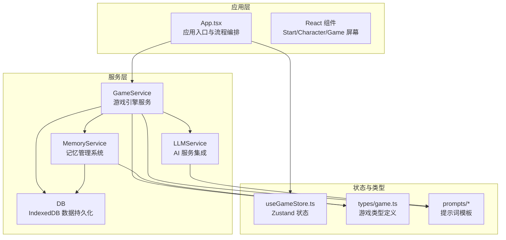
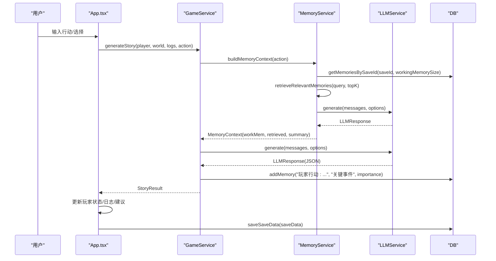
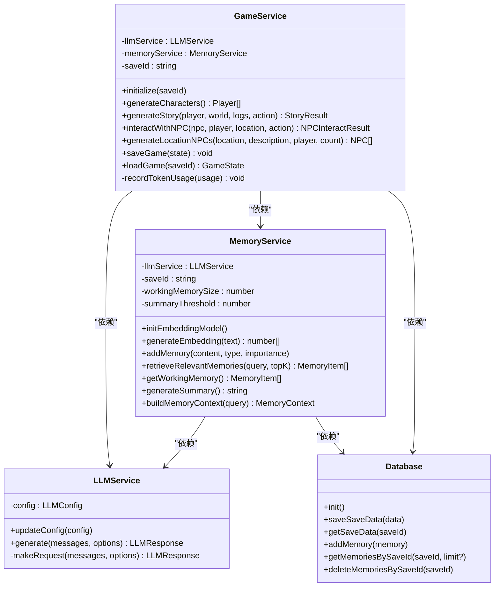
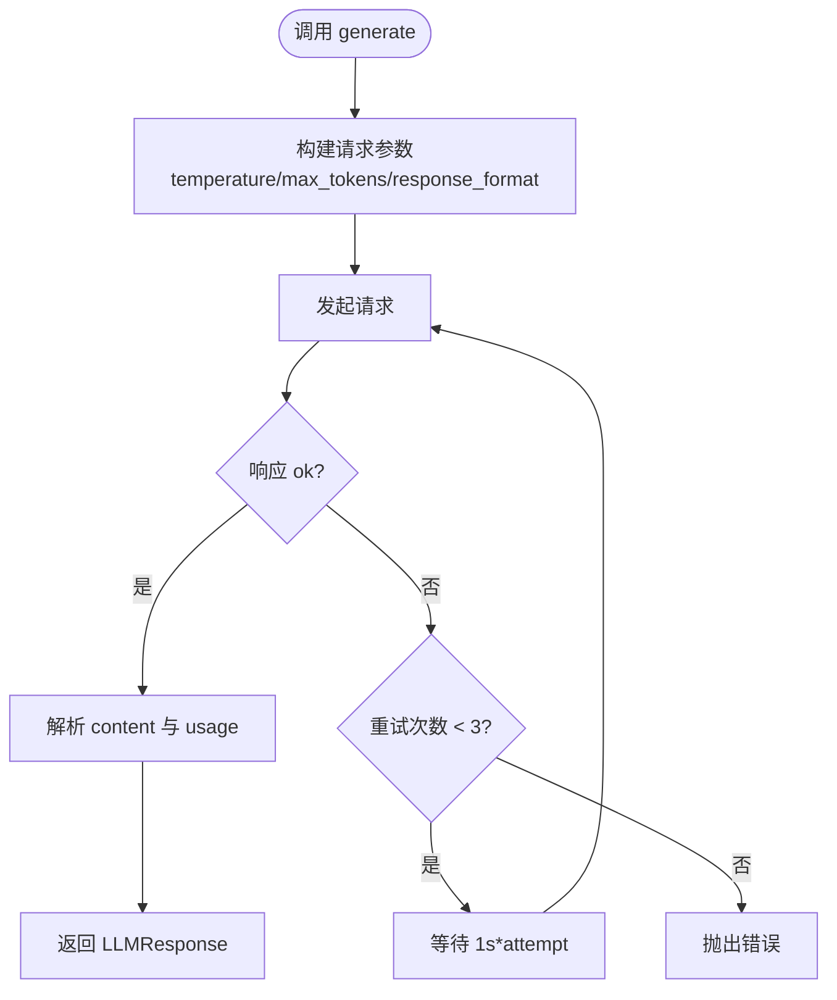
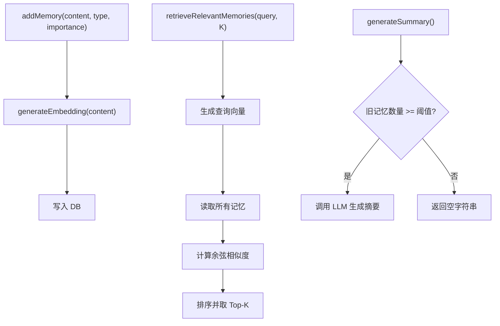
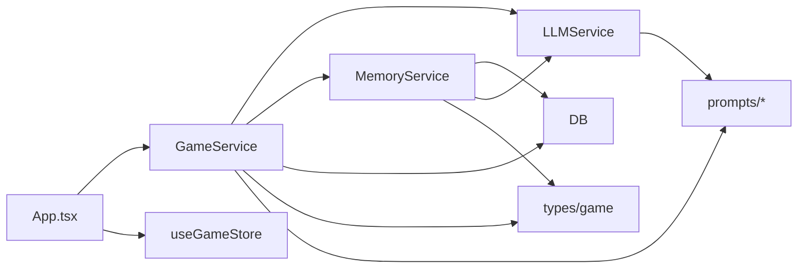

# 核心系统

<cite>
**本文引用的文件**
- [gameService.ts](file://src/services/gameService.ts)
- [llmService.ts](file://src/services/llmService.ts)
- [memoryService.ts](file://src/services/memoryService.ts)
- [db.ts](file://src/services/db.ts)
- [game.ts](file://src/types/game.ts)
- [character.ts](file://src/prompts/character.ts)
- [story.ts](file://src/prompts/story.ts)
- [summary.ts](file://src/prompts/summary.ts)
- [useGameStore.ts](file://src/stores/useGameStore.ts)
- [App.tsx](file://src/App.tsx)
- [package.json](file://package.json)
</cite>

## 目录
1. [简介](#简介)
2. [项目结构](#项目结构)
3. [核心组件](#核心组件)
4. [架构总览](#架构总览)
5. [详细组件分析](#详细组件分析)
6. [依赖关系分析](#依赖关系分析)
7. [性能考量](#性能考量)
8. [故障排查指南](#故障排查指南)
9. [结论](#结论)
10. [附录](#附录)

## 简介
本项目是一个纯前端的修仙主题 Roguelike 游戏，采用“AI 驱动”的内容生成范式，通过四大核心服务协同工作：
- GameService：游戏引擎服务，负责角色生成、剧情推进、NPC 交互、存档加载等核心流程编排。
- LLMService：AI 服务集成，封装外部大模型 API 调用，统一请求参数、响应格式与错误重试。
- MemoryService：记忆管理系统，实现工作记忆、检索记忆与摘要记忆的三层架构，支持 RAG 检索与嵌入向量相似度计算。
- DB：数据持久化系统，基于 IndexedDB 的本地存档与记忆存储，提供存档元数据、存档数据与记忆条目的 CRUD。

四大服务围绕 GameState 协作，结合提示词工程与状态管理，形成“输入动作/状态 → 记忆上下文构建 → LLM 推演 → 结果解析 → 状态更新/记忆写入 → 存档”的闭环。

## 项目结构
项目采用按职责分层的服务架构，核心文件组织如下：
- services：四大核心服务与类型定义
- prompts：提示词模板（角色、剧情、摘要）
- stores：Zustand 状态管理（游戏状态、设置、令牌统计）
- components：React UI 组件（屏幕、面板、对话框等）
- types：TypeScript 类型定义（角色、NPC、世界、事件、记忆、时间等）

图表来源
- [App.tsx](file://src/App.tsx#L1-L588)
- [gameService.ts](file://src/services/gameService.ts#L1-L541)
- [llmService.ts](file://src/services/llmService.ts#L1-L101)
- [memoryService.ts](file://src/services/memoryService.ts#L1-L224)
- [db.ts](file://src/services/db.ts#L1-L236)
- [useGameStore.ts](file://src/stores/useGameStore.ts#L1-L226)
- [game.ts](file://src/types/game.ts#L1-L319)

章节来源
- [App.tsx](file://src/App.tsx#L1-L588)
- [package.json](file://package.json#L1-L55)

## 核心组件
本节概述四大核心服务的职责与协作关系。

- GameService
  - 角色生成：基于角色提示词生成多个候选角色，补全默认属性，返回 Player 数组。
  - 剧情生成：构建记忆上下文（工作记忆+检索记忆+摘要记忆），调用 LLM 推演剧情，解析 JSON 结果，更新玩家状态、物品、技能、关系、事件与建议动作。
  - NPC 交互：根据 NPC 与玩家状态生成对话与交互结果，更新双方状态与时间。
  - 区域 NPC 生成：按位置与玩家境界生成符合场景的 NPC 列表。
  - 存档/读档：通过 DB 保存/加载 GameState。

- LLMService
  - 封装外部大模型 API，支持温度、最大 token、响应格式（JSON/文本）等参数。
  - 内置指数退避重试（最多 3 次），统一错误处理与使用量统计。

- MemoryService
  - 工作记忆：最近若干条记忆（默认 10 条）。
  - 检索记忆：基于嵌入向量余弦相似度检索 Top-K 相关记忆（默认 5 条）。
  - 摘要记忆：当旧记忆超过阈值（默认 50 条）时，调用 LLM 生成摘要，降低上下文长度。
  - 嵌入向量：优先使用 @xenova/transformers 的特征提取模型，失败时回退到简单哈希向量。
  - 重要性评分：根据关键词（突破、死亡、奇遇、传承、天劫、飞升、获得、结识）动态评估记忆重要性。

- DB
  - IndexedDB 存储：saves、saveData、memories 三类对象存储。
  - 提供存档元数据、存档数据、记忆增删查改接口，支持按 saveId、时间戳、重要性等索引查询。

章节来源
- [gameService.ts](file://src/services/gameService.ts#L50-L541)
- [llmService.ts](file://src/services/llmService.ts#L18-L101)
- [memoryService.ts](file://src/services/memoryService.ts#L16-L224)
- [db.ts](file://src/services/db.ts#L36-L236)

## 架构总览
下图展示从用户输入到状态更新的完整流程，以及各服务间的依赖关系。

图表来源
- [App.tsx](file://src/App.tsx#L240-L468)
- [gameService.ts](file://src/services/gameService.ts#L283-L391)
- [memoryService.ts](file://src/services/memoryService.ts#L175-L188)
- [llmService.ts](file://src/services/llmService.ts#L29-L55)
- [db.ts](file://src/services/db.ts#L134-L150)

## 详细组件分析

### GameService 分析
- 初始化与记忆服务
  - initialize(saveId)：绑定 saveId，创建 MemoryService 实例。
  - recordTokenUsage(usage)：将 LLM 使用量写入全局 token store。
- 角色生成
  - generateCharacters()：构造系统与用户消息，调用 LLM 生成 JSON，解析后补全缺失字段，返回 Player 数组。
- 剧情生成
  - generateStory(player, world, logs, action)：构建记忆上下文，拼接玩家、世界、最近日志、摘要与检索记忆，调用 LLM 推演，解析 JSON，更新玩家状态、物品、技能、关系、事件与建议动作，并记录关键事件到记忆。
- NPC 交互
  - interactWithNPC(npc, player, currentLocation, action)：构造交互提示词，调用 LLM，解析结果，更新 NPC 与玩家状态，记录交互记忆。
- 区域 NPC 生成
  - generateLocationNPCs(location, locationDescription, player, count)：按区域与玩家境界生成符合场景的 NPC 列表。
- 存档/读档
  - saveGame(state)/loadGame(saveId)：通过 DB 保存/加载 GameState。

图表来源
- [gameService.ts](file://src/services/gameService.ts#L50-L541)
- [llmService.ts](file://src/services/llmService.ts#L18-L101)
- [memoryService.ts](file://src/services/memoryService.ts#L16-L224)
- [db.ts](file://src/services/db.ts#L36-L236)

章节来源
- [gameService.ts](file://src/services/gameService.ts#L50-L541)

### LLMService 分析
- 配置与更新
  - 构造函数接收 LLMConfig（baseURL、apiKey、model），updateConfig 支持运行时更新。
- 请求与重试
  - generate(messages, options)：循环重试（最多 3 次），指数退避等待，统一错误包装。
  - makeRequest：发送 POST /chat/completions，解析 choices[0].message.content 与 usage。
- 参数与格式
  - temperature、max_tokens、response_format（json_object/text）可选传入。

图表来源
- [llmService.ts](file://src/services/llmService.ts#L29-L97)

章节来源
- [llmService.ts](file://src/services/llmService.ts#L18-L101)

### MemoryService 分析
- 嵌入向量与相似度
  - initEmbeddingModel：延迟加载 @xenova/transformers 的特征提取模型。
  - generateEmbedding：优先使用 pipeline，失败回退到 simpleHashEmbedding（128 维向量，归一化）。
  - cosineSimilarity：计算余弦相似度。
- 记忆管理
  - addMemory：生成嵌入向量，写入 DB。
  - addLogAsMemory：根据关键词动态计算 importance。
  - retrieveRelevantMemories：按相似度排序返回 Top-K。
  - getWorkingMemory：最近 N 条（默认 10）。
  - generateSummary：当旧记忆数量超过阈值（默认 50）时，调用 LLM 生成摘要。
  - buildMemoryContext：并发组装工作记忆、检索记忆与摘要。
  - shouldGenerateSummary/cleanupOldMemories：条件判断与清理策略（当前未执行删除，预留扩展）。

图表来源
- [memoryService.ts](file://src/services/memoryService.ts#L83-L188)

章节来源
- [memoryService.ts](file://src/services/memoryService.ts#L16-L224)

### DB 分析
- 对象存储
  - SAVES：存档元数据（id、name、timestamp、playerLevel、realm、summary）。
  - SAVE_DATA：存档数据（saveId、data）。
  - MEMORIES：记忆条目（id、saveId、type、content、embedding、timestamp、importance）。
- 索引
  - MEMORIES：saveId、timestamp、importance。
- 主要接口
  - 存档：addSave/updateSave/getSave/getAllSaves/deleteSave
  - 存档数据：saveSaveData/getSaveData/deleteSaveData
  - 记忆：addMemory/addMemories/getMemoriesBySaveId/getMemoriesByImportance/deleteMemoriesBySaveId
  - 清理：clearAll

章节来源
- [db.ts](file://src/services/db.ts#L36-L236)

### 提示词与类型系统
- 提示词
  - 角色生成：characterSystemPrompt、characterGenerationPrompt
  - 剧情生成：storySystemPrompt、storyGenerationPrompt
  - 摘要生成：summarySystemPrompt、summaryGenerationPrompt
- 类型
  - Player/NPC/World/Event/GameLog/Memory/Time 等核心类型定义，支持修仙体系的境界、属性、物品、技能、关系等。

章节来源
- [character.ts](file://src/prompts/character.ts#L1-L97)
- [story.ts](file://src/prompts/story.ts#L1-L147)
- [summary.ts](file://src/prompts/summary.ts#L1-L26)
- [game.ts](file://src/types/game.ts#L1-L319)

## 依赖关系分析
- 组件耦合
  - GameService 依赖 LLMService 与 MemoryService，二者均依赖 DB。
  - App.tsx 通过 useMemo 保证 LLM 配置不变时不重建服务实例，减少内存占用。
- 外部依赖
  - @xenova/transformers：用于嵌入向量生成（可选）。
  - IndexedDB：本地持久化。
  - Zustand：状态管理与本地持久化。

图表来源
- [App.tsx](file://src/App.tsx#L67-L72)
- [gameService.ts](file://src/services/gameService.ts#L2-L9)
- [memoryService.ts](file://src/services/memoryService.ts#L2-L5)
- [llmService.ts](file://src/services/llmService.ts#L2-L7)
- [db.ts](file://src/services/db.ts#L1-L10)
- [useGameStore.ts](file://src/stores/useGameStore.ts#L1-L11)

章节来源
- [package.json](file://package.json#L15-L36)

## 性能考量
- 嵌入向量与相似度
  - 建议在首次使用时预热嵌入模型，避免首调延迟。
  - Top-K 与阈值可通过配置项调整，平衡召回质量与性能。
- LLM 调用
  - 控制 temperature 与 max_tokens，避免过长上下文导致成本与延迟上升。
  - 使用 response_format: json_object 以减少解析歧义。
- 记忆清理
  - 当前清理策略仅合并保留集合，未实际删除旧记忆，可在未来扩展批量删除以控制存储大小。
- IndexedDB
  - 通过索引查询（saveId、timestamp、importance）优化读取性能。
- UI 与状态
  - 使用 useMemo 缓存服务实例，避免不必要的重建。
  - 自动存档间隔（30 秒）可根据设备性能与网络状况调整。

[本节为通用指导，无需特定文件引用]

## 故障排查指南
- LLM 调用失败
  - 现象：generate 抛出错误，控制台输出重试警告。
  - 排查：检查 baseURL、apiKey、model 配置；确认网络连通；查看响应状态码与错误信息。
  - 参考路径：[llmService.ts](file://src/services/llmService.ts#L37-L55)
- 记忆检索异常
  - 现象：检索结果为空或相似度异常。
  - 排查：确认嵌入模型加载成功；检查 content 是否为空；验证向量维度一致性。
  - 参考路径：[memoryService.ts](file://src/services/memoryService.ts#L27-L56)
- IndexedDB 初始化失败
  - 现象：打开数据库报错。
  - 排查：浏览器兼容性、权限设置、存储空间限制。
  - 参考路径：[db.ts](file://src/services/db.ts#L39-L72)
- 剧情生成 JSON 解析失败
  - 现象：parse 异常或字段缺失。
  - 排查：检查提示词模板与 LLM 输出格式；确保 response_format 为 json_object。
  - 参考路径：[gameService.ts](file://src/services/gameService.ts#L344-L372)
- 自动存档失败
  - 现象：定时存档或手动存档失败。
  - 排查：检查 saveId 与 GameState 结构；确认 DB 可用。
  - 参考路径：[App.tsx](file://src/App.tsx#L75-L105)

章节来源
- [llmService.ts](file://src/services/llmService.ts#L37-L55)
- [memoryService.ts](file://src/services/memoryService.ts#L27-L56)
- [db.ts](file://src/services/db.ts#L39-L72)
- [gameService.ts](file://src/services/gameService.ts#L344-L372)
- [App.tsx](file://src/App.tsx#L75-L105)

## 结论
本项目以“AI 驱动”为核心理念，通过 GameService 编排、LLMService 统一接入、MemoryService 多层记忆与 DB 本地持久化，构建了可扩展、可维护的修仙 Roguelike 核心系统。提示词工程与类型系统保证了输出质量与状态一致性，Zustand 状态管理与 React 组件提供了良好的用户体验。未来可在记忆清理、嵌入模型优化、LLM 参数调优等方面持续迭代，进一步提升性能与稳定性。

[本节为总结，无需特定文件引用]

## 附录

### 系统配置选项与参数
- LLM 配置（LLMConfig）
  - baseURL：大模型 API 基础地址
  - apiKey：访问密钥
  - model：模型名称
  - 参考路径：[game.ts](file://src/types/game.ts#L253-L257)
- GameService 参数
  - temperature：默认 0.7（剧情生成）、0.8（角色/人物生成）、0.9（个性/天赋生成）
  - response_format：默认 json_object
  - 参考路径：[gameService.ts](file://src/services/gameService.ts#L81-L84)
- MemoryService 参数
  - workingMemorySize：默认 10
  - summaryThreshold：默认 50
  - 参考路径：[memoryService.ts](file://src/services/memoryService.ts#L18-L25)
- LLMService 参数
  - maxRetries：默认 3
  - temperature：默认 0.7
  - max_tokens：默认 2000
  - 参考路径：[llmService.ts](file://src/services/llmService.ts#L37-L78)

章节来源
- [game.ts](file://src/types/game.ts#L253-L257)
- [gameService.ts](file://src/services/gameService.ts#L81-L84)
- [memoryService.ts](file://src/services/memoryService.ts#L18-L25)
- [llmService.ts](file://src/services/llmService.ts#L37-L78)

### 使用模式与最佳实践
- 角色创建
  - 使用 generateCharacters 生成候选角色，再调用 generatePersonalityOptions/generateTalentOptions 丰富角色细节。
  - 参考路径：[gameService.ts](file://src/services/gameService.ts#L75-L119)
- 剧情推进
  - 在 handleActionSubmit 中收集 logs、player、world，调用 generateStory，应用返回的 statChanges/skills/items 等更新。
  - 参考路径：[App.tsx](file://src/App.tsx#L240-L468)
- NPC 交互
  - 通过 interactWithNPC 获取对话与交互结果，更新双方状态与时间。
  - 参考路径：[gameService.ts](file://src/services/gameService.ts#L416-L469)
- 存档与读档
  - 使用 saveGame/loadGame 或通过 DB.saveSaveData/getSaveData 管理 GameState。
  - 参考路径：[gameService.ts](file://src/services/gameService.ts#L394-L409)

章节来源
- [gameService.ts](file://src/services/gameService.ts#L75-L119)
- [App.tsx](file://src/App.tsx#L240-L468)