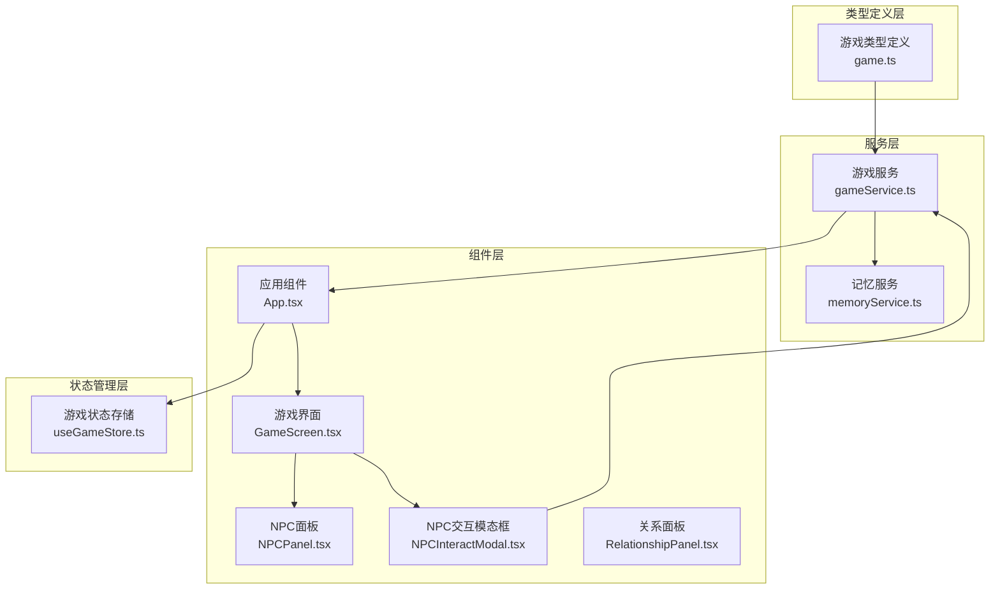
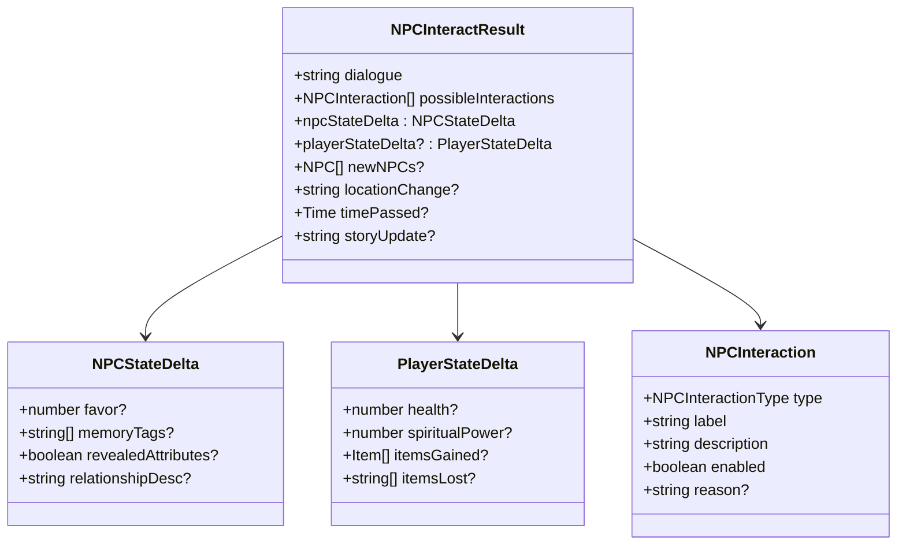
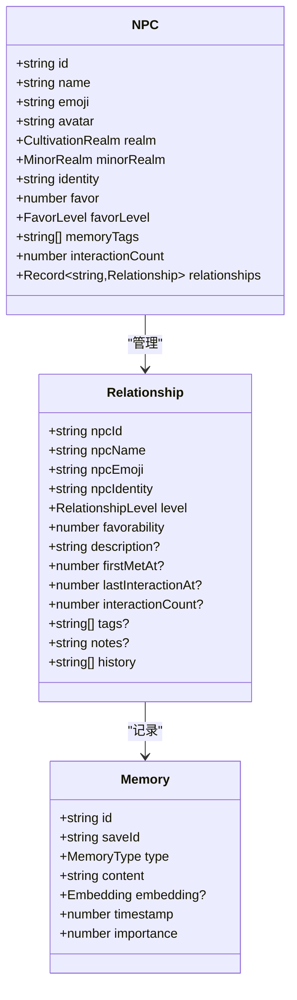
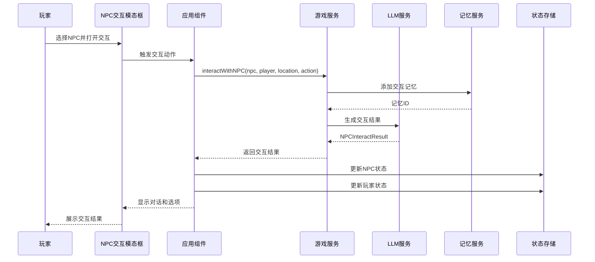
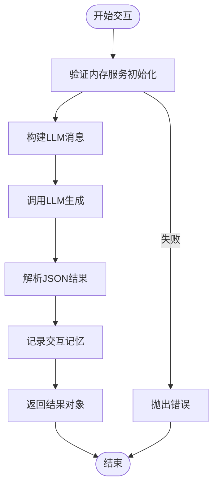
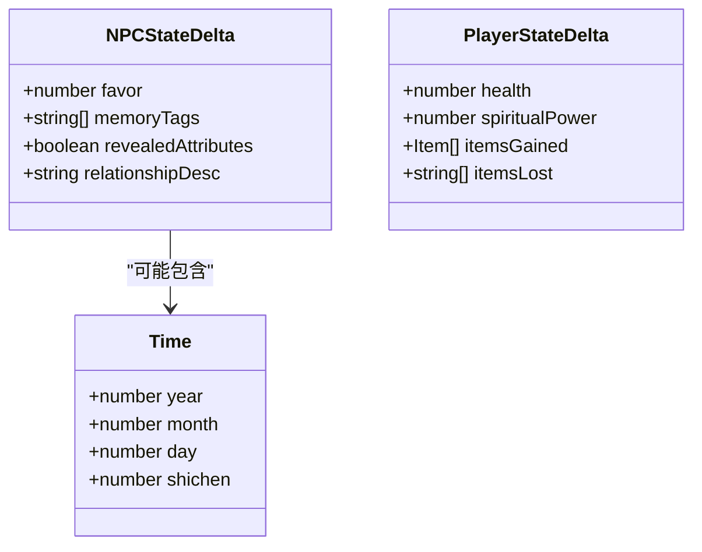
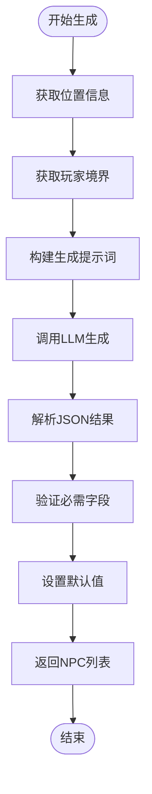
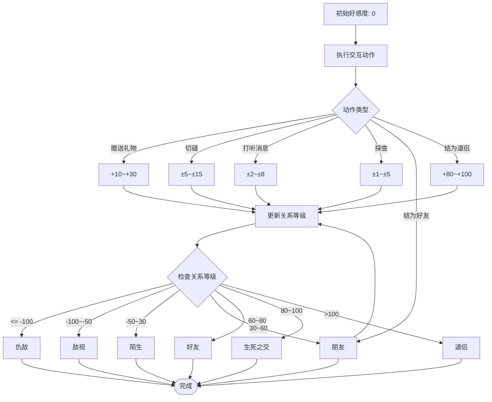
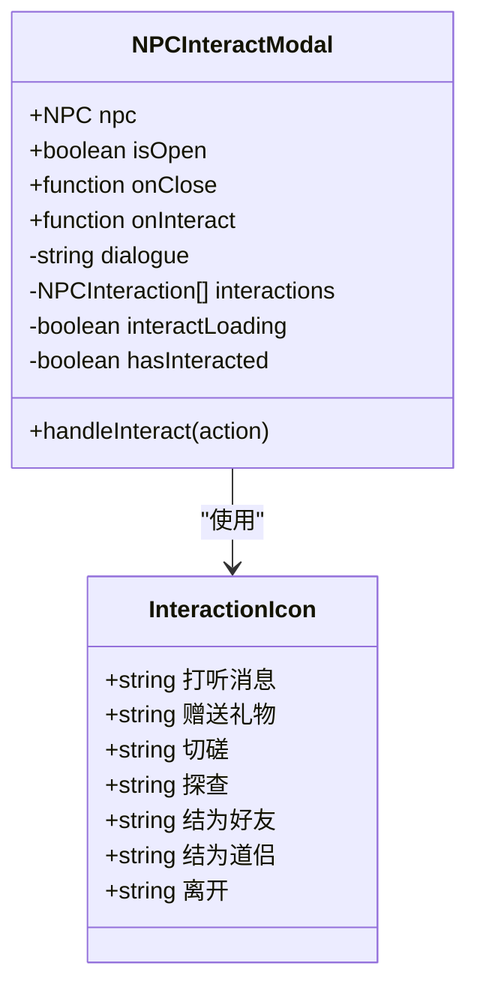
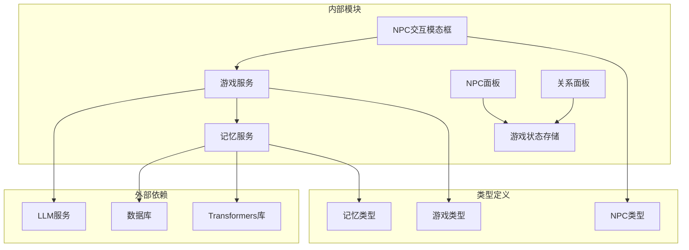

# NPC 交互系统

<cite>
**本文档引用的文件**
- [game.ts](file://src/types/game.ts)
- [gameService.ts](file://src/services/gameService.ts)
- [NPCInteractModal.tsx](file://src/components/NPCInteractModal.tsx)
- [useGameStore.ts](file://src/stores/useGameStore.ts)
- [App.tsx](file://src/App.tsx)
- [GameScreen.tsx](file://src/components/GameScreen.tsx)
- [NPCPanel.tsx](file://src/components/NPCPanel.tsx)
- [RelationshipPanel.tsx](file://src/components/RelationshipPanel.tsx)
- [memoryService.ts](file://src/services/memoryService.ts)
</cite>

## 目录
1. [简介](#简介)
2. [项目结构](#项目结构)
3. [核心组件](#核心组件)
4. [架构概览](#架构概览)
5. [详细组件分析](#详细组件分析)
6. [依赖关系分析](#依赖关系分析)
7. [性能考虑](#性能考虑)
8. [故障排除指南](#故障排除指南)
9. [结论](#结论)

## 简介

NPC 交互系统是修仙 Roguelike 游戏中的核心社交机制，负责管理玩家与非玩家角色之间的互动。该系统基于大型语言模型（LLM）驱动，实现了动态的对话生成、状态管理和关系系统。系统支持多种互动类型，包括打听消息、赠送礼物、切磋、探查、结为好友和结为道侣等。

## 项目结构

NPC 交互系统主要分布在以下几个模块中：

**图表来源**
- [game.ts](file://src/types/game.ts#L1-L319)
- [gameService.ts](file://src/services/gameService.ts#L1-L541)
- [App.tsx](file://src/App.tsx#L1-L588)

**章节来源**
- [game.ts](file://src/types/game.ts#L1-L319)
- [gameService.ts](file://src/services/gameService.ts#L1-L541)

## 核心组件

### NPC 交互结果结构

NPCInteractResult 是交互系统的核心数据结构，定义了交互后的所有可能结果：

**图表来源**
- [game.ts](file://src/types/game.ts#L265-L285)

### NPC 关系系统

系统实现了完整的 NPC 关系管理系统，包括好感度计算、关系等级和记忆标签机制：

**图表来源**
- [game.ts](file://src/types/game.ts#L94-L108)
- [game.ts](file://src/types/game.ts#L173-L203)
- [game.ts](file://src/types/game.ts#L63-L71)

**章节来源**
- [game.ts](file://src/types/game.ts#L94-L108)
- [game.ts](file://src/types/game.ts#L173-L203)
- [game.ts](file://src/types/game.ts#L265-L285)

## 架构概览

NPC 交互系统采用分层架构设计，确保了良好的模块分离和可维护性：

**图表来源**
- [App.tsx](file://src/App.tsx#L481-L548)
- [gameService.ts](file://src/services/gameService.ts#L416-L469)

## 详细组件分析

### interactWithNPC() 方法实现

interactWithNPC() 是 NPC 交互系统的核心方法，负责处理所有类型的 NPC 互动：

#### 方法签名和参数
- **输入参数**：NPC 对象、Player 对象、当前位置字符串、交互动作字符串
- **返回值**：Promise<NPCInteractResult> 异步结果对象

#### 实现流程

**图表来源**
- [gameService.ts](file://src/services/gameService.ts#L416-L469)

#### 关键实现细节

1. **消息构建**：系统构建包含系统提示词和用户提示词的消息数组
2. **LLM 调用**：使用温度参数 0.7 和 JSON 格式响应
3. **结果解析**：将 LLM 返回的 JSON 字符串解析为结构化对象
4. **默认值处理**：为缺失字段提供安全的默认值
5. **记忆记录**：将交互过程记录到记忆服务中

**章节来源**
- [gameService.ts](file://src/services/gameService.ts#L416-L469)

### NPCInteractResult 结构详解

NPCInteractResult 结构包含了交互后的所有可能变化：

#### 对话生成机制
- **对话内容**：NPC 的回复文本，通过 LLM 动态生成
- **互动选项**：基于当前情境和玩家状态生成的可用选项
- **上下文感知**：结合玩家境界、NPC 特性和位置环境

#### 状态变化字段

| 字段名 | 类型 | 描述 | 示例 |
|--------|------|------|------|
| dialogue | string | NPC 的回复文字 | "年轻人，你看起来很有潜力..." |
| possibleInteractions | NPCInteraction[] | 可用的互动选项列表 | [打听消息, 赠送礼物, 离开] |
| npcStateDelta | NPCStateDelta | NPC 状态变化 | 好感度变化, 属性揭示 |
| playerStateDelta | PlayerStateDelta | 玩家状态变化 | 生命值变化, 真气增减 |
| timePassed | Time | 时间流逝 | 年, 月, 日, 时辰 |
| storyUpdate | string | 剧情更新文本 | 新的故事情节发展 |

#### NPC 状态变化

**图表来源**
- [game.ts](file://src/types/game.ts#L269-L284)

**章节来源**
- [game.ts](file://src/types/game.ts#L265-L285)

### generateLocationNPCs() 区域 NPC 生成算法

generateLocationNPCs() 方法实现了智能的区域 NPC 生成算法：

#### 算法流程

**图表来源**
- [gameService.ts](file://src/services/gameService.ts#L471-L537)

#### 生成规则

1. **位置适配**：根据区域特点生成合适的 NPC 类型
   - 山麓：采药人、散修
   - 宗门：弟子、长老
   - 城市：商人、游侠

2. **境界匹配**：NPC 境界与玩家相当或略高/略低
3. **多样性保证**：性格各异，包含正邪角色
4. **初始状态**：所有 NPC 初始好感度为 0（陌生）

**章节来源**
- [gameService.ts](file://src/services/gameService.ts#L471-L537)

### NPC 关系系统设计

#### 好感度计算机制

系统实现了多层次的好感度系统：

**图表来源**
- [game.ts](file://src/types/game.ts#L287-L296)

#### 关系等级系统

| 等级 | 分数范围 | 描述 | 颜色 |
|------|----------|------|------|
| 仇敌 | ≤ -100 | 深仇大恨 | 🖤 死亡 |
| 敌视 | -100~-50 | 敌对关系 | ⚔️ 战争 |
| 陌生 | -50~30 | 初次见面 | 😐 中性 |
| 朋友 | 30~60 | 友好关系 | 🙂 友谊 |
| 好友 | 60~80 | 深厚友谊 | 😊 信任 |
| 生死之交 | 80~100 | 生死兄弟 | 💜 深情 |
| 道侣 | > 100 | 修仙伴侣 | 💗 深爱 |

**章节来源**
- [game.ts](file://src/types/game.ts#L43-L46)
- [game.ts](file://src/types/game.ts#L287-L296)

### 用户界面组件

#### NPC 交互模态框

NPCInteractModal 提供了直观的交互界面：

**图表来源**
- [NPCInteractModal.tsx](file://src/components/NPCInteractModal.tsx#L1-L223)

#### NPC 面板

NPCPanel 展示了附近 NPC 的基本信息：

- **头像显示**：使用 emoji 表示 NPC 外观
- **境界信息**：显示 NPC 的修仙境界和小境界
- **好感度图标**：根据好感度显示不同表情符号
- **点击交互**：点击 NPC 打开交互模态框

**章节来源**
- [NPCInteractModal.tsx](file://src/components/NPCInteractModal.tsx#L1-L223)
- [NPCPanel.tsx](file://src/components/NPCPanel.tsx#L1-L99)

## 依赖关系分析

NPC 交互系统涉及多个层次的依赖关系：

**图表来源**
- [gameService.ts](file://src/services/gameService.ts#L1-L10)
- [memoryService.ts](file://src/services/memoryService.ts#L1-L24)

### 关键依赖关系

1. **LLM 服务依赖**：所有 AI 驱动的功能都依赖于 LLM 服务
2. **记忆服务依赖**：通过 MemoryService 实现长期记忆管理
3. **状态存储依赖**：使用 Zustand 管理全局游戏状态
4. **UI 组件依赖**：React 组件负责用户交互和状态展示

**章节来源**
- [gameService.ts](file://src/services/gameService.ts#L1-L10)
- [memoryService.ts](file://src/services/memoryService.ts#L1-L24)

## 性能考虑

### LLM 调用优化

1. **温度参数控制**：交互系统使用温度 0.7，在创造性和稳定性之间取得平衡
2. **JSON 格式约束**：强制 JSON 输出格式，减少解析错误
3. **批量处理**：支持同时生成多个 NPC 和交互结果

### 记忆系统优化

1. **嵌入向量缓存**：使用特征提取模型生成嵌入向量
2. **相似度计算**：实现余弦相似度算法进行高效检索
3. **摘要生成**：定期生成记忆摘要，减少查询负载

### 状态管理优化

1. **局部状态**：UI 组件使用本地状态管理即时反馈
2. **全局状态**：Zustand 管理持久化游戏状态
3. **懒加载**：按需加载 NPC 和记忆数据

## 故障排除指南

### 常见问题及解决方案

#### LLM 服务初始化失败
- **症状**：调用 interactWithNPC() 抛出 "GameService not initialized" 错误
- **原因**：未正确初始化 GameService
- **解决**：确保在使用前调用 `gameService.initialize(saveId)`

#### 记忆服务不可用
- **症状**：交互过程中出现内存相关错误
- **原因**：MemoryService 未正确初始化
- **解决**：检查嵌入模型加载和数据库连接状态

#### NPC 生成异常
- **症状**：generateLocationNPCs() 返回空列表或格式错误
- **原因**：LLM 输出不符合预期格式
- **解决**：检查提示词构建和 JSON 解析逻辑

#### 状态更新延迟
- **症状**：交互结果显示后状态未及时更新
- **原因**：异步操作未正确等待
- **解决**：确保在 UI 组件中正确处理异步状态更新

**章节来源**
- [gameService.ts](file://src/services/gameService.ts#L422-L424)
- [App.tsx](file://src/App.tsx#L481-L548)

## 结论

NPC 交互系统通过精心设计的架构和算法，实现了丰富而动态的修仙世界社交体验。系统的核心优势包括：

1. **智能化交互**：基于 LLM 的动态对话生成，提供沉浸式的互动体验
2. **完整关系系统**：多层次的好感度和关系等级，支持复杂的社交动态
3. **可扩展架构**：清晰的模块分离，便于功能扩展和维护
4. **性能优化**：合理的缓存策略和异步处理，确保流畅的游戏体验

该系统为修仙 Roguelike 游戏提供了坚实的社交基础，玩家可以通过各种互动方式影响 NPC 的态度和行为，从而塑造独特的修仙历程。