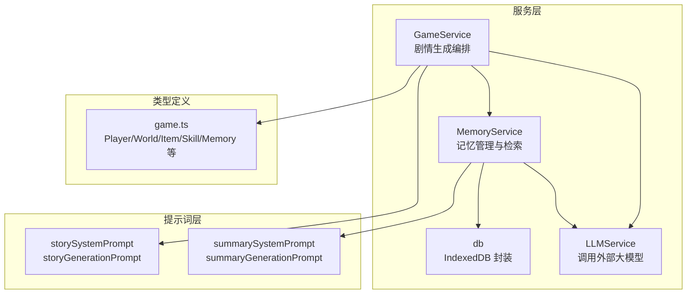
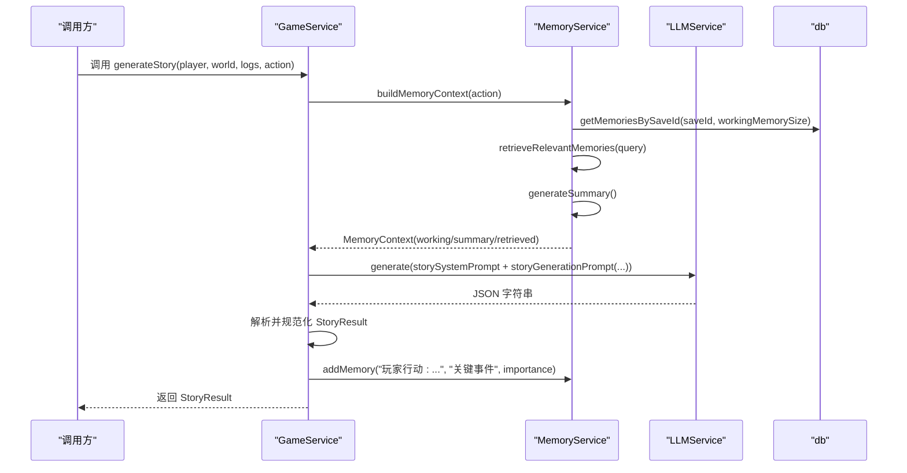
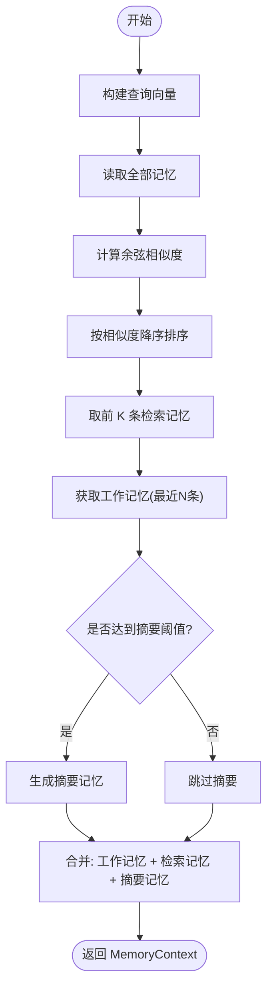
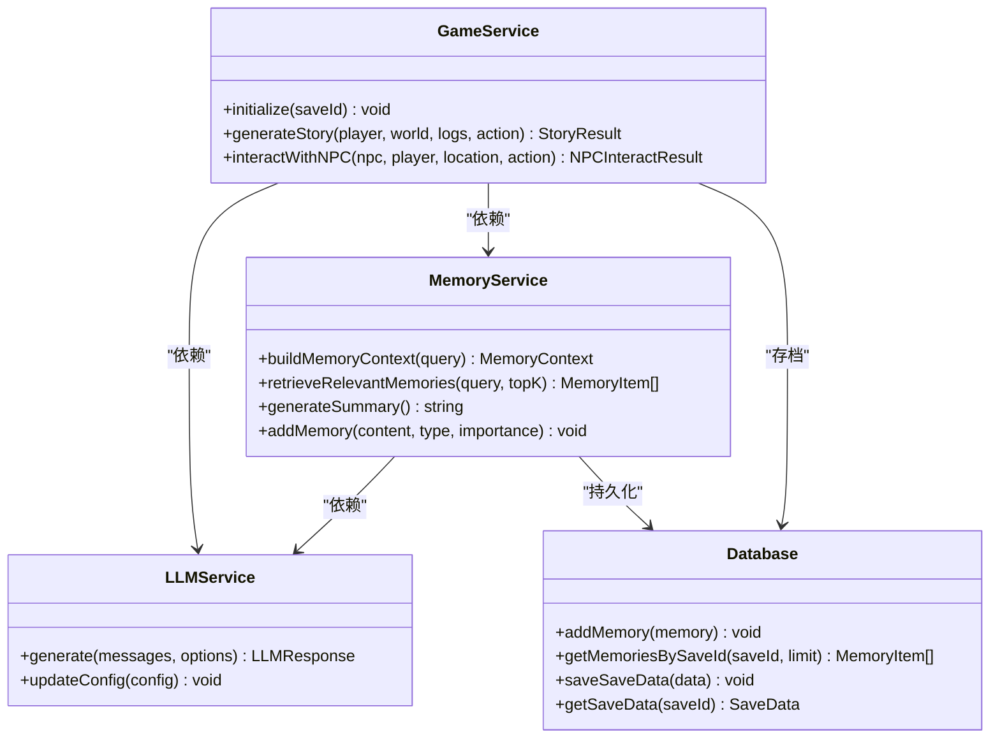
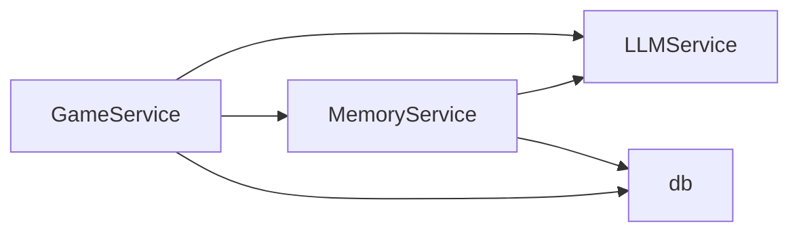

# 剧情推演引擎

<cite>
**本文引用的文件**
- [src/services/gameService.ts](file://src/services/gameService.ts)
- [src/services/memoryService.ts](file://src/services/memoryService.ts)
- [src/services/llmService.ts](file://src/services/llmService.ts)
- [src/services/db.ts](file://src/services/db.ts)
- [src/prompts/story.ts](file://src/prompts/story.ts)
- [src/prompts/summary.ts](file://src/prompts/summary.ts)
- [src/types/game.ts](file://src/types/game.ts)
- [README.md](file://README.md)
</cite>

## 目录
1. [简介](#简介)
2. [项目结构](#项目结构)
3. [核心组件](#核心组件)
4. [架构总览](#架构总览)
5. [详细组件分析](#详细组件分析)
6. [依赖关系分析](#依赖关系分析)
7. [性能考量](#性能考量)
8. [故障排查指南](#故障排查指南)
9. [结论](#结论)
10. [附录](#附录)

## 简介
本文件面向“剧情推演引擎”的使用者与开发者，系统性阐述 generateStory() 方法的算法设计与实现细节，覆盖玩家状态信息构建、世界环境描述整合、记忆上下文检索机制，以及从用户行动输入到完整剧情输出的全流程。同时文档化 StoryResult 结构的字段语义，解释记忆服务在剧情生成中的作用（摘要记忆与检索记忆的融合策略），并提供 generateStory() 的参数说明、返回值格式、错误处理机制、使用示例与常见问题解决方案。

## 项目结构
本项目采用前端纯代码架构，核心服务集中在 src/services 下，围绕 LLM 驱动的剧情生成展开：
- 服务层：LLMService、MemoryService、GameService、数据库封装 db
- 提示词层：story.ts、summary.ts
- 类型定义：game.ts
- 文档与入口：README.md

图表来源
- [src/services/gameService.ts](file://src/services/gameService.ts#L50-L391)
- [src/services/memoryService.ts](file://src/services/memoryService.ts#L16-L220)
- [src/services/llmService.ts](file://src/services/llmService.ts#L18-L101)
- [src/services/db.ts](file://src/services/db.ts#L36-L235)
- [src/prompts/story.ts](file://src/prompts/story.ts#L1-L147)
- [src/prompts/summary.ts](file://src/prompts/summary.ts#L1-L26)
- [src/types/game.ts](file://src/types/game.ts#L110-L251)

章节来源
- [README.md](file://README.md#L77-L97)

## 核心组件
- GameService：负责组织剧情生成流程，构建上下文，调用 LLM，解析并规范化 StoryResult，记录关键事件到记忆。
- MemoryService：负责记忆的增删查、嵌入向量计算、相似度检索、摘要生成与上下文组装。
- LLMService：统一的 LLM 调用封装，支持重试、温度与响应格式控制。
- db：IndexedDB 封装，提供存档、记忆持久化能力。
- 提示词：storySystemPrompt、storyGenerationPrompt、summarySystemPrompt、summaryGenerationPrompt。

章节来源
- [src/services/gameService.ts](file://src/services/gameService.ts#L50-L391)
- [src/services/memoryService.ts](file://src/services/memoryService.ts#L16-L220)
- [src/services/llmService.ts](file://src/services/llmService.ts#L18-L101)
- [src/services/db.ts](file://src/services/db.ts#L36-L235)
- [src/prompts/story.ts](file://src/prompts/story.ts#L1-L147)
- [src/prompts/summary.ts](file://src/prompts/summary.ts#L1-L26)
- [src/types/game.ts](file://src/types/game.ts#L110-L251)

## 架构总览
generateStory() 的核心流程如下：
- 输入：玩家对象、世界状态、近期日志、本次行动
- 上下文构建：从 MemoryService 获取工作记忆、检索相关记忆、生成摘要记忆
- LLM 调用：使用 storySystemPrompt + storyGenerationPrompt 生成剧情
- 结果解析：规范化 StoryResult，记录关键事件到记忆
- 输出：StoryResult

图表来源
- [src/services/gameService.ts](file://src/services/gameService.ts#L283-L391)
- [src/services/memoryService.ts](file://src/services/memoryService.ts#L175-L188)
- [src/services/llmService.ts](file://src/services/llmService.ts#L29-L55)
- [src/services/db.ts](file://src/services/db.ts#L175-L189)

## 详细组件分析

### generateStory() 方法详解
- 参数
  - player: 玩家对象，包含姓名、境界、修为、寿命、气血、真气、属性、天赋、背景等
  - world: 世界状态，包含当前位置、时间、描述
  - logs: 近期游戏日志数组
  - action: 玩家本次行动字符串
- 流程
  1) 初始化校验：确保 MemoryService 已初始化
  2) 构建记忆上下文：工作记忆、检索记忆、摘要记忆
  3) 组装上下文字符串：玩家信息、世界信息、最近日志、摘要记忆、检索记忆
  4) LLM 调用：system + user 提示词，期望 JSON 响应
  5) 规范化结果：填充默认值，保证字段完整性
  6) 记录关键事件：将本次行动与结果写入记忆库
  7) 返回 StoryResult
- 错误处理
  - 未初始化：抛出错误
  - LLM 调用失败：重试最多 3 次，最终失败抛错
  - JSON 解析失败：捕获异常并记录错误
- 性能要点
  - 并行构建记忆上下文（工作记忆、检索记忆、摘要记忆）
  - 限制检索记忆数量（默认 topK=5）
  - 仅在摘要阈值满足时生成摘要，避免频繁摘要

章节来源
- [src/services/gameService.ts](file://src/services/gameService.ts#L283-L391)
- [src/services/memoryService.ts](file://src/services/memoryService.ts#L175-L188)
- [src/services/llmService.ts](file://src/services/llmService.ts#L37-L55)

### 记忆服务与上下文融合策略
- 工作记忆：最近若干条记忆（默认 10 条），用于即时上下文
- 检索记忆：基于嵌入向量的相似度检索，返回最相关的若干条
- 摘要记忆：当旧记忆超过阈值（默认 50 条）时，生成摘要，降低上下文长度
- 融合策略：将工作记忆、检索记忆、摘要记忆拼接为最终上下文，供 LLM 使用
- 嵌入与相似度
  - 优先使用 @xenova/transformers 的特征提取模型
  - 备用方案：简单哈希向量，归一化处理
  - 余弦相似度评分并排序
- 重要性与清理
  - 重要性阈值：>=8 的记忆会被保留
  - 清理策略：保留重要记忆与最近记忆，去重后删除其余

图表来源
- [src/services/memoryService.ts](file://src/services/memoryService.ts#L121-L188)
- [src/services/db.ts](file://src/services/db.ts#L175-L189)

章节来源
- [src/services/memoryService.ts](file://src/services/memoryService.ts#L16-L220)
- [src/services/db.ts](file://src/services/db.ts#L161-L207)

### StoryResult 结构字段说明
- story: 剧情描述（修仙小说风格，可包含对话、心理活动、环境描写）
- timePassed: 时间消耗（年、月、日、时辰）
- cultivationGained: 修为增长
- spiritualEnergyGained: 精气增长
- breakthrough: 突破信息（是否发生、是否成功、新境界、新细境）
- statChanges: 属性变化（气血、真气、攻击、防御、速度、气运、根骨、悟性、寿命等）
- itemsGained: 获得物品列表
- itemsLost: 失去物品列表
- skillsGained: 新学技能列表
- skillsImproved: 提升技能列表
- npcsMet: 本次结识的 NPC 列表
- relationshipsUpdate: 关系变更映射（NPC 名称 -> 好感变化、新等级）
- events: 触发的事件描述
- suggestedActions: 基于当前剧情的后续行动建议（3-4 个）

章节来源
- [src/services/gameService.ts](file://src/services/gameService.ts#L15-L48)
- [src/types/game.ts](file://src/types/game.ts#L73-L92)
- [src/types/game.ts](file://src/types/game.ts#L173-L203)

### AI 驱动的剧情生成流程
- 提示词系统
  - storySystemPrompt：设定九霄界世界观、核心机制、叙事风格
  - storyGenerationPrompt：将玩家状态、世界状态、近期日志、检索记忆、摘要记忆与本次行动拼接为 JSON 输出约束
- LLM 调用
  - temperature 控制创意性
  - response_format 固定为 JSON，便于解析
- 结果规范化
  - 对缺失字段进行默认值填充，避免 NaN
  - 对时间、统计变化、突破信息进行类型安全转换

章节来源
- [src/prompts/story.ts](file://src/prompts/story.ts#L1-L147)
- [src/services/llmService.ts](file://src/services/llmService.ts#L29-L55)
- [src/services/gameService.ts](file://src/services/gameService.ts#L326-L372)

### 类图：核心类关系

图表来源
- [src/services/gameService.ts](file://src/services/gameService.ts#L50-L391)
- [src/services/memoryService.ts](file://src/services/memoryService.ts#L16-L220)
- [src/services/llmService.ts](file://src/services/llmService.ts#L18-L101)
- [src/services/db.ts](file://src/services/db.ts#L36-L235)

## 依赖关系分析
- 组件耦合
  - GameService 依赖 LLMService 与 MemoryService，负责编排
  - MemoryService 依赖 LLMService（摘要生成）与 db（持久化）
  - LLMService 与 db 之间无直接耦合
- 外部依赖
  - @xenova/transformers：特征提取模型（可选）
  - IndexedDB：本地持久化
- 循环依赖
  - 无循环依赖，职责清晰

图表来源
- [src/services/gameService.ts](file://src/services/gameService.ts#L50-L62)
- [src/services/memoryService.ts](file://src/services/memoryService.ts#L16-L25)
- [src/services/llmService.ts](file://src/services/llmService.ts#L18-L27)
- [src/services/db.ts](file://src/services/db.ts#L36-L72)

章节来源
- [src/services/gameService.ts](file://src/services/gameService.ts#L50-L62)
- [src/services/memoryService.ts](file://src/services/memoryService.ts#L16-L25)
- [src/services/llmService.ts](file://src/services/llmService.ts#L18-L27)
- [src/services/db.ts](file://src/services/db.ts#L36-L72)

## 性能考量
- 嵌入模型加载
  - 首次使用时异步加载 @xenova/transformers，失败时回退到简单哈希向量
- 相似度计算
  - 余弦相似度 O(N*D)，其中 N 为记忆条数，D 为向量维度
  - 建议在大量记忆场景下启用摘要记忆，减少上下文长度
- 并行化
  - 构建记忆上下文时并行执行工作记忆、检索记忆、摘要生成
- 缓存与复用
  - 嵌入模型加载一次即可复用
  - 建议在 UI 层对相同查询进行去重与缓存

[本节为通用性能建议，不直接分析特定文件]

## 故障排查指南
- generateStory() 抛出“未初始化”错误
  - 确保先调用 initialize(saveId) 初始化 MemoryService
- LLM 调用失败
  - 检查 baseURL、apiKey、model 配置
  - 查看网络请求与响应状态码
  - 确认 response_format 为 JSON
- JSON 解析失败
  - 检查 storyGenerationPrompt 的输出是否严格遵循 JSON Schema
  - 确认 LLM 返回内容可被 JSON.parse 解析
- 嵌入模型加载失败
  - 确认网络可达
  - 检查浏览器兼容性与 CSP 设置
  - 系统会自动回退到简单哈希向量
- 记忆检索为空
  - 确认 saveId 正确且记忆已写入
  - 检查检索阈值与 topK 设置

章节来源
- [src/services/gameService.ts](file://src/services/gameService.ts#L290-L292)
- [src/services/llmService.ts](file://src/services/llmService.ts#L37-L55)
- [src/services/memoryService.ts](file://src/services/memoryService.ts#L28-L37)
- [src/services/db.ts](file://src/services/db.ts#L161-L189)

## 结论
剧情推演引擎通过“玩家状态 + 世界环境 + 记忆上下文”的组合，结合 LLM 的实时生成能力，实现了高度连贯且富有变化的修仙剧情体验。MemoryService 的工作记忆、检索记忆与摘要记忆三者协同，既保证了上下文的丰富性，又控制了长度与成本。GameService 将上述能力整合为稳定的 generateStory() 接口，返回结构化的 StoryResult，便于 UI 与业务层消费。

[本节为总结性内容，不直接分析特定文件]

## 附录

### generateStory() 方法参数与返回值规范
- 参数
  - player: 玩家对象（见 Player 类型）
  - world: 世界对象（见 World 类型）
  - logs: 游戏日志数组（见 GameLog 类型）
  - action: 本次行动字符串
- 返回值
  - StoryResult（见 StoryResult 接口）
- 异常
  - 未初始化：抛出错误
  - LLM 调用失败：抛出错误（含重试信息）

章节来源
- [src/services/gameService.ts](file://src/services/gameService.ts#L283-L391)
- [src/types/game.ts](file://src/types/game.ts#L110-L251)

### 使用示例（步骤说明）
- 初始化
  - 创建 LLMService 并配置 baseURL、apiKey、model
  - 创建 GameService 并调用 initialize(saveId)
- 生成剧情
  - 准备 player、world、logs、action
  - 调用 generateStory(...) 获取 StoryResult
  - 在 UI 中展示 story、timePassed、statChanges、itemsGained、suggestedActions 等
- 记录与扩展
  - 可将关键事件写入记忆库，参与后续检索
  - 可根据 suggestedActions 生成下一步交互按钮

章节来源
- [src/services/gameService.ts](file://src/services/gameService.ts#L59-L62)
- [src/services/gameService.ts](file://src/services/gameService.ts#L283-L391)

### 常见问题与解决方案
- 为什么剧情缺乏连贯性？
  - 确保 logs 包含近期关键事件，MemoryService 会将其纳入上下文
  - 合理设置检索 topK 与摘要阈值
- 为什么响应格式不符合预期？
  - 确保 storyGenerationPrompt 的输出严格遵循 JSON Schema
  - 检查 response_format 与 temperature 设置
- 为什么检索不到相关记忆？
  - 确认 addMemory 已正确写入
  - 检查 saveId 是否一致

章节来源
- [src/prompts/story.ts](file://src/prompts/story.ts#L69-L146)
- [src/services/memoryService.ts](file://src/services/memoryService.ts#L121-L137)
- [src/services/db.ts](file://src/services/db.ts#L161-L189)