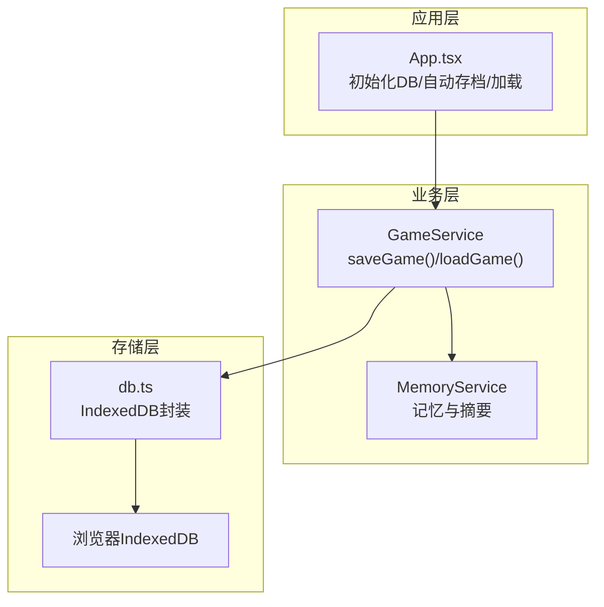
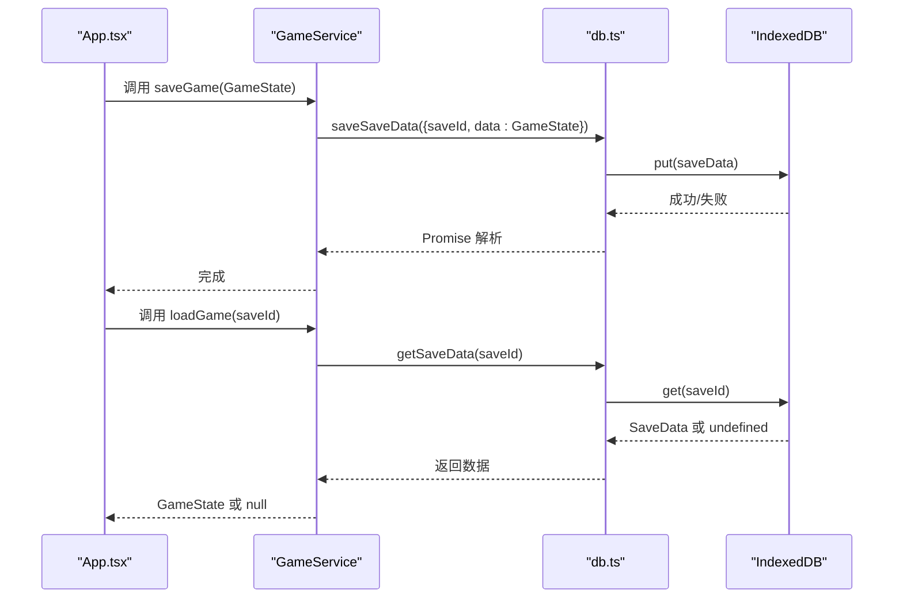
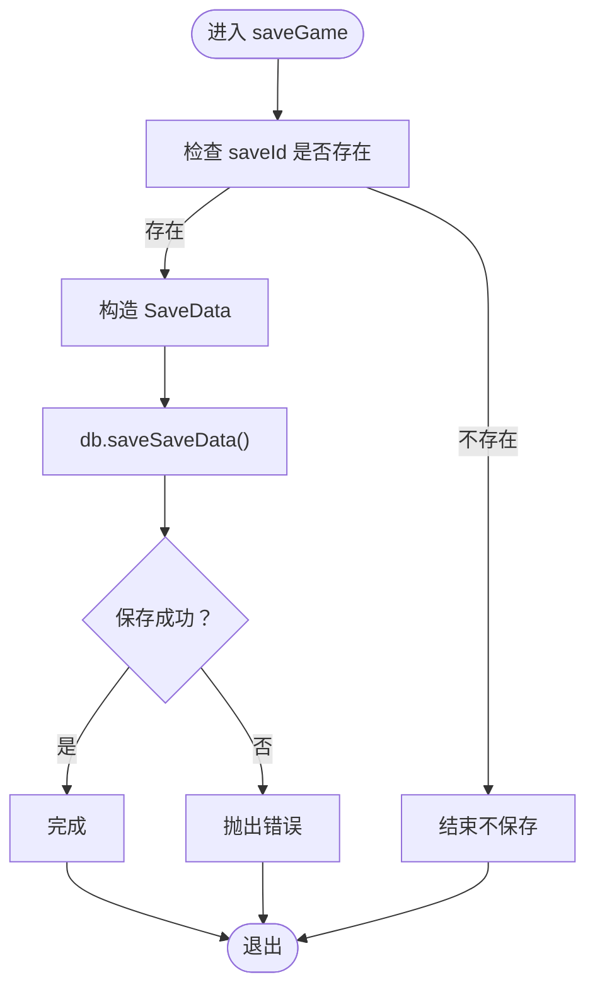
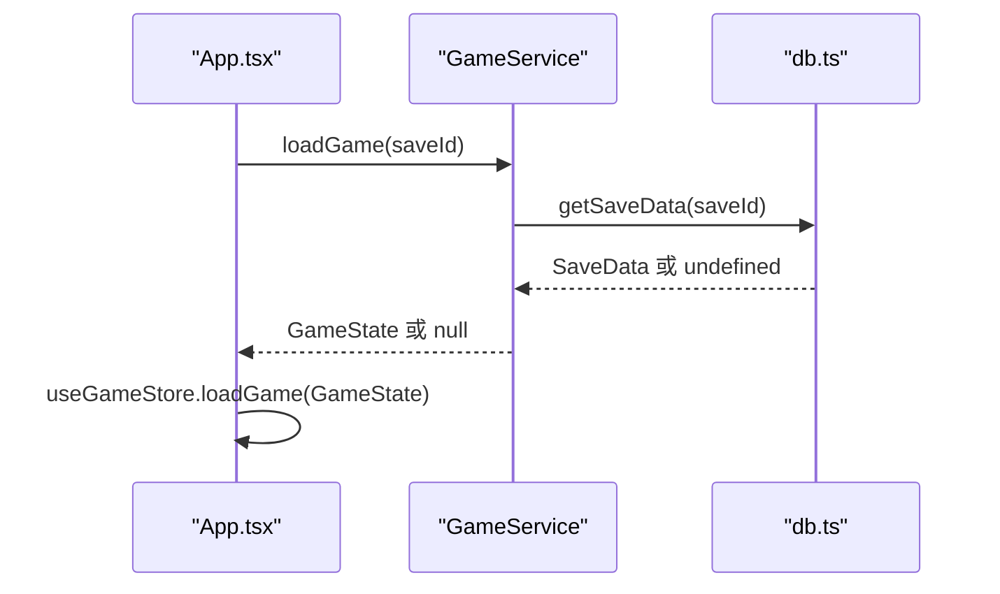
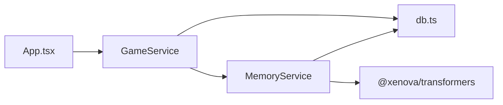
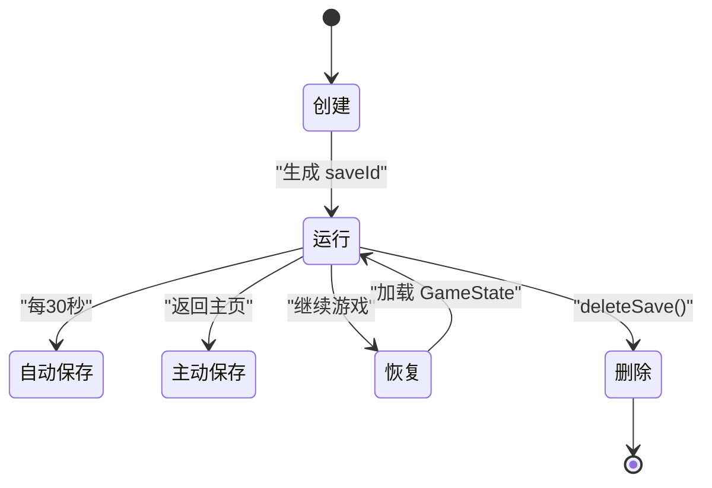

# 数据持久化

<cite>
**本文引用的文件**
- [src/services/db.ts](file://src/services/db.ts)
- [src/services/gameService.ts](file://src/services/gameService.ts)
- [src/stores/useGameStore.ts](file://src/stores/useGameStore.ts)
- [src/App.tsx](file://src/App.tsx)
- [src/services/memoryService.ts](file://src/services/memoryService.ts)
- [src/types/game.ts](file://src/types/game.ts)
- [src/stores/useSettingsStore.ts](file://src/stores/useSettingsStore.ts)
</cite>

## 目录
1. [简介](#简介)
2. [项目结构](#项目结构)
3. [核心组件](#核心组件)
4. [架构总览](#架构总览)
5. [详细组件分析](#详细组件分析)
6. [依赖分析](#依赖分析)
7. [性能考虑](#性能考虑)
8. [故障排查指南](#故障排查指南)
9. [结论](#结论)
10. [附录](#附录)

## 简介
本文件聚焦于“数据持久化”主题，围绕游戏存档的创建、保存、加载与生命周期管理进行系统化说明。重点覆盖以下内容：
- saveGame() 与 loadGame() 的实现原理与调用链
- GameState 数据结构与各字段语义
- IndexedDB 存储机制与数据模型设计
- 数据恢复流程与错误处理
- 最佳实践：数据压缩、版本兼容与迁移策略
- 生命周期管理：从创建到删除的全流程
- 性能优化：增量保存、批量操作、错误恢复
- 实战示例与常见问题解答

## 项目结构
数据持久化涉及三层协作：
- 应用层：App.tsx 负责初始化数据库、触发自动存档与加载流程
- 业务层：GameService 提供 saveGame()/loadGame() 与业务逻辑编排
- 存储层：db.ts 封装 IndexedDB 的 CRUD 操作与索引管理

图表来源
- [src/App.tsx](file://src/App.tsx#L62-L122)
- [src/services/gameService.ts](file://src/services/gameService.ts#L394-L409)
- [src/services/db.ts](file://src/services/db.ts#L39-L72)

章节来源
- [src/App.tsx](file://src/App.tsx#L62-L122)
- [src/services/gameService.ts](file://src/services/gameService.ts#L394-L409)
- [src/services/db.ts](file://src/services/db.ts#L39-L72)

## 核心组件
- IndexedDB 数据库与对象存储
  - 数据库名称与版本常量定义
  - 对象存储：saves、saveData、memories
  - 索引：saves 的 timestamp；memories 的 saveId、timestamp、importance
- 数据模型
  - SaveMeta：存档元数据（id、name、timestamp、playerLevel、realm、summary）
  - SaveData：存档数据（saveId、data: GameState）
  - MemoryItem：记忆项（id、saveId、type、content、embedding、timestamp、importance）
- 存储接口
  - addSave/updateSave/getSave/getAllSaves/deleteSave
  - saveSaveData/getSaveData/deleteSaveData
  - addMemory/addMemories/getMemoriesBySaveId/getMemoriesByImportance/deleteMemoriesBySaveId
- 业务服务
  - GameService.saveGame()/loadGame()：将 GameState 序列化写入 IndexedDB
  - MemoryService：记忆嵌入、检索、摘要生成与清理

章节来源
- [src/services/db.ts](file://src/services/db.ts#L3-L34)
- [src/services/db.ts](file://src/services/db.ts#L85-L159)
- [src/services/db.ts](file://src/services/db.ts#L161-L225)
- [src/services/gameService.ts](file://src/services/gameService.ts#L394-L409)
- [src/services/memoryService.ts](file://src/services/memoryService.ts#L16-L25)

## 架构总览
下图展示 saveGame() 与 loadGame() 在系统中的调用路径与数据流。

图表来源
- [src/App.tsx](file://src/App.tsx#L75-L105)
- [src/services/gameService.ts](file://src/services/gameService.ts#L394-L409)
- [src/services/db.ts](file://src/services/db.ts#L134-L150)

## 详细组件分析

### 1) GameState 数据结构详解
GameState 是存档的核心载体，包含玩家状态、世界信息、日志、事件、记忆、回合数与交互状态等。字段语义如下：
- player: Player | null —— 当前玩家信息
- npcs: NPC[] —— 当前世界中的 NPC 列表
- world: World | null —— 当前世界状态
- logs: GameLog[] —— 游戏日志队列
- events: Event[] —— 事件队列
- memories: Memory[] —— 记忆片段
- memorySummary: string —— 记忆摘要
- turn: number —— 回合计数
- isPlaying/isLoading: boolean —— 游戏运行与加载状态
- error: string | null —— 错误信息
- selectedNPCId: string | null —— 当前选中的 NPC
- isNPCInteracting: boolean —— 是否处于 NPC 交互模式

章节来源
- [src/types/game.ts](file://src/types/game.ts#L235-L251)

### 2) IndexedDB 存储模型
数据库与对象存储设计：
- 数据库名称与版本：统一管理，便于升级
- 对象存储：
  - saves：存档元数据，keyPath=id，索引 timestamp
  - saveData：存档数据，keyPath=saveId
  - memories：记忆片段，keyPath=id，索引 saveId、timestamp、importance
- 事务与并发：通过事务模式 readwrite/readonly 控制读写一致性

章节来源
- [src/services/db.ts](file://src/services/db.ts#L3-L10)
- [src/services/db.ts](file://src/services/db.ts#L52-L70)
- [src/services/db.ts](file://src/services/db.ts#L74-L83)

### 3) saveGame() 实现原理
- 输入：GameState
- 流程：
  1) 构造 SaveData：{ saveId, data: GameState }
  2) 调用 db.saveSaveData() 执行 IndexedDB put 操作
  3) 异常处理：捕获并抛出错误
- 触发点：应用层定时自动存档与返回主页时的主动保存

图表来源
- [src/services/gameService.ts](file://src/services/gameService.ts#L394-L403)
- [src/services/db.ts](file://src/services/db.ts#L134-L141)

章节来源
- [src/services/gameService.ts](file://src/services/gameService.ts#L394-L403)
- [src/App.tsx](file://src/App.tsx#L75-L105)

### 4) loadGame() 实现原理
- 输入：saveId
- 流程：
  1) 调用 db.getSaveData(saveId)
  2) 返回 SaveData.data 或 null
  3) 应用层将 GameState 注入到 useGameStore
- 错误处理：捕获异常并提示加载失败

图表来源
- [src/services/gameService.ts](file://src/services/gameService.ts#L406-L409)
- [src/services/db.ts](file://src/services/db.ts#L143-L150)
- [src/App.tsx](file://src/App.tsx#L131-L161)

章节来源
- [src/services/gameService.ts](file://src/services/gameService.ts#L406-L409)
- [src/App.tsx](file://src/App.tsx#L131-L161)

### 5) 数据序列化与存储
- 序列化方式：直接将 GameState 对象写入 IndexedDB（非字符串化 JSON），由 IndexedDB 自身处理序列化
- 存储位置：
  - saveData：按 saveId 作为主键存储 GameState
  - memories：按 id 存储 MemoryItem，同时通过索引按 saveId 查询
- 注意事项：
  - 由于直接存储对象，需确保对象结构稳定
  - 如需跨版本兼容，应采用版本号字段与迁移策略

章节来源
- [src/services/db.ts](file://src/services/db.ts#L21-L24)
- [src/services/db.ts](file://src/services/db.ts#L134-L150)
- [src/services/db.ts](file://src/services/db.ts#L161-L168)

### 6) 数据恢复流程
- 继续游戏时：
  1) 从 useGameStore 读取 saveId
  2) 调用 db.getSaveData(saveId) 获取 GameState
  3) 使用 useGameStore.loadGame() 将 GameState 注入状态
  4) 初始化 GameService 并进入游戏
- 错误处理：捕获异常并提示用户

章节来源
- [src/App.tsx](file://src/App.tsx#L131-L161)
- [src/stores/useGameStore.ts](file://src/stores/useGameStore.ts#L189-L189)

### 7) 记忆系统与存档关联
- MemoryService 为每个存档维护独立的记忆空间（通过 saveId 关联）
- 记忆嵌入：支持特征提取与哈希嵌入两种方案
- 记忆检索：基于余弦相似度检索相关记忆
- 摘要生成：当记忆数量超过阈值时生成摘要，减少检索成本

章节来源
- [src/services/memoryService.ts](file://src/services/memoryService.ts#L16-L25)
- [src/services/memoryService.ts](file://src/services/memoryService.ts#L84-L98)
- [src/services/memoryService.ts](file://src/services/memoryService.ts#L122-L137)
- [src/services/memoryService.ts](file://src/services/memoryService.ts#L145-L173)

### 8) 自动存档与手动保存
- 自动存档：每 30 秒触发一次，保存当前 GameState
- 主动保存：返回主页时触发
- 触发条件：仅当 player 与 saveId 均存在时执行

章节来源
- [src/App.tsx](file://src/App.tsx#L75-L122)

## 依赖分析
- 组件耦合
  - App.tsx 依赖 db.ts 初始化与存取
  - GameService 依赖 db.ts 与 MemoryService
  - MemoryService 依赖 db.ts 与 LLMService
- 外部依赖
  - IndexedDB：浏览器内置
  - @xenova/transformers：用于嵌入向量生成（可降级为哈希向量）

图表来源
- [src/App.tsx](file://src/App.tsx#L67-L72)
- [src/services/gameService.ts](file://src/services/gameService.ts#L55-L62)
- [src/services/memoryService.ts](file://src/services/memoryService.ts#L32-L36)

章节来源
- [src/App.tsx](file://src/App.tsx#L67-L72)
- [src/services/gameService.ts](file://src/services/gameService.ts#L55-L62)
- [src/services/memoryService.ts](file://src/services/memoryService.ts#L32-L36)

## 性能考虑
- 增量保存
  - 当前实现为全量保存 GameState，建议改为：
    - 仅保存变更字段（diff），减少写入体积
    - 使用 useGameStore 的部分状态序列化（已实现）
- 批量操作
  - 批量添加记忆：addMemories() 已使用 Promise.all 并发处理
- 错误恢复
  - IndexedDB 操作失败时，记录错误并提示用户
  - 自动重试与降级策略：如嵌入模型加载失败时使用哈希向量
- 存储容量
  - 记忆数量增长时，定期清理低重要性记忆，保留最近与高重要性记忆
- 版本兼容
  - 为 GameState 引入版本号字段，迁移时按版本映射字段

章节来源
- [src/stores/useGameStore.ts](file://src/stores/useGameStore.ts#L207-L224)
- [src/services/db.ts](file://src/services/db.ts#L170-L173)
- [src/services/memoryService.ts](file://src/services/memoryService.ts#L197-L215)

## 故障排查指南
- IndexedDB 打开失败
  - 现象：初始化时报错
  - 处理：检查浏览器兼容性与权限，重试初始化
- 获取存档失败/保存失败
  - 现象：getSaveData/saveSaveData 抛出错误
  - 处理：确认 db.init() 已完成，检查对象存储是否存在
- 加载存档为空
  - 现象：loadGame 返回 null
  - 处理：确认 saveId 正确，检查 IndexedDB 中是否存在对应记录
- 嵌入模型加载失败
  - 现象：generateEmbedding 使用哈希向量降级
  - 处理：检查网络与依赖安装，或等待离线模式

章节来源
- [src/services/db.ts](file://src/services/db.ts#L43-L45)
- [src/services/db.ts](file://src/services/db.ts#L108-L109)
- [src/services/db.ts](file://src/services/db.ts#L139-L140)
- [src/services/memoryService.ts](file://src/services/memoryService.ts#L34-L36)

## 结论
本项目采用 IndexedDB 作为本地持久化方案，结合 Zustand 的本地存储中间件与自定义的自动存档机制，实现了较为完善的存档能力。GameState 作为统一的数据载体，通过 GameService 的 saveGame()/loadGame() 与 db.ts 的 IndexedDB 封装完成数据的序列化与落盘。记忆系统进一步增强了数据的可检索性与可维护性。未来可在增量保存、版本迁移、批量操作与错误恢复方面继续优化，以提升性能与稳定性。

## 附录

### A. 存档生命周期管理
- 创建：选择角色后生成新的 saveId，并初始化 GameService
- 运行：每 30 秒自动保存，或返回主页时主动保存
- 恢复：继续游戏时按 saveId 从 IndexedDB 读取 GameState 并注入状态
- 删除：deleteSave() 同时清理 saveData 与该存档下的所有记忆

图表来源
- [src/App.tsx](file://src/App.tsx#L172-L188)
- [src/App.tsx](file://src/App.tsx#L131-L161)
- [src/services/db.ts](file://src/services/db.ts#L121-L132)

### B. 数据压缩与版本兼容建议
- 数据压缩
  - 对大字段（如 logs、memories）进行分页或压缩存储
  - 使用二进制或紧凑序列化格式（如 Protobuf）替代 JSON
- 版本兼容
  - 在 GameState 中增加 version 字段
  - 提供迁移函数：按版本映射字段，补齐缺失字段
  - 升级时先迁移再写入，保证一致性
- 迁移策略
  - 新增字段：提供默认值
  - 删除字段：在迁移时丢弃
  - 字段重命名：映射到新字段名

### C. 存档示例与最佳实践清单
- 示例
  - 自动存档：每 30 秒保存一次 GameState
  - 主动存档：返回主页时保存
  - 加载存档：按 saveId 读取并注入状态
- 最佳实践
  - 仅保存必要字段，避免冗余
  - 使用索引加速查询（如按 saveId、timestamp）
  - 定期清理低价值记忆，保持数据库健康
  - 为 GameState 引入版本号与迁移函数
  - 对关键操作增加重试与降级策略