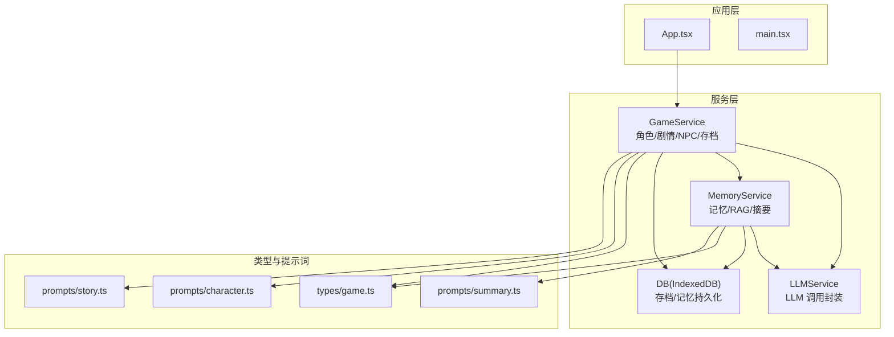
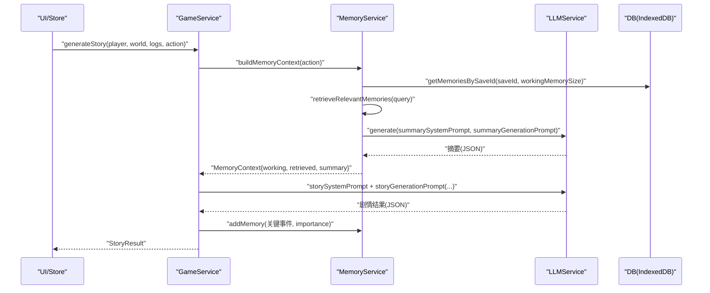
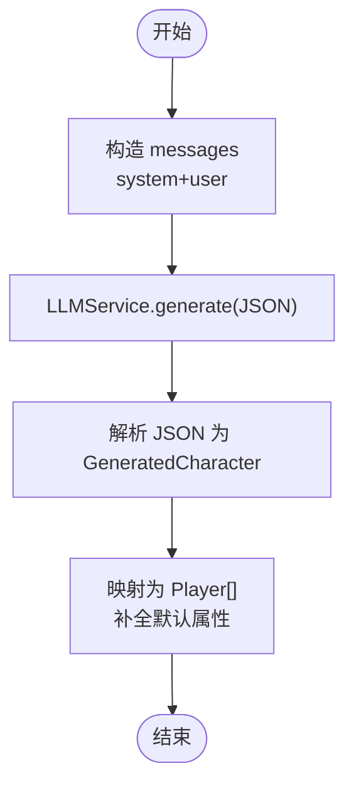
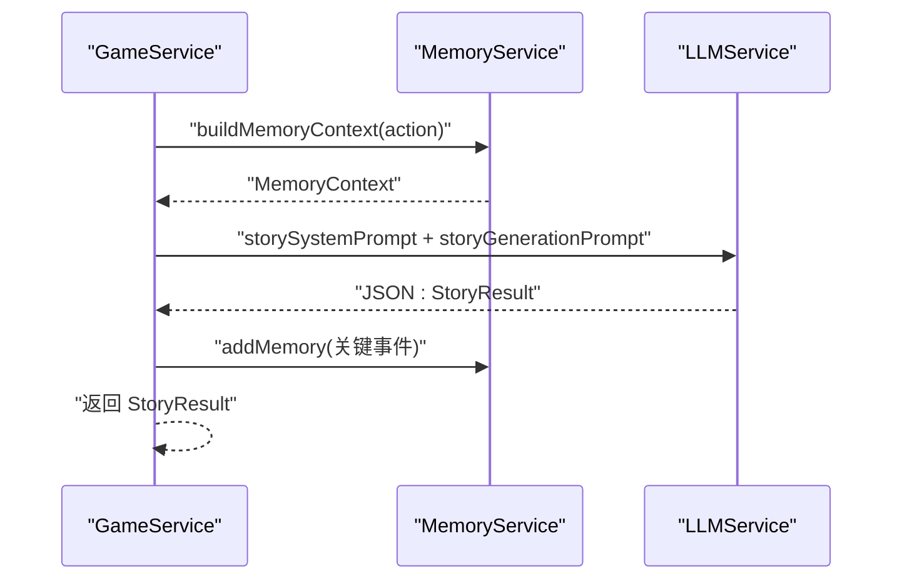
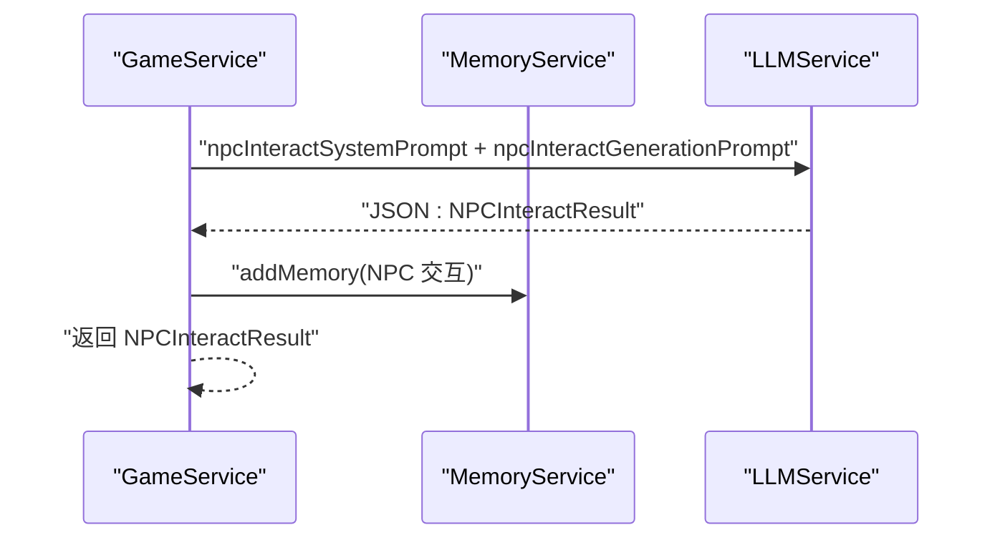
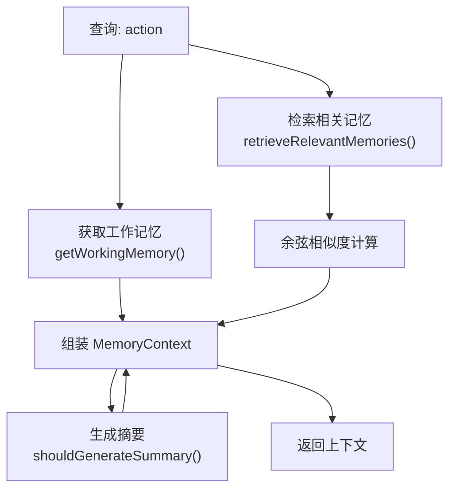
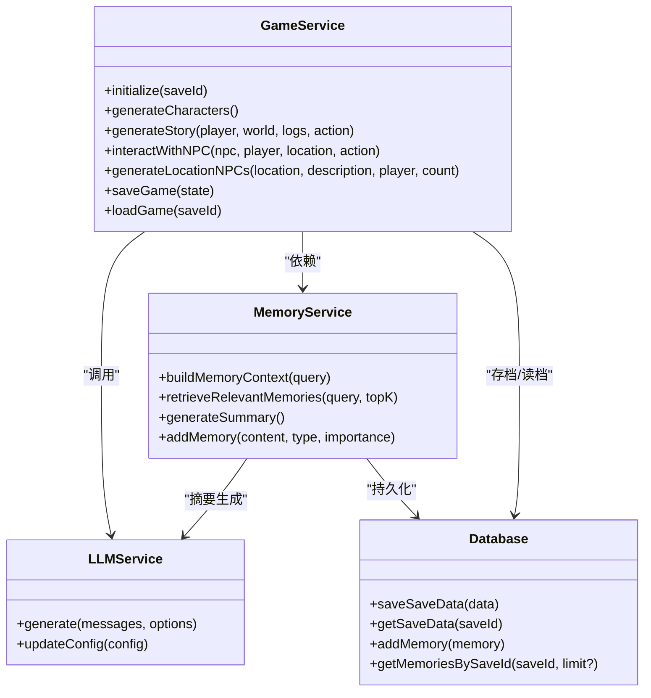

# 游戏引擎服务

<cite>
**本文引用的文件**
- [gameService.ts](file://src/services/gameService.ts)
- [llmService.ts](file://src/services/llmService.ts)
- [memoryService.ts](file://src/services/memoryService.ts)
- [db.ts](file://src/services/db.ts)
- [character.ts](file://src/prompts/character.ts)
- [story.ts](file://src/prompts/story.ts)
- [summary.ts](file://src/prompts/summary.ts)
- [game.ts](file://src/types/game.ts)
- [App.tsx](file://src/App.tsx)
- [main.tsx](file://src/main.tsx)
- [package.json](file://package.json)
</cite>

## 目录
1. [简介](#简介)
2. [项目结构](#项目结构)
3. [核心组件](#核心组件)
4. [架构总览](#架构总览)
5. [详细组件分析](#详细组件分析)
6. [依赖关系分析](#依赖关系分析)
7. [性能考量](#性能考量)
8. [故障排查指南](#故障排查指南)
9. [结论](#结论)
10. [附录](#附录)

## 简介
本文件面向 GameService 游戏引擎服务，系统化阐述其在“修仙 roguelike”项目中的职责与实现细节。重点覆盖：
- 角色生成系统：从 LLM 推导角色，补全默认属性与初始状态
- 剧情推演引擎：结合玩家状态、世界信息与记忆上下文，输出剧情结果
- NPC 交互机制：对话、互动选项、关系变化与时间推进
- 时间管理系统：基于“时辰”维度的时间推进与寿元消耗
- AI 驱动的内容生成：从角色创建到剧情发展的完整工作流
- 内存上下文构建与 RAG 检索：工作记忆、摘要记忆与相似度检索
- 角色属性面板生成算法、随机名字生成器、性格/出身/背景选项生成
- 与 LLMService、MemoryService 的协作关系与接口说明
- 使用示例与最佳实践

## 项目结构
项目采用前端单页应用架构，服务层位于 src/services，类型定义在 src/types，提示词在 src/prompts，入口在 src/main.tsx 与 src/App.tsx。

图表来源
- [App.tsx](file://src/App.tsx#L67-L72)
- [gameService.ts](file://src/services/gameService.ts#L50-L62)
- [llmService.ts](file://src/services/llmService.ts#L18-L27)
- [memoryService.ts](file://src/services/memoryService.ts#L16-L25)
- [db.ts](file://src/services/db.ts#L36-L72)
- [game.ts](file://src/types/game.ts#L110-L251)
- [character.ts](file://src/prompts/character.ts#L1-L97)
- [story.ts](file://src/prompts/story.ts#L1-L147)
- [summary.ts](file://src/prompts/summary.ts#L1-L26)

章节来源
- [main.tsx](file://src/main.tsx#L1-L11)
- [App.tsx](file://src/App.tsx#L1-L200)
- [gameService.ts](file://src/services/gameService.ts#L1-L541)
- [llmService.ts](file://src/services/llmService.ts#L1-L101)
- [memoryService.ts](file://src/services/memoryService.ts#L1-L224)
- [db.ts](file://src/services/db.ts#L1-L236)
- [game.ts](file://src/types/game.ts#L1-L319)
- [character.ts](file://src/prompts/character.ts#L1-L97)
- [story.ts](file://src/prompts/story.ts#L1-L147)
- [summary.ts](file://src/prompts/summary.ts#L1-L26)

## 核心组件
- GameService：游戏引擎核心，负责角色生成、剧情推演、NPC 交互、区域 NPC 生成、存档/读档与记忆记录
- LLMService：统一的 LLM 调用封装，支持重试、温度、响应格式与 token 使用统计
- MemoryService：记忆管理与 RAG 检索，支持嵌入向量、相似度检索、摘要生成与工作记忆
- DB：IndexedDB 封装，提供存档、存档数据与记忆的 CRUD 操作
- 类型系统：定义角色、NPC、世界、时间、物品、技能、关系、记忆等核心数据结构
- 提示词：角色生成、剧情推演、NPC 交互、记忆摘要等系统提示与用户提示

章节来源
- [gameService.ts](file://src/services/gameService.ts#L50-L62)
- [llmService.ts](file://src/services/llmService.ts#L18-L55)
- [memoryService.ts](file://src/services/memoryService.ts#L16-L25)
- [db.ts](file://src/services/db.ts#L36-L72)
- [game.ts](file://src/types/game.ts#L110-L251)

## 架构总览
GameService 通过 LLMService 发起 AI 推演，借助 MemoryService 构建记忆上下文（工作记忆 + 相关检索 + 摘要记忆），并将关键事件写入 MemoryService 以供后续检索。DB 负责本地持久化存档与记忆。

图表来源
- [gameService.ts](file://src/services/gameService.ts#L283-L391)
- [memoryService.ts](file://src/services/memoryService.ts#L175-L188)
- [llmService.ts](file://src/services/llmService.ts#L29-L55)
- [db.ts](file://src/services/db.ts#L175-L189)

## 详细组件分析

### 角色生成系统
- 输入：系统提示词与生成提示词
- 流程：构造 messages，调用 LLMService，解析 JSON，补全默认属性与初始状态
- 输出：Player 数组（含 id、成长历史、技能、关系、库存等）

图表来源
- [gameService.ts](file://src/services/gameService.ts#L75-L119)
- [character.ts](file://src/prompts/character.ts#L1-L97)

章节来源
- [gameService.ts](file://src/services/gameService.ts#L75-L119)
- [character.ts](file://src/prompts/character.ts#L1-L97)

### 剧情推演引擎
- 输入：玩家状态、世界状态、近期日志、动作
- 上下文：工作记忆、检索记忆、摘要记忆
- 输出：剧情描述、时间流逝、修为/灵气增长、突破信息、属性变化、物品/技能变更、NPC 结识、关系更新、事件与建议行动

图表来源
- [gameService.ts](file://src/services/gameService.ts#L283-L391)
- [memoryService.ts](file://src/services/memoryService.ts#L175-L188)
- [story.ts](file://src/prompts/story.ts#L51-L147)

章节来源
- [gameService.ts](file://src/services/gameService.ts#L283-L391)
- [story.ts](file://src/prompts/story.ts#L1-L147)

### NPC 交互机制
- 输入：NPC、玩家、当前地点、动作
- 输出：对话、可选互动、NPC 状态变化（好感度、记忆标签、关系描述）、玩家状态变化、时间流逝、剧情更新

图表来源
- [gameService.ts](file://src/services/gameService.ts#L415-L469)

章节来源
- [gameService.ts](file://src/services/gameService.ts#L415-L469)

### 区域 NPC 生成
- 输入：地点、地点描述、玩家、数量
- 输出：NPC 列表（含 id、头像、身份、好感度、记忆标签等）

章节来源
- [gameService.ts](file://src/services/gameService.ts#L471-L537)

### 时间管理系统
- 时间结构：年、月、日、时辰
- 使用场景：剧情推演与 NPC 交互返回的时间流逝，寿元消耗与年龄增长

章节来源
- [game.ts](file://src/types/game.ts#L50-L55)
- [gameService.ts](file://src/services/gameService.ts#L349-L354)
- [gameService.ts](file://src/services/gameService.ts#L457-L458)

### 内存上下文构建与 RAG 检索
- 工作记忆：最近若干条记忆
- 相关检索：基于嵌入向量的余弦相似度检索
- 摘要记忆：超过阈值后由 LLM 生成摘要
- 记忆重要性：基于关键词规则计算

图表来源
- [memoryService.ts](file://src/services/memoryService.ts#L175-L188)
- [memoryService.ts](file://src/services/memoryService.ts#L121-L137)
- [memoryService.ts](file://src/services/memoryService.ts#L144-L173)

章节来源
- [memoryService.ts](file://src/services/memoryService.ts#L1-L224)
- [db.ts](file://src/services/db.ts#L175-L207)

### 角色属性面板生成算法
- 模板池：12 种职业模板，每种带基础加成与描述
- 随机扰动：每项属性在模板基础上进行小范围随机
- 输出：3 组属性面板（label/desc/各项属性）

章节来源
- [gameService.ts](file://src/services/gameService.ts#L121-L160)

### 随机名字生成器
- 姓氏池与名字池
- 随机组合为完整姓名

章节来源
- [gameService.ts](file://src/services/gameService.ts#L162-L202)

### 性格/出身/背景选项生成
- 输入：玩家姓名
- 输出：6 个性别/头像/描述、6 出身标签/描述、6 背景标签/故事
- 通过 LLM 生成并解析 JSON

章节来源
- [gameService.ts](file://src/services/gameService.ts#L204-L252)

### 初始天赋选项生成
- 输入：姓名、出身、背景
- 输出：6 个初始天赋（name/desc/type）

章节来源
- [gameService.ts](file://src/services/gameService.ts#L254-L281)

### 存档/读档
- 保存：将 GameState 序列化为 SaveData 写入 IndexedDB
- 读取：按 saveId 获取并恢复 GameState

章节来源
- [gameService.ts](file://src/services/gameService.ts#L393-L409)
- [db.ts](file://src/services/db.ts#L134-L150)

## 依赖关系分析

图表来源
- [gameService.ts](file://src/services/gameService.ts#L50-L62)
- [llmService.ts](file://src/services/llmService.ts#L18-L55)
- [memoryService.ts](file://src/services/memoryService.ts#L16-L25)
- [db.ts](file://src/services/db.ts#L36-L72)

章节来源
- [gameService.ts](file://src/services/gameService.ts#L50-L62)
- [llmService.ts](file://src/services/llmService.ts#L18-L55)
- [memoryService.ts](file://src/services/memoryService.ts#L16-L25)
- [db.ts](file://src/services/db.ts#L36-L72)

## 性能考量
- LLM 调用重试：最大重试次数与指数退避，降低网络波动影响
- 嵌入向量：优先使用 transformers 库的特征提取，失败时回退到简单哈希向量
- 相似度计算：余弦相似度，topK 控制检索规模
- 摘要生成：仅在记忆数量超过阈值时触发，避免频繁摘要
- 工作记忆：限制最近记忆条数，减少上下文长度
- IndexedDB：批量操作与索引优化，按 saveId 查询与排序

章节来源
- [llmService.ts](file://src/services/llmService.ts#L37-L55)
- [memoryService.ts](file://src/services/memoryService.ts#L27-L37)
- [memoryService.ts](file://src/services/memoryService.ts#L121-L137)
- [memoryService.ts](file://src/services/memoryService.ts#L144-L173)
- [memoryService.ts](file://src/services/memoryService.ts#L139-L142)
- [db.ts](file://src/services/db.ts#L175-L207)

## 故障排查指南
- LLM 调用失败：检查 baseURL、apiKey、model 配置；查看重试日志与错误信息
- IndexedDB 初始化失败：确认浏览器支持与权限；检查 onupgradeneeded 回调
- 嵌入模型加载失败：@xenova/transformers 依赖不可用时会回退到哈希向量
- 记忆检索为空：确认 saveId 一致与记忆是否持久化成功
- 剧情结果解析失败：确认 LLM 返回 JSON 格式与字段完整性

章节来源
- [llmService.ts](file://src/services/llmService.ts#L67-L92)
- [db.ts](file://src/services/db.ts#L40-L71)
- [memoryService.ts](file://src/services/memoryService.ts#L31-L37)
- [memoryService.ts](file://src/services/memoryService.ts#L121-L137)

## 结论
GameService 将 LLM 推演、记忆检索与本地存档有机结合，形成从角色创建到剧情发展的完整闭环。通过 MemoryService 的 RAG 机制与摘要生成，有效缓解了上下文长度与长期记忆管理问题。建议在生产环境中进一步完善：
- 记忆清理策略（删除非重要记忆）
- LLM 响应校验与降级策略
- 更细粒度的错误分类与用户提示
- 性能监控与埋点

[无需章节来源：总结性内容]

## 附录

### API 接口说明与参数配置

- initialize(saveId: string)
  - 作用：初始化 MemoryService 并绑定存档 ID
  - 参数：saveId（字符串）
  - 返回：void
  - 异常：未初始化时调用剧情/交互会抛错

- generateCharacters(): Promise<Player[]>
  - 作用：生成多个角色
  - 返回：Player 数组
  - 依赖：characterSystemPrompt、characterGenerationPrompt

- generateStatPanels(): Array<面板对象>
  - 作用：生成 3 组基础属性面板
  - 返回：包含 label/desc/各项属性的对象数组

- generateRandomName(): string
  - 作用：生成随机姓名
  - 返回：字符串

- generatePersonalityOptions(name: string): Promise<选项集合>
  - 作用：为指定姓名生成性格/出身/背景选项
  - 返回：包含 personalities、origins、backgrounds 的对象

- generateTalentOptions(name: string, origin: string, background: string): Promise<{ talents }>
  - 作用：生成初始天赋选项
  - 返回：包含 talents 数组的对象

- generateStory(player, world, logs, action): Promise<StoryResult>
  - 作用：推演剧情
  - 参数：
    - player: Player
    - world: GameState['world']
    - logs: GameLog[]
    - action: string
  - 返回：StoryResult（包含剧情描述、时间流逝、修为/灵气增长、突破信息、属性变化、物品/技能变更、NPC 结识、关系更新、事件与建议行动）

- interactWithNPC(npc, player, currentLocation, action): Promise<NPCInteractResult>
  - 作用：与 NPC 交互
  - 返回：NPCInteractResult（包含对话、可选互动、NPC/玩家状态变化、时间流逝、剧情更新）

- generateLocationNPCs(location, locationDescription, player, count?): Promise<NPC[]>
  - 作用：生成区域 NPC
  - 返回：NPC 数组

- saveGame(state: GameState): Promise<void>
  - 作用：保存游戏状态
  - 参数：GameState

- loadGame(saveId: string): Promise<GameState | null>
  - 作用：加载游戏状态
  - 返回：GameState 或 null

- recordTokenUsage(usage): void
  - 作用：记录 LLM 使用的 prompt/completion/total tokens

章节来源
- [gameService.ts](file://src/services/gameService.ts#L59-L62)
- [gameService.ts](file://src/services/gameService.ts#L75-L119)
- [gameService.ts](file://src/services/gameService.ts#L121-L160)
- [gameService.ts](file://src/services/gameService.ts#L162-L202)
- [gameService.ts](file://src/services/gameService.ts#L204-L281)
- [gameService.ts](file://src/services/gameService.ts#L283-L391)
- [gameService.ts](file://src/services/gameService.ts#L415-L469)
- [gameService.ts](file://src/services/gameService.ts#L471-L537)
- [gameService.ts](file://src/services/gameService.ts#L393-L409)
- [gameService.ts](file://src/services/gameService.ts#L65-L72)

### 返回值格式要点
- StoryResult：包含 story、timePassed、cultivationGained、spiritualEnergyGained、breakthrough、statChanges、itemsGained、itemsLost、skillsGained、skillsImproved、npcsMet、relationshipsUpdate、events、suggestedActions
- NPCInteractResult：包含 dialogue、possibleInteractions、npcStateDelta、playerStateDelta、timePassed、storyUpdate

章节来源
- [gameService.ts](file://src/services/gameService.ts#L15-L48)
- [gameService.ts](file://src/services/gameService.ts#L465-L469)

### 使用示例（步骤）
- 初始化：在 App.tsx 中创建 LLMService 与 GameService，并调用 initialize(saveId)
- 角色创建：调用 generateCharacters()，选择一个 Player
- 初始化世界：initWorld()，设置初始位置与时间
- 开始游戏：调用 generateLocationNPCs() 生成初始 NPC
- 推演剧情：调用 generateStory(player, world, logs, action)，处理返回的 StoryResult
- NPC 交互：调用 interactWithNPC(npc, player, location, action)，处理返回的 NPCInteractResult
- 自动存档：通过 db.saveSaveData() 定期保存 GameState

章节来源
- [App.tsx](file://src/App.tsx#L131-L200)
- [gameService.ts](file://src/services/gameService.ts#L471-L537)
- [db.ts](file://src/services/db.ts#L134-L150)

### 与其他服务的协作关系
- 与 LLMService：所有 AI 推演均通过 LLMService.generate() 完成，支持温度、响应格式与重试
- 与 MemoryService：构建记忆上下文、记录关键事件、生成摘要、检索相关记忆
- 与 DB：存档/读档、记忆持久化

章节来源
- [gameService.ts](file://src/services/gameService.ts#L50-L62)
- [llmService.ts](file://src/services/llmService.ts#L29-L55)
- [memoryService.ts](file://src/services/memoryService.ts#L83-L98)
- [db.ts](file://src/services/db.ts#L134-L150)