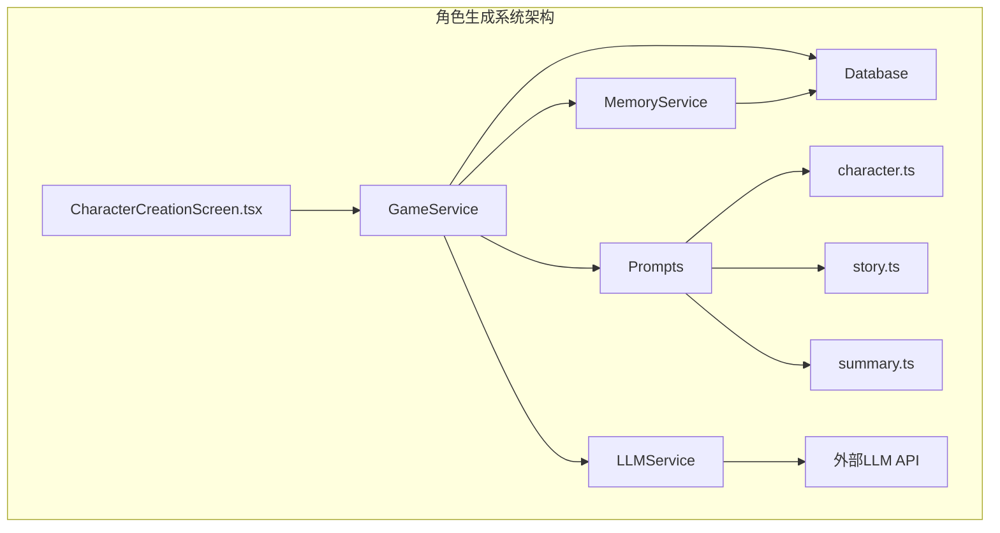
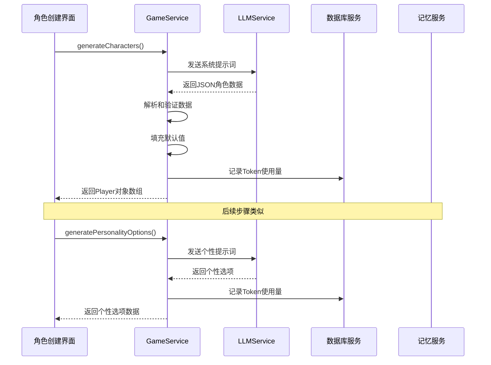
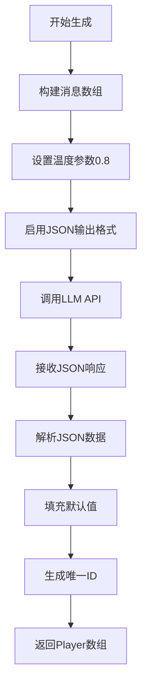
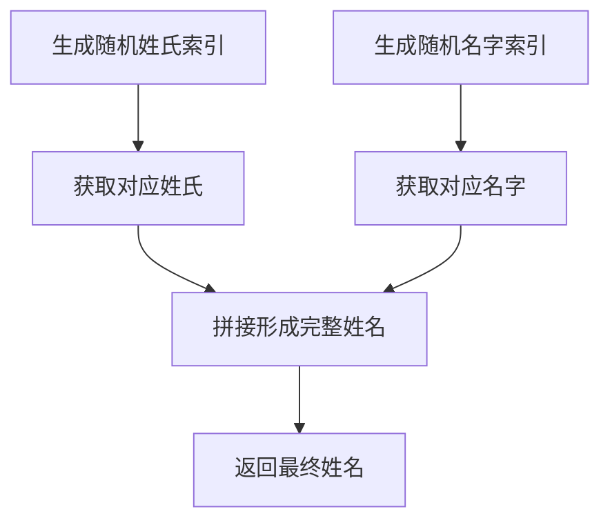
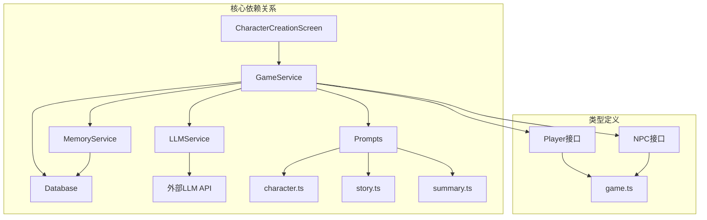

# 角色生成系统

<cite>
**本文档引用的文件**
- [character.ts](file://src/prompts/character.ts)
- [gameService.ts](file://src/services/gameService.ts)
- [llmService.ts](file://src/services/llmService.ts)
- [CharacterCreationScreen.tsx](file://src/components/CharacterCreationScreen.tsx)
- [useGameStore.ts](file://src/stores/useGameStore.ts)
- [db.ts](file://src/services/db.ts)
- [memoryService.ts](file://src/services/memoryService.ts)
- [story.ts](file://src/prompts/story.ts)
- [summary.ts](file://src/prompts/summary.ts)
- [game.ts](file://src/types/game.ts)
</cite>

## 目录
1. [简介](#简介)
2. [项目结构](#项目结构)
3. [核心组件](#核心组件)
4. [架构概览](#架构概览)
5. [详细组件分析](#详细组件分析)
6. [依赖关系分析](#依赖关系分析)
7. [性能考虑](#性能考虑)
8. [故障排除指南](#故障排除指南)
9. [结论](#结论)

## 简介

角色生成系统是修仙 Roguelike 游戏的核心功能模块，负责为玩家创建具有独特特征的修仙角色。该系统采用 AI 驱动的方式，结合预定义的提示词模板和随机算法，生成符合修仙世界观的角色数据。

系统主要包含以下核心功能：
- AI 驱动的角色数据生成
- 随机属性面板生成算法
- 中文姓名生成器
- 性格/出身/背景选项生成机制
- 完整的角色创建流程管理

## 项目结构

角色生成系统位于项目的 `src` 目录下，采用模块化设计，主要包含以下组件：



**图表来源**
- [CharacterCreationScreen.tsx](file://src/components/CharacterCreationScreen.tsx#L1-L482)
- [gameService.ts](file://src/services/gameService.ts#L1-L541)
- [llmService.ts](file://src/services/llmService.ts#L1-L101)

**章节来源**
- [CharacterCreationScreen.tsx](file://src/components/CharacterCreationScreen.tsx#L1-L482)
- [gameService.ts](file://src/services/gameService.ts#L1-L541)

## 核心组件

### 角色创建界面组件

角色创建界面采用三步走的渐进式设计，通过 `CharacterCreationScreen` 组件实现完整的角色创建流程：

1. **第一步：命格初定**
   - 随机生成中文姓名
   - 选择基础属性面板
   - 提供重新随机生成选项

2. **第二步：性格出身**
   - 生成多样化性格选项
   - 选择出身背景
   - 生成背景故事

3. **第三步：初始天赋**
   - 选择初始天赋（最多2个）
   - 确认最终角色

### 游戏服务层

`GameService` 是系统的核心服务类，负责协调各个组件的工作：

- **generateCharacters()**: 主要角色生成方法
- **generateStatPanels()**: 随机属性面板生成
- **generateRandomName()**: 中文姓名生成器
- **generatePersonalityOptions()**: 性格选项生成
- **generateTalentOptions()**: 天赋选项生成

**章节来源**
- [CharacterCreationScreen.tsx](file://src/components/CharacterCreationScreen.tsx#L43-L439)
- [gameService.ts](file://src/services/gameService.ts#L50-L541)

## 架构概览

角色生成系统采用分层架构设计，各层职责清晰分离：



**图表来源**
- [gameService.ts](file://src/services/gameService.ts#L75-L119)
- [llmService.ts](file://src/services/llmService.ts#L29-L55)

**章节来源**
- [gameService.ts](file://src/services/gameService.ts#L50-L119)
- [llmService.ts](file://src/services/llmService.ts#L18-L101)

## 详细组件分析

### generateCharacters() 方法实现原理

`generateCharacters()` 是系统的核心方法，负责通过 AI 驱动生成角色数据：

#### 提示词设计
系统使用两个精心设计的提示词模板：
- **characterSystemPrompt**: 定义修仙世界的完整世界观和角色生成要求
- **characterGenerationPrompt**: 指定具体的生成格式和约束条件

#### AI 驱动的数据生成


**图表来源**
- [gameService.ts](file://src/services/gameService.ts#L75-L119)
- [character.ts](file://src/prompts/character.ts#L1-L97)

#### 默认值填充策略
系统实现了全面的默认值填充机制，确保角色数据的完整性：
- 基础属性：健康值、真气值、攻击力、防御力、速度等
- 修为状态：境界、修为进度、灵气值
- 生命参数：年龄、寿元、最大寿元
- 其他属性：根骨、悟性、气运、业力

**章节来源**
- [gameService.ts](file://src/services/gameService.ts#L75-L119)
- [character.ts](file://src/prompts/character.ts#L17-L58)

### generateStatPanels() 方法属性模板系统

`generateStatPanels()` 实现了12种不同修仙职业类型的属性加成规则：

#### 职业模板设计
每种职业模板包含以下属性：
- **label**: 职业名称（如"体修·金刚"）
- **desc**: 职业描述（如"钢筋铁骨，气血充沛"）
- **healthBonus**: 气血加成
- **atkBonus**: 攻击加成
- **defBonus**: 防御加成
- **spdBonus**: 速度加成
- **luck**: 气运基础值
- **rootBone**: 根骨基础值
- **comprehension**: 悟性基础值

#### 属性生成算法
```mermaid
flowchart TD
A[随机打乱模板] --> B[选择前3个模板]
B --> C[计算基础属性]
C --> D[添加随机波动]
D --> E[生成最终面板]
F[基础属性计算] --> G[气血: 100 + healthBonus]
G --> H[真气: 100]
H --> I[攻击: 20 + atkBonus + rand(-3,3)]
I --> J[防御: 20 + defBonus + rand(-3,3)]
J --> K[速度: 20 + spdBonus + rand(-3,3)]
K --> L[其他属性: 基础值 + rand(-5,5)]
```

**图表来源**
- [gameService.ts](file://src/services/gameService.ts#L122-L160)

#### 职业类型详解

| 职业类型 | 特点描述 | 主要属性加成 |
|---------|----------|-------------|
| 体修·金刚 | 钢筋铁骨，气血充沛 | 高气血，高防御，低速度 |
| 剑修·凌厉 | 剑气纵横，攻伐无双 | 高攻击，高速度，均衡发展 |
| 道修·玄妙 | 道法自然，悟性超群 | 高悟性，均衡发展 |
| 法修·焚天 | 术法通神，破坏极强 | 高攻击，低防御，低气血 |
| 医修·回春 | 妙手仁心，生生不息 | 高气血，高防御，低攻击 |
| 符修·诡道 | 符箓万千，神出鬼没 | 高速度，高气运，高悟性 |
| 阵修·不动 | 阵法宗师，固若金汤 | 高防御，低速度，中等气血 |
| 灵修·福缘 | 天道眷顾，气运逆天 | 高气运，中等属性，低速度 |
| 魔修·嗜血 | 以血为引，疯狂嗜杀 | 高攻击，高根骨，低悟性 |
| 妖修·野性 | 妖血沸腾，肉身强横 | 高气血，高攻击，中等速度 |
| 佛修·禅心 | 禅意通明，金刚不坏 | 高气血，高防御，高根骨 |
| 儒修·浩然 | 正气凛然，智慧超群 | 高悟性，高根骨，均衡发展 |

**章节来源**
- [gameService.ts](file://src/services/gameService.ts#L122-L160)

### generateRandomName() 方法中文姓名生成算法

中文姓名生成器采用双数组组合策略：

#### 姓氏池设计
系统包含100个常用中国姓氏，涵盖：
- 单姓：李、王、张、刘、陈、杨等
- 复姓：慕容、欧阳、上官、诸葛等

#### 名字池设计
名字池包含100个具有修仙特色的词汇：
- 自然元素：云、风、雨、雷、电、霜、雪、冰
- 地理概念：山、河、海、川、江、湖、波、涛
- 修仙意象：剑、刀、枪、戟、斧、钺、钩、叉
- 美好寓意：天、地、玄、黄、宇、宙、洪、荒

#### 组合逻辑


**图表来源**
- [gameService.ts](file://src/services/gameService.ts#L163-L202)

**章节来源**
- [gameService.ts](file://src/services/gameService.ts#L163-L202)

### generatePersonalityOptions() 方法实现细节

该方法负责生成角色的个性、出身和背景选项：

#### 提示词设计
提示词要求生成6个不同选项，涵盖：
- **个性选项**：6个不同性格，男女各3个
- **出身选项**：6个不同出身背景
- **背景故事**：6个不同修仙契机

#### 温度参数调优
使用温度参数0.9，平衡创造性和一致性：
- 0.9的温度值确保生成结果既有创意又符合修仙主题
- 避免过度随机导致的不相关选项

#### JSON 输出格式规范
```json
{
  "personalities": [
    { "gender": "男", "avatar": "🧙‍♂️", "desc": "性格描述" },
    { "gender": "女", "avatar": "🌸", "desc": "性格描述" }
  ],
  "origins": [
    { "label": "出身标签", "desc": "出身描述" }
  ],
  "backgrounds": [
    { "label": "背景标签", "background": "详细背景故事" }
  ]
}
```

**章节来源**
- [gameService.ts](file://src/services/gameService.ts#L205-L252)

### generateTalentOptions() 方法实现细节

天赋选项生成方法实现独特的天赋系统：

#### 提示词设计
提示词基于玩家的姓名、出身和背景生成：
- 确保天赋与角色背景相关联
- 提供6个风格迥异的天赋选项
- 涵盖战斗、修炼、炼器、丹道、阵法、特殊等类型

#### 天赋分类系统
天赋按照功能分为多个类别：
- **战斗类**：天生剑骨、战神血脉、刀魂附体
- **修炼类**：五灵根、九转玄功、无上心法
- **辅助类**：过目不忘、百毒不侵、洞察秋毫
- **特殊类**：时空扭曲、元素亲和、不死之身

#### 温度参数调优
同样使用温度参数0.9，确保天赋生成的多样性和合理性。

**章节来源**
- [gameService.ts](file://src/services/gameService.ts#L255-L281)

## 依赖关系分析

角色生成系统涉及多个服务组件的协作：



**图表来源**
- [CharacterCreationScreen.tsx](file://src/components/CharacterCreationScreen.tsx#L1-L482)
- [gameService.ts](file://src/services/gameService.ts#L1-L541)
- [game.ts](file://src/types/game.ts#L110-L203)

### 组件耦合分析

系统采用松耦合设计：
- **UI层**：仅依赖 GameService 接口
- **服务层**：依赖 LLMService 和存储服务
- **数据层**：通过统一的接口访问数据库
- **提示词层**：独立管理，便于维护和修改

### 外部依赖集成

系统通过 LLMService 集成外部 AI 服务：
- 支持多种 LLM API
- 统一的错误处理和重试机制
- Token 使用量统计和监控

**章节来源**
- [llmService.ts](file://src/services/llmService.ts#L18-L101)
- [db.ts](file://src/services/db.ts#L36-L236)

## 性能考虑

### Token 使用优化
系统实现了智能的 Token 使用统计和优化：
- 记录每次 API 调用的 prompt_tokens、completion_tokens、total_tokens
- 在 GameService 中统一处理 Token 使用量记录
- 通过 useTokenStore 状态管理进行全局统计

### 缓存策略
- LLM 响应结果不缓存，确保数据新鲜度
- 姓名和属性面板生成使用本地随机算法
- 记忆服务使用 IndexedDB 进行持久化存储

### 错误处理机制
- LLM 调用失败自动重试（最多3次）
- 指数级退避延迟（1s, 2s, 3s）
- 详细的错误日志记录和用户反馈

## 故障排除指南

### 常见问题及解决方案

#### LLM API 调用失败
**症状**：角色生成过程中出现网络错误
**原因**：外部 API 服务不可用或网络连接问题
**解决方案**：
1. 检查 LLM 配置（baseURL、apiKey、model）
2. 确认网络连接正常
3. 查看浏览器开发者工具中的错误详情

#### JSON 解析错误
**症状**：AI 返回的不是有效的 JSON 格式
**原因**：LLM 输出格式不符合预期
**解决方案**：
1. 调整提示词模板
2. 修改 response_format 参数
3. 增加 JSON 格式验证

#### Token 使用异常
**症状**：Token 统计不准确或缺失
**原因**：LLM 响应中缺少 usage 信息
**解决方案**：
1. 检查 LLM API 是否支持 usage 统计
2. 在 LLMService 中增加错误处理
3. 提供降级的 Token 统计方案

**章节来源**
- [llmService.ts](file://src/services/llmService.ts#L37-L55)
- [gameService.ts](file://src/services/gameService.ts#L65-L72)

## 结论

角色生成系统通过精心设计的 AI 驱动机制和算法，为玩家提供了丰富多样的修仙角色创建体验。系统的主要优势包括：

### 技术优势
- **模块化设计**：清晰的分层架构，易于维护和扩展
- **AI 驱动**：利用 LLM 的创造性能力生成独特角色
- **数据完整性**：完善的默认值填充机制确保角色数据的完整性
- **用户体验**：流畅的三步走创建流程，支持重新生成和自定义

### 设计亮点
- **职业系统**：12种不同修仙职业的属性加成规则
- **中文特色**：完全符合中文语境的姓名和描述生成
- **多样性保证**：通过随机算法确保角色的独特性和多样性
- **扩展性强**：提示词模板化设计便于后续功能扩展

### 应用价值
该系统不仅适用于修仙 Roguelike 游戏，其设计理念和实现方式也可应用于其他类型的角色扮演游戏和 AI 驱动的内容生成场景。通过持续优化和扩展，可以为玩家提供更加丰富和沉浸式的角色创建体验。