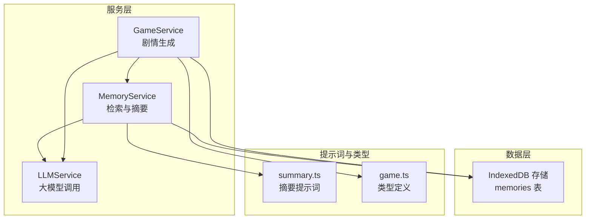
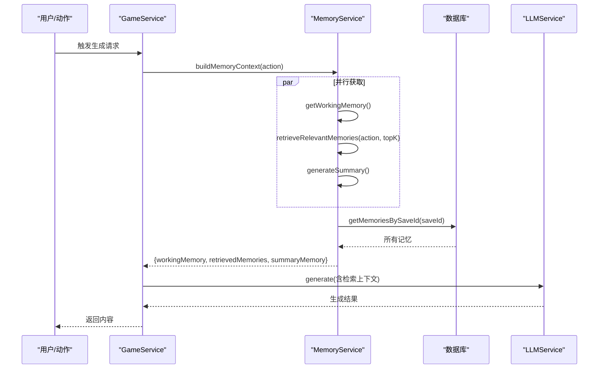
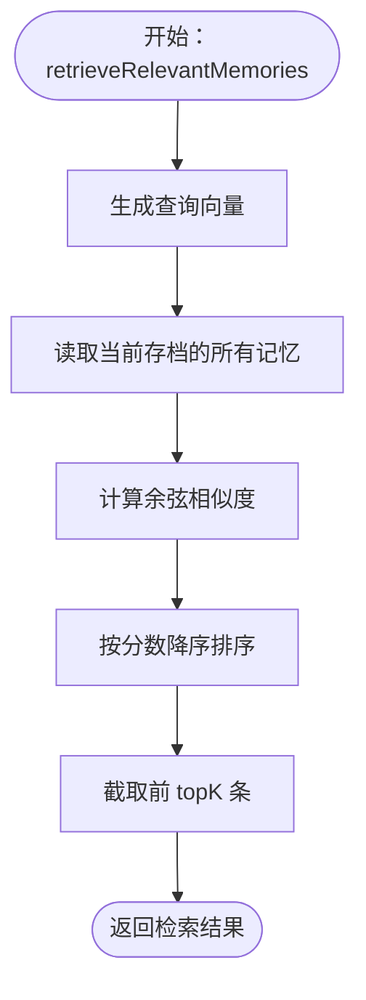
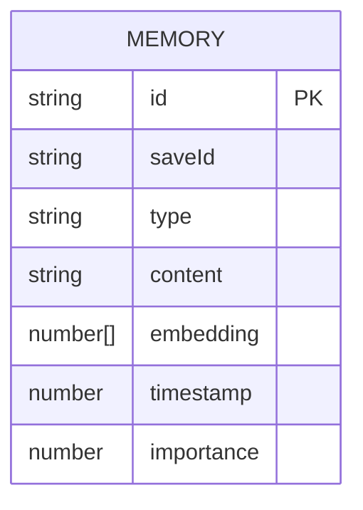
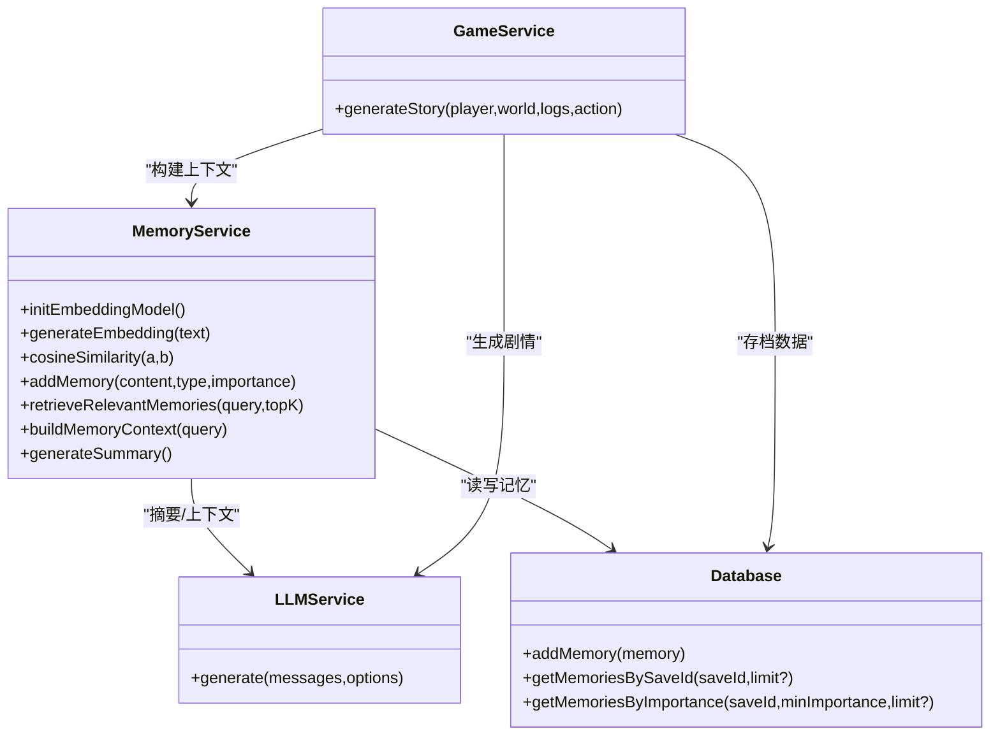

# RAG 检索机制

<cite>
**本文引用的文件**
- [memoryService.ts](file://src/services/memoryService.ts)
- [db.ts](file://src/services/db.ts)
- [gameService.ts](file://src/services/gameService.ts)
- [llmService.ts](file://src/services/llmService.ts)
- [summary.ts](file://src/prompts/summary.ts)
- [game.ts](file://src/types/game.ts)
- [useGameStore.ts](file://src/stores/useGameStore.ts)
</cite>

## 目录
1. [简介](#简介)
2. [项目结构](#项目结构)
3. [核心组件](#核心组件)
4. [架构总览](#架构总览)
5. [详细组件分析](#详细组件分析)
6. [依赖关系分析](#依赖关系分析)
7. [性能考量](#性能考量)
8. [故障排查指南](#故障排查指南)
9. [结论](#结论)
10. [附录](#附录)

## 简介
本文件系统性阐述本项目的 RAG（Retrieval-Augmented Generation，检索增强生成）检索机制，重点覆盖以下方面：
- 查询向量生成：基于轻量级嵌入模型与备用哈希向量方案
- 相似度计算：余弦相似度
- 记忆片段排序与 topK 返回
- retrieveRelevantMemories 方法的完整工作流程
- 检索性能优化策略：向量索引、缓存、批量处理
- 检索质量评估指标与相关性评分算法
- 检索示例与性能基准建议
- 检索结果在 AI 内容生成中的应用

## 项目结构
本项目采用分层架构，RAG 检索位于服务层，围绕 MemoryService、LLMService、数据库层与游戏服务层协同工作：
- MemoryService：负责嵌入生成、相似度计算、检索、摘要生成与上下文组装
- LLMService：封装外部大模型调用，支持重试与响应格式控制
- 数据库层：基于 IndexedDB 的内存存储，提供记忆增删查与索引
- 游戏服务层：在剧情生成等场景中消费检索结果，构建上下文

图表来源
- [memoryService.ts](file://src/services/memoryService.ts#L16-L224)
- [gameService.ts](file://src/services/gameService.ts#L50-L391)
- [llmService.ts](file://src/services/llmService.ts#L18-L101)
- [db.ts](file://src/services/db.ts#L36-L236)
- [summary.ts](file://src/prompts/summary.ts#L1-L26)
- [game.ts](file://src/types/game.ts#L63-L71)

章节来源
- [memoryService.ts](file://src/services/memoryService.ts#L16-L224)
- [db.ts](file://src/services/db.ts#L36-L236)
- [gameService.ts](file://src/services/gameService.ts#L50-L391)
- [llmService.ts](file://src/services/llmService.ts#L18-L101)
- [summary.ts](file://src/prompts/summary.ts#L1-L26)
- [game.ts](file://src/types/game.ts#L63-L71)

## 核心组件
- MemoryService：实现嵌入生成、相似度计算、检索、摘要与上下文组装
- LLMService：统一的大模型调用接口，支持重试与响应格式
- 数据库层：IndexedDB 封装，提供记忆增删查与索引
- 游戏服务层：在生成剧情时注入检索到的记忆上下文

章节来源
- [memoryService.ts](file://src/services/memoryService.ts#L16-L224)
- [llmService.ts](file://src/services/llmService.ts#L18-L101)
- [db.ts](file://src/services/db.ts#L36-L236)
- [gameService.ts](file://src/services/gameService.ts#L50-L391)

## 架构总览
RAG 在本项目中的应用路径如下：
- 用户输入或动作触发生成
- GameService 调用 MemoryService.buildMemoryContext 构建上下文
- MemoryService 通过 retrieveRelevantMemories 获取 topK 相关记忆
- 将工作记忆、摘要记忆与检索记忆拼接为提示词，交给 LLMService 生成内容

图表来源
- [gameService.ts](file://src/services/gameService.ts#L284-L391)
- [memoryService.ts](file://src/services/memoryService.ts#L175-L188)
- [db.ts](file://src/services/db.ts#L175-L189)
- [llmService.ts](file://src/services/llmService.ts#L29-L93)

## 详细组件分析

### MemoryService：检索与摘要核心
- 嵌入生成
  - 使用轻量级 transformers 库的特征提取模型生成向量，并进行均值池化与归一化
  - 若加载失败，回退到简单哈希向量方案（固定维度、归一化）
- 相似度计算
  - 采用余弦相似度，遍历计算查询向量与所有记忆向量的相似度
- 检索流程
  - retrieveRelevantMemories(query, topK)
    - 步骤1：生成查询向量
    - 步骤2：读取当前存档的所有记忆
    - 步骤3：计算相似度并按分数降序排序
    - 步骤4：截取前 topK 条返回
  - topK 参数作用：限制返回的记忆数量，平衡相关性与性能
- 上下文组装
  - buildMemoryContext(query) 并行获取工作记忆、检索记忆与摘要记忆
- 摘要生成
  - 当记忆数量超过阈值时，使用摘要提示词与 LLM 生成历史摘要，供后续生成使用

图表来源
- [memoryService.ts](file://src/services/memoryService.ts#L121-L137)

章节来源
- [memoryService.ts](file://src/services/memoryService.ts#L27-L81)
- [memoryService.ts](file://src/services/memoryService.ts#L121-L137)
- [memoryService.ts](file://src/services/memoryService.ts#L175-L188)
- [memoryService.ts](file://src/services/memoryService.ts#L144-L173)

### 数据库层：IndexedDB 存储与索引
- 存储结构
  - memories 表：保存记忆项，包含 id、saveId、type、content、embedding、timestamp、importance
- 索引设计
  - saveId：按存档 ID 查询
  - timestamp：按时间排序
  - importance：按重要性过滤
- 查询能力
  - getMemoriesBySaveId(saveId, limit?)：按存档 ID 获取记忆并可限制数量
  - getMemoriesByImportance(saveId, minImportance, limit?)：按重要性过滤
  - addMemories(memories[])：批量插入

图表来源
- [db.ts](file://src/services/db.ts#L26-L34)
- [db.ts](file://src/services/db.ts#L175-L207)

章节来源
- [db.ts](file://src/services/db.ts#L36-L236)

### LLMService：统一的大模型调用
- 功能要点
  - 支持温度、最大 tokens、响应格式（JSON/文本）
  - 自动重试与延迟退避
  - 统一响应结构，包含内容与 token 使用统计
- 在检索中的作用
  - 用于摘要生成与剧情生成，将检索上下文注入提示词

章节来源
- [llmService.ts](file://src/services/llmService.ts#L18-L101)

### 摘要提示词与类型定义
- 摘要提示词：指导 LLM 将历史压缩为摘要，包含关键事件、人物关系、动机与未完成线索
- 类型定义：Memory 接口包含 embedding、timestamp、importance 等字段，支撑检索与排序

章节来源
- [summary.ts](file://src/prompts/summary.ts#L1-L26)
- [game.ts](file://src/types/game.ts#L63-L71)

### 检索结果在 AI 内容生成中的应用
- GameService 在生成剧情时，将工作记忆、摘要记忆与检索记忆拼接为提示词，交由 LLM 生成连贯的剧情结果
- 检索结果作为“外部知识”注入生成过程，提升上下文相关性与一致性

章节来源
- [gameService.ts](file://src/services/gameService.ts#L284-L391)

## 依赖关系分析
- MemoryService 依赖 LLMService（摘要生成）、db（读写记忆）
- GameService 依赖 MemoryService（上下文）、LLMService（生成）、db（存档数据）
- LLMService 依赖配置（baseURL、apiKey、model）

图表来源
- [memoryService.ts](file://src/services/memoryService.ts#L16-L224)
- [llmService.ts](file://src/services/llmService.ts#L18-L101)
- [db.ts](file://src/services/db.ts#L36-L236)
- [gameService.ts](file://src/services/gameService.ts#L50-L391)

## 性能考量
- 向量索引与相似度计算
  - 现状：全量扫描所有记忆，计算余弦相似度，时间复杂度 O(N·D)，N 为记忆条数，D 为向量维度
  - 优化建议：
    - 为 embedding 字段建立 IndexedDB 索引，减少扫描范围
    - 引入近似最近邻（ANN）库（如 faiss 或 hnswlib）进行加速检索
    - 对向量进行量化或压缩以降低维度与存储开销
- 缓存机制
  - 查询向量缓存：对常用查询向量进行本地缓存，避免重复生成
  - 检索结果缓存：对 topK 结果按 query 文本哈希缓存，命中则直接返回
- 批量处理
  - 使用 db.addMemories 批量插入记忆，减少事务开销
  - 并行获取工作记忆、检索记忆与摘要记忆，缩短上下文准备时间
- 算法与数据结构
  - 余弦相似度计算可替换为更高效的向量库（如 @tensorflow/tfjs 或 @mliebelt/pgvector）
  - 对向量进行归一化与预处理，提高相似度稳定性
- 存储与索引
  - 为 saveId、importance、timestamp 建立复合索引，支持高效过滤与排序
  - 定期清理旧记忆，维持数据库规模可控

章节来源
- [memoryService.ts](file://src/services/memoryService.ts#L121-L137)
- [db.ts](file://src/services/db.ts#L175-L207)

## 故障排查指南
- 嵌入模型加载失败
  - 现象：控制台警告，回退到哈希向量
  - 处理：检查网络与依赖版本，确认 @xenova/transformers 可用
- 相似度计算异常
  - 现象：相似度为 0 或 NaN
  - 处理：确保向量非空且已归一化；检查 embedding 字段完整性
- LLM 调用失败
  - 现象：抛出错误，重试后仍失败
  - 处理：检查 baseURL、apiKey、model 配置；查看响应状态码与错误信息
- 检索结果为空
  - 现象：topK 为 0
  - 处理：确认当前存档下存在记忆；检查 importance 与阈值设置

章节来源
- [memoryService.ts](file://src/services/memoryService.ts#L28-L56)
- [memoryService.ts](file://src/services/memoryService.ts#L70-L81)
- [llmService.ts](file://src/services/llmService.ts#L37-L55)

## 结论
本项目的 RAG 检索机制以轻量嵌入与余弦相似度为核心，结合 IndexedDB 存储与并行上下文组装，在剧情生成等场景中有效提升了内容的相关性与一致性。未来可在向量索引、缓存与批量处理等方面进一步优化，以应对更大规模的记忆库与更高的实时性需求。

## 附录

### 检索质量评估与相关性评分
- 相关性评分算法
  - 余弦相似度：衡量查询与记忆向量的方向一致性
  - 重要性权重：可将 importance 作为额外权重因子参与最终排序
- 评估指标建议
  - 召回率（Recall@K）：在 topK 中命中相关记忆的比例
  - 精确率（Precision@K）：在 topK 中相关记忆占的比例
  - MRR（Mean Reciprocal Rank）：首个相关记忆的倒数排名
  - 人工相关性评分：按 1-5 分打分，计算平均分与一致性指标
- 基准测试建议
  - 数据集：随机抽样历史日志作为查询，标注相关记忆
  - 测试参数：K ∈ {3, 5, 10}
  - 指标：Recall@K、Precision@K、MRR、平均检索耗时（ms）

### 检索示例
- 示例输入：玩家当前动作或问题
- 示例输出：topK 相关记忆列表，以及工作记忆与摘要记忆
- 应用场景：剧情生成、NPC 交互、区域探索等

章节来源
- [memoryService.ts](file://src/services/memoryService.ts#L121-L137)
- [memoryService.ts](file://src/services/memoryService.ts#L175-L188)
- [gameService.ts](file://src/services/gameService.ts#L284-L391)