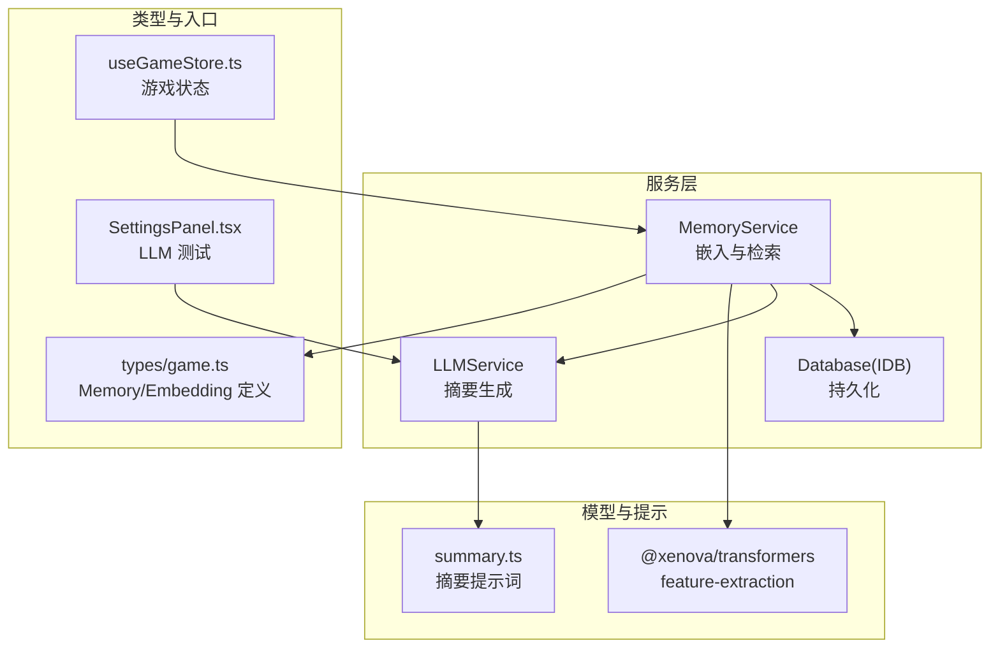
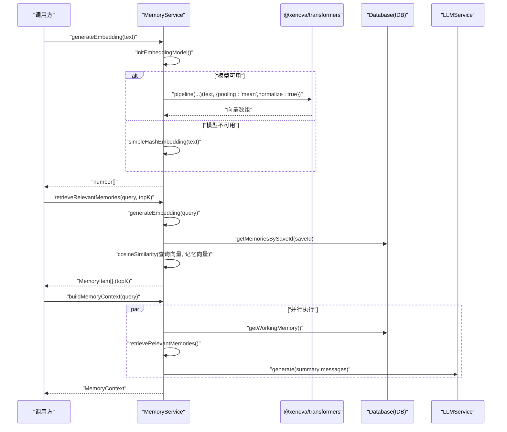
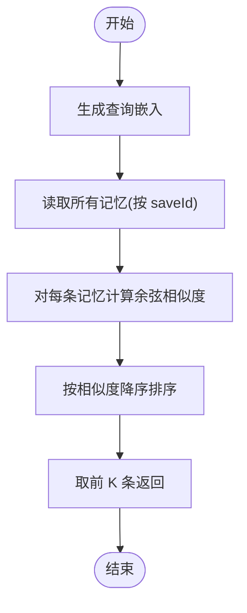
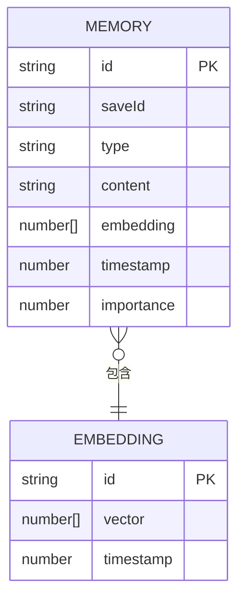
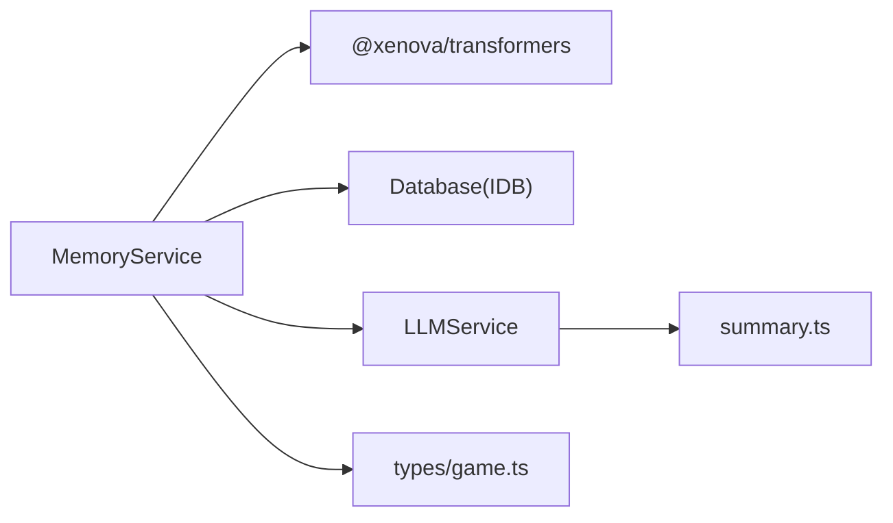

# 向量嵌入系统

<cite>
**本文引用的文件**
- [src/services/memoryService.ts](file://src/services/memoryService.ts)
- [src/services/db.ts](file://src/services/db.ts)
- [src/services/llmService.ts](file://src/services/llmService.ts)
- [src/types/game.ts](file://src/types/game.ts)
- [src/prompts/summary.ts](file://src/prompts/summary.ts)
- [package.json](file://package.json)
- [src/components/SettingsPanel.tsx](file://src/components/SettingsPanel.tsx)
- [src/stores/useGameStore.ts](file://src/stores/useGameStore.ts)
</cite>

## 目录
1. [简介](#简介)
2. [项目结构](#项目结构)
3. [核心组件](#核心组件)
4. [架构总览](#架构总览)
5. [详细组件分析](#详细组件分析)
6. [依赖分析](#依赖分析)
7. [性能考虑](#性能考虑)
8. [故障排查指南](#故障排查指南)
9. [结论](#结论)
10. [附录](#附录)

## 简介
本文件系统性地文档化了“向量嵌入系统”，涵盖嵌入模型初始化流程（基于 Transformers.js 的 feature-extraction 模型）、嵌入向量生成算法（含余弦相似度与向量归一化）、备用哈希嵌入方案、嵌入质量评估与性能优化策略、内存管理机制，以及在记忆检索中的作用与性能影响。同时提供 generateEmbedding 方法的参数与返回值规范，以及实际使用示例路径。

## 项目结构
该系统位于 src/services 目录下，核心围绕 MemoryService 展开，配合 IndexedDB 数据层（db.ts）与 LLM 服务（llmService.ts），并通过类型定义（types/game.ts）与提示词（prompts/summary.ts）支撑 RAG 与记忆摘要生成。

图表来源
- [src/services/memoryService.ts](file://src/services/memoryService.ts#L16-L37)
- [src/services/db.ts](file://src/services/db.ts#L36-L72)
- [src/services/llmService.ts](file://src/services/llmService.ts#L18-L98)
- [src/prompts/summary.ts](file://src/prompts/summary.ts#L1-L26)
- [src/types/game.ts](file://src/types/game.ts#L57-L71)
- [src/components/SettingsPanel.tsx](file://src/components/SettingsPanel.tsx#L32-L55)
- [src/stores/useGameStore.ts](file://src/stores/useGameStore.ts#L84-L225)

章节来源
- [src/services/memoryService.ts](file://src/services/memoryService.ts#L16-L37)
- [src/services/db.ts](file://src/services/db.ts#L36-L72)
- [src/services/llmService.ts](file://src/services/llmService.ts#L18-L98)
- [src/types/game.ts](file://src/types/game.ts#L57-L71)
- [src/prompts/summary.ts](file://src/prompts/summary.ts#L1-L26)
- [src/components/SettingsPanel.tsx](file://src/components/SettingsPanel.tsx#L32-L55)
- [src/stores/useGameStore.ts](file://src/stores/useGameStore.ts#L84-L225)

## 核心组件
- MemoryService：负责嵌入模型初始化、生成嵌入向量、余弦相似度计算、记忆检索（RAG）、工作记忆与摘要生成、旧记忆清理等。
- Database(IDB)：提供 IndexedDB 封装，支持按 saveId 查询记忆、按重要性过滤、批量写入与删除。
- LLMService：封装外部 LLM API 调用，支持重试与响应格式控制，用于摘要生成。
- 类型与提示：Memory/Embedding 定义与摘要提示词模板，确保上下文构建一致性。

章节来源
- [src/services/memoryService.ts](file://src/services/memoryService.ts#L16-L37)
- [src/services/db.ts](file://src/services/db.ts#L36-L72)
- [src/services/llmService.ts](file://src/services/llmService.ts#L18-L98)
- [src/types/game.ts](file://src/types/game.ts#L57-L71)
- [src/prompts/summary.ts](file://src/prompts/summary.ts#L1-L26)

## 架构总览
嵌入系统采用“特征提取模型 + 备用哈希向量”的双轨策略，结合 IndexedDB 存储与 LLM 摘要，形成完整的记忆检索与上下文构建链路。

图表来源
- [src/services/memoryService.ts](file://src/services/memoryService.ts#L27-L81)
- [src/services/memoryService.ts](file://src/services/memoryService.ts#L121-L188)
- [src/services/db.ts](file://src/services/db.ts#L175-L189)
- [src/services/llmService.ts](file://src/services/llmService.ts#L29-L98)

## 详细组件分析

### 嵌入模型初始化与 feature-extraction 配置
- 初始化流程：首次调用 generateEmbedding 时，若 embeddingPipeline 不存在则异步加载模型；加载成功后缓存于模块级变量，避免重复初始化。
- 模型选择：使用 feature-extraction 任务类型与 Xenova/all-MiniLM-L6-v2 模型，适合生成句子级向量。
- 配置参数：调用时传入 pooling: 'mean' 与 normalize: true，确保输出为平均池化后的向量并进行归一化，便于余弦相似度计算。

章节来源
- [src/services/memoryService.ts](file://src/services/memoryService.ts#L27-L37)
- [src/services/memoryService.ts](file://src/services/memoryService.ts#L40-L56)

### 嵌入向量生成算法
- Transformers.js 输出：通过 pipeline(...) 返回的张量数据转换为 number[] 数组。
- 备用哈希嵌入：当模型加载失败或生成异常时，回退到简单哈希向量方案，固定维度 128，逐字符加权累加后归一化。
- 归一化处理：对向量进行 L2 归一化，保证向量长度为 1，提升相似度稳定性。

章节来源
- [src/services/memoryService.ts](file://src/services/memoryService.ts#L40-L56)
- [src/services/memoryService.ts](file://src/services/memoryService.ts#L58-L68)

### 余弦相似度计算
- 计算步骤：点积与两个向量范数的乘积，除以范数乘积（分母为 0 时取 1），返回 0~1 之间的相似度。
- 应用场景：在检索相关记忆时，对查询向量与所有记忆向量逐一计算相似度并排序取 topK。

章节来源
- [src/services/memoryService.ts](file://src/services/memoryService.ts#L70-L81)
- [src/services/memoryService.ts](file://src/services/memoryService.ts#L121-L137)

### 备用哈希嵌入方案
- 实现原理：固定长度 128 的向量，遍历文本字符，按索引取模累加字符码点的归一化值，最后进行 L2 归一化。
- 使用场景：浏览器环境无法动态加载模型或模型初始化失败时的降级路径，确保系统可用性。

章节来源
- [src/services/memoryService.ts](file://src/services/memoryService.ts#L58-L68)

### 记忆检索（RAG）与上下文构建
- 检索流程：生成查询向量 → 读取同存档记忆 → 计算相似度 → 排序取 topK。
- 上下文组装：并行获取工作记忆、检索记忆与摘要，组合为 MemoryContext，供 LLM 生成下一步剧情时使用。

图表来源
- [src/services/memoryService.ts](file://src/services/memoryService.ts#L121-L137)

章节来源
- [src/services/memoryService.ts](file://src/services/memoryService.ts#L121-L188)

### 摘要生成与工作记忆
- 摘要阈值：当记忆数量达到阈值时才生成摘要，避免过早摘要。
- 摘要内容：基于旧记忆（排除工作记忆）生成，使用摘要系统提示词与生成提示词，调用 LLMService 生成 JSON 结构摘要。
- 工作记忆：最近若干条记忆，作为短期上下文直接参与检索与剧情生成。

章节来源
- [src/services/memoryService.ts](file://src/services/memoryService.ts#L144-L173)
- [src/services/memoryService.ts](file://src/services/memoryService.ts#L139-L142)
- [src/prompts/summary.ts](file://src/prompts/summary.ts#L1-L26)
- [src/services/llmService.ts](file://src/services/llmService.ts#L29-L98)

### 内存管理机制
- 重要性筛选：保留重要性 ≥ 8 的记忆，避免频繁删除。
- 最近记忆保留：工作记忆大小固定，确保最新事件始终参与检索。
- 清理策略：合并重要记忆与最近记忆集合，其余删除（当前数据库层未提供单条删除接口，清理逻辑预留扩展）。

章节来源
- [src/services/memoryService.ts](file://src/services/memoryService.ts#L196-L215)
- [src/services/db.ts](file://src/services/db.ts#L191-L207)

### 类型与数据模型
- Memory/Embedding：记忆项包含 id、saveId、type、content、embedding、timestamp、importance；Embedding 包含 id、vector、timestamp。
- GameLog：用于将游戏日志转化为记忆，带时间戳与类型。

图表来源
- [src/types/game.ts](file://src/types/game.ts#L57-L71)

章节来源
- [src/types/game.ts](file://src/types/game.ts#L57-L71)

### API 使用示例与规范

- generateEmbedding 方法
  - 参数
    - text: string，待生成嵌入的文本
  - 返回值
    - Promise<number[]>，返回归一化后的浮点向量
  - 行为
    - 首次调用会尝试初始化模型；模型可用时使用 mean 池化与归一化；失败时回退到哈希向量方案
  - 示例路径
    - [生成嵌入调用](file://src/services/memoryService.ts#L40-L56)
    - [备用哈希嵌入](file://src/services/memoryService.ts#L58-L68)

- retrieveRelevantMemories 方法
  - 参数
    - query: string，查询文本
    - topK: number，默认 5
  - 返回值
    - Promise<MemoryItem[]>，按相似度排序的最相关记忆列表
  - 示例路径
    - [检索流程](file://src/services/memoryService.ts#L121-L137)

- buildMemoryContext 方法
  - 参数
    - query: string，查询文本
  - 返回值
    - Promise<MemoryContext>，包含 workingMemory、summaryMemory、retrievedMemories
  - 示例路径
    - [上下文组装](file://src/services/memoryService.ts#L175-L188)

- addMemory 与 addLogAsMemory
  - 行为
    - 自动生成嵌入并持久化；addLogAsMemory 会根据关键词自动计算重要性
  - 示例路径
    - [添加记忆](file://src/services/memoryService.ts#L83-L104)
    - [重要性计算](file://src/services/memoryService.ts#L106-L119)

- LLMService 摘要生成
  - 行为
    - 使用摘要系统提示词与生成提示词，调用 LLMService 生成 JSON 摘要
  - 示例路径
    - [摘要生成](file://src/services/memoryService.ts#L144-L173)
    - [提示词](file://src/prompts/summary.ts#L1-L26)
    - [LLMService](file://src/services/llmService.ts#L29-L98)

章节来源
- [src/services/memoryService.ts](file://src/services/memoryService.ts#L40-L56)
- [src/services/memoryService.ts](file://src/services/memoryService.ts#L121-L137)
- [src/services/memoryService.ts](file://src/services/memoryService.ts#L175-L188)
- [src/services/memoryService.ts](file://src/services/memoryService.ts#L83-L104)
- [src/services/memoryService.ts](file://src/services/memoryService.ts#L106-L119)
- [src/services/memoryService.ts](file://src/services/memoryService.ts#L144-L173)
- [src/prompts/summary.ts](file://src/prompts/summary.ts#L1-L26)
- [src/services/llmService.ts](file://src/services/llmService.ts#L29-L98)

## 依赖分析
- 外部依赖
  - @xenova/transformers：提供 feature-extraction 能力，用于在线生成高质量嵌入
  - IndexedDB：本地持久化存储记忆与存档
  - LLM API：用于摘要生成与剧情推进
- 内部耦合
  - MemoryService 依赖 Database 与 LLMService；类型定义统一约束数据结构；提示词模板保障摘要一致性

图表来源
- [src/services/memoryService.ts](file://src/services/memoryService.ts#L27-L37)
- [src/services/db.ts](file://src/services/db.ts#L36-L72)
- [src/services/llmService.ts](file://src/services/llmService.ts#L18-L98)
- [src/prompts/summary.ts](file://src/prompts/summary.ts#L1-L26)
- [src/types/game.ts](file://src/types/game.ts#L57-L71)

章节来源
- [package.json](file://package.json#L23-L23)
- [src/services/memoryService.ts](file://src/services/memoryService.ts#L27-L37)
- [src/services/db.ts](file://src/services/db.ts#L36-L72)
- [src/services/llmService.ts](file://src/services/llmService.ts#L18-L98)
- [src/prompts/summary.ts](file://src/prompts/summary.ts#L1-L26)
- [src/types/game.ts](file://src/types/game.ts#L57-L71)

## 性能考虑
- 模型初始化成本
  - 首次加载 feature-extraction 模型可能较慢，建议在应用启动阶段预热或延迟到用户输入触发
- 向量生成与相似度计算
  - 对所有记忆计算相似度的时间复杂度为 O(N·D)，其中 N 为记忆数量，D 为向量维度；可通过索引或向量库优化
- 归一化与池化
  - 归一化与 mean pooling 在生成阶段完成，减少检索时的计算开销
- 备用哈希向量
  - 时间复杂度 O(L+D)，适合小规模或离线场景；精度略低但具备鲁棒性
- 并行化
  - 上下文构建使用 Promise.all 并行获取工作记忆、检索记忆与摘要，缩短整体等待时间
- 内存管理
  - 通过重要性与最近记忆保留策略降低存储与计算压力；清理逻辑可进一步扩展为定期任务

[本节为通用性能建议，不直接分析具体文件]

## 故障排查指南
- 嵌入模型加载失败
  - 现象：控制台警告“嵌入模型加载失败，将使用备用方案”
  - 处理：检查网络与 @xenova/transformers 可用性；确认浏览器支持动态 import
  - 参考路径
    - [模型初始化与降级](file://src/services/memoryService.ts#L27-L37)
    - [备用哈希嵌入](file://src/services/memoryService.ts#L58-L68)

- 嵌入生成异常
  - 现象：生成失败警告，返回哈希向量
  - 处理：检查输入文本长度与编码；确认 normalize 与 pooling 配置
  - 参考路径
    - [生成嵌入异常处理](file://src/services/memoryService.ts#L40-L56)

- 摘要生成失败
  - 现象：控制台错误“生成摘要失败”，返回空字符串
  - 处理：检查 LLM API 配置与网络连通性；验证提示词格式
  - 参考路径
    - [摘要生成异常处理](file://src/services/memoryService.ts#L144-L173)
    - [LLMService 请求与错误](file://src/services/llmService.ts#L29-L98)
    - [设置面板 LLM 测试](file://src/components/SettingsPanel.tsx#L32-L55)

- 记忆检索结果为空
  - 现象：检索返回空列表
  - 处理：确认已有记忆且 embedding 字段存在；检查 saveId 一致性
  - 参考路径
    - [检索实现](file://src/services/memoryService.ts#L121-L137)
    - [按 saveId 查询](file://src/services/db.ts#L175-L189)

章节来源
- [src/services/memoryService.ts](file://src/services/memoryService.ts#L27-L37)
- [src/services/memoryService.ts](file://src/services/memoryService.ts#L40-L56)
- [src/services/memoryService.ts](file://src/services/memoryService.ts#L144-L173)
- [src/services/llmService.ts](file://src/services/llmService.ts#L29-L98)
- [src/components/SettingsPanel.tsx](file://src/components/SettingsPanel.tsx#L32-L55)
- [src/services/db.ts](file://src/services/db.ts#L175-L189)

## 结论
该向量嵌入系统通过 feature-extraction 模型与备用哈希向量实现高可用的记忆检索与上下文构建，结合 IndexedDB 与 LLM 摘要生成，形成完整的 RAG 能力。建议在生产环境中引入向量索引与缓存策略，以进一步提升检索性能与用户体验。

[本节为总结性内容，不直接分析具体文件]

## 附录

### API 规范速查
- generateEmbedding(text: string): Promise<number[]>
  - 输入：文本
  - 输出：归一化向量
  - 参考路径：[生成嵌入](file://src/services/memoryService.ts#L40-L56)

- retrieveRelevantMemories(query: string, topK?: number): Promise<MemoryItem[]>
  - 输入：查询文本、返回条数
  - 输出：相关记忆列表
  - 参考路径：[检索实现](file://src/services/memoryService.ts#L121-L137)

- buildMemoryContext(query: string): Promise<MemoryContext>
  - 输入：查询文本
  - 输出：工作记忆、检索记忆、摘要
  - 参考路径：[上下文组装](file://src/services/memoryService.ts#L175-L188)

- addMemory(content: string, type: Memory['type'], importance?: number): Promise<void>
  - 输入：内容、类型、重要性
  - 输出：无（持久化）
  - 参考路径：[添加记忆](file://src/services/memoryService.ts#L83-L104)

- LLMService.generate(messages, options)
  - 输入：消息数组、温度/最大 tokens/响应格式
  - 输出：LLM 响应
  - 参考路径：[LLM 调用](file://src/services/llmService.ts#L29-L98)

章节来源
- [src/services/memoryService.ts](file://src/services/memoryService.ts#L40-L56)
- [src/services/memoryService.ts](file://src/services/memoryService.ts#L121-L137)
- [src/services/memoryService.ts](file://src/services/memoryService.ts#L175-L188)
- [src/services/memoryService.ts](file://src/services/memoryService.ts#L83-L104)
- [src/services/llmService.ts](file://src/services/llmService.ts#L29-L98)