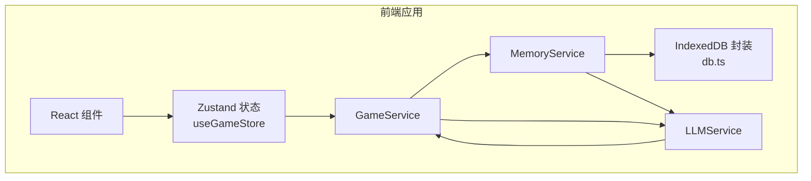
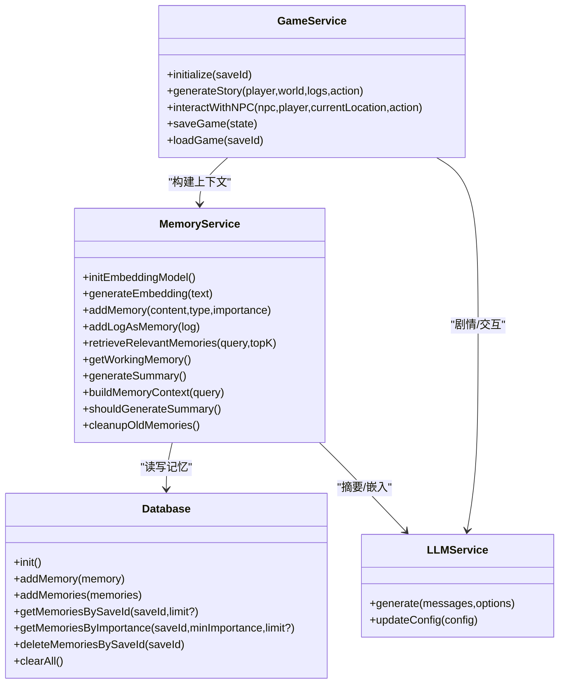
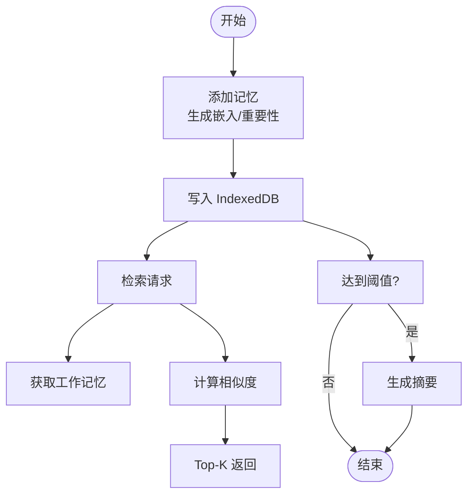
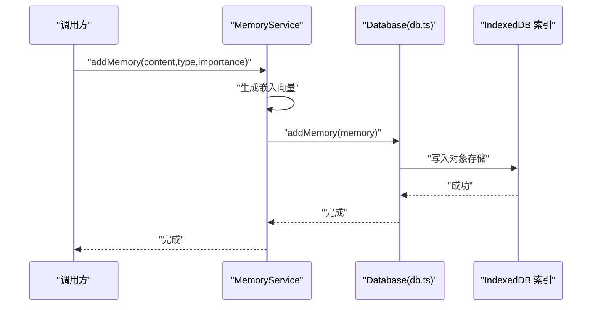
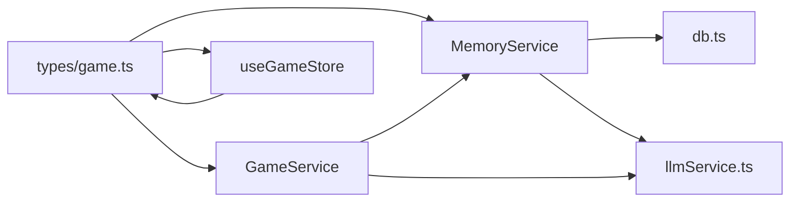

# 记忆存储管理

<cite>
**本文引用的文件**
- [memoryService.ts](file://src/services/memoryService.ts)
- [db.ts](file://src/services/db.ts)
- [gameService.ts](file://src/services/gameService.ts)
- [llmService.ts](file://src/services/llmService.ts)
- [game.ts](file://src/types/game.ts)
- [useGameStore.ts](file://src/stores/useGameStore.ts)
- [summary.ts](file://src/prompts/summary.ts)
- [useTokenStore.ts](file://src/stores/useTokenStore.ts)
</cite>

## 目录
1. [简介](#简介)
2. [项目结构](#项目结构)
3. [核心组件](#核心组件)
4. [架构总览](#架构总览)
5. [详细组件分析](#详细组件分析)
6. [依赖关系分析](#依赖关系分析)
7. [性能考量](#性能考量)
8. [故障排查指南](#故障排查指南)
9. [结论](#结论)
10. [附录](#附录)

## 简介
本文件面向“记忆存储管理系统”的使用者与维护者，系统性阐述记忆数据模型设计、生命周期管理、存储策略、性能优化、API 使用示例与数据迁移方案，并解释与数据库层的交互与事务处理机制。该系统采用 IndexedDB 作为底层持久化存储，结合浏览器端嵌入模型与 LLM，实现工作记忆、摘要记忆与检索增强（RAG）的记忆体系，支撑剧情推演与 NPC 交互。

## 项目结构
围绕记忆存储的关键模块如下：
- 数据模型与类型：位于 types/game.ts，定义 Memory、GameLog、MemoryType 等核心类型
- 记忆服务：memoryService.ts，负责记忆的添加、检索、摘要生成、上下文组装与清理
- 数据库服务：db.ts，封装 IndexedDB 的对象存储与索引，提供增删查改与批量操作
- 游戏服务：gameService.ts，协调 LLM 与记忆服务，构建记忆上下文并驱动剧情
- LLM 服务：llmService.ts，统一的 LLM 调用封装与重试机制
- 前端状态：useGameStore.ts，Zustand 状态管理，承载游戏运行时状态与记忆片段
- 提示词：prompts/summary.ts，用于记忆摘要生成
- Token 统计：useTokenStore.ts，记录 LLM 调用的 token 使用情况

图表来源
- [memoryService.ts](file://src/services/memoryService.ts#L16-L224)
- [db.ts](file://src/services/db.ts#L36-L236)
- [gameService.ts](file://src/services/gameService.ts#L50-L541)
- [llmService.ts](file://src/services/llmService.ts#L18-L101)
- [useGameStore.ts](file://src/stores/useGameStore.ts#L84-L226)

章节来源
- [memoryService.ts](file://src/services/memoryService.ts#L1-L224)
- [db.ts](file://src/services/db.ts#L1-L236)
- [gameService.ts](file://src/services/gameService.ts#L1-L541)
- [llmService.ts](file://src/services/llmService.ts#L1-L101)
- [useGameStore.ts](file://src/stores/useGameStore.ts#L1-L226)

## 核心组件
- MemoryService：多层记忆系统的核心，负责嵌入向量生成、相似度检索、工作记忆、摘要生成与上下文组装
- Database：IndexedDB 封装，提供对象存储、索引、增删查改与批量写入
- GameService：协调 LLM 与记忆服务，构建记忆上下文并驱动剧情生成
- LLMService：统一的 LLM 调用封装，具备重试与错误处理
- Memory 类型与 GameLog：定义记忆数据结构与日志结构

章节来源
- [memoryService.ts](file://src/services/memoryService.ts#L16-L224)
- [db.ts](file://src/services/db.ts#L36-L236)
- [gameService.ts](file://src/services/gameService.ts#L50-L541)
- [llmService.ts](file://src/services/llmService.ts#L18-L101)
- [game.ts](file://src/types/game.ts#L63-L71)

## 架构总览
记忆存储管理采用“服务层 + 数据层 + 类型层”的分层架构：
- 类型层：定义 Memory、GameLog、MemoryType 等数据模型
- 服务层：MemoryService、GameService、LLMService
- 数据层：db.ts 对 IndexedDB 的封装，提供对象存储与索引
- 前端状态：useGameStore.ts 管理运行时状态与记忆片段

图表来源
- [memoryService.ts](file://src/services/memoryService.ts#L16-L224)
- [db.ts](file://src/services/db.ts#L36-L236)
- [gameService.ts](file://src/services/gameService.ts#L50-L541)
- [llmService.ts](file://src/services/llmService.ts#L18-L101)

## 详细组件分析

### 记忆数据模型设计
- Memory 接口字段
  - id：记忆唯一标识
  - saveId：所属存档标识
  - type：记忆类型（如角色状态变化、NPC 交互、关键事件等）
  - content：记忆文本内容
  - embedding：嵌入向量（可选）
  - timestamp：时间戳
  - importance：重要性评分（1-10）

- MemoryType 枚举
  - 角色状态变化、NPC 交互、关键事件、普通对话、背景信息

- GameLog 接口
  - id、timestamp、content、type（action/event/dialog/system）

- 约束与规则
  - MemoryItem 在 IndexedDB 中以 id 为主键，同时建立 saveId、timestamp、importance 索引
  - importance 用于筛选与排序，影响摘要生成与清理策略
  - embedding 为空时，MemoryService 会回退到简单哈希向量

章节来源
- [game.ts](file://src/types/game.ts#L48-L71)
- [db.ts](file://src/services/db.ts#L26-L34)
- [memoryService.ts](file://src/services/memoryService.ts#L107-L119)

### 记忆生命周期管理
- 添加
  - addMemory：生成嵌入向量，填充时间戳与重要性，写入 IndexedDB
  - addLogAsMemory：基于 GameLog 计算重要性后添加
- 检索
  - getWorkingMemory：按时间倒序返回最近 N 条记忆
  - retrieveRelevantMemories：计算查询与记忆的余弦相似度，返回 Top-K
- 清理
  - cleanupOldMemories：保留高重要性记忆与最近记忆，其余删除（当前 db.ts 缺少单条删除，可扩展）
- 删除
  - deleteMemoriesBySaveId：按 saveId 清空对应存档的记忆

图表来源
- [memoryService.ts](file://src/services/memoryService.ts#L83-L137)
- [db.ts](file://src/services/db.ts#L161-L207)

章节来源
- [memoryService.ts](file://src/services/memoryService.ts#L83-L215)
- [db.ts](file://src/services/db.ts#L161-L225)

### 存储策略
- 工作记忆保留
  - 默认最近 10 条记忆，优先保留最新且与当前上下文相关
- 重要记忆标记
  - 通过关键词匹配与人工设定，将重要性评分提升至 7/9
  - cleanupOldMemories 保留重要性≥8的记忆
- 时间衰减机制
  - 通过时间戳排序与摘要生成实现“时间衰减”效果
  - 旧记忆被压缩为摘要，减少存储与检索成本

章节来源
- [memoryService.ts](file://src/services/memoryService.ts#L19-L215)
- [db.ts](file://src/services/db.ts#L64-L69)

### 存储性能优化
- 索引设计
  - memories 对象存储建立 saveId、timestamp、importance 索引，支持高效查询与过滤
- 批量操作
  - addMemories：Promise.all 并行写入，提升批量导入效率
- 内存管理
  - 嵌入模型懒加载，首次使用时初始化；失败时回退到简单哈希向量
  - 通过摘要生成减少长期存储的数据量

章节来源
- [db.ts](file://src/services/db.ts#L64-L69)
- [memoryService.ts](file://src/services/memoryService.ts#L28-L68)
- [memoryService.ts](file://src/services/memoryService.ts#L170-L173)

### 存储 API 使用示例
- 初始化与嵌入模型
  - 调用 MemoryService.initEmbeddingModel()，确保嵌入模型可用
- 添加记忆
  - 调用 MemoryService.addMemory(content, type, importance)，或 addLogAsMemory(log)
- 检索记忆
  - 调用 MemoryService.retrieveRelevantMemories(query, topK)
  - 调用 MemoryService.getWorkingMemory()
- 生成摘要
  - 调用 MemoryService.generateSummary()，或 shouldGenerateSummary() 判断是否需要生成
- 清理旧记忆
  - 调用 MemoryService.cleanupOldMemories()

章节来源
- [memoryService.ts](file://src/services/memoryService.ts#L28-L215)

### 数据迁移方案
- 存档迁移
  - 通过 db.ts 的存档接口（addSave、updateSave、getAllSaves、deleteSave）进行存档元数据迁移
  - 使用 saveSaveData 与 getSaveData 迁移完整游戏状态
- 记忆迁移
  - 由于当前 db.ts 缺少单条删除方法，建议先执行 deleteMemoriesBySaveId 清空旧存档记忆，再批量写入新记忆
  - 可利用 addMemories 并行写入，提升迁移效率

章节来源
- [db.ts](file://src/services/db.ts#L85-L232)

### 与数据库层的交互与事务处理
- IndexedDB 事务
  - 通过 getStore 获取只读/读写事务对象，确保操作原子性
  - 对 memories 对象存储的增删查改均在事务内完成
- 索引访问
  - 通过 index('saveId')、index('timestamp')、index('importance') 实现高效查询
- 批量写入
  - addMemories 使用 Promise.all 并行提交多个 addMemory 请求

图表来源
- [memoryService.ts](file://src/services/memoryService.ts#L83-L98)
- [db.ts](file://src/services/db.ts#L161-L168)

章节来源
- [db.ts](file://src/services/db.ts#L36-L236)
- [memoryService.ts](file://src/services/memoryService.ts#L83-L98)

## 依赖关系分析
- MemoryService 依赖 db.ts（读写记忆）与 llmService.ts（摘要/嵌入）
- GameService 依赖 MemoryService 与 LLMService，用于构建记忆上下文与驱动剧情
- useGameStore.ts 依赖 types/game.ts 的类型定义，管理运行时状态与记忆片段

图表来源
- [game.ts](file://src/types/game.ts#L63-L71)
- [memoryService.ts](file://src/services/memoryService.ts#L16-L224)
- [db.ts](file://src/services/db.ts#L36-L236)
- [gameService.ts](file://src/services/gameService.ts#L50-L541)
- [llmService.ts](file://src/services/llmService.ts#L18-L101)
- [useGameStore.ts](file://src/stores/useGameStore.ts#L13-L55)

章节来源
- [game.ts](file://src/types/game.ts#L63-L71)
- [memoryService.ts](file://src/services/memoryService.ts#L16-L224)
- [db.ts](file://src/services/db.ts#L36-L236)
- [gameService.ts](file://src/services/gameService.ts#L50-L541)
- [llmService.ts](file://src/services/llmService.ts#L18-L101)
- [useGameStore.ts](file://src/stores/useGameStore.ts#L13-L55)

## 性能考量
- 嵌入生成
  - 首次加载嵌入模型时进行懒加载，失败回退到简单哈希向量，降低首开延迟
- 查询优化
  - 利用 IndexedDB 索引（saveId、timestamp、importance）进行高效过滤与排序
- 批量写入
  - addMemories 使用 Promise.all 并行写入，显著提升批量导入性能
- 记忆摘要
  - 达到阈值后生成摘要，减少长期存储与检索成本，提升响应速度

章节来源
- [memoryService.ts](file://src/services/memoryService.ts#L28-L68)
- [memoryService.ts](file://src/services/memoryService.ts#L170-L173)
- [db.ts](file://src/services/db.ts#L64-L69)

## 故障排查指南
- 嵌入模型加载失败
  - 现象：控制台警告“嵌入模型加载失败”
  - 处理：系统会回退到简单哈希向量；检查网络与依赖是否正确加载
- IndexedDB 初始化失败
  - 现象：打开数据库报错
  - 处理：确认 IndexedDB 可用性与权限；检查数据库版本升级回调
- LLM 调用失败
  - 现象：API 错误或超时
  - 处理：查看 LLMService 的重试日志与错误信息；检查 baseURL、apiKey、model 配置

章节来源
- [memoryService.ts](file://src/services/memoryService.ts#L31-L36)
- [db.ts](file://src/services/db.ts#L40-L50)
- [llmService.ts](file://src/services/llmService.ts#L40-L55)

## 结论
该记忆存储管理系统通过多层记忆策略（工作记忆、摘要记忆、RAG 检索）与 IndexedDB 持久化，实现了高效、可扩展的记忆管理能力。配合嵌入模型与 LLM，系统能够为剧情推演与 NPC 交互提供丰富的上下文支持。未来可在单条删除、索引优化与缓存策略方面进一步提升性能与稳定性。

## 附录
- 提示词：摘要生成系统提示词与生成提示词，用于指导 LLM 输出结构化摘要
- Token 统计：useTokenStore.ts 提供累计与会话级 token 使用统计，便于成本控制

章节来源
- [summary.ts](file://src/prompts/summary.ts#L1-L26)
- [useTokenStore.ts](file://src/stores/useTokenStore.ts#L1-L73)