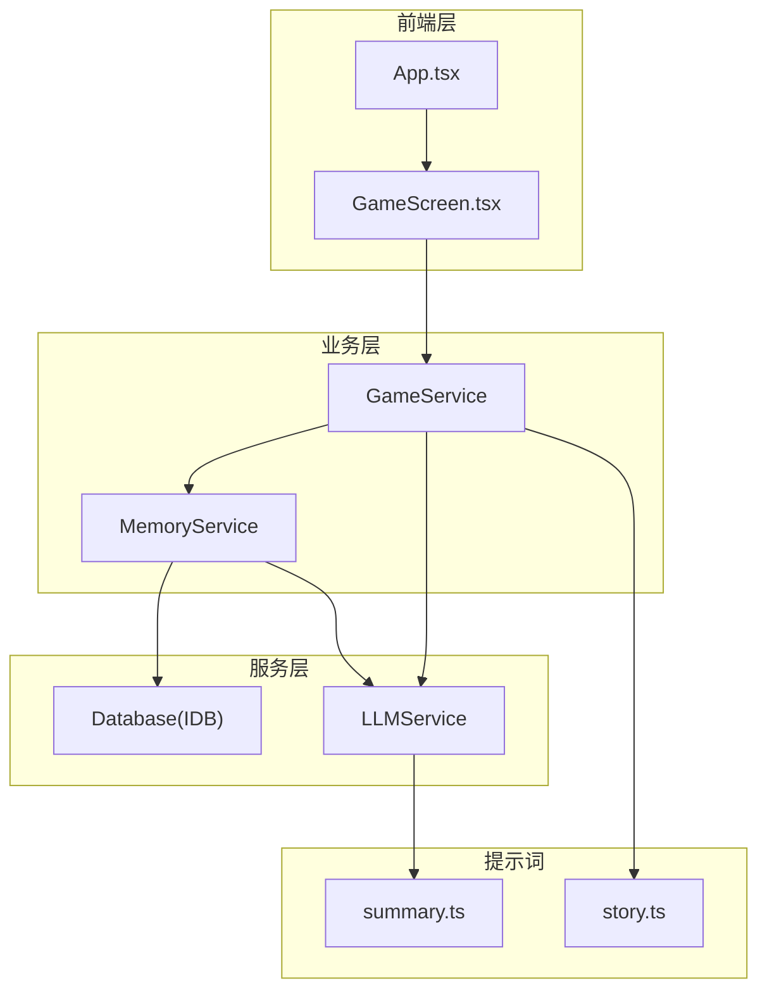
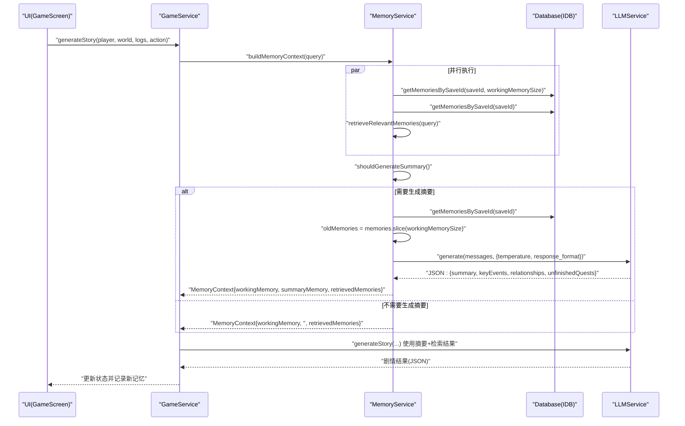
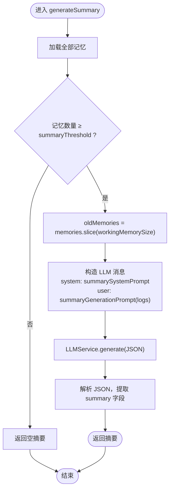
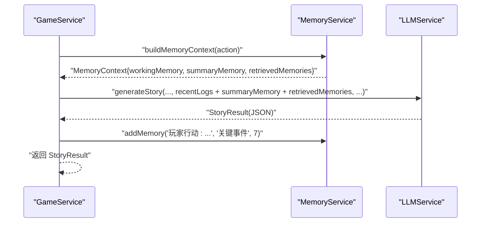
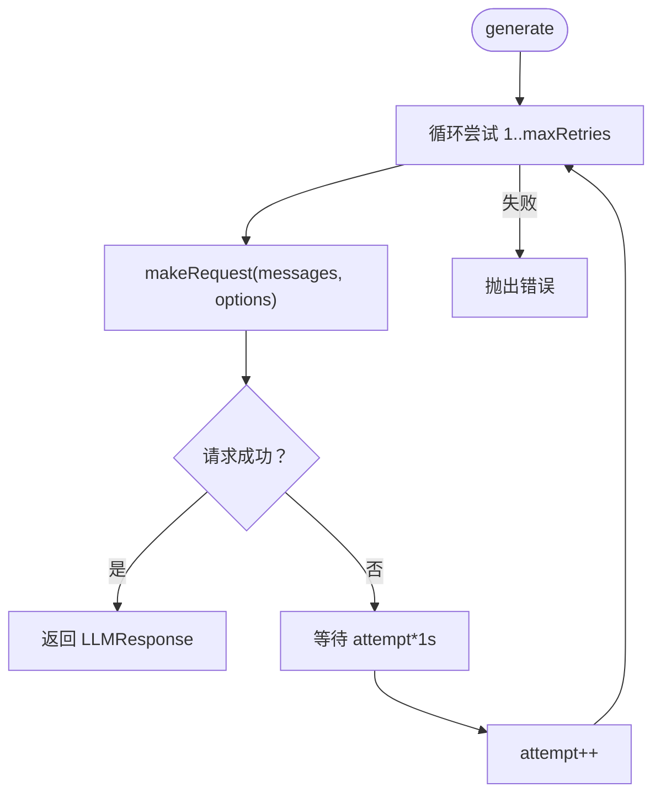
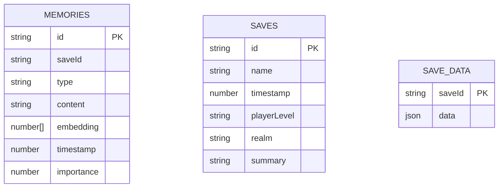
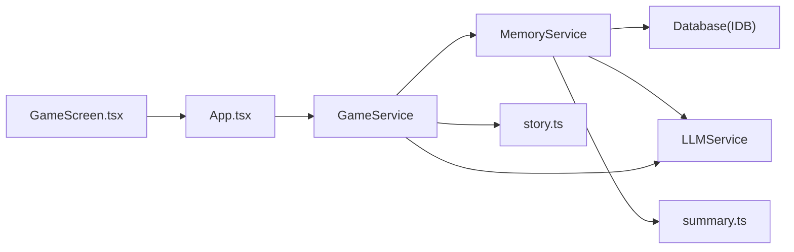

# 记忆摘要生成

<cite>
**本文引用的文件**
- [src/services/memoryService.ts](file://src/services/memoryService.ts)
- [src/prompts/summary.ts](file://src/prompts/summary.ts)
- [src/services/gameService.ts](file://src/services/gameService.ts)
- [src/types/game.ts](file://src/types/game.ts)
- [src/stores/useGameStore.ts](file://src/stores/useGameStore.ts)
- [src/services/db.ts](file://src/services/db.ts)
- [src/services/llmService.ts](file://src/services/llmService.ts)
- [src/prompts/story.ts](file://src/prompts/story.ts)
- [src/App.tsx](file://src/App.tsx)
- [src/components/GameScreen.tsx](file://src/components/GameScreen.tsx)
- [package.json](file://package.json)
</cite>

## 目录
1. [简介](#简介)
2. [项目结构](#项目结构)
3. [核心组件](#核心组件)
4. [架构总览](#架构总览)
5. [详细组件分析](#详细组件分析)
6. [依赖关系分析](#依赖关系分析)
7. [性能考量](#性能考量)
8. [故障排查指南](#故障排查指南)
9. [结论](#结论)
10. [附录](#附录)

## 简介
本文件系统性阐述“记忆摘要生成”在修仙Roguelike游戏中的作用与实现细节，重点覆盖以下方面：
- 触发条件与阈值设置：summaryThreshold 参数的作用与生效时机
- 摘要生成流程：旧记忆筛选、内容聚合、LLM 提示词构建
- 质量控制机制：重要性评分、相似度检索、内容压缩策略
- 性能优化：批量处理、缓存策略、错误恢复机制
- 实际示例与质量评估标准
- 摘要在游戏剧情连贯性维护中的关键价值

## 项目结构
围绕记忆摘要生成的关键代码位于以下模块：
- 记忆服务：负责记忆的增删查、嵌入向量计算、相似度检索、摘要生成与上下文组装
- 数据库服务：提供 IndexedDB 存储的记忆读写接口
- LLM 服务：统一的 LLM 请求封装，含重试与错误恢复
- 游戏服务：调用记忆服务构建上下文，驱动剧情生成
- 提示词模板：系统提示与摘要生成提示词
- 类型定义：记忆、日志、状态等核心数据结构
- 前端集成：App 与 GameScreen 将摘要注入到剧情生成流程

图表来源
- [src/App.tsx](file://src/App.tsx#L1-L588)
- [src/components/GameScreen.tsx](file://src/components/GameScreen.tsx#L1-L172)
- [src/services/gameService.ts](file://src/services/gameService.ts#L1-L541)
- [src/services/memoryService.ts](file://src/services/memoryService.ts#L1-L224)
- [src/services/db.ts](file://src/services/db.ts#L1-L236)
- [src/services/llmService.ts](file://src/services/llmService.ts#L1-L101)
- [src/prompts/summary.ts](file://src/prompts/summary.ts#L1-L26)
- [src/prompts/story.ts](file://src/prompts/story.ts#L1-L147)

章节来源
- [src/App.tsx](file://src/App.tsx#L1-L588)
- [src/components/GameScreen.tsx](file://src/components/GameScreen.tsx#L1-L172)
- [src/services/gameService.ts](file://src/services/gameService.ts#L1-L541)
- [src/services/memoryService.ts](file://src/services/memoryService.ts#L1-L224)
- [src/services/db.ts](file://src/services/db.ts#L1-L236)
- [src/services/llmService.ts](file://src/services/llmService.ts#L1-L101)
- [src/prompts/summary.ts](file://src/prompts/summary.ts#L1-L26)
- [src/prompts/story.ts](file://src/prompts/story.ts#L1-L147)

## 核心组件
- MemoryService：记忆管理核心，负责嵌入向量生成、相似度检索、摘要生成、上下文组装、清理策略
- GameService：剧情生成入口，调用 MemoryService 构建上下文并驱动 LLM 推演
- LLMService：统一的 LLM 请求封装，具备重试与错误恢复
- Database：IndexedDB 封装，提供记忆的增删查与索引查询
- 提示词模块：summary.ts 定义摘要系统提示与生成提示；story.ts 定义剧情系统提示
- 类型定义：game.ts 定义 Memory、GameLog、Player、NPC 等核心类型

章节来源
- [src/services/memoryService.ts](file://src/services/memoryService.ts#L1-L224)
- [src/services/gameService.ts](file://src/services/gameService.ts#L1-L541)
- [src/services/llmService.ts](file://src/services/llmService.ts#L1-L101)
- [src/services/db.ts](file://src/services/db.ts#L1-L236)
- [src/prompts/summary.ts](file://src/prompts/summary.ts#L1-L26)
- [src/prompts/story.ts](file://src/prompts/story.ts#L1-L147)
- [src/types/game.ts](file://src/types/game.ts#L1-L319)

## 架构总览
记忆摘要生成贯穿“记忆收集—上下文组装—LLM 推演—结果落库”的闭环：
- 记忆收集：通过 addMemory/addLogAsMemory 记录事件与日志，赋予重要性评分
- 上下文组装：buildMemoryContext 并行获取工作记忆、检索相关记忆、生成摘要
- LLM 推演：使用摘要系统提示与摘要生成提示，输出结构化摘要
- 结果落库：将摘要写入游戏状态，供后续剧情生成使用

图表来源
- [src/services/gameService.ts](file://src/services/gameService.ts#L283-L391)
- [src/services/memoryService.ts](file://src/services/memoryService.ts#L175-L194)
- [src/services/memoryService.ts](file://src/services/memoryService.ts#L144-L173)
- [src/services/db.ts](file://src/services/db.ts#L175-L189)
- [src/services/llmService.ts](file://src/services/llmService.ts#L29-L55)

章节来源
- [src/services/gameService.ts](file://src/services/gameService.ts#L283-L391)
- [src/services/memoryService.ts](file://src/services/memoryService.ts#L144-L194)
- [src/services/db.ts](file://src/services/db.ts#L175-L189)
- [src/services/llmService.ts](file://src/services/llmService.ts#L29-L55)

## 详细组件分析

### MemoryService：摘要生成与上下文组装
- 关键参数
  - workingMemorySize：工作记忆窗口大小，默认 10
  - summaryThreshold：触发摘要生成的最小记忆条数阈值，默认 50
- 重要性评分
  - addLogAsMemory：根据日志内容关键词判定重要性（高/中/默认）
  - 重要性用于后续摘要生成与清理策略
- 嵌入与相似度
  - initEmbeddingModel：惰性加载 @xenova/transformers 的特征提取模型
  - generateEmbedding：优先使用模型生成向量，失败时回退到简单哈希向量
  - cosineSimilarity：计算查询与记忆的余弦相似度
- 摘要生成流程
  - shouldGenerateSummary：当记忆总数达到阈值时才生成摘要
  - generateSummary：对超出工作记忆窗口的旧记忆进行聚合，构造 JSON 输出的摘要
  - buildMemoryContext：并行获取工作记忆、检索相关记忆、生成摘要
- 清理策略
  - cleanupOldMemories：保留重要记忆（importance≥8）与最近记忆，其余删除（预留扩展）

图表来源
- [src/services/memoryService.ts](file://src/services/memoryService.ts#L144-L173)
- [src/prompts/summary.ts](file://src/prompts/summary.ts#L1-L26)
- [src/services/llmService.ts](file://src/services/llmService.ts#L29-L55)

章节来源
- [src/services/memoryService.ts](file://src/services/memoryService.ts#L1-L224)
- [src/prompts/summary.ts](file://src/prompts/summary.ts#L1-L26)

### GameService：将摘要注入剧情生成
- 构建记忆上下文
  - buildMemoryContext：并行获取工作记忆、检索相关记忆、生成摘要
- 生成剧情
  - generateStory：将摘要与检索记忆拼接到剧情提示词中，驱动 LLM 推演
  - 记录新记忆：将玩家行动与结果写入记忆，便于后续摘要生成

图表来源
- [src/services/gameService.ts](file://src/services/gameService.ts#L283-L391)
- [src/services/memoryService.ts](file://src/services/memoryService.ts#L175-L188)

章节来源
- [src/services/gameService.ts](file://src/services/gameService.ts#L283-L391)

### LLMService：请求封装与错误恢复
- 重试机制：最多重试 3 次，指数退避延迟
- 统一响应：返回 content 与 usage（prompt/completion/total tokens）
- 错误处理：捕获网络与 API 错误，抛出可诊断异常

图表来源
- [src/services/llmService.ts](file://src/services/llmService.ts#L29-L55)

章节来源
- [src/services/llmService.ts](file://src/services/llmService.ts#L1-L101)

### 数据存储与索引
- IndexedDB 对象存储：SAVES、SAVE_DATA、MEMORIES
- 记忆索引：saveId、timestamp、importance
- 查询能力：按 saveId 获取记忆列表、按重要性过滤、批量插入

图表来源
- [src/services/db.ts](file://src/services/db.ts#L6-L69)
- [src/services/db.ts](file://src/services/db.ts#L161-L207)

章节来源
- [src/services/db.ts](file://src/services/db.ts#L1-L236)

### 触发条件与阈值设置
- summaryThreshold：默认 50，表示当记忆总数达到该阈值时才触发摘要生成
- 触发时机：shouldGenerateSummary 在构建上下文时调用，决定是否生成摘要
- 与工作记忆的关系：摘要仅针对超出工作记忆窗口的旧记忆进行压缩

章节来源
- [src/services/memoryService.ts](file://src/services/memoryService.ts#L19-L25)
- [src/services/memoryService.ts](file://src/services/memoryService.ts#L190-L194)

### 质量控制机制
- 重要性评分：addLogAsMemory 基于关键词匹配为日志赋予重要性（高/中/默认），用于后续检索与摘要生成
- 相似度检索：retrieveRelevantMemories 使用余弦相似度对查询与记忆向量进行排序，选取 topK
- 内容压缩策略：摘要生成提示词要求输出结构化 JSON，包含关键事件、人物关系变化、未完成的剧情线索，确保信息密度与可读性的平衡

章节来源
- [src/services/memoryService.ts](file://src/services/memoryService.ts#L106-L119)
- [src/services/memoryService.ts](file://src/services/memoryService.ts#L121-L137)
- [src/prompts/summary.ts](file://src/prompts/summary.ts#L1-L26)

### 摘要生成流程详解
- 输入：旧记忆集合（超过工作记忆窗口）
- 处理：LLM 依据系统提示与生成提示，输出结构化摘要
- 输出：摘要字符串，以及 keyEvents、relationships、unfinishedQuests 等结构化字段
- 上下文注入：GameService 将摘要与检索记忆拼接，作为剧情生成的上下文

章节来源
- [src/services/memoryService.ts](file://src/services/memoryService.ts#L144-L173)
- [src/services/gameService.ts](file://src/services/gameService.ts#L283-L391)
- [src/prompts/summary.ts](file://src/prompts/summary.ts#L12-L25)

### 性能优化与错误恢复
- 并行处理：buildMemoryContext 并行获取工作记忆、检索相关记忆、生成摘要，减少等待时间
- 嵌入模型懒加载：initEmbeddingModel 惰性加载，失败时回退到简单哈希向量，保证可用性
- LLM 重试：LLMService 最多重试 3 次，指数退避，降低瞬时失败影响
- 存储优化：IndexedDB 索引（saveId、timestamp、importance）支持高效查询与过滤

章节来源
- [src/services/memoryService.ts](file://src/services/memoryService.ts#L27-L37)
- [src/services/memoryService.ts](file://src/services/memoryService.ts#L175-L188)
- [src/services/llmService.ts](file://src/services/llmService.ts#L29-L55)
- [src/services/db.ts](file://src/services/db.ts#L64-L69)

### 摘要示例与质量评估标准
- 示例结构（来自摘要生成提示词）：
  - summary：摘要内容
  - keyEvents：关键事件列表
  - relationships：NPC 关系映射
  - unfinishedQuests：未完成的剧情线索
- 质量评估标准：
  - 信息完整性：是否覆盖关键事件、人物关系变化、当前目标与动机、未完成线索
  - 简洁性：在保持信息完整的同时，避免冗余与重复
  - 可读性：语言流畅、逻辑清晰，便于后续剧情推演使用

章节来源
- [src/prompts/summary.ts](file://src/prompts/summary.ts#L12-L25)

### 摘要在剧情连贯性维护中的作用
- 信息压缩：将大量旧记忆压缩为结构化摘要，降低上下文长度，提升 LLM 推演稳定性
- 关键信息保留：通过重要性评分与摘要结构化字段，确保关键事件与关系得以保留
- 上下文一致性：摘要与检索记忆共同构成上下文，帮助维持剧情的时间连续性与因果逻辑
- 可扩展性：摘要可作为后续 NPC 交互、任务推进、世界事件发展的知识基础

章节来源
- [src/services/gameService.ts](file://src/services/gameService.ts#L283-L391)
- [src/services/memoryService.ts](file://src/services/memoryService.ts#L144-L173)

## 依赖关系分析

图表来源
- [src/services/memoryService.ts](file://src/services/memoryService.ts#L1-L224)
- [src/services/gameService.ts](file://src/services/gameService.ts#L1-L541)
- [src/services/db.ts](file://src/services/db.ts#L1-L236)
- [src/services/llmService.ts](file://src/services/llmService.ts#L1-L101)
- [src/prompts/summary.ts](file://src/prompts/summary.ts#L1-L26)
- [src/prompts/story.ts](file://src/prompts/story.ts#L1-L147)
- [src/App.tsx](file://src/App.tsx#L1-L588)
- [src/components/GameScreen.tsx](file://src/components/GameScreen.tsx#L1-L172)

章节来源
- [src/services/memoryService.ts](file://src/services/memoryService.ts#L1-L224)
- [src/services/gameService.ts](file://src/services/gameService.ts#L1-L541)
- [src/services/db.ts](file://src/services/db.ts#L1-L236)
- [src/services/llmService.ts](file://src/services/llmService.ts#L1-L101)
- [src/prompts/summary.ts](file://src/prompts/summary.ts#L1-L26)
- [src/prompts/story.ts](file://src/prompts/story.ts#L1-L147)
- [src/App.tsx](file://src/App.tsx#L1-L588)
- [src/components/GameScreen.tsx](file://src/components/GameScreen.tsx#L1-L172)

## 性能考量
- 并行化：buildMemoryContext 并行获取工作记忆、检索相关记忆与摘要生成，显著降低等待时间
- 惰性加载：嵌入模型按需加载，失败回退到简单哈希向量，保证可用性与性能
- 重试与退避：LLMService 的重试机制与延迟策略，降低瞬时失败对用户体验的影响
- 存储索引：IndexedDB 为 saveId、timestamp、importance 建立索引，提高查询效率
- 批量写入：db.addMemories 支持批量插入，减少事务开销

章节来源
- [src/services/memoryService.ts](file://src/services/memoryService.ts#L175-L188)
- [src/services/memoryService.ts](file://src/services/memoryService.ts#L27-L37)
- [src/services/llmService.ts](file://src/services/llmService.ts#L29-L55)
- [src/services/db.ts](file://src/services/db.ts#L64-L69)
- [src/services/db.ts](file://src/services/db.ts#L170-L173)

## 故障排查指南
- 嵌入模型加载失败
  - 现象：控制台警告“嵌入模型加载失败”，回退到简单哈希向量
  - 处理：确认网络可达，或等待后续重试；必要时更换模型或离线部署
- LLM 请求失败
  - 现象：generate 抛出“已重试 X 次”错误
  - 处理：检查 baseURL、apiKey、model 配置；查看网络与服务端状态
- IndexedDB 初始化失败
  - 现象：打开数据库失败
  - 处理：清除浏览器存储或更换浏览器；检查权限与隐私设置
- 摘要为空
  - 现象：shouldGenerateSummary 返回 false 或 generateSummary 返回空字符串
  - 处理：确认记忆总数是否达到阈值；检查工作记忆窗口与旧记忆筛选逻辑

章节来源
- [src/services/memoryService.ts](file://src/services/memoryService.ts#L27-L37)
- [src/services/llmService.ts](file://src/services/llmService.ts#L29-L55)
- [src/services/db.ts](file://src/services/db.ts#L39-L72)
- [src/services/memoryService.ts](file://src/services/memoryService.ts#L190-L194)

## 结论
记忆摘要生成通过“阈值触发—并行上下文—结构化输出”的设计，在保证剧情连贯性的同时，有效控制了上下文长度与计算成本。其关键在于：
- 明确的阈值与窗口划分（summaryThreshold 与 workingMemorySize）
- 基于重要性评分与相似度检索的质量控制
- LLM 的结构化输出与错误恢复机制
- IndexedDB 的高效索引与并行处理

这些机制共同确保了在大规模记忆场景下，摘要仍能准确反映关键信息，为后续剧情推演提供稳定、可扩展的知识基础。

## 附录
- 相关依赖：@xenova/transformers（特征提取）、zustand（状态管理）、sonner（通知）、localforage（本地存储）
- 前端集成：App.tsx 与 GameScreen.tsx 将摘要注入到剧情生成流程，实现从记忆到故事的闭环

章节来源
- [package.json](file://package.json#L15-L36)
- [src/App.tsx](file://src/App.tsx#L1-L588)
- [src/components/GameScreen.tsx](file://src/components/GameScreen.tsx#L1-L172)