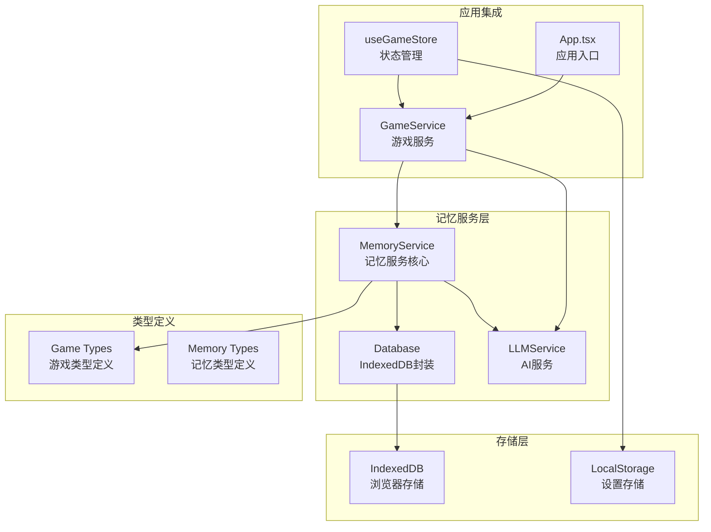
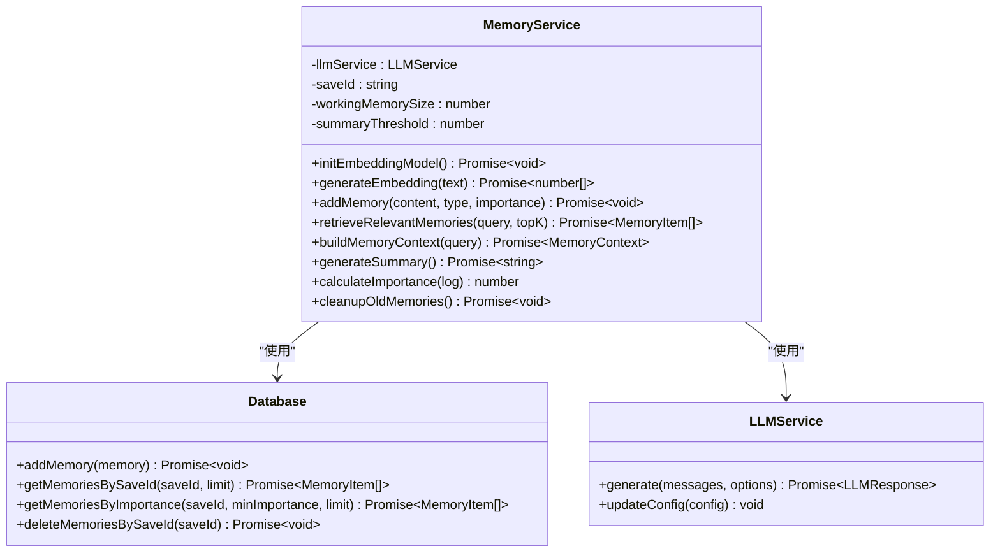
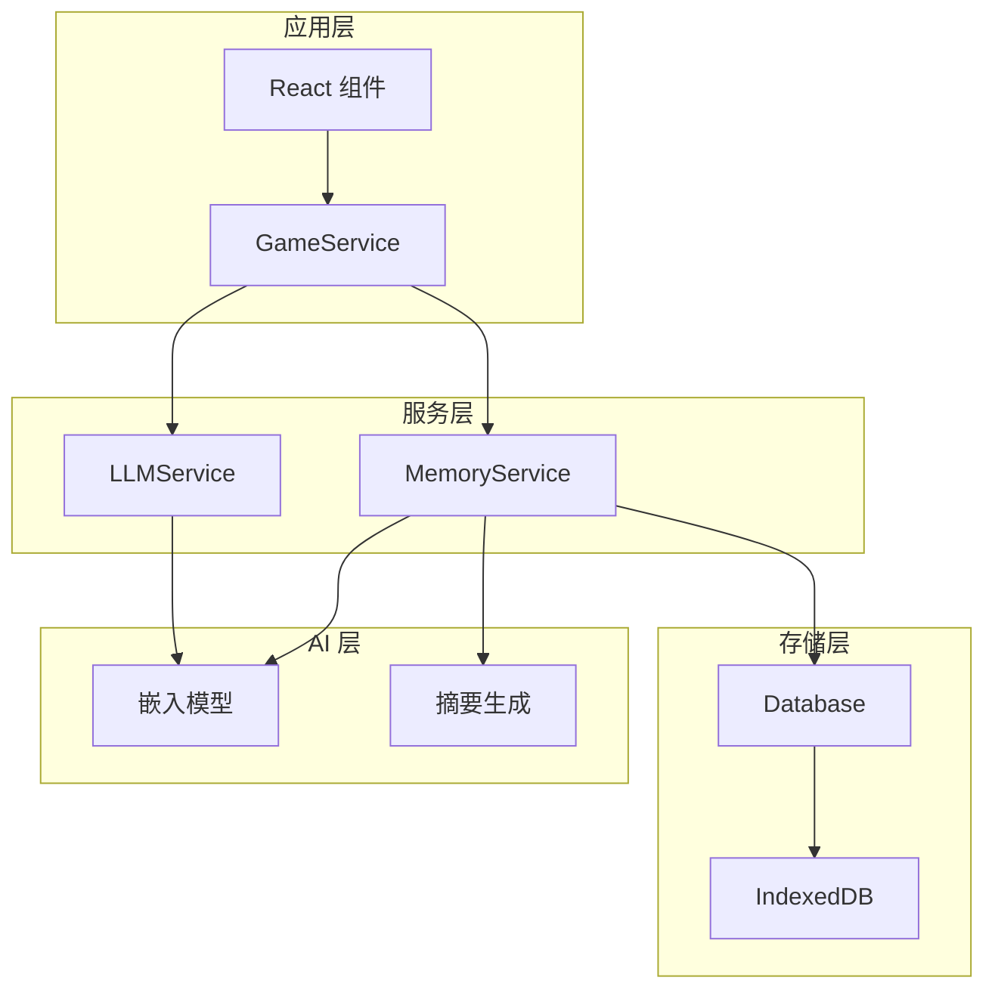
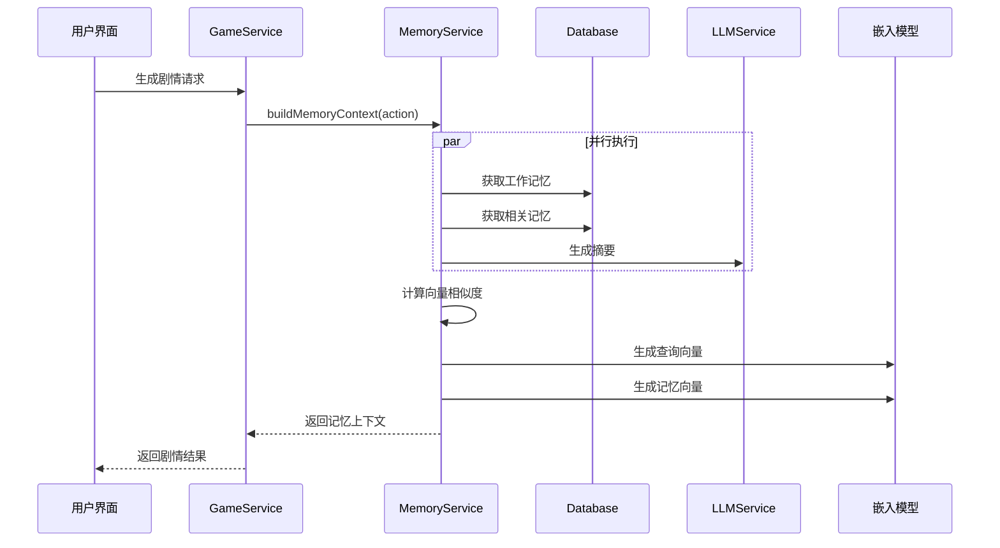
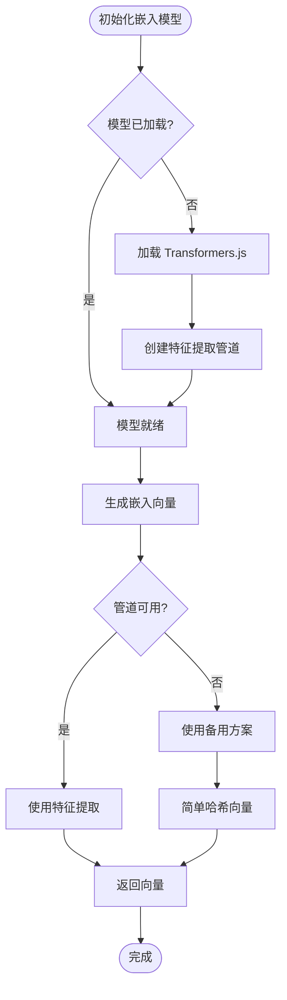
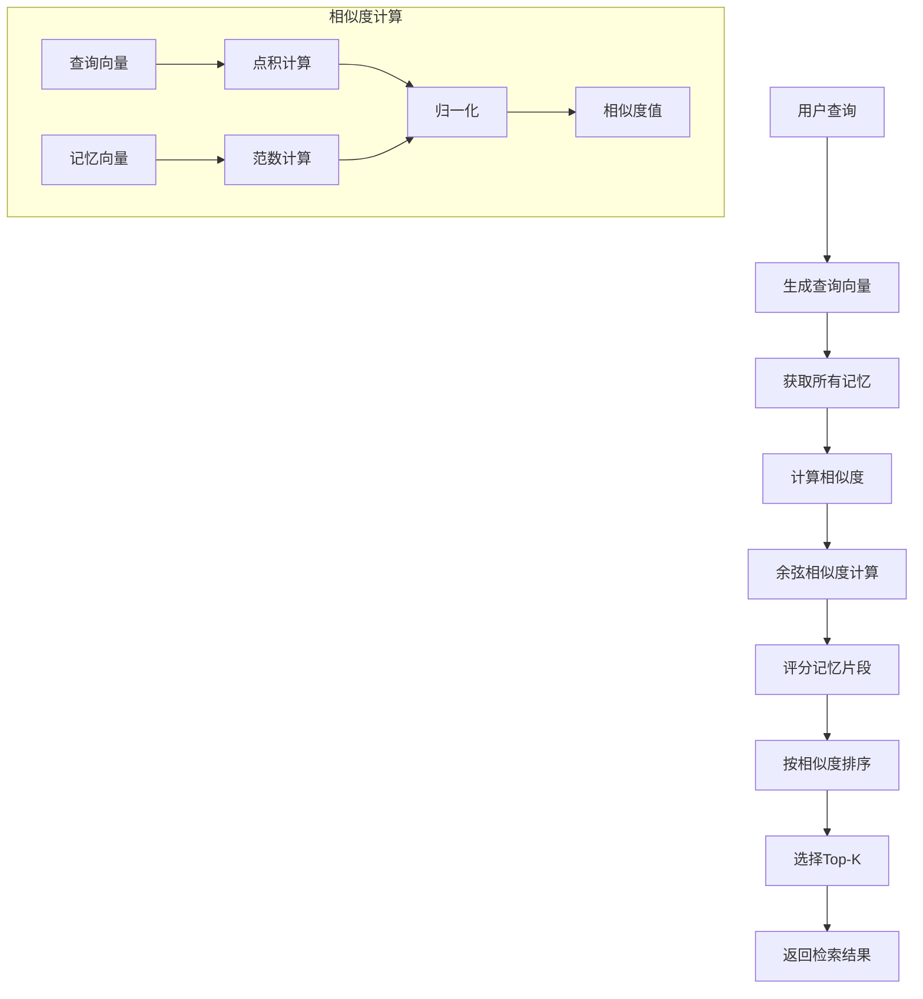
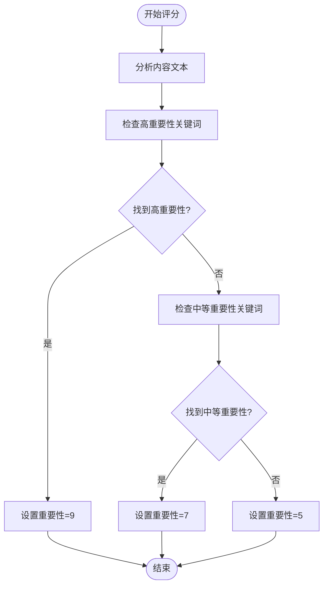
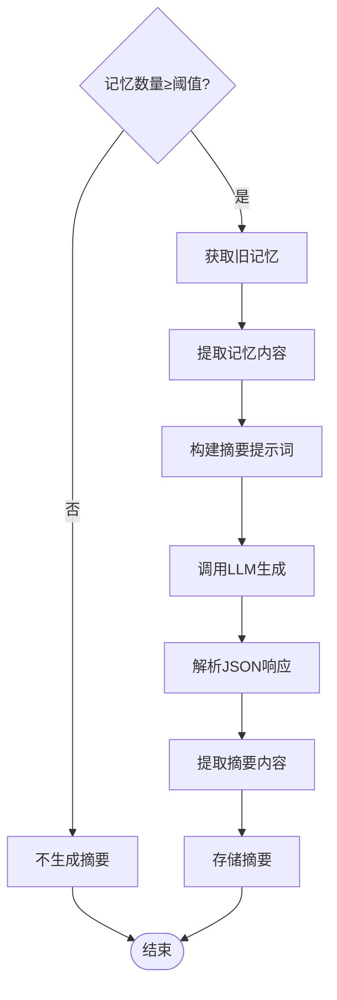
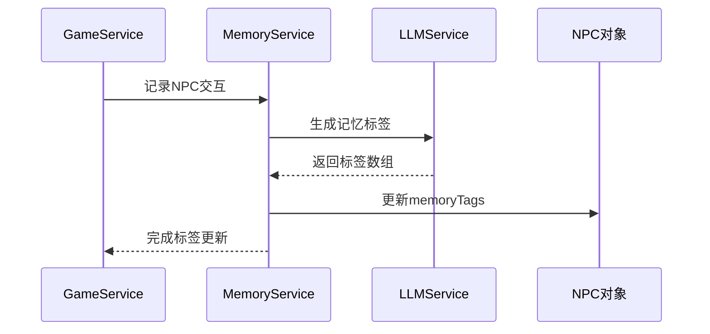
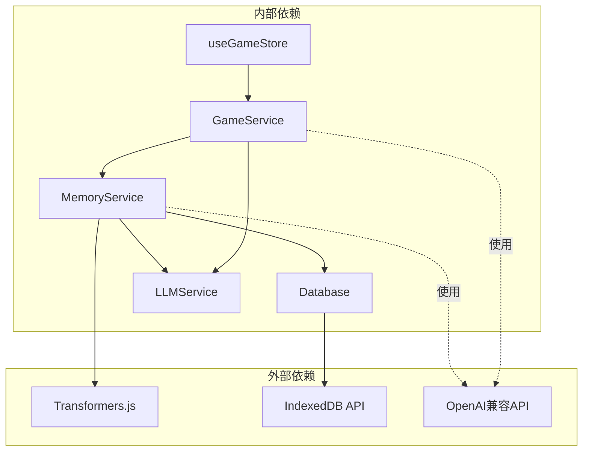

# 记忆管理系统

<cite>
**本文档引用的文件**
- [memoryService.ts](file://src/services/memoryService.ts)
- [db.ts](file://src/services/db.ts)
- [gameService.ts](file://src/services/gameService.ts)
- [llmService.ts](file://src/services/llmService.ts)
- [summary.ts](file://src/prompts/summary.ts)
- [game.ts](file://src/types/game.ts)
- [useGameStore.ts](file://src/stores/useGameStore.ts)
- [App.tsx](file://src/App.tsx)
</cite>

## 目录
1. [简介](#简介)
2. [项目结构](#项目结构)
3. [核心组件](#核心组件)
4. [架构概览](#架构概览)
5. [详细组件分析](#详细组件分析)
6. [依赖关系分析](#依赖关系分析)
7. [性能考虑](#性能考虑)
8. [故障排除指南](#故障排除指南)
9. [结论](#结论)

## 简介

记忆管理系统是修仙 Roguelike 游戏的核心智能引擎，负责管理玩家的游戏体验记忆，通过多层记忆架构提供沉浸式的剧情体验。系统采用先进的 RAG（检索增强生成）技术，结合短期记忆、长期记忆和向量嵌入存储机制，为 AI 驱动的剧情推演提供强大的记忆支持。

该系统能够：
- 自动识别和分类游戏事件的重要性
- 生成语义相似的记忆检索
- 生成历史摘要以压缩长期记忆
- 提供智能的上下文构建和剧情关联
- 支持跨时间线的记忆关联和智能检索策略

## 项目结构

记忆管理系统位于 `src/services/` 目录下，采用模块化设计，主要包含以下核心文件：



**图表来源**
- [memoryService.ts](file://src/services/memoryService.ts#L1-L224)
- [db.ts](file://src/services/db.ts#L1-L236)
- [gameService.ts](file://src/services/gameService.ts#L1-L541)

**章节来源**
- [memoryService.ts](file://src/services/memoryService.ts#L1-L224)
- [db.ts](file://src/services/db.ts#L1-L236)

## 核心组件

### MemoryService 类

MemoryService 是记忆管理系统的核心类，负责管理所有记忆相关的操作。它实现了多层记忆架构，包括短期记忆、长期记忆和向量嵌入存储。

#### 主要特性

- **多层记忆架构**：工作记忆（最近10条）+ 摘要记忆（定期生成）+ 长期记忆（向量检索）
- **智能嵌入生成**：使用 Transformers.js 的 all-MiniLM-L6-v2 模型生成语义向量
- **RAG 检索算法**：基于余弦相似度的向量检索
- **重要性评分系统**：基于关键词的重要程度评估
- **摘要生成**：定期压缩旧记忆，生成历史摘要

#### 核心接口



**图表来源**
- [memoryService.ts](file://src/services/memoryService.ts#L16-L224)
- [db.ts](file://src/services/db.ts#L36-L236)
- [llmService.ts](file://src/services/llmService.ts#L18-L101)

**章节来源**
- [memoryService.ts](file://src/services/memoryService.ts#L16-L224)

## 架构概览

记忆管理系统采用分层架构设计，确保了良好的模块化和可维护性：



**图表来源**
- [gameService.ts](file://src/services/gameService.ts#L50-L62)
- [memoryService.ts](file://src/services/memoryService.ts#L22-L25)
- [db.ts](file://src/services/db.ts#L36-L72)

### 数据流图



**图表来源**
- [gameService.ts](file://src/services/gameService.ts#L294-L391)
- [memoryService.ts](file://src/services/memoryService.ts#L175-L188)

## 详细组件分析

### 向量嵌入存储机制

系统采用轻量级的嵌入模型来生成语义向量，支持高效的相似度计算。

#### 嵌入模型配置



**图表来源**
- [memoryService.ts](file://src/services/memoryService.ts#L28-L56)

#### 嵌入向量生成算法

系统实现了两种嵌入生成策略：

1. **主策略**：使用 Transformers.js 的 all-MiniLM-L6-v2 模型
2. **备用策略**：基于字符串哈希的简单向量生成

**章节来源**
- [memoryService.ts](file://src/services/memoryService.ts#L28-L68)

### RAG 检索算法实现

RAG（检索增强生成）算法是记忆系统的核心，实现了基于语义相似度的记忆检索。

#### 检索流程



**图表来源**
- [memoryService.ts](file://src/services/memoryService.ts#L121-L137)
- [memoryService.ts](file://src/services/memoryService.ts#L70-L81)

#### 余弦相似度计算

系统使用标准的余弦相似度公式进行向量相似度计算：

```
cos(θ) = (A · B) / (||A|| × ||B||)
```

其中：
- A 和 B 是两个 n 维向量
- A · B 是向量点积
- ||A|| 和 ||B|| 是向量的欧几里得范数

**章节来源**
- [memoryService.ts](file://src/services/memoryService.ts#L70-L81)

### 多层记忆架构设计

系统实现了三层记忆架构，每层都有特定的功能和存储策略：

#### 工作记忆（短期记忆）

工作记忆存储最近的 N 条记忆，用于当前场景的直接上下文。

- **容量**：默认 10 条记忆
- **更新策略**：自动滚动更新
- **用途**：当前场景的即时上下文

#### 长期记忆（向量存储）

长期记忆存储所有历史记忆，支持语义检索。

- **存储格式**：向量 + 文本 + 时间戳 + 重要性评分
- **检索方式**：基于余弦相似度的向量检索
- **索引策略**：按 saveId、timestamp、importance 建立索引

#### 摘要记忆（长期压缩）

当记忆数量超过阈值时，系统自动生成摘要记忆。

- **触发条件**：记忆数量 ≥ 50 条
- **生成频率**：定期自动检查
- **压缩策略**：使用 LLM 生成结构化摘要

**章节来源**
- [memoryService.ts](file://src/services/memoryService.ts#L19-L20)
- [memoryService.ts](file://src/services/memoryService.ts#L191-L194)

### 记忆重要性评分系统

系统实现了智能的重要性评分机制，基于关键词匹配和上下文分析。

#### 重要性等级

| 重要性等级 | 分数值 | 关键词示例 | 适用场景 |
|------------|--------|------------|----------|
| 高重要性 | 9 | 突破、死亡、奇遇、传承、天劫、飞升、获得、结识 | 剧情转折点、重大事件 |
| 中等重要性 | 7 | 修炼、战斗、探索、学习、炼制 | 日常活动、技能提升 |
| 默认重要性 | 5 | 其他事件 | 一般对话、环境描述 |

#### 评分算法



**图表来源**
- [memoryService.ts](file://src/services/memoryService.ts#L106-L119)

**章节来源**
- [memoryService.ts](file://src/services/memoryService.ts#L106-L119)

### 记忆摘要生成机制

系统实现了智能的记忆摘要生成，通过 LLM 将大量历史记忆压缩为结构化摘要。

#### 摘要生成流程



**图表来源**
- [memoryService.ts](file://src/services/memoryService.ts#L144-L173)

#### 摘要内容结构

生成的摘要包含以下关键信息：

- **关键事件**：突破境界、获得重要物品、结识重要 NPC 等
- **人物关系变化**：NPC 好感度变化、关系发展
- **当前目标和动机**：玩家的修仙目标和动机
- **未完成的剧情线索**：待解决的悬疑和任务

**章节来源**
- [memoryService.ts](file://src/services/memoryService.ts#L144-L173)
- [summary.ts](file://src/prompts/summary.ts#L1-L26)

### 记忆标签系统

系统支持基于 LLM 的记忆标签生成，为 NPC 交互提供智能标签系统。

#### 标签生成机制



**图表来源**
- [gameService.ts](file://src/services/gameService.ts#L461-L468)

**章节来源**
- [gameService.ts](file://src/services/gameService.ts#L461-L468)

### 时间衰减机制

系统实现了基于时间的记忆重要性衰减机制，确保近期记忆具有更高的权重。

#### 时间衰减算法

```mermaid
flowchart TD
GetMemories[获取记忆列表] --> SortByTime[按时间排序]
SortByTime --> CalculateAge[计算记忆年龄]
CalculateAge --> ApplyDecay[应用时间衰减]
ApplyDecay --> DecayFormula[衰减公式: weight = e^(-λ×t)]
DecayFormula --> WeightedScore[计算加权分数]
WeightedScore --> FinalSort[最终排序]
FinalSort --> ReturnResults[返回结果]
```

**图表来源**
- [memoryService.ts](file://src/services/memoryService.ts#L121-L137)

## 依赖关系分析

记忆管理系统与其他组件的依赖关系如下：



**图表来源**
- [memoryService.ts](file://src/services/memoryService.ts#L2-L5)
- [db.ts](file://src/services/db.ts#L1-L10)

### 组件耦合度分析

- **MemoryService** 与 **Database**：紧密耦合，MemoryService 直接依赖 Database 的 CRUD 操作
- **MemoryService** 与 **LLMService**：中等耦合，主要用于摘要生成和嵌入模型
- **GameService** 与 **MemoryService**：紧密耦合，GameService 在多个业务流程中依赖 MemoryService
- **useGameStore** 与 **GameService**：中等耦合，通过状态管理器间接依赖

**章节来源**
- [memoryService.ts](file://src/services/memoryService.ts#L2-L5)
- [gameService.ts](file://src/services/gameService.ts#L50-L62)

## 性能考虑

### 存储优化

系统采用了多种存储优化策略：

1. **索引优化**：为 saveId、timestamp、importance 建立复合索引
2. **批量操作**：支持批量添加记忆，减少数据库往返
3. **内存缓存**：嵌入模型在内存中缓存，避免重复加载
4. **懒加载**：嵌入模型按需加载，减少启动时间

### 检索优化

1. **向量相似度计算**：使用高效的余弦相似度算法
2. **Top-K 选择**：限制检索结果数量，提高响应速度
3. **并行处理**：工作记忆、检索记忆、摘要生成并行执行
4. **智能清理**：定期清理不重要的旧记忆

### 内存管理

1. **向量维度**：使用 128 维向量平衡精度和性能
2. **模型大小**：all-MiniLM-L6-v2 模型体积较小，适合浏览器运行
3. **垃圾回收**：及时释放不再使用的向量和中间结果

## 故障排除指南

### 常见问题及解决方案

#### 嵌入模型加载失败

**问题症状**：
- 控制台出现警告信息
- 嵌入生成使用备用方案
- 相似度计算精度下降

**解决方案**：
1. 检查网络连接是否正常
2. 确认 CDN 可访问性
3. 验证浏览器是否支持 WebAssembly
4. 考虑使用本地模型文件

#### IndexedDB 操作失败

**问题症状**：
- 添加记忆失败
- 获取记忆为空
- 数据库版本升级失败

**解决方案**：
1. 检查浏览器隐私模式设置
2. 确认 IndexedDB API 可用性
3. 清理浏览器缓存和存储
4. 检查存储配额限制

#### LLM 调用超时

**问题症状**：
- AI 服务调用超时
- 摘要生成失败
- 剧情推演卡顿

**解决方案**：
1. 检查网络连接稳定性
2. 验证 API 密钥有效性
3. 调整超时参数
4. 实施重试机制

**章节来源**
- [memoryService.ts](file://src/services/memoryService.ts#L31-L36)
- [db.ts](file://src/services/db.ts#L40-L50)
- [llmService.ts](file://src/services/llmService.ts#L37-L55)

## 结论

记忆管理系统通过精心设计的多层架构，成功实现了修仙 Roguelike 游戏所需的智能记忆功能。系统不仅提供了高效的记忆存储和检索能力，更重要的是通过 RAG 技术实现了语义层面的记忆关联，为 AI 驱动的剧情推演提供了强大的支持。

### 主要优势

1. **多层架构设计**：工作记忆、长期记忆、摘要记忆的有机结合
2. **语义检索能力**：基于向量相似度的智能检索
3. **智能重要性评分**：自动识别和分类重要事件
4. **可扩展性**：模块化设计便于功能扩展
5. **性能优化**：多种优化策略确保系统流畅运行

### 应用价值

通过与 AI 服务的深度集成，记忆系统显著提升了剧情生成的质量和连贯性：

- **增强的剧情连贯性**：基于历史记忆的上下文构建
- **个性化体验**：根据玩家行为调整剧情发展方向
- **沉浸式体验**：智能的记忆关联让游戏世界更加真实
- **长期可玩性**：丰富的记忆系统支持深度游戏体验

该系统为构建高质量的 AI 驱动游戏提供了坚实的技术基础，展示了现代 Web 技术在复杂游戏系统中的应用潜力。