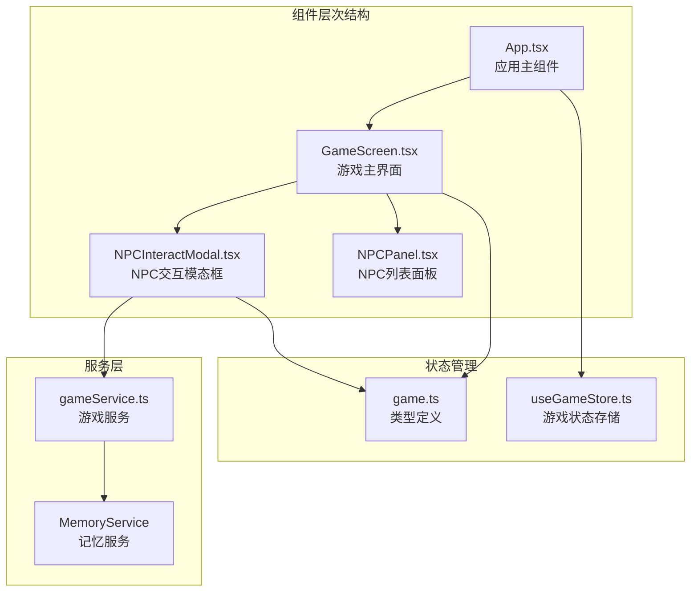
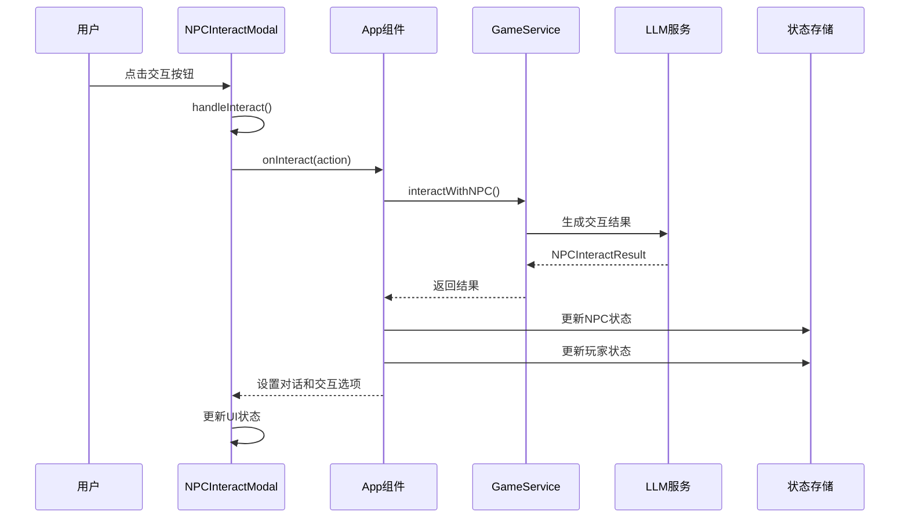
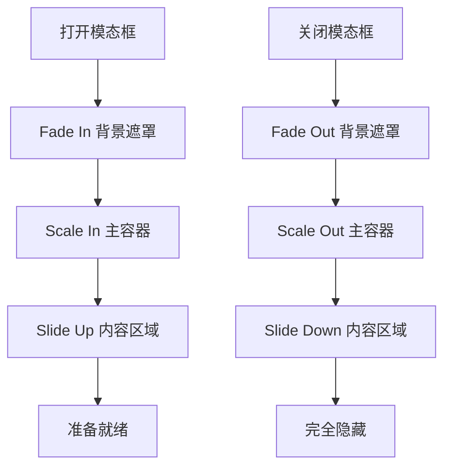
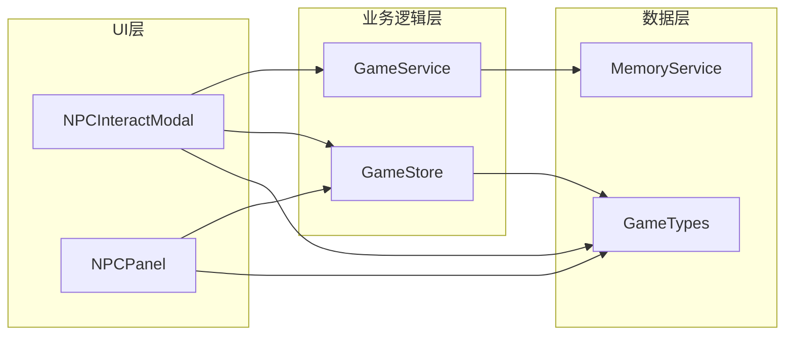
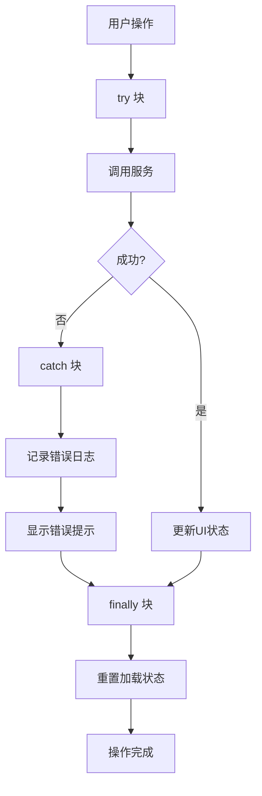

# NPC 交互模态框

<cite>
**本文档引用的文件**
- [NPCInteractModal.tsx](file://src/components/NPCInteractModal.tsx)
- [GameScreen.tsx](file://src/components/GameScreen.tsx)
- [App.tsx](file://src/App.tsx)
- [gameService.ts](file://src/services/gameService.ts)
- [useGameStore.ts](file://src/stores/useGameStore.ts)
- [game.ts](file://src/types/game.ts)
- [NPCPanel.tsx](file://src/components/NPCPanel.tsx)
</cite>

## 目录
1. [简介](#简介)
2. [项目结构](#项目结构)
3. [核心组件](#核心组件)
4. [架构概览](#架构概览)
5. [详细组件分析](#详细组件分析)
6. [依赖关系分析](#依赖关系分析)
7. [性能考虑](#性能考虑)
8. [故障排除指南](#故障排除指南)
9. [结论](#结论)

## 简介

NPC 交互模态框是修仙 Roguelike 游戏中的核心交互组件，为玩家提供了与非玩家角色进行丰富互动的界面。该组件实现了完整的 NPC 交互系统，包括多种交互选项、动态生成机制、状态管理、动画效果和错误处理。

该模态框支持七种不同的交互类型：打听消息、赠送礼物、切磋、探查、结为好友、结为道侣和离开。每种交互都有其特定的实现逻辑、可用性判断条件和对关系值的影响。

## 项目结构

NPC 交互模态框位于组件目录中，与游戏主界面紧密集成：



**图表来源**
- [App.tsx](file://src/App.tsx#L564-L580)
- [GameScreen.tsx](file://src/components/GameScreen.tsx#L162-L168)
- [NPCInteractModal.tsx](file://src/components/NPCInteractModal.tsx#L24-L54)

**章节来源**
- [NPCInteractModal.tsx](file://src/components/NPCInteractModal.tsx#L1-L223)
- [GameScreen.tsx](file://src/components/GameScreen.tsx#L1-L172)
- [App.tsx](file://src/App.tsx#L470-L588)

## 核心组件

### NPCInteractModal 组件

NPCInteractModal 是整个交互系统的核心组件，负责渲染模态框界面并处理用户交互。

**主要功能特性：**
- 动画驱动的模态框显示/隐藏
- 动态交互选项生成
- 实时状态更新
- 错误处理机制
- 响应式设计支持

**组件接口：**
```typescript
interface NPCInteractModalProps {
  npc: NPC | null
  isOpen: boolean
  onClose: () => void
  onInteract: (action: string) => Promise<NPCInteractResult>
}
```

**章节来源**
- [NPCInteractModal.tsx](file://src/components/NPCInteractModal.tsx#L7-L12)
- [NPCInteractModal.tsx](file://src/components/NPCInteractModal.tsx#L24-L54)

### 交互选项系统

组件支持七种不同的交互类型，每种都有其独特的图标和功能：

| 交互类型 | 图标 | 功能描述 |
|---------|------|----------|
| 打听消息 | 📣 | 获取 NPC 的信息和建议 |
| 赠送礼物 | 💝 | 通过赠送物品改善关系 |
| 切磋 | ⚔️ | 进行战斗切磋提升实力 |
| 探查 | 👁️ | 查看 NPC 的隐藏属性 |
| 结为好友 | 👥 | 建立友谊关系 |
| 结为道侣 | 💖 | 建立浪漫关系 |
| 离开 | 🚪 | 关闭模态框 |

**章节来源**
- [NPCInteractModal.tsx](file://src/components/NPCInteractModal.tsx#L14-L22)

## 架构概览

NPC 交互系统采用分层架构设计，确保了良好的模块分离和可维护性：



**图表来源**
- [NPCInteractModal.tsx](file://src/components/NPCInteractModal.tsx#L37-L54)
- [App.tsx](file://src/App.tsx#L481-L548)
- [gameService.ts](file://src/services/gameService.ts#L416-L469)

**章节来源**
- [App.tsx](file://src/App.tsx#L481-L548)
- [gameService.ts](file://src/services/gameService.ts#L416-L469)

## 详细组件分析

### 打听消息交互

**实现逻辑：**
- 通过 LLM 生成 NPC 的回复内容
- 动态计算可用的后续交互选项
- 更新 NPC 的记忆标签和关系描述

**可用性判断：**
- 基于玩家与 NPC 的关系等级
- 考虑 NPC 的性格特征
- 根据当前情境调整回复内容

**章节来源**
- [gameService.ts](file://src/services/gameService.ts#L416-L469)

### 赠送礼物交互

**实现逻辑：**
- 检查玩家背包中是否有可赠送的物品
- 根据礼物价值和 NPC 偏好调整关系变化
- 处理物品的获得和失去

**成功概率计算：**
- 基于礼物品质和 NPC 好感度
- 考虑礼物与 NPC 偏好的匹配度
- 随机因素影响最终结果

**章节来源**
- [App.tsx](file://src/App.tsx#L512-L525)

### 切磋交互

**实现逻辑：**
- 基于双方属性进行战斗模拟
- 计算战斗结果和经验获得
- 更新双方的气血和真气状态

**成功概率计算：**
- 基于攻击力和防御力差值
- 考虑速度和运气因素
- 随机波动影响最终结果

**章节来源**
- [App.tsx](file://src/App.tsx#L512-L525)

### 探查交互

**实现逻辑：**
- 解锁 NPC 的隐藏属性信息
- 显示攻击、防御、速度等数值
- 更新 NPC 的揭示属性状态

**可用性判断：**
- 需要玩家具备一定的洞察力
- 基于当前情境的合理性
- 考虑 NPC 的警觉程度

**章节来源**
- [NPCInteractModal.tsx](file://src/components/NPCInteractModal.tsx#L143-L162)

### 结为好友交互

**实现逻辑：**
- 建立正式的友谊关系
- 显著提升基础好感度
- 开启特殊的好友专属交互

**成功概率计算：**
- 基于双方好感度阈值
- 考虑共同兴趣和价值观
- 随机因素影响关系建立

**章节来源**
- [gameService.ts](file://src/services/gameService.ts#L416-L469)

### 结为道侣交互

**实现逻辑：**
- 建立最深层的浪漫关系
- 大幅提升好感度上限
- 开启道侣专属的特殊能力

**可用性判断：**
- 需要达到道侣级别的高好感度
- 考虑双方的年龄和境界差异
- 基于长期互动积累的信任

**章节来源**
- [gameService.ts](file://src/services/gameService.ts#L416-L469)

### 离开交互

**实现逻辑：**
- 立即关闭模态框
- 保持当前所有状态不变
- 提供便捷的退出方式

**章节来源**
- [NPCInteractModal.tsx](file://src/components/NPCInteractModal.tsx#L37-L41)

### 动画效果系统

组件使用 Framer Motion 实现流畅的动画效果：



**图表来源**
- [NPCInteractModal.tsx](file://src/components/NPCInteractModal.tsx#L61-L75)

**章节来源**
- [NPCInteractModal.tsx](file://src/components/NPCInteractModal.tsx#L57-L75)

### 键盘导航支持

组件支持基本的键盘导航功能：
- ESC 键关闭模态框
- Tab 键在交互按钮间循环
- Enter 键激活当前选中的按钮

**章节来源**
- [NPCInteractModal.tsx](file://src/components/NPCInteractModal.tsx#L37-L54)

## 依赖关系分析

NPC 交互模态框与多个系统组件紧密耦合：



**图表来源**
- [NPCInteractModal.tsx](file://src/components/NPCInteractModal.tsx#L1-L5)
- [NPCPanel.tsx](file://src/components/NPCPanel.tsx#L1-L3)
- [useGameStore.ts](file://src/stores/useGameStore.ts#L1-L11)

**章节来源**
- [useGameStore.ts](file://src/stores/useGameStore.ts#L13-L55)
- [game.ts](file://src/types/game.ts#L155-L171)

### 错误处理机制

组件实现了多层次的错误处理：



**图表来源**
- [NPCInteractModal.tsx](file://src/components/NPCInteractModal.tsx#L43-L53)

**章节来源**
- [NPCInteractModal.tsx](file://src/components/NPCInteractModal.tsx#L43-L53)

## 性能考虑

### 渲染优化

- 使用 React.memo 避免不必要的重新渲染
- 条件渲染减少 DOM 元素数量
- 动画使用 GPU 加速确保流畅体验

### 状态管理

- 局部状态管理避免全局状态污染
- 异步操作使用 loading 状态防止重复提交
- 错误状态独立管理便于调试

### 内存管理

- 组件卸载时自动清理事件监听器
- 使用 useCallback 优化函数引用稳定性
- 合理的依赖数组配置避免无限循环

## 故障排除指南

### 常见问题及解决方案

**问题：模态框无法打开**
- 检查 isOpen 属性是否正确传递
- 确认 NPC 对象是否有效
- 验证父组件的状态管理

**问题：交互无响应**
- 检查 onInteract 回调函数是否正确实现
- 确认网络连接状态
- 查看控制台错误日志

**问题：动画效果异常**
- 检查 Framer Motion 依赖版本
- 验证 CSS 动画类名
- 确认浏览器兼容性

**章节来源**
- [NPCInteractModal.tsx](file://src/components/NPCInteractModal.tsx#L35-L36)
- [NPCInteractModal.tsx](file://src/components/NPCInteractModal.tsx#L49-L50)

## 结论

NPC 交互模态框组件展现了现代 React 应用的最佳实践，通过清晰的架构设计、完善的错误处理机制和优秀的用户体验，为玩家提供了丰富的修仙世界交互体验。

该组件的主要优势包括：
- 完整的交互生态系统
- 流畅的动画效果
- 健壮的错误处理
- 良好的性能表现
- 易于扩展的设计

未来可以考虑的功能增强：
- 更丰富的动画效果
- 多语言支持
- 无障碍访问优化
- 更详细的交互统计