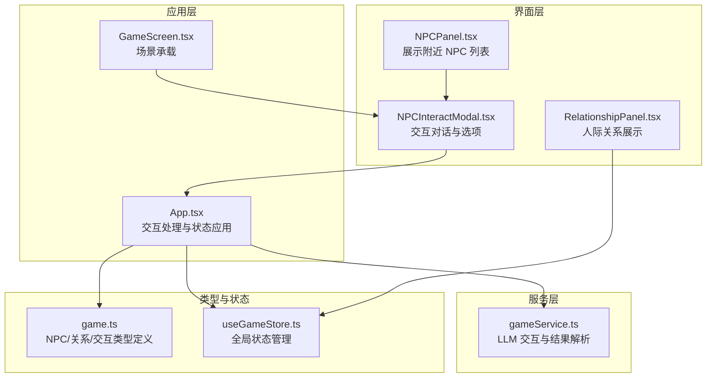
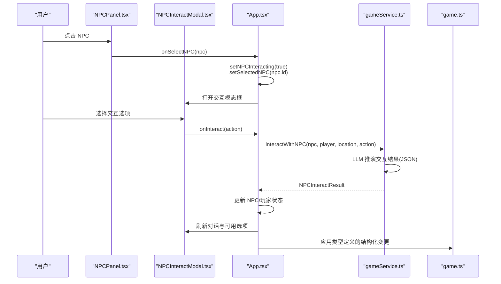
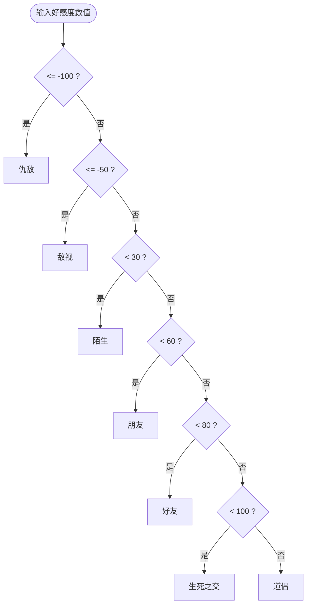
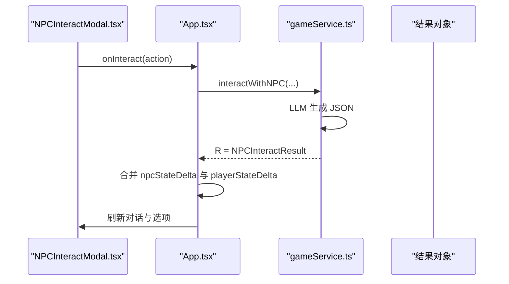
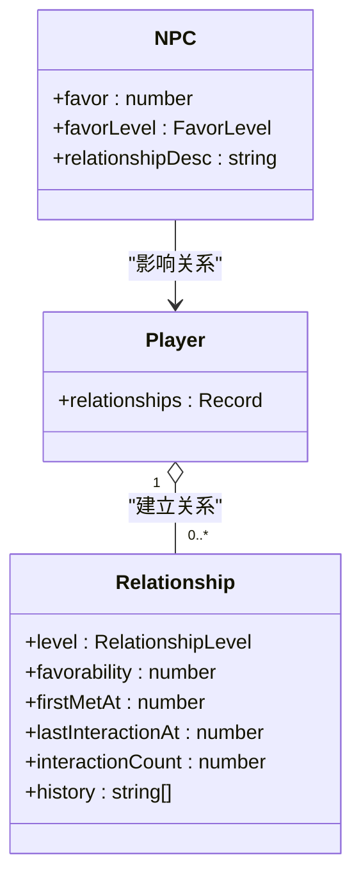
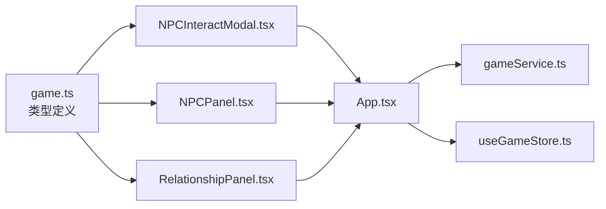

# NPC 交互系统

<cite>
**本文档引用的文件**
- [NPCInteractModal.tsx](file://src/components/NPCInteractModal.tsx)
- [NPCPanel.tsx](file://src/components/NPCPanel.tsx)
- [RelationshipPanel.tsx](file://src/components/RelationshipPanel.tsx)
- [game.ts](file://src/types/game.ts)
- [gameService.ts](file://src/services/gameService.ts)
- [useGameStore.ts](file://src/stores/useGameStore.ts)
- [App.tsx](file://src/App.tsx)
- [GameScreen.tsx](file://src/components/GameScreen.tsx)
</cite>

## 目录
1. [简介](#简介)
2. [项目结构](#项目结构)
3. [核心组件](#核心组件)
4. [架构总览](#架构总览)
5. [详细组件分析](#详细组件分析)
6. [依赖关系分析](#依赖关系分析)
7. [性能考虑](#性能考虑)
8. [故障排除指南](#故障排除指南)
9. [结论](#结论)

## 简介
本文件系统性梳理了仙侠 Roguelike 游戏中的 NPC 交互系统，覆盖交互选项类型、触发条件、好感度系统设计、状态变化机制、关系网络建立、交互对剧情的影响，以及物品交换与战斗切磋的数值平衡思路。文档同时提供策略建议与最佳实践，帮助开发者与玩家更好地理解和运用该系统。

## 项目结构
NPC 交互系统由前端 UI 组件、类型定义、服务层与状态管理共同构成，形成“选择 NPC → 打开交互模态 → 发送交互请求 → LLM 推演结果 → 应用状态变更”的闭环。

图表来源
- [NPCPanel.tsx](file://src/components/NPCPanel.tsx#L1-L99)
- [NPCInteractModal.tsx](file://src/components/NPCInteractModal.tsx#L1-L223)
- [RelationshipPanel.tsx](file://src/components/RelationshipPanel.tsx#L1-L104)
- [App.tsx](file://src/App.tsx#L470-L588)
- [GameScreen.tsx](file://src/components/GameScreen.tsx#L146-L171)
- [gameService.ts](file://src/services/gameService.ts#L415-L469)
- [game.ts](file://src/types/game.ts#L155-L285)
- [useGameStore.ts](file://src/stores/useGameStore.ts#L84-L225)

章节来源
- [NPCPanel.tsx](file://src/components/NPCPanel.tsx#L1-L99)
- [NPCInteractModal.tsx](file://src/components/NPCInteractModal.tsx#L1-L223)
- [RelationshipPanel.tsx](file://src/components/RelationshipPanel.tsx#L1-L104)
- [game.ts](file://src/types/game.ts#L155-L285)
- [gameService.ts](file://src/services/gameService.ts#L415-L469)
- [useGameStore.ts](file://src/stores/useGameStore.ts#L84-L225)
- [App.tsx](file://src/App.tsx#L470-L588)
- [GameScreen.tsx](file://src/components/GameScreen.tsx#L146-L171)

## 核心组件
- NPC 交互模态框：负责渲染 NPC 基本信息、好感度条、对话区域与交互选项，支持动态刷新与加载状态。
- NPC 列表面板：展示附近 NPC，点击进入交互模式。
- 关系面板：展示玩家已建立的人际关系，含关系等级与图标。
- 类型定义：统一定义 NPC、交互类型、关系等级、交互结果等数据结构。
- 服务层：封装与 LLM 的交互，解析 JSON 结果并返回标准化的交互结果对象。
- 状态管理：维护玩家、NPC、世界、日志、事件、记忆等状态，并提供交互相关状态切换。

章节来源
- [NPCInteractModal.tsx](file://src/components/NPCInteractModal.tsx#L1-L223)
- [NPCPanel.tsx](file://src/components/NPCPanel.tsx#L1-L99)
- [RelationshipPanel.tsx](file://src/components/RelationshipPanel.tsx#L1-L104)
- [game.ts](file://src/types/game.ts#L155-L285)
- [gameService.ts](file://src/services/gameService.ts#L415-L469)
- [useGameStore.ts](file://src/stores/useGameStore.ts#L84-L225)

## 架构总览
NPC 交互采用“UI 触发 → 服务层调用 LLM → 返回结构化结果 → 应用层合并状态”的分层设计。交互选项通过模态框动态生成，服务层负责与 LLM 协作生成对话与状态变更，应用层负责将结果写入全局状态并驱动 UI 更新。

图表来源
- [NPCPanel.tsx](file://src/components/NPCPanel.tsx#L64-L93)
- [NPCInteractModal.tsx](file://src/components/NPCInteractModal.tsx#L37-L54)
- [App.tsx](file://src/App.tsx#L481-L548)
- [gameService.ts](file://src/services/gameService.ts#L416-L469)
- [game.ts](file://src/types/game.ts#L265-L285)

## 详细组件分析

### NPC 交互选项类型与触发条件
- 选项类型
  - 打听消息：获取 NPC 的背景、知识或线索。
  - 赠送礼物：基于玩家库存中的物品进行交换，影响好感度与可能获得回报。
  - 切磋：进行战斗切磋，受双方属性与技能影响，可能提升经验或获得物品。
  - 探查：查看 NPC 的隐藏属性（攻击、防御、速度等）。
  - 结为好友：建立更深层的关系，通常需要较高好感度与特定条件。
  - 结为道侣：最高层级关系，需满足严格的好感度与剧情条件。
  - 离开：结束当前交互。
- 触发条件
  - 选项可用性由服务层返回的交互结果决定，UI 层根据结果动态启用/禁用按钮，并显示不可用原因。
  - 部分选项可能受玩家状态（如物品、技能、时间）或 NPC 状态（如是否已探查）限制。

章节来源
- [NPCInteractModal.tsx](file://src/components/NPCInteractModal.tsx#L14-L22)
- [NPCInteractModal.tsx](file://src/components/NPCInteractModal.tsx#L171-L214)
- [game.ts](file://src/types/game.ts#L155-L171)

### 好感度系统设计
- 数值范围：-100 到 100，整数。
- 等级划分与映射
  - 仇敌：≤ -100
  - 敌视：≤ -50
  - 陌生：< 30
  - 朋友：< 60
  - 好友：< 80
  - 生死之交：< 100
  - 道侣：= 100
- 颜色与图标
  - 颜色：随区间映射不同颜色，用于 UI 强化情感反馈。
  - 图标：随区间映射不同表情符号，直观表达关系亲疏。
- 等级计算函数：提供从数值到等级的映射，用于 UI 展示与状态判断。

图表来源
- [game.ts](file://src/types/game.ts#L287-L318)

章节来源
- [game.ts](file://src/types/game.ts#L43-L46)
- [game.ts](file://src/types/game.ts#L287-L318)
- [NPCPanel.tsx](file://src/components/NPCPanel.tsx#L87-L90)
- [NPCInteractModal.tsx](file://src/components/NPCInteractModal.tsx#L100-L117)

### NPC 状态变化机制
- 交互结果结构化
  - 对话文本：NPC 的回复。
  - 可用交互：下一轮可选的交互列表。
  - NPC 状态增量：包括好感度变化、记忆标签追加、属性揭示、关系描述更新等。
  - 玩家状态增量：包括气血、真气变化、获得/失去物品等。
  - 时间推进：交互可能消耗时间，影响玩家寿命与年龄。
  - 剧情更新：可能产生新的故事片段。
- 应用流程
  - 服务层解析 LLM 输出为结构化对象。
  - 应用层根据增量更新 NPC 与玩家状态，刷新 UI。
  - 记忆系统记录交互事件，供后续剧情检索。

图表来源
- [NPCInteractModal.tsx](file://src/components/NPCInteractModal.tsx#L37-L54)
- [App.tsx](file://src/App.tsx#L481-L548)
- [gameService.ts](file://src/services/gameService.ts#L416-L469)

章节来源
- [game.ts](file://src/types/game.ts#L265-L285)
- [gameService.ts](file://src/services/gameService.ts#L416-L469)
- [App.tsx](file://src/App.tsx#L493-L547)

### 关系网络的建立过程
- 初始状态：NPC 初始好感度为 0（陌生），关系描述为空。
- 交互影响：每次交互可能改变 NPC 好感度，进而影响其等级与 UI 表现。
- 关系面板：展示玩家已建立的关系，包含关系等级、图标、描述与历史。
- 关系更新：当服务层返回新的关系更新时，应用层将其合并至玩家关系表。

图表来源
- [game.ts](file://src/types/game.ts#L94-L108)
- [game.ts](file://src/types/game.ts#L173-L203)
- [RelationshipPanel.tsx](file://src/components/RelationshipPanel.tsx#L12-L42)

章节来源
- [game.ts](file://src/types/game.ts#L94-L108)
- [RelationshipPanel.tsx](file://src/components/RelationshipPanel.tsx#L1-L104)
- [App.tsx](file://src/App.tsx#L371-L408)

### 交互对剧情发展的影响
- 记忆记录：每次 NPC 交互都会被记录到记忆系统，作为后续剧情推演的上下文。
- 剧情更新：交互可能产生新的故事片段，写入日志系统。
- 时间与寿命：交互可能消耗时间，影响玩家寿命与年龄，间接推动剧情节奏。

章节来源
- [gameService.ts](file://src/services/gameService.ts#L461-L468)
- [App.tsx](file://src/App.tsx#L527-L545)

### 交互成功率与物品交换规则
- 成功率：由 LLM 在交互推演阶段综合考虑双方属性、关系等级、交互类型等因素决定，最终以结构化结果的形式返回。
- 物品交换：服务层返回的“获得/失去物品”字段控制玩家库存变更，UI 层据此更新。
- 战斗切磋：服务层返回的“气血/真气变化”与“物品增减”字段控制战斗结果，应用层据此更新玩家状态。

章节来源
- [gameService.ts](file://src/services/gameService.ts#L447-L459)
- [App.tsx](file://src/App.tsx#L513-L525)

### 战斗切磋的数值平衡
- 影响因素：双方属性（攻击、防御、速度等）、技能等级、气运、悟性等。
- 结果体现：服务层返回的“气血/真气变化”与“物品增减”字段用于平衡胜负与收益。
- 建议：通过调整属性权重与概率分布，确保不同职业与成长路径的平衡性。

章节来源
- [game.ts](file://src/types/game.ts#L142-L153)
- [gameService.ts](file://src/services/gameService.ts#L447-L459)

## 依赖关系分析
- 组件耦合
  - NPCInteractModal 依赖类型定义中的交互类型与 UI 组件库，负责渲染与交互。
  - App 作为协调者，连接 UI、服务层与状态管理。
  - RelationshipPanel 依赖类型定义中的关系模型，负责展示关系状态。
- 数据流
  - 输入：玩家、NPC、当前地点、交互动作。
  - 处理：服务层调用 LLM，解析 JSON，返回结构化结果。
  - 输出：UI 更新、状态持久化、日志与记忆记录。

图表来源
- [game.ts](file://src/types/game.ts#L155-L285)
- [NPCInteractModal.tsx](file://src/components/NPCInteractModal.tsx#L1-L223)
- [NPCPanel.tsx](file://src/components/NPCPanel.tsx#L1-L99)
- [RelationshipPanel.tsx](file://src/components/RelationshipPanel.tsx#L1-L104)
- [App.tsx](file://src/App.tsx#L470-L588)
- [useGameStore.ts](file://src/stores/useGameStore.ts#L84-L225)
- [gameService.ts](file://src/services/gameService.ts#L415-L469)

章节来源
- [game.ts](file://src/types/game.ts#L155-L285)
- [NPCInteractModal.tsx](file://src/components/NPCInteractModal.tsx#L1-L223)
- [NPCPanel.tsx](file://src/components/NPCPanel.tsx#L1-L99)
- [RelationshipPanel.tsx](file://src/components/RelationshipPanel.tsx#L1-L104)
- [App.tsx](file://src/App.tsx#L470-L588)
- [useGameStore.ts](file://src/stores/useGameStore.ts#L84-L225)
- [gameService.ts](file://src/services/gameService.ts#L415-L469)

## 性能考虑
- LLM 调用成本：交互涉及 LLM 生成，应控制温度与响应格式，减少不必要的重复调用。
- UI 渲染优化：使用动画库按需渲染，避免频繁重排。
- 状态更新：批量合并状态变更，减少多次重渲染。
- 存储与持久化：仅持久化必要字段，避免冗余数据。

## 故障排除指南
- 交互失败
  - 现象：模态框报错或无响应。
  - 排查：检查服务层初始化与 LLM 配置，确认交互参数（NPC、玩家、位置）齐全。
- 选项不可用
  - 现象：交互按钮被禁用并显示原因。
  - 排查：检查服务层返回的交互结果与 UI 的启用逻辑。
- 好感度异常
  - 现象：等级与数值不匹配或图标颜色异常。
  - 排查：核对等级映射函数与 UI 颜色/图标映射。

章节来源
- [NPCInteractModal.tsx](file://src/components/NPCInteractModal.tsx#L49-L53)
- [gameService.ts](file://src/services/gameService.ts#L422-L424)
- [game.ts](file://src/types/game.ts#L287-L318)

## 结论
NPC 交互系统通过清晰的类型定义、模块化的 UI 组件、服务层的 LLM 推演与应用层的状态合并，实现了从“选择 NPC → 交互 → 结果 → 状态更新”的完整闭环。好感度系统以明确的数值区间与等级映射提供直观反馈，关系网络与剧情记录则增强了沉浸感与可追踪性。建议在实际开发中持续优化交互成功率与数值平衡，确保不同玩法路径的公平性与趣味性。