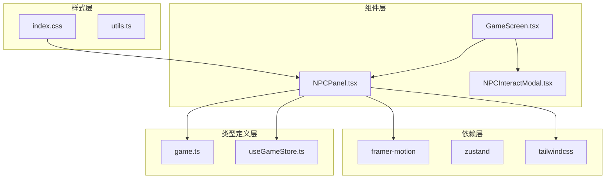
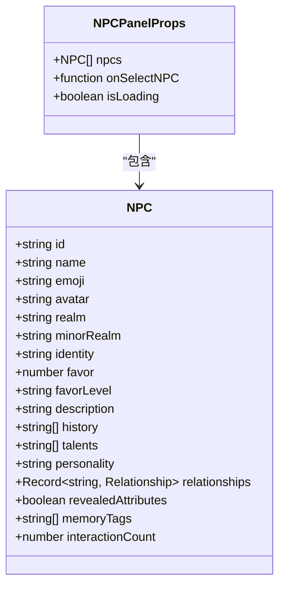
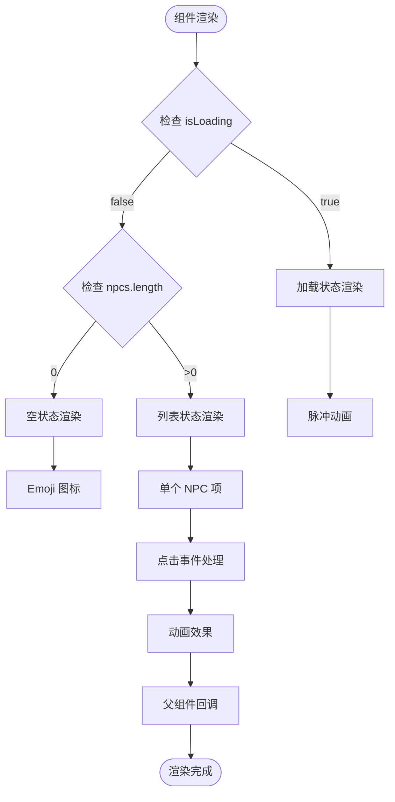
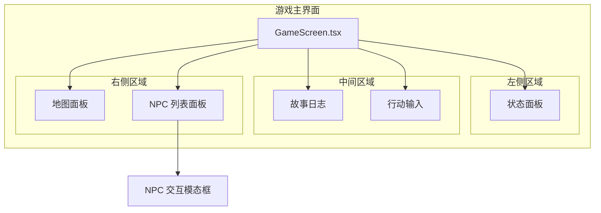
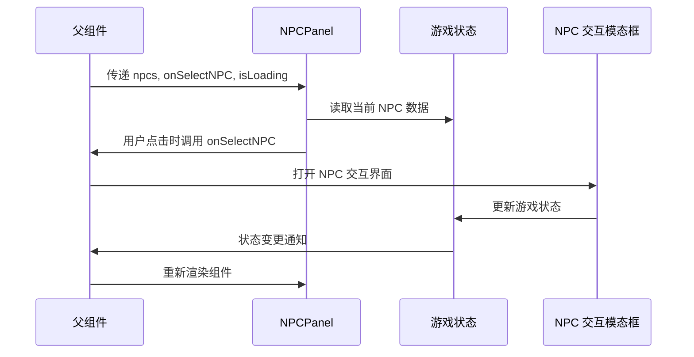
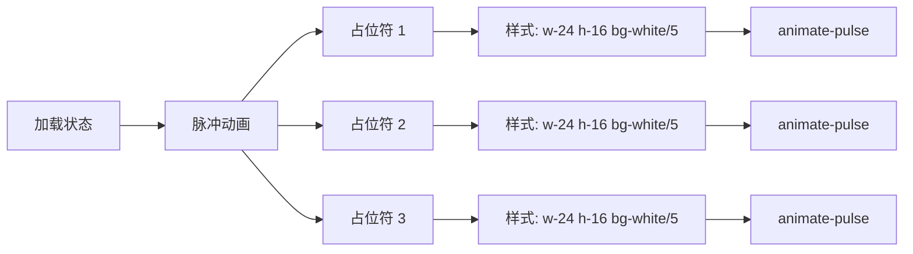
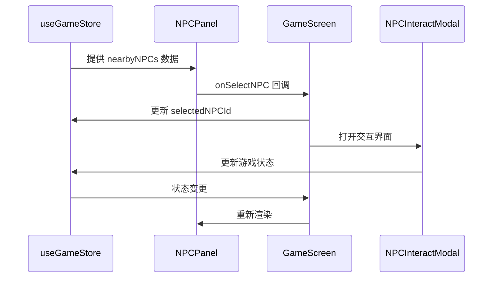
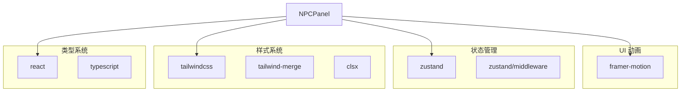
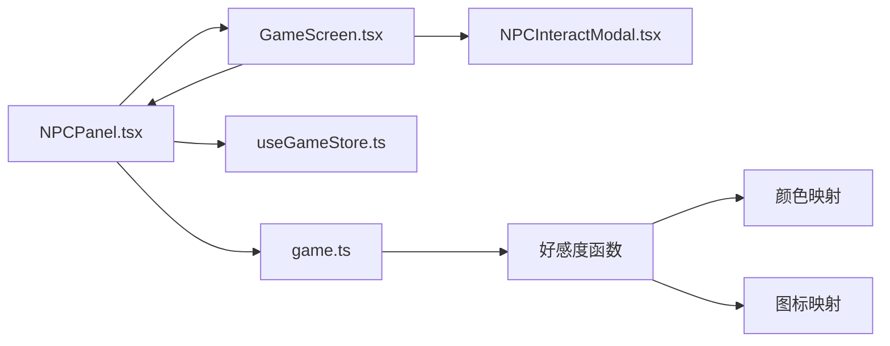

# NPC 列表面板

<cite>
**本文档引用的文件**
- [NPCPanel.tsx](file://src/components/NPCPanel.tsx)
- [game.ts](file://src/types/game.ts)
- [useGameStore.ts](file://src/stores/useGameStore.ts)
- [GameScreen.tsx](file://src/components/GameScreen.tsx)
- [index.css](file://src/index.css)
- [package.json](file://package.json)
</cite>

## 目录
1. [简介](#简介)
2. [项目结构](#项目结构)
3. [核心组件](#核心组件)
4. [架构概览](#架构概览)
5. [详细组件分析](#详细组件分析)
6. [依赖关系分析](#依赖关系分析)
7. [性能考虑](#性能考虑)
8. [故障排除指南](#故障排除指南)
9. [结论](#结论)

## 简介

NPC 列表面板是修仙 Roguelike 游戏中的重要 UI 组件，负责展示当前场景中可交互的 NPC 列表。该组件提供了完整的加载状态管理、空状态处理、NPC 信息展示和用户交互功能，是玩家探索游戏世界、进行角色互动的核心界面元素。

## 项目结构

NPCPanel 组件位于组件目录中，采用独立的功能模块设计，与其他 UI 组件通过 props 和状态管理进行解耦集成。



**图表来源**
- [NPCPanel.tsx](file://src/components/NPCPanel.tsx#L1-L99)
- [GameScreen.tsx](file://src/components/GameScreen.tsx#L1-L172)
- [game.ts](file://src/types/game.ts#L173-L203)

**章节来源**
- [NPCPanel.tsx](file://src/components/NPCPanel.tsx#L1-L99)
- [GameScreen.tsx](file://src/components/GameScreen.tsx#L1-L172)

## 核心组件

### Props 接口定义

NPCPanel 组件通过清晰的接口定义接收外部数据和回调函数：



**图表来源**
- [NPCPanel.tsx](file://src/components/NPCPanel.tsx#L5-L9)
- [game.ts](file://src/types/game.ts#L173-L203)

### 渲染逻辑架构

组件采用条件渲染策略，针对不同状态提供相应的 UI 呈现：



**图表来源**
- [NPCPanel.tsx](file://src/components/NPCPanel.tsx#L11-L98)

**章节来源**
- [NPCPanel.tsx](file://src/components/NPCPanel.tsx#L5-L99)

## 架构概览

### 组件层次结构

NPCPanel 在游戏界面中作为右侧边栏的重要组成部分，与状态面板、故事日志等其他组件协同工作：



**图表来源**
- [GameScreen.tsx](file://src/components/GameScreen.tsx#L107-L153)

### 数据流架构

组件通过状态管理与父组件建立双向数据流：



**图表来源**
- [NPCPanel.tsx](file://src/components/NPCPanel.tsx#L11-L98)
- [GameScreen.tsx](file://src/components/GameScreen.tsx#L147-L151)

**章节来源**
- [GameScreen.tsx](file://src/components/GameScreen.tsx#L15-L172)

## 详细组件分析

### 加载状态处理

当组件检测到加载状态时，会渲染占位符界面：



**图表来源**
- [NPCPanel.tsx](file://src/components/NPCPanel.tsx#L12-L31)

### 空状态处理

当没有可交互的 NPC 时，组件显示友好的提示信息：

```mermaid
flowchart TD
EmptyState[空状态] --> CenterLayout[居中布局]
CenterLayout --> EmojiIcon[👤 Emoji 图标]
CenterLayout --> TextContent[文本内容]
EmojiIcon --> OpacityStyle[opacity-30]
TextContent --> FriendlyText[此地暂无其他修士]
CenterLayout --> Container[py-4 容器]
Container --> ContainerStyle[文本样式: text-[hsl(var(--dim))]]
```

**图表来源**
- [NPCPanel.tsx](file://src/components/NPCPanel.tsx#L33-L48)

### NPC 列表展示

主要的列表渲染逻辑包含以下特性：

#### 响应式布局
- 使用 `flex-1 min-h-0` 实现自适应高度
- `overflow-y-auto` 支持垂直滚动
- `scrollbar-thin` 自定义滚动条样式

#### 动画效果
- `framer-motion` 提供流畅的入场动画
- 每个列表项有 0.1 秒的延迟序列动画
- `initial={{ opacity: 0, x: 10 }}` 初始状态
- `animate={{ opacity: 1, x: 0 }}` 动画完成状态

#### 交互反馈
- `hover:bg-white/10` 悬停效果
- `active:scale-95` 点击反馈
- `transition-all duration-200` 平滑过渡

**章节来源**
- [NPCPanel.tsx](file://src/components/NPCPanel.tsx#L50-L98)

### NPC 信息展示格式

组件按照特定的格式展示 NPC 信息：

```mermaid
graph LR
NPCItem[NPC 项目容器] --> EmojiColumn[表情符号列]
NPCItem --> InfoColumn[信息列]
NPCItem --> FavorColumn[好感度列]
EmojiColumn --> EmojiSize[text-2xl]
EmojiColumn --> ShadowEffect[filter drop-shadow-sm]
InfoColumn --> NameRow[姓名行]
InfoColumn --> RealmRow[境界行]
NameRow --> NameStyle[font-medium text-sm text-foreground/90]
NameRow --> Truncate[truncate]
RealmRow --> RealmStyle[text-xs text-[hsl(var(--dim))]]
RealmRow --> RealmSeparator[· 分隔符]
FavorColumn --> FavorIcon[好感度图标]
FavorColumn --> FavorColor[动态颜色]
FavorIcon --> FavorSize[text-lg]
FavorColor --> ColorMapping[颜色映射]
```

**图表来源**
- [NPCPanel.tsx](file://src/components/NPCPanel.tsx#L74-L90)

#### 好感度系统

好感度通过三个维度进行展示：

1. **数值范围**: -100 到 100
2. **颜色映射**: 根据数值自动选择对应的颜色
3. **图标表示**: 使用 Emoji 表达不同的情感状态

**章节来源**
- [game.ts](file://src/types/game.ts#L287-L318)

### 交互行为

#### 点击选择机制
- 每个 NPC 项都是独立的可点击按钮
- 点击事件通过 `onSelectNPC` 回调传递给父组件
- 支持键盘导航和屏幕阅读器访问

#### 动画效果
- 入场动画: 从右侧滑入，透明度从 0 到 1
- 悬停效果: 背景色渐变，边框高亮
- 点击反馈: 轻微缩放效果
- 序列动画: 每个列表项有 0.1 秒的时间差

#### 响应式布局
- 移动端适配: 滚动容器支持横向滚动
- 桌面端优化: 固定高度和滚动条
- 自适应宽度: 根据内容自动调整

**章节来源**
- [NPCPanel.tsx](file://src/components/NPCPanel.tsx#L65-L93)

### 状态管理集成

组件与全局状态管理系统的集成：



**图表来源**
- [useGameStore.ts](file://src/stores/useGameStore.ts#L84-L225)
- [GameScreen.tsx](file://src/components/GameScreen.tsx#L147-L151)

**章节来源**
- [useGameStore.ts](file://src/stores/useGameStore.ts#L13-L55)

## 依赖关系分析

### 外部依赖

组件依赖以下关键库：



**图表来源**
- [package.json](file://package.json#L15-L36)
- [NPCPanel.tsx](file://src/components/NPCPanel.tsx#L1-L2)

### 内部依赖

组件之间的依赖关系：



**图表来源**
- [NPCPanel.tsx](file://src/components/NPCPanel.tsx#L2-L3)
- [game.ts](file://src/types/game.ts#L287-L318)

**章节来源**
- [package.json](file://package.json#L1-L55)

## 性能考虑

### 渲染优化

1. **条件渲染**: 避免不必要的 DOM 结构创建
2. **虚拟滚动**: 对于大量 NPC 数据可考虑实现虚拟滚动
3. **记忆化**: 使用 React.memo 防止不必要的重渲染
4. **懒加载**: 滚动时按需加载更多 NPC

### 动画性能

1. **硬件加速**: 使用 transform 和 opacity 属性
2. **动画节流**: 控制动画触发频率
3. **内存管理**: 及时清理动画监听器

### 状态管理优化

1. **状态分割**: 将 NPC 数据与交互状态分离
2. **选择器优化**: 使用 Reselect 或类似技术
3. **批量更新**: 合并多个状态更新操作

## 故障排除指南

### 常见问题

1. **NPC 数据不显示**
   - 检查 `nearbyNPCs` 是否正确传入
   - 验证 NPC 数据结构是否符合类型定义
   - 确认 `onSelectNPC` 回调函数是否正确绑定

2. **动画效果异常**
   - 确认 framer-motion 版本兼容性
   - 检查 CSS 动画冲突
   - 验证容器尺寸是否正确

3. **样式问题**
   - 检查 TailwindCSS 配置
   - 确认自定义 CSS 类名正确
   - 验证主题切换功能

### 调试建议

1. **开发工具**: 使用 React DevTools 检查组件树
2. **网络监控**: 检查数据加载状态
3. **控制台日志**: 添加必要的调试信息
4. **单元测试**: 编写组件测试用例

**章节来源**
- [NPCPanel.tsx](file://src/components/NPCPanel.tsx#L1-L99)

## 结论

NPC 列表面板是一个设计精良的 React 组件，具有以下特点：

1. **清晰的职责分离**: 专注于 NPC 列表展示，不承担业务逻辑
2. **优秀的用户体验**: 提供丰富的视觉反馈和动画效果
3. **良好的可扩展性**: 通过 Props 接口支持多种使用场景
4. **完善的错误处理**: 包含加载状态和空状态的优雅降级
5. **现代化的技术栈**: 结合了最新的前端开发实践

该组件为整个游戏的社交交互系统奠定了坚实的基础，通过与其他 UI 组件的协同工作，为玩家提供了沉浸式的修仙体验。