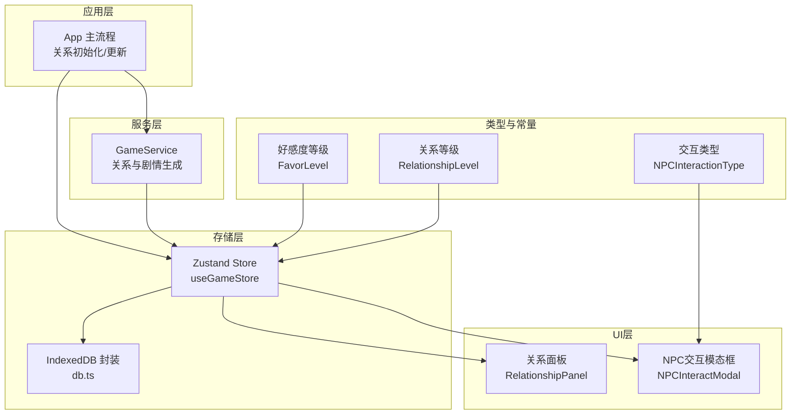
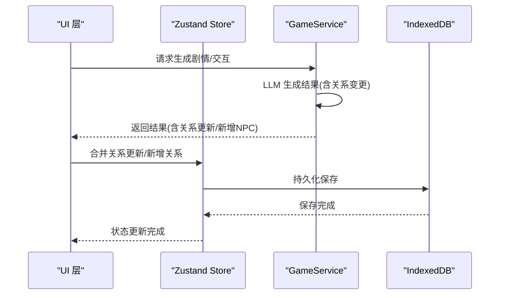
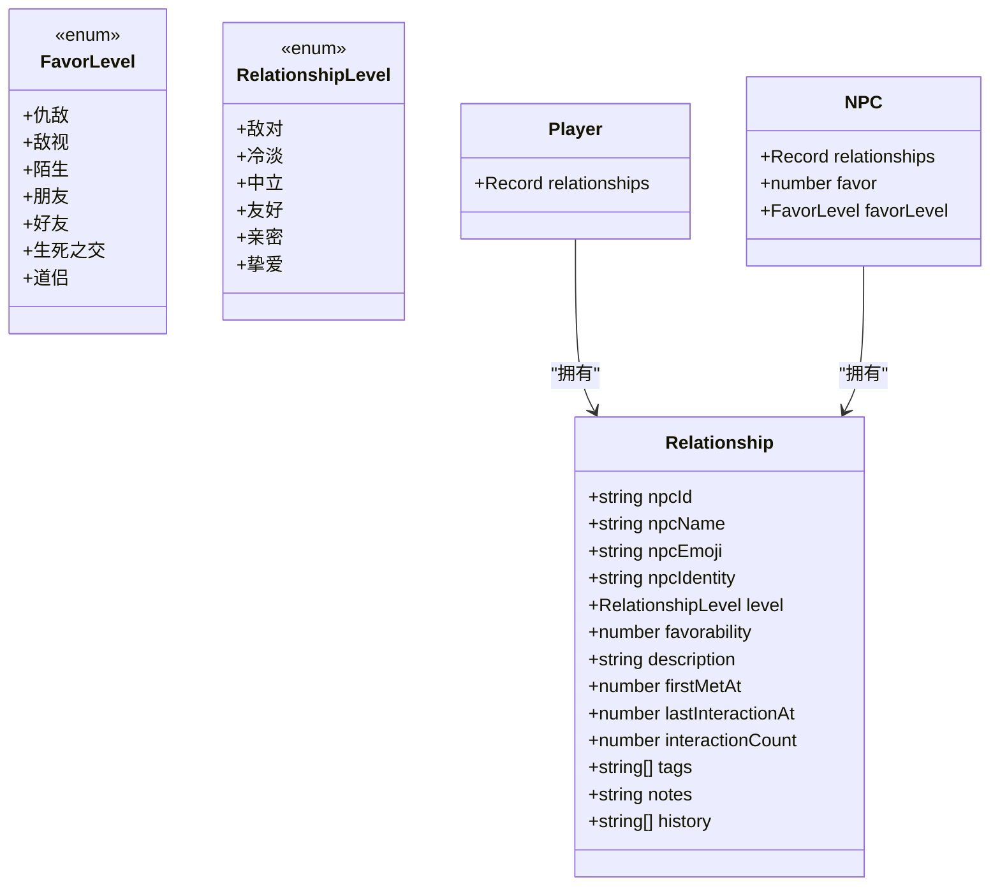
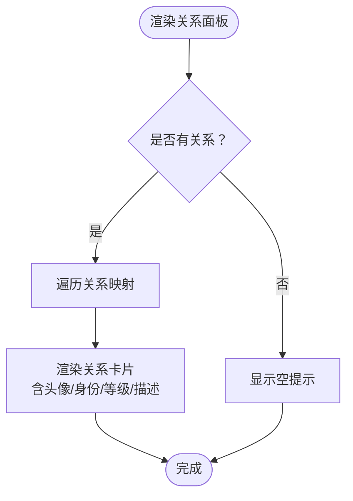
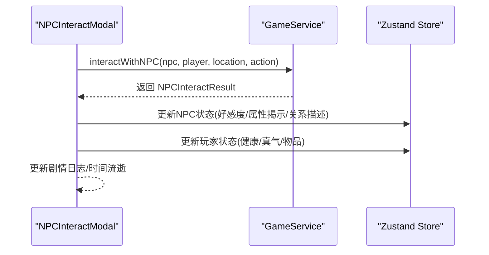
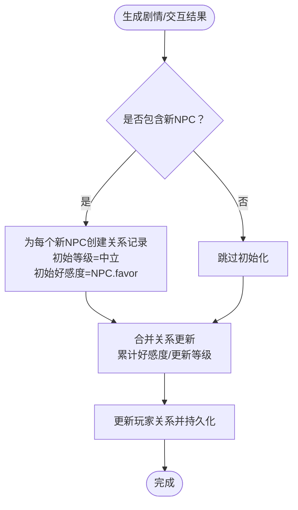
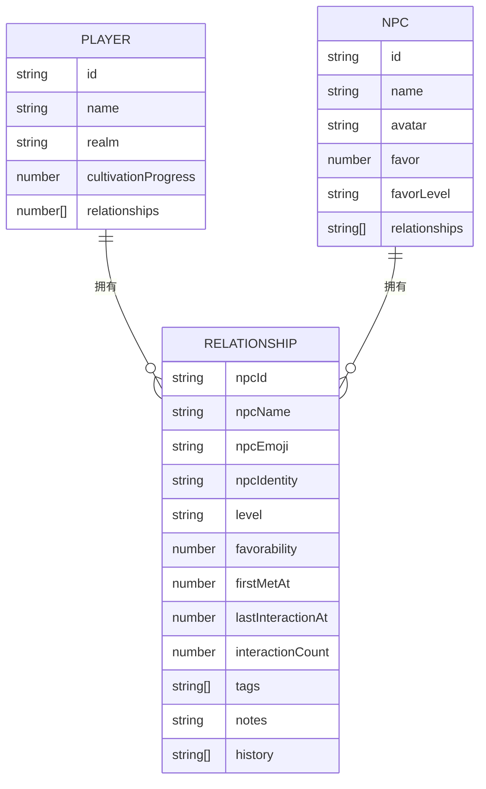
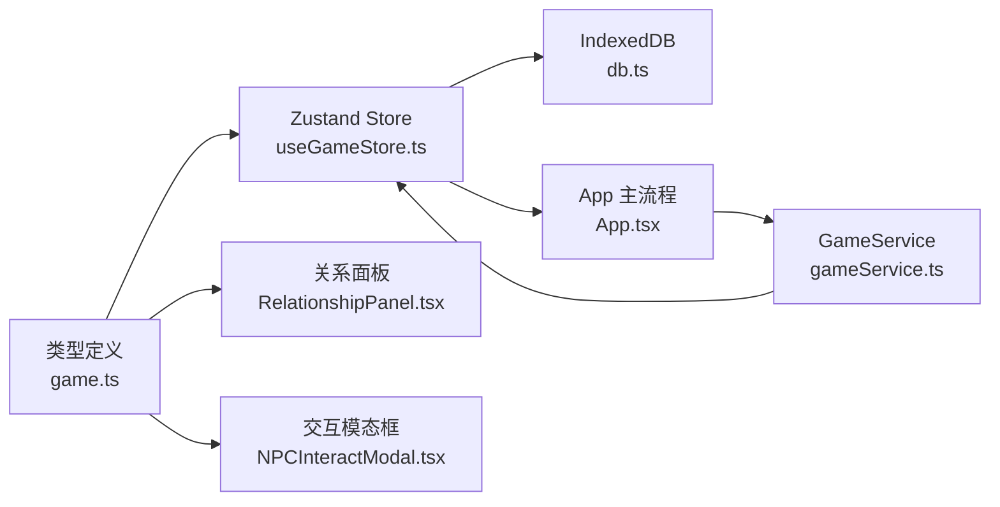

# 关系网络

<cite>
**本文引用的文件**
- [src\types\game.ts](file://src\types\game.ts)
- [src\components\RelationshipPanel.tsx](file://src\components\RelationshipPanel.tsx)
- [src\components\NPCInteractModal.tsx](file://src\components\NPCInteractModal.tsx)
- [src\services\gameService.ts](file://src\services\gameService.ts)
- [src\services\db.ts](file://src\services\db.ts)
- [src\stores\useGameStore.ts](file://src\stores\useGameStore.ts)
- [src\App.tsx](file://src\App.tsx)
</cite>

## 目录
1. [简介](#简介)
2. [项目结构](#项目结构)
3. [核心组件](#核心组件)
4. [架构总览](#架构总览)
5. [详细组件分析](#详细组件分析)
6. [依赖分析](#依赖分析)
7. [性能考虑](#性能考虑)
8. [故障排除指南](#故障排除指南)
9. [结论](#结论)
10. [附录](#附录)

## 简介
本文件系统化梳理“关系网络”在修仙roguelike游戏中的设计与实现，覆盖NPC关系的建立与维护机制、初始关系值设定、关系变化的传播与影响、关系等级与类型语义、UI呈现、持久化存储、查询与统计能力，以及对玩法的影响（交互选项、剧情解锁、事件触发）。文档同时提供最佳实践与策略建议，帮助开发者与策划高效扩展与优化关系系统。

## 项目结构
关系系统围绕以下模块协同工作：
- 类型与常量定义：统一关系等级、好感度等级、交互类型等语义
- 存储层：Zustand 状态管理 + IndexedDB 持久化
- 服务层：LLM 驱动的关系变化与剧情生成
- UI 层：关系面板展示、NPC 交互模态框
- 应用层：关系初始化、更新与传播



图表来源
- [src\types\game.ts](file://src\types\game.ts#L43-L46)
- [src\stores\useGameStore.ts](file://src\stores\useGameStore.ts#L13-L55)
- [src\services\db.ts](file://src\services\db.ts#L36-L72)
- [src\services\gameService.ts](file://src\services\gameService.ts#L50-L57)
- [src\components\RelationshipPanel.tsx](file://src\components\RelationshipPanel.tsx#L1-L103)
- [src\components\NPCInteractModal.tsx](file://src\components\NPCInteractModal.tsx#L1-L223)
- [src\App.tsx](file://src\App.tsx#L371-L423)

章节来源
- [src\types\game.ts](file://src\types\game.ts#L43-L46)
- [src\stores\useGameStore.ts](file://src\stores\useGameStore.ts#L84-L225)
- [src\services\db.ts](file://src\services\db.ts#L36-L72)
- [src\services\gameService.ts](file://src\services\gameService.ts#L50-L57)
- [src\components\RelationshipPanel.tsx](file://src\components\RelationshipPanel.tsx#L1-L103)
- [src\components\NPCInteractModal.tsx](file://src\components\NPCInteractModal.tsx#L1-L223)
- [src\App.tsx](file://src\App.tsx#L371-L423)

## 核心组件
- 关系数据模型：玩家与NPC之间的关系记录，包含关系等级、好感度、描述、首次/最近交互时间、交互次数、历史等
- 好感度系统：基于数值区间映射到等级，用于UI与交互可用性判断
- 关系面板：以卡片形式展示NPC关系，按关系等级着色与图标区分
- NPC 交互模态框：展示NPC信息、好感度条、交互选项，支持多种交互类型
- 关系更新与传播：剧情生成与NPC交互均可能改变关系，App 层负责合并与持久化

章节来源
- [src\types\game.ts](file://src\types\game.ts#L94-L108)
- [src\types\game.ts](file://src\types\game.ts#L181-L188)
- [src\types\game.ts](file://src\types\game.ts#L287-L318)
- [src\components\RelationshipPanel.tsx](file://src\components\RelationshipPanel.tsx#L11-L46)
- [src\components\NPCInteractModal.tsx](file://src\components\NPCInteractModal.tsx#L14-L22)
- [src\App.tsx](file://src\App.tsx#L371-L423)

## 架构总览
关系系统贯穿“类型定义 → 存储层 → 服务层 → UI层 → 应用层”的链路，LLM 驱动的剧情与交互结果通过 App 层合并到玩家关系数据中，并由 Zustand 管理，最终持久化到 IndexedDB。



图表来源
- [src\services\gameService.ts](file://src\services\gameService.ts#L283-L391)
- [src\App.tsx](file://src\App.tsx#L371-L423)
- [src\stores\useGameStore.ts](file://src\stores\useGameStore.ts#L84-L225)
- [src\services\db.ts](file://src\services\db.ts#L134-L150)

## 详细组件分析

### 数据模型与类型定义
- 关系等级（RelationshipLevel）：敌对、冷淡、中立、友好、亲密、挚爱
- 好感度等级（FavorLevel）：仇敌、敌视、陌生、朋友、好友、生死之交、道侣
- 关系记录（Relationship）：包含NPC标识、名称、头像、身份、关系等级、好感度、描述、首次/最近交互时间、交互次数、标签、备注、历史等
- NPC 关系字段：NPC 自身也维护与玩家的关系映射，便于交互时快速更新



图表来源
- [src\types\game.ts](file://src\types\game.ts#L43-L46)
- [src\types\game.ts](file://src\types\game.ts#L94-L108)
- [src\types\game.ts](file://src\types\game.ts#L181-L188)
- [src\types\game.ts](file://src\types\game.ts#L110-L139)

章节来源
- [src\types\game.ts](file://src\types\game.ts#L43-L46)
- [src\types\game.ts](file://src\types\game.ts#L94-L108)
- [src\types\game.ts](file://src\types\game.ts#L110-L139)
- [src\types\game.ts](file://src\types\game.ts#L181-L188)

### 关系面板（RelationshipPanel）
- 功能：展示玩家的所有NPC关系，按关系等级着色与图标区分，支持滚动查看
- 交互：点击关系项可进入交互流程（结合NPC面板与模态框）



图表来源
- [src\components\RelationshipPanel.tsx](file://src\components\RelationshipPanel.tsx#L11-L46)
- [src\components\RelationshipPanel.tsx](file://src\components\RelationshipPanel.tsx#L48-L103)

章节来源
- [src\components\RelationshipPanel.tsx](file://src\components\RelationshipPanel.tsx#L1-L103)

### NPC 交互模态框（NPCInteractModal）
- 功能：展示NPC信息、好感度条、交互选项；支持多种交互类型（打听消息、赠送礼物、切磋、探查、结为好友、结为道侣、离开）
- 好感度可视化：根据数值区间动态计算等级与颜色
- 交互流程：调用 GameService 进行交互，返回结果后更新NPC与玩家状态



图表来源
- [src\components\NPCInteractModal.tsx](file://src\components\NPCInteractModal.tsx#L37-L54)
- [src\services\gameService.ts](file://src\services\gameService.ts#L415-L469)
- [src\App.tsx](file://src\App.tsx#L481-L548)

章节来源
- [src\components\NPCInteractModal.tsx](file://src\components\NPCInteractModal.tsx#L1-L223)
- [src\services\gameService.ts](file://src\services\gameService.ts#L415-L469)
- [src\App.tsx](file://src\App.tsx#L481-L548)

### 关系初始化与更新（App 主流程）
- 新NPC加入：当剧情生成返回“新结识的NPC”时，App 为玩家创建关系记录，初始关系等级为中立，好感度来自NPC的初始值
- 关系更新：剧情生成或交互可能返回“关系更新”，App 将累计好感度变化并可更新关系等级
- 时间与寿命：交互可能带来时间流逝，App 将同步更新玩家年龄与寿命



图表来源
- [src\App.tsx](file://src\App.tsx#L371-L423)
- [src\services\gameService.ts](file://src\services\gameService.ts#L283-L391)

章节来源
- [src\App.tsx](file://src\App.tsx#L371-L423)
- [src\services\gameService.ts](file://src\services\gameService.ts#L283-L391)

### 好感度系统与等级映射
- 数值区间映射到等级，用于UI呈现与交互可用性判断
- 提供颜色与图标辅助识别关系状态

```mermaid
flowchart TD
FStart(["输入好感度数值"]) --> Range{"落在哪个区间？"}
Range --> |≤-100| LevelA["仇敌"]
Range --> |(-100,-50]| LevelB["敌视"]
Range --> |[-50,30)| LevelC["陌生"]
Range --> |[30,60)| LevelD["朋友"]
Range --> |[60,80)| LevelE["好友"]
Range --> |[80,100)| LevelF["生死之交"]
Range --> |≥100| LevelG["道侣"]
LevelA --> FEnd(["输出等级"])
LevelB --> FEnd
LevelC --> FEnd
LevelD --> FEnd
LevelE --> FEnd
LevelF --> FEnd
LevelG --> FEnd
```

图表来源
- [src\types\game.ts](file://src\types\game.ts#L287-L318)

章节来源
- [src\types\game.ts](file://src\types\game.ts#L287-L318)

### 关系类型与特殊效果说明
- 普通朋友：关系等级友好，影响基础交互选项与部分对话权重
- 生死之交：关系等级亲密，解锁更高价值的交易、互助与剧情线索
- 道侣：关系等级挚爱，可能触发特殊事件、共享资源、影响部分剧情走向
- 敌对：关系等级敌对，限制交互选项，可能触发冲突事件
- 冷淡/中立：作为关系起点或缓冲，逐步引导向好或恶化

章节来源
- [src\types\game.ts](file://src\types\game.ts#L43-L46)
- [src\types\game.ts](file://src\types\game.ts#L287-L318)

### 关系网络对玩法的影响
- 交互选项：不同关系等级决定交互按钮的可用性与描述
- 剧情解锁：特定关系达到阈值后解锁专属剧情与任务
- 特殊事件：关系变化可能触发事件，影响世界状态或NPC命运
- 资源与技能：关系良好时更容易获得物品、技能或传承

章节来源
- [src\components\NPCInteractModal.tsx](file://src\components\NPCInteractModal.tsx#L172-L214)
- [src\services\gameService.ts](file://src\services\gameService.ts#L283-L391)

### 数据结构设计与持久化
- 关系数据结构：以玩家与NPC的双向映射存储，便于快速查询与更新
- 持久化策略：Zustand 结合本地存储与 IndexedDB，确保离线可用与跨会话恢复
- 存档接口：提供存档元数据与存档数据的增删查改



图表来源
- [src\types\game.ts](file://src\types\game.ts#L110-L139)
- [src\types\game.ts](file://src\types\game.ts#L94-L108)
- [src\types\game.ts](file://src\types\game.ts#L173-L203)

章节来源
- [src\types\game.ts](file://src\types\game.ts#L94-L108)
- [src\types\game.ts](file://src\types\game.ts#L110-L139)
- [src\types\game.ts](file://src\types\game.ts#L173-L203)
- [src\services\db.ts](file://src\services\db.ts#L21-L34)

### 关系查询与统计功能
- 查询：通过 NPC 名称或ID在关系映射中检索
- 统计：按关系等级分组统计数量，用于面板与报告
- 历史：记录每次交互的时间与地点，形成关系轨迹

章节来源
- [src\components\RelationshipPanel.tsx](file://src\components\RelationshipPanel.tsx#L48-L103)
- [src\types\game.ts](file://src\types\game.ts#L94-L108)

## 依赖分析
- 类型依赖：关系等级与好感度等级在多个模块中被使用，确保一致性
- 存储依赖：Zustand 管理全局状态，db.ts 提供 IndexedDB 访问
- 服务依赖：GameService 依赖 LLMService 与 MemoryService，负责关系与剧情生成
- UI 依赖：RelationshipPanel 与 NPCInteractModal 依赖类型定义与 Store 状态



图表来源
- [src\types\game.ts](file://src\types\game.ts#L43-L46)
- [src\stores\useGameStore.ts](file://src\stores\useGameStore.ts#L84-L225)
- [src\services\db.ts](file://src\services\db.ts#L36-L72)
- [src\services\gameService.ts](file://src\services\gameService.ts#L50-L57)
- [src\components\RelationshipPanel.tsx](file://src\components\RelationshipPanel.tsx#L1-L103)
- [src\components\NPCInteractModal.tsx](file://src\components\NPCInteractModal.tsx#L1-L223)
- [src\App.tsx](file://src\App.tsx#L371-L423)

章节来源
- [src\types\game.ts](file://src\types\game.ts#L43-L46)
- [src\stores\useGameStore.ts](file://src\stores\useGameStore.ts#L84-L225)
- [src\services\db.ts](file://src\services\db.ts#L36-L72)
- [src\services\gameService.ts](file://src\services\gameService.ts#L50-L57)
- [src\components\RelationshipPanel.tsx](file://src\components\RelationshipPanel.tsx#L1-L103)
- [src\components\NPCInteractModal.tsx](file://src\components\NPCInteractModal.tsx#L1-L223)
- [src\App.tsx](file://src\App.tsx#L371-L423)

## 性能考虑
- 关系面板渲染：使用虚拟滚动与懒渲染，避免大量NPC时的重排
- 状态更新：批量合并关系更新，减少不必要的重渲染
- 存储写入：采用节流/去抖策略，避免频繁持久化
- LLM 调用：对关系相关的请求进行缓存与复用，降低 token 消耗

## 故障排除指南
- 关系未更新：检查 App 层是否正确合并了 relationshipsUpdate 与 npcsMet
- 好感度异常：确认 favor 与 favorLevel 的映射逻辑一致
- 交互不可用：检查交互选项的 enabled 字段与原因说明
- 存档失败：检查 IndexedDB 初始化与事务错误

章节来源
- [src\App.tsx](file://src\App.tsx#L371-L423)
- [src\types\game.ts](file://src\types\game.ts#L287-L318)
- [src\components\NPCInteractModal.tsx](file://src\components\NPCInteractModal.tsx#L172-L214)
- [src\services\db.ts](file://src\services\db.ts#L39-L72)

## 结论
关系网络系统通过清晰的类型定义、稳定的存储与服务层、直观的UI呈现，实现了从“初始关系值设定”到“关系变化传播与影响”的完整闭环。建议在后续迭代中进一步完善关系阈值与事件联动、增加关系统计与导出能力，并持续优化 LLM 驱动的关系生成质量与稳定性。

## 附录
- 最佳实践
  - 明确关系阈值与交互限制，保持数值与等级映射一致
  - 在 App 层集中处理关系合并与持久化，避免分散更新
  - 为关系面板与交互模态框提供占位与空状态，提升体验
  - 对 LLM 生成的关系结果进行校验与兜底，确保合理性
- 策略建议
  - 以“生死之交/道侣”为核心目标，设计阶段性剧情与事件
  - 利用关系等级影响交互选项，引导玩家探索不同玩法路径
  - 通过历史记录与标签，构建可追溯的关系轨迹与叙事线索